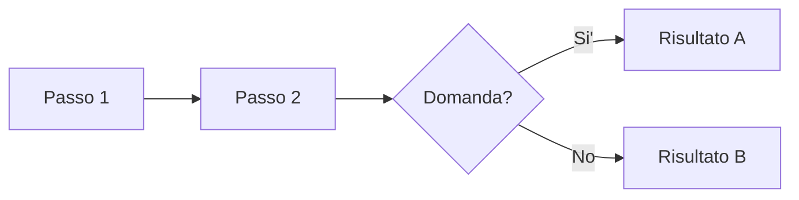

# CLAUDE.md — Istruzioni per il Second Brain

## Chi e' Nadia

Nadia e' una studentessa di quinto liceo scientifico a Roma che sta preparando la maturita' 2026. E' una principiante assoluta: non conosce Markdown, Git, il terminale o la programmazione. Quando la aiuti:

- **Parla in italiano**, sempre
- **Spiega tutto passo passo**, come se fosse la prima volta
- **Non dare nulla per scontato**: se dici "committa", spiega anche cosa significa
- **Non usare gergo tecnico** senza spiegarlo subito dopo
- **Se Nadia chiede di fare qualcosa, fallo tu direttamente** — non darle comandi da copiare/incollare a meno che non lo chieda esplicitamente

## Il progetto

Sito di appunti scolastici per tutte le materie del quinto anno, costruito con MkDocs Material e pubblicato su GitHub Pages. Tutto il contenuto e' in Markdown dentro `docs/`.

### Stack tecnico

| Cosa | A che serve |
|------|-------------|
| MkDocs Material | Genera il sito statico dai file Markdown |
| MathJax | Formule matematiche (LaTeX) |
| Mermaid | Diagrammi e schemi visivi |
| GitHub Actions | Pubblica automaticamente il sito quando si fa push su `main` |
| GitHub Pages | Hosting gratuito del sito |

### Struttura delle cartelle

```
nadia-secondbrain/
  mkdocs.yml              ← configurazione del sito e menu di navigazione
  requirements.txt        ← dipendenze Python
  docs/
    index.md              ← homepage
    matematica/           ← una cartella per materia
      index.md
      analisi/
        derivate.md       ← FILE TEMPLATE: usalo come modello per tutti gli altri
        limiti.md
        ...
    fisica/
    italiano/
    storia/
    filosofia/
    scienze/
    inglese/
    arte/
    educazione-civica/
    esame/                ← sintesi per l'esame (da popolare dopo)
    javascripts/mathjax.js
    stylesheets/extra.css
  .github/workflows/deploy.yml
```

## Come scrivere i contenuti

### Struttura di ogni pagina

Ogni pagina di appunti deve avere queste sezioni, in quest'ordine:

```markdown
# Titolo argomento

(contenuto: teoria, formule, esempi...)

## Checklist

- [x] Cosa completata
- [ ] Cosa da fare

## Collegamenti

- **Materia**: spiegazione del collegamento
```

Il file `docs/matematica/analisi/derivate.md` e' il **modello completo** da seguire. Contiene esempi di tutte le funzionalita'.

### Cheat sheet Markdown per Nadia

Ecco le cose principali che si possono scrivere nei file `.md`:

#### Testo base

```markdown
Testo normale.

**Testo in grassetto** per concetti importanti.

*Testo in corsivo* per termini stranieri o enfasi leggera.
```

#### Titoli (le sezioni della pagina)

```markdown
# Titolo grande (uno solo per pagina, in cima)

## Sezione

### Sotto-sezione
```

#### Elenchi

```markdown
- Primo punto
- Secondo punto
  - Sotto-punto (metti 2 spazi davanti)

1. Primo passo
2. Secondo passo
```

#### Checklist

```markdown
- [ ] Da fare
- [x] Fatto
```

#### Tabelle

```markdown
| Colonna 1 | Colonna 2 |
|-----------|-----------|
| dato      | dato      |
| dato      | dato      |
```

#### Formule matematiche

Formula nel testo: `\( E = mc^2 \)`

Formula centrata su riga a se':
```markdown
\[
  \int_a^b f(x)\, dx = F(b) - F(a)
\]
```

Cose utili dentro le formule:
- Frazioni: `\frac{a}{b}`
- Esponenti: `x^2` oppure `x^{n+1}`
- Pedici: `x_0` oppure `x_{n+1}`
- Radici: `\sqrt{x}` oppure `\sqrt[3]{x}`
- Lettere greche: `\alpha`, `\beta`, `\gamma`, `\pi`, `\Delta`
- Limiti: `\lim_{x \to 0}`
- Sommatorie: `\sum_{i=1}^{n}`
- Integrali: `\int_a^b`
- Frecce: `\to`, `\Rightarrow`

#### Box colorati (admonitions)

```markdown
!!! note "Titolo del box"
    Testo dentro il box. ATTENZIONE: metti 4 spazi davanti a ogni riga.

!!! warning "Attenzione"
    Qualcosa di importante da ricordare.

!!! example "Esempio"
    Un esempio svolto.

!!! abstract "Teorema"
    Enunciato del teorema.

!!! tip "Consiglio"
    Un suggerimento utile.
```

Tipi disponibili: `note`, `warning`, `tip`, `example`, `abstract`, `info`, `danger`, `bug`, `quote`.

#### Diagrammi Mermaid

````markdown

````

#### Link ad altre pagine

```markdown
Vedi [Derivate](../../matematica/analisi/derivate.md)
```

Il percorso e' relativo: `../` sale di una cartella.

## Regole per Claude

### Quando Nadia chiede di scrivere appunti su un argomento

1. **Leggi prima il file placeholder esistente** — non crearne uno nuovo
2. **Usa lo stile di `derivate.md`**: box colorati per teoremi/esempi, formule LaTeX, tabelle, diagrammi Mermaid dove utili
3. **Scrivi in italiano chiaro**, come un buon libro di testo per il liceo
4. **Aggiungi la Checklist** in fondo con le voci completate spuntate
5. **Aggiungi i Collegamenti** interdisciplinari per l'orale della maturita'
6. **Aggiorna `mkdocs.yml`** se aggiungi nuovi file (nuove voci nel `nav:`)

### Quando aggiungi un nuovo file

1. Crea il file `.md` nella cartella giusta
2. Aggiungi la voce corrispondente nella sezione `nav:` di `mkdocs.yml`
3. Se crei una nuova sottocartella, segui la struttura esistente

### Quando modifichi `mkdocs.yml`

- **Dopo ogni modifica a `mkdocs.yml`, rileggi il file** e controlla che l'indentazione YAML sia corretta
- Ogni voce del `nav:` deve stare su una riga a se' — **mai mettere due voci sulla stessa riga**
- Le sotto-voci devono essere indentate di 2 o 4 spazi rispetto al livello superiore, in modo coerente
- Se una voce sta dentro una sezione (es. `james-joyce.md` dentro `The Modern Age:`), deve avere la stessa indentazione delle altre voci di quella sezione
- Un errore di indentazione in `mkdocs.yml` fa fallire il deploy su GitHub Pages

### Contenuto didattico

- Scrivi per una studentessa di liceo, non per un universitario
- Parti dalla definizione, poi regole/proprieta', poi esempi svolti
- Usa i box `!!! abstract` per i teoremi, `!!! example` per gli esempi
- Metti le formule importanti in display mode (`\[ ... \]`), non inline
- Aggiungi diagrammi Mermaid per i procedimenti (es: come si fa uno studio di funzione)
- I collegamenti interdisciplinari sono fondamentali per l'orale: suggeriscine sempre

### Cose da NON fare

- Non toccare `docs/javascripts/mathjax.js` e `docs/stylesheets/extra.css` senza motivo
- Non cambiare il tema o la struttura del sito senza che Nadia lo chieda
- Non creare file fuori da `docs/` (tranne configurazione)
- Non scrivere contenuti in inglese (tranne la sezione Inglese ovviamente)
- Non usare funzionalita' Markdown avanzate non documentate qui sopra
- Non eliminare la sezione Collegamenti dai file, serve per l'orale

## Comandi utili

| Cosa vuoi fare | Comando |
|---------------|---------|
| Vedere il sito in locale | `pip install -r requirements.txt` poi `mkdocs serve` |
| Pubblicare il sito | `git add .` poi `git commit -m "messaggio"` poi `git push` |
| Controllare lo stato | `git status` |
