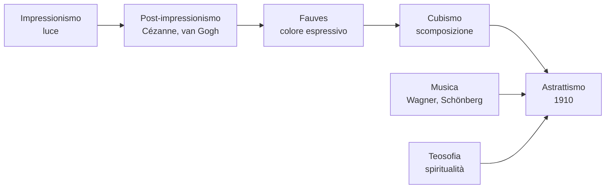

# Astrattismo

L'**Astrattismo** è la rivoluzione più radicale che la pittura abbia mai compiuto: per la prima volta in oltre venti secoli di storia dell'arte occidentale, un quadro **non rappresenta più nulla di riconoscibile**. Niente paesaggi, niente figure, niente nature morte: soltanto colori, linee, forme. Nasce intorno al **1910** e ha il suo padre indiscusso in **Vassily Kandinsky**, anche se subito accanto a lui altri pittori — Mondrian in Olanda, Malevič in Russia — arrivano allo stesso esito per strade diverse. Da quel momento, l'arte si divide in due grandi famiglie: la pittura figurativa (che continua a rappresentare) e la pittura astratta (che ha smesso di farlo). Tutto ciò che verrà dopo — Espressionismo astratto americano, Informale, Minimalismo — è figlio diretto di questa rottura.

## Il contesto

L'idea che si possa fare arte "senza soggetto" non nasce dal nulla. Per arrivarci la pittura ha percorso, nei cinquant'anni precedenti, un cammino di progressivo allontanamento dalla realtà visibile: l'**Impressionismo** aveva sciolto i contorni nella luce; il **Post-impressionismo** aveva mostrato che il colore poteva avere valore espressivo autonomo (van Gogh) e che la realtà poteva essere ridotta a volumi geometrici (Cézanne); i **Fauves** avevano usato colori arbitrari, non più naturali; il **Cubismo** aveva frantumato l'oggetto in piani. Mancava un solo passo: rinunciare del tutto a ciò che si vede.

A Kandinsky questo passo è suggerito anche da **influenze extra-artistiche**. Una fondamentale è la **musica**, in particolare quella di Wagner e Schönberg: la musica è arte non rappresentativa per definizione — non "imita" nulla, eppure suscita emozioni profondissime. Kandinsky si chiede: perché la pittura non potrebbe fare lo stesso? L'altra influenza è la **teosofia**, la corrente spirituale di Madame Blavatsky molto in voga ai primi del Novecento, che sosteneva che dietro la realtà visibile ci sia una realtà spirituale fatta di vibrazioni. Per Kandinsky il colore è proprio questo: una vibrazione spirituale che agisce direttamente sull'anima dello spettatore, senza bisogno di passare per la rappresentazione.

## Le due vie dell'astrattismo

Subito dopo la nascita, l'astrattismo si divide in due filoni che resteranno paralleli per tutto il Novecento:

- **Astrattismo lirico** — Kandinsky: forme libere, colori intensi, gestualità. Il quadro è un evento spirituale, una "improvvisazione" come un brano musicale.
- **Astrattismo geometrico** — Mondrian (Olanda, neoplasticismo), Malevič (Russia, suprematismo): linee dritte, angoli retti, forme primarie, colori puri. Il quadro tende a una purezza universale, matematica.

La verifica si concentra sul filone lirico, cioè su Kandinsky.

## Vassily Kandinsky

**Vassily Kandinsky** (Mosca 1866 – Neuilly-sur-Seine 1944) ha una biografia insolita: si laurea in legge ed economia a Mosca, e a trent'anni — un'età in cui un pittore di solito è già formato — molla tutto per studiare arte a Monaco di Baviera. La leggenda racconta due episodi-folgorazione: la vista di un quadro di Monet (un *Covone*) che gli rivela la potenza autonoma del colore, e il momento in cui rientra una sera nello studio e vede un suo quadro appoggiato di traverso, che non riconosce — ma trova bellissimo. Si rende conto allora che il **soggetto** non era quello che lo aveva colpito: era la composizione di colori e forme. Da lì parte la sua ricerca dell'astrazione.

La sua attività non è solo pittorica: è un teorico fondamentale, autore di due libri capitali — *Lo spirituale nell'arte* (1911) e *Punto e linea nel piano* (1926). La sua carriera attraversa quattro fasi geografiche: Monaco e Murnau (in Baviera, 1908-1914), Russia (rientra durante la guerra e vive la rivoluzione, 1914-1921), **Bauhaus** in Germania (Weimar e poi Dessau, 1922-1933, dove insegna), Parigi (1934-1944, dopo la chiusura del Bauhaus per ordine nazista).

### Le tre categorie: Impressioni, Improvvisazioni, Composizioni

Nel 1911 Kandinsky organizza la propria produzione astratta in tre categorie, che corrispondono a tre gradi crescenti di interiorità:

- **Impressioni**: nascono da un'**impressione** della realtà esterna, anche se trasfigurata. Sono ancora il punto più vicino al mondo visibile.
- **Improvvisazioni**: nascono in modo **spontaneo**, dall'inconscio, senza un piano preciso. Sono il corrispettivo pittorico dell'improvvisazione musicale.
- **Composizioni**: sono opere **costruite a lungo**, meditate, frutto di studi preparatori. Sono le sue "sinfonie", i lavori più ambiziosi e complessi. Le numera in serie: la più famosa è la *Composizione VIII* (1923), del periodo Bauhaus, già più geometrica.

La distinzione è importantissima: Kandinsky pensa la pittura **come un musicista pensa la musica**, e i titoli delle sue opere lo dicono apertamente.

### Il cavaliere azzurro (1903)

È un'opera molto precoce, ancora **figurativa**, ma già rivoluzionaria nel modo in cui i colori sono trattati. Si vede un **cavaliere su un cavallo bianco** al galoppo, di profilo, in un prato in pendenza punteggiato di luci e ombre, con sullo sfondo alcuni alberi scuri. Le forme non sono definite da contorni netti: il quadro è dipinto con **macchie di colore** accostate, in cui il cavaliere è quasi una sagoma blu in movimento.

Il dipinto è importante per due ragioni. Primo, segna l'avvio del percorso di Kandinsky verso l'astrazione: il "soggetto" cede progressivamente terreno al **colore puro**, e le pennellate larghe e mosse iniziano a vivere di vita propria, indipendentemente da ciò che rappresentano. Secondo, dà il nome al gruppo **Der Blaue Reiter** ("Il Cavaliere Azzurro"), fondato nel 1911 a Monaco con **Franz Marc**, una delle due grandi correnti dell'Espressionismo tedesco insieme a *Die Brücke*. Il blu, per Kandinsky, è il colore spirituale per eccellenza: «più si fa scuro più sveglia il desiderio dell'eterno».

### Cortile del castello (1908)

Dipinto durante il periodo di **Murnau**, la cittadina bavarese dove Kandinsky e la sua compagna Gabriele Münter hanno una casa, e dove avviene la sua trasformazione decisiva verso l'astrazione. L'opera mostra un cortile architettonico — muri, tetti, finestre, una scala — ma il riconoscimento del soggetto è già **molto difficile**: gli elementi dell'edificio sono ridotti a **macchie di colore puro**, gialli accesi, rossi, verdi, blu, accostate l'una all'altra senza mediazioni tonali e senza modellato.

È una pittura ancora figurativa, ma sull'orlo dell'astrazione: basta togliere ancora un po' il legame con il soggetto e l'ultimo passo è fatto. Influisce decisamente l'esperienza dell'**arte popolare bavarese** (i vetri dipinti, i santini), che Kandinsky e la Münter collezionano in quegli anni: linee marcate, colori piatti, niente prospettiva. È un quadro di transizione, in cui si vede in atto il passaggio dal motivo riconoscibile al **valore autonomo del colore**.

### Primo acquerello astratto (1910)

Considerato per convenzione la **prima opera astratta** della storia dell'arte. È un piccolo **acquerello su carta** in cui non c'è più nessun soggetto riconoscibile: solo macchie di colore — rossi, blu, verdi, neri — e linee fluide, ondulate, che corrono libere sullo sfondo bianco della carta. Non si vede una casa, un albero, una figura: solo forme libere che dialogano fra loro come in una composizione musicale.

Il quadro **non rappresenta nulla, ma "suona"**: è esattamente il programma di Kandinsky, una pittura che agisce sull'anima come la musica, attraverso forma e colore puri. La datazione è **discussa** dagli studiosi (alcuni propongono il 1913, perché Kandinsky avrebbe retrodatato l'opera per rivendicarne il primato cronologico contro Mondrian e Malevič), ma resta in ogni caso il simbolo della **nascita dell'astrattismo**. È una piccola opera su carta, dimessa nelle dimensioni, ma rivoluzionaria nelle conseguenze: tutta la pittura astratta del Novecento parte da qui.

### Punto e linea nel piano (1926)

Non è un quadro ma un **trattato teorico** scritto da Kandinsky e pubblicato nel 1926, durante il suo periodo al **Bauhaus** di Dessau. È il testo in cui Kandinsky codifica il **vocabolario della pittura astratta** come un grammatico codifica una lingua, definendo i tre elementi base:

- il **punto** (l'elemento minimo, statico, di tensione concentrata),
- la **linea** (un punto in movimento, dinamica, con direzioni e angoli che hanno significati diversi: una diagonale è "agitata", una verticale "fredda", un'orizzontale "calma"),
- il **piano** (la superficie su cui le forme prendono posto, anch'essa dotata di valori interni — l'alto è leggero, il basso è pesante, la sinistra è "lontana", la destra "casa").

Insieme a *Lo spirituale nell'arte* (1911), è il testo teorico fondamentale del Novecento per chi voglia capire il linguaggio della forma. Riflette anche l'**evoluzione personale** di Kandinsky: dall'astrattismo lirico delle origini si è passati, con l'esperienza Bauhaus, a un astrattismo più **geometrico e razionale**, dove le forme sono studiate scientificamente, quasi come oggetti di un manuale di fisica della percezione. È il momento in cui l'astrattismo si fa anche **didattica** e disciplina.

## Checklist

- [ ] Astrattismo: contesto, periodo, perché nasce
- [ ] Le influenze (Cézanne, Cubismo, musica, teosofia)
- [ ] Le due vie: lirico (Kandinsky) e geometrico (Mondrian, Malevič)
- [ ] Le tre categorie kandinskiane: Impressioni, Improvvisazioni, Composizioni
- [ ] Kandinsky — *Il cavaliere azzurro*
- [ ] Kandinsky — *Cortile del castello* (periodo Murnau)
- [ ] Kandinsky — *Primo acquerello astratto*
- [ ] Kandinsky — *Punto e linea nel piano* (trattato teorico)

## Collegamenti

- **Musica**: il legame è fondamentale. Kandinsky pensa la pittura come musica e ne adotta il vocabolario (improvvisazione, composizione). Riferimento centrale è **Arnold Schönberg**, di cui Kandinsky era amico, inventore della musica atonale che rompe con la tonalità tradizionale così come l'astrattismo rompe con la rappresentazione.
- **Filosofia**: la dimensione spirituale dell'astrattismo si lega al pensiero di **Bergson** (l'arte come accesso a una realtà più profonda della superficie razionale).
- **Storia**: Kandinsky vive la **Rivoluzione russa** (è in Russia dal 1914 al 1921), poi insegna al **Bauhaus** in Germania, scuola chiusa dai nazisti nel 1933. L'arte astratta sarà condannata sia dal nazismo (come "arte degenerata") sia dallo stalinismo (a favore del realismo socialista).
- **Italiano**: la rinuncia al soggetto può essere paragonata alla crisi della "trama" e dell'oggettività narrativa nei grandi romanzieri del Novecento (**Pirandello**, **Svevo**), o alla riduzione della parola al puro nucleo espressivo in **Ungaretti**: meno c'è, più c'è.
- **Inglese**: la frantumazione della struttura tradizionale e la ricerca di un linguaggio "puro" si ritrovano nello **stream of consciousness** di **Joyce** e **Virginia Woolf**, e nel collage poetico di **T.S. Eliot**.
- **Fisica**: la nuova fisica del primo Novecento (**relatività** e **meccanica quantistica**) mostra che la realtà non è quella che vediamo: c'è un livello sub-atomico fatto di onde, vibrazioni, energie. Kandinsky non è uno scienziato, ma respira la stessa idea.
