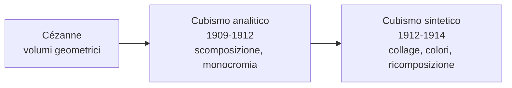

# Cubismo

Il **Cubismo** è la prima grande avanguardia del Novecento e una delle rotture più radicali con la tradizione pittorica occidentale. Nasce a Parigi tra il 1907 e il 1914 grazie a **Pablo Picasso** e **Georges Braque**, che lavorano fianco a fianco al punto che lo stesso Braque dirà: «Picasso e io eravamo come due alpinisti legati dalla stessa corda». Il nome stesso del movimento nasce per caso: nel 1908 il critico Louis Vauxcelles, vedendo i paesaggi geometrici di Braque, parlò sprezzantemente di «piccoli cubi». L'etichetta nasce come ironia, ma resta.

## Il contesto

All'inizio del Novecento la pittura si interroga sul senso stesso del rappresentare. L'Impressionismo aveva insegnato a dipingere ciò che si **vede**, l'attimo, la luce mutevole; il Post-impressionismo, soprattutto **Cézanne**, aveva già iniziato a scomporre la realtà in volumi geometrici essenziali — cilindro, cono, sfera. I cubisti vanno oltre: non vogliono dipingere ciò che si vede, ma ciò che si **sa** dell'oggetto. Una bottiglia ha un fondo, un fianco, un'imboccatura: il cubismo li mostra tutti insieme, da punti di vista diversi, sulla stessa tela.

Sono anni in cui anche la fisica e la filosofia stanno rivoluzionando l'idea di realtà. Einstein pubblica la teoria della relatività ristretta nel 1905, mettendo in crisi l'idea di uno spazio e di un tempo assoluti, mentre Bergson riflette sul tempo come durata, in cui passato, presente e futuro coesistono nella coscienza. La frantumazione cubista dello spazio è il corrispettivo pittorico di questa nuova visione del mondo. A questa rivoluzione contribuiscono anche le **arti extra-europee**, in particolare le maschere africane e la scultura iberica, che mostrano un modo non illusionistico di rappresentare il volto e il corpo: forme stilizzate, sintetiche, espressive.

## Le fasi del Cubismo

Il movimento attraversa due fasi principali:

- **Cubismo analitico** (1909-1912): l'oggetto viene scomposto, "analizzato" in faccette geometriche viste da più punti di vista contemporaneamente. La tavolozza è ridottissima — bruni, ocra, grigi — perché l'attenzione è tutta sulla forma, non sul colore. Il rischio è la quasi illeggibilità: i quadri sembrano puzzle da decifrare.
- **Cubismo sintetico** (1912-1914): l'oggetto viene "ricostruito" semplificandone la struttura. Tornano i colori, e soprattutto fa il suo ingresso il **collage**: ritagli di giornale, carta da parati, etichette incollate sulla tela. È una rivoluzione enorme — per la prima volta il quadro inserisce frammenti del mondo reale invece di imitarli.

## Picasso

**Pablo Picasso** (Málaga 1881 – Mougins 1973) è probabilmente l'artista più influente del Novecento. Spagnolo, figlio di un professore di disegno che intuisce subito il talento del figlio, dimostra fin da bambino abilità prodigiose: a quattordici anni dipinge già come un maestro accademico. Si trasferisce a Parigi nel 1900 e definitivamente nel 1904, stabilendosi nel Bateau-Lavoir di Montmartre, una vecchia palazzina di legno dove vivevano artisti poveri. La sua carriera è lunghissima e attraversa fasi stilistiche diversissime — periodo blu, periodo rosa, cubismo, neoclassicismo, surrealismo — al punto che si è detto che Picasso non è "un pittore" ma "molti pittori in uno". Il Cubismo è il momento più rivoluzionario di questa parabola, ma le sue trasformazioni continueranno per altri sessant'anni.

### Periodo blu (1901-1904)

Il primo grande momento di Picasso si apre con un trauma: il **suicidio dell'amico Carles Casagemas** nel febbraio 1901, che si toglie la vita in un caffè di Parigi davanti agli occhi degli amici. Picasso è giovanissimo — diciannove anni — e profondamente colpito. Da quel momento la sua pittura cambia radicalmente. La tavolozza si riduce quasi solo al **blu**, in tutte le sue gradazioni, dal turchino fondo al violetto pallido. I soggetti diventano figure marginali: mendicanti, ciechi, prostitute, vecchi, madri sole con bambini. Picasso stesso vive in questi anni in condizioni di **povertà**, divisi tra Barcellona e Parigi, in soffitte gelide dove brucia i propri disegni per scaldarsi.

Sul piano stilistico le figure sono **allungate**, magre, spigolose, con un'evidente eco della pittura di **El Greco**, il maestro manierista spagnolo che Picasso ammira profondamente. La luce è spenta, le scene sospese in un'atmosfera silenziosa e quasi religiosa. Non sono quadri "denuncia" della miseria sociale: sono piuttosto **meditazioni** sulla condizione umana, sulla solitudine e sull'esclusione.

#### Poveri in riva al mare (1903)

Sulla tela appaiono tre figure isolate su una spiaggia deserta: un **uomo** seduto, le ginocchia raccolte al petto, le braccia conserte, lo sguardo perso davanti a sé in una posa di muta sofferenza; una **donna** in piedi al suo fianco, magrissima, con un mantello che le copre il capo e i piedi nudi sulla sabbia, una mano sulla spalla del compagno in un gesto di consolazione che rimane però distante; un **bambino** ai loro piedi, accovacciato, intento a giocare con qualcosa di indistinto. L'orizzonte taglia il quadro circa a metà, separando un mare blu profondo da un cielo appena più chiaro. Non c'è altro nel paesaggio: né barche, né altre persone, né elementi narrativi che spieghino la situazione.

L'intero quadro è dipinto in **tonalità di blu**, con qualche tocco di violetto e bruno. Persino la pelle dei tre personaggi è bluastra, come se la luce stessa fosse spenta o fosse loro stata sottratta. I corpi sono **allungati e ossuti**: si vedono le costole sotto la pelle dell'uomo, le clavicole della donna, le gambe scarne del bambino. La pennellata è fluida e larga, senza quasi disegno preparatorio; la composizione si regge tutta sui pochi elementi essenziali — le tre figure, la linea dell'orizzonte, l'enorme campitura di mare e cielo. Il riferimento a **El Greco** è evidente nelle proporzioni allungate; quello a **Puvis de Chavannes** (un pittore simbolista francese amato dal giovane Picasso) si vede nella pacatezza solenne della composizione e nell'atmosfera quasi atemporale.

Il significato del quadro va cercato proprio nei silenzi. Le tre figure non si parlano e non si guardano: ognuna è chiusa nel proprio dolore. Il gesto della donna sulla spalla dell'uomo è l'unico segno di umanità presente, ma è un gesto silenzioso, che non riesce a oltrepassare la solitudine. La spiaggia non è un luogo di vacanza ma uno **spazio metafisico**, un margine ai limiti del mondo, dove le persone sono come naufragate. Il blu, qui, non è un colore: è uno stato d'animo. È il colore della **malinconia, della povertà, della morte** — temi che Picasso vive direttamente in quegli anni e che proietta nei suoi soggetti con una forza espressiva enorme. È un'opera in cui Picasso, ancora del tutto figurativo, mostra già la propria capacità di **dire molto con pochissimo**: una manciata di figure, un'unica gamma cromatica, un orizzonte. È un principio di economia espressiva che ritroveremo, in forma molto diversa, anche nel Cubismo.

### Periodo rosa (1904-1906)

Tra la fine del 1904 e il 1906 la tavolozza di Picasso si schiarisce. Il blu freddo lascia spazio a tonalità più calde — **rosa, ocra, terra di Siena, malva** — e i soggetti si spostano dal mondo dei mendicanti a quello del **circo**: arlecchini, saltimbanchi, acrobati, ballerine, equilibristi. È il momento in cui Picasso conosce **Fernande Olivier**, sua prima grande compagna, e inizia a frequentare il circo Médrano a Montmartre. La svolta è anche economica: Picasso comincia a vendere qualche quadro grazie al sostegno dei collezionisti americani Leo e Gertrude Stein, e la sua condizione migliora.

I saltimbanchi non sono però soggetti gioiosi. Sono figure **liminari**, persone che vivono ai margini della società ma con un loro orgoglio, una loro grazia. Picasso si identifica con loro — l'artista come saltimbanco, colui che vive di spettacolo ma è radicalmente diverso da chi lo guarda — e arrivata a far diventare l'**arlecchino** una sorta di proprio alter ego, che ricomparirà nei suoi quadri per decenni. Lo stile è più dolce di quello del Periodo Blu: le figure sono ancora allungate ma meno spigolose, i contorni più morbidi, l'atmosfera più sognante.

#### Famiglia di saltimbanchi (1905)

È un quadro grande, più di due metri di altezza, che raccoglie sei figure in un paesaggio quasi astratto. Da sinistra a destra si vedono: un **arlecchino** alto, in costume a losanghe, di profilo, che tiene per mano una bambina vestita di bianco; un **omone vestito di rosso**, di spalle, con un sacco sulle spalle e un cappello a punta da giullare; una piccola **acrobata** seminuda in costume bianco; un **ragazzo** con un tamburo a tracolla; e infine, seduta in disparte sulla destra, una **donna vestita di rosa** che guarda altrove con un'espressione enigmatica. Il fondo è una distesa brulla, color sabbia, sotto un cielo azzurrino tendente al bianco: un paesaggio che non rappresenta nessun luogo preciso, ma sembra una scena fuori dal mondo, sospesa nel tempo.

La struttura compositiva è studiatissima. I personaggi sono raggruppati in modo che lo sguardo dello spettatore si muova lungo una diagonale: dall'alto a sinistra (l'arlecchino) verso il basso a destra (la donna seduta). Eppure, nonostante questa unità formale, le figure **non comunicano tra loro**: nessuno guarda nessun altro. La donna è separata dal gruppo, anche fisicamente; la bambina dà la mano all'arlecchino ma guarda da un'altra parte; l'omone è di spalle; persino la piccola acrobata sembra persa nei propri pensieri. Picasso costruisce così un paradosso: una "famiglia" che fisicamente esiste, ma psicologicamente è fatta di solitudini accostate.

L'arlecchino in primo piano è un **autoritratto** simbolico: Picasso si ritrae come saltimbanco, come artista nomade che vive di spettacolo. È un ruolo che riflette la sua condizione reale — straniero a Parigi, povero ma orgoglioso — e che porta con sé una lunga tradizione iconografica, da Watteau in poi: il saltimbanco è l'**emblema dell'artista come outsider**, vicino al pubblico eppure inafferrabile, capace di emozionare ma destinato alla solitudine. Il quadro fu profondamente amato dal poeta **Apollinaire**, amico di Picasso, che gli dedicò versi famosi: «Saltimbanchi miei, di passaggio sulle strade del mondo». La *Famiglia di saltimbanchi* chiude in un certo senso il primo Picasso — quello ancora figurativo, narrativo, malinconico — e prepara il terreno alla rottura che arriverà di lì a poco con *Les Demoiselles d'Avignon*.

### Verso il Cubismo

Tra il 1906 e il 1907 Picasso vive una crisi creativa: sente di dover andare oltre il proprio stile, di rompere con tutto. In quegli anni due esperienze lo segnano in modo decisivo. La prima è la riscoperta della **scultura iberica preromana**, esposta al Louvre, che lo colpisce per le sue forme essenziali, spigolose, geometriche, lontanissime dall'idealizzazione classica. La seconda è la visita al **Museo etnografico del Trocadéro** a Parigi, dove vede per la prima volta da vicino le **maschere africane**: oggetti che non sono "primitivi" come pensavano gli europei, ma frutto di una visione del mondo radicalmente diversa, in cui la rappresentazione del volto non cerca la somiglianza ma la potenza espressiva. Picasso uscirà da quel museo cambiato per sempre.

#### Les Demoiselles d'Avignon (1907)

È un quadro enorme, oltre due metri e mezzo di lato, e mostra **cinque donne nude** disposte in una stanza spoglia, separate da un drappeggio azzurro che cade dall'alto come un sipario. Davanti a loro, in primo piano, c'è una piccola natura morta con dei frutti su un tavolo — una cesta di uva e un melone tagliato a fetta. Le donne sono prostitute: il titolo originale del quadro era infatti *Le bordel d'Avignon*, "Il bordello di Avignon", e si riferisce non alla città francese, ma a una via di Barcellona — **Carrer d'Avinyó** — dove al tempo c'erano case di tolleranza che Picasso frequentava da giovane.

Le cinque figure non sono però dipinte allo stesso modo. Le **due al centro** hanno volti relativamente "leggibili", anche se stilizzati come scultura iberica, con grandi occhi a mandorla e nasi affilati. La figura **all'estrema sinistra** è quasi di profilo, con un volto che ricorda i ritratti egizi e un colore di pelle terracotta. Ma le **due figure di destra** sono completamente diverse: i loro volti sono **maschere africane** — ovali deformati, scarificazioni a strisce parallele, occhi storti, un naso che è quasi un becco. Una di loro, in basso a destra, è in una posa contorta e impossibile: il busto frontale, le gambe di tre quarti, la testa girata di scatto come se stesse fissando lo spettatore con violenza. I corpi nudi non hanno più la rotondità classica: sono **spigolosi**, tagliati come da una lama, fatti di angoli acuti e piani sovrapposti. Lo spazio attorno a loro non si apre in profondità ma si frantuma in schegge color blu, marrone, rosa.

Quando Picasso lo mostra agli amici nel 1907, la reazione è di sgomento: persino i suoi sostenitori più fedeli — Matisse, Braque, Apollinaire — sono **scioccati**. Lo trovano violento, brutto, "sbagliato". Picasso lo ritira nello studio e lo tiene **arrotolato per anni**: il quadro non sarà esposto pubblicamente fino al 1916 e non sarà compreso davvero fino agli anni Venti. Eppure è proprio qui, in questa tela rifiutata, che nasce il **Cubismo**: la prospettiva tradizionale è abolita, l'idealizzazione del nudo classico distrutta, lo spazio frantumato. *Les Demoiselles* è il punto zero da cui parte tutta l'arte del Novecento. Da questo quadro nasceranno il Cubismo analitico, il Cubismo sintetico, l'astrazione, e per estensione persino il Surrealismo. Picasso stesso, parlando dell'incontro con le maschere africane al Trocadéro, dirà: «In quel momento ho capito perché ero pittore».

### Il Cubismo analitico

Dopo *Les Demoiselles*, tra il 1909 e il 1912, Picasso e Braque sviluppano insieme un linguaggio del tutto nuovo. L'oggetto viene **smontato** in faccette geometriche viste da più punti di vista contemporaneamente — di fronte, di lato, dall'alto — e poi rimontato sulla tela in un puzzle. La tavolozza si riduce drasticamente: solo **bruni, ocra, grigi, talvolta verdi spenti**, perché il colore distrarrebbe dalla forma. Il rischio, in questa fase, è la **quasi illeggibilità** del quadro: gli oggetti diventano così frammentati da fondersi con lo sfondo. Per aiutare lo spettatore, Picasso e Braque iniziano a inserire piccoli indizi figurativi — una corda di violino, un manico di chitarra, le lettere di un'insegna — come ancore che permettono di "leggere" il quadro.

#### Violino (1912)

Sulla tela non si vede subito un violino: si vede un fitto reticolo di **piani geometrici** sovrapposti, in tonalità di bruno, beige e grigio, illuminati da lumi e ombre che non corrispondono a nessuna fonte di luce reale. Solo guardando con attenzione si distinguono gli **elementi caratteristici** dello strumento: la curva di una cassa armonica, il manico con i piroli, il ponticello, le **effe** (le aperture a forma di "f"), una corda tesa. Picasso non li mostra però da un unico punto di vista: la cassa è vista dall'alto, le effe di fronte, il manico di lato. È come se l'occhio dello spettatore avesse girato intorno al violino e ne avesse messo insieme tutte le viste in un'unica immagine.

La **tavolozza monocromatica** è una scelta precisa: in questa fase Picasso e Braque vogliono che il colore non interferisca con l'analisi della forma. È la stessa logica di un disegno scientifico. La luce è "diffusa", quasi cubista anch'essa: ogni piano ha la propria luminosità interna, indipendente dagli altri. Lo spazio si **appiattisce**: non c'è più una distinzione netta tra oggetto e sfondo, perché lo spazio attorno al violino è frammentato come il violino stesso, e i due si compenetrano. È il principio della **compenetrazione fra oggetto e ambiente**, che diventerà fondamentale anche nel Futurismo.

Il senso ultimo del quadro è una riflessione su **come si vede**. La pittura tradizionale, dal Rinascimento in poi, aveva mostrato l'oggetto da un unico punto di vista, fisso — quello del pittore davanti al cavalletto. Il Cubismo dice: «Ma noi non vediamo così. Quando guardiamo un oggetto, ci muoviamo intorno, lo prendiamo in mano, lo conosciamo da angolature diverse». Il quadro cubista è **un tempo in cui lo sguardo si muove**, condensato su una tela. Per questo si può dire che il Cubismo è "la quarta dimensione in pittura", cioè il **tempo** introdotto nello spazio: l'oggetto non è più un istante fissato, ma una *durata visiva*.

### Il Cubismo sintetico

Nel 1912 Picasso compie un altro gesto rivoluzionario: introduce in pittura il **collage**. Comincia a incollare sulla tela frammenti di realtà — pezzi di giornale, carta da parati, etichette, tela cerata stampata, biglietti del tram — accanto ai colori dipinti. È un'innovazione enorme, perché per la prima volta la pittura **smette di imitare la realtà** e la **inserisce direttamente** nel quadro. Un pezzo di giornale incollato non è la rappresentazione di un giornale: è un giornale. La distinzione tra arte e vita inizia a sfumarsi.

Il Cubismo sintetico riprende anche i **colori**, che erano stati banditi dalla fase analitica: tornano i rossi, i verdi, i gialli, anche se sempre dentro un'organizzazione geometrica. Le forme si semplificano: invece di scomporre l'oggetto in mille faccette, si tende a "ricostruirlo" con pochi piani essenziali, riconoscibili. Il quadro diventa più sintetico — da qui il nome — e più decorativo.

#### Natura morta con sedia impagliata (1912)

È un piccolo quadro di forma **ovale**, dipinto su una tela racchiusa da una **corda di canapa** che fa da cornice, anch'essa scelta come elemento dell'opera. Sulla tela compaiono tre cose principali. In basso si vede una **fascia di paglia intrecciata** — ma non è dipinta: è un pezzo di **tela cerata stampata** che imita la paglia, incollata sulla tela. È letteralmente un *finto vero*: un materiale industriale che imita un altro materiale (la paglia), scelto per simulare ciò che il pittore avrebbe potuto dipingere. Sopra, in una composizione cubista di piani sovrapposti, si distinguono oggetti tipici di un caffè parigino: un **bicchiere**, una **fetta di limone**, una **pipa**, un **giornale** di cui si leggono solo le tre lettere **JOU** (probabilmente l'inizio di *journal*). Il tutto è cinto dalla corda, che funziona come la cornice di un quadro tradizionale ma è anche un oggetto reale, come la tela cerata.

Questo è il **primo collage della storia dell'arte** moderna. Picasso si chiede: *cosa significa rappresentare?* Se voglio dipingere la paglia di una sedia, posso farlo a olio, certo. Ma posso anche prendere un pezzo di tela cerata che imita la paglia e incollarlo: il risultato sarà più "vero" o meno "vero"? E il pezzo di tela cerata, a sua volta, è già un'imitazione della paglia, fatta in fabbrica. Quindi nel quadro c'è: la realtà (la corda, la tela cerata fisica), un'imitazione industriale della realtà (la paglia stampata), e la pittura (il bicchiere, la pipa). Tre livelli diversi del rapporto fra **immagine e realtà**, mescolati nella stessa opera.

L'effetto è straniante. Lo spettatore non sa più cosa "leggere" come dipinto e cosa come oggetto. Ed è proprio questo il punto: Picasso scardina la **convenzione fondamentale** della pittura occidentale, secondo cui un quadro è una *finestra* su un altro mondo, dipinto a olio. Da ora in poi, il quadro può essere anche un **oggetto** che contiene altri oggetti. Senza questo gesto sarebbero impensabili, decenni dopo, l'**assemblage**, la **pop art** (con i suoi pezzi di pubblicità incollati), l'**arte concettuale** e il **ready-made** di Duchamp. È un'opera piccola ma micidiale: cambia per sempre cosa può essere un quadro.

### Guernica (1937)

Anche dopo la stagione propriamente cubista, Picasso continua a usarne il linguaggio. L'esempio più celebre è *Guernica*, il quadro forse più famoso del Novecento, dipinto in poche settimane per il padiglione della Repubblica spagnola all'**Esposizione universale di Parigi del 1937**. La commissione era arrivata pochi mesi prima, quando Picasso era ancora indeciso sul soggetto. Poi, il **26 aprile 1937**, l'aviazione tedesca della *Legione Condor*, alleata dei franchisti durante la guerra civile spagnola, bombardò la cittadina basca di **Guernica**, considerata simbolo della resistenza repubblicana. Era giorno di mercato, la città era piena di civili: morirono centinaia di persone, soprattutto donne e bambini. Era la **prima volta nella storia** che un'aviazione bombardava deliberatamente una popolazione civile a scopo di terrore. Picasso, che era a Parigi e leggeva i giornali con orrore, decise: il suo quadro per l'Esposizione sarebbe stato su questo.

Il quadro è una **tela monumentale**, 3,49 metri d'altezza per 7,77 di larghezza, dipinta interamente in **bianco, nero e grigio**, come una pagina di giornale o una fotografia di cronaca. La scelta è deliberata: niente colori "da quadro", niente bellezza, niente seduzione visiva — solo la nudità della cronaca. La composizione è un **trittico ideale**, organizzato come un grande timpano triangolare. Al centro, sotto una lampada elettrica nuda che pende dall'alto come un occhio, **un cavallo agonizza** con la testa rovesciata e la bocca spalancata in un urlo, una lancia conficcata nel fianco. A sinistra, un **toro** dallo sguardo umano, immobile, sembra osservare la scena; sotto di lui, una **madre** con un **bambino morto** in braccio leva il viso al cielo gridando, il volto deformato dal dolore in una smorfia di puro strazio. A destra, una **donna** si affaccia da una finestra con un **lume in mano**, il braccio teso come per illuminare l'orrore; sotto di lei, un'altra figura femminile **fugge** con le gambe scoperte; a terra, un **soldato** è caduto, smembrato, con la spada spezzata in mano e un fiore che spunta accanto. In alto, sopra ogni cosa, c'è la **lampadina elettrica**, e accanto un'antica **lucerna a olio**.

Le figure sono tutte costruite con il linguaggio cubista: **piani geometrici sovrapposti**, sguardi multipli, scomposizione del corpo. Ma il Cubismo qui non è più un esercizio formale: è il linguaggio della **frantumazione del mondo**, lo specchio di un universo a pezzi. Ogni figura è anche un **simbolo**. Il **toro** rappresenta secondo alcuni la brutalità, secondo altri la Spagna stessa, immobile e silenziosa di fronte al dolore; il **cavallo** è il popolo innocente, ferito e urlante; la **madre con il bambino** è una *Pietà* moderna, la maternità violata dalla guerra; la **lampadina elettrica** (in spagnolo *bombilla*, parola simile a *bomba*) è la luce della modernità che diventa luce di bombardamento; la **lucerna ad olio**, antica, è la luce della verità che resiste, portata dalla donna alla finestra.

*Guernica* non è un quadro "di battaglia" come quelli di Géricault o Delacroix: non racconta un evento, ma ne distilla l'**essenza universale**. Picasso non dipinge le bombe, non dipinge gli aerei, non dipinge nemmeno Guernica: dipinge l'**orrore della guerra** in quanto tale. Per questo il quadro è diventato il manifesto pacifista del Novecento, simbolo di tutte le guerre e di tutte le stragi di civili. Picasso disse che il quadro sarebbe potuto tornare in Spagna **solo dopo la fine del franchismo**: e così è stato, nel 1981, sei anni dopo la morte di Franco. Oggi è esposto al Museo Reina Sofía di Madrid.

## Braque

**Georges Braque** (Argenteuil 1882 – Parigi 1963) è il co-fondatore del Cubismo, fondamentale tanto quanto Picasso, anche se la sua personalità più riservata lo ha lasciato in secondo piano nella memoria collettiva. Inizia come **fauvista** e dipinge paesaggi dai colori violenti, poi nel 1907, vedendo *Les Demoiselles d'Avignon*, ne è prima sconvolto, poi conquistato. Conosce Picasso, e da quel momento i due lavorano fianco a fianco: trascorrono insieme le estati a Céret, sui Pirenei, dipingono nello stesso studio, talvolta non firmano i quadri perché vogliono che l'invenzione cubista appaia come opera collettiva. Le opere di quegli anni sono talvolta **difficilmente distinguibili** se non si guarda la firma. È Braque, più di Picasso, ad applicare il Cubismo soprattutto al **paesaggio** e alla **natura morta**, evitando quasi sempre il corpo umano. La loro collaborazione si interrompe con la Prima guerra mondiale: Braque parte volontario, è ferito gravemente alla testa nel 1915, riprende a dipingere a fatica. Dopo la guerra continuerà a dipingere ancora per quarant'anni, sviluppando uno stile cubista più morbido e personale.

### Case all'Estaque (1908)

Il quadro mostra un piccolo gruppo di **case** addossate l'una all'altra in un paese provenzale, *L'Estaque*, vicino a Marsiglia, dove Braque trascorre l'estate del 1908. Le case sono ridotte a **volumi cubici essenziali**, parallelepipedi con tetti spioventi: non hanno né finestre, né porte, né dettagli decorativi. Sono pure forme geometriche. Intorno alle case, una vegetazione ridotta anch'essa a poche masse compatte di verde: alberi che sembrano coni, fronde che sembrano sfere. Nessuna figura umana, nessun cielo aperto: solo l'architettura del paesaggio.

La cosa più sconvolgente è la **prospettiva**, o meglio, la sua **abolizione**. In un quadro tradizionale le case lontane sarebbero più piccole, quelle vicine più grandi, e ci sarebbe un punto di fuga che organizza tutto. In *Case all'Estaque*, invece, le costruzioni sembrano **impilate l'una sull'altra**, come se Braque le avesse viste tutte insieme da diverse angolazioni e poi le avesse appiattite sulla tela. Lo spazio non si apre in profondità: si **chiude** sulla superficie. Anche la luce è costruita "a costruita pezzi": ogni faccia di ogni casa ha la propria luminosità interna, indipendente dalle altre, come se ogni cubo avesse un sole proprio.

L'omaggio a **Cézanne** è esplicito. Cézanne aveva passato gli ultimi anni della vita proprio nei dintorni di Aix-en-Provence, non lontano da L'Estaque, e aveva scritto in una famosa lettera al pittore Émile Bernard: «Bisogna trattare la natura per mezzo del **cilindro, della sfera, del cono**». Braque ha preso quella frase alla lettera e l'ha portata all'estremo: dove Cézanne ancora rispettava la prospettiva, Braque la cancella del tutto. È proprio davanti a questo quadro (e ad altri simili della stessa serie), presentato al Salon d'Automne del 1908, che il critico **Louis Vauxcelles** scrisse l'articolo in cui parlava ironicamente di «*petits cubes*», «piccoli cubi». Da quella frase, nata come ridicolizzazione, è venuto il nome stesso del movimento: **Cubismo**. *Case all'Estaque* è dunque, in senso letterale, **il quadro che ha dato il nome al Cubismo**.

### Violino e brocca (1910)

Si tratta di un **olio su tela** di formato verticale che mostra, in una composizione cubista analitica, due oggetti familiari: un **violino** e una **brocca** appoggiati su un piano. Ma a un primo sguardo non si vede né l'uno né l'altra: si vede una **selva di piani geometrici** marrone, beige, grigi, frantumati e sovrapposti, con luci e ombre che non rispondono a una fonte di luce reale ma sembrano interne a ogni piano. Solo dopo qualche istante di osservazione si distinguono indizi: una **curva** che è il fianco del violino, due **effe** parallele, il **manico** con i piroli, e più in alto la sagoma circolare e tondeggiante della **brocca**. Tutto è scomposto, smontato, mostrato da angolazioni diverse: il violino sembra simultaneamente di fronte e di lato, la brocca dall'alto e di fronte.

C'è però un dettaglio che rompe l'analisi: in alto, vicino al bordo superiore della tela, Braque dipinge un **chiodo realistico**, con la testa metallica e l'ombra proiettata sul muro, come se reggesse il quadro stesso. È un *trompe-l'œil*, un inganno ottico: in mezzo alla totale astrazione cubista, **l'unico elemento dipinto realisticamente** è quel chiodo. È un gesto profondamente **ironico** e profondamente filosofico. Braque sta dicendo: «Voi guardate questo quadro pensando che sia astratto, ma vedete come è facile rappresentare *realisticamente* qualcosa? Basta dipingere un chiodo. Eppure è proprio quel chiodo, dipinto in modo così convenzionale, ad essere l'unica cosa *davvero finta* del quadro: è solo pittura. Il violino e la brocca, anche se scomposti, sono frutto di una vera analisi visiva, di un vero studio. Il chiodo è l'illusione».

È una riflessione sulla natura stessa della pittura: **cosa è più vero, l'imitazione o l'analisi?** E ancora: **cosa significa rappresentare?** Sono le stesse domande che, due anni dopo, porteranno Picasso al collage di *Natura morta con sedia impagliata*. *Violino e brocca* è uno dei capolavori del Cubismo analitico e mostra come Braque, oltre all'invenzione formale, fosse capace di una sottile ironia teorica.

## Checklist

- [ ] Cubismo: contesto, periodo, perché nasce
- [ ] Differenza tra Cubismo analitico e sintetico
- [ ] Picasso — Periodo blu (*Poveri in riva al mare*)
- [ ] Picasso — Periodo rosa (*Famiglia di saltimbanchi*)
- [ ] Picasso — *Les Demoiselles d'Avignon*
- [ ] Picasso — *Violino* (cubismo analitico)
- [ ] Picasso — *Natura morta con sedia impagliata* (collage, cubismo sintetico)
- [ ] Picasso — *Guernica*
- [ ] Braque — *Case all'Estaque*
- [ ] Braque — *Violino e brocca*

## Collegamenti

- **Filosofia**: la simultaneità dei punti di vista cubisti dialoga con la filosofia di **Bergson** e il suo concetto di tempo come *durata*, in cui passato, presente e futuro coesistono nella coscienza. Il quadro cubista è in fondo l'equivalente visivo del tempo bergsoniano.
- **Fisica**: la **relatività ristretta** di Einstein (1905), pubblicata pochi anni prima del cubismo, mette in crisi l'idea di uno spazio e di un tempo assoluti. Il cubismo non si rifà direttamente a Einstein, ma respira la stessa aria culturale: l'idea che la realtà non sia un dato oggettivo ma dipenda dal punto di vista dell'osservatore.
- **Storia**: *Guernica* è il quadro-simbolo del Novecento bellico — guerra civile spagnola, ascesa dei totalitarismi, bombardamenti sulla popolazione civile. Si lega all'**ascesa del nazismo** e al concetto di guerra totale.
- **Letteratura italiana**: la frantumazione cubista del soggetto può essere accostata alla scomposizione dell'io in **Pirandello** (*Uno, nessuno e centomila*) e alla simultaneità dei piani temporali in **Svevo** (*La coscienza di Zeno*). Anche lì il punto di vista unico viene messo in crisi.
- **Letteratura inglese**: la stessa simultaneità si ritrova nello *stream of consciousness* di **Joyce** e **Virginia Woolf**: lo spazio cubista frantumato corrisponde al tempo psicologico spezzettato del modernismo.
