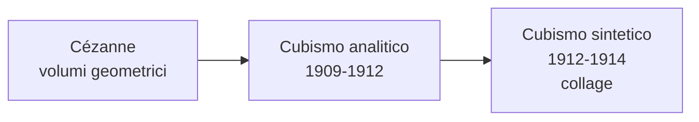

# Cubismo

Il **Cubismo** è la prima grande avanguardia del Novecento e una delle rotture più radicali con la tradizione pittorica occidentale. Nasce a Parigi tra il 1907 e il 1914 grazie a **Pablo Picasso** e **Georges Braque**, che lavorano fianco a fianco — Braque dirà: «Picasso e io eravamo come due alpinisti legati dalla stessa corda». Il nome nasce per caso dalla stroncatura del critico Vauxcelles, che nel 1908 parlò sprezzantemente di «piccoli cubi».

## Il contesto

L'Impressionismo aveva dipinto ciò che si **vede**, i cubisti vogliono dipingere ciò che si **sa**. Una bottiglia ha un fondo, un fianco, un'imboccatura: il Cubismo li mostra tutti insieme sulla stessa tela. Il punto di partenza è **Cézanne** — «trattare la natura per mezzo del cilindro, della sfera, del cono». Importanti anche le **maschere africane** e la **scultura iberica**. Sullo sfondo, la **relatività di Einstein** (1905) e la filosofia di **Bergson** che mettono in crisi spazio e tempo assoluti.

## Le fasi del Cubismo

- **Cubismo analitico** (1909-1912): l'oggetto è scomposto in faccette geometriche viste da più punti di vista. Tavolozza ridotta a bruni, ocra, grigi.
- **Cubismo sintetico** (1912-1914): l'oggetto è "ricostruito" con pochi piani. Tornano i colori, e fa il suo ingresso il **collage**: per la prima volta il quadro inserisce frammenti di realtà invece di imitarli.

## Picasso

**Pablo Picasso** (Málaga 1881 – Mougins 1973) è probabilmente l'artista più influente del Novecento. Si trasferisce a Parigi nel 1904. La sua carriera attraversa fasi diversissime — periodo blu, periodo rosa, cubismo, neoclassicismo, surrealismo — al punto che si è detto che non è "un pittore" ma "molti pittori in uno".

### Periodo blu (1901-1904)

Si apre con un trauma: il **suicidio dell'amico Carles Casagemas** nel 1901. La tavolozza si riduce quasi solo al **blu** e i soggetti diventano figure marginali — mendicanti, ciechi, prostitute. Le figure, allungate alla maniera di **El Greco**, sono meditazioni silenziose.

#### Poveri in riva al mare (1903)

Tre figure isolate su una spiaggia desolata: un uomo seduto con le ginocchia raccolte, una donna magrissima in piedi con la mano sulla sua spalla, un bambino accovacciato ai loro piedi. Tutto il quadro è in **tonalità di blu**, persino la pelle dei corpi; i personaggi sono allungati alla maniera di El Greco. Il senso sta nei silenzi: nessuno guarda nessun altro, ognuno è chiuso nel proprio dolore. La spiaggia è uno **spazio metafisico** ai limiti del mondo, e il blu non è solo un colore ma uno **stato d'animo** — povertà, malinconia, morte.

### Periodo rosa (1904-1906)

La tavolozza si schiarisce in **rosa, ocra, terra di Siena**. I soggetti sono il mondo del **circo** — saltimbanchi, arlecchini, acrobati — con cui Picasso si identifica.

#### Famiglia di saltimbanchi (1905)

Sei figure in un paesaggio brullo color sabbia: un **arlecchino** in costume a losanghe che tiene per mano una bambina vestita di bianco; un omone in rosso di spalle; una piccola acrobata; un ragazzo con un tamburo; e in disparte una **donna seduta vestita di rosa** che guarda altrove. La composizione è studiata, ma le figure **non comunicano fra loro**: Picasso costruisce una "famiglia" che esiste fisicamente ma psicologicamente è fatta di solitudini accostate. L'arlecchino è un **autoritratto** simbolico: l'artista come saltimbanco, outsider che vive di spettacolo ma è destinato all'isolamento.

### Verso il Cubismo

Tra il 1906 e il 1907 due esperienze cambiano Picasso: la riscoperta della **scultura iberica** al Louvre e la visita al **Trocadéro**, dove vede da vicino le **maschere africane**.

#### Les Demoiselles d'Avignon (1907)

Una tela enorme (oltre 2,5 m di lato) mostra **cinque donne nude** in una stanza spoglia. Sono prostitute: il titolo si riferisce a **Carrer d'Avinyó**, una via di Barcellona. Le tre figure di sinistra hanno volti stilizzati come scultura iberica; le **due di destra hanno maschere africane** al posto del viso. I corpi sono spigolosi, tagliati come da una lama; lo spazio si frantuma in schegge. Quando Picasso lo mostra agli amici, persino Matisse e Braque lo trovano troppo violento: lo arrotola e lo nasconde nello studio per anni. Eppure è qui che nasce il Cubismo — la prospettiva è abolita, l'idealizzazione del nudo classico distrutta. È il **punto zero da cui parte tutta l'arte del Novecento**.

### Cubismo analitico

L'oggetto è smontato in faccette geometriche e rimontato sulla tela, in tavolozza ridotta a bruni, ocra e grigi.

#### Violino (1912)

Un fitto reticolo di **piani geometrici sovrapposti** in tonalità di bruno e grigio. Solo dopo qualche istante si distinguono manico, **effe** (le aperture a forma di "f"), corde, cassa armonica — mostrati da angolazioni diverse: la cassa dall'alto, le effe di fronte, il manico di lato. È una riflessione su come si **vede**: noi non guardiamo gli oggetti da un solo punto fisso, ci muoviamo intorno. Il quadro cubista è **un tempo in cui lo sguardo si muove**, condensato sulla tela: per questo si parla del Cubismo come di una "quarta dimensione" in pittura.

### Cubismo sintetico

Nel 1912 Picasso introduce il **collage**: incolla sulla tela pezzi di giornale, etichette, tela cerata. La pittura **smette di imitare la realtà** e la inserisce direttamente.

#### Natura morta con sedia impagliata (1912)

Un piccolo quadro **ovale**, racchiuso da una **corda di canapa** che fa da cornice. In basso compare una fascia di paglia intrecciata — ma non è dipinta: è **tela cerata stampata** incollata direttamente. Sopra, in una composizione cubista, oggetti di un caffè parigino — bicchiere, limone, pipa — e le lettere **JOU** (probabilmente *journal*). È il **primo collage della storia dell'arte moderna** e mette a confronto **tre livelli del rapporto fra immagine e realtà**: la realtà fisica (corda, tela cerata), un'imitazione industriale (la paglia stampata), la pittura. Da qui nasceranno assemblage, pop art e arte concettuale.

### Guernica (1937)

Dipinto in poche settimane per il padiglione della **Repubblica spagnola** all'Esposizione di Parigi del 1937, dopo il bombardamento del **26 aprile 1937** della cittadina basca da parte dell'aviazione tedesca alleata di Franco — la prima volta nella storia che un'aviazione bombardava deliberatamente civili. La tela è monumentale (3,49 × 7,77 m) e dipinta solo in **bianco, nero e grigio**, come una pagina di giornale.

Al centro un **cavallo** agonizza sotto una **lampadina elettrica**, il muso spalancato in un urlo. A sinistra un **toro** dallo sguardo umano osserva immobile; sotto di lui una **madre** leva al cielo il volto deformato dal dolore con un **bambino morto** in braccio. A destra una **donna con un lume** si affaccia da una finestra; a terra un **soldato** caduto con la spada spezzata. Il quadro non racconta un evento ma ne distilla l'**essenza universale**: il toro è la brutalità (o la Spagna), il cavallo il popolo innocente, la madre una *Pietà* moderna, la lampadina (in spagnolo *bombilla*, vicino a *bomba*) la luce della modernità che diventa bombardamento. Picasso disse che il quadro sarebbe tornato in Spagna solo dopo la fine del franchismo: così è stato, nel 1981.

## Braque

**Georges Braque** (Argenteuil 1882 – Parigi 1963) è il co-fondatore del Cubismo. Inizia come fauvista, poi nel 1907 vede *Les Demoiselles* e ne resta sconvolto. Lavora con Picasso fianco a fianco e applica il Cubismo soprattutto al **paesaggio** e alla **natura morta**.

### Case all'Estaque (1908)

Un piccolo gruppo di **case** in un paese provenzale dove aveva lavorato anche Cézanne. Le costruzioni sono ridotte a **volumi cubici essenziali** — parallelepipedi con tetti spioventi, senza finestre, senza porte. La cosa più sconvolgente è l'**abolizione della prospettiva**: le case sembrano impilate l'una sull'altra, come viste da angolazioni diverse e appiattite sulla tela. È un omaggio diretto a **Cézanne**. È proprio davanti a questo quadro che Vauxcelles scrisse di «piccoli cubi»: in senso letterale, è il **quadro che ha dato il nome al Cubismo**.

### Violino e brocca (1910)

Un **violino** e una **brocca** scomposti in piani geometrici grigi e bruni, mostrati da angolazioni diverse. Un dettaglio rompe l'analisi: in alto Braque dipinge un **chiodo realistico** in *trompe-l'œil*, con la testa metallica e l'ombra proiettata, come se reggesse il quadro. In mezzo all'astrazione cubista, **l'unico elemento dipinto realisticamente è il chiodo** — che però, proprio per questo, è l'unica cosa davvero finta del quadro. Cosa è più "vero", l'imitazione o l'analisi?

## Checklist

- [ ] Cubismo: contesto, periodo, perché nasce
- [ ] Differenza tra Cubismo analitico e sintetico
- [ ] Picasso — *Poveri in riva al mare* (periodo blu)
- [ ] Picasso — *Famiglia di saltimbanchi* (periodo rosa)
- [ ] Picasso — *Les Demoiselles d'Avignon*
- [ ] Picasso — *Violino* (analitico)
- [ ] Picasso — *Natura morta con sedia impagliata* (sintetico, collage)
- [ ] Picasso — *Guernica*
- [ ] Braque — *Case all'Estaque*
- [ ] Braque — *Violino e brocca*

## Collegamenti

- **Filosofia**: la simultaneità dei punti di vista cubisti dialoga con **Bergson** e il tempo come *durata*.
- **Fisica**: la **relatività** di Einstein (1905) mette in crisi spazio e tempo assoluti — la stessa aria culturale del Cubismo.
- **Storia**: *Guernica* è il quadro-simbolo del Novecento bellico, si lega all'**ascesa del nazismo**.
- **Italiano**: la frantumazione cubista del soggetto si accosta a **Pirandello** (scomposizione dell'io) e a **Svevo** (simultaneità temporale).
- **Inglese**: la stessa simultaneità è nello *stream of consciousness* di **Joyce** e **Virginia Woolf** e nel collage poetico di **T.S. Eliot**.
