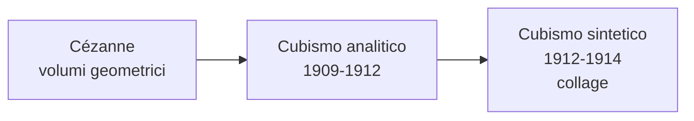

# Cubismo

Il **Cubismo** è la prima grande avanguardia del Novecento e una delle rotture più radicali con la tradizione pittorica occidentale. Nasce a Parigi tra il 1907 e il 1914 grazie a **Pablo Picasso** e **Georges Braque**, che lavorano fianco a fianco — Braque dirà: «Picasso e io eravamo come due alpinisti legati dalla stessa corda». Il nome nasce per caso dalla stroncatura del critico Vauxcelles, che nel 1908 parlò sprezzantemente di «piccoli cubi».

## Il contesto

All'inizio del Novecento la pittura si interroga sul senso stesso del rappresentare. L'**Impressionismo** aveva insegnato a dipingere ciò che si **vede** — l'attimo, la luce mutevole. Il Post-impressionismo, soprattutto **Cézanne**, aveva già scomposto la realtà in volumi geometrici essenziali (cilindro, cono, sfera) e costruito lo spazio non più con la prospettiva rinascimentale ma con piani di colore. I cubisti vanno oltre: non vogliono dipingere ciò che si vede da un punto di vista unico, ma ciò che si **sa** dell'oggetto. Una bottiglia ha un fondo, un fianco, un'imboccatura: il Cubismo li mostra tutti insieme, da angolature diverse, sulla stessa tela. È una pittura che porta in sé la dimensione del **tempo**: non un istante ma un percorso dello sguardo.

A questa rivoluzione contribuiscono anche le **arti extra-europee** scoperte a Parigi nei primi anni del Novecento: le **maschere africane** e la **scultura iberica preromana**, che mostrano un modo non illusionistico di rappresentare il volto, lontano dall'idealizzazione classica. Sullo sfondo culturale, la **relatività ristretta** di Einstein (1905) mette in crisi spazio e tempo assoluti, e la filosofia di **Bergson** afferma che il tempo non è una serie di istanti separati ma una *durata*. Il Cubismo è il corrispettivo pittorico di queste idee.

## Le fasi del Cubismo

- **Cubismo analitico** (1909-1912): l'oggetto viene scomposto in faccette geometriche viste da più punti di vista contemporaneamente. La tavolozza è ridotta a **bruni, ocra, grigi** perché il colore distrarrebbe dall'analisi della forma. Per evitare la quasi illeggibilità si inseriscono piccoli **indizi figurativi** — corde, lettere, manici — come ancore visive.
- **Cubismo sintetico** (1912-1914): l'oggetto viene "ricostruito" con pochi piani essenziali. Tornano i **colori** e fa il suo ingresso il **collage**: per la prima volta il quadro non *imita* la realtà ma la **inserisce direttamente**, attraverso ritagli di giornale, etichette, tela cerata stampata.

## Picasso

**Pablo Picasso** (Málaga 1881 – Mougins 1973) è probabilmente l'artista più influente del Novecento. Spagnolo, dimostra fin da bambino abilità prodigiose. Si trasferisce a Parigi nel 1900, definitivamente nel 1904, stabilendosi nel **Bateau-Lavoir** di Montmartre. La sua carriera attraversa fasi diversissime — periodo blu, periodo rosa, cubismo, neoclassicismo, surrealismo — al punto che si è detto che non è "un pittore" ma "molti pittori in uno". Il Cubismo è il momento più rivoluzionario di una carriera lunghissima, durante la quale Picasso si reinventa più volte.

### Periodo blu (1901-1904)

Il primo grande momento di Picasso si apre con un trauma: il **suicidio dell'amico Carles Casagemas** nel 1901. La pittura cambia radicalmente: la **tavolozza si riduce quasi solo al blu**, in tutte le sue gradazioni, al punto che persino la pelle dei corpi appare bluastra. I **soggetti** diventano figure marginali — mendicanti, ciechi, prostitute, vecchi, madri sole — non come denuncia sociale ma come **meditazioni** sulla condizione umana e sull'esclusione. Lo **stile** mostra eco evidenti di **El Greco** (proporzioni allungate, corpi scarni, gesti solenni) e dell'atmosfera atemporale del simbolismo francese. Il blu non è un colore ma uno **stato d'animo**: malinconia, povertà, morte. Picasso vive lui stesso in povertà tra Barcellona e Parigi: il Periodo Blu è anche un'autobiografia indiretta.

#### Poveri in riva al mare (1903)

**Soggetto**: una famiglia povera (uomo, donna, bambino) su una spiaggia desolata. **Composizione**: essenzialissima, divisa in due fasce orizzontali (mare e cielo) tagliate dalle figure verticali, con un'organizzazione triangolare che chiude il gruppo in una forma compatta. La **tavolozza** si gioca tutta su un'unica gamma di blu: l'effetto monocromatico unifica figure e ambiente in un'atmosfera di silenzio. Le **pennellate** sono fluide e larghe, senza disegno preparatorio visibile; i corpi sono allungati alla maniera di **El Greco**. Il **tema** è la solitudine: le figure non si guardano, e nemmeno il gesto della donna sulla spalla dell'uomo crea contatto. La spiaggia è uno **spazio metafisico**, un margine ai limiti del mondo. Picasso non vuole rappresentare la miseria sociale ma trasformarla in **immagine universale** della condizione umana.

### Periodo rosa (1904-1906)

La tavolozza si schiarisce in tonalità calde — **rosa, ocra, terra di Siena**. Il cambiamento è insieme **emotivo, biografico e iconografico**: Picasso conosce **Fernande Olivier**, comincia a vendere quadri grazie ai collezionisti **Stein**, la sua condizione migliora. I **soggetti** si spostano dal mondo dei mendicanti a quello del **circo** — saltimbanchi, arlecchini, acrobati — che Picasso frequenta a Montmartre. Sono però figure **liminari**: persone che vivono ai margini ma con orgoglio. Picasso si **identifica con loro** (l'artista come saltimbanco, outsider che vive di spettacolo) e fa dell'**arlecchino** il proprio alter ego, una maschera ricorrente che ricomparirà nei suoi quadri per decenni. Lo **stile** si fa più dolce: figure ancora allungate ma meno spigolose, contorni morbidi, atmosfere sognanti.

#### Famiglia di saltimbanchi (1905)

**Soggetto**: sei artisti circensi in un paesaggio brullo color sabbia. **Composizione**: lo sguardo è guidato lungo una **diagonale** dal vertice in alto a sinistra (l'arlecchino) al basso a destra (la donna seduta in disparte). Una struttura formale unitaria, ma **psicologicamente dissociata**: le figure non comunicano, nessuno guarda nessuno. Picasso costruisce così un paradosso — una "famiglia" che esiste fisicamente ma è fatta di solitudini accostate. La **tavolozza** è dominata da rosa, ocra, azzurri tenui, con i toni più caldi sulle figure per staccarle dal fondo. Il **tema** centrale è la condizione dell'**artista come outsider**: l'arlecchino in primo piano è un autoritratto simbolico di Picasso, e l'intera scena è un'allegoria di chi vive di spettacolo ma è destinato all'isolamento.

### Verso il Cubismo

Tra il 1906 e il 1907 due esperienze cambiano Picasso: la **riscoperta della scultura iberica preromana** al Louvre e la visita al **Museo etnografico del Trocadéro**, dove vede da vicino le **maschere africane**. Di queste lo colpisce non l'esotismo, ma la **potenza espressiva non illusionistica** del volto: una via radicalmente alternativa alla tradizione classica. Picasso uscirà da quel museo cambiato per sempre.

#### Les Demoiselles d'Avignon (1907)

È l'opera-cerniera del Novecento. **Soggetto**: cinque prostitute di un bordello (il titolo si riferisce a *Carrer d'Avinyó*, una via di Barcellona). **Composizione**: frontale e simmetrica, ma viene fatta esplodere — lo spazio non si apre in profondità ma si **frantuma in schegge** di colore che si compenetrano con i corpi. Le **figure** sono dipinte con stili diversi nella stessa tela, fatto inaudito: le tre di sinistra hanno volti stilizzati come **scultura iberica**, le due di destra hanno **maschere africane** con scarificazioni e nasi a becco; una di esse è in posa contorta, con il busto frontale e la testa girata di scatto. I **corpi** sono spigolosi, fatti di angoli acuti. Il quadro distrugge consapevolmente tre convenzioni della pittura occidentale: la **prospettiva rinascimentale**, l'**idealizzazione del nudo classico**, lo **stile unitario**. Quando Picasso lo mostra agli amici, persino Matisse e Braque lo trovano troppo violento: lo arrotola e lo nasconde nello studio. Eppure è da qui che parte tutta l'arte del Novecento.

#### Violino (1912)

Esempio classico del **Cubismo analitico**. **Composizione**: il violino è scomposto in un fitto reticolo di **piani geometrici sovrapposti**, ognuno corrispondente a una vista parziale dello strumento — cassa armonica dall'alto, effe di fronte, manico di lato, corde tese a tratti. I piani si compenetrano con lo sfondo, abolendo la distinzione fra oggetto e ambiente. La **tavolozza** è ridotta a tre toni di bruno e grigio, con luci e ombre interne a ogni piano, indipendenti da una fonte di luce reale. Il **tema** profondo non è il violino ma il **modo di vedere**: noi non guardiamo gli oggetti da un solo punto fisso, ci muoviamo intorno. Il quadro cubista è in fondo **un tempo in cui lo sguardo si muove**, condensato sulla tela: per questo si è parlato del Cubismo come di una "quarta dimensione" introdotta in pittura.

#### Natura morta con sedia impagliata (1912)

È il **primo collage della storia dell'arte moderna** e segna il passaggio al **Cubismo sintetico**. **Composizione**: quadro ovale racchiuso da una **corda di canapa** che fa da cornice; in basso una fascia di "paglia" che non è dipinta ma è un pezzo di **tela cerata stampata** incollato direttamente; sopra, in una composizione cubista più semplificata, oggetti tipici di un caffè parigino — bicchiere, fetta di limone, pipa — e le lettere **JOU** (probabilmente *journal*). Picasso introduce un **principio rivoluzionario**: il quadro non *imita* più la realtà, la **inserisce**. Si confrontano tre livelli del rapporto fra immagine e cosa: la realtà fisica (corda, tela cerata), un'imitazione industriale già pre-confezionata (la paglia stampata in fabbrica), la pittura. Il gesto scardina la convenzione fondamentale del quadro come *finestra* su un altro mondo, e apre la strada ad **assemblage**, **pop art** e **arte concettuale**.

#### Guernica (1937)

Anche dopo la fase cubista propria, Picasso continua a usarne il linguaggio. *Guernica* è dipinto in poche settimane per il padiglione della **Repubblica spagnola** all'Esposizione di Parigi del 1937, in risposta al bombardamento del **26 aprile 1937** della cittadina basca da parte dell'aviazione tedesca alleata di Franco. La tela è monumentale (3,49 × 7,77 m). **Tavolozza**: solo bianco, nero e grigio, scelta deliberata per evocare la nudità di una pagina di giornale ed escludere ogni seduzione coloristica. **Composizione**: organizzata come un grande timpano triangolare con vertice al centro, dominato da una **lampadina elettrica** che illumina la scena come un occhio.

**Iconografia**: ogni figura è insieme realistica e simbolica. Al centro un **cavallo** agonizzante (il popolo innocente); a sinistra un **toro** dallo sguardo umano (la brutalità, o forse la Spagna stessa); sotto, una **madre** con un **bambino morto** in braccio (una *Pietà* moderna); a destra una **donna con un lume** (la verità che illumina); a terra un **soldato** caduto con la spada spezzata. La **lampadina** elettrica (*bombilla* in spagnolo, vicino a *bomba*) è la luce della modernità che diventa luce di bombardamento. Picasso non racconta un evento ma ne **distilla l'essenza universale**: non dipinge le bombe, non gli aerei, ma l'orrore della guerra in quanto tale. È diventato il manifesto pacifista del Novecento. Picasso disse che sarebbe tornato in Spagna solo dopo la fine del franchismo: così è stato, nel 1981.

## Braque

**Georges Braque** (Argenteuil 1882 – Parigi 1963) è il co-fondatore del Cubismo. Inizia come **fauvista**, poi nel 1907 vede *Les Demoiselles d'Avignon* nello studio di Picasso e ne resta sconvolto. Da quel momento i due lavorano in strettissima collaborazione, al punto che le loro opere di quegli anni sono **difficilmente distinguibili** se non si guarda la firma. Braque applica il Cubismo soprattutto al **paesaggio** e alla **natura morta**, evitando quasi sempre il corpo umano. La collaborazione si interrompe con la Prima guerra mondiale: Braque parte volontario, è ferito gravemente alla testa nel 1915, riprende a dipingere a fatica.

#### Case all'Estaque (1908)

**Soggetto**: un piccolo gruppo di case di un paese provenzale (lo stesso dove aveva lavorato Cézanne). **Composizione**: l'elemento più rivoluzionario è l'**abolizione della prospettiva** — le case sembrano impilate l'una sull'altra, schiacciate su un unico piano. Le forme sono ridotte a **volumi cubici essenziali**: parallelepipedi con tetti spioventi, senza finestre, senza porte. Anche la vegetazione è geometrizzata. La **luce** è "a pezzi": ogni faccia ha la propria luminosità interna, indipendente dalle altre. Il **tema** è l'omaggio esplicito a **Cézanne**, che aveva scritto «trattare la natura per mezzo del cilindro, della sfera, del cono»: Braque prende la frase alla lettera e la porta all'estremo. È proprio davanti a questo quadro che Vauxcelles scrisse di «piccoli cubi», dando — involontariamente — il nome al movimento.

#### Violino e brocca (1910)

Tipico esempio di **Cubismo analitico**. **Composizione**: violino e brocca sono scomposti in piani geometrici grigi e bruni e mostrati da angolazioni diverse; oggetti e ambiente si compenetrano al punto da fondersi, e gli indizi visivi (cassa armonica, effe, manico) emergono solo dopo qualche istante. Un dettaglio rompe però la coerenza analitica: in alto Braque dipinge un **chiodo realistico** in *trompe-l'œil*, con la testa metallica e l'ombra proiettata, come se reggesse il quadro. È un **gesto teorico**: in mezzo all'astrazione cubista, l'unico elemento dipinto in modo realistico è il chiodo — che però, paradossalmente, è l'unica cosa davvero **finta** del quadro, mentre il violino e la brocca scomposti sono il frutto di una vera analisi visiva. Braque pone così la domanda fondamentale del Cubismo: che cos'è "vero" in pittura, l'**imitazione tradizionale** o l'**analisi cubista**?

## Checklist

- [ ] Cubismo: contesto, periodo, perché nasce
- [ ] Differenza tra Cubismo analitico e sintetico
- [ ] Picasso — *Poveri in riva al mare* (periodo blu)
- [ ] Picasso — *Famiglia di saltimbanchi* (periodo rosa)
- [ ] Picasso — *Les Demoiselles d'Avignon*
- [ ] Picasso — *Violino* (analitico)
- [ ] Picasso — *Natura morta con sedia impagliata* (sintetico, collage)
- [ ] Picasso — *Guernica*
- [ ] Braque — *Case all'Estaque*
- [ ] Braque — *Violino e brocca*

## Collegamenti

- **Filosofia**: la simultaneità dei punti di vista cubisti dialoga con **Bergson** e il tempo come *durata*. Il quadro cubista è l'equivalente visivo del tempo bergsoniano.
- **Fisica**: la **relatività** di Einstein (1905) mette in crisi spazio e tempo assoluti — la stessa aria culturale del Cubismo.
- **Storia**: *Guernica* è il quadro-simbolo del Novecento bellico, si lega all'**ascesa del nazismo**.
- **Italiano**: la frantumazione cubista del soggetto si accosta a **Pirandello** (scomposizione dell'io) e a **Svevo** (simultaneità temporale).
- **Inglese**: la stessa simultaneità è nello *stream of consciousness* di **Joyce** e **Virginia Woolf** e nel collage poetico di **T.S. Eliot**.
