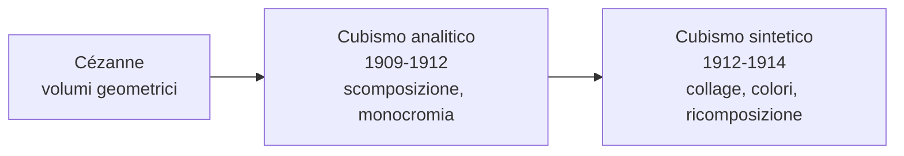

# Cubismo

Il **Cubismo** è la prima grande avanguardia del Novecento e una delle rotture più radicali con la tradizione pittorica occidentale. Nasce a Parigi tra il 1907 e il 1914 grazie a **Pablo Picasso** e **Georges Braque**, che lavorano fianco a fianco al punto che lo stesso Braque dirà: «Picasso e io eravamo come due alpinisti legati dalla stessa corda». Il nome del movimento nasce per caso: nel 1908 il critico Louis Vauxcelles, vedendo i paesaggi geometrici di Braque, parlò sprezzantemente di «piccoli cubi». L'etichetta nasce come ironia, ma resta.

## Il contesto

All'inizio del Novecento la pittura si interroga sul senso stesso del rappresentare. L'Impressionismo aveva insegnato a dipingere ciò che si **vede**, l'attimo, la luce mutevole; il Post-impressionismo, soprattutto **Cézanne**, aveva già iniziato a scomporre la realtà in volumi geometrici essenziali — cilindro, cono, sfera. I cubisti vanno oltre: non vogliono dipingere ciò che si vede, ma ciò che si **sa** dell'oggetto. Una bottiglia ha un fondo, un fianco, un'imboccatura: il cubismo li mostra tutti insieme, da punti di vista diversi, sulla stessa tela.

Sono anni in cui anche la fisica e la filosofia stanno rivoluzionando l'idea di realtà. Einstein pubblica la teoria della relatività ristretta nel 1905, mentre Bergson riflette sul tempo come *durata*: la frantumazione cubista dello spazio è il corrispettivo pittorico di questa nuova visione. A questa rivoluzione contribuiscono anche le **arti extra-europee**, in particolare le maschere africane e la scultura iberica, che mostrano un modo non illusionistico di rappresentare il volto e il corpo: forme stilizzate, sintetiche, espressive.

## Le fasi del Cubismo

- **Cubismo analitico** (1909-1912): l'oggetto viene scomposto in faccette geometriche viste da più punti di vista contemporaneamente. La tavolozza è ridottissima — bruni, ocra, grigi — perché l'attenzione è sulla forma, non sul colore.
- **Cubismo sintetico** (1912-1914): l'oggetto viene "ricostruito" semplificandone la struttura. Tornano i colori, e soprattutto fa il suo ingresso il **collage**: ritagli di giornale, carta da parati, etichette incollate sulla tela. Per la prima volta il quadro inserisce frammenti del mondo reale invece di imitarli.

## Picasso

**Pablo Picasso** (Málaga 1881 – Mougins 1973) è probabilmente l'artista più influente del Novecento. Spagnolo, dimostra fin da bambino abilità prodigiose. Si trasferisce definitivamente a Parigi nel 1904, dove vive nel **Bateau-Lavoir** di Montmartre. La sua carriera attraversa fasi stilistiche diversissime — periodo blu, periodo rosa, cubismo, neoclassicismo, surrealismo — al punto che si è detto che Picasso non è "un pittore" ma "molti pittori in uno". Il Cubismo è il momento più rivoluzionario di questa parabola.

### Periodo blu (1901-1904)

Il primo grande momento di Picasso si apre con un trauma: il **suicidio dell'amico Carles Casagemas** nel 1901. Da quel momento la tavolozza si riduce quasi solo al **blu**, in tutte le sue gradazioni. I soggetti diventano figure marginali — mendicanti, ciechi, prostitute, vecchi — e Picasso stesso vive in povertà, dividendosi tra Barcellona e Parigi. Le figure sono **allungate** e ossute, con un'eco evidente della pittura di **El Greco**. Il blu è qui colore della malinconia, della povertà, della morte.

#### Poveri in riva al mare (1903)

Su una spiaggia desolata si vedono tre figure: un uomo seduto con le ginocchia raccolte al petto, una donna magrissima in piedi al suo fianco con la mano sulla sua spalla, un bambino accovacciato ai loro piedi. L'orizzonte taglia la tela a metà, il mare e il cielo sono entrambi azzurri. L'intero quadro è dipinto in **tonalità di blu**, persino la pelle dei corpi. Le figure sono allungate alla maniera di El Greco, ossute, scarne; la pennellata è fluida, la composizione essenziale.

Il senso del quadro sta nei silenzi. I tre personaggi non si guardano e non si parlano: ciascuno è chiuso nella propria sofferenza. Il gesto della donna è l'unico segno di umanità, ma non riesce a oltrepassare la solitudine. La spiaggia non è un luogo di vacanza ma uno **spazio metafisico**, un margine ai limiti del mondo. Il blu non è solo un colore ma uno stato d'animo: Picasso mostra di saper dire molto con pochissimi mezzi — una manciata di figure, un'unica gamma cromatica, un orizzonte.

### Periodo rosa (1904-1906)

La tavolozza si schiarisce: il blu lascia spazio a **rosa, ocra, terra di Siena**. I soggetti si spostano dal mondo dei mendicanti a quello del **circo** — saltimbanchi, arlecchini, acrobati — che Picasso frequenta a Montmartre. Sono figure **liminari**, persone che vivono ai margini ma con orgoglio: Picasso si identifica con loro e fa dell'arlecchino una sorta di proprio alter ego, che ricomparirà nei suoi quadri per decenni. Lo stile è più dolce, le figure meno spigolose, l'atmosfera più sognante.

#### Famiglia di saltimbanchi (1905)

Sei figure si dispongono in un paesaggio brullo color sabbia, sotto un cielo bianco-azzurrino: un **arlecchino** in costume a losanghe che tiene per mano una bambina vestita di bianco; un **omone vestito di rosso** di spalle, con un sacco e un cappello da giullare; una piccola **acrobata** seminuda; un **ragazzo** con un tamburo; e in disparte, sulla destra, una **donna seduta vestita di rosa** che guarda altrove. Il fondo è un paesaggio fuori dal tempo, sospeso.

La struttura è studiata per guidare lo sguardo lungo una diagonale, eppure le figure **non comunicano fra loro**: nessuno guarda nessun altro. Picasso costruisce una "famiglia" che esiste fisicamente ma psicologicamente è fatta di solitudini accostate. L'arlecchino in primo piano è un **autoritratto** simbolico: l'artista come saltimbanco, come outsider che vive di spettacolo ma è destinato all'isolamento. È un'immagine emblematica della condizione dell'artista, che il poeta Apollinaire (amico di Picasso) celebrerà in versi famosi.

### Verso il Cubismo

Tra il 1906 e il 1907 due esperienze cambiano Picasso per sempre: la riscoperta della **scultura iberica preromana** al Louvre e la visita al **Museo etnografico del Trocadéro**, dove vede da vicino le **maschere africane**. Da queste folgorazioni nasce l'opera che apre il Cubismo.

#### Les Demoiselles d'Avignon (1907)

Una tela enorme (più di 2,5 metri di lato) mostra **cinque donne nude** in una stanza spoglia, separate da un drappeggio azzurro che cade come un sipario. Sono prostitute: il titolo non si riferisce alla città francese ma a una via di Barcellona, **Carrer d'Avinyó**, dove si trovavano case di tolleranza. Le figure non sono dipinte allo stesso modo: le tre di sinistra hanno volti stilizzati come scultura iberica, mentre **le due di destra hanno maschere africane** al posto del viso, con scarificazioni a strisce e nasi a becco. Una di loro, in basso a destra, è in una posa contorta e impossibile. I corpi sono spigolosi, tagliati come da una lama; lo spazio attorno si frantuma in schegge di colore.

Quando Picasso lo mostra agli amici nel 1907, la reazione è di **sgomento**: persino Matisse e Braque lo trovano troppo violento. Picasso lo arrotola e lo nasconde nello studio per anni. Eppure è qui che nasce il Cubismo: la prospettiva tradizionale è abolita, l'idealizzazione del nudo classico distrutta, lo spazio frantumato. *Les Demoiselles* è il punto zero da cui parte tutta l'arte del Novecento.

### Il Cubismo analitico

Tra il 1909 e il 1912 Picasso e Braque sviluppano insieme il **Cubismo analitico**: l'oggetto viene smontato in faccette geometriche viste da più punti di vista e poi rimontato sulla tela. La tavolozza si riduce a **bruni, ocra, grigi** perché il colore distrarrebbe dalla forma. Per evitare la totale illeggibilità, Picasso e Braque inseriscono piccoli indizi figurativi — corde di violino, lettere, manici — come ancore visive.

#### Violino (1912)

Sulla tela non si vede subito un violino: si vede un fitto reticolo di **piani geometrici** sovrapposti, in tonalità di bruno e grigio. Solo guardando con attenzione si distinguono il manico, le **effe** (le aperture a forma di "f"), le corde, la cassa armonica. Picasso non li mostra però da un unico punto di vista: la cassa è vista dall'alto, le effe di fronte, il manico di lato. L'occhio dello spettatore ha "girato intorno" allo strumento e ne ha messo insieme tutte le viste in un'unica immagine.

Il senso ultimo del quadro è una riflessione su **come si vede**. La pittura tradizionale aveva mostrato l'oggetto da un unico punto di vista fisso. Il Cubismo dice: noi non vediamo così — quando guardiamo qualcosa, ci muoviamo intorno, lo prendiamo in mano, lo conosciamo da angolature diverse. Il quadro cubista è **un tempo in cui lo sguardo si muove**, condensato su una tela: per questo si parla del Cubismo come "quarta dimensione in pittura".

### Il Cubismo sintetico

Nel 1912 Picasso introduce in pittura il **collage**: incolla sulla tela frammenti di realtà — pezzi di giornale, carta da parati, etichette, tela cerata stampata — accanto al colore dipinto. Per la prima volta la pittura **smette di imitare la realtà** e la **inserisce direttamente** nel quadro. Tornano anche i colori, banditi dalla fase analitica, e le forme si semplificano.

#### Natura morta con sedia impagliata (1912)

È un piccolo quadro **ovale**, racchiuso da una **corda di canapa** che fa da cornice. Sulla tela compare in basso una **fascia di paglia intrecciata** — ma non è dipinta: è un pezzo di **tela cerata stampata** che imita la paglia, incollato direttamente. Sopra, in una composizione cubista di piani sovrapposti, si distinguono oggetti tipici di un caffè parigino: un bicchiere, una fetta di limone, una pipa, e le lettere **JOU** (probabilmente l'inizio di *journal*, "giornale").

È il **primo collage della storia dell'arte** moderna. Picasso si chiede: cosa significa rappresentare? Se voglio dipingere la paglia di una sedia, posso farlo a olio, oppure posso incollare un pezzo di tela cerata che imita la paglia. Il risultato sarà più "vero" o meno "vero"? Il quadro mette così a confronto **tre livelli del rapporto fra immagine e realtà**: la realtà fisica (la corda, la tela cerata), un'imitazione industriale (la paglia stampata), la pittura. Da questo gesto nasceranno l'assemblage, la pop art e tutta l'arte concettuale.

### Guernica (1937)

Anche dopo la fase strettamente cubista, Picasso continua a usarne il linguaggio. *Guernica* è il quadro forse più famoso del Novecento, dipinto in poche settimane per il padiglione della **Repubblica spagnola** all'Esposizione universale di Parigi del 1937. Il **26 aprile 1937** l'aviazione tedesca, alleata di Franco durante la guerra civile, aveva bombardato la cittadina basca di Guernica nel giorno di mercato: era la prima volta nella storia che un'aviazione bombardava deliberatamente civili a scopo di terrore. Picasso, sconvolto, decise: il suo quadro per l'Esposizione sarebbe stato su questo.

La tela è monumentale (3,49 × 7,77 m) e dipinta solo in **bianco, nero e grigio**, come una pagina di giornale: niente colori, niente bellezza, solo la nudità della cronaca. La composizione è organizzata come un grande timpano triangolare. Al centro, sotto una **lampadina elettrica** che pende dall'alto come un occhio, un **cavallo** agonizza con la bocca spalancata in un urlo. A sinistra, un **toro** dallo sguardo umano osserva immobile; sotto di lui, una **madre** alza al cielo il volto deformato dal dolore, con un **bambino morto** in braccio. A destra, una **donna con un lume** si affaccia da una finestra; sotto, una figura femminile fugge; a terra, un **soldato** è caduto smembrato, con la spada spezzata. Tutte le figure sono costruite con il linguaggio cubista: piani geometrici sovrapposti, sguardi multipli.

Il quadro non è una "scena di battaglia": non racconta un evento, ne distilla l'**essenza universale**. Picasso non dipinge le bombe, non gli aerei, non Guernica: dipinge l'orrore della guerra in quanto tale. Il toro è la brutalità (o la Spagna stessa); il cavallo il popolo innocente; la madre con il bambino una *Pietà* moderna; la lampadina elettrica (in spagnolo *bombilla*, vicino a *bomba*) la luce della modernità che diventa luce di bombardamento; la lucerna a olio la verità che resiste. Il quadro è diventato il manifesto pacifista del Novecento. Picasso disse che sarebbe potuto tornare in Spagna solo dopo la fine del franchismo: e così è stato, nel 1981.

## Braque

**Georges Braque** (Argenteuil 1882 – Parigi 1963) è il co-fondatore del Cubismo. Inizia come **fauvista**, poi nel 1907 vede *Les Demoiselles d'Avignon* e ne resta sconvolto. Da quel momento lavora con Picasso fianco a fianco, al punto che le loro opere di quegli anni sono talvolta difficilmente distinguibili. È Braque, più di Picasso, ad applicare il Cubismo soprattutto al **paesaggio** e alla **natura morta**, evitando quasi sempre il corpo umano. La loro collaborazione si interrompe con la Prima guerra mondiale, durante la quale Braque viene ferito gravemente alla testa.

### Case all'Estaque (1908)

Il quadro mostra un piccolo gruppo di **case** in un paese provenzale dove aveva lavorato anche Cézanne. Le costruzioni sono ridotte a **volumi cubici essenziali** — parallelepipedi con tetti spioventi, senza finestre, senza porte, senza decorazioni. Intorno alle case, una vegetazione fatta di poche masse compatte di verde. Nessuna figura umana, nessun cielo aperto.

La cosa più sconvolgente è la **prospettiva**, o meglio la sua **abolizione**: le case sembrano impilate l'una sull'altra, come se Braque le avesse viste tutte insieme da angolazioni diverse e poi appiattite sulla tela. È un omaggio diretto a **Cézanne**, che aveva scritto: «Bisogna trattare la natura per mezzo del cilindro, della sfera, del cono». Braque ha preso quella frase alla lettera. È proprio davanti a questo quadro che il critico **Vauxcelles** scrisse di «piccoli cubi», dando involontariamente il nome al movimento: in senso letterale, è il quadro che ha dato il nome al Cubismo.

### Violino e brocca (1910)

In una composizione cubista analitica si vedono — non subito, ma dopo qualche istante di osservazione — un **violino** e una **brocca** appoggiati su un piano. Tutto è scomposto, smontato, mostrato da angolazioni diverse: il violino sembra simultaneamente di fronte e di lato, la brocca dall'alto e di fronte. Si distinguono indizi: una curva di cassa armonica, le due **effe** parallele, il manico, la sagoma rotonda della brocca. La tavolozza è di soli bruni e grigi.

C'è però un dettaglio che rompe l'analisi: in alto Braque dipinge un **chiodo realistico**, con la testa metallica e l'ombra proiettata sul muro, come se reggesse il quadro. È un *trompe-l'œil*, un inganno ottico. In mezzo all'astrazione cubista, **l'unico elemento dipinto realisticamente** è il chiodo — che però, proprio per questo, è **l'unica cosa davvero finta** del quadro. Braque sta dicendo: cosa è più "vero", l'imitazione o l'analisi? Sono le stesse domande che porteranno Picasso, due anni dopo, al primo collage.

## Checklist

- [ ] Cubismo: contesto, periodo, perché nasce
- [ ] Differenza tra Cubismo analitico e sintetico
- [ ] Picasso — Periodo blu (*Poveri in riva al mare*)
- [ ] Picasso — Periodo rosa (*Famiglia di saltimbanchi*)
- [ ] Picasso — *Les Demoiselles d'Avignon*
- [ ] Picasso — *Violino* (cubismo analitico)
- [ ] Picasso — *Natura morta con sedia impagliata* (collage, cubismo sintetico)
- [ ] Picasso — *Guernica*
- [ ] Braque — *Case all'Estaque*
- [ ] Braque — *Violino e brocca*

## Collegamenti

- **Filosofia**: la simultaneità dei punti di vista cubisti dialoga con la filosofia di **Bergson** e il suo concetto di tempo come *durata*. Il quadro cubista è in fondo l'equivalente visivo del tempo bergsoniano.
- **Fisica**: la **relatività ristretta** di Einstein (1905) mette in crisi l'idea di uno spazio e di un tempo assoluti. Il cubismo non si rifà direttamente a Einstein, ma respira la stessa aria culturale.
- **Storia**: *Guernica* è il quadro-simbolo del Novecento bellico — guerra civile spagnola, ascesa dei totalitarismi, bombardamenti sulla popolazione civile. Si lega all'**ascesa del nazismo**.
- **Letteratura italiana**: la frantumazione cubista del soggetto si accosta alla scomposizione dell'io in **Pirandello** (*Uno, nessuno e centomila*) e alla simultaneità dei piani temporali in **Svevo** (*La coscienza di Zeno*).
- **Letteratura inglese**: la stessa simultaneità si ritrova nello *stream of consciousness* di **Joyce** e **Virginia Woolf**, e nel collage poetico di **T.S. Eliot**.
