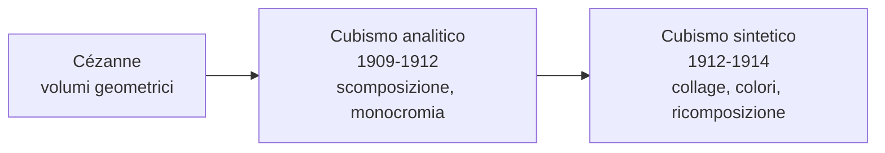

# Cubismo

Il **Cubismo** è la prima grande avanguardia del Novecento e una delle rotture più radicali con la tradizione pittorica occidentale. Nasce a Parigi tra il 1907 e il 1914 grazie a **Pablo Picasso** e **Georges Braque**, che lavorano fianco a fianco al punto che lo stesso Braque dirà: «Picasso e io eravamo come due alpinisti legati dalla stessa corda». Il nome stesso del movimento nasce per caso: nel 1908 il critico Louis Vauxcelles, vedendo i paesaggi geometrici di Braque, parlò sprezzantemente di «piccoli cubi». L'etichetta nasce come ironia, ma resta.

## Il contesto

All'inizio del Novecento la pittura si interroga sul senso stesso del rappresentare. L'Impressionismo aveva insegnato a dipingere ciò che si **vede**, l'attimo, la luce mutevole; il Post-impressionismo, soprattutto **Cézanne**, aveva già iniziato a scomporre la realtà in volumi geometrici essenziali — cilindro, cono, sfera. I cubisti vanno oltre: non vogliono dipingere ciò che si vede, ma ciò che si **sa** dell'oggetto. Una bottiglia ha un fondo, un fianco, un'imboccatura: il cubismo li mostra tutti insieme, da punti di vista diversi, sulla stessa tela.

Sono anni in cui anche la fisica e la filosofia stanno rivoluzionando l'idea di realtà. Einstein pubblica la teoria della relatività ristretta nel 1905, mettendo in crisi l'idea di uno spazio e di un tempo assoluti, mentre Bergson riflette sul tempo come durata, in cui passato, presente e futuro coesistono nella coscienza. La frantumazione cubista dello spazio è il corrispettivo pittorico di questa nuova visione del mondo. A questa rivoluzione contribuiscono anche le **arti extra-europee**, in particolare le maschere africane e la scultura iberica, che mostrano un modo non illusionistico di rappresentare il volto e il corpo: forme stilizzate, sintetiche, espressive.

## Le fasi del Cubismo

Il movimento attraversa due fasi principali:

- **Cubismo analitico** (1909-1912): l'oggetto viene scomposto, "analizzato" in faccette geometriche viste da più punti di vista contemporaneamente. La tavolozza è ridottissima — bruni, ocra, grigi — perché l'attenzione è tutta sulla forma, non sul colore. Il rischio è la quasi illeggibilità: i quadri sembrano puzzle da decifrare.
- **Cubismo sintetico** (1912-1914): l'oggetto viene "ricostruito" semplificandone la struttura. Tornano i colori, e soprattutto fa il suo ingresso il **collage**: ritagli di giornale, carta da parati, etichette incollate sulla tela. È una rivoluzione enorme — per la prima volta il quadro inserisce frammenti del mondo reale invece di imitarli.

## Picasso

**Pablo Picasso** (Málaga 1881 – Mougins 1973) è probabilmente l'artista più influente del Novecento. Spagnolo, si trasferisce a Parigi nel 1904 e attraversa fasi stilistiche diversissime: blu, rosa, cubismo, neoclassicismo, surrealismo. Il cubismo è il momento più rivoluzionario di una carriera lunghissima, durante la quale Picasso si reinventa più volte.

### Periodo blu (1901-1904)

Dopo il suicidio dell'amico Carles Casagemas, Picasso entra in una fase malinconica e cupa. Le tele sono dominate dal blu, che diventa colore della tristezza, della povertà, della solitudine. I soggetti sono mendicanti, prostitute, vecchi, ciechi: un'umanità ai margini.

!!! example "Poveri in riva al mare (1903)"
    Un uomo, una donna e un bambino, scarni e scalzi, sono ritratti su una spiaggia desolata. Il blu domina ogni cosa, persino la pelle dei corpi. Le figure non si guardano, ognuno è chiuso nella propria miseria. Il riferimento è alla pittura di El Greco e a un'idea spirituale, quasi religiosa, della povertà. La composizione è semplicissima — tre figure, un orizzonte, il mare — ma proprio questa essenzialità rende il quadro ancora più struggente.

### Periodo rosa (1904-1906)

Il blu lascia spazio a tonalità più calde — rosa, ocra, terra. I soggetti sono **saltimbanchi, arlecchini, acrobati**: il mondo del circo, dei nomadi delle arti povere. È un periodo più sereno, anche se resta sempre una vena di malinconia.

!!! example "Famiglia di saltimbanchi (1905)"
    Cinque artisti circensi e una bambina sono dipinti in un paesaggio brullo e desertico. Le figure sono vicine fisicamente ma non comunicano: ciascuna sembra persa nei propri pensieri. È un autoritratto collettivo della condizione dell'artista — persone "fuori dal mondo", che vivono di spettacolo ma sono profondamente sole. Picasso si identifica con l'arlecchino al centro, che diventerà negli anni successivi una sua maschera ricorrente.

### La svolta verso il Cubismo

Tra il 1906 e il 1907 Picasso entra in contatto con la scultura iberica e con le maschere africane esposte al museo del Trocadéro. Da questa folgorazione nasce l'opera che apre il cubismo:

!!! example "Les Demoiselles d'Avignon (1907)"
    Cinque prostitute di un bordello sono ritratte in pose statiche e angolose. Avignon non è la città francese, ma una via di Barcellona — Carrer d'Avinyó — dove si trovavano case di tolleranza. Le tre figure di sinistra hanno volti stilizzati come scultura iberica; le due di destra hanno **maschere africane** al posto del viso. Lo spazio è frantumato, la prospettiva tradizionale abolita: i corpi sono spigolosi, geometrici, tagliati come da una lama. Picasso lo tiene per anni nascosto nel suo studio, considerandolo troppo violento. È il manifesto involontario del cubismo.

### Il Cubismo analitico in Picasso

Dopo *Les Demoiselles*, Picasso e Braque sviluppano insieme un linguaggio nuovo. Le tele si frantumano in faccette monocrome, gli oggetti vengono scomposti e ricomposti. Il quadro diventa un puzzle di sguardi.

!!! example "Violino (1912)"
    Un violino è scomposto in piani geometrici sovrapposti: si riconoscono il manico, le corde, la cassa armonica, ma vengono mostrati da angolazioni diverse, come se l'occhio girasse intorno allo strumento. La tavolozza è di soli bruni e grigi. È un esempio classico di cubismo analitico: l'oggetto è "letto" da più prospettive contemporaneamente, e lo sguardo dello spettatore deve ricostruirlo mentalmente.

### Il Cubismo sintetico e l'invenzione del collage

Nel 1912 Picasso introduce il **collage** in pittura, gesto che cambia per sempre il rapporto tra arte e realtà.

!!! example "Natura morta con sedia impagliata (1912)"
    È considerata la prima opera cubista con collage. Picasso incolla sulla tela un pezzo di tela cerata stampata che imita la paglia di una sedia, e circonda il quadro con una corda al posto della cornice. Il quadro non *imita* più la realtà: la realtà entra direttamente nel quadro. Si vedono le lettere "JOU" — probabilmente di "journal", giornale — e oggetti da caffè (un bicchiere, una pipa, un limone) scomposti in piani geometrici. La domanda implicita è: cosa è più "vero", la paglia dipinta dal pittore o la paglia stampata sulla tela cerata?

### Guernica

Anche dopo la stagione propriamente cubista, Picasso continua a usarne il linguaggio. L'esempio più celebre è **Guernica (1937)**, dipinto in poche settimane per il padiglione spagnolo dell'Esposizione di Parigi, in risposta al bombardamento della cittadina basca di Guernica da parte dell'aviazione nazista, alleata di Franco durante la guerra civile spagnola.

!!! example "Guernica (1937)"
    Un'enorme tela monumentale (oltre 3 metri per 7), dipinta solo in bianco, nero e grigio, come una pagina di giornale o una fotografia di cronaca. Le figure sono frantumate in piani cubisti: un toro, un cavallo agonizzante, una madre che urla con un bambino morto in braccio, un soldato a terra con la spada spezzata, una donna che si affaccia con una lampada. Non è un quadro "di battaglia": è un'allegoria universale della **violenza della guerra**. Il toro rappresenta la brutalità (o la Spagna stessa); il cavallo il popolo innocente; la lampada la verità che illumina l'orrore. Picasso disse che il quadro sarebbe potuto tornare in Spagna solo dopo la fine del franchismo: e così è stato, nel 1981.

## Braque

**Georges Braque** (Argenteuil 1882 – Parigi 1963) è il co-fondatore del cubismo. Inizialmente fauvista, conosce Picasso nel 1907 e da allora i due lavorano in strettissima collaborazione, al punto che le loro opere di quegli anni sono talvolta difficilmente distinguibili. È Braque, più di Picasso, ad applicare il cubismo soprattutto al **paesaggio** e alla **natura morta**, evitando quasi sempre il corpo umano.

!!! example "Case all'Estaque (1908)"
    Dipinto durante un soggiorno nel paese provenzale dove aveva lavorato anche Cézanne, mostra un gruppo di case ridotte a volumi cubici essenziali, senza finestre né porte, immerse in una vegetazione anch'essa geometrizzata. La prospettiva tradizionale è abolita: gli edifici sembrano impilati gli uni sopra gli altri, schiacciati su un unico piano. È proprio davanti a questo quadro (e ad altri della stessa serie) che Vauxcelles parlò di «piccoli cubi», dando involontariamente il nome al movimento.

!!! example "Violino e brocca (1910)"
    Tipico esempio di cubismo analitico. Il violino e la brocca sono scomposti in faccette geometriche grigie e brune, mescolate sullo sfondo, al punto che gli oggetti diventano quasi indistinguibili dall'ambiente che li circonda. In alto a destra Braque dipinge un chiodo *trompe-l'œil* da cui sembra pendere il quadro: un gioco ironico, perché in mezzo alla totale astrazione cubista l'unico elemento *realistico* è proprio quel chiodo dipinto. È una riflessione sull'illusione della pittura.

## Checklist

- [ ] Cubismo: contesto, periodo, perché nasce
- [ ] Differenza tra Cubismo analitico e sintetico
- [ ] Picasso — Periodo blu (*Poveri in riva al mare*)
- [ ] Picasso — Periodo rosa (*Famiglia di saltimbanchi*)
- [ ] Picasso — *Les Demoiselles d'Avignon*
- [ ] Picasso — *Violino* (cubismo analitico)
- [ ] Picasso — *Natura morta con sedia impagliata* (collage, cubismo sintetico)
- [ ] Picasso — *Guernica*
- [ ] Braque — *Case all'Estaque*
- [ ] Braque — *Violino e brocca*

## Collegamenti

- **Filosofia**: la simultaneità dei punti di vista cubisti dialoga con la filosofia di **Bergson** e il suo concetto di tempo come *durata*, in cui passato, presente e futuro coesistono nella coscienza. Il quadro cubista è in fondo l'equivalente visivo del tempo bergsoniano.
- **Fisica**: la **relatività ristretta** di Einstein (1905), pubblicata pochi anni prima del cubismo, mette in crisi l'idea di uno spazio e di un tempo assoluti. Il cubismo non si rifà direttamente a Einstein, ma respira la stessa aria culturale: l'idea che la realtà non sia un dato oggettivo ma dipenda dal punto di vista dell'osservatore.
- **Storia**: *Guernica* è il quadro-simbolo del Novecento bellico — guerra civile spagnola, ascesa dei totalitarismi, bombardamenti sulla popolazione civile. Si lega all'**ascesa del nazismo** e al concetto di guerra totale.
- **Letteratura italiana**: la frantumazione cubista del soggetto può essere accostata alla scomposizione dell'io in **Pirandello** (*Uno, nessuno e centomila*) e alla simultaneità dei piani temporali in **Svevo** (*La coscienza di Zeno*). Anche lì il punto di vista unico viene messo in crisi.
- **Letteratura inglese**: la stessa simultaneità si ritrova nello *stream of consciousness* di **Joyce** e **Virginia Woolf**: lo spazio cubista frantumato corrisponde al tempo psicologico spezzettato del modernismo.
