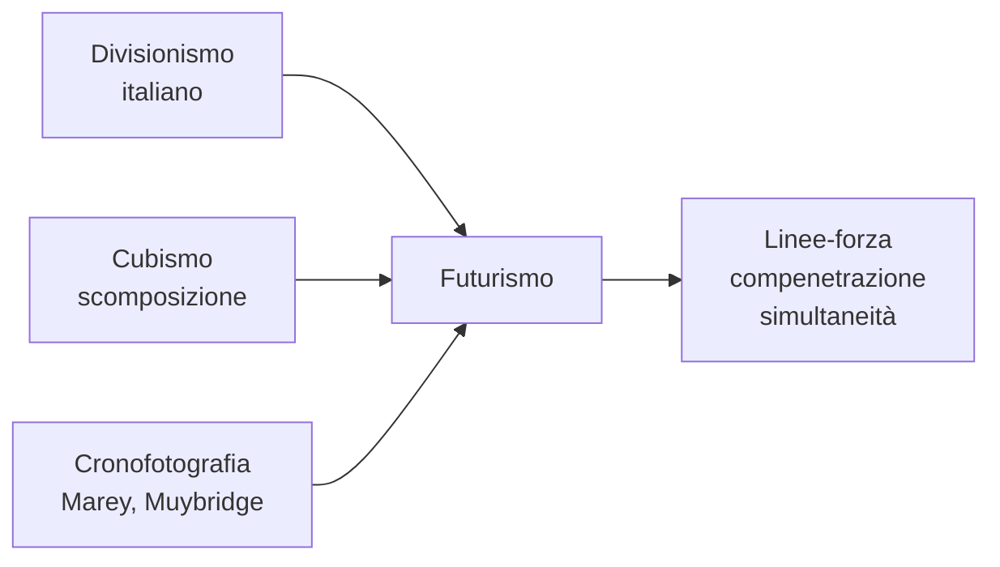

# Futurismo

Il **Futurismo** è la più importante avanguardia italiana e la prima ad avere una vera dimensione internazionale. Nasce ufficialmente il **20 febbraio 1909**, quando il poeta **Filippo Tommaso Marinetti** pubblica sul quotidiano parigino *Le Figaro* il *Manifesto del Futurismo*. È un movimento totale: invade la pittura, la scultura, l'architettura, la poesia, la musica, il cinema, persino la moda e la cucina. L'idea di fondo è semplice e violenta: l'Italia deve liberarsi del proprio passato — musei, accademie, antichità — per abbracciare la modernità, la velocità, la macchina, la città industriale.

## Il contesto

L'Italia del primo Novecento è un paese arretrato rispetto a Francia, Germania e Inghilterra. È percepita come un grande museo a cielo aperto, vissuto soprattutto del proprio glorioso passato. I futuristi reagiscono con rabbia a questa condizione: vogliono un'Italia moderna, industriale, dinamica. Per farlo bisogna **distruggere** ciò che è venuto prima — Marinetti scrive di voler «distruggere i musei, le biblioteche, le accademie d'ogni specie» — e celebrare ciò che è nuovo: il treno, l'automobile, l'aereo, la fabbrica, il telegrafo, le luci elettriche, le città piene di rumore.

A questo si lega un fascino problematico per la **violenza** e per la **guerra**, definita nel Manifesto «sola igiene del mondo». I futuristi saranno tra i più convinti interventisti nel 1915, e molti di loro aderiranno poi al fascismo: lo stesso Marinetti firma il manifesto fascista del 1919 e diventa accademico d'Italia. Boccioni e l'architetto Sant'Elia muoiono al fronte durante la prima guerra mondiale.

## I temi e le tecniche

I temi pittorici ricorrenti sono il **movimento, la velocità, la simultaneità, il dinamismo**. La sfida tecnica è rappresentare il movimento sulla tela, che per natura è statica. I futuristi ci riescono in tre modi:

- **Linee-forza**: linee oblique che irradiano dai corpi e dagli oggetti, come traiettorie di energia.
- **Compenetrazione di piani**: oggetto e ambiente si fondono, perché un corpo in movimento "porta con sé" lo spazio attorno.
- **Moltiplicazione delle posizioni**: zampe, ruote, gambe vengono ripetute in posizioni successive, come in una cronofotografia (le foto in serie di Marey e Muybridge che scomponevano il movimento di uomini e animali).

Tecnicamente i futuristi partono dal **divisionismo** italiano (pennellate filamentose, colori giustapposti) e dopo un viaggio di Boccioni, Carrà e Russolo a Parigi nel 1911 assorbono la lezione del **Cubismo** — la scomposizione in piani — adattandola alle proprie esigenze: dove il cubismo cerca la struttura immobile dell'oggetto, il futurismo cerca la sua energia in movimento.

## Marinetti

**Filippo Tommaso Marinetti** (Alessandria d'Egitto 1876 – Bellagio 1944) è il fondatore e teorico del Futurismo. Non è un pittore ma un poeta, ed è soprattutto attraverso i suoi *manifesti* — testi programmatici brevi, violenti, provocatori — che il movimento prende forma. Marinetti è un personaggio teatrale: organizza le famose "serate futuriste", spettacoli scandalosi nei teatri italiani in cui declama le proprie poesie tra fischi, lanci di ortaggi e risse con il pubblico. Inventa le **parole in libertà**, una poesia senza punteggiatura, senza grammatica, in cui le parole si liberano sulla pagina con caratteri tipografici di dimensione e forma diverse.

!!! example "Il Manifesto del Futurismo (1909)"
    Pubblicato in francese sulla prima pagina di *Le Figaro* il 20 febbraio 1909 per dare al movimento risonanza europea. Si apre con un racconto: Marinetti e gli amici, dopo una notte trascorsa a discutere, escono in automobile, hanno un incidente in un fossato — e da quel fossato "rinascono" come futuristi. Segue la parte programmatica in **11 punti**, che esaltano: il pericolo, l'audacia, la velocità, la lotta, l'energia, l'aggressività. Le frasi più celebri: «Un'automobile da corsa col suo cofano adorno di grossi tubi simili a serpenti dall'alito esplosivo... è più bella della **Vittoria di Samotracia**» (cioè una macchina vale più di un capolavoro greco antico) e «Vogliamo glorificare la guerra — sola igiene del mondo». Il Manifesto contiene anche posizioni misogine («disprezzo della donna») di cui i futuristi pagheranno il conto storico. Da questo testo nasce tutto il movimento: l'anno dopo i pittori firmeranno il loro *Manifesto tecnico*.

## Boccioni

**Umberto Boccioni** (Reggio Calabria 1882 – Verona 1916) è il più grande pittore e scultore del Futurismo, e probabilmente l'artista italiano più importante del primo Novecento. Si forma a Roma nello studio di Balla, poi si trasferisce a Milano, dove diventa il leader del gruppo. Scrive il *Manifesto tecnico della pittura futurista* (1910) e quello *della scultura* (1912). Muore appena trentaquattrenne nel 1916, cadendo da cavallo durante un'esercitazione militare: senza la guerra, il futurismo avrebbe avuto in lui il proprio Picasso italiano.

!!! example "La città che sale (1910-1911)"
    È la prima opera pienamente futurista. Rappresenta un cantiere alla periferia di Milano, dove sorge un nuovo quartiere. In primo piano enormi cavalli da tiro, con i mantelli rosso-arancione, caracollano e si imbizzarriscono mentre gli operai cercano di trattenerli; sullo sfondo si vedono ponteggi e palazzi in costruzione, fumi industriali, tram. Il quadro è ancora dipinto con tecnica **divisionista** — pennellate filamentose tipo Pellizza da Volpedo — ma il soggetto è già completamente nuovo: la nascita della città moderna, l'energia del lavoro umano e animale, il passaggio dalla vecchia Italia agricola a quella industriale. Il cavallo diventerà nelle opere successive sempre più macchina: qui è il momento esatto della transizione.

!!! example "Stati d'animo (1911)"
    È un **trittico**, cioè una serie di tre quadri pensati insieme: *Gli addii*, *Quelli che vanno*, *Quelli che restano*. Tutti e tre sono ambientati in una **stazione ferroviaria**, ma il vero soggetto non è il luogo: sono le **emozioni**. Boccioni cerca di dipingere ciò che si prova — non ciò che si vede — al momento di una partenza. Esistono due versioni del trittico: la prima del 1911 più simbolista, la seconda dello stesso anno, dopo il viaggio a Parigi, di impianto più cubista.
    
    - In *Gli addii* le figure si abbracciano in mezzo al fumo del treno; sopra di loro compare il numero **6943**, il numero della locomotiva, e linee curve che rappresentano gli sbuffi di vapore e il groviglio dei sentimenti.
    - In *Quelli che vanno* le persone sui vagoni si allungano in linee oblique veloci, che corrono verso destra: il viaggio, la velocità, la fuga.
    - In *Quelli che restano* le figure scendono lentamente in linee verticali pesanti, che pendono come gocce: la malinconia, l'abbandono, il tempo che si dilata.
    
    Si vede chiarissima qui l'influenza della filosofia di **Bergson**: il quadro non rappresenta un istante, ma la *durata* interiore del sentimento.

!!! example "Dinamismo di un footballer (1913)"
    Un calciatore è ritratto nell'attimo del calcio. Il corpo è scomposto in **piani geometrici curvi** che si compenetrano con lo spazio circostante: gambe, busto, testa non hanno più contorni precisi, si sciolgono nell'aria che il movimento sposta. Le **linee-forza** irradiano dal centro della figura come schegge di energia. È un quadro che si capisce solo se si pensa al cubismo (la scomposizione) e alla cronofotografia (il movimento catturato in più istanti), ma il risultato è completamente futurista: il soggetto non è il calciatore, è il *gesto* del calciare. Boccioni dipinge il verbo, non il sostantivo.

## Balla

**Giacomo Balla** (Torino 1871 – Roma 1958) è il più anziano dei futuristi: ha già trentotto anni quando aderisce al movimento. Pittore divisionista di formazione, è il **maestro** di Boccioni e Severini quando questi sono giovani a Roma; sarà poi loro a trascinarlo nel Futurismo. Balla è meno polemico di Marinetti e meno drammatico di Boccioni: la sua ricerca è più giocosa, quasi scientifica, ossessionata dall'idea di catturare il movimento in pittura.

!!! example "Dinamismo di un cane al guinzaglio (1912)"
    Una signora elegante passeggia con il suo cagnolino bassotto al guinzaglio. Per rappresentare il movimento, Balla **moltiplica** le zampe del cane (che diventano un ventaglio sfocato di una ventina di zampine), la coda (che disegna un arco vibrante), il guinzaglio (che oscilla in più posizioni) e perfino i piedi della padrona, anch'essi sdoppiati. Il risultato è un effetto quasi **fumettistico**, ironico e divertente — molto diverso dalla drammaticità di Boccioni. La fonte di ispirazione è la **cronofotografia** di Étienne-Jules Marey, che fotografava un soggetto in movimento in più istanti successivi. È una delle opere più famose e immediatamente riconoscibili dell'intero Futurismo.

## Checklist

- [ ] Futurismo: contesto, periodo, perché nasce in Italia
- [ ] Temi: velocità, modernità, macchina, simultaneità
- [ ] Tecniche: linee-forza, compenetrazione di piani, moltiplicazione delle posizioni
- [ ] Marinetti — *Manifesto del Futurismo* (1909)
- [ ] Boccioni — *La città che sale*
- [ ] Boccioni — *Stati d'animo* (trittico)
- [ ] Boccioni — *Dinamismo di un footballer*
- [ ] Balla — *Dinamismo di un cane al guinzaglio*

## Collegamenti

- **Filosofia**: il legame fondamentale è con **Bergson** e la sua idea di tempo come *durata*. Gli *Stati d'animo* di Boccioni sono in pratica un'illustrazione pittorica del bergsonismo: gli stati interiori non sono istanti, ma flussi che si dilatano e si contraggono.
- **Storia**: il Futurismo è strettamente intrecciato con la **prima guerra mondiale** e con le origini del **fascismo**. I futuristi sono interventisti convinti, Boccioni e Sant'Elia muoiono al fronte, Marinetti aderisce al fascismo nel 1919. Si lega bene all'**ascesa del fascismo** in storia.
- **Italiano**: Marinetti è autore non solo di manifesti ma di poesie in *parole in libertà* (es. *Zang Tumb Tuuum* sulla guerra in Libia). Il rapporto con la modernità si può confrontare con **D'Annunzio** (che pure esalta la macchina e la velocità, ma da posizioni estetizzanti) e con la frantumazione dell'io di **Pirandello** e **Svevo** (che però arrivano a esiti opposti, di crisi e non di esaltazione).
- **Fisica**: l'attenzione futurista al movimento, alla velocità, alla simultaneità è figlia di un secolo che vede nascere la **fotografia** e il **cinema** (i fratelli Lumière, 1895), e che con Einstein ridiscute il concetto stesso di tempo e spazio.
- **Inglese**: il dinamismo della città moderna, il rumore, la velocità, sono temi centrali anche nel **modernismo inglese** — la Londra frammentata di *The Waste Land* di **Eliot**, la metropoli simultanea di **Joyce**.
