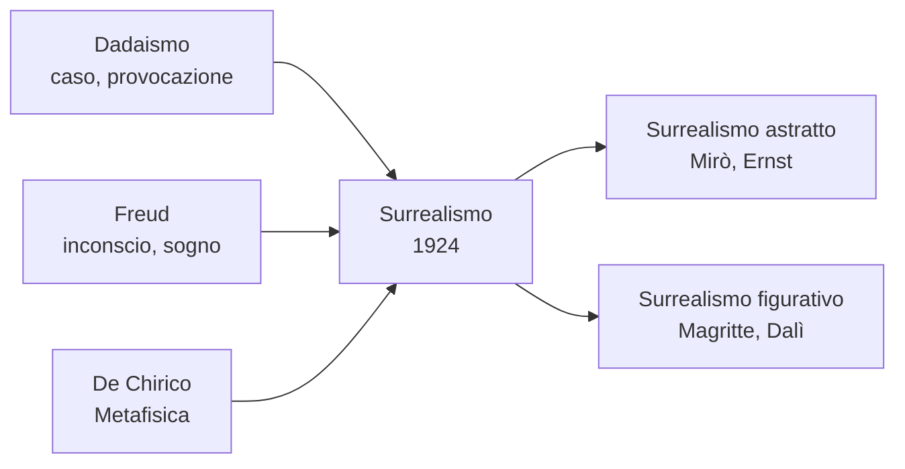

# Surrealismo

Il **Surrealismo** è la grande avanguardia degli anni '20 e '30, e quella destinata a lasciare l'impronta più duratura nell'immaginario novecentesco. Nasce a **Parigi nel 1924**, quando il poeta **André Breton** pubblica il *Manifesto del Surrealismo*, e raccoglie l'eredità del Dadaismo trasformandone la pura provocazione in un progetto positivo: **esplorare e liberare l'inconscio**. Se i dadaisti volevano distruggere l'arte, i surrealisti vogliono usarla per accedere a una realtà più profonda — la *sur-réalité*, "sopra-realtà" — fatta di sogni, desideri, paure, ossessioni.

## Il contesto

Il Surrealismo nasce dall'incrocio di tre eredità decisive. La prima è il **Dadaismo**: lo stesso Breton aveva fatto parte del gruppo Dada parigino, e da lì porta con sé l'amore per il caso, l'accostamento di elementi inconciliabili, la provocazione. La seconda è la **psicoanalisi di Freud**: la scoperta dell'inconscio, dei sogni come "via regia" verso ciò che la coscienza nasconde, dei lapsus, degli atti mancati, della sessualità repressa. Breton aveva studiato medicina e durante la Prima guerra mondiale aveva lavorato in un ospedale psichiatrico militare con soldati traumatizzati, applicando metodi freudiani. La terza eredità, e per noi italiani fondamentale, è la **Metafisica** di **Giorgio De Chirico**: tra il 1910 e il 1918 De Chirico aveva dipinto piazze deserte, manichini senza volto, ombre lunghissime, statue antiche e ciminiere accostate in atmosfere irreali e silenziose. I surrealisti studiano quei quadri come se fossero un dizionario del sogno, e Magritte e Dalì in particolare ne riconoscono apertamente il debito: senza la Metafisica di De Chirico, il loro Surrealismo non esisterebbe.

Breton definisce il Surrealismo come **«automatismo psichico puro, attraverso il quale ci si propone di esprimere il funzionamento reale del pensiero, in assenza di ogni controllo esercitato dalla ragione»**. È l'idea di lasciar parlare l'inconscio senza filtri, come accade nei sogni o sotto ipnosi.

## I temi e le tecniche

I surrealisti inventano molte tecniche per disattivare la ragione e fare emergere l'inconscio:

- **Scrittura automatica**: scrivere di getto, senza pensare, per lasciare che le parole scelgano da sole il loro corso.
- **Cadavere squisito** (*cadavre exquis*): un gioco collettivo in cui ognuno aggiunge una parola o un disegno senza vedere ciò che hanno fatto gli altri, e alla fine si scopre l'immagine assurda risultante.
- **Frottage**: appoggiare un foglio su una superficie ruvida (legno, foglie, tessuti) e sfregarlo con la matita, per far emergere texture casuali su cui poi disegnare (tecnica di Max Ernst).
- **Metodo paranoico-critico**: tecnica inventata da Dalì, che consiste nel forzare la mente a vedere immagini ambigue e doppie (una nuvola che è anche un cavallo, una roccia che è anche un volto).

Dal punto di vista visivo il Surrealismo si divide in due correnti principali:

- **Surrealismo astratto/biomorfo** — Mirò, Ernst, Tanguy: forme libere, organiche, che non rappresentano nulla di riconoscibile ma evocano paesaggi mentali.
- **Surrealismo figurativo/onirico** — Dalì, Magritte: oggetti dipinti con tecnica iperrealistica, ma collocati in situazioni impossibili, come in un sogno fotografato.

## André Breton

**André Breton** (Tinchebray 1896 – Parigi 1966) è il fondatore e il "papa" del movimento. Non è un pittore ma un poeta e teorico: scrive il **Manifesto del Surrealismo** nel 1924 e un secondo manifesto nel 1929, in cui radicalizza il movimento in senso politico avvicinandolo al comunismo. Durante la sua vita "scomunica" e riammette numerosi surrealisti (espelle Dalì negli anni Trenta accusandolo di simpatie fasciste e di interessi commerciali). Rifugiatosi negli Stati Uniti durante la Seconda guerra mondiale, contribuisce alla diffusione del Surrealismo in America. Pur non essendo un pittore, è la mente teorica senza la quale il Surrealismo non esisterebbe come movimento organizzato.

## Joan Mirò

**Joan Mirò** (Barcellona 1893 – Palma di Maiorca 1983) è il principale rappresentante del Surrealismo astratto. Catalano come Dalì, ma di tutt'altro temperamento: schivo, contadino, legato alla terra di Catalogna. La sua ricerca parte da paesaggi rurali realistici e si semplifica progressivamente fino a diventare un linguaggio personalissimo fatto di **forme biomorfe** — figure che sembrano cellule, stelle, occhi, animali primordiali — disegnate con linee semplici e colori puri (rosso, giallo, blu, nero). Mirò dichiarò di voler «assassinare la pittura», intendendo la pittura tradizionale: per lui dipingere doveva essere un atto libero, infantile, vicino alla scrittura ideografica.

### Blu II (1961)

Fa parte di un trittico — *Blu I, II, III* — di tre enormi tele dipinte di un **blu cobalto profondo** e attraversate da pochissimi segni: in *Blu II* una serie di **puntini neri** allineati orizzontalmente, come una scrittura sospesa, e una piccola **virgola rossa** sulla destra. Sembra incredibilmente poco, eppure il quadro funziona.

Il blu è uno **spazio infinito, mentale**, in cui i pochi segni sembrano suggerire una scrittura, una traiettoria, un evento. Mirò ha lavorato a queste tele in totale silenzio, descrivendole come una **meditazione**: il vuoto non è assenza, ma spazio aperto in cui l'inconscio può respirare. È l'opposto della pittura "carica" di Dalì: qui meno c'è, più c'è. La sua influenza è enorme — il *Color Field* americano (Rothko, Newman) deve a queste tele il proprio vocabolario di campiture monocromatiche pensate come spazi spirituali.

## René Magritte

**René Magritte** (Lessines 1898 – Bruxelles 1967), belga, è il surrealista del **paradosso visivo**. Il suo stile è anti-spettacolare: dipinge con tecnica precisa, quasi fredda, cose ordinarissime — una mela, una pipa, un cappello, una nuvola, una finestra — ma le accosta in modo da rendere il mondo improvvisamente inquietante. Magritte non vuole stupire con i mezzi ma con il **pensiero**: i suoi quadri sono enigmi filosofici travestiti da pittura. La sua grande influenza è proprio la Metafisica di De Chirico: ammise che, vedendo per la prima volta *Canto d'amore* di De Chirico, pianse.

### Il tradimento delle immagini (1929)

Il quadro mostra una **pipa** dipinta in modo realistico, su sfondo neutro. Sotto, una scritta accuratissima in francese: *«Ceci n'est pas une pipe»*, "Questo non è una pipa". Sembra un controsenso, ma è verissimo: quella **non è una pipa**, è il *dipinto* di una pipa. Non si può fumare. Non contiene tabacco. Magritte ci mette davanti al fatto, banale ma rivoluzionario, che un'**immagine non è la cosa rappresentata**, e che noi confondiamo continuamente le due cose.

È una riflessione su **segno e referente** — sul rapporto tra parola, immagine e realtà — che anticipa di decenni temi della **semiotica** e della filosofia del linguaggio (si pensi a Foucault, che dedicherà al quadro un saggio intero). Il quadro è uno dei più citati del Novecento, anche al di fuori dell'arte, ed è stato infinitamente parodiato. La sua forza sta proprio nella semplicità apparente: bastano una pipa e una frase per far vacillare la nostra fiducia nell'evidenza visiva. Magritte stesso, davanti agli increduli che gli facevano notare il "controsenso", rispondeva sornione: «Provate a riempirla di tabacco».

## Salvador Dalì

**Salvador Dalì** (Figueres 1904 – Figueres 1989), spagnolo, catalano, è il surrealista più celebre, anche per la sua personalità eccentrica — i baffi a punta, le dichiarazioni provocatorie, l'auto-mitografia. Tecnicamente è un virtuoso, capace di dipingere con la precisione di un maestro fiammingo del Quattrocento. Inventa il **metodo paranoico-critico**: si auto-induce stati di paranoia controllata per accedere a immagini doppie, ambigue, oniriche, e poi le dipinge con realismo fotografico. Il risultato è una pittura "iperrealista del sogno": ogni dettaglio è nitido, eppure il tutto è impossibile. Breton lo espelle dal gruppo nel 1939 per le sue posizioni politiche ambigue (vicinanza a Franco) e per quello che giudica un eccesso di interessi commerciali — Breton lo soprannomina sarcasticamente "Avida Dollars", anagramma di "Salvador Dalì".

### La persistenza della memoria (1931)

È il quadro surrealista più famoso del mondo. Una **spiaggia silenziosa al tramonto**, con le scogliere di Cap de Creus in Catalogna sullo sfondo, illuminata da una luce dorata e immobile. In primo piano tre **orologi molli**, che si afflosciano come formaggio fuso: uno sopra il bordo di un parallelepipedo, uno appeso a un ramo d'albero secco, uno disteso sopra una **creatura ambigua** che sembra il profilo del volto di Dalì stesso, addormentato. Un quarto orologio, l'unico chiuso e di colore arancione, è coperto di **formiche** che lo divorano: rappresenta la corruzione del tempo, il decadimento.

Il quadro è piccolissimo (24×33 cm) ma di una **precisione fiamminga**: ogni dettaglio è dipinto con minuziosità impressionante. Il significato: il tempo, che noi pensiamo rigido e oggettivo, nei sogni si **dilata, si scioglie, perde forma**. La distinzione tra passato, presente e futuro vacilla, come nei meccanismi profondi della memoria. Dalì raccontò che l'idea gli era venuta osservando del **camembert** sciogliersi al sole sul tavolo di una cena. Si riconoscono almeno tre influenze: la **teoria della relatività** di Einstein (il tempo come grandezza relativa, non assoluta), la filosofia di **Bergson** (il tempo come durata interiore), e ancora la **Metafisica** di De Chirico, dove orologi e statue sospese in piazze deserte avevano già introdotto l'idea di tempo onirico.

## Frida Kahlo

**Frida Kahlo** (Coyoacán 1907 – 1954) è una pittrice **messicana** che il Surrealismo ha sempre cercato di reclamare, ma che lei stessa ha rifiutato di considerarsi tale. Vita drammatica: a sei anni la poliomielite le lascia una gamba più corta dell'altra; a diciotto un terribile incidente in autobus le spezza colonna vertebrale, bacino, gamba, costringendola a lunghe convalescenze a letto. È in quel periodo che inizia a dipingere — sua madre le fa montare uno specchio sopra il letto perché possa ritrarsi. Sposa il muralista **Diego Rivera**, in un rapporto burrascoso fatto di tradimenti, separazioni e riconciliazioni. La sua pittura è quasi tutta **autobiografica**: autoritratti in cui mette in scena il proprio dolore fisico, i propri aborti, l'identità messicana, la cultura precolombiana.

Quando Breton la conosce nel 1938 la dichiara "surrealista naturale" e la invita a esporre a Parigi. Lei risponde in modo memorabile: **«Non dipingo sogni o incubi, dipingo la mia realtà»**. È un punto importante: i suoi quadri sembrano surreali (donne con cuori esposti, spine, scimmie, paesaggi onirici) ma per Frida sono semplicemente la rappresentazione fedele della sua esistenza. Tra le opere più note: *Le due Frida* (1939), *Autoritratto con collana di spine* (1940), *La colonna spezzata* (1944).

## Checklist

- [ ] Surrealismo: contesto, periodo, perché nasce
- [ ] Le tre influenze: Dada, Freud, Metafisica di De Chirico
- [ ] Differenza tra Surrealismo astratto e figurativo
- [ ] Breton — *Manifesto del Surrealismo* (1924)
- [ ] Mirò — *Blu*
- [ ] Magritte — *Il tradimento delle immagini*
- [ ] Dalì — *La persistenza della memoria*
- [ ] Frida Kahlo — vita, autobiografia in pittura

## Collegamenti

- **Filosofia/Psicologia**: il legame fondamentale è con **Freud** e la psicoanalisi: l'inconscio, il sogno come via per accedere ai contenuti rimossi, i simboli, la sessualità. Il Surrealismo è in pratica la traduzione visiva della *Interpretazione dei sogni* (1900).
- **Filosofia**: l'idea di tempo come durata interiore in **Bergson** torna negli orologi molli di Dalì.
- **Italiano**: il rapporto tra realtà e illusione, l'io frantumato e le maschere si possono confrontare con **Pirandello** (*Uno, nessuno e centomila*); l'esplorazione dell'inconscio e del sogno con **Svevo** (*La coscienza di Zeno*, dove Zeno scrive proprio per il proprio psicoanalista).
- **Storia**: il Surrealismo è anche un movimento politico: Breton aderisce al comunismo, molti surrealisti sono perseguitati dai nazisti come "arte degenerata" ed emigrano negli USA, contribuendo alla nascita dell'**Espressionismo astratto** americano.
- **Inglese**: l'esplorazione dell'inconscio e del flusso di coscienza si lega allo *stream of consciousness* di **Joyce** e **Virginia Woolf**, e all'atmosfera onirica e simbolica di certe pagine di **T.S. Eliot**.
