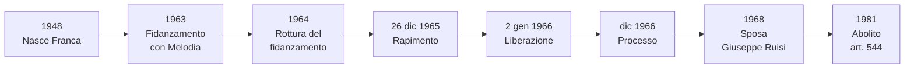

# La storia di Franca Viola

## Il contesto

Siamo in Sicilia, ad **Alcamo** (provincia di Trapani), negli anni Sessanta. È un paese piccolo, dove tutti si conoscono e dove vige ancora una mentalità antica fatta di **onore**, **famiglia** e **codice d'onore mafioso**.

In quegli anni in Italia era in vigore l'**articolo 544 del Codice Penale**, che permetteva il cosiddetto **"matrimonio riparatore"**: se un uomo rapiva e violentava una donna, poteva cancellare il reato sposandola. La donna, dal canto suo, era considerata "disonorata" dopo lo stupro e l'unico modo per "ripulire" l'onore della famiglia era proprio sposare il suo aggressore. Era una vergogna sociale enorme rifiutare.

!!! info "Una legge assurda"
    L'articolo 544 diceva che il matrimonio fra l'autore di un reato sessuale e la vittima estingueva il reato. Esisteva fino al 1981.

## Chi era Franca Viola

**Franca Viola** è nata ad Alcamo il **9 gennaio 1948**. Figlia di **Bernardo Viola**, un contadino, e di **Vita Ferra**, casalinga. Ha un fratello più piccolo, **Mariano**.

A quindici anni Franca si era fidanzata con **Filippo Melodia**, un giovane di Alcamo nipote di un noto mafioso del paese. Ma il fidanzamento fu interrotto: Melodia fu arrestato per furto e legato ad ambienti criminali, e il padre di Franca decise di rompere il legame.

Melodia non accettò il rifiuto. Cominciò a **minacciare** la famiglia Viola: incendiò la loro vigna, distrusse la casetta in campagna, mandò "ambasciatori" a chiedere che Franca tornasse con lui. Bernardo Viola però non cedette.

## Il rapimento

Il **26 dicembre 1965**, Filippo Melodia, insieme a una dozzina di amici armati, fece irruzione in casa Viola. Picchiò la madre e rapì Franca, allora diciassettenne, portando via con sé anche il fratellino **Mariano**, che fu rilasciato poche ore dopo.

Franca fu nascosta in un casolare in campagna. Per **otto giorni** fu tenuta segregata, picchiata e violentata. Lo scopo di Melodia era chiaro: costringerla, una volta "disonorata", al matrimonio riparatore. Secondo la mentalità del tempo, non avrebbe avuto altra scelta.

## La denuncia del padre

Bernardo Viola fece una cosa che, nella Sicilia di allora, era quasi impensabile: **denunciò il rapimento ai carabinieri** e finse di accettare la trattativa con i Melodia per liberare la figlia. Era una trappola.

Il **2 gennaio 1966**, i carabinieri irruppero nel casolare dove Franca era tenuta prigioniera, arrestarono Melodia e i suoi complici e liberarono la ragazza.

## Il rifiuto

Quello che Franca fece subito dopo cambiò la storia d'Italia.

Quando le proposero il **matrimonio riparatore**, lei pronunciò la frase che è rimasta storica:

!!! quote ""
    «Io non sono proprietà di nessuno, nessuno può costringermi ad amare una persona che non rispetto. L'onore lo perde chi le fa certe cose, non chi le subisce.»

Era la **prima volta** in Italia che una donna rifiutava pubblicamente il matrimonio riparatore. Una scelta di una gravità enorme: significava sfidare apertamente la mentalità del paese, esporsi al disprezzo della comunità, rinunciare a "salvare l'onore" e vivere per sempre con l'etichetta di "donna disonorata".

Il padre Bernardo la sostenne fino in fondo. Anche la madre Vita le restò accanto.

## Il processo

Il processo a Filippo Melodia si svolse a **Trapani nel dicembre 1966**. Fu mediatico, seguito dai giornali di tutta Italia. La difesa di Melodia provò a sostenere che fosse stata una **"fuitina"** (la fuga d'amore concordata, usanza tradizionale siciliana), ma la testimonianza di Franca e dei genitori smontò la versione.

Melodia fu condannato a **11 anni di carcere**. Uscì nel 1976, fu mandato al confino e nel 1978 fu **ucciso** in un agguato a Modena, probabilmente per una vendetta legata ad ambienti mafiosi.

## La nuova vita di Franca

Nel **1968** Franca Viola sposò **Giuseppe Ruisi**, un suo amico d'infanzia, contadino come il padre, che le era rimasto vicino in tutti quegli anni. Per andare a vivere con lui, Giuseppe dovette ottenere il porto d'armi: la famiglia temeva ritorsioni.

Al matrimonio fu invitato anche il **Presidente della Repubblica Giuseppe Saragat**, che mandò un dono. **Papa Paolo VI** ricevette la coppia in udienza privata.

Franca e Giuseppe ebbero tre figli e vivono ancora oggi ad Alcamo.

## Cosa cambiò in Italia

Il caso di Franca Viola fu un **terremoto culturale**. Per la prima volta una donna aveva detto pubblicamente che il proprio corpo non era una merce della famiglia, che l'onore non si "ripara" con un matrimonio forzato, che la vittima di una violenza non è la colpevole.

Le tappe legislative che seguirono (anche grazie al precedente che lei aveva creato):

| Anno | Cambiamento |
|------|-------------|
| 1968 | Cade il reato di "adulterio" come reato penale solo per la donna |
| 1975 | Riforma del **diritto di famiglia**: parità fra moglie e marito |
| **1981** | Abolito l'**articolo 544** (matrimonio riparatore) e il **"delitto d'onore"** |
| 1996 | La violenza sessuale diventa **reato contro la persona** (e non più "contro la morale") |

Nel **2014**, il Presidente della Repubblica **Giorgio Napolitano** le ha conferito l'onorificenza di **Grande Ufficiale dell'Ordine al Merito della Repubblica Italiana** «per aver dato un contributo determinante, con la sua coraggiosa scelta, al progresso dei diritti delle donne in Italia».

## Perché è importante per Educazione Civica

- È un esempio di come una **scelta individuale** possa cambiare la coscienza collettiva di un paese
- Mostra il legame fra **diritto** (le leggi che cambiano) e **cultura** (la mentalità che cambia)
- È un caso fondamentale per parlare di **diritti delle donne**, **violenza di genere** e **dignità della persona** (articolo 3 della Costituzione)
- Insegna che ci sono momenti in cui **disobbedire alla tradizione** è un atto di civiltà

## Linea del tempo

