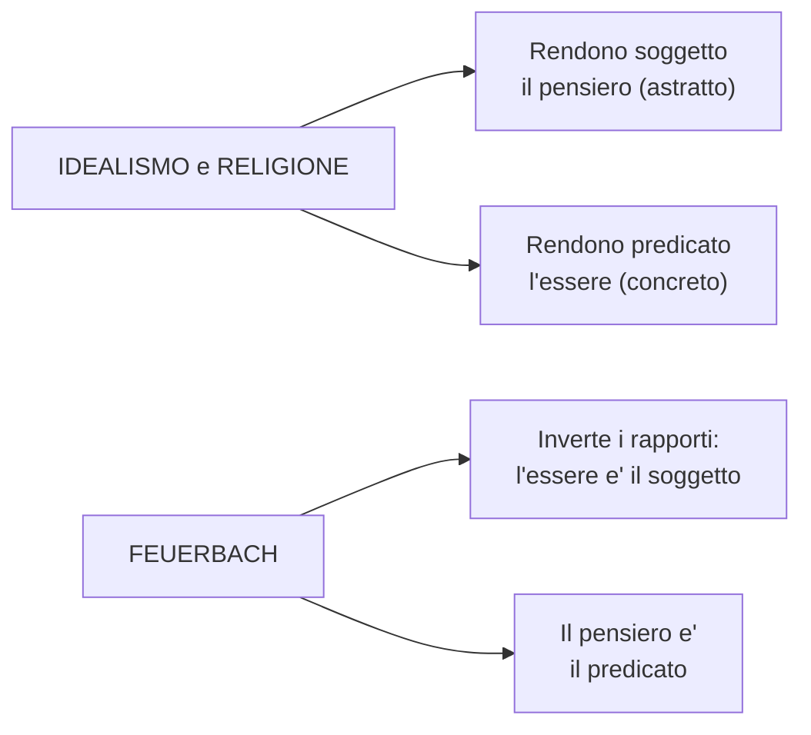
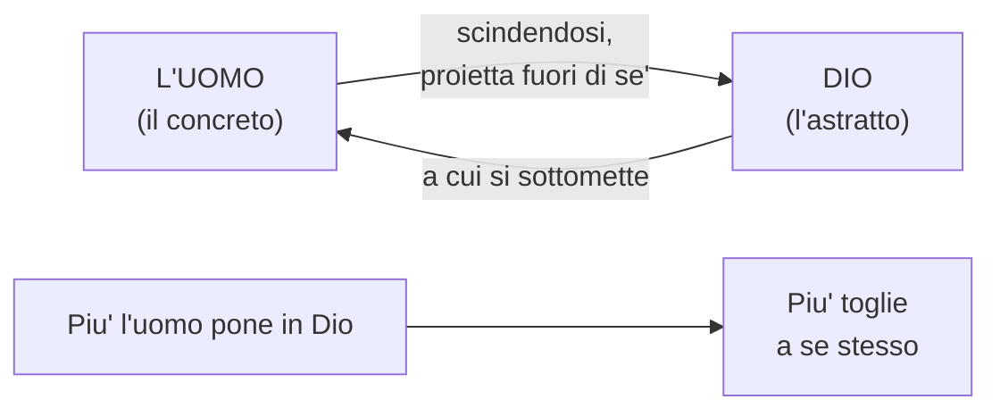
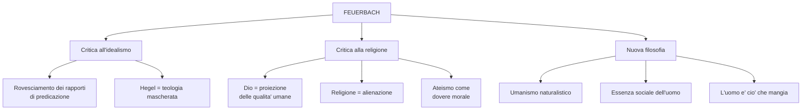

# Feuerbach

## Vita e opere

**Ludwig Feuerbach** nacque il 28 luglio **1804** a Landshut, in Baviera, e mori' a Rechenberg il 13 settembre **1872**.

Scolaro di Hegel a Berlino, fu costretto ad abbandonare la carriera universitaria a Erlangen a causa delle sue idee sulla religione, esposte nel libro *Pensieri sulla morte e l'immortalita'* (1830). Si ritiro' a Bruckberg, dove visse quasi sempre in solitudine.

!!! info "Opere principali"
    | Anno | Opera |
    |------|-------|
    | 1839 | *Critica della filosofia hegeliana* |
    | 1841 | *L'essenza del cristianesimo* |
    | 1843 | *Tesi provvisorie per la riforma della filosofia* |
    | 1844 | *Principi della filosofia dell'avvenire* |
    | 1845 | *L'essenza della religione* |

Dapprima hegeliano fervente, Feuerbach si emancipo' progressivamente dall'hegelismo, elaborando una filosofia centrata sull'**uomo concreto** anziche' sullo Spirito assoluto.

---

## Il contesto: Destra e Sinistra hegeliana

Dopo la morte di Hegel (1831), i suoi seguaci si divisero in due correnti, definite con termini ispirati al Parlamento francese:

| | **Destra hegeliana** | **Sinistra hegeliana** |
|---|---|---|
| **Motto** | "Tutto cio' che e' reale e' razionale" | "Tutto cio' che e' razionale e' reale" |
| **Atteggiamento** | Conservatore: la realta' non va cambiata | Rivoluzionario: la realta' va trasformata |
| **Religione** | Filosofia come **conservazione** della religione | Filosofia come **distruzione** della religione |
| **Politica** | Giustificazione dell'esistente | Critica dell'esistente |

Feuerbach fu la figura di maggior spicco della **Sinistra hegeliana** e il fondatore dell'**ateismo filosofico ottocentesco**.

---

## Il rovesciamento dei rapporti di predicazione

!!! abstract "Tesi fondamentale"
    L'idealismo (e la religione) offrono una **visione rovesciata delle cose**: fanno della causa (l'essere, il concreto) l'effetto, e dell'effetto (il pensiero, l'astratto) la causa.

Secondo Feuerbach, il vero rapporto tra pensiero ed essere e':

> L'**essere** e' il soggetto, il **pensiero** e' il predicato. Il pensiero deriva dall'essere, ma non l'essere dal pensiero.
>
> --- *Tesi provvisorie per la riforma della filosofia*

In altre parole, l'idealismo compie un errore fondamentale: rende **soggetto** cio' che nella realta' e' predicato (il pensiero), e **predicato** cio' che nella realta' e' soggetto (l'essere concreto). L'inizio della filosofia non e' Dio, non e' l'Assoluto, ma **il finito, il determinato, il reale**.

---

## La critica alla religione

### Dio come proiezione dell'uomo

!!! abstract "Tesi centrale"
    Non e' Dio ad aver creato l'uomo, ma **l'uomo ad aver creato Dio**. Dio non e' altro che la **proiezione illusoria** di alcune qualita' umane — in particolare la **ragione**, la **volonta'** e il **cuore** — in un essere immaginario.

Feuerbach spiega: tutte le qualita' che attribuiamo a Dio (sapienza, bonta', onnipotenza) sono in realta' qualita' **umane**, proiettate fuori di noi e adorate come se appartenessero a un essere separato.

> Tu credi che l'amore sia un attributo di Dio perche' tu stesso ami, credi che Dio sia un essere sapiente e buono perche' consideri bonta' e intelligenza le migliori tue qualita'.
>
> --- *L'essenza del cristianesimo*

### Le tre ipotesi sull'origine dell'idea di Dio

Feuerbach formula diverse spiegazioni su come nasce l'idea di Dio:

| # | Ipotesi | Spiegazione |
|---|---------|-------------|
| 1 | **Individuo vs specie** | L'uomo come singolo e' mortale e limitato, ma come specie si sente infinito. Dio e' la **personificazione delle qualita' della specie** |
| 2 | **Volere vs potere** | L'uomo desidera piu' di quanto puo' ottenere. Dio e' l'entita' capace di realizzare tutti i suoi desideri: "Dio e' l'**ottativo del cuore umano** divenuto presente" |
| 3 | **Dipendenza dalla natura** | Il sentimento di dipendenza dalla natura ha spinto l'uomo ad adorare cio' senza cui non potrebbe esistere (aria, acqua, terra, luce) |

### La religione come antropologia capovolta

Il "mistero della teologia" e', secondo Feuerbach, l'**antropologia**: la religione e' la prima, ma **indiretta**, autocoscienza dell'uomo. L'uomo proietta il proprio essere *fuori di se'*, in un essere superiore immaginario, prima di ritrovarlo *in se'*.

---

## Alienazione e ateismo

### Il concetto di alienazione

!!! warning "Concetto chiave"
    La religione e' una forma di **alienazione**: l'uomo "scinde" se stesso, proietta *fuori di se'* le proprie qualita' migliori in un Dio immaginario, e poi **si sottomette** a questa sua stessa creazione. Piu' l'uomo pone in Dio, piu' toglie a se stesso.

### L'ateismo come dovere morale

Per Feuerbach l'**ateismo** non e' un semplice rifiuto di Dio, ma un vero e proprio **dovere morale**: e' l'atto con cui l'uomo recupera in se' i predicati positivi che aveva proiettato nello "specchio" illusorio di Dio.

Il compito della vera filosofia non e' piu' quello di **porre il finito nell'infinito** (cioe' risolvere l'uomo in Dio), ma di **porre l'infinito nel finito** (cioe' risolvere Dio nell'uomo), riconoscendo che le qualita' "divine" sono in realta' **qualita' umane**.

!!! tip "In sintesi"
    L'ateismo di Feuerbach e' "**positivo**": non si limita a negare Dio, ma propone di sostituire:

    - la **teologia** con l'**antropologia**
    - il culto di **Dio** con il culto dell'**uomo**
    - l'amore verso **Dio** con l'amore per l'**uomo** (filantropia)

---

## La critica a Hegel

!!! abstract "Hegel = teologia mascherata"
    Se la religione e' un'antropologia capovolta, l'**hegelismo** e' una **teologia mascherata**, cioe' la traduzione in chiave "speculativa" (filosofica) del pensiero religioso cristiano.

L'Idea o lo Spirito di Hegel, come il Dio della Bibbia, non e' che un **fantasma di noi stessi**, il frutto di un'**astrazione alienante**. La filosofia di Hegel ha estraniato l'uomo da se stesso, ponendo l'essenza dell'uomo al di fuori dell'uomo.

| | **In Hegel** | **In Feuerbach** |
|---|---|---|
| **La religione e'...** | il momento in cui lo Spirito assoluto acquista coscienza di se' | la proiezione illusoria di qualita' umane |
| **Esprime...** | il medesimo contenuto della filosofia | i desideri dell'uomo |
| **E' pensiero...** | "di" Dio (lo Spirito) | una prima comprensione dell'uomo |
| **Quindi...** | deve essere *inverata* (superata) nella **filosofia** | deve essere risolta nell'**antropologia** |

---

## L'umanismo naturalistico

La nuova filosofia proposta da Feuerbach, la **"filosofia dell'avvenire"**, ha la forma di un **umanismo naturalistico**:

- **Umanismo**: perche' fa dell'**uomo** l'oggetto e lo scopo del discorso filosofico
- **Naturalistico**: perche' fa della **natura** la realta' primaria da cui tutto dipende

!!! note "L'uomo concreto"
    Feuerbach rifiuta di considerare l'individuo come astratta spiritualita'. L'uomo e' un essere **"di carne e di sangue"**, che vive, soffre, gioisce e avverte una serie di bisogni. Cio' che e' reale e' cio' che e' **sensibile**.

### L'essenza sociale dell'uomo

Per Feuerbach l'**io non puo' stare senza il tu**: l'uomo ha costituzionalmente bisogno dei propri simili. Le idee nascono solo dalla comunicazione, dalla conversazione tra gli uomini. Da questa tesi nasce il "**comunismo filosofico**" di Feuerbach (diverso da quello di Marx).

### "L'uomo e' cio' che mangia"

!!! quote "La teoria degli alimenti"
    La teoria degli alimenti e' di grande importanza etica e politica. I cibi si trasformano in sangue, il sangue in cuore e cervello; in materia di pensieri e di sentimenti. [...] Se volete far migliore il popolo, in luogo di declamazioni contro il peccato, dategli un'alimentazione migliore.

Questa celebre frase non va intesa come un materialismo "volgare" (riduzione dello spirito alla materia), ma sottolinea l'**unita' psico-fisica dell'individuo**: per migliorare le condizioni spirituali di un popolo, bisogna prima migliorare le sue **condizioni materiali**.

---

## Schema riassuntivo

---

## Checklist

- [x] Contesto: Destra e Sinistra hegeliana
- [x] Vita e opere
- [x] Rovesciamento dei rapporti di predicazione
- [x] Critica alla religione (Dio come proiezione, antropologia capovolta)
- [x] Alienazione e ateismo
- [x] Critica a Hegel (teologia mascherata)
- [x] Umanismo naturalistico
- [x] Essenza sociale dell'uomo
- [x] "L'uomo e' cio' che mangia"

## Collegamenti

- **Marx**: riprende il concetto di alienazione religiosa di Feuerbach, ma lo radicalizza — la religione e' "oppio dei popoli", frutto di una societa' malata, e per eliminarla occorre trasformare le strutture sociali (non basta la critica filosofica)
- **Hegel**: Feuerbach parte dalla Sinistra hegeliana ma rovescia il sistema di Hegel, considerandolo una "teologia mascherata"
- **Schopenhauer**: entrambi rifiutano l'idealismo hegeliano, ma con esiti opposti — Feuerbach verso il materialismo e l'umanismo, Schopenhauer verso il pessimismo e la metafisica della volonta'
- **Educazione civica**: il tema dell'alienazione e della dignita' dell'uomo si collega ai diritti fondamentali della persona nella Costituzione (art. 2, 3)
- **Scienze**: la tesi "l'uomo e' cio' che mangia" anticipa l'importanza della biochimica e della nutrizione per il benessere psico-fisico
