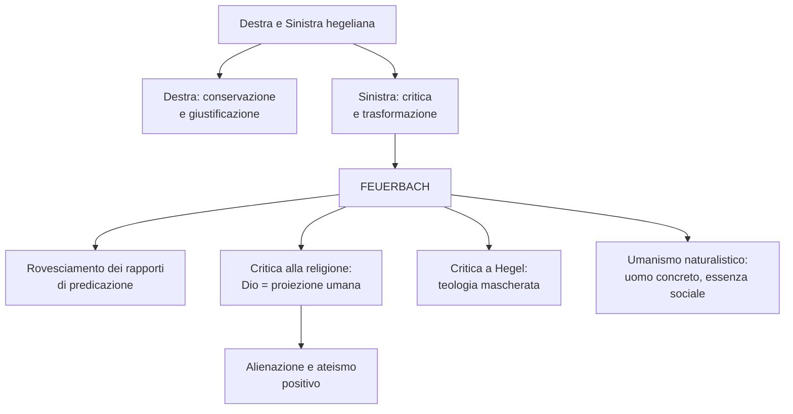

# Feuerbach

## La Destra e la Sinistra hegeliana

Alla morte di Hegel nel 1831, i suoi discepoli si divisero in due correnti, definite nel 1837 dal filosofo David Strauss con termini ispirati al Parlamento francese: "Destra" e "Sinistra" hegeliane. La spaccatura riguardava innanzitutto la religione. Hegel aveva affermato che religione e filosofia esprimono un medesimo contenuto, ma in due forme distinte: la prima nella forma della "rappresentazione", la seconda nella forma del "concetto". La Destra insisteva sull'identita' di contenuto e concepiva la filosofia come conservazione della religione; la Sinistra insisteva sulla diversita' di forma e concepiva la filosofia come distruzione della religione.

La spaccatura aveva anche un significato politico. La Destra, rifacendosi al principio hegeliano "tutto cio' che e' reale e' razionale", assumeva un atteggiamento giustificazionista e conservatore: la realta' non va cambiata perche' e' gia' la forma piu' razionale possibile. La Sinistra leggeva lo stesso principio in senso opposto — "tutto cio' che e' razionale e' reale" — e ne ricavava che l'affermarsi necessario di forme sempre piu' razionali comporta la trasformazione dello stato di cose esistente. In tal modo la Sinistra fini' per concepire la filosofia come critica dell'esistente e progetto di trasformazione rivoluzionaria.

---

## Vita e opere

La figura di maggior spicco della Sinistra hegeliana fu Ludwig Feuerbach, fondatore dell'ateismo filosofico ottocentesco. Nacque il 28 luglio 1804 a Landshut, in Baviera. Scolaro di Hegel a Berlino, si vide troncare la carriera universitaria a Erlangen a causa delle sue idee sulla religione, esposte nei *Pensieri sulla morte e l'immortalita'* (1830). Si ritiro' a Bruckberg, dove visse quasi sempre in solitudine. Nel 1841 pubblico' la sua opera fondamentale, *L'essenza del cristianesimo*, seguita dalla *Critica della filosofia hegeliana* (1839), dalle *Tesi provvisorie per la riforma della filosofia* (1843), dai *Principi della filosofia dell'avvenire* (1844) e dall'*Essenza della religione* (1845). Mori' in miseria a Rechenberg il 13 settembre 1872.

---

## Il rovesciamento dei rapporti di predicazione

La filosofia di Feuerbach muove dall'esigenza di cogliere l'uomo e la realta' nella loro concretezza, e ha come presupposto una critica radicale dell'approccio idealistico-religioso al mondo. Tale approccio consiste, secondo Feuerbach, in uno stravolgimento dei rapporti reali tra soggetto e predicato. Nella realta' effettiva delle cose l'essere e' il soggetto originario, di cui il pensiero e' il predicato, cioe' l'attributo; nell'idealismo, al contrario, il pensiero diventa il soggetto originario e l'essere il predicato. L'equivoco di fondo dell'idealismo e' quello di fare del concreto (l'essere, la natura, l'uomo, il finito) un attributo dell'astratto (il pensiero, lo Spirito, Dio, l'infinito), anziche' il contrario. Come scrive Feuerbach: "l'essere e' il soggetto, il pensiero e' il predicato. Il pensiero dunque deriva dall'essere, ma non l'essere dal pensiero". L'idealismo offre una visione rovesciata delle cose, e il programma di Feuerbach consiste appunto nel ristabilire il rapporto corretto: l'inizio della filosofia non e' Dio, non e' l'Assoluto, ma il finito, il determinato, il reale.

---

## La critica alla religione

Applicando questo rovesciamento alla religione, Feuerbach afferma che non e' Dio ad aver creato l'uomo, ma l'uomo ad aver creato Dio. Dio non e' altro che la proiezione illusoria di alcune qualita' umane — la ragione, la volonta' e il cuore — in un essere immaginario. Come scrive nell'*Essenza del cristianesimo*: "Tu credi che l'amore sia un attributo di Dio perche' tu stesso ami, credi che Dio sia un essere sapiente e buono perche' consideri bonta' e intelligenza le migliori tue qualita'". Il mistero della teologia e' dunque l'antropologia: la religione e' la prima, ma indiretta, autocoscienza dell'uomo, un'"antropologia capovolta" in cui l'uomo sposta il suo essere fuori da se', prima di ritrovarlo in se'.

Come nasce in concreto l'idea di Dio? Feuerbach offre tre spiegazioni. La prima: l'uomo come individuo si sente debole e limitato, ma come specie si sente infinito; Dio e' la personificazione immaginaria delle qualita' della specie. La seconda: l'uomo desidera piu' di quanto puo' ottenere, e Dio e' l'entita' capace di realizzare tutti i suoi desideri — "Dio e' l'ottativo del cuore umano divenuto tempo presente". La terza: il sentimento di dipendenza dalla natura ha spinto l'uomo ad adorare cio' senza cui non potrebbe esistere (la luce, l'aria, l'acqua, la terra).

---

## Alienazione e ateismo

Qualunque sia la sua origine, la religione costituisce per Feuerbach una forma di alienazione: l'uomo, "scindendosi", proietta fuori di se' una potenza superiore alla quale si sottomette. Quanto piu' l'uomo pone in Dio, tanto piu' toglie a se stesso. L'ateismo si configura quindi come un dovere morale: l'uomo deve recuperare in se' quei predicati positivi che ha proiettato fuori di se'. Il compito della vera filosofia non e' piu' porre il finito nell'infinito (risolvere l'uomo in Dio), ma porre l'infinito nel finito (risolvere Dio nell'uomo). L'ateismo di Feuerbach e' un ateismo "positivo" che propone di sostituire la teologia con l'antropologia, il culto di Dio con il culto dell'uomo, l'amore verso Dio con l'amore per l'uomo, cioe' la filantropia.

---

## La critica a Hegel

Se la religione e' un'antropologia capovolta, l'hegelismo e' una "teologia mascherata", cioe' la traduzione in chiave speculativa del pensiero teologico cristiano. Chi non rinuncia alla filosofia di Hegel, scrive Feuerbach, non rinuncia neppure alla teologia: la dottrina secondo cui la natura e' posta dall'Idea non e' che l'espressione razionale della dottrina secondo cui la natura e' creata da Dio. L'Idea o lo Spirito di Hegel, come il Dio della Bibbia, non e' che un "fantasma di noi stessi", il frutto di un'astrazione alienante. La filosofia di Hegel ha estraniato l'uomo da se stesso, ponendo l'essenza dell'uomo al di fuori dell'uomo. La critica a Hegel equivale dunque alla fondazione di una nuova filosofia incentrata sull'uomo concreto.

---

## L'umanismo naturalistico

La nuova filosofia proposta da Feuerbach, la "filosofia dell'avvenire", ha la forma di un umanismo naturalistico: "umanismo" perche' fa dell'uomo l'oggetto e lo scopo del discorso filosofico; "naturalistico" perche' fa della natura la realta' primaria da cui tutto dipende. Feuerbach rifiuta di considerare l'individuo come astratta spiritualita' e lo concepisce come un essere "di carne e di sangue", che vive, soffre, gioisce e avverte bisogni. Cio' che e' reale e' cio' che e' sensibile. La sensibilita' si lega all'amore, che per Feuerbach e' la passione che apre l'uomo verso il mondo e verso gli altri: l'io non puo' stare senza il tu, l'uomo ha costituzionalmente bisogno dei propri simili. Le idee scaturiscono solo dalla comunicazione tra gli uomini. Da cio' la dottrina dell'essenza sociale dell'uomo.

Il materialismo di Feuerbach non e' un materialismo "volgare" che riduce lo spirito alla materia: egli riconosce che i sentimenti e le idee hanno una radice fisica, ma non accetta che vengano "appiattiti" in senso puramente fisiologico. La celebre frase "l'uomo e' cio' che mangia" sottolinea piuttosto l'unita' psico-fisica dell'individuo e il fatto che, per migliorare le condizioni spirituali di un popolo, bisogna innanzitutto migliorarne le condizioni materiali.

---

## Schema riassuntivo

---

## Checklist

- [x] Contesto: Destra e Sinistra hegeliana
- [x] Vita e opere
- [x] Rovesciamento dei rapporti di predicazione
- [x] Critica alla religione e le tre ipotesi sull'origine di Dio
- [x] Alienazione e ateismo positivo
- [x] Critica a Hegel: teologia mascherata
- [x] Umanismo naturalistico e essenza sociale dell'uomo

## Collegamenti

- Filosofia: Hegel e la dialettica dello Spirito, da cui Feuerbach parte per poi rovesciarne il sistema; Marx, che riprende il concetto di alienazione ma lo radicalizza in chiave socio-economica (la religione come "oppio dei popoli"); Schopenhauer, che anch'egli rifiuta l'idealismo hegeliano, ma con esiti opposti (pessimismo e metafisica della volonta')
- Storia: il clima rivoluzionario del 1848 e i movimenti di secolarizzazione nell'Ottocento europeo
- Italiano: Leopardi e la critica delle illusioni consolatorie; il tema dell'uomo concreto nel Verismo
- Scienze: la tesi "l'uomo e' cio' che mangia" anticipa l'importanza della nutrizione per il benessere psico-fisico; il materialismo nel contesto del positivismo scientifico
- Educazione civica: il tema dell'alienazione e della dignita' dell'uomo si collega ai diritti fondamentali della persona nella Costituzione italiana (articoli 2 e 3)
- Arte: il Realismo pittorico come parallelo dell'esigenza feuerbachiana di tornare al concreto contro l'astrazione idealistica
