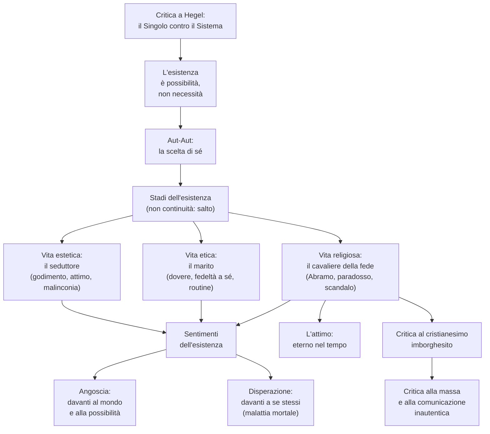

# Kierkegaard

## La vita e il "tragico destino misterioso"

Sören Kierkegaard nacque il 5 maggio 1813 a Copenhagen, ultimo di sette figli, dei quali solo due sopravvissero. La sua infanzia fu segnata da quello che egli stesso chiamerà un "tragico destino misterioso": il padre, uomo stimato e austero ma profondamente malinconico, gli rivelò un giorno di portare addosso una colpa segreta, di cui non chiarì mai la natura. Per Kierkegaard fu un "terremoto" interiore — gli parve che l'età avanzata del padre non fosse una benedizione divina ma piuttosto una maledizione, e che la famiglia fosse predestinata a essere cancellata "come un tentativo fallito". Da questa esperienza nacque la convinzione che la vita non sia un problema da risolvere razionalmente, ma una realtà oscura e drammatica da sperimentare nella propria interiorità.

Enigmatico e solitario, Kierkegaard visse sempre lontano dall'ambito accademico, trascorrendo l'intera esistenza a Copenhagen come libero pensatore. Negli anni dell'università si fidanzò con Regine Olsen, una ragazza di diciotto anni dell'alta borghesia danese, di cui era innamorato da tempo. Nel 1841, dopo poco più di un anno di fidanzamento, ruppe improvvisamente il rapporto, restituendole l'anello e dichiarando di aver "firmato una condanna a morte contro se stesso": era convinto che la propria malinconia e la propria vocazione religiosa fossero incompatibili con una vita coniugale serena. La rottura provocò un tale scandalo che fu costretto a trasferirsi a Berlino per alcuni mesi. Eppure Regine restò per sempre al centro della sua vita interiore — "c'è una legge fissa nella mia vita ed è che lei torna sempre in tutti i punti decisivi". Anni dopo, quando lei sposò un altro uomo, Kierkegaard ne fu devastato e in pochi mesi scrisse alcune delle sue opere più importanti, *Il concetto di angoscia* e *La malattia mortale*. Morì nel 1855, a soli quarantadue anni, esausto per le polemiche contro la Chiesa luterana danese. Regine, sua erede universale, rifiutò il poco che le aveva lasciato.

La sua produzione fu vastissima e in gran parte pubblicata sotto pseudonimi — Johannes de Silentio, Vigilius Haufniensis, Anti-Climacus, Johannes Climacus — perché Kierkegaard non voleva proporre una dottrina ma comunicare un'esperienza, parlando di volta in volta dal punto di vista dei diversi modi di esistere. Le opere principali sono *Aut-Aut* (1843), *Timore e tremore* (1843), *Il concetto di angoscia* (1844), *Briciole filosofiche* (1844), *La malattia mortale* (1849).

---

## La critica a Hegel: il Singolo contro il Sistema

L'intera filosofia di Kierkegaard nasce in opposizione frontale a Hegel, che dominava la cultura del tempo. Per Kierkegaard la filosofia hegeliana non è semplicemente sbagliata, è ridicola: nella sua sconfinata presunzione, Hegel pretende di spiegare tutto — la realtà, la storia, l'Assoluto — ma gli sfugge l'essenziale, cioè l'esistenza concreta del Singolo. La vita non si lascia intrappolare in uno schema razionale, perché è sempre e solo esperienza individuale, scelta, possibilità. "Ci furono dei filosofi che tentarono, prima di Hegel, di spiegare la storia — ma Hegel! A quali scoppi di risa devono essersi abbandonati gli dèi! Un così sgraziato professorino che pretende semplicemente di aver scoperto la necessità di ogni cosa!"

Il Sistema hegeliano tratta gli uomini come fossero una specie animale, in cui il singolo è inferiore al genere. Ma per Kierkegaard, fedele alla tradizione cristiana, ogni Singolo è creato a immagine di Dio e dunque vale più della specie: il Singolo è possibilità, libertà, responsabilità, e proprio per questo si pone sempre al di fuori del Sistema. "Questo non è il Sistema, non ha nulla a che fare con il Sistema. Il sottoscritto non è affatto un filosofo, non ha compreso il Sistema. La vita non è un problema da risolvere, è una realtà da sperimentare." Quello che Kierkegaard vuole trasmettere non è dunque un'ennesima dottrina, ma una comunicazione esistenziale.

La categoria fondamentale dell'esistenza non è la necessità, come pensa Hegel — nel cui sistema tutto accade necessariamente — ma la possibilità. La vita ci mette continuamente di fronte a scelte, e la scelta più importante non è tra una cosa e l'altra, ma è la scelta di se stessi.

---

## Aut-Aut: la scelta come destino

In *Aut-Aut* Kierkegaard contrappone la propria visione a quella di Hegel anche nel titolo: la vita non è fatta di *et-et* (sintesi degli opposti), ma di *aut-aut* (o questo o quello), di scelte che implicano rinunce dolorose. Non scegliere non è possibile, perché anche non scegliere è una scelta — anzi, è la scelta peggiore, perché significa lasciare che siano gli altri o le circostanze a scegliere al nostro posto. Kierkegaard usa l'immagine del capitano di una nave nel momento della battaglia: se non decide rapidamente, la nave avanza comunque con la sua velocità, e a un certo punto l'occasione di scegliere svanisce per sempre, non perché ha scelto, ma perché non l'ha fatto.

Da qui un'idea centrale: il rischio più grande che si possa correre quando si è giovani è quello di non rischiare. Chi non sceglie vive in modo inautentico, indossa una maschera che a poco a poco non riuscirà più a togliere, e finisce per perdere persino la capacità di amare. "In ogni uomo ci sono degli ostacoli che non gli permettono di essere completamente trasparente a se stesso — chi non può manifestarsi non può amare, e chi non può amare è l'essere più infelice." La scelta autentica non è dunque tra il bene e il male, ma tra se stessi e il niente: "la grandezza non consiste nell'essere questo o quello, ma nell'essere se stesso, e questo, chiunque può farlo, se lo vuole".

---

## Gli stadi dell'esistenza

L'esistenza umana, secondo Kierkegaard, può svolgersi a tre livelli o "stadi": estetico, etico e religioso. Non si tratta di tre tappe necessarie di un'evoluzione, come in Hegel: tra uno stadio e l'altro non c'è continuità razionale, ma un *salto*, una decisione esistenziale che non può essere giustificata dalla ragione. Ogni stadio è rappresentato da una figura simbolica.

### La vita estetica: il seduttore

Lo stadio estetico è rappresentato dal seduttore, figura incarnata in *Aut-Aut* da Don Giovanni e soprattutto da Johannes nel celebre *Diario del seduttore*. L'esteta è colui che pone lo scopo della propria vita fuori di sé, nella ricerca del godimento, e vive nell'attimo, seguendo casualmente i propri desideri. "Godi la vita, godi te stesso, vivi il tuo desiderio": questa è la sua massima. Ma proprio perché fa dipendere il senso della vita da qualcosa di esteriore — un piacere, un'emozione, una conquista — l'esteta è in realtà schiavo: i desideri sono molteplici e la sua vita si frantuma in una sconfinata molteplicità di esperienze, dietro le quali egli stesso si dissolve. "Tu stesso non sei nulla, una figura misteriosa sulla cui fronte sta scritto aut-aut. La vita è una mascherata, dici tu — eppure non sai che giungerà l'ora della mezzanotte in cui ognuno dovrà smascherarsi?"

L'essenza profonda della vita estetica è la malinconia. Per quanto il seduttore si dia da fare a inseguire piaceri sempre nuovi e più raffinati, lo spirito si vendica di lui legandolo con le catene della noia: se gli si offrisse l'amore della più bella fanciulla, risponderebbe che per mezzo annetto potrebbe andare bene. "In realtà tu non aspiri a nulla, non desideri nulla. L'unica cosa che potresti desiderare è una bacchetta magica che ti potesse dare tutto, e poi la useresti per pulirti la pipa." La vita estetica è disperazione mascherata da divertimento. Il *Diario del seduttore*, che Kierkegaard scrisse in parte come confessione e in parte come supplizio inflitto a se stesso dopo la rottura con Regine, è il ritratto spietato di Johannes, l'esteta raffinato che corteggia la giovane Cordelia non per amore ma per godere "artisticamente" del processo di seduzione, della conquista della sua anima, del momento esatto in cui lei sarà costretta ad abbandonarsi. "Amare una sola è troppo poco, amarle tutte è superficialità — conoscere se stessi e amarne quante più è possibile, questo è godimento, questo è vivere." Quando Cordelia gli si concede, Johannes la abbandona: "non desidero ricordare questa mia relazione con lei. Ella ha perduto ogni profumo."

L'unica via d'uscita dalla vita estetica è abbracciare consapevolmente la propria disperazione. "Allora che ti rimane da fare? Ho una sola risposta: dispera! Scegli dunque la disperazione, poiché la disperazione stessa è una scelta. E mentre si dispera, si sceglie di nuovo — si sceglie se stessi, non come individuo casuale, ma nel proprio eterno valore."

### La vita etica: il marito

Lo stadio etico è rappresentato dal marito, dall'uomo che ha scelto se stesso e che pone in sé — non fuori di sé — il proprio centro di gravità. Mentre il seduttore insegue affannosamente piaceri sempre diversi, l'uomo etico sa gioire delle piccole gioie della vita ordinaria: il lavoro, la fedeltà coniugale, i doveri quotidiani. Il mondo moderno deride questa vita come banale e celebra come libertà la ricerca incessante del piacere, ma per Kierkegaard la vera libertà la conquista solo chi abbraccia la vita etica, perché diventa se stesso, costruisce la propria personalità e non dipende più dall'esterno.

"Chi sceglie se stesso eticamente ha se stesso come suo compito, non come giocattolo per il suo arbitrio." Nell'etica non conta tanto la molteplicità dei doveri quanto l'intensità con cui essi vengono sentiti: l'uomo al quale l'importanza del dovere non si è mai mostrata in tutta la sua infinità è "mediocremente uomo". Tuttavia anche la vita etica non è il punto d'arrivo: chi vi si ferma rischia di cadere nella routine e nell'autosufficienza, di credere di essere a posto con la propria coscienza e con la società. Ma davanti a Dio, l'uomo si scopre sempre in colpa, perché si rende conto che Dio lo ha amato per primo. Da questa coscienza nasce il pentimento, ed è il pentimento che apre il *salto* verso lo stadio religioso.

### La vita religiosa: il cavaliere della fede

Lo stadio religioso è rappresentato dal cavaliere della fede, di cui Kierkegaard fa in *Timore e tremore* il ritratto attraverso la figura di Abramo, simbolo di fede per le tre religioni monoteistiche. Abramo riceve da Dio l'ordine di sacrificare il figlio Isacco e si mette in cammino verso il monte Moria: per la morale comune sarebbe un assassino, e nessuno potrebbe approvare il suo gesto. Eppure è proprio in questa situazione paradossale che si manifesta la fede: il Singolo, in rapporto assoluto con l'Assoluto, si pone al di fuori del terreno rassicurante della morale (ciò che Kierkegaard chiama "il generale"). Non a caso lo pseudonimo con cui firma l'opera è Johannes de Silentio: il cavaliere della fede è condannato al silenzio, perché le ragioni della fede non possono essere comunicate né comprese da nessuno. Mentre l'eroe tragico (come Agamennone che sacrifica Ifigenia per la patria) viene compreso e ammirato dalla città, il cavaliere della fede è solo.

La fede non è dunque un lasciapassare per la tranquillità: è la categoria più rischiosa dell'esistenza, perché mette il Singolo solo davanti a Dio. "Essere cristiano è l'inquietudine più alta dello spirito, è impazienza dell'eternità." Su questo punto Kierkegaard si scaglia con violenza contro la società cristiana del suo tempo: la Chiesa luterana danese ha trasformato il cristianesimo in una comoda apparenza, in un cristianesimo "imborghesito" e tranquillizzante, fatto di persone che "giocano al cristianesimo" senza viverlo davvero. "C'è il cristianesimo, ma non ci sono più i cristiani." Il cristianesimo autentico è invece paradosso e scandalo, perché chiede di credere all'impossibile: che Gesù Cristo, un uomo umile, povero, condannato a morte come un fuorilegge, sia Dio. Davanti a questo paradosso assoluto la ragione si arrende. "La fede non si può comprendere: il massimo a cui si arriva è poter comprendere che non si può comprendere."

---

## L'angoscia: il vertigine della possibilità

Nel *Concetto di angoscia* Kierkegaard analizza il sentimento fondamentale dell'esistenza umana. Mentre la paura è sempre paura di qualcosa di determinato, l'angoscia è la paura del niente — meglio, del puro sentimento della possibilità. "Nel possibile, tutto è possibile": è proprio questa indeterminatezza vertiginosa a rendere l'angoscia spaventosa. L'angoscia è radicata nella condizione umana stessa: se l'uomo fosse soltanto angelo o soltanto bestia non la conoscerebbe, ma poiché è un essere libero, sospeso fra finito e infinito, è condannato a sentirla.

Kierkegaard la collega al peccato originale: Adamo è diventato realmente libero solo quando, davanti al divieto divino, ha potuto scegliere. "Il divieto divino rende inquieto Adamo perché sveglia in lui la possibilità della libertà: il niente dell'angoscia è entrato in lui, l'angosciante possibilità di potere." L'angoscia è dunque proiettata verso il futuro: ogni volta che l'uomo si trova davanti a una scelta, di fronte all'aprirsi delle possibilità, sente la vertigine della libertà.

---

## La disperazione: la malattia mortale

Se l'angoscia è il sentimento dell'uomo davanti al mondo e alle possibilità, la disperazione, analizzata ne *La malattia mortale*, è il sentimento che l'uomo prova nel rapporto con se stesso. Può assumere due forme contrapposte e ugualmente fallimentari. La prima è il *voler disperatamente essere se stesso*: consiste nel non accettare i limiti della condizione umana, nel pretendere di essere autosufficienti — è la disperazione del titano che vuole farsi da sé, ma il tentativo è destinato al fallimento. La seconda è il *non voler disperatamente essere se stesso*: nella libertà dell'uomo c'è anche quella di rifiutarsi, di fuggire dalla propria identità — ma anche questo è disperazione, perché il rapporto con il proprio io è costitutivo dell'essere umano.

In entrambi i casi si tratta di una "malattia mortale", non perché conduca alla morte fisica dell'io ma perché consiste nel continuo vivere la morte dell'io. L'unico antidoto è la fede, intesa come accettarsi nelle mani di Dio, cioè con i propri limiti umani. Tuttavia la fede è paradossalmente "un aiuto che non aiuta": non elimina la libertà di scelta, anzi la richiede, facendo uscire l'uomo dal conformismo della massa. E la possibilità di scelta genera nuovamente angoscia. La condizione cristiana, lungi dall'essere rassicurante, è la più drammatica di tutte.

---

## L'attimo e l'eterno: la contemporaneità del cristianesimo

Per Hegel la storia è teofania, manifestazione progressiva dello Spirito Assoluto. Per Kierkegaard, al contrario, Dio non è immanente ma assolutamente trascendente: l'incontro tra Dio e l'uomo non avviene in un processo storico necessario, ma nell'*attimo*, nell'inserzione folgorante dell'eterno nel tempo. Il cristianesimo, ridotto a cultura, si riferisce a un avvenimento di duemila anni fa; ma come fede esso è sempre contemporaneo, perché accade nella vita di ogni Singolo come scelta esistenziale. Per questo una verità conta realmente solo quando diventa vera *per me* e agisce nella mia vita. La fede non è una verità astratta e dimostrabile, ma una passione: "la passione è la cosa essenziale, è ciò che misura l'energia dell'uomo, e per questo il nostro tempo è così miserabile, perché non ha più alcuna passione. La fede è un prodigio, e nessun essere umano ne è escluso, perché la vita umana è fatta di passioni, e la fede è una passione."

---

## La critica alla massa e alla società moderna

Negli ultimi anni della vita Kierkegaard sviluppò una violenta critica alla società contemporanea, anticipando temi che diventeranno centrali nel pensiero del Novecento. La massa, la folla anonima, distrugge la personalità del Singolo: chi si fa inghiottire dalla folla rinuncia a realizzare se stesso, accettando una comoda omologazione che gli risparmia l'angoscia della scelta. "La folla è Dio, la folla è la verità, la folla è il potere e l'onore": ma nella folla scompare ogni individualità autentica. La stampa, secondo Kierkegaard, è il principale strumento di questa omologazione, perché diffonde notizie senza significato e sommerge le persone di dati ripetendoli pedissequamente, fino a privare le parole di ogni spessore. "Se l'informazione fosse una bottega con un'insegna sopra, dovrebbe esserci scritto: qui si demoralizza più gente possibile, nel più breve tempo possibile, al minor costo possibile." Nessuno osa più dire "io", e la prima condizione di ogni comunicazione autentica — la personalità — viene distrutta. "Tutti rivendicano il diritto di parola, pochi però si ricordano del diritto di pensare."

---

## L'eredità di Kierkegaard

Pressoché ignorato in vita fuori dalla Danimarca, Kierkegaard è stato riscoperto nel Novecento ed è considerato il padre dell'esistenzialismo. La sua riflessione sull'angoscia, sulla disperazione, sulla scelta, sull'autenticità ha profondamente influenzato Heidegger, Sartre, Jaspers, Camus. Il suo concetto di "Singolo in rapporto assoluto con l'Assoluto" è stato ripreso dalla teologia protestante di Karl Barth e dall'esistenzialismo cristiano di Gabriel Marcel. La critica all'omologazione della massa e alla comunicazione inautentica anticipa Heidegger e la Scuola di Francoforte. Anche la sua analisi del cristianesimo come paradosso e scandalo, contro un cristianesimo ridotto a cultura e abitudine sociale, è entrata nel cuore della teologia contemporanea.

---

## Schema riassuntivo

---

## Checklist

- [x] Biografia: la colpa misteriosa del padre, Regine Olsen, la lotta contro la Chiesa danese
- [x] La critica a Hegel: il Singolo fuori dal Sistema
- [x] L'esistenza come possibilità e l'errore della necessità hegeliana
- [x] Aut-Aut: la scelta di se stessi
- [x] I tre stadi dell'esistenza: estetico, etico, religioso
- [x] La vita estetica: il seduttore, Don Giovanni, il *Diario del seduttore*, la malinconia
- [x] La vita etica: il marito, il dovere, la fedeltà a sé
- [x] La vita religiosa: il cavaliere della fede, Abramo, paradosso e scandalo
- [x] L'angoscia come sentimento della possibilità
- [x] La disperazione come malattia mortale (volere/non volere essere se stessi)
- [x] L'attimo come inserzione dell'eterno nel tempo
- [x] La critica al cristianesimo "imborghesito" della società danese
- [x] La critica alla massa, alla folla e alla stampa
- [x] L'eredità di Kierkegaard: padre dell'esistenzialismo

## Collegamenti

- Filosofia: Hegel come anti-modello costante (Singolo vs Sistema, possibilità vs necessità, aut-aut vs et-et); affinità con Pascal (la fede come scommessa esistenziale, non come dimostrazione razionale); anticipazione di Schopenhauer per il pessimismo e dell'esistenzialismo del Novecento (Heidegger, Sartre, Jaspers, Camus); contrasto con Nietzsche, che parte dalla stessa diagnosi (cristianesimo borghese ipocrita) ma ne trae conclusioni opposte (la "morte di Dio" invece del cristianesimo autentico)
- Italiano: Leopardi e il tema della noia come sentimento di chi pone il senso della vita fuori di sé; il "rischio più grande è non rischiare" richiama l'esaltazione leopardiana della giovinezza e dell'illusione contro la morta vita borghese; il dialogo tra il seduttore e il marito ricorda la *Ginestra* nella contrapposizione tra individuo solitario e "social catena"
- Storia: la critica alla società di massa, all'omologazione e al ruolo della stampa anticipa le grandi diagnosi della società di massa del Novecento (Ortega y Gasset, Adorno, Marcuse); il rifiuto del progresso storico hegeliano si inserisce nella crisi della cultura europea dopo il fallimento dei moti del 1848
- Inglese: il tema dell'angoscia e dell'inautenticità della vita moderna confluisce nel modernismo di T. S. Eliot (*The Waste Land*) e nei personaggi joyciani paralizzati dalla "non-scelta" (i protagonisti di *Dubliners*); il "seduttore" che vive nell'attimo richiama Dorian Gray di Oscar Wilde, che pone lo scopo della vita nel godimento estetico fino alla disperazione
- Religione e cultura: il cavaliere della fede di *Timore e tremore* riprende Abramo, figura comune a ebraismo, cristianesimo e islam; la critica al cristianesimo formale anticipa la teologia dialettica di Karl Barth e Dietrich Bonhoeffer
- Arte: il Romanticismo e il tema dell'inquietudine, della malinconia e del solitario in lotta con il mondo (Friedrich, Géricault); l'iconografia del seduttore richiama figure dell'arte simbolista e decadente di fine Ottocento
