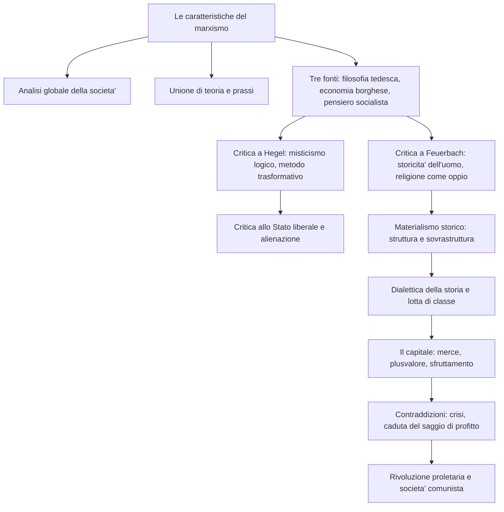

# Marx

## La vita e la formazione

Karl Marx nacque nel 1818 a Treviri, nella Germania sud-occidentale, da una famiglia ebrea convertitasi al protestantesimo per ragioni di opportunita' politica, pur mantenendo di fatto posizioni agnostiche. Il padre, avvocato brillante e colto, gli trasmise un'educazione razionalistica e liberale. Nel 1835-1836 si iscrisse a giurisprudenza a Bonn e poi a Berlino, dove entro' in contatto con i "giovani hegeliani" e passo' allo studio della filosofia, laureandosi a Jena nel 1841 con una tesi sulla filosofia della natura di Democrito e di Epicuro. Abbandonata la carriera accademica a causa della politica reazionaria del governo prussiano, divenne caporedattore della "Gazzetta renana". Dopo l'interdizione del giornale, nel 1843 si trasferi' a Parigi, dove strinse con Friedrich Engels un'amicizia che sarebbe durata tutta la vita e che gli sarebbe stata di conforto intellettuale, morale e materiale. Nello stesso anno sposo' Jenny von Westphalen e scrisse la *Critica della filosofia del diritto di Hegel*; nel 1844, sugli "Annali franco-tedeschi", apparvero i saggi che testimoniano il suo passaggio al comunismo, e stese i *Manoscritti economico-filosofici*.

Espulso dalla Francia su insistenza del governo prussiano, si trasferi' a Bruxelles, dove con Engels scrisse *L'ideologia tedesca* (1845-1846), ponendo le basi della concezione materialistica della storia. Nel 1848 pubblico' il *Manifesto del partito comunista*. Tra il 1848 e il 1849 fondo' a Colonia la "Nuova gazzetta renana", ma con la vittoria della controrivoluzione tedesca venne espulso dalla Germania e, dopo un breve ritorno a Parigi, emigro' definitivamente a Londra. Qui, ritiratosi dalla politica attiva nel 1851, comincio' a lavorare al British Museum, dedicandosi agli studi economici. Furono anni tormentati da problemi economici, che Marx affrontava grazie ai compensi della collaborazione al "New York Tribune" e agli aiuti di Engels. Nel 1867 pubblico' il primo volume de *Il capitale*; il secondo e il terzo appariranno postumi, nel 1885 e nel 1894, grazie al lavoro di Engels. Nel 1875 scrisse la *Critica del programma di Gotha*. Nel 1881 mori' la moglie Jenny; due anni dopo, nel 1883, Marx si spense a Londra, compianto da Engels e dal movimento operaio internazionale.

---

## Le caratteristiche generali del marxismo

Il primo tratto distintivo del pensiero di Marx e' la sua irriducibilita' a una dimensione puramente filosofica, sociologica o economica: il marxismo si pone come un'analisi globale della societa' e della storia, capace di investire l'intero assetto strutturale e sovrastrutturale del capitalismo. Come scrivera' il filosofo Karl Korsch, il marxismo non si lascia collocare in nessuno dei comparti tradizionali delle scienze borghesi, perche' investe contemporaneamente l'economia, la filosofia, la storia, la teoria del diritto e dello Stato. La tendenza di Marx e' quella di indagare il fatto sociale non a compartimenti stagni, ma nell'unita' organica delle sue manifestazioni.

Il secondo contrassegno fondamentale e' il legame con la prassi: il marxismo non e' soltanto un'interpretazione del mondo, ma un impegno di trasformazione rivoluzionaria. Nel discorso pronunciato sulla tomba dell'amico, Engels affermo' che "lo scienziato non era neppure la meta' di Marx", perche' Marx era prima di tutto un rivoluzionario. Come recita la celebre undicesima tesi su Feuerbach: "i filosofi hanno solo interpretato il mondo; si tratta ora di cambiarlo".

Come scrive Engels, le influenze culturali alla base del marxismo sono essenzialmente tre: la filosofia classica tedesca (da Hegel a Feuerbach), l'economia politica borghese (da Smith a Ricardo) e il pensiero socialista (da Saint-Simon a Proudhon). Marx le ripensa alla luce di una sintesi creativa che, pur muovendo da esse, procede criticamente oltre i loro risultati, mettendo capo a una nuova visione del mondo.

---

## La critica a Hegel

Il rapporto tra Marx e Hegel e' molto complesso. E' innegabile che l'hegelismo abbia esercitato su Marx un influsso decisivo: da Hegel Marx prende la visione della storia come processo dialettico e il concetto di alienazione. Ma il rapporto e' innanzitutto critico.

Nella *Critica della filosofia del diritto di Hegel* (1843), Marx accusa il maestro di "misticismo logico": lo stratagemma di Hegel consiste nel trasformare le realta' empiriche in manifestazioni necessarie dello Spirito. Invece di constatare che in certi ordinamenti storici esiste la monarchia, Hegel afferma che lo Stato presuppone per forza una sovranita' che si incarna necessariamente nel monarca, deducendone la piena logicita'. Le istituzioni finiscono per essere allegorie di una realta' spirituale occultata dietro di esse. L'idealismo fa del concreto la manifestazione dell'astratto: e' una filosofia capovolta, che cammina sulla testa.

Ispirandosi a Feuerbach, Marx oppone al metodo "mistico" di Hegel il proprio metodo "trasformativo", che consiste nel ricapovolgere cio' che l'idealismo ha capovolto, ossia nel riconoscere di nuovo cio' che e' veramente soggetto e cio' che e' veramente predicato. Ma la critica non e' solo filosofica: il metodo di Hegel e' anche conservatore sul piano politico, poiche' porta a "santificare" la realta' esistente trasformando i dati di fatto in manifestazioni razionali dello Spirito. L'esito del giustificazionismo speculativo di Hegel e' pertanto un giustificazionismo politico che, "facendo la corte" ai fatti, si trasforma in accettazione delle istituzioni statali vigenti e in sostegno ideologico dell'ordine esistente. Tuttavia Marx riconosce a Hegel il merito della prospettiva dialettica, ossia della concezione della realta' come totalita' storico-processuale mossa da opposizioni.

---

## La critica allo Stato liberale e l'alienazione

Alla base della teoria di Marx vi e' la critica globale della civilta' moderna e dello Stato liberale. Il punto di partenza e' la convinzione, mutuata da Hegel, che nel mondo moderno si sia prodotta una scissione tra societa' civile e Stato. Mentre nella polis greca l'individuo viveva in unita' con la comunita', nel mondo moderno l'uomo e' costretto a vivere due vite: una "in terra" come borghese, nell'ambito dell'egoismo e degli interessi particolari, e l'altra "in cielo" come cittadino, nella sfera dello Stato e dell'interesse comune. Ma il "cielo" dello Stato e', secondo Marx, puramente illusorio: lo Stato non fa che riflettere e sancire gli interessi delle classi piu' forti, e l'uguaglianza formale di fronte alla legge non fa che presupporre e ratificare la disuguaglianza sostanziale. La civilta' moderna e' la societa' dell'egoismo e delle particolarita' "reali", e nello stesso tempo la societa' della fratellanza e delle universalita' "illusorie". All'emancipazione politica (uguaglianza formale) Marx contrappone l'emancipazione umana (uguaglianza sostanziale), che si ottiene eliminando il fondamento di ogni disuguaglianza: la proprieta' privata. Il soggetto di questa trasformazione e' il proletariato, la classe priva di proprieta' che soffre maggiormente dell'alienazione.

Nei *Manoscritti economico-filosofici* (1844) Marx analizza la condizione del lavoratore attraverso il concetto di alienazione. A differenza di Hegel, per il quale l'alienazione era un momento insieme positivo e negativo della dialettica dello Spirito, e di Feuerbach, per cui era un fatto coscienziale legato alla religione, Marx la considera un fatto reale, di natura socio-economica, che si identifica con la condizione storica del salariato nella societa' capitalistica. L'alienazione dell'operaio si manifesta sotto quattro aspetti: e' alienato rispetto al prodotto del suo lavoro, che non gli appartiene e gli si erge contro come una potenza estranea; rispetto alla sua stessa attivita', ridotta a lavoro forzato per il profitto del capitalista; rispetto alla propria essenza di uomo, poiche' il suo lavoro non e' libero e creativo ma forzato e ripetitivo; rispetto al prossimo, poiche' il rapporto con il capitalista e con l'umanita' in genere e' conflittuale. La causa dell'alienazione risiede nella proprieta' privata dei mezzi di produzione; il suo superamento coincide con l'avvento del comunismo.

---

## Il distacco da Feuerbach e la religione

Marx riconosce a Feuerbach il merito di aver rivendicato la naturalita' e la concretezza dell'uomo contro l'idealismo di Hegel, e di aver demistificato la dialettica hegeliana. Tuttavia Feuerbach, pur avendo sottolineato la naturalita' dell'uomo, ha perso di vista la sua storicita': non esiste l'uomo in astratto, ma l'uomo figlio e prodotto di una determinata societa' e di uno specifico mondo storico. Marx corregge Hegel con Feuerbach (difendendo la naturalita' dell'uomo) e Feuerbach con Hegel (difendendo la socialita' e la storicita' dell'uomo).

Anche sulla religione Marx va oltre. Feuerbach aveva scoperto che non e' Dio a creare l'uomo, ma l'uomo a "proiettare" Dio, ma non ne aveva colto le cause reali. Per Marx le radici del fenomeno religioso vanno cercate in una determinata tipologia storica di societa': la religione e' l'"oppio dei popoli", il "sospiro della creatura oppressa", il prodotto di un'umanita' alienata e sofferente a causa delle ingiustizie sociali, che cerca illusoriamente nell'aldila' cio' che le e' negato nell'aldiqua'. L'uomo si rifugia nella religione perche' oppresso: eliminando le cause dell'oppressione, cessera' anche il bisogno della religione. La religione e' un sintomo, non la malattia da curare: eliminata la societa' che la produce, sparira' anche il bisogno di rifugiarsi in essa. La disalienazione religiosa ha dunque come presupposto la disalienazione economica, ossia l'abbattimento della societa' di classe. Un altro limite di Feuerbach e' il suo tendenziale contemplativismo e teoreticismo, che lo porta a cercare la soluzione dei problemi nella teoria, trascurando l'aspetto della prassi rivoluzionaria.

---

## La concezione materialistica della storia

La critica a Feuerbach segna il passaggio dall'umanesimo al materialismo storico. Ne *L'ideologia tedesca* (1845-1846), Marx ed Engels si propongono di cogliere il "movimento reale" della storia, al di la' delle ideologie. In una delle sue accezioni principali, l'ideologia e' per Marx una "falsa rappresentazione" della realta', un'immagine deformata dei rapporti reali tra gli uomini che deriva dagli interessi di classe di chi la produce. L'intento di Marx e' quello di svelare, al di la' delle ideologie, la verita' sulla storia e sulla societa', mediante un punto di vista oggettivo che permetta di descrivere non cio' che gli uomini "possono apparire nella rappresentazione propria o altrui, bensi' quali sono realmente".

Proprio sulla base di questa concezione, Marx rivolge una critica durissima ai rappresentanti della Sinistra hegeliana, che definisce "ideologi": costoro vivono nella "falsa coscienza", non si rendono conto che le idee rispecchiano le relazioni materiali degli uomini e non hanno un'esistenza autonoma. Gli ideologi finiscono per sopravvalutare la funzione delle idee e degli intellettuali, credendo che basti cambiare le idee per cambiare il mondo; in realta' la vera alienazione non risiede nelle idee, ma nelle situazioni sociali concrete, per cui la disalienazione dell'uomo non e' un problema filosofico risolvibile sul piano della critica teorica, ma un problema pratico-sociale risolvibile sul piano della rivoluzione. La storia non e' un evento spirituale, ma un processo materiale fondato sulla dialettica bisogno-soddisfacimento. Alla sua base vi e' il lavoro, che Marx intende come creatore di civilta' e di cultura, come cio' attraverso cui l'uomo emerge dall'animalita' primitiva.

Marx distingue due elementi fondamentali: le forze produttive (gli uomini che producono, i mezzi di produzione, le conoscenze tecniche) e i rapporti di produzione (i rapporti che regolano il possesso dei mezzi di lavoro, espressi giuridicamente nei rapporti di proprieta'). Insieme costituiscono il "modo di produzione". L'insieme dei rapporti di produzione forma la struttura, lo scheletro economico della societa'. Al di sopra si eleva la sovrastruttura: rapporti giuridici, forme dello Stato, dottrine etiche, religiose e filosofiche, che non sono realta' a se' stanti ma espressioni dei rapporti strutturali. "Materialismo storico" non allude alla tesi metafisica per cui la materia e' la causa di tutto, ma al convincimento che le vere forze motrici della storia siano di natura socio-economica: non e' la coscienza che determina la vita, ma la vita che determina la coscienza.

Le forze produttive si sviluppano piu' rapidamente dei rapporti di produzione, creando periodicamente una contraddizione che genera un'epoca di rivoluzione sociale. Le nuove forze produttive sono incarnate da una classe in ascesa, i vecchi rapporti di proprieta' da una classe al tramonto: lo scontro e' inevitabile. L'esempio tipico e' la Francia del Settecento, dove la borghesia si scontro' con l'aristocrazia. Analogamente, nel capitalismo moderno la contraddizione tra forze produttive sociali e rapporti privatistici porta in se', come esigenza dialettica, il socialismo. La storia procede dal comunismo primitivo al comunismo futuro, attraverso formazioni economico-sociali successive: comunita' primitiva, societa' asiatica, societa' antica, societa' feudale, societa' borghese e futura societa' socialista.

---

## Il Manifesto del partito comunista

Il *Manifesto* (1848), scritto con Engels su richiesta della Lega dei comunisti, e' una sintesi della concezione marxista del mondo. La borghesia, a differenza delle classi dominanti del passato, non puo' esistere senza rivoluzionare continuamente gli strumenti di produzione e tutto l'insieme dei rapporti sociali. Ma questa stessa borghesia assomiglia allo stregone che non riesce piu' a dominare le potenze evocate: le moderne forze produttive, sempre piu' sociali, si rivoltano contro i vecchi rapporti di proprieta', generando crisi terribili. Il proletariato, classe oppressa della societa' borghese, non puo' fare a meno di mettere in opera una dura lotta di classe. La storia di ogni societa' "e' storia di lotte di classi": liberi e schiavi, patrizi e plebei, baroni e servi della gleba, capitalisti e salariati furono continuamente in reciproco contrasto. Il Manifesto termina con la nota esortazione: "Proletari di tutto il mondo, unitevi!".

Marx critica anche i "falsi socialismi": il socialismo reazionario (feudale, piccolo-borghese, tedesco), rivolto al passato anziche' al futuro; il socialismo conservatore di Proudhon, che vuole rimediare agli inconvenienti del capitalismo senza distruggerlo; il socialismo utopistico di Saint-Simon e Fourier, che pur riconoscendo l'antagonismo tra le classi non attribuisce al proletariato una funzione rivoluzionaria autonoma. A queste correnti Marx contrappone il proprio "socialismo scientifico", basato sull'analisi dei meccanismi del capitalismo e sull'individuazione del proletariato come forza rivoluzionaria.

---

## Il capitale

Ne *Il capitale* Marx si propone di svelare la legge economica della societa' moderna. Ogni merce possiede un "valore d'uso" (deve servire a qualcosa) e un "valore di scambio" (che dipende dalla quantita' di lavoro socialmente necessario per produrla). Marx contesta il "feticismo delle merci", cioe' la tendenza a considerare le merci come aventi valore di per se', dimenticando che sono frutto del lavoro umano e di determinati rapporti sociali.

Il ciclo economico del capitalismo non e' quello "semplice" delle societa' pre-borghesi, descrivibile con la formula M.D.M. (merce-denaro-merce), in cui un produttore vende una merce per comprarne un'altra di cui ha bisogno. Il ciclo propriamente capitalistico e' descrivibile con la formula D.M.D' (denaro-merce-piu' denaro): il capitalista investe denaro in una merce per ottenere, alla fine, piu' denaro di quanto ne abbia investito. Questo "piu'" e' il plusvalore, che non nasce dallo scambio ma dalla produzione: il capitalista compra la forza-lavoro dell'operaio pagandola secondo il suo valore (il salario), ma l'operaio produce un valore ben maggiore. Il plusvalore e' dunque il valore gratuitamente offerto al capitalista, e discende dal "pluslavoro" dell'operaio. Per accrescerlo, il capitalista puo' prolungare la giornata lavorativa ("plusvalore assoluto") o aumentare la produttivita' con le macchine ("plusvalore relativo"). Il profitto non coincide con il plusvalore: e' il rapporto tra il plusvalore e l'intero capitale investito (costante e variabile), ed e' pertanto sempre inferiore al saggio del plusvalore.

Il capitalismo genera pero' contraddizioni che ne minano la solidita'. L'uso delle macchine produce crisi cicliche di sovrapproduzione: c'e' crisi non perche' manchino le merci, ma perche' ce ne sono troppe, a causa dell'"anarchia della produzione". Il continuo rinnovamento tecnologico genera la caduta tendenziale del saggio del profitto: il capitale costante cresce smisuratamente rispetto al capitale variabile, e il profitto risulta via via piu' scarso rispetto al capitale impiegato. Queste contraddizioni producono la tendenza verso la scissione della societa' in due sole classi antagoniste: una minoranza sempre piu' ricca e una maggioranza sempre piu' sfruttata.

---

## La rivoluzione e la societa' comunista

Le contraddizioni del capitalismo costituiscono la base della rivoluzione proletaria, che attua il passaggio al comunismo attraverso la socializzazione dei mezzi di produzione. Il proletariato deve spezzare la macchina dello Stato borghese — non impadronirsene, ma distruggerne i meccanismi istituzionali di fondo — e instaurare la dittatura del proletariato: a differenza delle dittature precedenti, sara' la dittatura di una maggioranza di ex-oppressi su una minoranza di ex-oppressori, destinata a scomparire con il superamento di ogni forma di Stato.

Marx distingue tra un comunismo "rozzo", che si limita a trasformare la proprieta' in proprieta' di tutti senza cambiare la mentalita' possessiva, e un comunismo autentico, in cui l'uomo cessa di rapportarsi al mondo in termini di puro possesso e consumo. All'uomo della civilta' proprietaria, ossessionato dall'avere, Marx contrappone un "uomo nuovo", un essere "onnilaterale" e "totale". Nella *Critica del programma di Gotha* (1875) descrive due fasi della societa' futura: una prima in cui i beni sono distribuiti in base al lavoro prestato, e una seconda in cui vale il principio "ognuno secondo le sue capacita'; a ognuno secondo i suoi bisogni". La societa' comunista si profila come una societa' senza divisione del lavoro, senza proprieta' privata, senza classi, senza sfruttamento, senza miseria, senza divisioni tra gli uomini e senza Stato.

---

## Schema riassuntivo

---

## Checklist

- [x] Biografia e contesto storico
- [x] Le caratteristiche generali del marxismo
- [x] La critica a Hegel: misticismo logico e metodo trasformativo
- [x] La critica allo Stato liberale e l'alienazione
- [x] Il distacco da Feuerbach e la religione come "oppio dei popoli"
- [x] La concezione materialistica della storia: struttura e sovrastruttura
- [x] La dialettica della storia e le formazioni economico-sociali
- [x] Il Manifesto del partito comunista e la critica ai falsi socialismi
- [x] Il capitale: merce, plusvalore, sfruttamento, caduta del saggio di profitto
- [x] La rivoluzione, la dittatura del proletariato e la societa' comunista

## Collegamenti

- Italiano: Giovanni Verga e il Verismo come rappresentazione delle condizioni di vita delle classi subalterne; il tema dello sfruttamento del lavoro nei *Malavoglia* e in *Rosso Malpelo*; Pier Paolo Pasolini e la denuncia del sottoproletariato urbano
- Latino: Seneca e le riflessioni sulla condizione degli schiavi nell'*Epistola 47*; il concetto di humanitas come superamento delle distinzioni sociali
- Storia: la Rivoluzione industriale e le condizioni della classe operaia; i moti del 1848; la Comune di Parigi (1871); la nascita dei partiti socialisti e del movimento operaio; la Rivoluzione russa del 1917 come tentativo di applicazione del marxismo
- Filosofia: Hegel e la dialettica; Feuerbach e il rovesciamento dell'idealismo; Schopenhauer come altro "maestro del sospetto"; Nietzsche e la critica ai valori della societa' borghese; il positivismo e la pretesa di scientificita'
- Scienze: Darwin e la lotta per l'esistenza come modello naturalistico che Marx intendeva applicare alla societa'; il determinismo scientifico e il concetto di "legge tendenziale"
- Inglese: Charles Dickens e la denuncia delle condizioni della classe operaia nell'Inghilterra vittoriana (*Oliver Twist*, *Hard Times*); la letteratura distopica di George Orwell (*Animal Farm*, *1984*) come riflessione critica sugli esiti storici del marxismo
- Arte: il Realismo e Gustave Courbet, la rappresentazione delle classi lavoratrici; Giuseppe Pellizza da Volpedo e *Il Quarto Stato* come icona del movimento operaio
- Educazione civica: i diritti dei lavoratori, lo Stato sociale, l'articolo 1 della Costituzione italiana ("L'Italia e' una Repubblica democratica, fondata sul lavoro")
