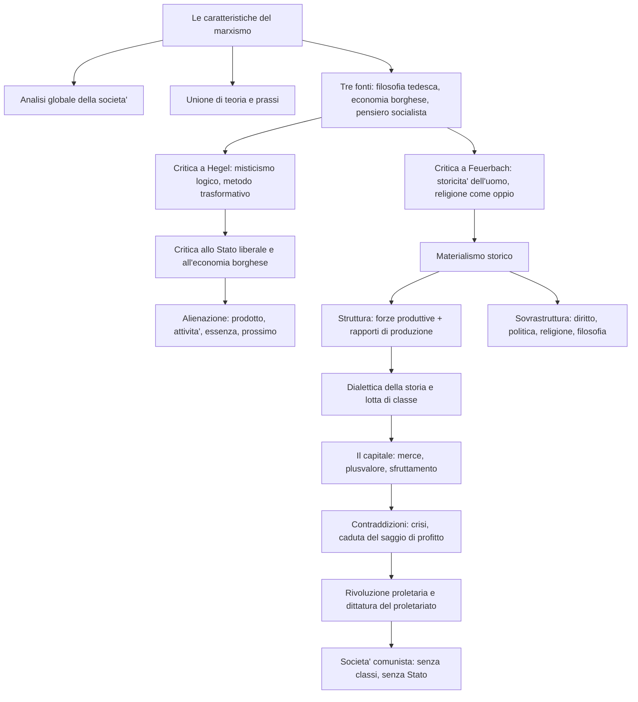

# Marx

## La vita e la formazione

Karl Marx nacque nel 1818 a Treviri, nella Germania sud-occidentale, da una famiglia ebrea che si era convertita al protestantesimo per ragioni di opportunita' politica, pur mantenendo di fatto posizioni agnostiche. Il padre, avvocato brillante e colto, gli trasmise un'educazione di stampo razionalistico e liberale. Nel 1835-1836 Marx si iscrisse alla facolta' di giurisprudenza a Bonn e poi a Berlino, dove entro' in contatto con il circolo dei "giovani hegeliani" e comincio' a studiare a fondo la filosofia di Hegel. Passo' da giurisprudenza a filosofia e si laureo' all'Universita' di Jena nel 1841 con una tesi dal titolo *Differenza tra la filosofia della natura di Democrito e quella di Epicuro*.

Abbandonati i progetti di carriera accademica a causa della politica sempre piu' reazionaria del governo prussiano, Marx si dedico' al giornalismo politico e divenne caporedattore della "Gazzetta renana". In seguito all'interdizione del giornale da parte del governo, nel 1843 fu costretto a trasferirsi a Parigi, dove strinse con Friedrich Engels un'amicizia che sarebbe durata tutta la vita e che gli sarebbe stata di conforto intellettuale, morale e materiale. Sempre nel 1843 sposo' Jenny von Westphalen, una giovane appartenente all'antica aristocrazia renana, compagna fedele della sua vita travagliata. Nel 1843 termino' anche la stesura della *Critica della filosofia del diritto di Hegel*, opera in cui comincio' a misurarsi con i problemi della filosofia politica moderna. Nel 1844, sugli "Annali franco-tedeschi", apparvero due saggi che testimoniano il suo esplicito passaggio al comunismo: *Sulla questione ebraica* e *Per la critica della filosofia del diritto di Hegel. Introduzione*. Nello stesso anno stese i *Manoscritti economico-filosofici*.

Espulso dalla Francia su insistenza del governo prussiano, Marx si trasferi' a Bruxelles, dove scrisse con Engels *La sacra famiglia* e, soprattutto, *L'ideologia tedesca* (1845-1846), in cui venivano poste le basi della concezione materialistica della storia. Nel 1847, al primo congresso della "Lega dei comunisti" a Londra, Marx venne incaricato di elaborare un documento teorico-programmatico: ne nacque il *Manifesto del partito comunista* (1848), scritto in collaborazione con Engels. Tra il 1848 e il 1849 fondo' a Colonia la "Nuova gazzetta renana", ma con la vittoria della controrivoluzione tedesca venne espulso dalla Germania. Dopo un breve ritorno a Parigi, emigro' definitivamente a Londra nel 1849. Qui, ritiratosi dalla politica attiva nel 1851, comincio' a lavorare al British Museum, dedicandosi agli studi economici. Furono anni difficili: la famiglia era tormentata da problemi economici, che Marx affrontava grazie ai compensi della collaborazione al "New York Tribune" e agli aiuti di Engels. Nel 1867 pubblico' il primo volume de *Il capitale*, la sua opera maggiore; il secondo e il terzo volume appariranno postumi, rispettivamente nel 1885 e nel 1894, grazie al lavoro di Engels. Nel 1875 scrisse la *Critica del programma di Gotha*. Nel 1881 mori' la moglie Jenny; due anni dopo, nel 1883, Marx si spense a Londra, compianto da Engels e dal movimento operaio internazionale.

---

## Le caratteristiche generali del marxismo

Il primo tratto distintivo del pensiero di Marx e' la sua irriducibilita' a una dimensione puramente filosofica, sociologica o economica: il marxismo si pone come un'analisi globale della societa' e della storia, capace di investire l'intero assetto strutturale e sovrastrutturale del capitalismo. Come scrivera' il filosofo Karl Korsch, il marxismo non si lascia collocare in nessuno dei comparti tradizionali delle scienze borghesi, perche' investe contemporaneamente l'economia, la filosofia, la storia, la teoria del diritto e dello Stato, uscendo continuamente dai confini di ciascuno di essi. La tendenza di Marx e' quella di indagare il fatto sociale non a compartimenti stagni, ma nell'unita' organica delle sue manifestazioni.

Il secondo contrassegno fondamentale del marxismo e' il suo legame con la prassi, ovvero la sua tendenza a fornire non soltanto un'interpretazione dell'uomo e del mondo, ma anche un impegno di trasformazione rivoluzionaria. Nel discorso pronunciato sulla tomba dell'amico, Engels affermo' che "lo scienziato non era neppure la meta' di Marx", perche' Marx era prima di tutto un rivoluzionario. Egli persegui' per tutta la vita l'ideale dell'unione tra teoria e prassi, proponendosi di tradurre in atto quell'incontro tra realta' e razionalita' che Hegel aveva solo pensato. Come recita la celebre undicesima tesi su Feuerbach: "i filosofi hanno solo interpretato il mondo; si tratta ora di cambiarlo".

Le influenze culturali che stanno alla base del marxismo sono essenzialmente tre: la filosofia classica tedesca, da Hegel a Feuerbach; l'economia politica borghese, da Adam Smith a David Ricardo; il pensiero socialista, da Saint-Simon a Proudhon. Queste tre esperienze intellettuali vengono ripensate da Marx alla luce di una sintesi creativa che, pur muovendo da esse, procede criticamente oltre i loro risultati, mettendo capo a una nuova visione del mondo.

---

## La critica a Hegel

Il rapporto tra Marx e Hegel e' molto complesso. E' innegabile che l'hegelismo abbia esercitato su Marx, per affinita' o per opposizione, un influsso decisivo. Anche quando Marx si allontanera' maggiormente da Hegel, un certo "sfondo hegeliano" non verra' mai meno nel suo pensiero. Da Hegel, Marx prende la visione della storia come processo dialettico a tappe, destinato a realizzarsi necessariamente, e il concetto di alienazione. Tuttavia il rapporto e' innanzitutto critico.

Nella *Critica della filosofia del diritto di Hegel* (1843), Marx accusa il maestro di "misticismo logico": lo stratagemma di Hegel consiste nel trasformare le realta' empiriche in manifestazioni necessarie dello Spirito. Questo significa che, invece di limitarsi a constatare che in certi ordinamenti storici esiste la monarchia, Hegel afferma che lo Stato presuppone per forza una sovranita' che si incarna necessariamente nel monarca, deducendo la piena "logicita'" della monarchia e identificandola con la razionalita' politica in atto. In virtu' di questo procedimento, le istituzioni, anziche' comparire per cio' che di fatto sono, finiscono per essere allegorie o personificazioni di una realta' spirituale che se ne sta occultata dietro di esse. L'idealismo, in sostanza, fa del concreto la manifestazione dell'astratto, e di cio' che viene prima la manifestazione di cio' che viene dopo: e' una filosofia capovolta, che cammina sulla testa.

Ispirandosi alle feuerbachiane *Tesi provvisorie per la riforma della filosofia*, Marx oppone al metodo "mistico" di Hegel il proprio metodo "trasformativo", che consiste nel ricapovolgere cio' che l'idealismo ha capovolto, ossia nel riconoscere di nuovo cio' che e' veramente soggetto e cio' che e' veramente predicato. Ma la critica non e' solo filosofica: il metodo di Hegel e' anche conservatore sul piano politico, poiche' porta a "canonizzare" o "santificare" la realta' esistente, trasformando i dati di fatto in manifestazioni razionali e necessarie dello Spirito. L'esito del giustificazionismo speculativo di Hegel e' dunque un giustificazionismo politico che si trasforma in accettazione delle istituzioni statali vigenti e in sostegno ideologico di un atteggiamento reazionario. Tuttavia Marx non gli nega ogni merito: riconosce la validita' della prospettiva dialettica, ossia della concezione della realta' come totalita' storico-processuale costituita da elementi concatenati tra loro e mossa da una serie di opposizioni.

---

## La critica allo Stato moderno e al liberalismo

Alla base della teoria di Marx vi e' la critica globale della civilta' moderna e dello Stato liberale. Il punto di partenza e' la convinzione, mutuata da Hegel, che la categoria del moderno si identifichi con quella della "scissione", che prende corpo innanzitutto nella frattura tra societa' civile e Stato. Mentre nella polis greca l'individuo si trovava in un'unita' sostanziale con la comunita' di cui faceva parte, nel mondo moderno l'uomo e' costretto a vivere due vite: una "in terra" come borghese, cioe' nell'ambito dell'egoismo e degli interessi particolari della societa' civile, e l'altra "in cielo" come cittadino, ovvero nella sfera superiore dello Stato e dell'interesse comune.

Tuttavia il "cielo" dello Stato e', secondo Marx, puramente illusorio: la sua pretesa di porsi come organo che persegue l'interesse comune e' verificabilmente falsa. Lo Stato non fa che riflettere e sancire gli interessi particolari dei gruppi e delle classi piu' forti. La grande conquista della Rivoluzione francese — l'uguaglianza formale dei cittadini di fronte alla legge — non fa che presupporre e ratificare la disuguaglianza sostanziale. La civilta' moderna e' la societa' dell'egoismo e delle particolarita' "reali", e nello stesso tempo la societa' della fratellanza e delle universalita' "illusorie". Marx scorge i tratti essenziali della civilta' moderna nell'individualismo e nell'atomismo, e rifiuta persino le due conquiste ritenute piu' preziose della tradizione liberale: il principio della rappresentanza e il principio della liberta' individuale, che altro non sono se non espressioni dell'atomismo borghese.

All'ideale dell'emancipazione politica, che mira alla democrazia e all'uguaglianza formali, Marx contrappone l'ideale dell'emancipazione umana, che mira alla democrazia e all'uguaglianza sostanziali. L'unico modo per realizzare una comunita' solidale e' l'eliminazione delle disuguaglianze reali tra gli uomini e, in particolare, del fondamento di ogni disuguaglianza: la proprieta' privata. Il soggetto esecutore di questa trasformazione e' il proletariato, la classe priva di proprieta' che soffre maggiormente dell'alienazione prodotta dalla societa' borghese e che e' destinata a eseguire la condanna storica della civilta' proprietaria e a realizzare la democrazia comunista.

---

## La critica all'economia borghese e l'alienazione

I *Manoscritti economico-filosofici*, composti a Parigi nel 1844, segnano il primo decisivo approccio di Marx all'economia politica. Nei confronti dell'economia borghese, Marx ha un duplice atteggiamento: da un lato la considera come l'espressione teorica della societa' capitalistica, dall'altro le muove l'accusa di fornire un'immagine globalmente mistificata del mondo borghese. L'economia borghese "eternizza" il sistema capitalistico, considerandolo come il modo naturale, immutabile e razionale di produrre la ricchezza, e non scorge la struttura contraddittoria del proprio oggetto, ossia quella conflittualita' che si incarna nell'opposizione reale tra capitale e lavoro salariato, tra borghesia e proletariato.

Per comprendere questa contraddizione Marx ricorre al concetto di alienazione, che affonda le proprie radici nella filosofia tedesca precedente. Per Hegel l'alienazione era il momento dello sviluppo dello Spirito in cui l'Idea diventa "altro da se'" facendosi natura, per poi tornare a se' arricchita: un momento dunque negativo e positivo insieme. Per Feuerbach, invece, l'alienazione era qualcosa di puramente negativo: il processo mediante il quale l'uomo "scinde" se stesso, proiettando al di fuori di se' la propria essenza e identificandola con una potenza superiore e divina. Marx si rifa' soprattutto a Feuerbach, ma a differenza di lui, per il quale l'alienazione era un fatto prevalentemente coscienziale derivante da un'errata interpretazione di se', Marx la considera un fatto reale, di natura socio-economica, che si identifica con la condizione storica del salariato nell'ambito della societa' capitalistica.

L'alienazione dell'operaio viene descritta da Marx sotto quattro aspetti fondamentali strettamente connessi tra loro. In primo luogo, il lavoratore e' alienato rispetto al prodotto della sua attivita': egli produce un oggetto che non gli appartiene e che si costituisce come una potenza dominatrice nei suoi confronti. In secondo luogo, e' alienato rispetto alla sua stessa attivita', la quale prende la forma di un lavoro forzato o costrittivo, in cui l'uomo e' strumento di fini estranei (il profitto del capitalista), e di conseguenza si sente "bestia" quando dovrebbe sentirsi uomo (cioe' nello svolgere un lavoro di utilita' sociale) e si sente uomo quando si comporta da "bestia" (cioe' quando si stordisce nel mangiare, nel bere e nel procreare). In terzo luogo, e' alienato rispetto alla propria essenza di uomo: la prerogativa dell'uomo nei confronti dell'animale e' il lavoro libero, creativo e universale, mentre nella societa' capitalistica e' costretto a un lavoro forzato, ripetitivo e unilaterale. In quarto luogo, e' alienato rispetto al prossimo, perche' il suo rapporto con l'umanita' e' conflittuale, soprattutto con il capitalista che lo sfrutta.

La causa dell'alienazione risiede nella proprieta' privata dei mezzi di produzione, in virtu' della quale il possessore della fabbrica puo' utilizzare una certa categoria di individui per accrescere la propria ricchezza. Il superamento dell'alienazione si identifica quindi con il superamento del regime della proprieta' privata e con l'avvento del comunismo.

---

## Il distacco da Feuerbach e la religione come "oppio dei popoli"

Anche Feuerbach gioca un ruolo di primo piano nel pensiero del giovane Marx. Nelle *Tesi su Feuerbach* (1845) e nella successiva *Ideologia tedesca* (1846), tuttavia, il rapporto con il maestro appare definitivamente consumato. Marx gli riconosce il merito di aver compiuto la principale rivoluzione teorica: la rivendicazione della naturalita' e della concretezza degli individui umani viventi, contro l'idealismo teologizzante di Hegel che aveva ridotto l'uomo a manifestazione di un soggetto spirituale infinito. Feuerbach ha inoltre il merito di aver demistificato la dialettica hegeliana, cioe' di averla smascherata e vista per cio' che e': un capovolgimento della realta'.

Tuttavia Feuerbach, pur avendo sottolineato la naturalita' dell'uomo, ha perso di vista la sua storicita', non rendendosi debitamente conto di come l'uomo sia piu' che natura, sia societa' e quindi storia. Rompendo con Feuerbach e con l'antropologia filosofica tradizionale, Marx sostiene che l'individuo e' reso tale dalla societa' storica in cui vive: non esiste l'uomo in astratto, ma l'uomo figlio e prodotto di una determinata societa' e di uno specifico mondo storico. In tal modo Marx corregge Hegel con Feuerbach e Feuerbach con Hegel, poiche' contro l'uno difende la naturalita' vivente dell'uomo e contro l'altro la sua costitutiva socialita' e storicita'.

Anche sulla religione Marx va oltre Feuerbach. L'autore dell'*Essenza del cristianesimo* aveva scoperto il meccanismo dell'alienazione religiosa — non e' Dio a creare l'uomo, ma l'uomo a "proiettare" Dio sulla base dei propri bisogni — ma secondo Marx non e' stato in grado di coglierne le cause reali. Le radici del fenomeno religioso non vanno cercate nell'uomo in quanto tale, ma in una determinata tipologia storica di societa'. Fin dagli "Annali franco-tedeschi", Marx ha elaborato la sua nota teoria della religione come *Opium des Volks*, "oppio dei popoli": la religione e' il "sospiro della creatura oppressa", il prodotto di un'umanita' alienata e sofferente a causa delle ingiustizie sociali, che cerca illusoriamente nell'aldila' cio' che le e' negato nell'aldiqua'. Se la religione e' il frutto malato di una societa' malata, l'unico modo per sradicarla e' quello di distruggere le strutture sociali che la producono. La disalienazione religiosa ha dunque come presupposto la disalienazione economica, ossia l'abbattimento della societa' di classe.

Un altro limite fondamentale di Feuerbach, secondo Marx, e' il suo tendenziale contemplativismo e teoreticismo, che lo porta a ignorare l'aspetto attivo e pratico della natura umana e a cercare la soluzione dei problemi reali nella teoria, trascurando completamente l'aspetto della prassi rivoluzionaria. Al vecchio materialismo speculativo e contemplante di cui Feuerbach e' l'ultima incarnazione, Marx oppone un nuovo materialismo che considera l'uomo soprattutto come prassi, ritenendo che la soluzione dei problemi non sia da ricercarsi nella speculazione, ma nell'azione.

---

## La concezione materialistica della storia

La critica a Feuerbach segna il passaggio di Marx dall'umanesimo al materialismo storico, dalla speculazione all'analisi scientifica della storia. Il testo in cui si concretizza tale processo e' *L'ideologia tedesca*, scritta da Marx e da Engels durante l'esilio di Bruxelles e rimasta inedita fino al 1932. L'originalita' dell'opera risiede nel tentativo di cogliere il "movimento reale" della storia, al di la' delle rappresentazioni ideologiche che ne hanno velato da sempre la struttura effettiva. L'approccio storico-materialistico di Marx ed Engels presuppone una basilare contrapposizione tra "scienza reale e positiva" e "ideologia", intesa come una "falsa rappresentazione" della realta', un'immagine deformata dei rapporti reali tra gli uomini.

Secondo Marx la storia non e' un evento spirituale, ma un processo materiale fondato sulla dialettica bisogno-soddisfacimento. Alla base della storia vi e' il lavoro, che Marx intende come creatore di civilta' e di cultura, come cio' attraverso cui l'uomo emerge dall'animalita' primitiva e si distingue dagli altri esseri viventi. Nell'ambito della produzione sociale dell'esistenza, Marx distingue due elementi di fondo: le forze produttive e i rapporti di produzione. Per forze produttive intende tutti gli elementi necessari al processo di produzione, ossia gli uomini che producono (la forza-lavoro), i mezzi utilizzati per produrre (i mezzi di produzione: terra, macchinari) e le conoscenze tecniche e scientifiche. Per rapporti di produzione intende i rapporti che si instaurano tra gli uomini nel corso della produzione e che regolano il possesso e l'impiego dei mezzi di lavoro; essi trovano la loro espressione giuridica nei rapporti di proprieta'.

Forze produttive e rapporti di produzione costituiscono, nella loro globalita', il "modo di produzione" di un certo periodo. L'insieme dei rapporti di produzione costituisce la struttura, ovvero lo scheletro economico della societa'. Al di sopra della struttura si eleva una sovrastruttura giuridico-politico-culturale: i rapporti giuridici, le forme dello Stato, le dottrine etiche, artistiche, religiose e filosofiche non devono essere intesi come realta' a se' stanti, ma come espressioni piu' o meno dirette dei rapporti che definiscono la struttura di una certa societa' storica. Con il termine "materialismo storico" Marx non allude alla tesi metafisica secondo cui la materia e' la sostanza e la causa delle cose, bensi' al convincimento secondo cui le vere forze motrici della storia non sono di natura spirituale, come pensavano i filosofi precedenti, ma di natura socio-economica. Non e' la coscienza che determina la vita, ma la vita che determina la coscienza.

---

## La dialettica della storia

Le forze produttive e i rapporti di produzione non rappresentano soltanto la chiave di lettura statica della societa', ma anche lo strumento interpretativo della sua dinamica, cioe' la stessa legge della storia. Marx ritiene che a un determinato grado di sviluppo delle forze produttive tendano a corrispondere determinati rapporti di produzione e di proprieta'. Tuttavia i rapporti di produzione si mantengono soltanto fino a quando favoriscono le forze produttive corrispondenti, e vengono distrutti quando si convertono in ostacoli. Poiche' le forze produttive si sviluppano piu' rapidamente dei rapporti di produzione, si crea periodicamente una situazione di frizione che genera un'epoca di rivoluzione sociale. Le nuove forze produttive sono sempre incarnate da una classe in ascesa, mentre i vecchi rapporti di proprieta' sono sempre incarnati da una classe dominante al tramonto. Lo scontro risulta inevitabile, e alla fine quasi sempre trionfa la classe che risulta espressione delle nuove forze produttive, la quale riesce a imporre la propria maniera di produrre e di distribuire la ricchezza, nonche' la propria specifica visione del mondo.

Questo modello trova la sua esemplificazione piu' tipica nella Francia del Settecento, dove vi fu uno scontro aperto tra la borghesia (espressione delle nuove forze produttive di tipo capitalistico) e l'aristocrazia (espressione dei vecchi rapporti di proprieta' agrario-feudali). Analogamente, nel capitalismo moderno si delinea una contraddizione sempre piu' esplosiva tra forze produttive sociali e rapporti di produzione privatistici: il capitalismo porta in se', come esigenza dialettica, il socialismo. La legge della dialettica storica permette a Marx di delineare un quadro generale della storia dell'umanita', scandita da alcune grandi formazioni economico-sociali: la comunita' primitiva, la societa' asiatica, la societa' antica, la societa' feudale, la societa' borghese e la futura societa' socialista. La storia procede dal comunismo primitivo al comunismo futuro, passando attraverso il momento intermedio della societa' di classe.

---

## Il Manifesto del partito comunista

Il *Manifesto del partito comunista* (1848), scritto in collaborazione con Engels su richiesta della Lega dei comunisti, rappresenta un'efficace sintesi della concezione marxista del mondo. I punti salienti sono tre: l'analisi della funzione storica della borghesia, il concetto della storia come lotta di classe e la critica dei socialismi non-scientifici.

Nella prima parte, Marx descrive la vicenda storica della borghesia con un'eloquenza brillante. A differenza delle classi dominanti del passato, la borghesia non puo' esistere senza rivoluzionare continuamente gli strumenti di produzione e tutto l'insieme dei rapporti sociali. Ma questa stessa borghesia, che ha risvegliato forze cosi' gigantesche, assomiglia allo stregone che non riesce piu' a dominare le potenze evocate: le moderne forze produttive, sempre piu' sociali, si rivoltano contro i vecchi rapporti di proprieta', generando crisi terribili che mettono in forse l'esistenza stessa del capitalismo. Il proletariato, classe oppressa della societa' borghese, non puo' fare a meno di mettere in opera una dura lotta di classe volta al superamento del capitalismo. La storia di ogni societa', scrivono Marx e Engels, "e' storia di lotte di classi": liberi e schiavi, patrizi e plebei, baroni e servi della gleba, capitalisti e salariati, oppressori e oppressi, furono continuamente in reciproco contrasto. Il Manifesto termina con la nota esortazione: "Proletari di tutto il mondo, unitevi!".

Una delle sezioni piu' importanti del *Manifesto* e' la critica ai socialismi precedenti, che Marx definisce "falsi socialismi". Il socialismo reazionario (feudale, piccolo-borghese, tedesco) attacca la borghesia secondo parametri conservatori, rivolti al passato anziche' al futuro. Il socialismo conservatore o borghese, il cui principale esponente e' Proudhon, ritiene possibile rimediare agli inconvenienti del capitalismo senza distruggerlo: la proprieta' senza il furto, la borghesia senza il proletariato. Il socialismo e il comunismo critico-utopistici, portati avanti da Saint-Simon e Fourier, pur avendo il merito di riconoscere l'antagonismo tra le classi, hanno il limite di non riconoscere al proletariato una funzione storica e rivoluzionaria autonoma e di fare appello a tutti i membri della societa' per una pacifica azione di riforme. A queste correnti Marx contrappone il proprio "socialismo scientifico", basato su un'analisi critico-scientifica dei meccanismi sociali del capitalismo e sull'individuazione del proletariato come forza rivoluzionaria destinata ad abbattere il sistema borghese.

---

## Il capitale

Ne *Il capitale*, la sua opera maggiore, Marx si propone di mettere in luce i meccanismi strutturali della societa' borghese, al fine di svelare la legge economica del movimento della societa' moderna. Marx e' convinto che non esistano leggi universali in economia e che ogni formazione sociale abbia le proprie caratteristiche e leggi storiche specifiche; cerca percio' di rilevare le leggi tendenziali dello sviluppo del capitalismo.

La caratteristica specifica del modo di produzione capitalistico e' la produzione generalizzata di merci. Ogni merce possiede un "valore d'uso", in quanto deve poter servire a qualcosa, e un "valore di scambio", che discende dalla quantita' di lavoro socialmente necessario per produrla. Il valore di una merce non si identifica del tutto con il suo prezzo, su cui influiscono anche fattori contingenti come l'abbondanza o la scarsita'. La convinzione che alla radice di tutto si trovi il lavoro porta Marx a contestare il cosiddetto "feticismo delle merci", che consiste nel considerare le merci come entita' aventi valore di per se', dimenticando che esse sono il frutto dell'attivita' umana e di determinati rapporti sociali.

Il ciclo economico del capitalismo non e' quello "semplice" delle societa' pre-borghesi, descrivibile con la formula M.D.M. (merce-denaro-merce), in cui si vende una merce per comprarne un'altra. Il ciclo capitalistico e' descrivibile con la formula D.M.D' (denaro-merce-piu' denaro): il capitalista investe denaro in una merce per ottenere, alla fine, piu' denaro di quanto ne abbia investito. Da dove viene questo "piu'" monetario, questo plusvalore? Marx e' convinto che l'origine del plusvalore non debba essere cercata a livello dello scambio delle merci, bensi' a livello della produzione capitalistica. Nella societa' borghese il capitalista ha la possibilita' di comprare e usare una merce particolare, che ha come caratteristica peculiare quella di produrre valore: si tratta della forza-lavoro dell'operaio. Il capitalista compra la forza-lavoro pagandola secondo il suo valore, cioe' secondo la quantita' di lavoro socialmente necessario a produrla — tale valore corrisponde al cosiddetto "salario". Tuttavia l'operaio ha la capacita' di produrre con il proprio lavoro un valore ben maggiore di quello che gli e' corrisposto con il salario. Il plusvalore discende quindi dal pluslavoro dell'operaio e si identifica con l'insieme del valore da lui gratuitamente offerto al capitalista.

Per comprendere la distinzione tra plusvalore e profitto, occorre tenere presente la distinzione marxista tra capitale variabile (quello investito nei salari) e capitale costante (quello investito nei macchinari e in tutto cio' di cui la fabbrica ha bisogno per funzionare). Il saggio del plusvalore e' il rapporto tra il plusvalore e il capitale variabile. Il saggio del profitto e' il rapporto tra il plusvalore e la somma del capitale costante e del capitale variabile; e' pertanto sempre inferiore al saggio del plusvalore. Per accrescere il plusvalore il capitalista puo' ricorrere a due strategie: il "plusvalore assoluto", cioe' il prolungamento della giornata lavorativa, e il "plusvalore relativo", cioe' la riduzione della parte di giornata lavorativa necessaria a reintegrare il salario, ottenuta attraverso l'aumento della produttivita' e l'introduzione di macchine.

Tuttavia il capitalismo genera una serie di contraddizioni di fondo che ne minano la solidita'. L'aumento di produttivita' conseguito con l'uso delle macchine genera il fenomeno ciclico delle crisi di sovrapproduzione: paradossalmente, nel capitalismo c'e' crisi non perche' vi sia poca merce in circolazione, ma perche' ne esiste troppa, a causa dell'"anarchia della produzione" per cui i capitalisti si precipitano "alla cieca" nei settori dove il profitto e' piu' alto. La necessita' di un continuo rinnovamento tecnologico genera poi la caduta tendenziale del saggio del profitto: accrescendosi smisuratamente il capitale costante rispetto al capitale variabile, il profitto risulta via via piu' scarso rispetto a tutto il capitale impiegato. Sommandosi all'anarchia produttiva e alle crisi di sovrapproduzione, la caduta tendenziale del saggio del profitto produce la tendenza verso la scissione della societa' in due sole classi antagoniste: da un lato una minoranza industriale dalla gigantesca ricchezza e dall'immenso potere, dall'altro una maggioranza proletaria sfruttata.

---

## La rivoluzione e la societa' comunista

Le contraddizioni della societa' borghese rappresentano la base oggettiva della rivoluzione del proletariato, il quale, impadronendosi del potere politico, attua il passaggio dal capitalismo al comunismo. Lo strumento tecnico della trasformazione rivoluzionaria e' la socializzazione dei mezzi di produzione e di scambio: il passaggio di questi ultimi dalle mani dei privati a quelle della comunita' pone fine al fenomeno del plusvalore e dello sfruttamento di classe. La rivoluzione proletaria deve mirare all'abbattimento dello Stato borghese e delle sue forme istituzionali: il compito del proletariato non e' quello di impadronirsi della macchina statale borghese, manovrandola per i propri scopi, ma quello di spezzarne o distruggerne i meccanismi istituzionali di fondo.

La dottrina della dittatura del proletariato prende corpo nella lettera a Weydemeyer del 1852, in cui Marx afferma esplicitamente che "la lotta delle classi necessariamente conduce alla dittatura del proletariato". A differenza delle dittature storicamente esistite, che sono sempre state dittature di una minoranza su una maggioranza, la dittatura del proletariato sara' la dittatura di una maggioranza di ex-oppressi su una minoranza di ex-oppressori, destinata a scomparire. Essa si configura come la misura politica fondamentale per la transizione dal capitalismo al comunismo, ed e' solo una misura storica di transizione che mira al superamento di se medesima e di ogni forma di Stato.

Nei *Manoscritti* Marx distingue tra un comunismo "rozzo", in cui la proprieta' viene semplicemente trasformata in proprieta' di tutti senza che cambi la mentalita' possessiva di fondo, e un comunismo autentico, cioe' l'effettiva soppressione della proprieta' privata, in cui l'uomo cessa di intrattenere con il mondo rapporti di puro possesso e consumo. All'uomo della civilta' proprietaria, ossessionato dall'avere, Marx contrappone un "uomo nuovo", un essere "onnilaterale" e "totale", che esercita in modo creativo l'insieme delle sue potenzialita'. Nella *Critica del programma di Gotha* (1875) Marx descrive due fasi della societa' futura: una prima fase in cui la societa' comunista, appena emersa dalla societa' capitalistica, distribuisce i beni in base al lavoro prestato (a ciascuno secondo il suo lavoro); e una seconda fase, piu' elevata, in cui la societa' puo' scrivere sulle sue bandiere: "ognuno secondo le sue capacita'; a ognuno secondo i suoi bisogni". In sintesi, l'attesa societa' comunista si profila come una societa' senza divisione del lavoro, senza proprieta' privata, senza classi, senza sfruttamento, senza miseria, senza divisioni tra gli uomini e senza Stato.

---

## Schema riassuntivo

---

## Checklist

- [x] Biografia e contesto storico
- [x] Le caratteristiche generali del marxismo
- [x] La critica a Hegel: misticismo logico e metodo trasformativo
- [x] La critica allo Stato moderno e al liberalismo
- [x] La critica all'economia borghese e l'alienazione
- [x] Il distacco da Feuerbach e la religione come "oppio dei popoli"
- [x] La concezione materialistica della storia: struttura e sovrastruttura
- [x] La dialettica della storia e le formazioni economico-sociali
- [x] Il Manifesto del partito comunista e la critica ai falsi socialismi
- [x] Il capitale: merce, plusvalore, sfruttamento, caduta del saggio di profitto
- [x] La rivoluzione, la dittatura del proletariato e la societa' comunista

## Collegamenti

- Italiano: Giovanni Verga e il Verismo come rappresentazione delle condizioni di vita delle classi subalterne; il tema dello sfruttamento del lavoro nei *Malavoglia* e in *Rosso Malpelo*; Pier Paolo Pasolini e la denuncia del sottoproletariato urbano
- Latino: Seneca e le riflessioni sulla condizione degli schiavi nell'*Epistola 47*; il concetto di humanitas come superamento delle distinzioni sociali
- Storia: la Rivoluzione industriale e le condizioni della classe operaia; i moti del 1848; la Comune di Parigi (1871); la nascita dei partiti socialisti e del movimento operaio; la Rivoluzione russa del 1917 come tentativo di applicazione del marxismo
- Filosofia: Hegel e la dialettica; Feuerbach e il rovesciamento dell'idealismo; Schopenhauer come altro "maestro del sospetto"; Nietzsche e la critica ai valori della societa' borghese; il positivismo e la pretesa di scientificita'
- Scienze: Darwin e la lotta per l'esistenza come modello naturalistico che Marx intendeva applicare alla societa'; il determinismo scientifico e il concetto di "legge tendenziale"
- Inglese: Charles Dickens e la denuncia delle condizioni della classe operaia nell'Inghilterra vittoriana (*Oliver Twist*, *Hard Times*); la letteratura distopica di George Orwell (*Animal Farm*, *1984*) come riflessione critica sugli esiti storici del marxismo
- Arte: il Realismo e Gustave Courbet, la rappresentazione delle classi lavoratrici; Giuseppe Pellizza da Volpedo e *Il Quarto Stato* come icona del movimento operaio
- Educazione civica: i diritti dei lavoratori, lo Stato sociale, l'articolo 1 della Costituzione italiana ("L'Italia e' una Repubblica democratica, fondata sul lavoro")
