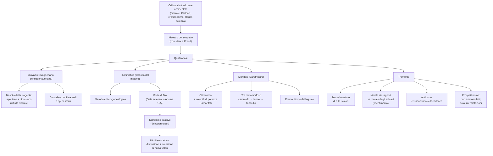

# Nietzsche

## La vita e le opere

Friedrich Nietzsche nacque a Röcken, in Sassonia, il 15 ottobre 1844, in una famiglia profondamente religiosa: il padre era pastore luterano e morì quando Friedrich aveva appena cinque anni. Cresciuto dalla madre, dalla nonna e dalle zie in un ambiente di rigida pietà protestante, fu un bambino precoce e malinconico, soprannominato dai compagni "il piccolo pastore". Studiò filologia classica a Bonn e Lipsia, dove conobbe casualmente in una libreria *Il mondo come volontà e rappresentazione* di Schopenhauer: la lettura lo segnò profondamente. "Trovai il libro, mi gettai sul sofà e lasciai che quel genio energico e tenebroso cominciasse ad agire su di me: ad ogni pagina, rinuncia, rifiuto, rassegnazione, levavano alta la voce. Avevo davanti a me uno specchio nel quale vidi il mondo, la vita e il mio stesso animo."

A soli ventiquattro anni, senza nemmeno aver discusso la tesi, fu chiamato come professore di filologia all'Università di Basilea: un caso eccezionale nella storia accademica tedesca. In quegli anni divenne amico di Richard Wagner, di cui ammirava la musica come incarnazione moderna dello spirito tragico greco. Pubblicò *La nascita della tragedia* (1872) e le quattro *Considerazioni inattuali* (1873-76). L'amicizia con Wagner si ruppe quando il compositore si avvicinò al cristianesimo con il *Parsifal*: Nietzsche lo definì "un tipico decadente" e arrivò a dire che "Wagner è una malattia". Nello stesso periodo si ammalò gravemente — emicranie atroci, disturbi della vista, vomito — e nel 1879 fu costretto a lasciare l'università. Trascorse gli anni successivi vagando tra Italia, Svizzera e Francia in cerca di climi adatti alla sua salute, scrivendo le sue opere maggiori: *Umano, troppo umano* (1878), *Aurora* (1881), *La gaia scienza* (1882), *Così parlò Zarathustra* (1883-85), *Al di là del bene e del male* (1886), *Genealogia della morale* (1887), *Il crepuscolo degli idoli* e *L'Anticristo* (1888), *Ecce homo* (1888).

Conobbe l'unica donna che amò davvero, Lou Andreas-Salomé, intelligentissima e affascinante: le chiese di sposarlo due volte, ma lei rifiutò, preferendo un rapporto puramente intellettuale. Nietzsche ne fu devastato. Il 3 gennaio 1889 a Torino, in Piazza Carlo Alberto, vide un cocchiere frustare un cavallo, gli si gettò addosso piangendo per difenderlo e crollò in strada: era l'inizio della follia, da cui non si riprese più. Trascorse gli ultimi undici anni in stato semi-vegetativo, accudito dalla madre e poi dalla sorella Elisabeth, fino alla morte avvenuta a Weimar il 25 agosto 1900.

---

## Il ruolo della malattia, le caratteristiche del pensiero, la "sorella parafulmine"

La malattia di Nietzsche, sfociata nella pazzia, è stata usata dai suoi detrattori per screditare il suo pensiero come prodotto di una mente malata. In realtà la malattia non spiega la filosofia: ne è semmai una compagna, una condizione esistenziale. "La mia vita è diventata tutta un viaggio, al punto che comincio a pensare che la mia unica casa, l'unico luogo familiare a cui torno sempre, sia la mia malattia."

Il pensiero di Nietzsche ha alcuni caratteri distintivi che lo rendono unico nella storia della filosofia. Anzitutto rifiuta ogni sistema: "diffido di tutti i sistemi e i sistematici. Non sono abbastanza ottuso per un sistema, tantomeno per il mio sistema. È un'impostura, quando oggi un pensatore propone una totalità di conoscenze". La sua scrittura è frammentaria, aforistica, profetica, poetica, deliberatamente provocatoria: Nietzsche si presenta come "scriba del caos", come "dinamite", come "uomo del destino". "Io conosco la mia sorte. Un giorno il mio nome si legherà al ricordo di una crisi come non ce ne fu un'altra simile sulla terra. Io non sono un uomo, sono dinamite."

Per quanto riguarda il rapporto con il nazismo, occorre dire chiaramente che Nietzsche non fu né razzista né antisemita: anzi, scrisse violentemente contro l'antisemitismo, definendolo frutto dell'invidia per il successo economico degli Ebrei, ed entrò in scontro con la sorella e il cognato proprio per le loro idee razziste. Inoltre Nietzsche odiava lo Stato — "lo Stato è un idolo che puzza, e i suoi adoratori puzzano" — e dunque ogni forma di nazionalismo. Tuttavia dopo la morte la sorella Elisabeth, antisemita convinta, manipolò gli ultimi scritti (specie *La volontà di potenza*) e li usò per legittimare il nazionalsocialismo: nel 1934 Hitler in persona si recò all'Archivio Nietzsche di Weimar, dove Elisabeth gli regalò il bastone del fratello. Si tratta di un fraintendimento storico: l'Oltreuomo nietzschiano non è il "superuomo" ariano della propaganda nazista. È però vero che Nietzsche disprezzava i deboli e la "morale degli schiavi", e questo aspetto è stato facilmente piegato dal nazifascismo, dal superomismo di D'Annunzio e dalla retorica del Futurismo.

---

## Maestro del sospetto: la critica alla tradizione occidentale

Il filosofo francese Paul Ricoeur ha incluso Nietzsche, insieme a Marx e Freud, fra i "maestri del sospetto": pensatori che hanno insegnato a diffidare delle apparenze e a cercare dietro i valori accettati le forze nascoste che li producono. Marx denuncia il credo e i valori culturali di una società come "sovrastruttura" originata dalle strutture materiali-economiche; Freud scopre l'inconscio con le sue pulsioni nascoste dietro la coscienza; Nietzsche denuncia l'origine "umana, troppo umana" della morale, cioè la sua nascita dal risentimento dei deboli contro i forti.

La storia dell'Occidente appare a Nietzsche come storia di una lunga decadenza, contro l'ottimismo idealista e contro il mito positivista del progresso. L'uomo moderno è il prodotto di un declino che ha radici lontane, e contro tutta la tradizione razionalistico-idealistica della filosofia occidentale Nietzsche dichiara guerra: contro Socrate, Platone e il cristianesimo (definito "platonismo per il popolo"); contro Cartesio, l'Illuminismo e il Positivismo con la sua fede ingenua nella scienza; contro la morale e la religione tradizionali; contro Hegel, la cui filosofia è "tradimento alla vita" perché pretende di intrappolare in un sistema razionale ciò che invece è dinamico e irrazionale; contro il socialismo, che è solo una versione laica del cristianesimo perché predica l'uguaglianza dei deboli.

---

## Le fasi del filosofare nietzschiano

La filosofia di Nietzsche viene tradizionalmente divisa in quattro fasi, ciascuna con uno stile e un nucleo tematico diverso.

| Fase | Opere principali | Temi |
|------|------------------|------|
| Giovanile / wagneriana-schopenhaueriana | *La nascita della tragedia*, *Considerazioni inattuali* | Spirito apollineo e dionisiaco, critica di Socrate, critica della storia |
| Illuministica / "filosofia del mattino" | *Umano, troppo umano*, *Aurora*, *La gaia scienza* | Metodo critico-genealogico, smascheramento dei valori, morte di Dio |
| Del meriggio | *Così parlò Zarathustra* | Oltreuomo, eterno ritorno, volontà di potenza, tre metamorfosi |
| Del tramonto | *Al di là del bene e del male*, *Genealogia della morale*, *Crepuscolo degli idoli*, *Anticristo*, *Ecce homo* | Trasvalutazione di tutti i valori, morale dei signori e degli schiavi, immoralismo |

---

## La fase giovanile: la *Nascita della tragedia*

Nel mondo greco antico, secondo Nietzsche, esisteva un equilibrio miracoloso tra le due componenti profonde dell'uomo: lo *spirito dionisiaco*, che rappresenta gli impulsi, la sensualità, la sfrenatezza, l'amore irrazionale per la vita, e lo *spirito apollineo*, che incarna la razionalità, la misura, la serenità dell'equilibrio. La tragedia attica di Eschilo e Sofocle è il vertice di questa fusione: il coro dionisiaco e la chiarezza apollinea dei personaggi convivono in armonia. Già con Euripide, però, lo spirito apollineo comincia a prevalere, e con Socrate e Platone — gli "antigreci" — la rovina è completa: lo spirito apollineo soffoca quello dionisiaco, gli impulsi vengono repressi dalla ragione, e all'uomo tragico, capace di dire un "sì" pieno alla vita, si sostituisce l'uomo teorico, che nega la vita perché la sottomette al concetto. Con Socrate inizia quella "morale degli schiavi" che verrà ereditata dal cristianesimo, "platonismo per il popolo".

Nelle *Considerazioni inattuali*, in particolare nella seconda (*Sull'utilità e il danno della storia per la vita*), Nietzsche si scaglia contro lo storicismo hegeliano e contro l'idolatria positivista del fatto. La cultura europea, da Hegel in poi, soffre di un "consumismo della storia" che soffoca le potenzialità creative dell'uomo: "ancora non è finita una guerra e già essa è convertita in carta stampata in centomila copie". La storia non è dannosa di per sé, a patto che sia al servizio della vita e non viceversa — perché per vivere è necessaria anche una certa dose di oblio. Nietzsche individua tre modi di rapportarsi al passato, ciascuno con i suoi rischi: la *storia monumentale*, di chi guarda al passato cercando modelli da imitare (rischio: il mito e il fanatismo); la *storia antiquaria*, di chi conserva e venera il passato (rischio: mummificare la vita nel collezionismo); la *storia critica*, di chi sottopone il passato a giudizio per liberarsene (rischio: pretendere di recidere con il coltello legami che ci costituiscono).

---

## La fase illuministica: il metodo genealogico e la morte di Dio

Rotta l'amicizia con Wagner e abbandonato Schopenhauer, Nietzsche entra nella fase "illuministica": il redentore della cultura non è più l'artista o il genio, ma il filosofo critico, educato al metodo scientifico, capace di emancipare l'uomo dagli errori del passato. Non si tratta dell'ingenuo ottimismo settecentesco né della cieca fede positivista nel progresso, ma di un illuminismo radicale che usa il sospetto come regola di indagine. *Umano, troppo umano* è dedicato a Voltaire.

In *Umano, troppo umano*, in *Aurora* e poi in *Genealogia della morale* Nietzsche elabora il *metodo critico e storico-genealogico*: ogni cosa, e in particolare ogni valore morale, è l'esito di un processo storico che è possibile ricostruire per smascherarne l'origine. I valori che si pretendono assoluti e soprannaturali rivelano allora la loro origine "umana, troppo umana": nascono dal risentimento, dalla paura, dal bisogno di consolazione. La figura simbolo di questa fase è lo *spirito libero*, il *viandante*, che inaugura la "filosofia del mattino" — l'emancipazione dalle tenebre del passato e il passaggio a una concezione della vita come transitorietà, esperimento, ricerca senza certezze precostituite.

Il punto culminante di questa fase è l'annuncio della *morte di Dio*, contenuto nel celebre aforisma 125 della *Gaia scienza*. Un uomo folle accende una lanterna in pieno giorno, corre al mercato e grida "cerco Dio! Cerco Dio!". E poiché lì si trovano molti che non credono più in Dio, suscita grandi risa.

> "Dove se n'è andato Dio? — gridò — ve lo voglio dire. Siamo stati noi ad ucciderlo: voi e io! Siamo noi tutti i suoi assassini! Ma come abbiamo fatto questo? Come potemmo vuotare il mare bevendolo fino all'ultima goccia? Chi ci dette la spugna per strusciar via l'intero orizzonte? Che mai facemmo, a sciogliere questa terra dalla catena del suo sole? Non è il nostro un eterno precipitare? Non alita su di noi lo spazio vuoto? Non si è fatto più freddo? Dio è morto! Dio resta morto! E noi lo abbiamo ucciso!"

L'uomo folle conclude: "Vengo troppo presto, non è ancora il mio tempo. Questo enorme avvenimento è ancora per strada e sta facendo il suo cammino: non è ancora arrivato fino alle orecchie degli uomini." L'annuncio è rivolto non ai credenti, ma proprio agli atei: perché essi hanno "ucciso" Dio con il loro razionalismo scientifico, ma non sono pronti a fronteggiare le conseguenze terribili di questo gesto, cioè che l'uomo è solo e che la vita non ha più alcun senso pre-costituito. "Dio" per Nietzsche non è soltanto la divinità delle religioni, ma è "la nostra più antica bugia": l'insieme di tutte le prospettive metafisiche che dal platonismo in poi hanno posto il senso della vita nell'aldilà, dipingendo il mondo come cosmo ordinato anziché come caos. "C'è un solo mondo ed è falso, crudele, contraddittorio, corruttore, senza senso. Il carattere complessivo del mondo è caos per tutta l'eternità, mancanza di ordine, articolazione, bellezza."

Insieme alla religione, Nietzsche vuole rifiutare tutti i sistemi "menzogneri": la fede positivista nella scienza, l'Idealismo, il socialismo come versione laica del cristianesimo. Su questo punto Nietzsche e Kierkegaard si toccano e si separano: entrambi vogliono smascherare l'ipocrisia di chi aderisce alla morale e alla religione senza più crederci, ma mentre Kierkegaard vuole tornare a un cristianesimo autenticamente vissuto, Nietzsche vuole portare a termine la distruzione dell'intero sistema di valori occidentali per fare spazio a un uomo nuovo.

L'autosoppressione della morale è dunque, paradossalmente, opera dell'educazione cristiana stessa: per secoli il cristianesimo ha insegnato a cercare la verità, e proprio questa ricerca della verità ha finito per smascherare il cristianesimo. Negata ogni trascendenza, si può passare dalla "filosofia del mattino" a quella del *meriggio*, "l'ora senza ombre", che vedrà l'insegnamento di Zarathustra.

---

## La fase del meriggio: *Così parlò Zarathustra*

Pubblicato in quattro parti tra il 1883 e il 1885, *Così parlò Zarathustra*, "un poema per tutti e per nessuno", è l'opera più lirica e profetica di Nietzsche. Annuncia l'uomo nuovo, libero dalle menzogne della morale e della metafisica, capace di reggere il peso della realtà e di accettare l'annuncio della morte di Dio. Lo stile è volutamente simile al Vangelo, fatto di aforismi e di parabole, e l'annuncio di Zarathustra è il capovolgimento del Discorso delle Beatitudini di Gesù ("beati i miti, beati gli operatori di pace…"). Il portatore di questo messaggio è Zarathustra, il mistico persiano vissuto intorno al IX secolo a.C., colui che storicamente aveva "riformato" la morale: ora, divenuto "il senza Dio", deve annunciare la fedeltà alla terra e l'Oltreuomo.

### L'Oltreuomo

L'*Übermensch* — tradotto in italiano sia come "superuomo" sia, più correttamente, come "Oltreuomo" — non è una razza superiore né un essere biologicamente diverso: è l'uomo nuovo, capace di superare la vertigine provocata dalla morte di Dio e di guardare avanti il "mare aperto" delle possibilità senza più alcun punto di riferimento metafisico. Egli crea il mondo nel senso che è lui a dare senso alle cose, è lui a stabilire i valori: per questo è divenuto "simile a Dio". Animato dalla *volontà di potenza* — non desiderio di dominio sugli altri, ma impulso a crescere, a volere sempre di più, a realizzare lo spirito dionisiaco della vita — l'Oltreuomo è capace dell'*amor fati*, l'accettazione del destino tipica degli Stoici: accetta in modo pieno e coraggioso la vita in tutti i suoi aspetti anche tragici, compreso l'eterno ritorno dell'uguale.

> "Vi scongiuro, fratelli, restate fedeli alla terra e non credete a quelli che vi parlano di sovraterrene speranze! Essi sono degli avvelenatori, che lo sappiano o no. Sono spregiatori della vita, moribondi ed essi stessi avvelenati, dei quali la terra è stanca: se ne vadano pure!"

### Le tre metamorfosi

Nel discorso delle tre metamorfosi, Zarathustra descrive il cammino di liberazione dello spirito attraverso tre figure simboliche. Il *cammello* è l'uomo paziente che si carica dei valori della tradizione, dei doveri morali, della venerazione: si piega davanti alla maestà di Dio e si dirige nel deserto sotto il peso del "tu devi". Nel deserto avviene la seconda metamorfosi: lo spirito diventa *leone*. Il leone vuole conquistare la propria libertà ed essere signore nel proprio deserto, e per farlo deve combattere contro il drago dalle squame d'oro su cui sta scritto "Tu devi": il leone gli oppone il proprio "Io voglio". È il rifiuto dei valori imposti dall'esterno, il "no sacro al dovere". Ma il leone non è ancora capace di creare valori nuovi: per questo serve la terza metamorfosi, in cui lo spirito diventa *fanciullo*. Innocenza, oblio, nuovo inizio, gioco, "primo moto, un sacro dire di sì": il fanciullo è capace di creare valori nuovi, dice sì alla vita non in nome della tradizione ma per pura affermazione gioiosa. È la figura dell'Oltreuomo che ha compiuto la trasvalutazione di tutti i valori.

### L'eterno ritorno dell'uguale

L'Oltreuomo redime il tempo perché è capace di accettare la terribile realtà dell'*eterno ritorno dell'uguale*: l'idea che la vita di ciascuno sia destinata a ripetersi infinite volte, sempre identica, in una concezione ciclica del tempo tipica delle filosofie orientali e degli Stoici, opposta a quella lineare ebraico-cristiana. La teoria appare per la prima volta nella *Gaia scienza* come ipotesi spaventosa:

> "Che accadrebbe se un giorno o una notte un demone strisciasse furtivo nella più solitaria delle tue solitudini e ti dicesse: 'Questa vita, come tu ora la vivi e l'hai vissuta, dovrai viverla ancora una volta e ancora innumerevoli volte, e non ci sarà in essa mai niente di nuovo, ma ogni dolore e ogni piacere e ogni pensiero e sospiro… L'eterna clessidra dell'esistenza viene sempre di nuovo capovolta e tu con essa, granello della polvere!'. Non ti rovesceresti a terra, digrignando i denti e maledicendo il demone che così ha parlato? Oppure hai forse vissuto una volta un attimo immenso, in cui questa sarebbe stata la tua risposta: 'Tu sei un dio e mai intesi cosa più divina'?"

L'eterno ritorno è il test definitivo dell'amor fati: solo chi ama la propria vita al punto da volerla rivivere infinite volte, identica, è l'Oltreuomo. Egli non subisce passivamente questa realtà, ma l'accetta volontariamente: guardando al passato non dice "così fu" ma "così volli che fosse", e il passato torna perché "io lo voglio". Nel *Zarathustra* il concetto è espresso sotto forma di mito, nel celebre episodio del pastore e del serpente: un pastore è soffocato da un serpente che gli è entrato in bocca (simbolo dell'eterno ritorno vissuto come incubo, nichilismo passivo). Solo quando, su invito di Zarathustra, vince la ripugnanza e morde la testa al serpente, può alzarsi e ridere liberato — "mai prima al mondo aveva riso un uomo, come lui rise!". L'accettazione dell'eterno ritorno segna il passaggio dal nichilismo passivo al nichilismo attivo.

---

## Il nichilismo: malattia e cura

L'uomo occidentale è malato di una malattia mortale: il nichilismo, che nasce quando ci si rende conto che il mondo e la vita sono privi di senso. Tutta la storia dell'Occidente è in realtà storia del nichilismo, da Platone in poi: la "favola" del mondo vero come mondo delle Idee, il cristianesimo come platonismo popolare hanno per secoli mascherato l'insensatezza con la promessa di un aldilà, finché il progredire della scienza non ha scalzato queste credenze. Ma il nichilismo è al tempo stesso malattia e cura: l'uomo si può salvare solo abbracciandolo completamente, passando dal *nichilismo passivo* di Schopenhauer (che davanti all'insensatezza della vita propone l'ascesi e la negazione della volontà) al *nichilismo attivo*, percorrendo fino in fondo la via del negativo, accettando la fine dei valori tradizionali e superandola riscoprendo nuovi valori. Solo così potrà farsi spazio l'Oltreuomo.

---

## La fase del tramonto: trasvalutazione di tutti i valori

Negli ultimi anni Nietzsche radicalizza la propria filosofia in opere come *Al di là del bene e del male*, *Genealogia della morale*, *Crepuscolo degli idoli*, *Anticristo* ed *Ecce homo*. Il concetto chiave è la *trasvalutazione di tutti i valori*: non si tratta soltanto di proclamarsi atei, ma di annunciare la fine dell'intero sistema di valori occidentali per costruirne di nuovi. "Io sono il primo immoralista: con ciò, il distruttore *par excellence*. Chi vuol essere un creatore nel bene e nel male, costui deve essere prima un distruttore e spezzare valori."

### Morale dei signori e morale degli schiavi

Nella *Genealogia della morale* Nietzsche distingue due moralità contrapposte. La *morale dei signori* è la morale aristocratica originaria: il "signore" definisce buono ciò che esprime forza, salute, audacia, generosità, capacità di gioire e di affermare la vita, e definisce cattivo ciò che è debole, vile, malato. È una morale che dice sì alla vita. La *morale degli schiavi*, al contrario, nasce dal *risentimento* dei deboli, dei vinti, dei "ciandala", che non potendo affermare se stessi rovesciano i valori dei signori: chiamano "buono" ciò che è umile, mite, povero, sofferente, e "cattivo" ciò che è forte, audace, ricco. È una morale che dice no alla vita, perché esalta tutto ciò che è debole e diminuito.

Secondo Nietzsche, fu il popolo ebraico — visto da lui come popolo "sacerdotale" oppresso dai Romani — a operare per primo questo rovesciamento; ma fu il cristianesimo, e in particolare San Paolo, "il più grande degli apostoli della vendetta", a estenderlo a tutta la civiltà occidentale. Nietzsche distingue qui Cristo dal cristianesimo: Gesù sarebbe stato un maestro di vita, uno "spirito libero", talmente privo di risentimento da morire perdonando i propri crocifissori, "una nuova regola di vita, non una nuova fede". "In realtà è esistito un solo cristiano, e quello è morto sulla croce." Il cristianesimo storico, costruito da San Paolo, sarebbe invece l'esatto contrario del Vangelo, l'utilizzo della figura di Cristo per realizzare la vendetta dei deboli contro i forti.

### L'Anticristo

*L'Anticristo* (1888) è l'opera più violenta di Nietzsche contro il cristianesimo, definito "religione della compassione" e dunque "religione della *décadence*". La tesi fondamentale è che il cristianesimo abbia condotto una "guerra senza quartiere" contro il tipo umano superiore, allevando per pietà i deboli e i malriusciti che in natura sarebbero destinati a soccombere, e bandendo come "male" tutti gli istinti vitali fondamentali. Il "progresso" è solo un'idea moderna, sbagliata: l'europeo di oggi è inferiore all'europeo del Rinascimento, e il Rinascimento fu l'occasione in cui il cristianesimo avrebbe potuto essere superato — "Cesare Borgia papa! Ebbene sì, questa sarebbe stata la vittoria alla quale io anelo!" — ma Lutero, "un frate tedesco con nel sangue tutti gli istinti vendicativi di un prete fallito", venne a Roma e tuonò contro il Rinascimento, "ripristinando la chiesa".

La compassione cristiana è per Nietzsche il vizio per eccellenza: si contrappone a tutti gli affetti tonici che accrescono l'energia vitale, ha un effetto deprimente, e ostacola la legge dell'evoluzione, che è legge della *selezione*. "Primo principio del nostro amore per gli uomini: i deboli e i malriusciti devono soccombere. E bisogna anche dar loro una mano in tal senso." L'opera si chiude con una *Legge contro il cristianesimo*, una serie di proposizioni provocatorie in cui Nietzsche dichiara "guerra mortale al vizio", identificato con il cristianesimo: il prete è il ciandala (il paria, l'intoccabile della società), va messo al bando, le chiese vanno distrutte pietra su pietra.

Nietzsche è anche violentissimo contro Kant, che vede come ultima erede del cristianesimo travestito da filosofia: "il parroco protestante è il nonno della filosofia tedesca. Kant divenne idiota. L'imperativo categorico è l'ennesimo sacrificio davanti al Moloch dell'astrazione, è la ricetta della *décadence*."

### Perché sono un destino

In *Ecce homo* (titolo che ancora una volta richiama il Vangelo — è la frase di Pilato presentando Gesù alla folla) Nietzsche scrive la propria autobiografia filosofica con tono profetico. "Io conosco il mio destino. Un giorno il mio nome sarà associato al ricordo di qualcosa di prodigioso, di una crisi come non ve ne furono mai sulla terra. Io non sono un uomo, sono dinamite. Trasvalutazione di tutti i valori, questa è la mia formula per un atto di sublime autodeterminazione dell'umanità, che è divenuto in me carne e genio. Ho scelto la parola immoralista come mio segno distintivo, come segno onorifico."

### Il prospettivismo

L'ultimo Nietzsche porta la propria critica alle estreme conseguenze anche sul piano della conoscenza, con la dottrina del *prospettivismo*: non esistono cose o fatti, ma solo interpretazioni di cose e di fatti. Già nelle *Considerazioni inattuali* Nietzsche aveva scritto che "il fatto è sempre stupido e in tutti i tempi è apparso più simile a un vitello che a un Dio"; ora questa convinzione diventa il cuore della sua filosofia. Contro il positivismo, che si ferma ai fenomeni e ripete "ci sono soltanto fatti", risponde con la formula divenuta celebre:

> "Contro il positivismo, che si ferma ai fenomeni: 'ci sono soltanto fatti', direi: no, proprio i fatti non ci sono, bensì solo interpretazioni."

Il mondo non ha *un* senso, ma *innumerevoli sensi*: ammette tutte le interpretazioni formulate da angoli prospettici diversi. Non esiste un punto di vista privilegiato — quello di Dio, della Ragione, della Scienza — da cui osservare il mondo "così com'è": ogni conoscenza è prospettiva, sguardo gettato da una vita e da determinati istinti.

Si potrebbe pensare che Nietzsche stia tornando all'idealismo: se non esistono fatti ma solo interpretazioni, a fondare la realtà sarà l'Io che interpreta. Nietzsche rifiuta con forza questa conclusione: poiché non si danno entità sostanziali al di sotto dell'interpretazione, anche il soggetto risulta a sua volta una costruzione interpretativa. "Il 'soggetto' non è niente di dato, è solo qualcosa di aggiunto con l'immaginazione." Persino il *cogito* cartesiano — "penso, dunque sono" — non è un punto di partenza assoluto, ma "una formulazione della nostra abitudine grammaticale" che fa corrispondere a un fatto come il pensare un soggetto come "io". L'io è un effetto della grammatica, non il fondamento della realtà.

Su questo punto Nietzsche sembra avvicinarsi a Kant, che aveva paragonato il molteplice della sensibilità a un caos ordinato dalle categorie dell'intelletto. In realtà la differenza è abissale: per Kant esiste un'unica e immutabile chiave di lettura della realtà — le forme a priori, identiche in tutti gli esseri razionali — mentre per Nietzsche esistono molteplici e mutevoli punti di vista sul mondo, ciascuno legato a una vita particolare. Alla base di ogni interpretazione stanno bisogni e interessi collegati all'istinto di conservazione e alla volontà di potenza: "sono i nostri bisogni che interpretano il mondo". La "verità" non esiste indipendentemente dalle interpretazioni: è semplicemente l'interpretazione la cui efficacia — la cui capacità di renderci capaci di vita — si è consolidata nella pratica più di altre. Non ciò che corrisponde alla realtà, ma ciò che funziona per vivere. Su questa strada Nietzsche apre la via alla scoperta freudiana dell'inconscio e alla filosofia novecentesca del sospetto fino a Foucault: il filosofo non è più colui che contempla la verità eterna, ma colui che smaschera dietro ogni "verità" la prospettiva e la volontà di potenza che la sostengono.

---

## La follia

Nel gennaio del 1889 Nietzsche crollò a Torino e cominciò a inviare brevi lettere deliranti — i celebri "biglietti della follia" — firmate ora "Il Crocifisso", ora "Dioniso", in cui annunciava di voler far fucilare l'imperatore tedesco e di voler governare il mondo: "il mondo è trasfigurato, perché Iddio è sulla terra. Non vede come tutti i cieli esultano? Ho appena preso possesso del mio regno." La follia, secondo molti interpreti (fra cui Lou Salomé, che lo definì una "natura religiosa"), non fu un puro incidente biologico ma l'esito di una nostalgia di Dio che, non potendo essere accolta, si rovesciò nella divinizzazione di se stesso: "Se vi fossero degli dèi, come potrei sopportare di non essere dio! Dunque non vi sono dèi." Trascorse gli ultimi undici anni della vita in stato di semi-incoscienza, accudito dalla madre e dalla sorella, e morì a Weimar il 25 agosto 1900.

---

## Schema riassuntivo

---

## Checklist

- [x] Biografia: famiglia religiosa, Schopenhauer, Wagner, malattia, Lou Salomé, crollo di Torino
- [x] La malattia e il rapporto con il pensiero
- [x] Il rapporto con il nazismo e la manipolazione della sorella Elisabeth
- [x] I caratteri del pensiero: rifiuto del sistema, scrittura aforistica e profetica
- [x] Nietzsche, Marx e Freud come "maestri del sospetto"
- [x] La storia dell'Occidente come decadenza
- [x] Le quattro fasi del filosofare nietzschiano
- [x] La nascita della tragedia: spirito apollineo e dionisiaco; Socrate e Platone "antigreci"
- [x] Le Considerazioni inattuali: critica allo storicismo, tre tipi di storia
- [x] Il metodo critico-genealogico e la filosofia del mattino
- [x] L'annuncio della morte di Dio (Gaia scienza, aforisma 125)
- [x] Il nichilismo passivo e attivo
- [x] Così parlò Zarathustra e l'Oltreuomo
- [x] Volontà di potenza e amor fati
- [x] Le tre metamorfosi: cammello, leone, fanciullo
- [x] L'eterno ritorno dell'uguale
- [x] La fase del tramonto: trasvalutazione di tutti i valori
- [x] Morale dei signori e morale degli schiavi, il risentimento
- [x] L'Anticristo: il cristianesimo come décadence; distinzione tra Cristo e San Paolo
- [x] La critica a Kant come erede del cristianesimo
- [x] Ecce homo: "io non sono un uomo, sono dinamite"
- [x] Il prospettivismo: "non esistono fatti, solo interpretazioni"
- [x] Anche il soggetto è una costruzione interpretativa; critica al cogito cartesiano
- [x] Differenza dal criticismo di Kant (forme a priori uniche vs prospettive molteplici)
- [x] La verità come interpretazione "utile" alla vita (concezione pragmatica)
- [x] La follia e gli ultimi anni

## Collegamenti

- Filosofia: Schopenhauer come maestro iniziale (la vita come volontà cieca, l'arte come consolazione) ma poi rifiutato (Nietzsche passa dal nichilismo passivo a quello attivo); contrasto frontale con Hegel (sistema vs caos, storia come progresso vs decadenza); affinità e contrasti con Kierkegaard (entrambi smascherano l'ipocrisia del cristianesimo borghese, ma Kierkegaard vuole il cristianesimo autentico, Nietzsche la sua distruzione); con Marx e Freud è "maestro del sospetto"; il prospettivismo dialoga criticamente con Kant (le forme a priori) e con Cartesio (il *cogito* come abitudine grammaticale) e apre la strada al pragmatismo americano (William James, John Dewey: la verità come ciò che "funziona"); influenza decisiva su Heidegger, Foucault (l'analisi dei dispositivi di potere-sapere come eredità del prospettivismo), Deleuze, e sull'esistenzialismo
- Italiano: D'Annunzio e il "superomismo" estetico-decadente, lettura italiana (e fraintesa) di Nietzsche; Pirandello e la dissoluzione dell'io, le maschere, la crisi delle certezze; il Futurismo e l'esaltazione della forza, della giovinezza, della volontà di potenza; Pascoli e Pirandello come testimoni della "crisi delle certezze" che Nietzsche teorizza
- Storia: il rapporto controverso con il nazismo (manipolazione della sorella Elisabeth, visita di Hitler all'Archivio Nietzsche di Weimar); la "crisi di fine secolo" e il clima culturale che porterà alla Prima guerra mondiale; il superomismo dannunziano e la retorica fascista
- Inglese: il decadentismo inglese, Oscar Wilde e *Il ritratto di Dorian Gray* (il bello al posto del bene, l'esteta che vuole creare se stesso come opera d'arte); Joseph Conrad e *Cuore di tenebra* (il crollo dei valori europei davanti all'abisso); T. S. Eliot e *The Waste Land* (la terra desolata dopo la morte di Dio); il modernismo come letteratura dell'"orizzonte libero" dopo il crollo delle certezze
- Arte: l'Espressionismo (Munch, *L'urlo*) come visualizzazione dell'angoscia dell'uomo dopo la morte di Dio; il Surrealismo (Dalì, De Chirico) e la liberazione dal razionalismo; il Futurismo come traduzione visiva della volontà di potenza
- Scienze: Darwin e la legge della selezione naturale, citata esplicitamente da Nietzsche contro la compassione cristiana che salverebbe i "malriusciti" destinati a soccombere; la fede positivista nella scienza, criticata come ennesima "menzogna metafisica"
- Religione: la distinzione tra Cristo e cristianesimo, ripresa nel Novecento da molti pensatori; la critica a San Paolo come "vero fondatore" del cristianesimo storico; il confronto con la teologia della morte di Dio (Bonhoeffer, Altizer)
- Psicologia: Freud e la scoperta dell'inconscio come prosecuzione del sospetto nietzschiano sulla coscienza razionale; Jung e l'analisi degli archetipi (apollineo/dionisiaco)
