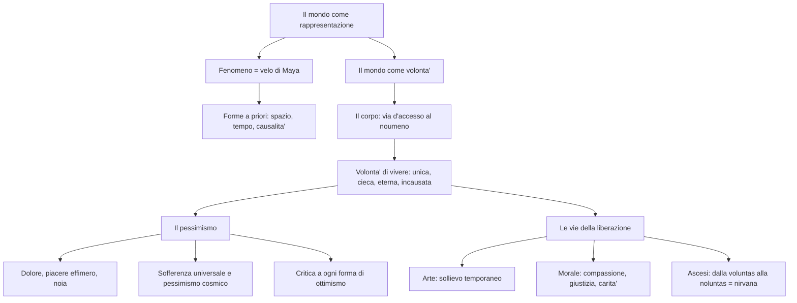

# Schopenhauer

## La vita e le radici culturali

Arthur Schopenhauer nacque il 22 febbraio 1788 a Danzica, nell'odierna Polonia. Suo padre era un ricco banchiere, sua madre Giovanna una nota scrittrice di romanzi. Dopo la morte del padre abbandono' la carriera commerciale e si dedico' alla filosofia: studio' a Gottinga e a Berlino, si laureo' a Jena nel 1813 e si trasferi' a Dresda, dove tra il 1814 e il 1818 scrisse la sua opera principale, *Il mondo come volonta' e rappresentazione*, pubblicata nel 1818. Il libro passo' quasi inosservato. Nel 1820 ottenne la libera docenza a Berlino, ma le sue lezioni — fissate provocatoriamente negli stessi orari di quelle di Hegel — rimasero deserte. Dal 1831 visse a Francoforte sul Meno fino alla morte (1860). Il successo arrivo' tardi: solo dopo il 1848, quando il fallimento dei moti rivoluzionari diffuse in Europa un'ondata di disillusione, il suo pessimismo trovo' finalmente un pubblico pronto ad ascoltarlo.

La sua opera resta uno dei testi fondamentali della filosofia moderna, capace di influenzare profondamente non solo il pensiero successivo ma anche la letteratura, la musica e la psicologia. Il pensiero di Schopenhauer si pone come punto di incontro tra esperienze filosofiche molto diverse. Di Platone lo attrae la teoria delle idee come forme eterne; da Kant deriva l'impostazione soggettivistica della conoscenza, la convinzione cioe' che noi non cogliamo la realta' cosi' com'e' ma cosi' come la nostra mente la organizza; dell'Illuminismo lo interessa lo spirito ironico e demistificatore; dal Romanticismo trae l'irrazionalismo, l'importanza dell'arte e il tema del dolore — con la differenza che il Romanticismo tendeva a riscattare il negativo attraverso il positivo (Dio, lo Spirito, il progresso), mentre Schopenhauer approda a una visione decisamente pessimistica. Un posto del tutto particolare nella formazione di Schopenhauer spetta alla sapienza orientale: fu il primo grande filosofo occidentale a recuperare sistematicamente il pensiero indiano, in particolare le *Upanishad* e il buddhismo, da cui ricavo' il concetto di *Maya* (illusione), la centralita' della sofferenza e l'ideale dell'ascesi.

Un ruolo decisivo, anche se per contrasto, e' quello di Hegel, bersaglio della sua polemica piu' feroce: lo definisce un "ciarlatano di mente ottusa", un "sicario della verita'", accusandolo di aver ridotto la filosofia a strumento del potere. La polemica non era solo personale: Schopenhauer rifiutava alla radice l'idea che la realta' fosse governata da una Ragione e che la storia avesse un senso, un fine, un progresso. Per Hegel l'essenza della realta' e' l'Idea, un'unica Ragione che si realizza e conosce se stessa; per Schopenhauer e' la Volonta' di vivere, una forza cieca e irrazionale che anima il Tutto senza alcuno scopo.

---

## Il velo di Maya

L'opera principale di Schopenhauer, *Il mondo come volonta' e rappresentazione*, si articola in due grandi momenti: il mondo come rappresentazione e il mondo come volonta'. Il punto di partenza e' la distinzione kantiana tra fenomeno e noumeno, ma reinterpretata in modo radicale. Per Kant il fenomeno era l'unica realta' accessibile alla mente e il noumeno un concetto-limite inconoscibile. Per Schopenhauer il fenomeno e' parvenza, illusione e sogno — cio' che nell'antica sapienza indiana si chiama il "velo di Maya" — mentre il noumeno e' la realta' autentica che si nasconde dietro l'ingannevole trama delle apparenze e che il filosofo ha il compito di scoprire.

La rappresentazione, tuttavia, non e' il nulla: e' il mondo cosi' come ci appare, regolato da leggi precise. Come Kant, Schopenhauer ritiene che la nostra mente organizzi l'esperienza attraverso forme a priori, ma ne ammette solo tre: spazio, tempo e causalita'. Quest'ultima e' l'unica vera categoria e assume forme diverse a seconda degli ambiti in cui opera: come necessita' fisica regola i rapporti tra oggetti (principio del divenire), come necessita' logica i rapporti tra premesse e conseguenze (principio del conoscere), come necessita' matematica i rapporti spazio-temporali (principio dell'essere), come necessita' morale le connessioni tra azioni e motivi (principio dell'agire). Poiche' le forme a priori funzionano come vetri sfaccettati che deformano la visione, la rappresentazione e' una fantasmagoria ingannevole e "la vita e' sogno". Il mondo che percepiamo e' "la mia rappresentazione": ha due aspetti inseparabili come le facce di una medaglia — il soggetto rappresentante e l'oggetto rappresentato — nessuno dei quali puo' esistere senza l'altro. Per questo sia il materialismo (che nega il soggetto) sia l'idealismo di Fichte (che nega l'oggetto) sono falsi.

---

## Tutto e' volonta'

Se il mondo fenomenico non e' che un sogno, la domanda che si pone e': c'e' qualcosa al di la' del sogno? E se c'e', come possiamo raggiungerlo? La risposta di Schopenhauer e' tanto semplice quanto geniale: il corpo. Se fossimo soltanto conoscenza, una "testa d'angelo alata senza corpo", non potremmo mai uscire dal mondo fenomenico. Ma poiche' siamo anche corpo, non ci limitiamo a vederci dal di fuori: ci viviamo dal di dentro, godendo e soffrendo. Ripiegandoci su noi stessi, scopriamo che l'essenza profonda del nostro essere e' la brama, la volonta' di vivere (*Wille zum Leben*): un impulso irresistibile che ci spinge a esistere e ad agire. Il nostro corpo non e' che la manifestazione esteriore delle nostre brame interiori — l'apparato digerente e' l'aspetto fenomenico della volonta' di nutrirsi, l'apparato sessuale della volonta' di riprodursi — e l'intero mondo fenomenico non e' altro che il modo in cui la volonta' si rende visibile a se stessa. Il rapporto tra volonta' e intelletto e' quello tra padrone e servo, tra cavaliere e cavallo, tra il sole e la luna.

Questa scoperta rappresenta il cuore della filosofia di Schopenhauer: la volonta' di vivere non e' un concetto astratto, ma qualcosa che ciascuno puo' sperimentare direttamente in se stesso, nei propri desideri, nelle proprie paure, nella propria fame. Per analogia, Schopenhauer estende questa intuizione all'intero universo: la volonta' di vivere non e' solo l'essenza dell'uomo ma la cosa in se' di tutte le cose. Tutti gli esseri ne sono pervasi, in forme e gradi di consapevolezza diversi, dalla materia inorganica fino all'uomo. La volonta' e' inconscia (non e' "volonta' cosciente" ma energia, impulso cieco), unica (al di la' di spazio e tempo non e' soggetta al principio di individuazione: "e' in una quercia come in un milione di querce"), eterna e indistruttibile, incausata e senza scopo. L'unico assoluto e' la volonta' stessa. Nel mondo fenomenico essa si oggettiva prima in un sistema di forme immutabili che Schopenhauer chiama platonicamente "idee" (archetipi eterni), poi nei singoli individui del mondo naturale, disposti in una "piramide cosmica" che dalle forze della natura sale fino all'uomo, in cui la volonta' diviene pienamente consapevole — ma cio' che guadagna in coscienza, lo perde in sicurezza: la ragione e' meno efficace dell'istinto, e per questo l'uomo e' un "animale malaticcio".

---

## Il pessimismo

Dalla metafisica della volonta' discende direttamente il pessimismo, che e' la parte piu' celebre e influente della filosofia di Schopenhauer. Affermare che l'essere e' volonta' infinita equivale a dire che la vita e' dolore per essenza. Volere significa desiderare, e desiderare significa trovarsi in uno stato di mancanza: il desiderio e' assenza, vuoto, indigenza, ossia dolore. Per un desiderio appagato ne rimangono dieci insoddisfatti, e il desiderio soddisfatto da' immediatamente luogo a un desiderio nuovo, in una catena senza fine. La felicita' non e' dunque un possesso stabile, ma un'illusione che si dissolve nel momento stesso in cui sembra raggiungerci. Cio' che gli uomini chiamano "piacere" non e' altro che la cessazione momentanea di un dolore — il godimento del bere presuppone la sofferenza della sete — mentre il dolore puo' esistere anche senza piacere che lo preceda: e' il dato primario e permanente. Accanto al dolore e al piacere effimero, Schopenhauer pone la noia, che subentra quando viene meno il pungolo del desiderio. La vita umana e' "un pendolo che oscilla incessantemente tra il dolore e la noia", passando attraverso l'intervallo fugace del piacere. "Non v'e' rosa senza spine, ma vi sono parecchie spine senza rose."

Il dolore non riguarda solo l'uomo ma investe ogni creatura: dietro le "meraviglie" della natura si cela un'"arena di esseri tormentati che esistono solo a patto di divorarsi l'un l'altro". L'uomo soffre di piu' perche' ha maggiore consapevolezza, e il genio piu' di tutti: "piu' intelligenza avrai, piu' soffrirai". Schopenhauer perviene cosi' a un pessimismo cosmico radicale: il male non e' solo nel mondo, ma nel principio stesso da cui il mondo dipende. Se il dolore e' universale, neppure l'amore offre una via di scampo: anch'esso e' un inganno. Dietro le sue lusinghe si nasconde il "Genio della specie", che usa il piacere sessuale come trucco per indurre gli individui a perpetuare la vita e con essa il dolore. L'amore non e' che "due infelicita' che si incontrano, due infelicita' che si scambiano e una terza infelicita' che si prepara". Per questo l'unico amore degno di elogio non e' quello dell'eros ma quello disinteressato della pieta'.

Oltre a stabilire che il dolore e' l'essenza della vita, Schopenhauer demolisce anche tutte le "menzogne" con cui gli uomini cercano di mascherare questa realta', e per questo e' considerato tra i "maestri del sospetto" accanto a Marx, Nietzsche e Freud, cioe' tra quei pensatori che hanno insegnato a diffidare delle apparenze e a cercare dietro le credenze e i valori accettati dalla societa' le forze nascoste che li producono. Rifiuta l'ottimismo cosmico di chi vede il mondo come un organismo perfetto governato da Dio o dalla Ragione: il mondo e' il teatro dell'illogicita' e della sopraffazione, e se si conducesse il piu' ostinato ottimista attraverso gli ospedali, le prigioni e i campi di battaglia, finirebbe col rinunciare alle proprie illusioni. Rifiuta l'ottimismo sociale: i rapporti umani sono regolati dal conflitto e dalla sopraffazione, e gli uomini vivono insieme per bisogno, non per simpatia — lo Stato non e' che un freno all'egoismo reciproco, una museruola che impedisce agli uomini di divorarsi a vicenda. Rifiuta l'ottimismo storico: la storia non e' progresso ma "il fatale ripetersi di un medesimo dramma", sempre la stessa "monotona sonata", perche' il destino dell'uomo — nascita, sofferenza, morte — resta immutabile al di la' del miraggio del tempo.

---

## Le vie della liberazione dal dolore

Di fronte a un quadro cosi' desolante, si potrebbe pensare che questa filosofia conduca al suicidio, ma Schopenhauer lo condanna: il suicida non nega la volonta' di vivere, anzi la afferma con forza, perche' "vuole la vita ed e' solo malcontento delle condizioni che gli sono toccate". Inoltre il suicidio sopprime solo una manifestazione fenomenica della volonta', che rinasce in mille altri individui come il sole che risorge dall'altro lato. La vera liberazione non consiste nell'eliminare una vita, ma nel liberarsi dalla volonta' di vivere stessa — nel passaggio dalla *voluntas* alla *noluntas*. Questo cammino si articola in tre tappe progressive, ciascuna delle quali rappresenta un grado crescente di liberazione.

La prima tappa e' l'arte. L'arte e' conoscenza libera e disinteressata che si rivolge alle idee eterne, sottraendo l'individuo alla catena dei bisogni e dei desideri. Chi contempla l'arte non e' piu' l'individuo sottoposto alla volonta', ma il "puro occhio del mondo". Le arti sono ordinate gerarchicamente, dall'architettura alla tragedia; un posto a se' occupa la musica, che non riproduce le idee ma e' "immediata rivelazione della volonta' a se stessa", una "metafisica in suoni". Schopenhauer attribuisce alla musica il vertice assoluto fra le arti, perche' essa non imita il mondo fenomenico come la pittura o la scultura, ma coglie direttamente l'essenza della volonta', esprimendone i moti interiori — l'agitazione, il desiderio, la quiete, l'esaltazione — in un linguaggio universale che tutti gli uomini possono comprendere senza bisogno di parole. Per questo l'esperienza estetica produce quel particolare stato di serenita' che si prova davanti a un bel paesaggio, ascoltando una sinfonia o leggendo una grande poesia: per un istante si cessa di volere e si contempla. Tuttavia la funzione liberatrice dell'arte e' temporanea e parziale, un "breve incantesimo": terminata la contemplazione estetica, l'individuo ricade nella morsa della volonta' e torna ad essere preda dei propri bisogni.

La seconda tappa della liberazione e' la morale, che rappresenta un impegno nel mondo a favore del prossimo. Per Schopenhauer l'etica non nasce dalla ragione (come in Kant) ma da un sentimento di pieta', di "com-passione", attraverso cui avvertiamo come nostre le sofferenze degli altri. La formula delle *Upanishad* — *Tat Twam Asi*, "questo vivente sei tu" — esprime questa unita' metafisica di tutti gli esseri: al di la' del velo di Maya, al di la' dell'illusione dell'individuazione, tutti gli esseri viventi sono la medesima volonta'. La morale si concretizza nella giustizia (non fare il male) e nella carita' (fare attivamente il bene), e ai suoi massimi livelli consiste nell'assumere su di se' il dolore cosmico. Questo tema richiama la "social catena" della *Ginestra* di Leopardi: entrambi vedono nella solidarieta' tra esseri sofferenti l'unica risposta dignitosa al dolore. Tuttavia anche la morale resta dentro la vita: la pieta' allevia la sofferenza ma non la elimina, perche' chi compatisce continua comunque a vivere e a volere. L'unica liberazione totale e definitiva e' l'ascesi. Mentre l'arte sospende la volonta' per un istante e la morale ne attenua gli effetti attraverso la solidarieta', l'ascesi va alla radice del problema: l'individuo, inorridito dalla volonta' di vivere e dalla sofferenza universale che essa produce, si propone di estirpare il proprio desiderio di esistere, di godere e di volere. Le pratiche ascetiche sono molteplici e tutte convergono verso il medesimo fine: la castita' perfetta spezza il ciclo della riproduzione, impedendo alla volonta' di perpetuarsi in nuove creature destinate a soffrire; la rinuncia, il digiuno, la poverta' e l'automacerazione tendono a sciogliere la volonta' dalle proprie catene, privandola progressivamente di tutti gli oggetti a cui si aggrappa. Quando la coscienza del dolore diviene non un "motivo" ma un "quietivo" del volere, l'uomo diviene autenticamente libero. Il punto d'arrivo non e' il Dio dei mistici cristiani ma il nirvana buddista: non il niente, ma un nulla relativo al mondo, un oceano di pace in cui le nozioni stesse di "io" e di "soggetto" si dissolvono, e con esse il dolore che accompagna ogni forma di esistenza individuale. A questo proposito Schopenhauer richiama le figure dei santi cristiani e degli asceti indiani, accomunati dal medesimo gesto: la rinuncia radicale al mondo. San Francesco d'Assisi, con la sua poverta' volontaria, e il Buddha, con la sua meditazione sotto l'albero della Bodhi, sono per Schopenhauer incarnazioni diverse del medesimo ideale: la negazione della volonta', la scelta consapevole di non volere piu'.

Va detto che molti critici considerano questa teoria la parte piu' debole del sistema: se la volonta' e' l'assoluto, come puo' l'asceta annullarla? Schopenhauer sembra introdurre una contraddizione nel cuore stesso della propria metafisica, ammettendo che cio' che ha dichiarato infinito e incausato possa tuttavia essere vinto da un atto della coscienza individuale. Queste obiezioni tuttavia non cancellano ne' la portata della denuncia del dolore, ne' la profondita' delle analisi schopenhaueriane sulla condizione umana. Con la sua filosofia, Schopenhauer ha aperto la strada a una serie di riflessioni decisive per il pensiero contemporaneo: l'idea che dietro la coscienza razionale si nascondano forze oscure e irrazionali anticipa la teoria dell'inconscio di Freud; la critica radicale all'ottimismo e al progresso prepara il terreno a Nietzsche; l'attenzione alla sofferenza e all'assurdo della condizione umana confluira' nell'esistenzialismo del Novecento. L'influsso di Schopenhauer si e' esteso ben oltre la filosofia, raggiungendo scrittori come Thomas Mann e Marcel Proust, e musicisti come Richard Wagner, che considero' *Il mondo come volonta' e rappresentazione* il libro piu' importante della sua vita.

---

## Schema riassuntivo

---

## Checklist

- [x] Biografia e contesto storico
- [x] Le radici culturali: Platone, Kant, Illuminismo, Romanticismo, sapienza orientale
- [x] L'opposizione a Hegel
- [x] Il mondo come rappresentazione: velo di Maya, forme a priori, soggetto e oggetto
- [x] Il mondo come volonta': il corpo come via d'accesso, la volonta' di vivere
- [x] I caratteri della volonta' e i gradi di oggettivazione
- [x] Il pessimismo: dolore, piacere, noia, sofferenza universale
- [x] L'illusione dell'amore
- [x] La critica all'ottimismo cosmico, sociale e storico
- [x] Le vie della liberazione: arte, morale, ascesi
- [x] Dalla voluntas alla noluntas: il nirvana

## Collegamenti

- Italiano: Giacomo Leopardi e il pessimismo cosmico, la "social catena" della *Ginestra* come risposta solidale al dolore universale, il tema del piacere come cessazione del dolore nel *Dialogo della Natura e di un Islandese*
- Latino: Lucrezio e la visione della natura come forza indifferente all'uomo nel *De rerum natura*; Seneca e il tema del dolore e della virtu' stoica come distacco dalle passioni
- Storia: il fallimento dei moti del 1848 e l'ondata di pessimismo in Europa che favori' la fortuna tardiva di Schopenhauer
- Scienze: Darwin e la lotta per la sopravvivenza come "legge della giungla", la natura come arena di conflitto e non come disegno provvidenziale
- Arte: il Romanticismo e il tema del dolore, dell'infinito, del sublime; la musica come arte suprema richiama il ruolo centrale della musica nel Romanticismo (Beethoven, Wagner)
- Filosofia: Kant e il noumeno; Hegel come anti-modello; anticipazione di Nietzsche (ateismo, critica alla morale), di Freud (l'inconscio, la sessualita' come forza dominante) e dell'esistenzialismo (l'angoscia, l'assurdo)
- Inglese: Thomas Hardy e la visione pessimistica dell'esistenza nella letteratura vittoriana; Samuel Beckett e il teatro dell'assurdo come espressione della noia e dell'insensatezza della vita
