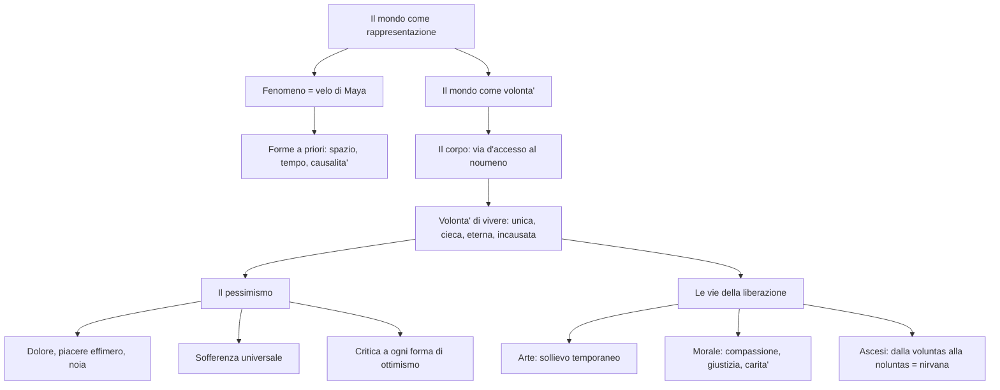

# Arthur Schopenhauer

## La vita

Arthur Schopenhauer nacque il 22 febbraio 1788 a Danzica (nell'odierna Polonia). Suo padre era un ricco banchiere, sua madre Giovanna una nota scrittrice di romanzi. Dopo la morte del padre, Arthur abbandono' la carriera commerciale che la famiglia aveva previsto per lui e si dedico' agli studi: frequento' l'Universita' di Gottinga, dove ebbe come maestro il filosofo Gottlob Ernst Schulze, e poi Berlino, dove assiste' alle lezioni di Fichte. Si formo' sulle dottrine di Platone e di Kant, i due pensatori che piu' influenzarono il suo sistema.

Nel 1813 si laureo' a Jena con la tesi *Sulla quadruplice radice del principio di ragion sufficiente*. Si trasferi' poi a Dresda, dove tra il 1814 e il 1818 scrisse la sua opera principale: *Il mondo come volonta' e rappresentazione*, pubblicata nel dicembre 1818. Il libro passo' quasi inosservato.

Nel 1820 ottenne la libera docenza all'Universita' di Berlino, ma le sue lezioni — che fissava provocatoriamente negli stessi orari di quelle di Hegel — rimasero deserte. Nel 1831 si trasferi' a Francoforte sul Meno, dove visse in solitudine fino alla morte, il 21 settembre 1860. Il successo arrivo' tardi: solo dopo il 1848, quando un'ondata di disillusione attraverso' l'Europa in seguito al fallimento dei moti rivoluzionari, il suo pessimismo trovo' finalmente un pubblico pronto ad ascoltarlo. L'ultima opera, *Parerga e paralipomena* (1851), una raccolta di saggi brillanti e aforismi, contribui' a diffondere la sua fama.

---

## Le radici culturali

Il pensiero di Schopenhauer e' un punto di incontro tra tradizioni molto diverse: **Platone**, **Kant**, l'**Illuminismo**, il **Romanticismo** e la **sapienza orientale** (in particolare le *Upanishad* indiane e il buddhismo).

| Influenza | Cosa ne ricava |
|-----------|---------------|
| **Platone** | La teoria delle idee come forme eterne, sottratte al divenire |
| **Kant** | L'impostazione soggettivistica della conoscenza: il mondo come fenomeno filtrato dalle nostre strutture mentali |
| **Illuminismo** | Lo spirito ironico, la tendenza a smascherare le illusioni, il filone materialistico |
| **Romanticismo** | L'irrazionalismo, il tema dell'infinito, l'importanza dell'arte e della musica, il tema del dolore |
| **Sapienza orientale** | Il concetto di *Maya* (illusione), la centralita' della sofferenza, l'ideale dell'ascesi e del distacco |

Schopenhauer fu il primo filosofo occidentale a tentare un recupero sistematico del pensiero dell'Estremo Oriente, ricavandone un repertorio di immagini e concetti che pervadono tutta la sua opera.

---

## L'opposizione a Hegel

Schopenhauer nutriva un'avversione feroce per Hegel, che considerava un "ciarlatano" e un "sicario della verita'". Lo accusava di aver ridotto la filosofia a strumento del potere politico e di aver costruito un sistema incomprensibile fatto di "non-sensi mistificanti". La polemica non era solo personale: Schopenhauer rifiutava alla radice l'idea hegeliana che la realta' fosse governata da una Ragione e che la storia avesse un senso e un fine. Per Hegel l'essenza del mondo e' l'**Idea** (una Ragione che si realizza e conosce se stessa); per Schopenhauer e' la **Volonta' di vivere** — una forza cieca, irrazionale, che non ha alcuno scopo.

!!! quote "Schopenhauer su Hegel"
    *"Hegel, insediato dall'alto, dalle forze al potere, fu un ciarlatano di mente ottusa, insipido, nauseabondo [...] La verita' non e' la meretrice che si getta al collo di chi non la vuole: essa possiede una cosi' altera bellezza che persino chi a lei sacrifica tutto non puo' ancora esser certo di ottenere i suoi favori. Hegel e' un sicario della verita'. Hegel e' una buffonata filosofica."*

---

## Il mondo come rappresentazione

Il punto di partenza di Schopenhauer e' la distinzione kantiana tra **fenomeno** (la realta' come ci appare) e **noumeno** (la realta' come e' in se stessa). Ma Schopenhauer la reinterpreta in modo radicale:

- Per **Kant**, il fenomeno era la realta' accessibile alla nostra mente, e il noumeno era un concetto-limite inconoscibile.
- Per **Schopenhauer**, il fenomeno e' **parvenza, illusione e sogno** — quello che nell'antica sapienza indiana si chiama il **"velo di Maya"** — mentre il noumeno e' la realta' autentica, che il filosofo ha il compito di scoprire.

!!! abstract "Il velo di Maya"
    Nella tradizione indiana, *Maya* e' il velo ingannatore che avvolge gli occhi dei mortali e fa loro vedere un mondo del quale non si puo' dire ne' che esista ne' che non esista. Per Schopenhauer la vita quotidiana e' esattamente questo: un tessuto di apparenze, qualcosa di intermedio tra il sogno e la veglia.

Il mondo che ci circonda e' sempre e soltanto in relazione al soggetto che lo percepisce: **"il mondo e' una mia rappresentazione"**. Nessuno puo' uscire da se stesso per vedere le cose come sono oggettivamente. Seguendo Kant, Schopenhauer sostiene che la nostra mente organizza l'esperienza attraverso delle **forme a priori**, ma ne ammette solo tre: **spazio**, **tempo** e **causalita'** (a differenza delle dodici categorie di Kant). Queste forme funzionano come vetri sfaccettati che deformano la visione delle cose: per questo la rappresentazione e' come una fantasmagoria ingannevole, e "la vita e' sogno".

La rappresentazione ha due componenti inseparabili, come le due facce di una medaglia:

- il **soggetto rappresentante** (chi conosce)
- l'**oggetto rappresentato** (cio' che viene conosciuto)

Nessuno dei due puo' esistere senza l'altro. Per questo sia il **materialismo** (che nega il soggetto riducendo tutto alla materia) sia l'**idealismo** di Fichte (che nega l'oggetto riducendo tutto al soggetto) sono entrambi sbagliati.

---

## Il mondo come volonta'

Ma se il mondo fenomenico e' solo un'illusione, che cosa si nasconde dietro il velo di Maya? Come possiamo raggiungere la "cosa in se'"?

Schopenhauer trova la risposta nel **corpo**. Noi non siamo solo teste pensanti sospese nel vuoto: siamo anche corpi che godono e soffrono. Il nostro corpo lo conosciamo in due modi diversi:

1. **Dall'esterno**, come rappresentazione — un oggetto tra gli altri oggetti del mondo
2. **Dall'interno**, come **volonta'** — lo viviamo dal di dentro, sentendo i nostri impulsi, i nostri desideri, le nostre brame

Ogni atto del nostro corpo e' l'espressione visibile di un atto di volonta': il nostro corpo e' "volonta' resa visibile". L'apparato digerente e' l'aspetto fenomenico della volonta' di nutrirsi; l'apparato sessuale e' la volonta' di riprodursi; e cosi' via.

!!! abstract "La volonta' di vivere (Wille zum Leben)"
    La cosa in se' che si nasconde dietro il fenomeno e' la **volonta' di vivere**: un impulso prepotente e irresistibile che ci spinge a esistere e ad agire. Essa non e' soltanto l'essenza dell'uomo, ma l'**essenza segreta di tutte le cose** — la radice profonda dell'intero universo. Da qui il titolo dell'opera: *Il mondo come volonta' e rappresentazione*.

Per esprimere il rapporto tra la volonta' e l'intelletto, Schopenhauer usa una serie di immagini: e' lo stesso rapporto che c'e' tra il padrone e il servo, tra il cavaliere e il cavallo, tra il sole e la luna, tra il cuore e il cervello. L'intelletto e' solo uno strumento al servizio della volonta'.

### I caratteri della volonta'

La volonta' di vivere, essendo al di la' del fenomeno, ha caratteri opposti a quelli del mondo della rappresentazione:

| Carattere | Significato |
|-----------|-------------|
| **Inconscia** | Non e' "volonta' cosciente" ma energia, impulso cieco — per questo si manifesta anche nelle piante e nella materia inorganica |
| **Unica** | Essendo al di la' di spazio e tempo, non e' soggetta al principio di individuazione: "e' in una quercia come in un milione di querce" |
| **Eterna** | Non ha inizio ne' fine, e' un principio indistruttibile |
| **Incausata** | Non ha una causa ne' uno scopo: e' una forza libera e cieca che vuole se stessa |

### I gradi di oggettivazione

La volonta' si manifesta nel mondo fenomenico attraverso due fasi:

1. Si oggettiva in un sistema di **idee** (in senso platonico): forme immutabili, eterne, che fungono da archetipi del mondo
2. Si oggettiva negli **individui del mondo naturale**, che sono la moltiplicazione delle idee attraverso il prisma dello spazio e del tempo

I gradi di oggettivazione formano una "piramide cosmica": dalle forze generali della natura (il livello piu' basso), alle piante, agli animali, fino all'**uomo**, in cui la volonta' diviene pienamente consapevole. Ma cio' che la volonta' guadagna in coscienza lo perde in sicurezza: nell'uomo la ragione e' meno efficace dell'istinto, e per questo Schopenhauer definisce l'uomo un "animale malaticcio".

---

## Il pessimismo

### Dolore, piacere e noia

Se l'essenza del mondo e' una volonta' infinita e inappagabile, ne consegue che **la vita e' dolore per essenza**. Volere significa desiderare, e desiderare significa trovarsi in uno stato di tensione per la mancanza di qualcosa: il desiderio e' assenza, vuoto, indigenza — cioe' dolore. E poiche' nell'uomo la volonta' e' piu' cosciente che negli altri esseri, l'uomo e' il piu' bisognoso e mancante tra tutti, destinato a non trovare mai un appagamento definitivo.

!!! note "Le tre condizioni dell'esistenza"
    Per Schopenhauer la vita umana oscilla tra tre stati fondamentali:

    - **Il dolore**: lo stato primario e permanente, che nasce dal desiderio insoddisfatto
    - **Il piacere**: non e' qualcosa di positivo, ma solo una **cessazione momentanea del dolore**. Per godere bisogna prima aver sofferto (il piacere di bere presuppone la sofferenza della sete). Appena il desiderio e' appagato, il piacere svanisce
    - **La noia**: subentra quando il desiderio viene meno — quando non si ha piu' nulla da volere, la vita diventa insopportabilmente vuota

!!! quote "Il pendolo della vita"
    *"La vita umana e' come un pendolo che oscilla incessantemente tra il dolore e la noia, passando attraverso l'intervallo fugace del piacere e della gioia."*

In altre parole: quando desideriamo qualcosa che non abbiamo, soffriamo; quando la otteniamo, ci annoiamo; e il piacere e' solo l'attimo di passaggio tra l'una e l'altra condizione. Come scrive Schopenhauer con un'immagine memorabile: *"Non v'e' rosa senza spine, ma vi sono parecchie spine senza rose."*

### La sofferenza universale

Il dolore non riguarda soltanto l'uomo: **investe ogni creatura**. Tutto soffre — dal fiore che appassisce per mancanza d'acqua, all'animale ferito, dal bambino che nasce al vecchio che muore. Dietro le apparenti "meraviglie" della natura si cela un'"arena di esseri tormentati e angosciati, i quali esistono solo a patto di divorarsi l'un l'altro": ogni animale carnivoro e' il sepolcro vivente di mille altri e la propria autoconservazione e' una catena di morti strazianti.

L'uomo soffre di piu' rispetto alle altre creature semplicemente perche', avendo maggiore consapevolezza, sente in modo piu' accentuato la spinta della volonta' e patisce maggiormente l'insoddisfazione. Per la stessa ragione, il genio soffre piu' di tutti: *"piu' intelligenza avrai, piu' soffrirai"*, ripete Schopenhauer citando l'Ecclesiaste.

Il filosofo perviene cosi' a una delle forme piu' radicali di **pessimismo cosmico** (o metafisico) della storia del pensiero: il male non e' solo nel mondo, ma nel **principio stesso** da cui il mondo dipende — la volonta'.

### L'illusione dell'amore

L'amore, che "si impadronisce della meta' delle forze e dei pensieri dell'umanita' piu' giovane", e' uno dei piu' forti stimoli dell'esistenza. Ma dietro le sue lusinghe e il suo incanto si nasconde il freddo "Genio della specie": il fine dell'amore non e' la felicita' degli individui, ma l'**accoppiamento**, cioe' la perpetuazione della vita e quindi del dolore. L'individuo che crede di realizzare la propria felicita' e' in realta' lo "zimbello" della natura. Schopenhauer arriva a dire che l'amore procreativo e' inconsapevolmente avvertito come "peccato" e "vergogna" proprio perche' e' responsabile della procreazione di altre creature destinate a soffrire. L'unico amore degno di elogio non e' quello dell'*eros*, ma quello disinteressato della **pieta'**.

---

## La critica alle forme di ottimismo

Schopenhauer demolisce sistematicamente tutte le "menzogne" con cui gli uomini cercano di nascondere a se stessi la crudezza della vita. Per questo e' stato considerato tra i "**maestri del sospetto**", accanto a Marx, Nietzsche e Freud.

### Contro l'ottimismo cosmico

Rifiuta l'idea che il mondo sia un organismo perfetto governato da Dio o dalla Ragione (come sosteneva Hegel). Il mondo non e' il "migliore dei mondi possibili" ma un teatro dell'illogicita' e della sopraffazione. Contesta le religioni (che chiama "metafisiche per il popolo") e perviene a un **ateismo filosofico** che sara' ripreso da Nietzsche.

### Contro l'ottimismo sociale

Rifiuta la tesi della bonta' naturale dell'uomo. I rapporti umani sono regolati dal conflitto e dalla sopraffazione reciproca: *"Vi e' dunque, nel cuore di ogni uomo, una belva che attende solo il momento propizio per scatenarsi e infuriare contro gli altri."* Gli uomini vivono insieme non per simpatia ma per bisogno, e lo Stato esiste solo per difendersi dagli istinti aggressivi degli individui.

### Contro l'ottimismo storico

Rifiuta ogni forma di storicismo e l'idea di progresso. La storia non e' altro che "il fatale ripetersi di un medesimo dramma", una "monotona sonata" che si ripete all'infinito. Il destino dell'uomo presenta, in ogni epoca, gli stessi tratti immutabili: nascita, sofferenza, morte. L'autentico compito della storia non e' raccontare il "progresso", ma offrire all'uomo la coscienza di se' e del proprio destino.

---

## Le vie della liberazione dal dolore

Se la vita e' sostanzialmente dolore, come e' possibile liberarsene?

### Il rifiuto del suicidio

Schopenhauer **condanna il suicidio** per due motivi:

1. Il suicida non nega la volonta' di vivere, anzi la **afferma con forza**: "vuole la vita ed e' solo malcontento delle condizioni che gli sono toccate". Non rifiuta il volere, rifiuta la sua situazione particolare.
2. Il suicidio sopprime solo una **manifestazione fenomenica** della volonta', lasciando intatta la cosa in se': la volonta', come il sole che risorge dopo il tramonto, rinasce in mille altri individui.

La vera risposta al dolore non e' eliminare una vita, ma liberarsi dalla **volonta' di vivere stessa**. Il cammino va dalla **voluntas** (volonta') alla **noluntas** (negazione della volonta'), e si articola in tre tappe: l'arte, la morale e l'ascesi.

### L'arte: il primo sollievo (temporaneo)

L'arte e' **conoscenza libera e disinteressata** che si rivolge alle idee, cioe' alle forme pure ed eterne delle cose. Mentre la conoscenza scientifica e' imbrigliata nelle forme dello spazio e del tempo e asservita ai bisogni della volonta', l'arte contempla l'universale e sottrae l'individuo alla catena infinita dei desideri, offrendogli un appagamento immobile e compiuto.

Le arti sono ordinate gerarchicamente secondo i diversi gradi di oggettivazione della volonta':

Tra le arti spicca la **tragedia**, che rappresenta il dramma della vita umana. Ma un posto a se' occupa la **musica**: essa non riproduce le idee come le altre arti, ma e' una **rivelazione immediata della volonta' a se stessa**, una "metafisica in suoni" che ci mette in contatto con le radici stesse dell'essere.

!!! warning "I limiti dell'arte"
    La funzione liberatrice dell'arte e' sempre **temporanea e parziale**: un "breve incantesimo" che offre un conforto momentaneo ma non una redenzione definitiva.

### La morale: la compassione

A differenza dell'arte (che e' un estraniamento dalla realta'), la morale e' un **impegno nel mondo a favore del prossimo**. L'etica per Schopenhauer non nasce dalla ragione (come in Kant, con l'imperativo categorico), ma da un **sentimento di pieta'** — di "com-passione" — attraverso cui avvertiamo come nostre le sofferenze degli altri, identificandoci con il loro tormento.

!!! abstract "Il fondamento dell'etica"
    Non e' la conoscenza a produrre la moralita', ma e' **la moralita' a produrre la conoscenza**: "attraverso la compassione conosciamo" (Wagner). Tramite la pieta' sperimentiamo l'unita' metafisica di tutti gli esseri, espressa dalla formula delle *Upanishad*: **"Tat Twam Asi"** — "questo vivente sei tu".

La morale si concretizza in due virtu':

- **La giustizia** (*neminem laede* — non fare del male a nessuno): aspetto "negativo" della pieta', consiste nel frenare l'egoismo e nel non fare il male agli altri
- **La carita'** (*omnes quantum potes, juva* — aiuta tutti quanto puoi): aspetto "positivo", volonta' attiva di fare del bene al prossimo. E' **agape**, amore disinteressato, non eros

Ai suoi massimi livelli, la morale consiste nella pieta' cosmica: far propria la sofferenza di tutti gli esseri.

!!! tip "Schopenhauer e Leopardi"
    Il tema della compassione come legame tra gli uomini di fronte alla sofferenza universale richiama la "social catena" della *Ginestra* di Leopardi: entrambi i pensatori vedono nella solidarieta' tra esseri sofferenti — e non nelle illusioni del progresso — l'unica risposta dignitosa al dolore dell'esistenza.

### L'ascesi: la liberazione definitiva

La morale, per quanto nobile, rimane pur sempre all'interno della vita e presuppone un qualche attaccamento ad essa. L'unica via per una liberazione **totale** dalla sofferenza e' l'**ascesi**: l'esperienza attraverso cui l'individuo, inorridito dalla volonta' di vivere, si propone di **estirpare il proprio desiderio di esistere, di godere e di volere**.

Le forme dell'ascesi sono:

- La **castita' perfetta** (che spezza il ciclo della riproduzione e della perpetuazione della specie)
- La **rinuncia ai piaceri**, l'umilta', il digiuno, la poverta', il sacrificio
- L'**automacerazione** volontaria

Se la volonta' fosse vinta completamente anche in un solo individuo, essa perirebbe tutta, in quanto e' una sola: tramite la liberazione radicale dell'asceta, l'intero mondo puo' essere redento.

!!! note "Dalla voluntas alla noluntas"
    Il termine **noluntas** e' un'invenzione linguistica di Schopenhauer: indica la negazione della *voluntas*, cioe' la cessazione di quella forza irrazionale che costituisce l'essenza dell'universo. E' con la presa di coscienza del dolore e con il disinganno di fronte alle illusioni dell'esistere che prende avvio il cammino di liberazione.

Il punto d'arrivo dell'ascesi non e' il Dio dei mistici cristiani, ma il **nirvana buddhista**: l'esperienza del nulla, inteso non come il niente ma come una **negazione del mondo stesso** — un oceano di pace, uno spazio luminoso di serenita' in cui le stesse nozioni di "io" e di "soggetto" si dissolvono.

---

## Schema riassuntivo

---

## Checklist

- [x] Biografia e contesto storico
- [x] Le radici culturali: Platone, Kant, Illuminismo, Romanticismo, sapienza orientale
- [x] L'opposizione a Hegel
- [x] Il mondo come rappresentazione: velo di Maya, forme a priori, soggetto/oggetto
- [x] Il mondo come volonta': il corpo, la volonta' di vivere, i suoi caratteri
- [x] I gradi di oggettivazione della volonta'
- [x] Il pessimismo: dolore, piacere, noia
- [x] La sofferenza universale e il pessimismo cosmico
- [x] L'illusione dell'amore
- [x] La critica all'ottimismo cosmico, sociale e storico
- [x] Le vie della liberazione: arte, morale, ascesi
- [x] Dalla voluntas alla noluntas: il nirvana

## Collegamenti

- **Italiano**: Giacomo Leopardi e il pessimismo cosmico; la "social catena" della *Ginestra* come risposta solidale al dolore universale; il tema del piacere come cessazione del dolore (Leopardi, *Dialogo della Natura e di un Islandese*)
- **Latino**: Lucrezio e il materialismo epicureo; la visione della natura come forza indifferente all'uomo nel *De rerum natura*; Seneca e il tema del dolore e della virtu' stoica come distacco dalle passioni
- **Storia**: il fallimento dei moti del 1848 e l'ondata di pessimismo in Europa che favori' la fortuna tardiva di Schopenhauer
- **Scienze**: Darwin e la lotta per la sopravvivenza come "legge della giungla" — la natura come arena di conflitto, non come disegno provvidenziale
- **Arte**: il Romanticismo e il tema del dolore, dell'infinito, del sublime; la musica come arte suprema richiama il ruolo centrale della musica nel Romanticismo (Beethoven, Wagner)
- **Filosofia**: Kant e il noumeno; Hegel come anti-modello; anticipazione di Nietzsche (ateismo, critica alla morale), Freud (l'inconscio, la sessualita' come forza dominante) e dell'esistenzialismo (l'angoscia, l'assurdo)
- **Inglese**: Thomas Hardy e la visione pessimistica dell'esistenza nella letteratura vittoriana; Samuel Beckett e il teatro dell'assurdo come espressione della noia e dell'insensatezza della vita
