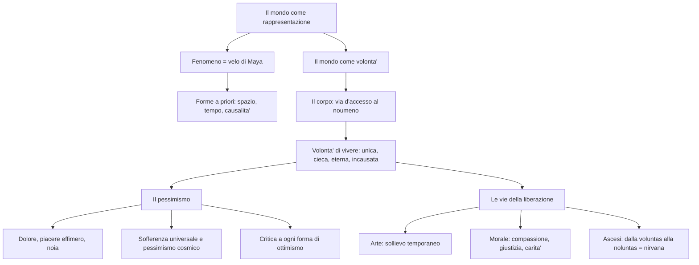

# Schopenhauer

## La vita e le radici culturali

Arthur Schopenhauer nacque il 22 febbraio 1788 a Danzica, nell'odierna Polonia. Suo padre era un ricco banchiere, sua madre Giovanna una nota scrittrice di romanzi. Dopo la morte del padre, Arthur abbandono' la carriera commerciale che la famiglia aveva previsto per lui e si dedico' agli studi filosofici: frequento' l'Universita' di Gottinga, dove ebbe come maestro Gottlob Ernst Schulze, e poi Berlino, dove assiste' alle lezioni di Fichte. Nel 1813 si laureo' a Jena con la tesi *Sulla quadruplice radice del principio di ragion sufficiente*. Si trasferi' poi a Dresda, dove tra il 1814 e il 1818 scrisse la sua opera principale, *Il mondo come volonta' e rappresentazione*, pubblicata nel dicembre 1818. Il libro passo' quasi del tutto inosservato. Nel 1820 ottenne la libera docenza all'Universita' di Berlino, ma le sue lezioni — che fissava provocatoriamente negli stessi orari di quelle di Hegel — rimasero deserte. Nel 1831 si trasferi' a Francoforte sul Meno, dove visse in solitudine fino alla morte, avvenuta il 21 settembre 1860. Il successo arrivo' tardi: solo dopo il 1848, quando un'ondata di disillusione attraverso' l'Europa in seguito al fallimento dei moti rivoluzionari, il suo pessimismo trovo' finalmente un pubblico pronto ad ascoltarlo. L'ultima opera, *Parerga e paralipomena* (1851), una raccolta di saggi brillanti e aforismi, contribui' decisamente a diffondere la sua fama.

Il pensiero di Schopenhauer si pone come punto di incontro tra esperienze filosofiche molto diverse. Di Platone lo attrae soprattutto la teoria delle idee, intese come forme eterne sottratte alla caducita' del mondo sensibile. Da Kant, che egli considera il filosofo piu' grande e originale della storia del pensiero, deriva l'impostazione soggettivistica della conoscenza — la convinzione cioe' che noi non cogliamo la realta' cosi' com'e', ma cosi' come la nostra mente la organizza. Dell'Illuminismo lo interessano il filone materialistico e lo spirito ironico e demistificatore di Voltaire, la tendenza cioe' a smascherare le illusioni e le credenze tramandate. Dal Romanticismo, infine, Schopenhauer trae l'irrazionalismo, la grande importanza attribuita all'arte e alla musica, e soprattutto il tema del dolore — con la differenza fondamentale che il Romanticismo tendeva comunque a riscattare il negativo attraverso il positivo (Dio, lo Spirito, il progresso), mentre Schopenhauer approda a una visione decisamente pessimistica della realta'. Un posto particolare spetta alla sapienza dell'antico Oriente: Schopenhauer fu il primo filosofo occidentale a tentare un recupero sistematico del pensiero indiano, in particolare delle *Upanishad* e del buddhismo, da cui ricavo' il concetto di *Maya* (illusione), la centralita' della sofferenza e l'ideale dell'ascesi come distacco dal mondo.

Un ruolo di decisiva importanza, anche se indiretto, e' quello giocato dal pensiero idealistico, che Schopenhauer considera la sua "bestia nera". Hegel in particolare e' il bersaglio della sua polemica piu' feroce: lo definisce un "ciarlatano di mente ottusa", un "sicario della verita'", accusandolo di aver ridotto la filosofia a strumento del potere politico e di aver costruito un sistema incomprensibile fatto di "non-sensi mistificanti". La polemica non era solo personale: Schopenhauer rifiutava alla radice l'idea hegeliana che la realta' fosse governata da una Ragione e che la storia avesse un senso e un fine. Per Hegel l'essenza della realta' e' l'Idea, cioe' un'unica Ragione che tende a realizzare e conoscere se stessa, e che si articola nei tre momenti dell'idea in se' e per se', dell'idea fuori di se' (concretizzata nella natura) e dell'idea tornata in se' (l'autocoscienza umana). Per Schopenhauer, al contrario, l'essenza della realta' e' la Volonta' di vivere — un'unica forza irrazionale che anima ciecamente il Tutto, e che si manifesta nelle idee (modelli eterni della realta'), nella gerarchia degli enti naturali e nella volonta' autoconsapevole nell'uomo.

---

## Il velo di Maya

Il punto di partenza della filosofia di Schopenhauer e' la distinzione kantiana tra "fenomeno" e "noumeno", ovvero tra la "cosa cosi' come appare" e la "cosa in se'". Questa distinzione ha pero' poco in comune con quella professata da Kant. Per il filosofo di Konigsberg, il fenomeno era la realta' — o meglio l'unica realta' accessibile alla mente umana — e il noumeno era un concetto-limite che serviva da promemoria critico, per ricordare all'uomo i limiti della conoscenza. Per Schopenhauer, invece, il fenomeno e' parvenza, illusione e sogno, ovvero cio' che nell'antica sapienza indiana era detto "velo di Maya", mentre il noumeno e' quella realta' che si nasconde dietro l'ingannevole trama del fenomeno e che il filosofo ha il compito di scoprire. Maya, nei testi dei *Veda* e dei *Purana*, e' il velo ingannatore che avvolge gli occhi dei mortali e fa loro vedere un mondo del quale non si puo' dire ne' che esista ne' che non esista, perche' rassomiglia al sogno, al riflesso del sole sulla sabbia che il pellegrino da lontano scambia per acqua, o alla corda gettata a terra che egli prende per un serpente.

Sulle orme del criticismo kantiano, anche Schopenhauer ritiene che la nostra mente risulti corredata di una serie di forme a priori. Tuttavia, a differenza di Kant, ne ammette solamente tre: spazio, tempo e causalita'. Quest'ultima e' l'unica categoria, in quanto tutte le altre sono a essa riconducibili, e la realta' stessa dell'oggetto si risolve completamente nella sua azione causale su altri oggetti. La causalita', fin dallo scritto *Sulla quadruplice radice del principio di ragion sufficiente*, assume forme diverse a seconda degli ambiti in cui opera: come necessita' fisica regola i rapporti tra gli oggetti naturali (principio del divenire), come necessita' logica regola i rapporti tra premesse e conseguenze (principio del conoscere), come necessita' matematica regola i rapporti spazio-temporali e aritmetico-geometrici (principio dell'essere), e come necessita' morale regola le connessioni tra un'azione e i suoi motivi (principio dell'agire). Poiche' Schopenhauer paragona le forme a priori a vetri sfaccettati, attraverso cui la visione delle cose si deforma, egli considera la rappresentazione come una fantasmagoria ingannevole, traendo la conclusione che "la vita e' sogno", un tessuto di apparenze simile agli stati onirici.

Il fenomeno di cui parla Schopenhauer e' la rappresentazione soggettiva, cioe' esiste solo dentro la coscienza: "il mondo e' la mia rappresentazione". La rappresentazione ha due aspetti essenziali e inseparabili, come le due facce della stessa medaglia: da una parte c'e' il soggetto rappresentante, dall'altra c'e' l'oggetto rappresentato. Nessuno dei due puo' esistere senza l'altro. Per questo il materialismo e' falso, perche' nega il soggetto riducendo tutto all'oggetto o alla materia, e l'idealismo di Fichte e' parimenti errato, perche' compie il tentativo opposto di negare l'oggetto riducendolo al soggetto. Ma al di la' del sogno e della trama ingannevole del fenomeno, esiste la realta' vera, quella che il filosofo che e' nell'uomo non puo' fare a meno di cercare. L'uomo, infatti, e' un "animale metafisico", portato a stupirsi della propria esistenza e a interrogarsi sull'essenza ultima della vita — e questo avviene in misura proporzionale alla sua intelligenza. Come scrive Schopenhauer nei *Supplementi*: se la nostra vita fosse senza fine e senza dolore, forse non verrebbe in mente a nessuno di chiedersi perche' il mondo esista e perche' sia fatto cosi' com'e'.

---

## Tutto e' volonta'

Se la mente e' "chiusa" nell'orizzonte della rappresentazione, come e' possibile lacerare il velo di Maya, trovare il filo d'Arianna necessario per orientarsi nel labirinto del relativo e attingere l'assoluto? Dove possiamo trovare quel passaggio segreto che ci consentira' di introdurci nella "fortezza" della cosa in se'? La risposta di Schopenhauer e' tanto semplice quanto geniale: la chiave d'accesso al noumeno e' il corpo. Se noi fossimo soltanto conoscenza e rappresentazione, una sorta di "testa d'angelo alata, senza corpo", non potremmo mai uscire dal mondo fenomenico. Ma poiche' siamo dati a noi medesimi non solo come rappresentazione, ma anche come corpo, non ci limitiamo a "vederci" dal di fuori: ci viviamo anche dal di dentro, godendo e soffrendo.

Ed e' proprio questa esperienza di base, simile a un raggio di sole che penetra oltre la nuvola, a permettere all'uomo di squarciare il velo del fenomeno e di afferrare la cosa in se'. Ripiegandoci su noi stessi, ci rendiamo conto che l'essenza profonda del nostro io, la cosa in se' del nostro essere globalmente considerato, e' la brama, o la volonta' di vivere (*Wille zum Leben*), cioe' un impulso prepotente e irresistibile che ci spinge a esistere e ad agire. Piu' che intelletto o conoscenza, noi siamo vita e volonta' di vivere, e il nostro stesso corpo non e' che la manifestazione esteriore delle nostre brame interiori: l'apparato digerente non e' che l'aspetto fenomenico della volonta' di nutrirsi, l'apparato sessuale non e' che l'aspetto oggettivato della volonta' di accoppiarsi e di riprodursi. L'intero mondo fenomenico non e' altro che il modo in cui la volonta' si manifesta o si rende visibile a se stessa nella rappresentazione spazio-temporale. Per esprimere il rapporto tra la volonta' e l'intelletto, Schopenhauer ricorre a una serie di immagini eloquenti: e' lo stesso che intercorre tra il padrone e il servo, tra l'uomo e lo strumento, tra il cavaliere e il cavallo, tra il sole e la luna, tra il cuore e il cervello.

Fondandosi sul principio di analogia, Schopenhauer afferma poi che la volonta' di vivere non e' soltanto la radice noumenica dell'uomo, ma anche l'essenza segreta di tutte le cose, la cosa in se' dell'universo. Tutti gli esseri della natura sono pervasi dalla volonta' di vivere, sia pure in forme distinte e secondo gradi di consapevolezza diversi: dalla materia inorganica, in cui essa si manifesta in modo inconscio, fino all'uomo, in cui essa risulta pienamente consapevole. Ma cio' che la volonta' acquista in coscienza perde in sicurezza: come guida della vita, la ragione e' meno efficace dell'istinto, e questo e' il motivo per cui Schopenhauer afferma che l'uomo, in un certo senso, e' un "animale malaticcio".

---

## I caratteri della volonta' e il pessimismo

Essendo al di la' del fenomeno, la volonta' di vivere presenta caratteri contrapposti a quelli del mondo della rappresentazione. Innanzitutto, la volonta' primordiale e' inconscia: il termine "volonta'", preso in senso metafisico-schopenhaueriano, non significa "volonta' cosciente" ma indica il concetto piu' generale di energia, o impulso — e in questo senso si comprende perche' Schopenhauer la attribuisca anche alla materia inorganica e ai vegetali. In secondo luogo, la volonta' risulta unica, poiche', esistendo al di fuori dello spazio e del tempo (che hanno la prerogativa di dividere e moltiplicare gli enti), si sottrae al "principio di individuazione": essa e' in una quercia come in un milione di querce. Essendo oltre la forma del tempo, la volonta' e' anche eterna e indistruttibile, un principio senza inizio ne' fine: Schopenhauer paragona il perdurare dell'universo nel tempo a un "meriggio eterno senza tramonto refrigerante", oppure all'"arcobaleno sulla cascata", non toccato dal fluire delle acque. Essendo al di la' della categoria di causa, la volonta' si configura anche come una forza libera e cieca, ossia come energia incausata, senza un perche' e senza uno scopo. La volonta' primordiale non ha alcuna meta oltre se stessa: la vita vuole la vita, la volonta' vuole la volonta', e qualunque motivazione o scopo cadono entro l'orizzonte del vivere e del volere. Miliardi di esseri non vivono dunque che per vivere e continuare a vivere, e l'unico assoluto e' la volonta' stessa — cioe' quel principio al quale da sempre i filosofi hanno conferito i caratteri di Dio (essere unico, eterno, incausato) e che Schopenhauer invece identifica con un'energia a-logica e irrazionale.

La volonta' si manifesta nel mondo fenomenico attraverso due fasi logicamente distinguibili. Nella prima, si oggettiva in un sistema di forme immutabili, a-spaziali e a-temporali, che Schopenhauer chiama platonicamente "idee" e che considera alla stregua di archetipi del mondo. Nella seconda, si oggettiva nei vari individui del mondo naturale, che non sono altro che la moltiplicazione delle idee, vista attraverso il prisma dello spazio e del tempo. Tra gli individui e le idee esiste un rapporto di copia-modello. Il mondo delle realta' naturali si struttura a sua volta in una serie di "gradi" disposti in ordine ascendente: il grado piu' basso e' costituito dalle forze generali della natura, i gradi superiori dalle piante e dagli animali. Questa sorta di "piramide cosmica" culmina nell'uomo, nel quale la volonta' diviene pienamente consapevole.

Affermare che l'essere e' la manifestazione di una volonta' infinita equivale a dire, secondo Schopenhauer, che la vita e' dolore per essenza. Volere significa desiderare, e desiderare significa trovarsi in uno stato di tensione per la mancanza di qualcosa che si vorrebbe avere. Per definizione, il desiderio e' assenza, vuoto e indigenza, ossia dolore. E poiche' nell'uomo la volonta' e' piu' cosciente, e quindi piu' "affamata", che negli altri esseri, proprio l'uomo risulta il piu' bisognoso e mancante tra loro, destinato a non trovare mai un appagamento verace e definitivo. Ogni volere scaturisce da bisogno, ossia da mancanza, ossia da sofferenza: per un desiderio che venga appagato, ne rimangono almeno dieci insoddisfatti; inoltre la brama dura a lungo, le esigenze vanno all'infinito, l'appagamento e' breve e misurato con mano avara. La stessa soddisfazione finale e' solo apparente: il desiderio appagato da' tosto luogo a un desiderio nuovo, e nessun oggetto del volere, una volta conseguito, puo' dare appagamento durevole.

Cio' che gli uomini chiamano "godimento" o "gioia" non e' altro che una cessazione di dolore, lo "scaricarsi" di una tensione preesistente: perche' ci sia piacere e' necessario che ci sia uno stato precedente di tensione o di dolore. Il godimento del bere, ad esempio, presuppone la sofferenza della sete. La stessa cosa non vale per il dolore, che non puo' affatto essere ridotto a pura cessazione di piacere: un individuo puo' sperimentare una catena di dolori senza che questi siano preceduti da altrettanti piaceri. Il dolore e' dunque un dato primario e permanente, il piacere e' solo una funzione derivata del dolore, che vive unicamente a spese di esso. Accanto al dolore, che e' una realta' durevole, e al piacere, che e' qualcosa di momentaneo, Schopenhauer pone la noia come terza situazione di base dell'esistenza umana: essa subentra quando viene meno l'aculeo del desiderio, quando il possesso fa perdere l'attrazione, oppure quando cessano il frastuono delle attivita' e il pungolo delle preoccupazioni. La vita umana, conclude Schopenhauer, e' come un pendolo che oscilla incessantemente tra il dolore e la noia, passando attraverso l'intervallo fugace, e per di piu' illusorio, del piacere e della gioia. Come scrive con un'immagine memorabile: "non v'e' rosa senza spine, ma vi sono parecchie spine senza rose".

Il dolore non riguarda soltanto l'uomo, ma investe ogni creatura. La volonta' di vivere, che e' tensione perennemente insoddisfatta e sempre rinnovantesi, si manifesta in tutte le cose come una vera e propria *Sehnsucht* cosmica (desiderio inappagato). Tutto soffre: dal fiore che appassisce per mancanza d'acqua all'animale ferito, dal bambino che nasce al vecchio che muore. Dietro le celebrate "meraviglie" del creato si cela un'"arena di esseri tormentati e angosciati, i quali esistono solo a patto di divorarsi l'un l'altro": ogni animale carnivoro e' il sepolcro vivente di mille altri e la propria autoconservazione e' una catena di morti strazianti. L'uomo soffre di piu' semplicemente perche', avendo maggiore consapevolezza, sente in modo piu' accentuato la spinta della volonta' e patisce maggiormente l'insoddisfazione dei propri desideri. Per la stessa ragione, il genio e' votato a una sofferenza piu' intensa: "piu' intelligenza avrai, piu' soffrirai", "chi aumenta il sapere, moltiplica il dolore", ripete Schopenhauer riprendendo l'Ecclesiaste. Il filosofo perviene cosi' a una delle piu' radicali forme di pessimismo cosmico, o metafisico, di tutta la storia del pensiero, e afferma che il male non e' solo nel mondo, ma nel principio stesso da cui il mondo dipende.

L'amore, che "si impadronisce della meta' delle forze e dei pensieri dell'umanita' piu' giovane", e' uno dei piu' forti stimoli dell'esistenza — ma anche uno dei piu' grandi inganni. Dietro le sue lusinghe e il suo incanto si nasconde il freddo "Genio della specie", che mira alla perpetuazione della vita. Il fine dell'amore non e' la felicita' dell'individuo ma l'accoppiamento, e per questo l'atto sessuale e' accompagnato dal piacere: e' il trucco con cui la natura seduce gli individui per indurli a perpetuare la vita, e con essa il dolore. L'individuo che crede di realizzare la propria felicita' e' in realta' lo "zimbello" della natura. Per questo Schopenhauer arriva a dire che l'amore procreativo e' inconsapevolmente avvertito come "peccato" e "vergogna", in quanto e' responsabile della procreazione di altre creature destinate a soffrire. In modo aforistico, Schopenhauer afferma che l'amore non e' altro che "due infelicita' che si incontrano, due infelicita' che si scambiano e una terza infelicita' che si prepara": per questo l'unico amore di cui si puo' tessere l'elogio non e' quello generativo dell'eros, ma quello disinteressato della pieta'.

---

## La critica alle forme di ottimismo

Uno degli aspetti piu' interessanti della filosofia di Schopenhauer e' la critica mossa alle varie "menzogne" (o "ideologie", come diremmo oggi) con cui gli uomini tentano di celare a se stessi i dati negativi del vivere e la cruda realta' del mondo. Schopenhauer fa della tecnica dello "smascheramento" uno degli aspetti principali della sua filosofia, e in questo senso puo' venir considerato tra i "maestri del sospetto" della cultura moderna, accanto a pensatori come Marx, Nietzsche e Freud.

La polemica contro le ideologie trova uno dei propri bersagli preferiti in quell'ottimismo cosmico che circolava in buona parte delle filosofie e delle religioni occidentali dell'epoca, ossia in quello schema di pensiero che interpretava il mondo come un organismo perfetto, provvidenzialmente governato da Dio o da una Ragione immanente come quella di Hegel. Per Schopenhauer questa visione risulta palesemente falsa, poiche' la vita e' un'esplosione di forze sostanzialmente irrazionali, e il mondo, anziche' essere il regno della logica e dell'armonia, e' il teatro dell'illogicita' e della sopraffazione, tanto nella societa' quanto nella natura, dove vige scopertamente la "legge della giungla". Se si conducesse il piu' ostinato ottimista attraverso gli ospedali, i lazzaretti, le camere di martirio chirurgiche, le prigioni, le stanze di tortura, i recinti degli schiavi, i campi di battaglia, e da ultimo gli si facesse ficcare l'occhio nella torre della fame di Ugolino, certamente finirebbe col riconoscere che questo non e' affatto il migliore dei mondi possibili. E infatti Dante, osserva Schopenhauer, ha saputo descrivere un Inferno straordinario perche' aveva sotto gli occhi questo mondo reale; quando invece gli tocco' di descrivere il cielo e le sue gioie, si trovo' davanti a una difficolta' insuperabile, appunto perche' il nostro mondo non offre materiale per un'impresa simile. Contestando le religioni, che definisce "metafisiche per il popolo", e i sistemi teistici e provvidenzialistici, Schopenhauer perviene alle linee di un ateismo filosofico che sara' ripreso in forma originale da Nietzsche.

Un'altra "menzogna" che Schopenhauer smaschera e' la tesi della bonta' e della socievolezza dell'uomo. La regola dei rapporti umani, secondo il filosofo, e' sostanzialmente costituita dal conflitto e dal tentativo di sopraffazione reciproca: "vi e' dunque, nel cuore di ogni uomo, una belva che attende solo il momento propizio per scatenarsi e infuriare contro gli altri". Gli uomini vivono insieme non tanto per simpatia o innata socievolezza, ma soprattutto per bisogno, e lo Stato esiste solo perche' l'uomo possa difendersi dagli istinti aggressivi degli altri individui e regolamentarli.

Un ulteriore aspetto della dottrina di Schopenhauer, che lo contrappone radicalmente all'idealismo romantico e alla maggioranza dei suoi contemporanei, e' costituito dalla polemica contro ogni forma di storicismo. Schopenhauer ridimensiona la portata conoscitiva della storia, affermando che essa non e' una vera e propria scienza, in quanto, anziche' procedere per concetti e leggi generali, e' costretta a limitarsi alla catalogazione dell'individuale. A furia di studiare "gli uomini", gli storici finiscono per perdere di vista "l'uomo", cadendo nell'illusione che di epoca in epoca gli uomini mutino. In realta', il destino dell'uomo presenta, al di la' del miraggio del tempo e della storia, dei tratti immutabili: nascita, sofferenza, morte. Se la storia e' soltanto il fatale ripetersi di un medesimo dramma, la stessa "monotona sonata" che si ripete all'infinito, allora e' necessario spogliarla della sua pretesa di rivelarci il "diverso" e il "progressivo", e prendere coscienza del fatto che l'umanita' tutta si trova nel medesimo e perpetuo stato di dolore. L'autentico compito della storia e' pertanto quello di offrire all'uomo la coscienza di se' e del proprio destino.

---

## Le vie della liberazione dal dolore

Dalla constatazione che la vita e' sostanzialmente dolore, si potrebbe pensare che il sistema schopenhaueriano metta capo a una filosofia del suicidio universale. Invece Schopenhauer rifiuta e condanna il suicidio per due motivi. In primo luogo, il suicida non nega affatto la volonta' di vivere: anzi la afferma con forza, in quanto "vuole la vita ed e' solo malcontento delle condizioni che gli sono toccate" — non rifiuta il volere, rifiuta piuttosto la vita che gli e' capitata. In secondo luogo, il suicidio sopprime soltanto una manifestazione fenomenica della volonta' di vivere e lascia intatta la cosa in se', la quale, pur morendo in un individuo, rinasce in mille altri, simile al sole che, appena tramontato da un lato, risorge dall'altro. La vera risposta al dolore del mondo non consiste nell'eliminazione, tramite il suicidio, di una vita o di piu' vite, bensi' nella liberazione dalla stessa volonta' di vivere. Schopenhauer articola questo cammino salvifico in tre tappe essenziali: l'arte, la morale e l'ascesi.

Mentre la conoscenza scientifica e' imbrigliata nelle forme dello spazio e del tempo, e asservita ai bisogni della volonta', l'arte e' conoscenza libera e disinteressata che si rivolge alle idee, ossia alle forme pure, o modelli eterni, delle cose. Il soggetto che contempla le idee non e' piu' l'individuo naturale particolare, sottoposto alle esigenze pratiche della volonta', ma il "puro soggetto del conoscere", il "puro occhio del mondo": mentre per l'uomo comune il proprio patrimonio conoscitivo e' la lanterna che gli illumina la strada, per l'uomo geniale e' il sole che gli rivela il mondo. L'arte sottrae l'individuo alla catena infinita dei bisogni e dei desideri quotidiani, offrendogli un appagamento immobile e compiuto: e' catartica per essenza, perche' grazie a essa l'uomo, piu' che vivere, contempla la vita, elevandosi al di sopra della volonta', del dolore e del tempo. Le varie arti si possono ordinare gerarchicamente: dall'architettura, che corrisponde al livello piu' basso della volonta' (la materia inorganica), alla scultura, alla pittura, alla poesia. Tra le arti spicca la tragedia, che costituisce l'autorappresentazione del dramma della vita. Un posto a se' occupa la musica: essa non riproduce le idee come le altre arti, ma si pone come immediata rivelazione della volonta' a se stessa, come una vera e propria "metafisica in suoni", capace di metterci in contatto, al di la' dei limiti della ragione, con le radici stesse della vita e dell'essere. Tuttavia, la funzione liberatrice dell'arte e' pur sempre temporanea e parziale, un "breve incantesimo": l'arte costituisce un conforto alla vita, ma il cammino dell'autentica redenzione richiede di percorrere altri sentieri.

A differenza della contemplazione estetica, che e' un trasognato estraniarsi dalla realta', la morale implica un impegno nel mondo a favore del prossimo. L'etica costituisce infatti un tentativo di superare l'egoismo e di vincere quella lotta incessante tra individui che rappresenta una delle maggiori fonti di dolore per l'uomo. Pur riconoscendo, con Kant, che il "disinteresse" costituisce il cuore della moralita', Schopenhauer sostiene, contro Kant, che l'etica non sgorga da un imperativo categorico dettato dalla ragione, ne' da un ragionamento astratto, bensi' da un'esperienza vissuta, ovvero da un sentimento di "pieta'", o di "com-passione", attraverso cui avvertiamo come nostre le sofferenze degli altri, identificandoci con il loro tormento. Non e' la conoscenza a produrre la moralita', ma e' la moralita' a produrre la conoscenza: "attraverso la compassione conosciamo", come afferma Wagner nel *Parsifal*. Tramite la pieta', sperimentiamo quell'unita' metafisica di tutti gli esseri che la filosofia teorizza e che i testi delle *Upanishad* esprimono con la sacra formula *Tat Twam Asi* — "questo vivente sei tu" — facendoci capire come il tormentatore e il tormentato, distinti fenomenicamente, siano noumenicamente una stessa realta'. La morale si concretizza in due virtu' cardinali: la giustizia, che e' un primo freno all'egoismo e consiste nel non fare il male agli altri (e' l'aspetto "negativo" della pieta'); e la carita', che e' invece la volonta' positiva e attiva di fare del bene al prossimo — l'agape, l'amore disinteressato e autentico, contrapposto all'eros egoistico. Ai suoi massimi livelli, la morale consiste nella pieta' cosmica, cioe' nel far propria la sofferenza di tutti gli esseri passati e presenti, assumendo su di se' il dolore del mondo. Questo tema richiama la "social catena" della *Ginestra* di Leopardi: entrambi i pensatori vedono nella solidarieta' tra esseri sofferenti, e non nelle illusioni del progresso, l'unica risposta dignitosa al dolore dell'esistenza.

Sebbene implichi una vittoria sull'egoismo, la morale rimane pur sempre all'interno della vita e presuppone un qualche attaccamento a essa. Per questo Schopenhauer non si accontenta dell'esperienza della pieta', ma persegue una liberazione totale, non solo dall'egoismo e dall'ingiustizia, ma dalla stessa volonta' di vivere. Questa liberazione si raggiunge con l'ascesi, che nasce dall'"orrore" dell'uomo per l'essere di cui e' manifestazione il suo proprio fenomeno, per la volonta' di vivere, per il nocciolo e l'essenza di un mondo riconosciuto pieno di dolore. Attraverso l'ascesi l'individuo, cessando di volere la vita e il volere stesso, si propone di estirpare il proprio desiderio di esistere, di godere e di volere. Il primo gradino dell'ascesi e' costituito dalla "castita' perfetta", che libera dalla prima e fondamentale manifestazione della volonta' di vivere, cioe' dall'impulso alla generazione e alla perpetuazione della specie. La rinuncia ai piaceri, l'umilta', il digiuno, la poverta', il sacrificio e l'automacerazione tendono tutte al medesimo scopo: sciogliere la volonta' di vivere dalle proprie catene. La soppressione della volonta' di vivere, di cui l'ascesi rappresenta la tecnica, e' l'unico vero atto di liberta' che sia possibile all'uomo: quando la coscienza del dolore come essenza del mondo diviene non un "motivo" ma un "quietivo" del volere, capace di vincere il carattere stesso dell'individuo e le sue tendenze naturali, l'uomo diviene finalmente autenticamente libero e si rigenera in quello stato che i cristiani chiamano "di grazia". Si tratta del passaggio dalla *voluntas* alla *noluntas*, dalla volonta' alla negazione della volonta': e' con la presa di coscienza del dolore e con il disinganno di fronte alle illusioni dell'esistere che prende avvio il cammino di liberazione dell'individuo.

Mentre nei mistici del cristianesimo l'ascesi si conclude con l'estasi, cioe' l'ineffabile stato di unione con Dio, nel misticismo ateo di Schopenhauer il cammino verso la salvezza mette capo al nirvana buddista, ovvero all'esperienza del nulla — un nulla, si badi bene, che non e' il niente ma un nulla relativo al mondo, cioe' una negazione del mondo stesso. Per chi ha raggiunto la soppressione completa della volonta', questo nostro universo tanto reale, con tutti i suoi soli e le sue vie lattee, e' il nulla; ma per chi la volonta' si e' distolta da se stessa e rinnegata, il mondo, con tutte le sue illusioni, le sue sofferenze e i suoi rumori, e' un tutto: il nirvana e' un oceano di pace, uno spazio luminoso di serenita', in cui le stesse nozioni di "io" e di "soggetto" si dissolvono. Va detto che secondo un punto di vista molto diffuso tra i critici, la teoria "orientalistica" dell'ascesi costituisce la parte piu' debole e contraddittoria del sistema schopenhaueriano: se la volonta' e' l'assoluto e l'infinito, come si puo' ipotizzare un suo annullamento da parte dell'asceta? Queste critiche, tuttavia, non devono far perdere di vista ne' la denuncia della realta' del dolore, ne' la portata demistificatrice del suo filosofare, ne' la profondita' di molte sue analisi — coincidenti, almeno a livello di "fenomenologia della condizione umana", con le voci piu' alte della sapienza di tutti i tempi.

---

## Schema riassuntivo

---

## Checklist

- [x] Biografia e contesto storico
- [x] Le radici culturali: Platone, Kant, Illuminismo, Romanticismo, sapienza orientale
- [x] L'opposizione a Hegel
- [x] Il mondo come rappresentazione: velo di Maya, forme a priori, soggetto e oggetto
- [x] Il mondo come volonta': il corpo come via d'accesso, la volonta' di vivere
- [x] I caratteri della volonta' e i gradi di oggettivazione
- [x] Il pessimismo: dolore, piacere, noia
- [x] La sofferenza universale e il pessimismo cosmico
- [x] L'illusione dell'amore
- [x] La critica all'ottimismo cosmico, sociale e storico
- [x] Le vie della liberazione: arte, morale (compassione), ascesi
- [x] Dalla voluntas alla noluntas: il nirvana

## Collegamenti

- Italiano: Giacomo Leopardi e il pessimismo cosmico, la "social catena" della *Ginestra* come risposta solidale al dolore universale, il tema del piacere come cessazione del dolore nel *Dialogo della Natura e di un Islandese*
- Latino: Lucrezio e la visione della natura come forza indifferente all'uomo nel *De rerum natura*; Seneca e il tema del dolore e della virtu' stoica come distacco dalle passioni
- Storia: il fallimento dei moti del 1848 e l'ondata di pessimismo in Europa che favori' la fortuna tardiva di Schopenhauer
- Scienze: Darwin e la lotta per la sopravvivenza come "legge della giungla", la natura come arena di conflitto e non come disegno provvidenziale
- Arte: il Romanticismo e il tema del dolore, dell'infinito, del sublime; la musica come arte suprema richiama il ruolo centrale della musica nel Romanticismo (Beethoven, Wagner)
- Filosofia: Kant e il noumeno; Hegel come anti-modello; anticipazione di Nietzsche (ateismo, critica alla morale), di Freud (l'inconscio, la sessualita' come forza dominante) e dell'esistenzialismo (l'angoscia, l'assurdo)
- Inglese: Thomas Hardy e la visione pessimistica dell'esistenza nella letteratura vittoriana; Samuel Beckett e il teatro dell'assurdo come espressione della noia e dell'insensatezza della vita
