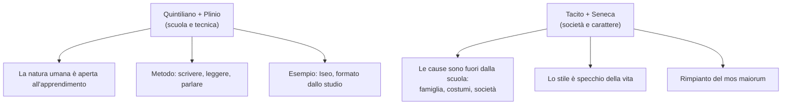

# Debate: l'oratoria si può insegnare?

!!! info "La domanda del debate"
    **L'oratoria si può insegnare e migliorare con l'esercizio, oppure è innata e dipende dalle condizioni sociali?**

    Due squadre si affrontano:

    - **Pro** (si può insegnare): **Quintiliano** e **Plinio il Giovane**
    - **Contro** (è innata / dipende dalla società): **Tacito** e **Seneca**

## I quattro testi in breve

### Quintiliano, *Institutio Oratoria* I, 1-3 — squadra PRO

Quintiliano sostiene che **la capacità di imparare è naturale in quasi tutti gli uomini**: i ragazzi "duri di comprendonio" sono rari, come i corpi mostruosi. Se le speranze dell'infanzia svaniscono, la colpa non è della natura ma della **negligenza degli educatori**.

Idee chiave:

- L'uomo è fatto per pensare, come gli uccelli per volare e i cavalli per correre
- Anche chi è meno dotato, con l'**applicazione** (*diligentia*) raggiunge qualche risultato
- L'educazione inizia dalla culla: persino la **nutrice** deve parlare bene, perché le prime impressioni restano per sempre (come il sapore nei recipienti nuovi)
- Anche i **genitori** devono essere colti: cita Cornelia (madre dei Gracchi), Lelia, Ortensia

### Quintiliano, *Institutio Oratoria* X, 1-4 — squadra PRO

Qui Quintiliano spiega che all'oratore servono **tre esercizi combinati**: scrivere, leggere, parlare. Nessuno dei tre basta da solo.

- Senza **scrittura**, l'eloquenza resta fragile
- Senza **lettura**, manca il modello
- Senza **parola**, tutto il sapere rimane chiuso come un tesoro sotto chiave
- L'oratore è come l'**atleta**: dopo aver imparato le regole, deve allenarsi scegliendo gli esercizi giusti

### Plinio il Giovane, *Epistulae* II, 3 — squadra PRO

Plinio descrive **Iseo**, oratore famoso, come esempio vivente del fatto che l'eloquenza si costruisce con lo studio.

- Parla improvvisando, ma sembra che abbia preparato tutto
- Ha una memoria prodigiosa, uno stile elegante, raffinato, attico
- "Si formò queste qualità con lo **studio** e l'**esercizio**": giorno e notte non fa altro
- Vivere lontano dal foro, in una "scuola" fatta di cause finte, lo rende più sincero e meno malizioso di chi combatte nei processi reali

### Tacito, *Dialogus de Oratoribus* 28-29 — squadra CONTRO

Tacito denuncia la **decadenza** dell'oratoria, causata da:

- pigrizia della gioventù
- negligenza dei genitori
- ignoranza degli insegnanti
- abbandono del *mos maiorum* (il modo di fare degli antenati)

Il confronto col passato:

| Una volta (*mos maiorum*) | Oggi (decadenza) |
|---------------------------|------------------|
| Il figlio cresciuto in grembo alla **madre casta** (Cornelia, Aurelia, Azia) | Affidato a un'**ancella greca** e a schiavi scadenti |
| Parente anziana di moralità comprovata sorveglia studi e giochi | Nessuno controlla che si dice o si fa davanti al bambino |
| Natura pura e integra, subito votata a un'arte | Animo corrotto da **istrioni, gladiatori, cavalli** fin dal ventre materno |
| Precettori severi | Precettori che **adulano** invece di correggere |

Tesi: l'oratoria non decade per mancanza di talento, ma perché le **condizioni sociali e familiari** non permettono più di coltivarlo.

### Seneca, *Epistula ad Lucilium* CXIV — squadra CONTRO

Seneca risponde alla domanda: perché in certe epoche il linguaggio si corrompe?

Il principio fondamentale:

!!! quote "Talis hominibus fuit oratio qualis vita"
    "Tale fu per gli uomini il linguaggio, quale fu la vita."

    Il modo di parlare **riflette** il modo di vivere di una società.

- Se l'animo è sano e temperante, anche l'ingegno è "asciutto e sobrio"
- Se l'animo è molle, lo stile si gonfia, si spezza, cerca metafore ardite
- La **prosperità** porta dissolutezza: prima cura eccessiva del corpo, poi delle suppellettili, poi delle case di marmo, poi cene stravaganti... poi il linguaggio corrotto
- Lo stile corrotto (frasi tronche, obsolete, metafore insistenti) è **sintomo** di una società malata

Tesi: lo stile e l'eloquenza dipendono dal **contesto morale** della società, non si insegnano a scuola.

## Argomenti per la squadra PRO

!!! tip "Come impostare il tuo intervento"
    Idea di fondo: **l'oratoria è una tecnica, non un dono divino.** Come ogni tecnica, richiede metodo, costanza e maestri. Anche chi ha poco talento, con l'applicazione, raggiunge risultati.

### 1. La natura dell'uomo è l'apprendimento

Quintiliano ribalta la scusa "non ho talento": così come gli uccelli sono fatti per volare, **l'uomo è fatto per imparare**. I ragazzi incapaci esistono, ma sono una rarità (come i corpi mostruosi). Se un ragazzo non impara, la colpa è quasi sempre dell'educatore, non della natura.

### 2. La tecnica si costruisce con tre esercizi combinati

| Esercizio | Cosa dà |
|-----------|---------|
| **Scrittura** | Solidità e robustezza |
| **Lettura** | Modelli da imitare |
| **Parola** | L'arte in azione |

Nessuno nasce oratore. L'oratore è come l'**atleta**: imparate le regole, deve allenarsi.

### 3. Esempio vivente: Iseo (Plinio)

Iseo parla improvvisando, ma sembra aver preparato ogni virgola. Come ci è riuscito? "Si formò queste qualità con lo **studio e l'esercizio**, poiché giorno e notte non fa altro". La sua eccellenza è **provata dal metodo**, non da un dono misterioso.

### 4. Anche l'ambiente si può costruire

Se Tacito dice che servono condizioni sociali giuste, Quintiliano risponde: benissimo, **creiamole**. Scegliamo nutrici che parlino bene, genitori colti, maestri severi. Cornelia, madre dei Gracchi, non era un caso di fortuna: era una donna che **volle** costruire quei figli.

### 5. Contrattacco a Seneca

Seneca dice che lo stile riflette la società. Vero, ma questo non è un argomento contro l'insegnamento: è un argomento **a favore della responsabilità educativa**. Se la società corrompe il linguaggio, la scuola è l'unico argine. Rinunciare a insegnare significa accettare la decadenza.

## Argomenti per la squadra CONTRO

!!! tip "Come impostare il tuo intervento"
    Idea di fondo: **non basta la tecnica.** L'oratoria autentica nasce da un animo forte e da una società sana. Puoi insegnare le regole, ma non il carattere e il contesto che producono un vero oratore.

### 1. Gli antichi, senza scuole di retorica, erano migliori

Tacito fa notare che Cornelia, Aurelia, Azia formarono Gracchi, Cesare e Augusto **senza precettori professionisti**. La grandezza oratoria romana nasce in casa, nel *mos maiorum*, non nelle scuole.

### 2. Le scuole moderne non producono più oratori

Eppure oggi i precettori esistono, le scuole di retorica ci sono, i trattati circolano... e l'eloquenza è **decaduta**. Se la tecnica bastasse, con più scuole avremmo più Cicerone. Invece abbiamo meno. Quindi la tecnica non basta.

### 3. Il linguaggio è lo specchio della vita (Seneca)

*Talis hominibus fuit oratio qualis vita*. Se la società è dissoluta, anche il linguaggio si corrompe: metafore ardite, frasi tronche, stile gonfio. Non è un problema che si risolve con un corso: è un problema morale e collettivo.

### 4. L'educazione vera è prima dei maestri

Tacito è chiarissimo: il danno avviene **prima** della scuola. Il bambino cresciuto tra chiacchiere di schiavi, passione per gladiatori e istrioni, è già perduto. Nessun precettore recupererà un animo così formato.

### 5. Contrattacco a Quintiliano

Quintiliano stesso ammette che tutto dipende dalla **nutrice** e dai **genitori**: cioè dal contesto familiare e sociale, non dalla tecnica. Se anche lui riconosce che l'educazione inizia nel grembo materno, sta in realtà dando ragione a noi: senza un ambiente giusto, nessuna tecnica salva.

## Confronto tra i quattro autori

### Tabella di sintesi

| Autore | Opera | Tesi | Parola chiave |
|--------|-------|------|---------------|
| **Quintiliano** | *Institutio Oratoria* I, 1-3 | Tutti possono imparare, basta la *diligentia* | **Natura + educazione** |
| **Quintiliano** | *Institutio Oratoria* X, 1-4 | Scrivere, leggere, parlare: i tre esercizi dell'oratore | **Esercizio combinato** |
| **Plinio il Giovane** | *Epistulae* II, 3 | Iseo mostra che lo studio continuo produce l'eccellenza | **Studio e fatica** |
| **Tacito** | *Dialogus de Oratoribus* 28-29 | L'oratoria decade per le cattive condizioni sociali e familiari | ***Mos maiorum*** perduto |
| **Seneca** | *Epistula* CXIV | Lo stile riflette la morale della società | **Oratio = vita** |

### Le due visioni a confronto

### Il punto in cui si toccano

!!! abstract "Attenzione: non sono poi così lontani"
    Quintiliano dice che l'educazione inizia **dalla nutrice**, cioè dal contesto familiare. Tacito dice che l'educazione decade perché **il contesto familiare** è peggiorato. I due parlano della stessa cosa: **l'ambiente educativo**.

    La differenza è di **tono**:

    - Quintiliano è **ottimista e pedagogico**: "costruiamo l'ambiente giusto, e l'oratoria si può insegnare"
    - Tacito è **pessimista e moralista**: "l'ambiente giusto non c'è più, quindi l'oratoria è decaduta"
    - Seneca è **etico e radicale**: "il problema non è la scuola ma l'anima della società"

    Plinio si inserisce come **prova pratica** della tesi di Quintiliano: Iseo è la dimostrazione che, quando l'ambiente e lo studio si combinano, l'eccellenza oratoria è ancora possibile.

### Contesto storico

- **Quintiliano** scrive sotto Domiziano (I sec. d.C.): è maestro di retorica a Roma, per lui l'insegnamento è la missione di una vita
- **Plinio il Giovane** è suo allievo: l'elogio di Iseo è un'idea quintilianea applicata
- **Tacito** scrive il *Dialogus* all'inizio del II sec.: guarda indietro con nostalgia al tempo della libertà repubblicana, quando l'oratoria era potere politico
- **Seneca** (I sec. d.C.) scrive a Lucilio in chiave filosofico-stoica: per lui ogni aspetto della vita (cibo, vestiti, linguaggio) dipende dalla salute morale dell'animo

## Checklist

- [x] Riassunto dei quattro testi
- [x] Argomenti per la squadra pro
- [x] Argomenti per la squadra contro
- [x] Tabella di confronto tra gli autori
- [x] Diagramma delle due visioni
- [ ] Memorizzare le citazioni chiave (soprattutto *talis hominibus fuit oratio qualis vita*)
- [ ] Preparare una frase di apertura e una di chiusura per il tuo intervento

## Collegamenti

- **Italiano**: il tema della decadenza linguistica ritorna nel Novecento con Pirandello (la parola che non dice più la verità) e Montale (il "male di vivere" come incapacità di nominare le cose)
- **Storia**: il passaggio dalla Repubblica all'Impero spegne l'oratoria politica — tema centrale del *Dialogus* di Tacito
- **Filosofia**: Seneca è stoico, quindi collega lingua, morale e natura in un unico sistema; il parallelo è con il rapporto tra *ingegno* e *animo* tipico dell'etica antica
- **Ed. civica**: il dibattito *nature vs nurture* (innato contro appreso) è ancora centrale nella pedagogia moderna
- **Inglese**: T. S. Eliot nel Novecento lamenta la crisi del linguaggio poetico in termini sorprendentemente vicini a Seneca — quando la società si frantuma, il linguaggio si frantuma
