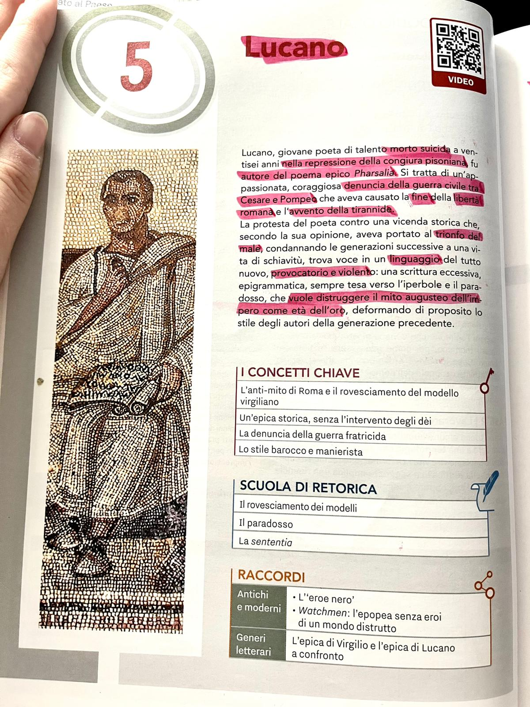
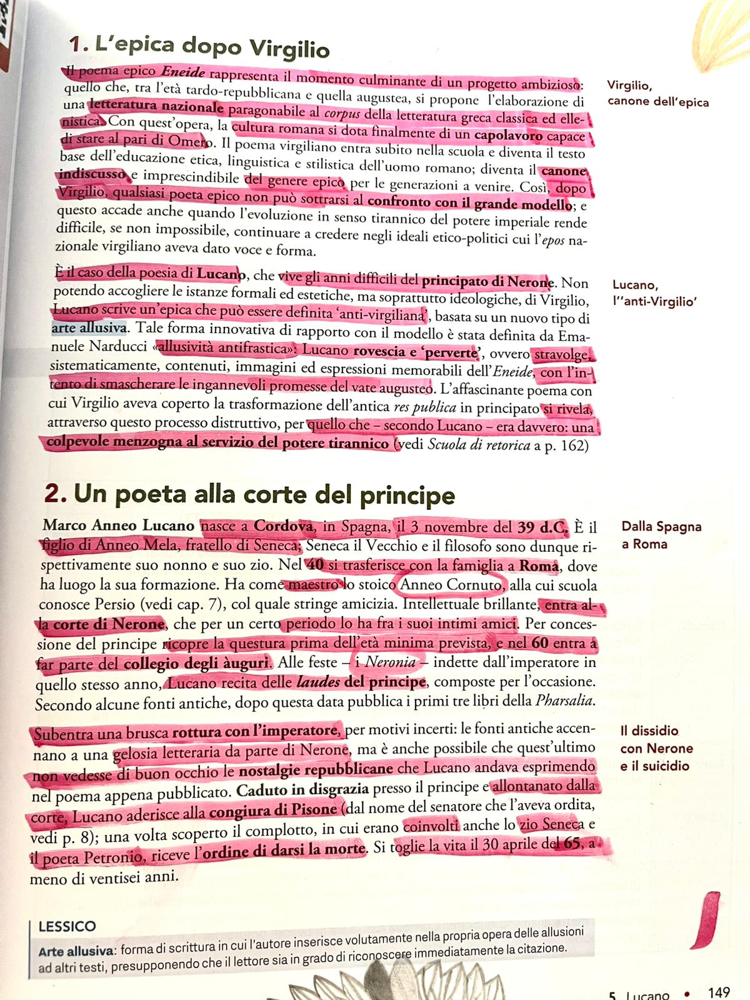
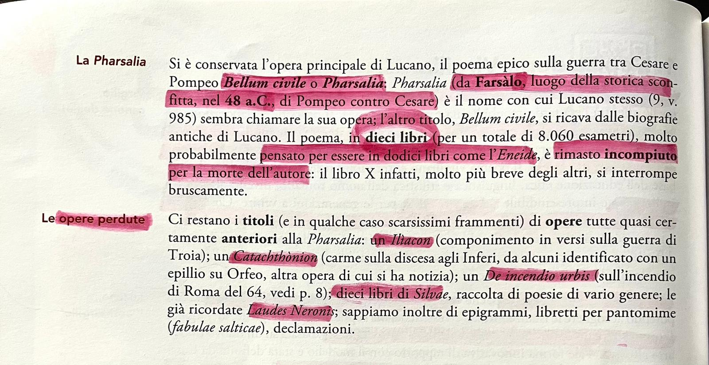

# Lucano

## Foto dal libro

Di seguito trovi le foto degli appunti su Lucano dal libro di testo.

---

## Riassunto

### Chi e Lucano

Marco Anneo Lucano nasce a **Cordova** (Spagna) nel **39 d.C.** ed e nipote del filosofo **Seneca**. Viene portato a Roma da piccolo e riceve un'ottima formazione retorica e filosofica. Entra nel circolo letterario dell'imperatore **Nerone**, che inizialmente lo apprezza e lo ammette tra i suoi amici piu stretti. Lucano pubblica i primi libri della *Pharsalia* con grande successo, ma il rapporto con Nerone si deteriora rapidamente: secondo le fonti, l'imperatore — geloso del suo talento poetico — gli vieta di pubblicare e di tenere cause in tribunale. Lucano aderisce allora alla **congiura dei Pisoni** (65 d.C.), un complotto per eliminare Nerone. Scoperta la congiura, viene condannato a morte e si toglie la vita a soli **26 anni**, seguendo lo stesso destino tragico dello zio Seneca.

### L'epica dopo Virgilio

Dopo l'*Eneide* di Virgilio, nessun poeta epico poteva semplicemente imitare il modello virgiliano: bisognava confrontarsi con esso e **rovesciarlo**. Lucano fa esattamente questo. Mentre Virgilio celebrava la grandezza di Roma e la provvidenza divina, Lucano racconta la **guerra civile** come una catastrofe e una fine, non un inizio glorioso. Il suo e un **anti-modello**: Roma non nasce, ma si distrugge. Lo stile e volutamente **barocco e manierista**, carico di paradossi, sentenze taglienti e retorica estrema. Si tratta di un'epica storica che rinuncia completamente all'**apparato mitologico**: non ci sono dei che intervengono nelle vicende umane, solo uomini e il loro destino.

### La Pharsalia (Bellum civile)

L'opera principale di Lucano e il ***Bellum civile***, piu noto come ***Pharsalia*** dal nome della battaglia di **Farsalo** (48 a.C.), lo scontro decisivo tra **Cesare** e **Pompeo**. Il poema e composto da **10 libri** in esametri (circa 8.060 versi totali), ma e rimasto **incompiuto**: il libro X si interrompe bruscamente, probabilmente a causa della morte prematura dell'autore.

I concetti chiave dell'opera sono:

- **L'anti-mito di Roma**: Lucano rovescia il mito della fondazione; Roma non nasce dalla guerra, ma si autodistrugge
- **Epica senza dei**: la narrazione e puramente storica, senza intervento divino
- **La denuncia della guerra fratricida**: la guerra civile e presentata come il peggiore dei mali
- **Il paradosso**: Lucano usa costantemente la figura retorica del paradosso per esprimere l'assurdita della guerra civile

### Le opere perdute

Oltre alla *Pharsalia*, di Lucano ci restano solo **scarsissimi frammenti** di altre opere: un *Catachthonion* (carme sulla discesa agli Inferi), un componimento sull'incendio di Roma del 64 d.C., le *Silvae* (raccolta di poesie varie), epigrammi, libretti per pantomime e declamazioni.

---

## Checklist

- [x] Vita di Lucano e rapporto con Nerone
- [x] L'epica dopo Virgilio e il rovesciamento del modello
- [x] La Pharsalia: trama, struttura, temi
- [x] Le opere perdute
- [ ] Analisi di brani dalla Pharsalia (da aggiungere)

## Collegamenti

- **Italiano**: il tema dell'intellettuale contro il potere si ritrova in Dante (esilio), Foscolo e nel Novecento con Primo Levi
- **Storia**: la congiura dei Pisoni e il rapporto tra intellettuali e regime si collega al tema degli intellettuali sotto il fascismo
- **Filosofia**: Lucano, come lo zio Seneca, e influenzato dallo stoicismo; il tema del destino e della liberta richiama la filosofia stoica
- **Latino**: confronto diretto con Seneca (zio e nipote, stessa fine, stesso conflitto con Nerone)
