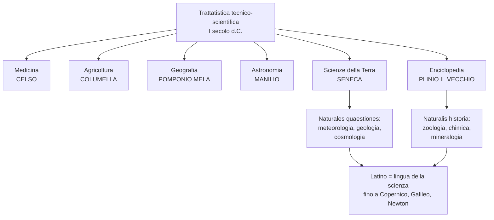

# La trattatistica tecnico-scientifica del I secolo d.C.

Nel I secolo d.C. Roma produce una ricca **letteratura tecnica e scientifica** in latino. A differenza dei Greci, che costruivano grandi sistemi teorici, i Romani hanno un approccio **pragmatico**: vogliono risolvere problemi concreti — come si cura un malato, come si innesta una pianta, come ci si orienta in mare. Anche quando affrontano questioni più speculative (cosmologia, meteorologia), restano ancorati all'utilità pratica.

!!! info "Perché studiare questi autori"
    - Mostrano un lato di Roma diverso dalla grande letteratura: non poesia o retorica, ma **sapere applicato**
    - Il latino di questi testi diventerà per **oltre 1500 anni** la lingua della scienza europea (fino a Copernico, Galileo, Newton)
    - Molti termini italiani della medicina, botanica, astronomia vengono da qui

## Quadro d'insieme degli autori

| Autore | Opera | Materia | Contributo |
|--------|-------|---------|------------|
| **Celso** | *De medicina* | Medicina | Enciclopedia medica, descrive operazioni chirurgiche |
| **Columella** | *De re rustica* | Agricoltura | Tecniche di coltivazione, tipi di innesto |
| **Pomponio Mela** | *Chorographia* | Geografia | Prima opera geografica in latino |
| **Manilio** | *Astronomica* | Astronomia | Poema didascalico sulle stelle |
| **Plinio il Vecchio** | *Naturalis historia* | Enciclopedia | Summa di tutto il sapere antico |
| **Seneca** | *Naturales quaestiones* | Scienze della Terra | Meteorologia, geologia, astronomia |

## Celso: la medicina

Aulo Cornelio Celso scrive il *De medicina* (età di Tiberio, I secolo d.C.): un'opera enciclopedica in 8 libri che descrive malattie, cure e perfino operazioni chirurgiche complesse (amputazioni, estrazione di calcoli, asportazione di ernie, operazioni al cranio).

!!! example "Identikit del perfetto chirurgo (De medicina, 7,1,4)"
    Il chirurgo — dice Celso — deve essere:

    - **Giovane** o vicino alla giovinezza
    - Di **mano ferma**, che non trema mai
    - Abile **sia con la destra sia con la sinistra**
    - Di **vista acuta e chiara**
    - **Coraggioso e pietoso**: vuole guarire il malato, ma senza lasciarsi commuovere dalle sue urla (*clamor*)
    - Capace di operare **come se i lamenti altrui non lo toccassero**

!!! note "Parole che vengono da qui"
    - ***chirurgus*** = dal greco *cheír* (mano) + *érgon* (opera) → «colui che lavora con le mani»
    - Moltissimi termini medici italiani (amputazione, ernia, sutura, calcolo...) vengono dal latino di Celso

## Columella: l'agricoltura

Lucio Giunio Moderato Columella scrive il *De re rustica* (I secolo d.C.), manuale completo di agricoltura in 12 libri. È un testo pratico: spiega come scegliere il terreno, piantare, potare, allevare.

!!! example "I tre tipi di innesto (De re rustica, 5,11)"
    Columella descrive tre tecniche ancora oggi usate:

    1. **A spacco**: si taglia il tronco dell'albero e si inserisce la *marza* (ramoscello)
    2. **A corona**: si fa scivolare la talea tra la corteccia e il legno
    3. **A gemma** (*inoculatio*): si inserisce solo una gemma sotto la corteccia → da qui il verbo italiano **«inoculare»** in medicina!

## Pomponio Mela: la geografia

Primo autore latino a scrivere un trattato geografico (*Chorographia*, 40 d.C. ca.). Descrive il mondo conosciuto ai Romani.

!!! abstract "Come si divide il mondo (Chorographia, 1,4)"
    La Terra è sospesa al centro dell'universo, circondata dal mare, divisa in:

    - **Due emisferi** (*hemisphaeria*) da Oriente a Occidente
    - **Cinque fasce** orizzontali (*zonae*):
        - 1 equatoriale: inabitabile per il caldo
        - 2 polari: inabitabili per il freddo
        - 2 temperate: abitabili
    
    Nella zona temperata meridionale vivrebbero gli ***Antichthones*** («quelli di fronte», gli antipodi) — popoli misteriosi che nessuno ha mai raggiunto perché la zona torrida è invalicabile.

!!! tip "Curiosità"
    Sant'Agostino e i primi cristiani **negarono** l'esistenza degli Antipodi: se tutti gli uomini discendono da Adamo, e l'Eden era a nord della zona torrida, nessuno poteva aver raggiunto l'emisfero sud.

## Manilio: l'astronomia

Marco Manilio scrive gli *Astronomica*, poema didascalico in **esametri** (età di Augusto/Tiberio) sull'astronomia e l'astrologia — nell'antichità le due cose non sono distinte.

!!! example "Come trovare il Nord in mare (Astronomica, 1, 294-304)"
    Manilio racconta che i marinai si orientano con due costellazioni:

    - **I Greci** usano l'**Orsa Maggiore** (*Helice*), più grande e luminosa
    - **I Fenici (Punici)** preferiscono l'**Orsa Minore** (*Cynosura*): più piccola, ma più vicina al polo e quindi più precisa

    Le due costellazioni — dice — sono disposte «coda contro muso», come se si inseguissero.

!!! note "Curiosità scientifica"
    La **Stella Polare** che conosciamo oggi non esisteva come riferimento al tempo di Manilio: a causa della **precessione degli equinozi**, il cielo ruota lentamente nei millenni e 2000 anni fa il polo celeste era in un punto diverso.

## Plinio il Vecchio: l'enciclopedia del sapere

Gaio Plinio Secondo (23-79 d.C.) scrive la ***Naturalis historia***, la più grande **enciclopedia** dell'antichità: 37 libri che raccolgono tutto il sapere scientifico esistente — zoologia, botanica, mineralogia, medicina, arte. Morì durante l'eruzione del Vesuvio (79 d.C.) mentre studiava il fenomeno da vicino.

### Zoologia: come respirano gli animali acquatici (NH 9,6,16-17)

Plinio osserva che **le balene hanno gli sfiatatoi** sulla fronte e soffiano l'acqua verso l'alto: capisce quindi che hanno i **polmoni** e respirano. Si chiede se anche altri pesci respirino.

!!! warning "Quello che sbaglia"
    Plinio non capisce la differenza tra **cetacei** (mammiferi che respirano con polmoni) e **pesci veri** (che respirano con le branchie). Ma intuisce giustamente che nell'acqua deve esserci dell'ossigeno disciolto.

### Chimica: come si ottiene il sale (NH 31,39,73)

Il sale si forma in due modi:

- Per **condensazione** (quando l'acqua si raccoglie)
- Per **essiccamento** (evaporazione al sole)

Plinio descrive le saline del lago di Taranto e della Sicilia (Gela), dove il sole estivo fa evaporare l'acqua lasciando il sale. È una delle prime descrizioni tecniche della **precipitazione chimica**.

### Mineralogia e ottica: la pietra-arcobaleno (NH 37,52,136-137)

Plinio descrive una pietra esagonale del Mar Rosso, chiamata *iris*, che colpita dal sole proietta sulle pareti **i colori dell'arcobaleno**.

!!! abstract "Anticipa la rifrazione della luce"
    È la descrizione, 1600 anni prima di Newton, del fenomeno per cui un **prisma di cristallo scompone la luce nei colori dell'iride**. Plinio non sa spiegarlo, ma l'osservazione è corretta: sarà **Isaac Newton** (1670-1672) a dimostrare che i colori sono una proprietà della luce.

## Seneca: le *Naturales quaestiones*

Lucio Anneo Seneca, negli ultimi anni di vita, scrive le ***Naturales quaestiones*** (7 libri, 62-64 d.C.): un trattato di **meteorologia** (fenomeni «tra cielo e terra») e **geologia** (fenomeni della superficie terrestre). Ogni libro unisce scienza, filosofia stoica e riflessione morale.

> Per la vita e il pensiero generale di Seneca, vedi la pagina [Seneca](seneca.md).

### La Terra come organismo vivente (NQ 3,15,1)

!!! quote "Testo chiave"
    Seneca sostiene che la Terra funziona come il **corpo umano**: così come in noi scorrono **vene** (sangue) e **arterie** (*spiritus*, aria), anche nella Terra ci sono canali per l'acqua e canali per l'aria. Gli antichi romani chiamavano infatti *venas* (vene) i corsi d'acqua sotterranei.

È un'**analogia organicista**: la natura (*natura*, in greco *physis*) governa tutto.

### Le trombe d'aria (NQ 5,13,1-3)

Seneca spiega il **turbo** (turbine, da cui l'italiano «turbine»): un vento che incontra un ostacolo (roccia, montagna), si avvolge su se stesso e forma un **vortice rotante**.

!!! warning "Cosa sbaglia"
    Seneca fa un'analogia con i **mulinelli dell'acqua** nei fiumi. È intelligente ma scorretta: i tornado si formano per un meccanismo diverso (aria calda umida schiacciata sotto aria fredda pesante, che crea un cilindro rotante).

### I terremoti (NQ 6,21,2)

Seneca riporta la classificazione di **Posidonio** e aggiunge un terzo tipo:

1. **Moto sussultorio** (*succussio*): verticale, la terra salta
2. **Moto ondulatorio** (*inclinatio*): orizzontale, come una nave
3. **Tremore armonico** (*tremor*): vibrazione pura, aggiunta da Seneca

!!! note "Oggi sappiamo che..."
    Tutti i terremoti producono sia onde verticali (P) sia orizzontali (S): la distinzione antica è imprecisa, ma Seneca aveva intuito giustamente che il moto **ondulatorio** è il più distruttivo per gli edifici alti.

### Geocentrismo o eliocentrismo? (NQ 7,2,3)

!!! abstract "Una domanda sorprendente"
    Seneca si chiede: **è il cielo a ruotare intorno a una Terra immobile, o è la Terra a ruotare nello spazio?**

    Non dà una risposta definitiva, ma riconosce che si tratta di «una questione degna di essere esaminata». **Quindici secoli prima di Copernico**, lascia aperta la possibilità eliocentrica.

Non era il primo: già **Filolao di Crotone** (V sec. a.C.) e soprattutto **Aristarco di Samo** (III sec. a.C.) avevano proposto l'eliocentrismo, ma la teoria geocentrica di Aristotele/Tolomeo prevalse fino al XVI secolo.

## La fortuna: il latino lingua della scienza moderna

Il latino di Celso, Plinio e Seneca resta la **lingua internazionale della scienza** per tutto il Medioevo e il Rinascimento, fino al Seicento inoltrato.

!!! example "Due esempi decisivi"
    - **Copernico**, *De revolutionibus orbium coelestium* (1543): il libro che riapre l'ipotesi eliocentrica di Seneca e Aristarco è scritto **in latino**
    - **Regimen Sanitatis Salernitanum** (XII secolo): norme dietetiche in esametri latini, testo medico più diffuso del Medioevo. Esempio: «*Si dolor est capitis ex potu, lympha bibatur*» = se il mal di testa viene da una sbornia, bevi acqua

Anche **Newton** (*Philosophiae naturalis principia mathematica*, 1687) e **Gauss** scrivono ancora in latino. Solo nel Settecento le lingue nazionali (inglese, francese, tedesco) prendono il sopravvento.

## Approfondimento: la *Germania* di Tacito e l'uso politico dei classici

Un caso diverso ma interessante: la ***Germania*** di **Tacito** (98 d.C.) — piccolo trattato etnografico in cui lo storico descrive i popoli germanici contrapponendo la loro **semplicità e virtù** alla **decadenza** di Roma imperiale.

!!! quote "Dalla recensione «Tacito fa paura» (Michele Magno, *Il Foglio*, 2021)"
    - Nel **Rinascimento** la *Germania* viene riscoperta e diventa testo fondativo dell'identità nazionale tedesca
    - Dagli anni '20 del Novecento **Heinrich Himmler** la usa come strumento di propaganda: le «virtù germaniche» descritte da Tacito diventano base «scientifica» per le teorie razziali naziste
    - **Hitler** tenta di impossessarsi del manoscritto originale (il *Codex Aesinas*), conservato in Italia

!!! danger "La lezione"
    Un testo antico, nato come **critica moralistica a Roma**, viene letto 1800 anni dopo come **manifesto razziale**. Mostra come le idee — dice Magno — «si diffondono come virus» attraverso i secoli, e come i classici possono essere **strumentalizzati politicamente**.

    Link alla recensione: [quodlibet.it/recensione/4650](https://www.quodlibet.it/recensione/4650)

## Schema di sintesi

## Checklist

- [x] Quadro generale della trattatistica scientifica del I secolo
- [x] Celso — medicina
- [x] Columella — agricoltura
- [x] Pomponio Mela — geografia
- [x] Manilio — astronomia
- [x] Plinio il Vecchio — *Naturalis historia*
- [x] Seneca — *Naturales quaestiones*
- [x] Fortuna del latino scientifico fino a Copernico
- [x] Tacito *Germania* e uso politico dei classici
- [ ] Ripassare etimologie dei termini scientifici (chirurgus, inoculatio, turbo, crystallus...)
- [ ] Collegare alle pagine di scienze (tettonica, atmosfera) e di storia (nazismo)

## Collegamenti

- **Latino → [Seneca](seneca.md)**: le *Naturales quaestiones* sono l'ultima opera di Seneca, scritta negli stessi anni delle *Epistulae ad Lucilium*. Stesso sguardo stoico: la natura è ordine razionale, studiarla è un atto filosofico.
- **Scienze della Terra → [Tettonica](../scienze/scienze-della-terra/tettonica.md)**: la classificazione antica dei terremoti (sussultori/ondulatori) è l'antenata della moderna sismologia. Oggi sappiamo che le onde P e S si propagano diversamente.
- **Scienze della Terra → [Atmosfera](../scienze/scienze-della-terra/atmosfera.md)**: le spiegazioni di Seneca su tornado, fulmini, venti sono un primo tentativo di **meteorologia scientifica**.
- **Fisica → [Onde elettromagnetiche](../fisica/onde/onde-em.md) / [Ottica](../fisica/onde/ottica.md)**: la «pietra-arcobaleno» di Plinio descrive la **dispersione della luce** che Newton spiegherà 1600 anni dopo.
- **Matematica/Fisica → astronomia**: il dibattito geocentrismo/eliocentrismo lasciato aperto da Seneca verrà risolto da Copernico, Keplero, Galileo, Newton.
- **Italiano → letteratura scientifica**: la tradizione del trattato didascalico continua fino a **Galileo** (*Dialogo sopra i due massimi sistemi*, 1632) e **Primo Levi** (*Il sistema periodico*).
- **Storia → [Nazismo](../storia/ascesa-del-nazismo.md)**: la *Germania* di Tacito usata dal Terzo Reich come base «scientifica» per le teorie razziali. Himmler, le SS e il mito ariano.
- **Filosofia → Popper / Positivismo**: Seneca anticipa un metodo proto-scientifico (osservare, confrontare, dubitare). Ma usa ancora analogie poetiche (la Terra come corpo): la **scienza moderna** nasce quando si abbandonano le analogie per il metodo sperimentale (Galileo).
- **Educazione civica → uso politico della cultura**: il caso della *Germania* di Tacito mostra come un testo classico possa essere **strumentalizzato** da un regime. Tema attualissimo (fake news, revisionismo storico).
