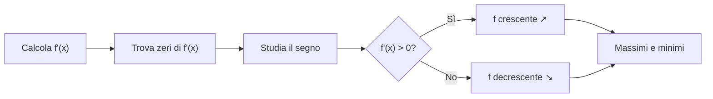

# Derivate

## Definizione

La derivata di una funzione \( f(x) \) nel punto \( x_0 \) è definita come il limite del rapporto incrementale:

\[
f'(x_0) = \lim_{h \to 0} \frac{f(x_0 + h) - f(x_0)}{h}
\]

!!! note "Interpretazione geometrica"
    La derivata in un punto rappresenta il **coefficiente angolare della retta tangente** al grafico della funzione in quel punto.

## Derivate fondamentali

| Funzione | Derivata |
|----------|----------|
| \( k \) (costante) | \( 0 \) |
| \( x^n \) | \( n x^{n-1} \) |
| \( e^x \) | \( e^x \) |
| \( \ln x \) | \( \frac{1}{x} \) |
| \( \sin x \) | \( \cos x \) |
| \( \cos x \) | \( -\sin x \) |

## Regole di derivazione

### Somma e differenza

\[
[f(x) \pm g(x)]' = f'(x) \pm g'(x)
\]

### Prodotto

\[
[f(x) \cdot g(x)]' = f'(x) \cdot g(x) + f(x) \cdot g'(x)
\]

### Quoziente

\[
\left[\frac{f(x)}{g(x)}\right]' = \frac{f'(x) \cdot g(x) - f(x) \cdot g'(x)}{[g(x)]^2}
\]

### Funzione composta (chain rule)

\[
[f(g(x))]' = f'(g(x)) \cdot g'(x)
\]

## Esempio svolto

Calcolare la derivata di \( f(x) = x^3 - 2x^2 + 5x - 1 \):

\[
f'(x) = 3x^2 - 4x + 5
\]

!!! example "Verifica"
    Per \( x = 1 \): \( f'(1) = 3 - 4 + 5 = 4 \)

    La retta tangente in \( x = 1 \) ha equazione \( y = 4x - 1 \).

## Applicazioni: studio del segno della derivata

## Teoremi fondamentali

!!! abstract "Teorema di Fermat"
    Se \( f \) ha un estremo relativo in \( x_0 \) e \( f \) è derivabile in \( x_0 \), allora \( f'(x_0) = 0 \).

!!! abstract "Teorema di Rolle"
    Se \( f \) è continua in \([a, b]\), derivabile in \((a, b)\) e \( f(a) = f(b) \), allora esiste \( c \in (a, b) \) tale che \( f'(c) = 0 \).

!!! abstract "Teorema di Lagrange"
    Se \( f \) è continua in \([a, b]\) e derivabile in \((a, b)\), allora esiste \( c \in (a, b) \) tale che:

    \[
    f'(c) = \frac{f(b) - f(a)}{b - a}
    \]

## Checklist

- [x] Definizione e interpretazione geometrica
- [x] Derivate fondamentali
- [x] Regole di derivazione
- [x] Esempio svolto
- [x] Applicazioni (studio del segno)
- [x] Teoremi (Fermat, Rolle, Lagrange)
- [ ] Derivate di ordine superiore
- [ ] Punti di flesso

## Collegamenti

- **Fisica**: le derivate sono fondamentali per velocità istantanea e accelerazione → vedi [Campo elettrico](../../fisica/elettromagnetismo/campo-elettrico.md)
- **Filosofia**: il concetto di limite e infinitesimo → Hegel e la dialettica dell'infinito
- **Storia**: Newton e Leibniz, la nascita del calcolo nel XVII secolo
