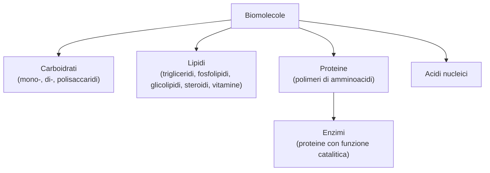

# B1 — Le biomolecole

## Introduzione

Le biomolecole sono i composti organici che costituiscono gli esseri viventi. Si dividono in quattro grandi categorie — carboidrati, lipidi, proteine e acidi nucleici — ognuna con funzioni biologiche precise. Molte biomolecole sono polimeri, cioè lunghe catene formate dall'unione di tante unità più piccole dette monomeri: per esempio i polisaccaridi sono catene di monosaccaridi e le proteine sono catene di amminoacidi.

## I carboidrati

I carboidrati, detti anche zuccheri o glicidi, sono composti organici formati da carbonio, idrogeno e ossigeno, caratterizzati dal contenere due o più gruppi ossidrile $-\text{OH}$ insieme a un gruppo aldeidico $-\text{CHO}$ o chetonico $\text{C=O}$. Sono le biomolecole più diffuse e hanno una grande importanza energetica. In base al numero di unità che contengono si dividono in tre categorie:

- monosaccaridi: sono i monomeri, cioè le singole unità di base, che non si possono scomporre in zuccheri più semplici;
- oligosaccaridi: sono formati da poche unità unite; i più semplici e importanti sono i disaccaridi, formati da due unità;
- polisaccaridi: sono lunghe catene di moltissimi monosaccaridi.

I carboidrati più complessi si formano unendo i monosaccaridi con una reazione di condensazione, nella quale, ogni volta che due unità si legano, viene eliminata una molecola d'acqua.

### I monosaccaridi

I monosaccaridi sono gli zuccheri semplici e si classificano in due modi: in base al gruppo funzionale si distinguono in aldosi, se contengono un gruppo aldeidico $-\text{CHO}$, e chetosi, se contengono un gruppo chetonico $\text{C=O}$; in base al numero di atomi di carbonio si distinguono in triosi (tre atomi), tetrosi (quattro), pentosi (cinque) ed esosi (sei).

I più importanti sono la gliceraldeide e il diidrossiacetone tra i triosi, il ribosio e il deossiribosio tra i pentosi (entrambi componenti degli acidi nucleici) e, tra gli esosi, il glucosio e il galattosio, che sono aldosi, e il fruttosio, che è un chetoso; questi tre hanno la stessa formula $C_6H_{12}O_6$ ma struttura diversa, e sono perciò isomeri di struttura.

I monosaccaridi sono inoltre molecole chirali: tranne il diidrossiacetone, possiedono almeno uno stereocentro (un atomo di carbonio legato a quattro gruppi diversi) e quindi esistono come enantiomeri, cioè due molecole che sono l'una l'immagine speculare dell'altra ma non sovrapponibili.

Si rappresentano con le proiezioni di Fischer, e la loro configurazione si indica con le lettere D e L, a seconda che l'ossidrile dello stereocentro più lontano dal carbonile sia rivolto a destra (serie D, quella prevalente in natura) o a sinistra (serie L). Quando gli stereocentri sono più di uno compaiono i diastereoisomeri, stereoisomeri che non sono immagini speculari; un caso particolare sono gli epimeri, che differiscono per la configurazione di un solo stereocentro, come il glucosio e il galattosio, diversi solo al carbonio C-4.

In acqua, infine, i monosaccaridi non si trovano quasi mai nella forma lineare, ma soprattutto in una forma ciclica, ad anello. L'anello si forma perché il gruppo carbonile reagisce con un ossidrile della stessa molecola, creando un emiacetale, cioè un carbonio legato sia a un ossidrile sia a un ossigeno dell'anello: il glucosio forma un anello a sei atomi, il fruttosio a cinque, e per disegnarli si usano le proiezioni di Haworth.

Chiudendo l'anello, il carbonio dell'emiacetale diventa un nuovo stereocentro, detto carbonio anomerico, e dà origine a due forme dette anomeri α e β, che in acqua si trasformano continuamente l'una nell'altra passando per la forma aperta: questo fenomeno si chiama mutarotazione.

### Le reazioni dei monosaccaridi

Poiché contengono un gruppo aldeidico o chetonico, i monosaccaridi vanno incontro a due reazioni tipiche:

- riduzione: il gruppo carbonile si riduce e lo zucchero si trasforma in un polialcol, detto alditolo (per esempio dal glucosio si ottiene il sorbitolo, usato come dolcificante);
- ossidazione: il gruppo aldeidico si ossida e diventa un gruppo carbossile, formando un acido (acido aldonico); questa reazione serve anche a riconoscere gli zuccheri, perché con il reattivo di Tollens si forma uno specchio d'argento e con il reattivo di Fehling un precipitato rosso.

Uno zucchero capace di reagire in questo modo si dice zucchero riducente.

### I disaccaridi

I disaccaridi sono formati da due monosaccaridi uniti da un legame glicosidico. Questo legame nasce da una reazione di condensazione tra il carbonio anomerico (il gruppo emiacetalico) di un monosaccaride e un ossidrile dell'altro, con perdita di una molecola d'acqua; a seconda dell'anomero coinvolto è di tipo α o β. La reazione inversa è l'idrolisi: con l'acqua, e con l'aiuto di un acido o di un enzima, il disaccaride si riscinde nei due monosaccaridi di partenza.

I disaccaridi più importanti sono:

- il maltosio, formato da due molecole di glucosio unite da un legame α(1→4); deriva dall'amido ed è uno zucchero riducente, perché conserva un gruppo emiacetalico libero;
- il lattosio, formato da galattosio e glucosio uniti da un legame β(1→4); è lo zucchero del latte ed è riducente;
- il saccarosio, formato da glucosio e fruttosio uniti da un legame α,β(1→2); è il comune zucchero da tavola, ricavato dalla canna o dalla barbabietola, e non è riducente, perché entrambi i gruppi emiacetalici sono impegnati nel legame;
- il cellobiosio, formato da due molecole di glucosio unite da un legame β(1→4); è l'unità che costituisce la cellulosa ed è riducente.

### I polisaccaridi

I polisaccaridi sono lunghe catene di centinaia o migliaia di monosaccaridi uniti da legami glicosidici. Si dividono in omopolisaccaridi, formati da un solo tipo di monomero, ed eteropolisaccaridi, formati da due o più tipi; la catena può essere lineare o ramificata, e in genere i polisaccaridi non sono zuccheri riducenti. I principali sono:

- amido: è la principale riserva di energia delle piante; è un polimero di glucosio con legami α, ed è una miscela di amilosio (a catena lineare) e amilopectina (a catena ramificata);
- glicogeno: è la riserva di energia degli animali, conservata nel fegato e nei muscoli; è simile all'amilopectina, ma ancora più ramificato;
- cellulosa: ha funzione di sostegno e forma la parete delle cellule vegetali; è un polimero lineare di glucosio con legami β(1→4), con le catene unite da molti legami a idrogeno che la rendono resistente e insolubile; l'uomo non la digerisce, perché non possiede l'enzima per romperne i legami;
- chitina: ha funzione di sostegno e forma l'esoscheletro degli artropodi e la parete dei funghi; è fatta di N-acetilglucosammina;
- eteropolisaccaridi: per esempio l'acido ialuronico, presente nel liquido delle articolazioni e nell'occhio, e il peptidoglicano, che costituisce la parete delle cellule dei batteri.

## I lipidi

I lipidi sono una vasta classe di composti molto diversi tra loro, accomunati dall'essere insolubili in acqua e solubili nei solventi apolari; a differenza delle altre biomolecole, inoltre, non sono polimeri. Si dividono in due gruppi:

- lipidi saponificabili (o complessi): contengono acidi grassi e possono quindi essere scissi da una base (saponificazione); sono i trigliceridi, i fosfolipidi e i glicolipidi;
- lipidi non saponificabili (o semplici): non contengono acidi grassi; sono gli steroidi e le vitamine liposolubili.

Nel complesso i lipidi sono la principale riserva di energia dell'organismo (i trigliceridi), hanno un ruolo strutturale perché fosfolipidi e glicolipidi formano le membrane delle cellule, e svolgono altre funzioni come ormoni, isolante termico o vitamine.

### I trigliceridi

I trigliceridi (o triacilgliceroli) sono formati da una molecola di glicerolo, un alcol con tre gruppi ossidrile, e da tre molecole di acidi grassi, unite a esso per esterificazione, cioè una condensazione con perdita di tre molecole d'acqua e formazione di tre legami estere: per questo sono detti triesteri del glicerolo.

Gli acidi grassi sono acidi carbossilici con una lunga catena di carboni (da 4 a 36 atomi, in numero pari) e si distinguono in due tipi:

- saturi: hanno una catena diritta con soli legami semplici, si impacchettano bene tra loro e hanno un punto di fusione alto, perciò sono solidi a temperatura ambiente; si trovano soprattutto negli animali (i grassi);
- insaturi: hanno uno (monoinsaturi) o più (polinsaturi) doppi legami, che piegano la catena e ne impediscono l'impacchettamento, abbassando il punto di fusione; sono quindi liquidi a temperatura ambiente e si trovano soprattutto nei vegetali (gli oli).

Alcuni acidi grassi insaturi sono detti essenziali, come l'acido linoleico (ω-6) e l'acido linolenico (ω-3), perché l'organismo non riesce a produrli e devono essere assunti con la dieta. I trigliceridi sono la principale riserva di energia, formano il tessuto adiposo sottocutaneo, che isola dal freddo, e trasportano le vitamine liposolubili.

### Le reazioni dei trigliceridi

I trigliceridi vanno incontro a due reazioni importanti:

- idrogenazione: si aggiunge idrogeno ai doppi legami degli acidi grassi insaturi, con l'aiuto di un catalizzatore metallico (è una riduzione); in questo modo un olio liquido si trasforma in un grasso solido, come la margarina;
- idrolisi alcalina o saponificazione: una base forte come l'idrossido di sodio scinde il trigliceride in glicerolo e nei sali degli acidi grassi, che sono i saponi.

Il sapone pulisce perché è una molecola anfipatica: possiede una testa polare idrofila (il gruppo carbossilato) e una lunga coda apolare idrofoba. In acqua le sue molecole si dispongono in sfere dette micelle, con le code rivolte all'interno e le teste verso l'acqua; le code catturano le goccioline di grasso, formando un'emulsione, e le tengono separate, così che lo sporco possa essere allontanato. Per questo il sapone si comporta da tensioattivo, cioè abbassa la tensione superficiale dell'acqua.

### I fosfolipidi

I fosfolipidi sono lipidi formati da una molecola di glicerolo (o di sfingosina) legata a due code apolari idrofobe e a una testa polare idrofila che contiene un gruppo fosfato unito a un amminoalcol: sono perciò molecole anfipatiche. Si dividono in glicerofosfolipidi e sfingolipidi.

I glicerofosfolipidi sono i lipidi più abbondanti in natura e, proprio grazie alla loro natura anfipatica, in acqua si dispongono spontaneamente in un doppio strato, con le code idrofobe rivolte all'interno e le teste idrofile verso l'acqua, da un lato verso il citoplasma e dall'altro verso l'esterno della cellula: è così che formano le membrane cellulari, che regolano il passaggio di ioni e molecole.

Gli sfingolipidi hanno invece la sfingosina al posto del glicerolo e si trovano in grande quantità nella guaina mielinica che riveste gli assoni dei neuroni, dove fanno da isolante per la trasmissione dell'impulso nervoso.

### I glicolipidi

I glicolipidi (o glicosfingolipidi) sono formati da una molecola di sfingosina legata a un acido grasso e a un carboidrato, che può essere un monosaccaride come il glucosio o il galattosio, oppure un oligosaccaride. Anch'essi sono anfipatici, perché la testa idrofila è costituita dal carboidrato e le due code idrofobe dalla sfingosina e dall'acido grasso. Funzionano soprattutto da recettori molecolari, cioè riconoscono molecole specifiche come gli ormoni e i neurotrasmettitori; inoltre i glicolipidi presenti sulle membrane dei globuli rossi determinano il gruppo sanguigno AB0.

### Gli steroidi

Gli steroidi sono lipidi che derivano dallo sterano, un idrocarburo formato da quattro anelli uniti tra loro (tre a sei atomi e uno a cinque). I più importanti sono il colesterolo, gli acidi biliari e gli ormoni steroidei.

Il colesterolo è lo steroide più abbondante nei tessuti animali ed è un alcol steroideo (sterolo): fa parte delle membrane cellulari, di cui regola la fluidità, ed è il punto di partenza per produrre gli acidi biliari, gli ormoni steroidei e la vitamina D. Essendo insolubile, nel sangue viaggia legato a particolari proteine, le lipoproteine: le LDL, a bassa densità, lo trasportano dal fegato ai tessuti, mentre le HDL, ad alta densità, raccolgono quello in eccesso e lo riportano al fegato; un eccesso di colesterolo si deposita sulle pareti dei vasi sanguigni (aterosclerosi) e aumenta il rischio di infarto.

Gli acidi biliari derivano dall'ossidazione del colesterolo e, presenti nella bile come sali biliari, sono anfipatici ed emulsionano i grassi, facilitandone la digestione.

Gli ormoni steroidei, infine, comprendono gli ormoni sessuali — gli androgeni, come il testosterone, e gli estrogeni e il progesterone, femminili — che regolano i caratteri sessuali, e gli ormoni corticosurrenali, prodotti dalle ghiandole surrenali, cioè i glucocorticoidi (come il cortisolo) e i mineralcorticoidi (come l'aldosterone).

### Le vitamine liposolubili

Le vitamine liposolubili sono quattro — A, D, E e K — e sono indispensabili in piccole quantità per il metabolismo; l'organismo non riesce a produrle, perciò vanno assunte con gli alimenti:

- vitamina A (retinolo): si ricava anche dal β-carotene dei vegetali e serve per la vista, perché forma la rodopsina; la sua carenza causa la cecità notturna;
- vitamina D (calciferolo): si forma anche nella pelle grazie ai raggi solari e regola l'assorbimento del calcio nelle ossa; la sua carenza causa il rachitismo nei bambini;
- vitamina E (tocoferolo): è un antiossidante e protegge gli acidi grassi insaturi delle membrane;
- vitamina K (naftochinone): è necessaria per la coagulazione del sangue, e la sua carenza provoca emorragie.

## Gli amminoacidi e le proteine

### Gli amminoacidi

Gli amminoacidi sono i monomeri delle proteine. Sono molecole bifunzionali, perché possiedono due gruppi funzionali legati allo stesso atomo di carbonio, detto carbonio α: un gruppo carbossilico $-\text{COOH}$ e un gruppo amminico $-\text{NH}_2$. Al carbonio α è legato anche un gruppo R, la catena laterale, che è diversa per ogni amminoacido ed è ciò che li distingue: in base ad essa si dividono in apolari, con catena laterale fatta di carbonio e idrogeno e quindi idrofobici, e polari, con catena laterale carica o comunque idrofila.

Gli amminoacidi sono venti, e alcuni sono detti essenziali perché l'organismo non li produce e devono essere assunti con la dieta. Tranne la glicina, sono molecole chirali, perché il carbonio α è uno stereocentro, e quindi esistono come enantiomeri D e L, anche se in natura sono quasi tutti della serie L.

Una caratteristica importante è il loro comportamento in acqua: di solito un amminoacido si trova come ione dipolare, o zwitterione, perché il gruppo carbossilico cede un protone (diventando $-\text{COO}^-$) e il gruppo amminico lo acquista (diventando $-\text{NH}_3^+$), così che la carica complessiva è nulla. Per questo gli amminoacidi sono anfoteri, cioè reagiscono sia con gli acidi sia con le basi, e la loro carica dipende dal pH della soluzione. Il valore di pH al quale l'amminoacido ha carica complessiva uguale a zero si chiama punto isoelettrico.

### Il legame peptidico

Gli amminoacidi si uniscono tra loro tramite il legame peptidico, un legame covalente che si forma per condensazione, cioè con perdita di una molecola d'acqua, tra il gruppo carbossilico di un amminoacido e il gruppo amminico del successivo; di fatto è un legame ammidico. Per convenzione si scrive a sinistra l'amminoacido con il gruppo amminico libero (detto N-terminale) e a destra quello con il gruppo carbossilico libero (detto C-terminale).

Le catene di amminoacidi si chiamano peptidi, mentre si parla di proteine quando la catena è lunga, di più di 80 amminoacidi. Per effetto della risonanza il legame peptidico è rigido e planare. La reazione inversa è l'idrolisi, che spezza la catena nei singoli amminoacidi ed è catalizzata da enzimi.

Oltre al legame peptidico, tra due amminoacidi di cisteina può formarsi anche un legame disolfuro ($-\text{S}-\text{S}-$), che nasce dall'ossidazione dei loro gruppi $-\text{SH}$ e contribuisce a far ripiegare la proteina nella sua forma.

### La classificazione delle proteine

Le proteine si possono classificare in tre modi diversi:

- in base alla composizione si distinguono in semplici, formate da soli amminoacidi, e coniugate, formate da amminoacidi più un gruppo non proteico detto gruppo prostetico (come il gruppo eme o un metallo);
- in base alla funzione si distinguono in strutturali (come il collagene e la cheratina), catalitiche (gli enzimi), di trasporto (come l'emoglobina), di difesa (gli anticorpi), di movimento (come l'actina e la miosina), di riserva e di regolazione (come gli ormoni, per esempio l'insulina);
- in base alla forma si distinguono in fibrose, con catene allungate, insolubili e con funzione di sostegno (come la cheratina e il collagene), e globulari, con catene ripiegate a sfera e solubili (come gli enzimi, gli anticorpi e l'emoglobina).

### La struttura delle proteine

Una proteina può avere fino a quattro livelli di struttura, uno dentro l'altro:

- struttura primaria: è la sequenza degli amminoacidi, tenuta insieme dai legami peptidici; è fondamentale, perché basta cambiare un solo amminoacido per alterare l'intera proteina (è ciò che accade nell'anemia falciforme);
- struttura secondaria: è il modo in cui la catena si ripiega localmente in forme regolari, stabilizzate da legami a idrogeno; le due più comuni sono l'α-elica, avvolta a spirale, e il β-foglietto, formato da filamenti affiancati;
- struttura terziaria: è la forma tridimensionale complessiva che assume l'intera catena, stabilizzata dai legami tra i gruppi R degli amminoacidi (legami a idrogeno, legami disolfuro, interazioni ioniche e di van der Waals);
- struttura quaternaria: è l'unione di più catene in un'unica proteina, come nell'emoglobina, formata da quattro catene.

Quando questi legami si rompono, per esempio a causa del calore o di un forte cambiamento di pH, avviene la denaturazione: la proteina perde la sua forma e quindi la sua funzione, mentre la struttura primaria resta intatta.

## Gli enzimi

### Che cosa sono

Gli enzimi sono catalizzatori biologici, cioè sostanze che accelerano le reazioni del metabolismo senza essere consumate. Sono quasi sempre proteine globulari (in alcuni casi sono invece molecole di RNA, dette ribozimi) e fanno avvenire sia le reazioni cataboliche, che demoliscono le biomolecole, sia quelle anaboliche, che le costruiscono. Il loro nome si forma di solito dal nome del substrato, cioè la sostanza su cui agiscono, più il suffisso -asi: per esempio la lattasi agisce sul lattosio e l'amilasi sull'amido.

Molti enzimi, per funzionare, hanno bisogno di un cofattore, che può essere uno ione metallico (detto attivatore) oppure una molecola organica (detta coenzima, che spesso deriva dalle vitamine del gruppo B). La proteina da sola, senza cofattore, è inattiva e si chiama apoenzima, mentre unita al cofattore diventa attiva e si chiama oloenzima.

### Come agisce un enzima

Perché una reazione possa avvenire, i reagenti devono superare una "barriera" di energia, detta energia di attivazione; l'enzima accelera la reazione proprio perché abbassa questa energia di attivazione. Per farlo, lega la molecola su cui agisce, il substrato, in una zona precisa chiamata sito attivo, formando il complesso enzima-substrato; quindi trasforma il substrato in prodotto e infine lo rilascia, tornando libero e pronto a ricominciare. L'intero processo si può riassumere nello schema E + S → ES → EP → E + P.

### La specificità

Gli enzimi sono molto specifici, a differenza dei catalizzatori chimici comuni, e questa specificità è di due tipi. La specificità di substrato fa sì che ogni enzima agisca su un solo substrato, o su pochi, perché il sito attivo ha una forma che accoglie solo la molecola giusta, un po' come una chiave nella sua serratura; in realtà il sito attivo si adatta al substrato quando lo lega, secondo il modello dell'adattamento indotto.

La specificità di reazione fa invece sì che ogni enzima catalizzi un solo tipo di reazione, e proprio in base a questo gli enzimi si dividono in sei classi: ossidoreduttasi (ossidoriduzioni), transferasi (trasferimento di gruppi), idrolasi (idrolisi), liasi (rottura o formazione di doppi legami senza acqua), isomerasi (isomerizzazioni) e ligasi (unione di due molecole).

### L'attività enzimatica e la sua regolazione

L'attività enzimatica è la quantità di substrato trasformato in prodotto nell'unità di tempo, e dipende da alcuni fattori:

- la temperatura: la velocità cresce fino a un valore detto temperatura ottimale (negli animali circa 37 °C), oltre il quale l'enzima si denatura e smette di funzionare;
- il pH: ogni enzima ha un pH ottimale (per esempio la pepsina dello stomaco lavora a un pH molto acido);
- la concentrazione di enzima e di substrato: l'attività aumenta con il substrato fino a un massimo, descritto dalla curva di saturazione, raggiunto quando tutti gli enzimi sono occupati.

L'attività, inoltre, può essere regolata. Gli effettori allosterici sono molecole che si legano all'enzima in un punto diverso dal sito attivo (il sito allosterico) e ne cambiano la forma, aumentando l'attività (effettori positivi) o diminuendola (effettori negativi).

Gli inibitori, invece, riducono o bloccano l'attività e possono essere irreversibili, se si legano in modo permanente, oppure reversibili; tra questi ultimi, gli inibitori competitivi somigliano al substrato e ne occupano il sito attivo (e si possono superare aggiungendo più substrato), mentre i non competitivi si legano altrove e cambiano la forma dell'enzima.

## Schema riassuntivo

## Collegamenti

- **Biologia**: i carboidrati danno energia immediata; i lipidi formano le membrane e sono una riserva di energia a lungo termine; le proteine svolgono quasi tutte le funzioni della cellula (sostegno, trasporto, movimento); gli enzimi regolano il metabolismo.
- **Medicina**: molte malattie nascono da proteine difettose (come la fibrosi cistica) o dalla mancanza di un enzima.
- **Tecnologia**: alcune proteine utili, come l'insulina, oggi vengono prodotte da batteri modificati; gli enzimi si usano nei detersivi e nell'industria alimentare.
