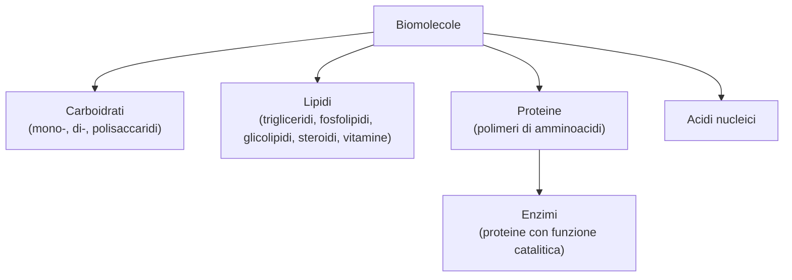

# B1 — Le biomolecole

## Introduzione

Le biomolecole sono i composti organici che costituiscono gli esseri viventi. Si dividono in quattro grandi categorie — carboidrati, lipidi, proteine e acidi nucleici — ognuna con funzioni biologiche precise. Molte biomolecole sono polimeri, cioè lunghe catene formate dall'unione di tante unità più piccole dette monomeri: per esempio i polisaccaridi sono catene di monosaccaridi e le proteine sono catene di amminoacidi.

## I carboidrati

I carboidrati, detti anche zuccheri o glicidi, sono composti organici formati da carbonio, idrogeno e ossigeno, che contengono due o più gruppi ossidrile $-\text{OH}$ e un gruppo aldeidico $-\text{CHO}$ o chetonico $\text{C=O}$. Sono le biomolecole più diffuse e hanno grande importanza energetica. In base a quante unità contengono si dividono in tre categorie:

- monosaccaridi: i monomeri, cioè le singole unità di base, che non si possono scomporre in zuccheri più semplici;
- oligosaccaridi: pochi monosaccaridi uniti; i più semplici e importanti sono i disaccaridi (due unità);
- polisaccaridi: lunghe catene di moltissimi monosaccaridi.

I carboidrati più complessi si formano unendo i monosaccaridi con una reazione di condensazione, in cui ogni volta che due unità si legano viene eliminata una molecola d'acqua.

### I monosaccaridi

I monosaccaridi sono gli zuccheri semplici. Si classificano in due modi:

- in aldosi (con gruppo aldeidico $-\text{CHO}$) e chetosi (con gruppo chetonico $\text{C=O}$);
- per numero di atomi di carbonio: triosi (3), tetrosi (4), pentosi (5), esosi (6).

I principali sono la gliceraldeide e il diidrossiacetone (triosi), il ribosio e il deossiribosio (pentosi degli acidi nucleici) e, tra gli esosi, il glucosio e il galattosio (aldosi) e il fruttosio (chetoso); questi tre hanno la stessa formula $C_6H_{12}O_6$ ma struttura diversa, perciò sono isomeri di struttura.

Sono molecole chirali:

- tranne il diidrossiacetone, hanno almeno uno stereocentro (un carbonio legato a quattro gruppi diversi), quindi esistono come enantiomeri (molecole speculari ma non sovrapponibili);
- si rappresentano con le proiezioni di Fischer; la configurazione è D se l'ossidrile $-\text{OH}$ dello stereocentro più lontano dal carbonile è a destra, L se è a sinistra (in natura prevale la serie D);
- con più stereocentri si hanno i diastereoisomeri (stereoisomeri non speculari); gli epimeri ne sono un caso e differiscono per un solo stereocentro (glucosio e galattosio: diversi solo al C-4).

In acqua assumono per lo più la forma ciclica (ad anello) invece di quella lineare:

- il gruppo carbonile reagisce con un ossidrile della stessa molecola e forma un emiacetale (un carbonio legato a un $-\text{OH}$ e a un ossigeno dell'anello);
- il glucosio forma un anello a sei atomi, il fruttosio a cinque; si disegnano con le proiezioni di Haworth, ma l'anello assume in realtà la più stabile conformazione "a sedia";
- il carbonio dell'emiacetale diventa un nuovo stereocentro, il carbonio anomerico, e dà i due anomeri α e β (serie D: ossidrile in basso in α, in alto in β), con proprietà fisiche diverse;
- in acqua le forme α e β si interconvertono passando per la forma aperta: è la mutarotazione.

### Le reazioni dei monosaccaridi

Poiché i monosaccaridi contengono un gruppo aldeidico o chetonico, vanno incontro a due reazioni tipiche:

- riduzione: il gruppo carbonile si riduce e lo zucchero si trasforma in un polialcol, detto alditolo (per esempio il glucosio dà il sorbitolo, usato come dolcificante);
- ossidazione: il gruppo aldeidico si ossida e diventa un gruppo carbossile, formando un acido (acido aldonico). Questa reazione serve anche a riconoscere gli zuccheri: con il reattivo di Tollens si forma uno specchio d'argento, con il reattivo di Fehling un precipitato rosso. Uno zucchero che reagisce in questo modo si dice zucchero riducente.

### I disaccaridi

I disaccaridi sono due monosaccaridi uniti da un legame glicosidico. Questo legame nasce da una condensazione tra il carbonio anomerico (il gruppo emiacetalico) di un monosaccaride e un ossidrile dell'altro, con perdita di una molecola d'acqua; a seconda dell'anomero, è di tipo α o β. La reazione inversa è l'idrolisi: con l'acqua e l'aiuto di un acido o di un enzima, il disaccaride si riscinde nei due monosaccaridi. I principali:

- maltosio: due molecole di glucosio unite da un legame α(1→4); deriva dall'amido ed è uno zucchero riducente (ha ancora un gruppo emiacetalico libero);
- lattosio: galattosio + glucosio uniti da un legame β(1→4); è lo zucchero del latte ed è riducente;
- saccarosio: glucosio + fruttosio uniti da un legame α,β(1→2); è il comune zucchero da tavola (dalla canna o dalla barbabietola); non è riducente, perché entrambi i gruppi emiacetalici sono impegnati nel legame;
- cellobiosio: due molecole di glucosio unite da un legame β(1→4); è l'unità che costituisce la cellulosa ed è riducente.

### I polisaccaridi

I polisaccaridi sono lunghe catene di centinaia o migliaia di monosaccaridi uniti da legami glicosidici. Si dividono in omopolisaccaridi (un solo tipo di monomero) ed eteropolisaccaridi (due o più tipi); la catena può essere lineare o ramificata e in genere non sono zuccheri riducenti. I principali:

- amido: riserva di energia delle piante; polimero di glucosio (legami α), è una miscela di amilosio (a catena lineare) e amilopectina (a catena ramificata);
- glicogeno: riserva di energia degli animali, conservata nel fegato e nei muscoli; simile all'amilopectina, ma ancora più ramificato;
- cellulosa: funzione di sostegno, forma la parete delle cellule vegetali; polimero lineare di glucosio (legami β(1→4)), con le catene unite da molti legami a idrogeno (resistente e insolubile); l'uomo non la digerisce, perché non possiede l'enzima per romperne i legami;
- chitina: funzione di sostegno, forma l'esoscheletro degli artropodi e la parete dei funghi; è fatta di N-acetilglucosammina, un derivato del glucosio;
- eteropolisaccaridi: l'acido ialuronico (nel liquido delle articolazioni e nell'occhio) e il peptidoglicano (parete delle cellule dei batteri).

## I lipidi

I lipidi sono una vasta classe di composti molto diversi tra loro, accomunati dall'essere insolubili in acqua e solubili nei solventi apolari. A differenza delle altre biomolecole non sono polimeri. Si dividono in due gruppi:

- lipidi saponificabili (o complessi): contengono acidi grassi e quindi possono essere scissi da una base (saponificazione); sono i trigliceridi, i fosfolipidi e i glicolipidi;
- lipidi non saponificabili (o semplici): non contengono acidi grassi; sono gli steroidi e le vitamine liposolubili.

Sono la principale riserva di energia dell'organismo (i trigliceridi) e hanno anche un ruolo strutturale (fosfolipidi e glicolipidi formano le membrane delle cellule); altri funzionano da ormoni, da isolante termico o da vitamine.

### I trigliceridi

I trigliceridi (o triacilgliceroli) sono formati da una molecola di glicerolo (un alcol con tre gruppi ossidrile) e tre molecole di acidi grassi, uniti per esterificazione, una condensazione con perdita di tre molecole d'acqua e formazione di tre legami estere: per questo sono detti triesteri del glicerolo.

Gli acidi grassi sono acidi carbossilici con una lunga catena di carboni (da 4 a 36 atomi, in numero pari):

- saturi: catena diritta con soli legami semplici; si impacchettano bene, hanno punto di fusione alto e sono solidi a temperatura ambiente; si trovano soprattutto negli animali (grassi);
- insaturi: con uno (monoinsaturi) o più (polinsaturi) doppi legami che piegano la catena; si impacchettano male, hanno punto di fusione basso e sono liquidi a temperatura ambiente; si trovano soprattutto nei vegetali (oli).

Alcuni acidi grassi insaturi sono essenziali (l'acido linoleico ω-6 e l'acido linolenico ω-3): l'organismo non li produce e vanno assunti con la dieta. I trigliceridi sono la principale riserva di energia, formano il tessuto adiposo sottocutaneo (che isola dal freddo) e trasportano le vitamine liposolubili.

### Le reazioni dei trigliceridi

- idrogenazione: si aggiunge idrogeno ai doppi legami degli acidi grassi insaturi, con un catalizzatore metallico (è una riduzione); così un olio liquido diventa un grasso solido, come la margarina;
- idrolisi alcalina o saponificazione: con una base forte (come NaOH) il trigliceride si scinde in glicerolo e nei sali degli acidi grassi, cioè i saponi.

Il sapone pulisce perché è una molecola anfipatica: ha una testa polare idrofila (il gruppo carbossilato) e una lunga coda apolare idrofoba. In acqua le sue molecole si raggruppano in sfere dette micelle, con le code rivolte all'interno e le teste verso l'acqua; le code catturano le goccioline di grasso formando un'emulsione e le tengono separate, così lo sporco viene allontanato. Per questo il sapone è un tensioattivo, cioè abbassa la tensione superficiale dell'acqua.

### I fosfolipidi

I fosfolipidi sono lipidi formati da glicerolo (o da sfingosina) legato a due code apolari idrofobe e a una testa polare idrofila che contiene un gruppo fosfato unito a un amminoalcol; sono perciò molecole anfipatiche. Si dividono in due gruppi:

- glicerofosfolipidi: i lipidi più abbondanti in natura; grazie alla loro natura anfipatica, in acqua si dispongono in un doppio strato (code idrofobe all'interno, teste idrofile verso l'acqua, da un lato verso il citoplasma e dall'altro verso l'esterno della cellula), formando le membrane cellulari, che regolano il passaggio di ioni e molecole;
- sfingolipidi: hanno la sfingosina al posto del glicerolo; sono abbondanti nella guaina mielinica che riveste gli assoni dei neuroni, dove fanno da isolante per la trasmissione dell'impulso nervoso.

### I glicolipidi

I glicolipidi (o glicosfingolipidi) sono formati da una molecola di sfingosina legata a un acido grasso e a un carboidrato (un monosaccaride come il glucosio o il galattosio, oppure un oligosaccaride); sono anch'essi anfipatici (testa idrofila = il carboidrato, due code idrofobe = la sfingosina e l'acido grasso). Funzionano soprattutto da recettori molecolari, che riconoscono molecole specifiche come ormoni e neurotrasmettitori; i glicolipidi dei globuli rossi, inoltre, determinano il gruppo sanguigno AB0.

### Gli steroidi

Gli steroidi sono lipidi che derivano dallo sterano, un idrocarburo a quattro anelli uniti tra loro (tre a sei atomi e uno a cinque). I principali sono:

- colesterolo: lo steroide più abbondante nei tessuti animali, è un alcol steroideo (sterolo); fa parte delle membrane cellulari (di cui regola la fluidità) ed è il punto di partenza per acidi biliari, ormoni steroidei e vitamina D. Nel sangue, essendo insolubile, viaggia legato a proteine dette lipoproteine: le LDL (a bassa densità) lo portano dal fegato ai tessuti, le HDL (ad alta densità) raccolgono quello in eccesso e lo riportano al fegato; un eccesso si deposita sulle pareti dei vasi sanguigni (aterosclerosi) e aumenta il rischio di infarto;
- acidi biliari: derivano dall'ossidazione del colesterolo; presenti nella bile come sali biliari, sono anfipatici ed emulsionano i grassi, facilitandone la digestione;
- ormoni steroidei: gli ormoni sessuali (androgeni come il testosterone; estrogeni e progesterone, femminili), che regolano i caratteri sessuali, e gli ormoni corticosurrenali, prodotti dalle ghiandole surrenali, cioè i glucocorticoidi (come il cortisolo) e i mineralcorticoidi (come l'aldosterone).

### Le vitamine liposolubili

Le vitamine liposolubili (A, D, E, K) sono indispensabili in piccole quantità per il metabolismo; l'organismo non le produce, perciò vanno assunte con gli alimenti.

- vitamina A (retinolo): si ricava anche dal β-carotene dei vegetali; serve per la vista, perché forma la rodopsina, e la sua carenza causa la cecità notturna;
- vitamina D (calciferolo): si forma anche nella pelle grazie ai raggi solari; regola l'assorbimento del calcio nelle ossa, e la sua carenza causa il rachitismo nei bambini;
- vitamina E (tocoferolo): è un antiossidante e protegge gli acidi grassi insaturi delle membrane;
- vitamina K (naftochinone): è necessaria per la coagulazione del sangue, e la sua carenza provoca emorragie.

## Gli amminoacidi e le proteine

### Gli amminoacidi

Gli amminoacidi sono i monomeri delle proteine. Sono molecole bifunzionali, con due gruppi funzionali legati allo stesso carbonio (il carbonio $\alpha$): un gruppo carbossilico $-\text{COOH}$ e un gruppo amminico $-\text{NH}_2$; al carbonio $\alpha$ è legato anche un gruppo R, la catena laterale, diversa per ogni amminoacido. Gli amminoacidi sono venti, e alcuni sono essenziali, perché l'organismo non li produce e vanno assunti con la dieta.

- classificazione (in base al gruppo R): apolari (catena di carbonio e idrogeno, idrofobici) e polari (catena con o senza carica, idrofili);
- chiralità: tranne la glicina, hanno il carbonio $\alpha$ come stereocentro, quindi esistono come enantiomeri D e L (in natura quasi tutti della serie L);
- forma in acqua: si trovano come ione dipolare o zwitterione, perché il gruppo $-\text{COOH}$ cede un protone (diventa $-\text{COO}^-$) e il gruppo $-\text{NH}_2$ lo acquista (diventa $-\text{NH}_3^+$), con carica totale nulla; sono perciò anfoteri (reagiscono sia con gli acidi sia con le basi) e la loro carica dipende dal pH. Il pH a cui la carica complessiva è zero si chiama punto isoelettrico.

### Il legame peptidico

Gli amminoacidi si uniscono con il legame peptidico, un legame covalente che si forma per condensazione (perdita di una molecola d'acqua) tra il gruppo carbossilico di un amminoacido e il gruppo amminico del successivo: è in pratica un legame ammidico. Le catene di amminoacidi si chiamano peptidi; le proteine sono catene lunghe, di più di 80 amminoacidi.

- per convenzione si scrive a sinistra l'amminoacido con il gruppo amminico libero (N-terminale) e a destra quello con il gruppo carbossilico libero (C-terminale);
- per effetto della risonanza, il legame peptidico è rigido e planare;
- la reazione inversa è l'idrolisi, che spezza la catena nei singoli amminoacidi ed è catalizzata da enzimi;
- tra due cisteine può formarsi anche un legame disolfuro ($-\text{S}-\text{S}-$), che nasce dall'ossidazione dei gruppi $-\text{SH}$ e aiuta la proteina a ripiegarsi nella sua forma.

### La classificazione delle proteine

Le proteine si classificano in tre modi:

- per composizione: semplici (solo amminoacidi) o coniugate (amminoacidi più un gruppo non proteico, detto gruppo prostetico, come il gruppo eme o un metallo);
- per funzione: strutturali (collagene, cheratina), catalitiche (gli enzimi), di trasporto (emoglobina), di difesa (gli anticorpi), di movimento (actina e miosina), di riserva e di regolazione (ormoni come l'insulina);
- per forma: fibrose, a catena allungata, insolubili e con funzione di sostegno (cheratina, collagene), e globulari, ripiegate a sfera e solubili (enzimi, anticorpi, emoglobina).

### La struttura delle proteine

Una proteina ha fino a quattro livelli di struttura:

- primaria: la sequenza degli amminoacidi, tenuta insieme dai legami peptidici; è fondamentale, perché basta cambiare un amminoacido per alterare la proteina (è ciò che accade nell'anemia falciforme);
- secondaria: il ripiegamento locale della catena, stabilizzato da legami a idrogeno, in due forme tipiche, l'α-elica (avvolta a spirale) e il β-foglietto (filamenti affiancati);
- terziaria: la forma tridimensionale complessiva della catena, stabilizzata dai legami tra i gruppi R (legami a idrogeno, legami disolfuro, interazioni ioniche e di van der Waals);
- quaternaria: l'unione di più catene in un'unica proteina, come nell'emoglobina (quattro catene).

Quando questi legami si rompono (per esempio con il calore o un forte cambiamento di pH) avviene la denaturazione: la proteina perde la sua forma e quindi la sua funzione, mentre la struttura primaria resta intatta.

## Gli enzimi

### Che cosa sono

Gli enzimi sono catalizzatori biologici, cioè sostanze che accelerano le reazioni del metabolismo senza essere consumate. Sono quasi sempre proteine globulari (in alcuni casi molecole di RNA dette ribozimi) e fanno avvenire sia reazioni cataboliche, che demoliscono le biomolecole, sia reazioni anaboliche, che le costruiscono. Il loro nome di solito si forma dal nome del substrato (la sostanza su cui agiscono) più il suffisso -asi: per esempio la lattasi agisce sul lattosio, l'amilasi sull'amido.

Molti enzimi, per funzionare, hanno bisogno di un cofattore:

- un attivatore: uno ione metallico;
- un coenzima: una molecola organica, che spesso deriva dalle vitamine del gruppo B.

La proteina da sola, senza cofattore, è inattiva e si chiama apoenzima; unita al cofattore diventa attiva e si chiama oloenzima.

### Come agisce un enzima

Perché una reazione avvenga, i reagenti devono superare una "barriera" di energia, detta energia di attivazione; l'enzima accelera la reazione abbassando questa energia di attivazione. Il meccanismo ha tre passaggi:

- l'enzima lega la molecola su cui agisce, il substrato, in una zona precisa detta sito attivo, formando il complesso enzima-substrato;
- trasforma il substrato in prodotto;
- rilascia il prodotto e torna libero, pronto a ricominciare (in breve: E + S → ES → EP → E + P).

### La specificità

Gli enzimi sono molto specifici, a differenza dei catalizzatori chimici comuni. Questa specificità è di due tipi:

- di substrato: ogni enzima agisce su un solo substrato (o pochi), perché il sito attivo ha una forma che accoglie solo la molecola giusta, come una chiave nella sua serratura (in realtà il sito attivo si adatta al substrato: è il modello dell'adattamento indotto);
- di reazione: ogni enzima catalizza un solo tipo di reazione. In base a questo gli enzimi si dividono in sei classi: ossidoreduttasi (ossidoriduzioni), transferasi (trasferimento di gruppi), idrolasi (idrolisi), liasi (rottura o formazione di doppi legami senza acqua), isomerasi (isomerizzazioni) e ligasi (unione di due molecole).

### L'attività enzimatica e la sua regolazione

L'attività enzimatica è la quantità di substrato trasformato in prodotto nell'unità di tempo e dipende da alcuni fattori:

- la temperatura: la velocità cresce fino a un valore, la temperatura ottimale (negli animali circa 37 °C), oltre il quale l'enzima si denatura e smette di funzionare;
- il pH: ogni enzima ha un pH ottimale (per esempio la pepsina dello stomaco lavora a pH molto acido);
- la concentrazione di enzima e di substrato: l'attività aumenta con il substrato fino a un massimo (curva di saturazione), quando tutti gli enzimi sono occupati.

L'attività può anche essere regolata in due modi:

- effettori allosterici: molecole che si legano all'enzima in un punto diverso dal sito attivo (il sito allosterico) e ne cambiano la forma, aumentando l'attività (positivi) o diminuendola (negativi);
- inibitori: riducono o bloccano l'attività; possono essere irreversibili (si legano in modo permanente) o reversibili — tra questi i competitivi somigliano al substrato e occupano il sito attivo (e si superano aggiungendo più substrato), mentre i non competitivi si legano altrove cambiando la forma dell'enzima.

## Schema riassuntivo

## Collegamenti

- **Biologia**: i carboidrati danno energia immediata; i lipidi formano le membrane e sono una riserva di energia a lungo termine; le proteine svolgono quasi tutte le funzioni della cellula (sostegno, trasporto, movimento); gli enzimi regolano il metabolismo.
- **Medicina**: molte malattie nascono da proteine difettose (come la fibrosi cistica) o dalla mancanza di un enzima.
- **Tecnologia**: alcune proteine utili, come l'insulina, oggi vengono prodotte da batteri modificati; gli enzimi si usano nei detersivi e nell'industria alimentare.
