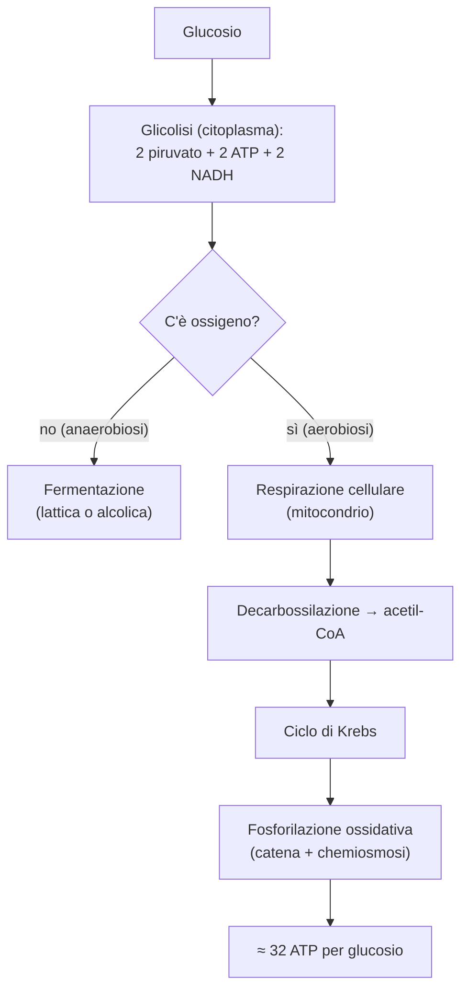

# B2 — Il metabolismo energetico

## Il metabolismo e l'ATP

Il metabolismo è l'insieme di tutte le reazioni chimiche che avvengono in un organismo, organizzate in vie metaboliche, cioè sequenze di reazioni in cui ognuna è catalizzata da un enzima specifico. Si divide in due grandi rami:

- catabolismo: le reazioni che demoliscono le molecole e liberano energia;
- anabolismo: le reazioni che costruiscono le molecole e richiedono energia.

Le vie metaboliche sono regolate con precisione: spesso la prima reazione di una via (il passaggio obbligato) viene rallentata dal prodotto finale stesso, un meccanismo di controllo detto inibizione a feedback (o a retroazione), che evita di produrre una sostanza quando ce n'è già abbastanza.

L'energia liberata dal catabolismo non viene usata subito, ma immagazzinata nell'ATP (adenosina trifosfato), la "moneta energetica" della cellula: è una molecola con tre gruppi fosfato uniti da legami ad alta energia, e quando ne stacca uno, trasformandosi in ADP, libera l'energia necessaria alle reazioni anaboliche e a tutte le funzioni della cellula.

Gran parte delle reazioni del metabolismo, inoltre, sono ossidoriduzioni, in cui una molecola si ossida (perde elettroni) e un'altra si riduce (li acquista). A trasportare questi elettroni da una reazione all'altra ci sono due coenzimi, il NAD e il FAD, che derivano da vitamine del gruppo B: quando raccolgono elettroni e atomi di idrogeno diventano le forme ridotte NADH e FADH₂, che li cederanno poi nella fase finale per produrre ATP.

## La glicolisi

La glicolisi è la prima via del catabolismo del glucosio: lo ossida solo in parte, trasformandolo in due molecole di piruvato. Avviene nel citoplasma della cellula, è formata da una sequenza di dieci reazioni e si svolge sia in presenza sia in assenza di ossigeno. Si divide in due fasi:

- fase endoergonica (di investimento): la cellula consuma 2 ATP per attivare il glucosio e scinderlo in due molecole di gliceraldeide-3-fosfato (G3P);
- fase esoergonica (di resa): le due G3P vengono ossidate fino a piruvato, e questo produce 4 ATP e 2 NADH.

Il bilancio netto della glicolisi è quindi di 2 ATP e 2 NADH per ogni molecola di glucosio. La via è controllata soprattutto dall'enzima fosfofruttochinasi, che funziona da sensore del bisogno di energia della cellula. Che cosa accade poi al piruvato dipende dalla presenza o meno di ossigeno.

## Le fermentazioni

Le fermentazioni sono le vie che il piruvato segue quando manca l'ossigeno (anaerobiosi). Il loro scopo non è produrre direttamente energia, ma rigenerare il NAD⁺ che è stato consumato nella glicolisi: senza questo passaggio la glicolisi si fermerebbe, mentre così può continuare a fornire ATP. Esistono due tipi di fermentazione:

- fermentazione lattica: il piruvato viene ridotto a lattato; avviene nei muscoli durante uno sforzo intenso, quando l'ossigeno non basta, e il lattato prodotto viene poi trasportato al fegato, che lo riconverte in glucosio (ciclo di Cori);
- fermentazione alcolica: tipica dei lieviti, trasforma il piruvato in etanolo e anidride carbonica; è il processo alla base della produzione del vino, della birra e della lievitazione del pane.

## La respirazione cellulare

La respirazione cellulare è il processo che, in presenza di ossigeno (aerobiosi), ossida completamente il piruvato fino ad anidride carbonica e acqua, ricavandone molta più energia della sola glicolisi. Avviene all'interno del mitocondrio e si svolge in tre tappe successive: la decarbossilazione ossidativa del piruvato, il ciclo di Krebs e la fosforilazione ossidativa.

### Decarbossilazione ossidativa del piruvato

La decarbossilazione ossidativa è la tappa di collegamento tra la glicolisi e il ciclo di Krebs. Il piruvato, prodotto nel citoplasma, entra nel mitocondrio e qui viene trasformato in acetil-CoA: nella reazione si stacca un atomo di carbonio, che viene liberato come anidride carbonica, e si produce una molecola di NADH. La reazione è catalizzata da un grande complesso enzimatico, la piruvato deidrogenasi. L'acetil-CoA che si forma è la molecola che entra nel ciclo di Krebs, ed è anche il punto in cui confluisce il catabolismo di zuccheri, grassi e proteine.

### Il ciclo di Krebs

Il ciclo di Krebs (o ciclo dell'acido citrico) è una sequenza ciclica di otto reazioni che si svolge nella matrice del mitocondrio e completa l'ossidazione dell'acetil-CoA. All'inizio del ciclo l'acetil-CoA (due atomi di carbonio) si unisce all'ossalacetato (quattro atomi di carbonio) formando il citrato (sei atomi di carbonio); attraverso una serie di reazioni il citrato viene poi ossidato passo passo, libera due molecole di anidride carbonica e alla fine rigenera l'ossalacetato, pronto a far ricominciare il ciclo.

L'importanza del ciclo sta nell'energia che raccoglie sotto forma di coenzimi ridotti:

- a ogni giro si producono 3 NADH, 1 FADH₂ e 1 GTP (una molecola equivalente all'ATP);
- poiché da ogni glucosio si formano due piruvati, e quindi due acetil-CoA, il ciclo compie due giri per ogni glucosio, con un totale di 6 NADH, 2 FADH₂ e 2 GTP.

I NADH e i FADH₂ così prodotti vengono utilizzati nell'ultima tappa per produrre ATP.

### La fosforilazione ossidativa

La fosforilazione ossidativa è la tappa che produce la maggior parte dell'ATP, e si svolge sulla membrana interna del mitocondrio. Il NADH e il FADH₂ accumulati nelle tappe precedenti cedono i loro elettroni alla catena di trasporto degli elettroni, una serie di complessi proteici inseriti nella membrana. Gli elettroni passano da un complesso all'altro perdendo via via energia, fino a raggiungere l'ossigeno, l'accettore finale, che si combina con gli ioni idrogeno formando acqua.

L'energia liberata durante questo passaggio viene usata per pompare protoni dalla matrice allo spazio tra le due membrane, creando un gradiente di concentrazione detto forza proton-motrice. I protoni tendono allora a rientrare nella matrice, e lo fanno attraverso l'enzima ATP sintasi, che sfrutta questo flusso per produrre ATP: questo accoppiamento tra il gradiente di protoni e la sintesi di ATP si chiama chemiosmosi. In media ogni NADH permette di produrre circa 2,5 ATP e ogni FADH₂ circa 1,5 ATP.

### Il bilancio energetico

Mettendo insieme tutte le tappe, l'ossidazione completa di una molecola di glucosio (glicolisi più respirazione cellulare) produce circa 32 molecole di ATP. La sola glicolisi, in assenza di ossigeno, ne fornisce appena 2: questo grande divario spiega perché la respirazione cellulare, e quindi l'ossigeno, sia così vantaggiosa per gli organismi.

## La biochimica del corpo umano

La biochimica del corpo umano riguarda il modo in cui l'organismo regola di continuo l'energia in base alle proprie esigenze. Dopo i pasti, quando i nutrienti abbondano, prevale l'anabolismo, con l'accumulo di riserve sotto forma di glicogeno e di trigliceridi; durante il digiuno prevale invece il catabolismo, con la demolizione delle riserve per mantenere costante la glicemia, cioè la concentrazione di glucosio nel sangue.

I diversi tessuti hanno bisogni diversi — il cervello usa quasi solo glucosio, i muscoli sia glucosio sia grassi, il tessuto adiposo immagazzina i grassi — e il fegato fa da centrale di smistamento, distribuendo a ciascuno i nutrienti giusti. Il punto in cui quasi tutte queste vie si incontrano è l'acetil-CoA.

### Il metabolismo degli zuccheri

Il metabolismo degli zuccheri comprende le vie con cui l'organismo immagazzina e recupera il glucosio per mantenere stabile la glicemia. Quando il glucosio è abbondante, viene messo da parte sotto forma di glicogeno con la glicogenosintesi, e il glicogeno si accumula soprattutto nel fegato e nei muscoli. Quando invece serve energia, il glicogeno viene demolito e ritrasformato in glucosio con la glicogenolisi; va notato però che solo il fegato è in grado di rimettere il glucosio nel sangue per gli altri organi, mentre il muscolo lo trattiene per il proprio uso.

Se infine le riserve di glicogeno si esauriscono, il fegato può fabbricare glucosio nuovo a partire da altre molecole, come il piruvato, il lattato e alcuni amminoacidi: questa via si chiama gluconeogenesi ed è, in pratica, la glicolisi percorsa al contrario. Quando anche gli zuccheri scarseggiano, l'organismo passa a ricavare energia dai grassi.

### Il metabolismo dei lipidi

Il metabolismo dei lipidi riguarda sia l'uso dei grassi come fonte di energia sia la loro costruzione come riserva. Per ricavarne energia, gli acidi grassi vengono demoliti con la β-ossidazione, che li taglia in tante molecole di acetil-CoA e produce molti NADH e FADH₂; l'acetil-CoA entra poi nel ciclo di Krebs. I grassi sono una riserva di energia molto più ricca degli zuccheri, ed è per questo che l'organismo li usa per le scorte a lungo termine, accumulandoli nel tessuto adiposo.

Al contrario, quando i nutrienti sono abbondanti, il fegato e il tessuto adiposo costruiscono acidi grassi e colesterolo a partire dall'acetil-CoA, in un processo detto biosintesi dei lipidi. Infine, quando manca il glucosio — per esempio in un digiuno prolungato o nel diabete grave — il fegato trasforma l'acetil-CoA in corpi chetonici, che diventano una fonte di energia alternativa per il cuore, i muscoli e il cervello. Se il digiuno continua e anche i grassi non bastano, l'organismo arriva a demolire le proteine.

### Il metabolismo delle proteine

Il metabolismo delle proteine riguarda gli amminoacidi che, a differenza degli zuccheri e dei grassi, non possono essere immagazzinati: quelli in eccesso vengono perciò demoliti. Il primo passo è togliere il gruppo amminico, attraverso la transaminazione e la deaminazione ossidativa; in questo modo si libera lo ione ammonio, che è tossico per l'organismo. Il fegato lo trasforma allora in urea, una sostanza non tossica, mediante il ciclo dell'urea, e l'urea viene poi eliminata con le urine.

Lo scheletro di carbonio che rimane non viene sprecato, ma entra nelle vie del glucosio o dei grassi: per questo gli amminoacidi si distinguono in glucogenici, se il loro scheletro può dare glucosio, e chetogenici, se può dare corpi chetonici e grassi. A decidere, momento per momento, se bruciare o mettere da parte zuccheri, grassi e proteine sono gli ormoni.

### La regolazione ormonale

La regolazione ormonale del metabolismo ha il compito di mantenere costante la glicemia, ed è affidata soprattutto a due ormoni opposti, prodotti dal pancreas. L'insulina, che aumenta dopo i pasti quando la glicemia è alta, la fa abbassare: favorisce l'ingresso del glucosio nelle cellule e stimola l'anabolismo, cioè l'accumulo di riserve. Il glucagone, che aumenta durante il digiuno, ha l'effetto opposto: alza la glicemia stimolando la glicogenolisi e la gluconeogenesi nel fegato.

Negli stati di stress o di sforzo intervengono anche l'adrenalina, che prepara il corpo all'azione liberando rapidamente glucosio, e il cortisolo, che agisce negli stress prolungati; entrambi spingono il catabolismo e la mobilizzazione delle riserve. Proprio l'insulina è l'ormone che manca, o non funziona correttamente, nel diabete.

## Schema riassuntivo

## Collegamenti

- **Biologia**: tutte le attività della cellula dipendono dall'ATP; le malattie dei mitocondri causano una grave mancanza di energia.
- **Medicina**: il diabete nasce da un'alterazione nel controllo della glicemia (l'insulina); nel digiuno prolungato e nel diabete grave si accumulano i corpi chetonici.
- **Ambiente**: la fotosintesi delle piante cattura l'energia del Sole e produce il glucosio e l'ossigeno da cui dipende la respirazione cellulare di tutti gli altri organismi.
