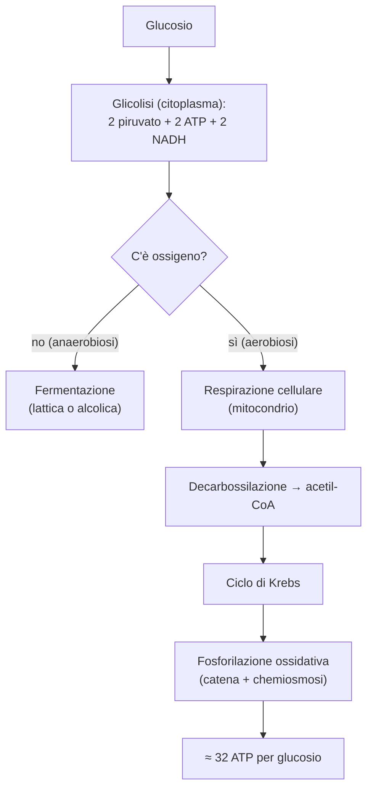

# B2 — Il metabolismo energetico

## Il metabolismo e l'ATP

Il metabolismo è l'insieme di tutte le reazioni chimiche che avvengono in un organismo, organizzate in vie metaboliche (sequenze di reazioni, ognuna catalizzata da un enzima). Si divide in:

- catabolismo: le reazioni che demoliscono le molecole e liberano energia;
- anabolismo: le reazioni che costruiscono le molecole e richiedono energia.

Le vie metaboliche sono regolate: spesso una reazione iniziale (il passaggio obbligato) viene bloccata dal prodotto finale stesso, un controllo detto inibizione a feedback (o a retroazione).

L'energia liberata dal catabolismo viene immagazzinata nell'ATP (adenosina trifosfato), la "moneta energetica" della cellula: ha tre gruppi fosfato uniti da legami ad alta energia, e quando ne stacca uno (diventando ADP) libera l'energia per le altre reazioni. Gran parte delle reazioni del metabolismo sono inoltre ossidoriduzioni, in cui una molecola si ossida (perde elettroni) e un'altra si riduce (li acquista): a trasportare gli elettroni sono due coenzimi, il NAD e il FAD (derivati da vitamine del gruppo B), che nelle forme ridotte NADH e FADH₂ li cederanno per produrre energia.

## La glicolisi

La glicolisi è la via che ossida parzialmente il glucosio, trasformandolo in due molecole di piruvato. Avviene nel citoplasma, è formata da dieci reazioni e si svolge sia in presenza sia in assenza di ossigeno. Si divide in due fasi:

- fase endoergonica (di investimento): consuma 2 ATP e trasforma il glucosio in due molecole di gliceraldeide-3-fosfato (G3P);
- fase esoergonica (di resa): ossida le due G3P a piruvato e produce 4 ATP e 2 NADH.

Il bilancio netto è quindi di 2 ATP e 2 NADH per ogni molecola di glucosio. L'enzima chiave che la regola è la fosfofruttochinasi, sensibile al bisogno di energia della cellula. Il destino del piruvato dipende poi dalla presenza o meno di ossigeno.

## Le fermentazioni

Le fermentazioni sono le vie che il piruvato segue in assenza di ossigeno (anaerobiosi). Il loro scopo è rigenerare il NAD⁺ consumato nella glicolisi, così che questa possa continuare a produrre ATP. Ci sono due tipi:

- fermentazione lattica: il piruvato è ridotto a lattato; avviene nei muscoli durante sforzi intensi, quando l'ossigeno non basta, e il lattato è poi riportato dal fegato a glucosio (ciclo di Cori);
- fermentazione alcolica: nei lieviti il piruvato è trasformato in etanolo e anidride carbonica; è alla base della produzione del vino, della birra e del pane.

## La respirazione cellulare

La respirazione cellulare è il processo che, in presenza di ossigeno (aerobiosi), ossida completamente il piruvato ad anidride carbonica e acqua. Avviene nel mitocondrio, in tre tappe: decarbossilazione ossidativa del piruvato, ciclo di Krebs e fosforilazione ossidativa.

### Decarbossilazione ossidativa del piruvato

La decarbossilazione ossidativa del piruvato è la prima tappa: il piruvato viene trasformato in acetil-CoA, si libera una molecola di anidride carbonica e si produce un NADH. La reazione è catalizzata dal complesso della piruvato deidrogenasi, e l'acetil-CoA è la molecola che entra nel ciclo di Krebs.

### Il ciclo di Krebs

Il ciclo di Krebs (o ciclo dell'acido citrico) è una sequenza di otto reazioni che ossida l'acetil-CoA a due molecole di anidride carbonica: l'acetil-CoA si unisce all'ossalacetato formando il citrato, che viene poi ossidato passo passo fino a rigenerare l'ossalacetato. Il bilancio:

- a ogni giro si producono 3 NADH, 1 FADH₂ e 1 GTP (equivalente a un ATP);
- da ogni glucosio si formano due piruvati, quindi il ciclo compie due giri, con un totale di 6 NADH, 2 FADH₂ e 2 GTP.

### La fosforilazione ossidativa

La fosforilazione ossidativa è l'ultima tappa, in cui il NADH e il FADH₂ cedono i loro elettroni alla catena di trasporto degli elettroni, una serie di complessi proteici nella membrana interna del mitocondrio:

- gli elettroni scendono lungo la catena fino all'ossigeno, l'accettore finale, che si combina con gli idrogeni formando acqua;
- l'energia liberata serve a pompare protoni nello spazio tra le due membrane, creando un gradiente (la forza proton-motrice);
- i protoni rientrano attraverso l'enzima ATP sintasi, che sfrutta questo flusso per produrre ATP: è la chemiosmosi.

Ogni NADH dà circa 2,5 ATP, ogni FADH₂ circa 1,5.

### Il bilancio energetico

Il bilancio energetico complessivo è questo: la completa ossidazione di una molecola di glucosio (glicolisi più respirazione cellulare) produce circa 32 molecole di ATP. La sola glicolisi, in assenza di ossigeno, ne produce appena 2: per questo la respirazione cellulare è molto più conveniente.

## La biochimica del corpo umano

La biochimica del corpo umano riguarda il modo in cui l'organismo regola di continuo l'energia in base alle sue esigenze: dopo i pasti prevale l'anabolismo, con accumulo di riserve (glicogeno e trigliceridi); durante il digiuno prevale il catabolismo, con la demolizione delle riserve per mantenere costante la glicemia (la concentrazione di glucosio nel sangue). I diversi tessuti hanno bisogni diversi — il cervello usa quasi solo glucosio, i muscoli sia glucosio sia grassi, il tessuto adiposo immagazzina i grassi — e il fegato fa da centrale di smistamento; il punto in cui quasi tutte queste vie si incontrano è l'acetil-CoA.

### Il metabolismo degli zuccheri

Il metabolismo degli zuccheri comprende le vie con cui l'organismo immagazzina e recupera il glucosio:

- glicogenosintesi: il glucosio in eccesso viene messo da parte come glicogeno, soprattutto nel fegato e nei muscoli;
- glicogenolisi: quando serve, il glicogeno viene demolito a glucosio; solo il fegato può rimetterlo nel sangue per gli altri organi, mentre il muscolo lo tiene per sé;
- gluconeogenesi: finite le riserve di glicogeno, il fegato fabbrica nuovo glucosio a partire da altre molecole (piruvato, lattato, amminoacidi); è in pratica la glicolisi al contrario.

Quando gli zuccheri scarseggiano, l'organismo passa a bruciare i grassi.

### Il metabolismo dei lipidi

Il metabolismo dei lipidi riguarda l'uso e la formazione dei grassi:

- β-ossidazione: demolisce gli acidi grassi in tante molecole di acetil-CoA (producendo molti NADH e FADH₂), che entra poi nel ciclo di Krebs; i grassi sono una riserva di energia molto più ricca degli zuccheri, perciò il corpo li usa per le scorte a lungo termine;
- biosintesi dei lipidi: quando c'è abbondanza di nutrienti, il fegato e il tessuto adiposo costruiscono acidi grassi e colesterolo a partire dall'acetil-CoA;
- corpi chetonici: quando manca il glucosio (digiuno prolungato o diabete), il fegato trasforma l'acetil-CoA in corpi chetonici, usati come fonte di energia alternativa da cuore, muscoli e cervello.

Se il digiuno continua e anche i grassi non bastano, il corpo arriva a intaccare le proteine.

### Il metabolismo delle proteine

Il metabolismo delle proteine riguarda gli amminoacidi, che in eccesso non si possono immagazzinare e quindi vengono demoliti:

- prima si toglie il gruppo amminico (con la transaminazione e la deaminazione ossidativa), liberando lo ione ammonio, che è tossico;
- il fegato trasforma lo ione ammonio in urea (ciclo dell'urea), poi eliminata con le urine;
- lo scheletro di carbonio che rimane entra nelle vie del glucosio o dei grassi: per questo gli amminoacidi si dividono in glucogenici (danno glucosio) e chetogenici (danno corpi chetonici e grassi).

A decidere, momento per momento, se bruciare o mettere da parte zuccheri, grassi e proteine sono gli ormoni.

### La regolazione ormonale

La regolazione ormonale del metabolismo mantiene costante la glicemia grazie a ormoni opposti, prodotti dal pancreas:

- insulina (alta dopo i pasti): abbassa la glicemia, fa entrare il glucosio nelle cellule e favorisce l'anabolismo;
- glucagone (alto durante il digiuno): alza la glicemia stimolando glicogenolisi e gluconeogenesi;
- adrenalina e cortisolo (in stress o sforzo): spingono il catabolismo e la mobilizzazione delle riserve (l'adrenalina libera glucosio in fretta per l'azione, il cortisolo agisce negli stress prolungati).

È proprio l'insulina che manca o non funziona nel diabete.

## Schema riassuntivo

## Collegamenti

- **Biologia**: tutte le attività della cellula dipendono dall'ATP; le malattie dei mitocondri causano una grave mancanza di energia.
- **Medicina**: il diabete nasce da un'alterazione nel controllo della glicemia (l'insulina); nel digiuno prolungato e nel diabete grave si accumulano i corpi chetonici.
- **Ambiente**: la fotosintesi delle piante cattura l'energia del Sole e produce il glucosio e l'ossigeno da cui dipende la respirazione cellulare di tutti gli altri organismi.
