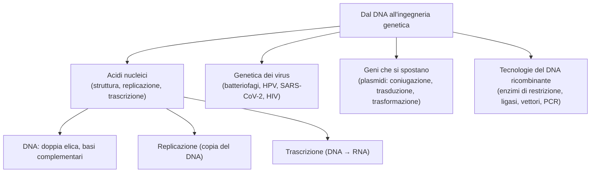

# B4 — Dal DNA all'ingegneria genetica

## Gli acidi nucleici: struttura, replicazione e trascrizione

Gli acidi nucleici, il DNA e l'RNA, conservano e trasmettono l'informazione genetica. La loro struttura è alla base di due processi fondamentali: la replicazione, con cui il DNA si copia, e la trascrizione, con cui l'informazione passa all'RNA.

### I nucleotidi e gli acidi nucleici

Gli acidi nucleici sono i biopolimeri che conservano e trasmettono l'informazione genetica, e sono formati da unità chiamate nucleotidi. Ogni nucleotide è fatto di tre parti:

- una base azotata: una purina (adenina o guanina), con due anelli, oppure una pirimidina (citosina, timina o uracile), con un anello solo;
- uno zucchero a cinque atomi di carbonio (un pentoso);
- un gruppo fosfato.

I nucleotidi si costruiscono e si uniscono in due passaggi: prima lo zucchero si lega alla base formando un nucleoside (con un legame N-glicosidico), poi al nucleoside si aggiunge il gruppo fosfato; i nucleotidi si uniscono poi in catena tramite il legame fosfodiestere, che collega il fosfato di un nucleotide allo zucchero del successivo (la catena ha due estremità diverse, dette 5' e 3'). Esistono due acidi nucleici, che differiscono per lo zucchero e per una base:

- il DNA (acido desossiribonucleico): contiene il deossiribosio e le basi adenina, guanina, citosina e timina; conserva l'informazione genetica;
- l'RNA (acido ribonucleico): contiene il ribosio e ha l'uracile al posto della timina; trasporta l'informazione e ne esistono tre tipi, l'mRNA (messaggero, porta il messaggio del DNA ai ribosomi), il tRNA (transfer, porta gli amminoacidi) e l'rRNA (ribosomiale, costituisce i ribosomi).

### La struttura del DNA

Il DNA ha la forma di una doppia elica, scoperta da Watson e Crick nel 1953 grazie anche alle immagini ai raggi X di Rosalind Franklin. Le sue caratteristiche:

- è formato da due filamenti di nucleotidi avvolti tra loro e antiparalleli (vanno in direzioni opposte);
- lo scheletro di zucchero e fosfato sta all'esterno, mentre le basi azotate stanno all'interno e si appaiano a coppie;
- l'appaiamento è sempre complementare: l'adenina si lega alla timina (con due legami a idrogeno) e la guanina alla citosina (con tre);
- per questo, conoscendo la sequenza di un filamento si ricava quella dell'altro: ed è proprio su questa complementarità che si basano la replicazione e la trascrizione.

### La replicazione del DNA

La replicazione del DNA è il processo con cui il DNA si copia prima che la cellula si divida, così da passare l'informazione alle cellule figlie. È semiconservativa, perché ogni nuova doppia elica conserva un filamento vecchio (che fa da stampo) e uno nuovo. Le tappe:

- l'enzima elicasi apre la doppia elica;
- la primasi crea un breve innesco di RNA (primer), da cui la DNA polimerasi parte aggiungendo i nucleotidi uno a uno, sempre in direzione 5'→3' e appaiandoli per complementarità allo stampo;
- poiché i due filamenti sono antiparalleli, uno (filamento continuo) viene copiato senza interruzioni, mentre l'altro (filamento discontinuo) viene copiato a pezzi, i frammenti di Okazaki, poi saldati insieme dalla DNA ligasi;
- la replicazione è molto precisa, anche perché la DNA polimerasi controlla e corregge i propri errori (proofreading).

### La trascrizione

La trascrizione è il processo con cui l'informazione di un gene viene copiata in una molecola di RNA messaggero, ed è catalizzata dall'enzima RNA polimerasi. L'enzima si lega a una sequenza iniziale detta promotore, poi scorre lungo il filamento stampo leggendolo in direzione 3'→5' e costruisce l'mRNA in direzione 5'→3', finché incontra una sequenza di terminazione e si stacca. L'mRNA porterà poi il messaggio ai ribosomi.

## La genetica dei virus

I virus sono parassiti endocellulari obbligati: non riescono a riprodursi da soli, ma solo dentro una cellula ospite. Un virus è formato da un genoma (DNA o RNA) racchiuso in un involucro proteico, il capside, a volte rivestito da una membrana esterna (pericapside).

I virus che infettano i batteri si chiamano batteriofagi e possono seguire due cicli:

- ciclo litico: il virus si replica subito e distrugge la cellula ospite;
- ciclo lisogeno: il suo DNA si integra in quello dell'ospite (profago) e resta silente, duplicandosi insieme alla cellula, finché in un secondo momento può passare al ciclo litico.

Tra i virus che colpiscono l'uomo:

- il papillomavirus (HPV), virus a DNA, responsabile del tumore della cervice uterina;
- il SARS-CoV-2, virus a RNA, responsabile del COVID-19;
- i retrovirus, come l'HIV (che causa l'AIDS): grazie all'enzima trascrittasi inversa trasformano il proprio RNA in DNA, che poi si integra nella cellula ospite.

## I geni che si spostano

I geni non passano solo da genitore a figlio (trasferimento verticale): i batteri possono scambiarsi geni anche tra individui diversi (trasferimento orizzontale), e questo spiega per esempio la rapida diffusione della resistenza agli antibiotici. Spesso questi geni si trovano sui plasmidi, piccole molecole di DNA circolare separate dal cromosoma, che il batterio può duplicare e trasmettere. Lo scambio di geni tra batteri avviene in tre modi:

- coniugazione: un batterio donatore passa una copia del plasmide a un altro attraverso un ponte (il pilo sessuale);
- trasduzione: è un batteriofago a trasportare il DNA da un batterio all'altro;
- trasformazione: il batterio assorbe direttamente dall'ambiente frammenti di DNA liberi.

## Le tecnologie del DNA ricombinante

Il DNA ricombinante è una molecola di DNA che unisce sequenze provenienti da organismi diversi, e l'insieme delle tecniche che permettono di costruirlo e manipolarlo è l'ingegneria genetica. Per ottenerlo servono alcuni "attrezzi":

- gli enzimi di restrizione: tagliano il DNA in punti precisi (sequenze specifiche), lasciando spesso estremità "coesive" capaci di incollarsi ad altri frammenti tagliati allo stesso modo;
- la DNA ligasi: cuce insieme i frammenti formando un'unica molecola;
- l'elettroforesi su gel: separa i frammenti di DNA in base alla loro dimensione facendoli migrare in un campo elettrico.

Le applicazioni principali sono:

- clonare un gene, cioè farne tante copie identiche: il gene viene inserito in un vettore (di solito un plasmide, ma anche un virus), che lo porta dentro una cellula (di solito un batterio), dove si replica; è così, per esempio, che si fa produrre ai batteri l'insulina umana. Per cercare un gene in mezzo a tutto il genoma si costruisce una libreria di DNA e lo si individua con una sonda complementare (ibridazione);
- la PCR (reazione a catena della polimerasi, inventata da Kary Mullis): amplifica il DNA, cioè ne fa moltissime copie in poche ore e in provetta, senza bisogno di cellule; usa l'enzima Taq polimerasi e ripete molte volte tre fasi (denaturazione, appaiamento dei primer e allungamento), raddoppiando ogni volta la quantità di DNA.

## Schema riassuntivo

## Collegamenti

- **Biologia**: la replicazione del DNA è la base della divisione cellulare e dell'ereditarietà; lo scambio orizzontale di geni tra batteri e i virus mostrano come il materiale genetico possa passare anche tra organismi diversi.
- **Medicina**: virus come l'HIV e l'HPV causano malattie gravi; la resistenza dei batteri agli antibiotici, diffusa per via orizzontale, è un grande problema sanitario; molte terapie usano proteine prodotte con l'ingegneria genetica.
- **Biotecnologie**: l'ingegneria genetica permette di produrre farmaci (come l'insulina) e organismi geneticamente modificati; la PCR è alla base dei test del DNA, dalla diagnosi delle malattie alle indagini forensi.
