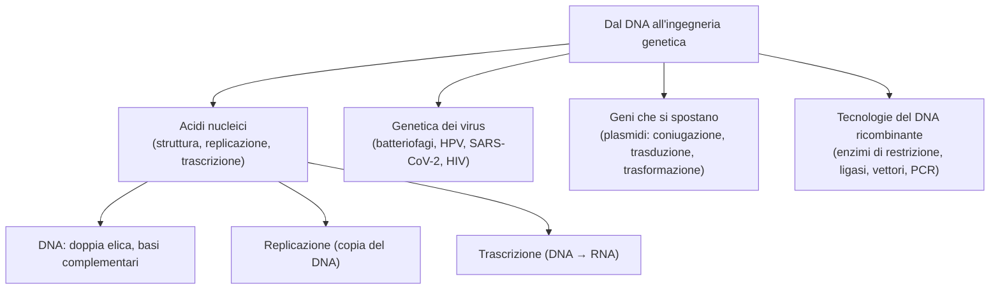

# B4 — Dal DNA all'ingegneria genetica

## Gli acidi nucleici: struttura, replicazione e trascrizione

Gli acidi nucleici, il DNA e l'RNA, sono le molecole che conservano e trasmettono l'informazione genetica. La loro struttura è alla base di due processi fondamentali: la replicazione, con cui il DNA si copia, e la trascrizione, con cui l'informazione passa all'RNA.

### I nucleotidi e gli acidi nucleici

Gli acidi nucleici sono biopolimeri, cioè lunghe catene formate da unità più piccole chiamate nucleotidi. Ogni nucleotide è composto da tre parti:

- una base azotata;
- uno zucchero a cinque atomi di carbonio (un pentoso);
- un gruppo fosfato.

Le basi azotate sono di due tipi: le purine (adenina e guanina), formate da due anelli, e le pirimidine (citosina, timina e uracile), formate da un solo anello.

Un nucleotide si costruisce in due passaggi: prima lo zucchero si lega alla base formando un nucleoside, poi si aggiunge il gruppo fosfato. I nucleotidi si uniscono infine in catena tramite il legame fosfodiestere, che collega il fosfato di un nucleotide allo zucchero del successivo, dando alla catena due estremità diverse, dette 5' e 3'.

Esistono due acidi nucleici, che si distinguono per il tipo di zucchero e per una base:

- il DNA (acido desossiribonucleico) contiene il deossiribosio e le basi adenina, guanina, citosina e timina, e ha il compito di conservare l'informazione genetica;
- l'RNA (acido ribonucleico) contiene il ribosio e ha l'uracile al posto della timina, e ha il compito di trasportare l'informazione; ne esistono tre tipi, l'mRNA (messaggero), che porta il messaggio del DNA ai ribosomi, il tRNA (transfer), che porta gli amminoacidi, e l'rRNA (ribosomiale), che costituisce i ribosomi.

### La struttura del DNA

Il DNA ha la forma di una doppia elica, una struttura scoperta da Watson e Crick nel 1953, grazie anche alle immagini ai raggi X ottenute da Rosalind Franklin. È formato da due filamenti di nucleotidi avvolti l'uno sull'altro e antiparalleli, cioè orientati in direzioni opposte: lo scheletro fatto di zucchero e fosfato si trova all'esterno, mentre le basi azotate stanno all'interno e si appaiano a coppie.

L'appaiamento è sempre complementare, perché l'adenina si lega soltanto alla timina, con due legami a idrogeno, e la guanina soltanto alla citosina, con tre legami a idrogeno. Questa regola è molto importante: conoscendo la sequenza di un filamento si può sempre ricavare quella dell'altro, ed è proprio su questa complementarità che si basano la replicazione e la trascrizione.

### La replicazione del DNA

La replicazione del DNA è il processo con cui il DNA si copia prima che la cellula si divida, in modo da trasmettere l'informazione genetica alle cellule figlie. È detta semiconservativa perché ogni nuova doppia elica conserva un filamento vecchio, che fa da stampo, e ne sintetizza uno nuovo.

Il processo inizia quando l'enzima elicasi apre la doppia elica separando i due filamenti; poi l'enzima primasi costruisce un breve innesco di RNA, detto primer, dal quale la DNA polimerasi comincia ad aggiungere i nucleotidi uno a uno, sempre in direzione 5'→3' e appaiandoli per complementarità al filamento stampo.

Poiché i due filamenti sono antiparalleli, però, solo uno (il filamento continuo) può essere copiato senza interruzioni, mentre l'altro (il filamento discontinuo) viene copiato a piccoli pezzi, detti frammenti di Okazaki, che vengono poi saldati insieme dall'enzima DNA ligasi. La replicazione è straordinariamente precisa, anche perché la DNA polimerasi controlla e corregge i propri errori man mano che procede, in un processo detto proofreading.

### La trascrizione

La trascrizione è il processo con cui l'informazione contenuta in un gene viene copiata in una molecola di RNA messaggero, ed è catalizzata dall'enzima RNA polimerasi. L'enzima si lega a una sequenza iniziale del gene, detta promotore, poi scorre lungo il filamento stampo, leggendolo in direzione 3'→5', e costruisce l'mRNA in direzione 5'→3', aggiungendo i nucleotidi complementari. Quando incontra una sequenza di terminazione, l'RNA polimerasi si stacca e la molecola di mRNA è pronta a portare il messaggio ai ribosomi, dove servirà a costruire le proteine.

## La genetica dei virus

I virus sono parassiti endocellulari obbligati: non sono in grado di riprodursi da soli, ma solo all'interno di una cellula ospite, sfruttandone le strutture. Un virus è formato da un genoma, che può essere di DNA o di RNA, racchiuso in un involucro proteico detto capside, a volte rivestito a sua volta da una membrana esterna chiamata pericapside.

I virus che infettano i batteri si chiamano batteriofagi e possono comportarsi in due modi:

- ciclo litico: il virus si replica subito all'interno della cellula ospite e infine la distrugge, liberando nuovi virus;
- ciclo lisogeno: il DNA del virus si integra nel cromosoma dell'ospite, prende il nome di profago e resta silente, duplicandosi insieme alla cellula a ogni divisione, finché in un secondo momento può "risvegliarsi" e passare al ciclo litico.

Tra i virus che colpiscono l'uomo ce ne sono alcuni molto noti:

- il papillomavirus (HPV), un virus a DNA responsabile del tumore della cervice uterina;
- il SARS-CoV-2, un virus a RNA responsabile del COVID-19;
- i retrovirus, come l'HIV, che causa l'AIDS: grazie a un enzima speciale, la trascrittasi inversa, trasformano il proprio RNA in DNA, che poi si integra nel genoma della cellula ospite.

## I geni che si spostano

I geni non passano soltanto da una generazione all'altra, cioè da genitore a figlio (trasferimento verticale): i batteri possono scambiarsi geni anche tra individui diversi, anche di specie diverse, attraverso il cosiddetto trasferimento orizzontale. Questo fenomeno è molto importante perché spiega, per esempio, la rapida diffusione della resistenza agli antibiotici.

Spesso i geni scambiati si trovano sui plasmidi, piccole molecole di DNA circolare separate dal cromosoma, che il batterio può duplicare e cedere ad altri. Lo scambio di geni tra batteri può avvenire in tre modi:

- coniugazione: due batteri si uniscono tramite un ponte, il pilo sessuale, e un batterio donatore passa una copia del plasmide a un batterio ricevente;
- trasduzione: è un batteriofago a trasportare un frammento di DNA da un batterio a un altro;
- trasformazione: il batterio assorbe direttamente dall'ambiente frammenti di DNA liberi, rilasciati da altri batteri.

## Le tecnologie del DNA ricombinante

Il DNA ricombinante è una molecola di DNA che unisce in sé sequenze provenienti da organismi diversi, e l'insieme delle tecniche che permettono di costruirlo e manipolarlo prende il nome di ingegneria genetica. Per ottenere e lavorare il DNA ricombinante servono alcuni "attrezzi" fondamentali:

- gli enzimi di restrizione, che funzionano come forbici molecolari: tagliano il DNA in punti precisi, in corrispondenza di sequenze specifiche, lasciando spesso estremità "coesive" capaci di incollarsi ad altri frammenti tagliati allo stesso modo;
- la DNA ligasi, che funziona come una colla: cuce insieme i frammenti di DNA formando un'unica molecola;
- l'elettroforesi su gel, una tecnica che separa i frammenti di DNA in base alla loro dimensione, facendoli migrare attraverso un gel sottoposto a un campo elettrico.

Con questi strumenti si possono fare cose molto importanti. Una è clonare un gene, cioè ottenerne tante copie identiche: il gene viene inserito in un vettore (di solito un plasmide, ma anche un virus), che lo trasporta dentro una cellula, in genere un batterio, dove si moltiplica insieme ad essa; è in questo modo, per esempio, che si fa produrre ai batteri l'insulina umana. Per riuscire a trovare un singolo gene in mezzo a tutto il genoma si costruisce una libreria di DNA e lo si individua con una sonda complementare, in un processo detto ibridazione.

Un'altra tecnica fondamentale è la PCR (reazione a catena della polimerasi), inventata da Kary Mullis, che permette di amplificare il DNA, cioè di ottenerne moltissime copie in poche ore e direttamente in provetta, senza bisogno di cellule. Utilizza l'enzima Taq polimerasi e ripete molte volte tre fasi (denaturazione, appaiamento dei primer e allungamento), raddoppiando ogni volta la quantità di DNA.

## Schema riassuntivo

## Collegamenti

- **Biologia**: la replicazione del DNA è la base della divisione cellulare e dell'ereditarietà; lo scambio orizzontale di geni tra batteri e i virus mostrano come il materiale genetico possa passare anche tra organismi diversi.
- **Medicina**: virus come l'HIV e l'HPV causano malattie gravi; la resistenza dei batteri agli antibiotici, diffusa per via orizzontale, è un grande problema sanitario; molte terapie usano proteine prodotte con l'ingegneria genetica.
- **Biotecnologie**: l'ingegneria genetica permette di produrre farmaci (come l'insulina) e organismi geneticamente modificati; la PCR è alla base dei test del DNA, dalla diagnosi delle malattie alle indagini forensi.
