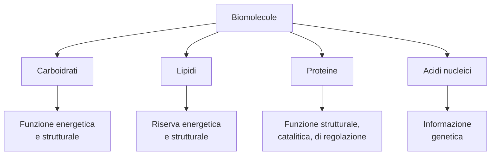
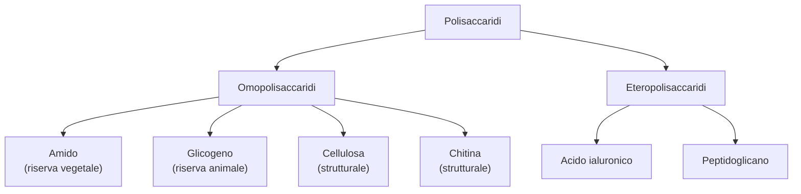
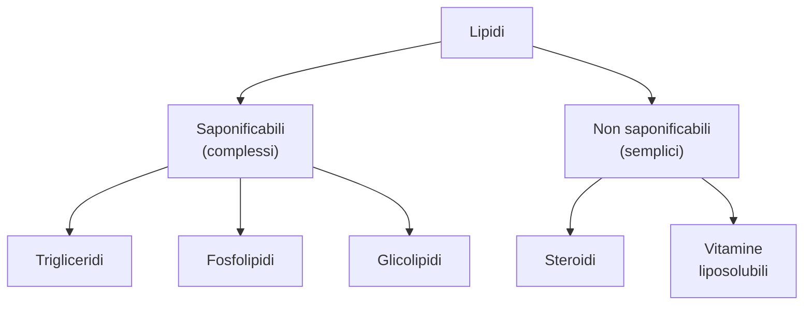

# Biomolecole

La **biochimica** (o chimica della vita) studia la struttura e la sintesi delle biomolecole, cioe' le molecole che costituiscono gli organismi viventi, e il **metabolismo cellulare**, cioe' l'insieme delle reazioni chimiche che si verificano in tutte le cellule.

Le biomolecole sono **composti organici polifunzionali** che formano la struttura delle cellule e svolgono un ruolo fondamentale nel metabolismo. Sono costituite da atomi di carbonio, idrogeno, ossigeno, zolfo e fosforo e si riconducono a **quattro classi fondamentali**:

Fanno da complemento a queste classi le **vitamine** e gli **ormoni**.

Molte biomolecole (carboidrati, proteine e acidi nucleici) sono **biopolimeri**, cioe' molecole grandi costituite dall'unione di un elevato numero di **monomeri**.

---

## I carboidrati

I **carboidrati** (o glicidi) sono biomolecole monomeriche o polimeriche costituite da uno o piu' gruppi ossidrilici (—OH) e da un gruppo aldeidico (—CHO) o un gruppo chetonico (C=O).

Sono composti organici costituiti da atomi di carbonio, idrogeno e ossigeno e hanno un'enorme importanza biologica per il loro ruolo **energetico** (glucosio, fruttosio), di **riserva energetica** (amido e glicogeno) e **strutturale** (cellulosa).

I carboidrati si classificano in base alla complessita' della loro struttura:

- i **monosaccaridi** sono i monomeri dei carboidrati
- gli **oligosaccaridi** sono costituiti dall'unione di due o pochi monosaccaridi
- i **polisaccaridi** sono i polimeri formati dall'unione di molti monosaccaridi

Le tre classi sono in relazione reciproca tramite la **reazione di condensazione** (unione tra due monosaccaridi con liberazione di una molecola d'acqua) e la reazione inversa di **idrolisi** (rottura del legame con aggiunta di acqua).

---

### Monosaccaridi: aldosi e chetosi

I **monosaccaridi** (o zuccheri semplici) sono i monomeri dei carboidrati e non sono ulteriormente scomponibili per idrolisi in composti piu' semplici.

Si distinguono in **aldosi e chetosi** a seconda che il gruppo carbonile presente sia aldeidico (—CHO) o chetonico (C=O). In base al numero di atomi di carbonio presenti nella molecola si classificano anche in **triosi** (3 C), **tetrosi** (4 C), **pentosi** (5 C), **esosi** (6 C).

| Tipo | Gruppo carbonile | Esempio di trioso |
|------|-----------------|-------------------|
| **Aldoso** | —CHO (aldeidico) | gliceraldeide |
| **Chetoso** | C=O (chetonico) | diidrossiacetone |

I monosaccaridi piu' diffusi sono i **pentosi** e gli **esosi**:

| Classe | Monosaccaridi importanti | Dove si trovano |
|--------|-------------------------|-----------------|
| Pentosi | **ribosio**, **desossiribosio** | RNA e DNA |
| Esosi (aldosi) | **glucosio**, **galattosio** | Frutta, latte |
| Esosi (chetosi) | **fruttosio** | Frutta, miele |

!!! note "Glucosio, galattosio e fruttosio"
    Questi tre esosi sono **isomeri di struttura**: hanno la stessa formula molecolare (C₆H₁₂O₆) ma una diversa disposizione degli atomi. Glucosio e galattosio sono aldosi, il fruttosio e' un chetoso.

### Le proiezioni di Fischer

Per rappresentare la struttura tridimensionale dei monosaccaridi su un foglio bidimensionale, il chimico tedesco Emil Fischer propose le **proiezioni di Fischer**: formule in cui lo stereocentro e' identificato dall'intersezione di due segmenti perpendicolari.

Per rappresentare le molecole:

1. Si dispone la catena carboniosa in verticale, con il gruppo carbonile **in alto**
2. Si omette il simbolo dell'atomo di carbonio che costituisce lo stereocentro
3. Si numerano gli atomi di carbonio **dall'alto verso il basso**

!!! abstract "Serie D e serie L"
    Fischer stabili' che la lettera **D** viene assegnata alla configurazione con il gruppo —OH situato **a destra** nell'ultimo stereocentro (quello piu' lontano dal gruppo carbonile), mentre la lettera **L** indica il gruppo —OH **a sinistra**. La maggior parte dei monosaccaridi presenti in natura e' della **serie D**.

### I monosaccaridi sono molecole chirali

I monosaccaridi (tranne il diidrossiacetone) hanno uno o piu' **stereocentri** (carboni legati a quattro gruppi diversi) e si presentano sotto forma di **enantiomeri**: molecole che sono l'una l'immagine speculare dell'altra, non sovrapponibili.

!!! tip "Diastereoisomeri ed epimeri"
    Gli stereoisomeri che **non** sono l'uno l'immagine speculare dell'altro si chiamano **diastereoisomeri**. I diastereoisomeri che differiscono per la posizione di **un solo** stereocentro si chiamano **epimeri**. Per esempio, il D-glucosio e il D-galattosio sono epimeri al C-4.

### La forma ciclica dei monosaccaridi

In acqua, la struttura prevalente dei monosaccaridi (tranne i triosi) non e' lineare ma **ciclica** (o **emiacetale**). Il gruppo carbonile reagisce con un gruppo ossidrile della stessa molecola, formando un anello:

- Negli **aldoesosi** (come il glucosio): si forma un anello a **6 atomi** (esatomico)
- Nei **chetoesosi** (come il fruttosio): si forma un anello a **5 atomi** (pentatomico)

La forma ciclica si rappresenta con le **proiezioni di Haworth**, in cui il lato dell'anello piu' vicino al lettore e' evidenziato con un tratto piu' spesso.

!!! note "Conformazione a sedia"
    Nella realta' la struttura ciclica non e' planare: a causa dell'ibridazione sp³ degli atomi di carbonio, i monosaccaridi assumono una conformazione tridimensionale **a sedia**, piu' stabile di quella a barca.

### L'anomeria

La ciclizzazione porta alla formazione di un nuovo stereocentro sul carbonio emiacetale, detto **carbonio anomerico**. Di conseguenza sono possibili due stereoisomeri, chiamati **anomeri**:

- **Anomero α**: il gruppo —OH del carbonio anomerico e' diretto verso il **basso** nell'anello (nelle proiezioni di Haworth)
- **Anomero β**: il gruppo —OH e' diretto verso l'**alto**

!!! info "La mutarotazione"
    In soluzione acquosa le due forme α e β si interconvertono l'una nell'altra attraverso la forma aperta. Questo fenomeno si chiama **mutarotazione**.

### Le reazioni dei monosaccaridi

#### Riduzione

In presenza di un riducente [H], il gruppo carbonile si riduce e si ottiene un poliolo (detto **alditolo**). Per esempio, la riduzione del D-glucosio porta alla formazione del **D-glucitolo** (noto come **sorbitolo**), usato come dolcificante alimentare.

#### Ossidazione

La reazione di ossidazione interessa il gruppo **aldeidico** degli aldosi. In presenza di un ossidante, il gruppo aldeidico si ossida formando **acidi aldonici**.

!!! example "Saggi di Tollens e Fehling"
    Sono due saggi di laboratorio per riconoscere gli zuccheri riducenti:

    - **Reattivo di Tollens**: contiene ioni Ag⁺ in ammoniaca. L'aldeide riduce l'argento, che si deposita come uno **specchio lucido** sulla provetta.
    - **Reattivo di Fehling**: contiene ioni Cu²⁺ (colore azzurro). L'aldeide li riduce a Cu₂O, che precipita come un solido **rosso mattone**.

!!! abstract "Zucchero riducente"
    Un aldoso che reagisce con il reattivo di Tollens o di Fehling si chiama **zucchero riducente**, in quanto l'ossidazione del gruppo aldeidico e' accompagnata dalla riduzione degli ioni argento o rame.

---

### I disaccaridi

I **disaccaridi** sono carboidrati costituiti da **due unita' di monosaccaridi** (uguali o diverse) uniti da un **legame glicosidico**.

Il legame glicosidico si forma tra il gruppo ossidrile del **carbonio anomerico** di un'unita' e un gruppo ossidrile dell'altra unita', con eliminazione di una molecola d'acqua (reazione di **condensazione**). Il legame puo' essere di tipo **α** o **β**, a seconda della configurazione del carbonio anomerico.

| Disaccaride | Composizione | Legame | Riducente? | Dove si trova |
|-------------|-------------|--------|------------|---------------|
| **Lattosio** | β-D-galattosio + β-D-glucosio | β(1→4) | Si' | Latte e derivati |
| **Maltosio** | α-D-glucosio + α-D-glucosio | α(1→4) | Si' | Amido, malto |
| **Saccarosio** | α-D-glucosio + β-D-fruttosio | α(1→2) | No | Canna da zucchero, barbabietola |
| **Cellobiosio** | β-D-glucosio + β-D-glucosio | β(1→4) | Si' | Cellulosa |

!!! warning "Saccarosio: zucchero non riducente"
    Il saccarosio e' l'unico tra i disaccaridi comuni a essere uno **zucchero non riducente**, perche' il legame glicosidico coinvolge i carboni anomerici di **entrambi** i monosaccaridi: non c'e' nessun gruppo emiacetale libero.

!!! info "La galattosemia"
    In alcuni bambini, subito dopo la nascita, si puo' manifestare la **galattosemia**, una malattia ereditaria causata dalla mancanza dell'enzima capace di isomerizzare il galattosio. E' necessario eliminare il latte dalla dieta.

I disaccaridi si scindono nei due monosaccaridi costituenti per **idrolisi** (reazione con acqua in presenza di un catalizzatore acido o di un enzima).

---

### I polisaccaridi

I **polisaccaridi** sono carboidrati costituiti da un numero elevato di monosaccaridi legati tra loro da legami glicosidici a formare lunghe catene. Si distinguono in:

- **Omopolisaccaridi**: i monosaccaridi costituenti sono tutti uguali
- **Eteropolisaccaridi**: i monosaccaridi sono diversi

Gli omopolisaccaridi piu' diffusi sono tutti **omopolimeri del glucosio** e sono tutti zuccheri **non riducenti** (non hanno gruppi emiacetali liberi, tranne in fondo alla catena).

#### L'amido

L'**amido** e' il piu' importante carboidrato di riserva energetica negli **organismi vegetali**. E' formato da unita' di α-D-glucosio ed e' costituito da una miscela di due polimeri:

- **Amilosio**: catene **lineari** di unita' di glucosio unite da legami α(1→4). E' solubile in acqua.
- **Amilopectina**: polimero **ramificato** con legami α(1→4) nella catena principale e ramificazioni ogni 24-30 unita' tramite legami α(1→6). E' insolubile in acqua.

#### Il glicogeno

Il **glicogeno** svolge funzione di **riserva energetica** negli **organismi animali**, dove e' presente nel **fegato** e nei **muscoli**. Ha una struttura analoga a quella dell'amilopectina ma **molto piu' ramificata** (ramificazioni ogni 8-14 unita'). Il glicogeno si forma quando il glucosio assunto con gli alimenti e' in eccesso; quando le cellule hanno bisogno di energia, viene riconvertito in glucosio.

#### La cellulosa

La **cellulosa** e' un polisaccaride insolubile in acqua che ha la funzione di **sostegno** nelle piante, costituendo la **parete cellulare**. E' formata da unita' di β-D-glucosio legate da legami **β(1→4)**, che formano catene lineari unite fra loro da **legami a idrogeno**.

!!! warning "Perche' non digeriamo la cellulosa?"
    Il nostro organismo e' in grado di digerire l'amido e il glicogeno (legami α-glicosidici), ma **non la cellulosa** perche' il nostro apparato digerente non possiede enzimi capaci di catalizzare l'idrolisi dei legami **β-glicosidici**. Solo pochi organismi, come i batteri e i funghi, possiedono l'enzima specifico.

#### La chitina

La **chitina** e' un omopolimero con funzione strutturale costituito da molecole di **N-acetilglucosammina** unite da legami β(1→4). E' il componente principale dell'**esoscheletro** di crostacei e insetti e della parete cellulare dei funghi.

#### Gli eteropolisaccaridi

- **Acido ialuronico**: si trova nel liquido sinoviale delle articolazioni e nell'umor vitreo dell'occhio.
- **Peptidoglicano**: componente principale della **parete cellulare dei batteri**, costituito da catene in cui si alternano N-acetilglucosammina e acido N-acetilmuramico, unite da brevi catene di amminoacidi.

---

## I lipidi

I **lipidi** sono una vasta classe di composti chimicamente eterogenei per struttura e proprieta', che presentano tutti la caratteristica di essere **insolubili in acqua** e **solubili in solventi organici apolari**.

Sono composti organici costituiti da atomi di carbonio, idrogeno e ossigeno. Si dividono in due grandi gruppi:

- I lipidi **saponificabili** contengono acidi grassi e per idrolisi basica formano i sali corrispondenti (saponi)
- I lipidi **non saponificabili** non contengono acidi grassi e non formano saponi

I lipidi rappresentano la principale forma di **riserva energetica** (trigliceridi), hanno un importante **ruolo strutturale** (fosfolipidi nelle membrane cellulari) e svolgono funzione di **regolazione** (ormoni steroidei e vitamine liposolubili).

---

### I trigliceridi

I **trigliceridi** (o triacilgliceroli) sono costituiti da una molecola di **glicerolo** e **tre molecole di acidi grassi**, uniti tramite tre legami estere.

La reazione tra il glicerolo e gli acidi grassi e' una **sostituzione nucleofila acilica** (esterificazione), che comporta l'eliminazione di tre molecole d'acqua (condensazione).

I trigliceridi svolgono tre funzioni biologiche fondamentali:

1. Costituiscono un'importante **riserva energetica** (1 g di trigliceridi fornisce circa il **doppio** dell'energia di 1 g di carboidrati)
2. Formano il **tessuto adiposo sottocutaneo** negli animali, che protegge dal freddo (**isolamento termico**)
3. Rappresentano il veicolo per l'**assorbimento delle vitamine liposolubili** a livello intestinale

### Gli acidi grassi

Gli **acidi grassi** sono acidi carbossilici con una catena idrocarburica che contiene da 4 a 36 atomi di carbonio (di solito un numero **pari**, da 12 a 24). Si dividono in due classi:

| Tipo | Catena | Stato fisico | Esempio | Fonte |
|------|--------|-------------|---------|-------|
| **Saturi** | Solo legami semplici C—C, catena lineare | Solidi (**grassi**) | Acido stearico (C18) | Animali |
| **Insaturi** | Uno o piu' doppi legami C=C (configurazione *cis*) | Liquidi (**oli**) | Acido oleico (C18, 1 doppio legame) | Vegetali |

!!! note "Perche' i grassi saturi sono solidi e gli oli sono liquidi?"
    Gli acidi grassi **saturi** hanno catene lineari che si impacchettano bene, formando numerose interazioni dipolari: i composti sono **solidi** con punto di fusione alto. Gli acidi grassi **insaturi** hanno dei "punti di discontinuita'" (pieghe) nei doppi legami *cis*, che impediscono l'impacchettamento ordinato: sono quindi **liquidi** con punto di fusione basso.

!!! warning "Acidi grassi essenziali"
    L'**acido linoleico** e l'**acido linolenico** sono **acidi grassi essenziali**: il nostro organismo non e' in grado di sintetizzarli e devono essere assunti con gli alimenti. Sono necessari per produrre molecole coinvolte nella coagulazione del sangue e nella risposta infiammatoria.

### Le reazioni dei trigliceridi

#### Idrogenazione

La reazione di **idrogenazione** trasforma gli acidi grassi insaturi degli oli in acidi grassi saturi. La reazione avviene per addizione di idrogeno, in presenza di un catalizzatore metallico, ai doppi legami carbonio-carbonio. Idrogenando l'olio si ottiene un grasso vegetale noto come **margarina**.

#### Idrolisi alcalina (saponificazione)

La reazione di **idrolisi alcalina** dei trigliceridi avviene fornendo calore e in presenza di basi forti (NaOH, KOH). Il processo, chiamato anche **saponificazione**, porta alla formazione di **glicerolo** e **sali di acidi grassi**, noti commercialmente come **saponi**.

!!! example "Come funziona il sapone?"
    La molecola di sapone e' **anfipatica**: ha una lunga coda idrocarburica **apolare** (idrofobica) e una testa polare **idrofila** (il gruppo carbossilato COO⁻).

    In acqua, le code idrofobiche si associano a formare sfere chiamate **micelle**, con le teste idrofile verso l'esterno. Quando il sapone incontra il grasso, le code idrofobiche penetrano nella gocciolina di grasso e le teste idrofile si dispongono all'esterno, formando un'**emulsione** che permette al grasso di essere allontanato con l'acqua.

---

### I fosfolipidi

I **fosfolipidi** sono lipidi costituiti da una **testa polare** (idrofila) e da una **coda apolare** (idrofobica). Essendo formati da una regione idrofila e una idrofobica, sono molecole **anfipatiche**. Si distinguono in **glicerofosfolipidi** e **sfingolipidi**.

#### I glicerofosfolipidi

I **glicerofosfolipidi** (o fosfogliceridi) sono costituiti da una molecola di glicerolo, **due** molecole di acidi grassi, un **gruppo fosfato** e un **amminoalcol**. Gli amminoalcoli piu' comuni sono l'**etanolammina** e la **colina**.

Sono i lipidi piu' abbondanti in natura dopo i trigliceridi e sono i **principali componenti delle membrane cellulari**: si dispongono in un **doppio strato** con le code idrofobiche rivolte verso l'interno e le teste idrofile verso l'esterno (verso gli ambienti acquosi).

#### Gli sfingolipidi

Gli **sfingolipidi** sono costituiti da una molecola di **sfingosina** (un amminoalcol insaturo), una molecola di acido grasso e un gruppo fosfato legato a un amminoalcol. Sono presenti a concentrazioni molto elevate nella **guaina mielinica** che riveste gli assoni dei neuroni.

---

### I glicolipidi

I **glicolipidi** (o glicosfingolipidi) sono costituiti da una molecola di sfingosina, un acido grasso e un **carboidrato** (un monosaccaride come glucosio o galattosio, oppure un oligosaccaride). Sono molecole **anfipatiche**.

Si distinguono in:

- **Gangliosidi**: funzionano da siti di riconoscimento per molecole specifiche, come gli ormoni
- **Cerebrosidi**: presenti sulle membrane dei neuroni, costituiscono i recettori per i **neurotrasmettitori**

I glicolipidi sono presenti anche sulle membrane dei **globuli rossi**, dove svolgono un ruolo fondamentale per la determinazione del **gruppo sanguigno AB0**.

---

### Gli steroidi

Gli **steroidi** sono composti che derivano da un idrocarburo policiclico chiamato **sterano**, formato da quattro anelli condensati (tre esatomici e uno pentatomico).

#### Il colesterolo

Il **colesterolo** e' lo steroide piu' abbondante nei tessuti animali. La sua molecola presenta un gruppo alcolico —OH, un doppio legame, una catena alifatica e due sostituenti metilici.

Il colesterolo e':

- Un importante **costituente delle membrane cellulari**, di cui regola la fluidita'
- Il componente di partenza per la sintesi degli **acidi biliari**, degli **ormoni steroidei** e della **vitamina D**

!!! warning "Colesterolo e salute"
    Il trasporto del colesterolo nel sangue avviene mediante le **lipoproteine**: le **LDL** (a bassa densita') trasportano il colesterolo dal fegato ai tessuti, le **HDL** (ad alta densita') lo prelevano e lo riportano al fegato. Quando il colesterolo e' in eccesso (**ipercolesterolemia**), le LDL lo depositano nelle arterie causando rigidita' e ispessimento delle pareti (**aterosclerosi**), con rischio di infarto e ipertensione.

#### Gli acidi biliari

Gli **acidi biliari** sono acidi carbossilici steroidei che derivano dall'ossidazione del colesterolo. Il piu' comune e' l'**acido colico**. I sali biliari, presenti nella bile, sono in grado di **emulsionare** i trigliceridi nell'intestino, facilitando la digestione dei grassi.

#### Gli ormoni steroidei

Fanno parte degli ormoni steroidei gli **ormoni sessuali** e gli **ormoni corticosurrenali**.

**Ormoni sessuali**: prodotti dalle gonadi (ovaie nelle femmine e testicoli nei maschi), stimolano lo sviluppo dei **caratteri sessuali** primari e secondari.

| Classe | Ormone principale | Prodotto da | Funzione |
|--------|------------------|-------------|----------|
| Androgeni | **Testosterone** | Testicoli | Differenziazione apparato genitale, spermatogenesi |
| Estrogeni | **Progesterone** | Ovaie | Ciclo ovarico-uterino, caratteri sessuali femminili |

**Ormoni corticosurrenali**: prodotti dalle ghiandole surrenali:

- **Glucocorticoidi** (cortisolo, cortisone): favoriscono la formazione di glucosio a partire dagli amminoacidi (gluconeogenesi)
- **Mineralcorticoidi** (aldosterone): responsabili del riassorbimento del sodio Na⁺ nei tubuli renali del nefrone

---

### Le vitamine liposolubili

Le **vitamine liposolubili** (A, D, E, K) sono molecole organiche indispensabili per regolare numerosi processi metabolici. Sono **molecole essenziali**: devono essere introdotte con gli alimenti perche' non possono essere sintetizzate dall'organismo.

| Vitamina | Nome chimico | Dove si trova | Funzione | Carenza provoca |
|----------|-------------|---------------|----------|-----------------|
| **A** | Retinolo | Fegato, uova, carote (β-carotene) | Funzione protettiva tessuti epiteliali, vista | Cecita' notturna |
| **D** | Calciferolo | Latte, uova; sintetizzata dalla cute con raggi UV | Deposizione di Ca²⁺ e fosfato nelle ossa | Rachitismo (bambini), osteoporosi (adulti) |
| **E** | Tocoferolo | Oli vegetali, frutta secca | **Antiossidante**, protegge le membrane cellulari | Danni ai fosfolipidi delle membrane |
| **K** | Naftochinone | Vegetali a foglia verde, flora batterica intestinale | Sintesi della **protrombina** (coagulazione) | Rischio di emorragie |

---

## Gli amminoacidi e le proteine

### Gli amminoacidi sono i monomeri delle proteine

Gli **amminoacidi** rappresentano i monomeri dei **peptidi** e delle **proteine**, polimeri in cui e' presente il legame peptidico.

Oltre a formare peptidi e proteine, gli amminoacidi partecipano anche a molte altre funzioni biologiche:

- L'acido **γ-amminobutirrico (GABA)** e la **dopamina** sono **neurotrasmettitori**
- L'**istamina** e' un **mediatore dell'infiammazione** e delle reazioni allergiche
- La **tiroxina** e' un **ormone** tiroideo coinvolto nella regolazione del metabolismo
- La **niacina** (un derivato del triptofano) e' una vitamina idrosolubile

### Struttura degli amminoacidi

Gli amminoacidi sono composti **bifunzionali**, cioe' contengono due gruppi funzionali: il gruppo carbossilico (—COOH) e il gruppo amminico (—NH₂).

Gli amminoacidi che costituiscono le proteine sono **20**, di cui **8 sono essenziali** (l'organismo non e' in grado di sintetizzarli e devono essere assunti con gli alimenti). Sono tutti **α-amminoacidi**: i due gruppi funzionali sono legati allo stesso atomo di carbonio (il carbonio α), a cui sono anche legati un atomo di H e un **gruppo R** (catena laterale) diverso per ogni amminoacido.

!!! abstract "La formula generale degli α-amminoacidi"
    Ogni α-amminoacido ha la struttura:

    - Un **carbonio α** centrale
    - Un gruppo **—NH₂** (amminico)
    - Un gruppo **—COOH** (carbossilico)
    - Un atomo di **H**
    - Un **gruppo R** (catena laterale) che e' diverso per ciascuno dei 20 amminoacidi e ne determina le proprieta' specifiche

### Classificazione degli amminoacidi

Le proprieta' chimiche della catena laterale R permettono di distinguere gli amminoacidi in due classi: **apolari** e **polari**.

| Classe | Caratteristiche | Esempi |
|--------|----------------|--------|
| **Apolari** | Catena laterale alifatica o aromatica, idrofobici | Glicina (Gly), Alanina (Ala), Valina (Val), Leucina (Leu), Isoleucina (Ile), Fenilalanina (Phe) |
| **Polari non carichi** | Gruppi funzionali con O, N o S; idrofili | Serina (Ser), Cisteina (Cys), Asparagina (Asn), Glutammina (Gln), Treonina (Thr), Tirosina (Tyr) |
| **Polari carichi positivamente** (basici) | Catena laterale con gruppo amminico, carica positiva | Lisina (Lys), Istidina (His), Arginina (Arg) |
| **Polari carichi negativamente** (acidi) | Catena laterale con gruppo carbossile, carica negativa | Acido aspartico (Asp), Acido glutammico (Glu) |

### Gli amminoacidi sono molecole chirali

Tutti gli α-amminoacidi (tranne la **glicina**) sono molecole **chirali**: il carbonio α e' legato a quattro gruppi diversi ed e' quindi uno stereocentro. Si presentano sotto forma di due enantiomeri (configurazione D e L). Tutti gli amminoacidi naturali hanno la **configurazione L**.

### La struttura ionica dipolare (zwitterione)

A **pH fisiologico**, negli amminoacidi si verifica una reazione intramolecolare acido-base: il gruppo —COOH cede un H⁺ al gruppo —NH₂. Si forma uno **zwitterione** (ione dipolare), cioe' uno ione con **due cariche opposte** sullo stesso molecola:

- Il gruppo carbossilico diventa **—COO⁻** (carica negativa)
- Il gruppo amminico diventa **—NH₃⁺** (carica positiva)

### Gli amminoacidi sono composti anfoteri

Gli amminoacidi nella forma ionica dipolare possono reagire sia con gli acidi sia con le basi:

- In **soluzione basica** (OH⁻): cedono un H⁺ → forma **anionica** (carica negativa)
- In **soluzione acida** (H₃O⁺): accettano un H⁺ → forma **cationica** (carica positiva)

!!! abstract "Il punto isoelettrico (pI)"
    Il **punto isoelettrico** (pI) e' il valore di pH specifico per ogni amminoacido in corrispondenza del quale l'amminoacido si trova nella forma ionica dipolare e ha **carica complessiva uguale a zero**.

    - A pH < pI → l'amminoacido e' nella forma **protonata** (carica positiva)
    - A pH > pI → l'amminoacido e' nella forma **deprotonata** (carica negativa)

    In base al valore del pI, gli amminoacidi si distinguono in: amminoacidi **neutri** (pI tra 5 e 6,5), **acidi** (pI molto basso, 3-3,2) e **basici** (pI molto alto, 7,6-10,8).

---

### Il legame peptidico

Il **legame peptidico** e' un legame covalente che si forma tra due amminoacidi (uguali o diversi). Si stabilisce tra il carbonio del gruppo carbossilico (—COOH) di un amminoacido e l'azoto del gruppo amminico (—NH₂) di un secondo amminoacido, con **eliminazione di una molecola d'acqua** (reazione di condensazione).

Per convenzione, il dipeptide si scrive mettendo a **sinistra** l'amminoacido con il gruppo amminico libero (**amminoacido N-terminale**) e a **destra** quello con il gruppo carbossilico libero (**amminoacido C-terminale**).

!!! note "Il legame peptidico e' rigido"
    Il legame C—N del legame peptidico ha una lunghezza intermedia tra un legame singolo e uno doppio: per effetto della **risonanza**, il legame C—N e' **rigido** e non puo' ruotare. Il gruppo peptidico assume quindi una disposizione **planare**.

I **peptidi** sono biopolimeri distinti in **oligopeptidi** (2-10 amminoacidi) e **polipeptidi** (11-80 amminoacidi). Le **proteine** sono biopolimeri formati da catene di piu' di 80 amminoacidi.

Il numero di peptidi diversi che si possono ottenere con *m* amminoacidi e' dato da: \( n = 1 \cdot 2 \cdot 3 \cdot \ldots \cdot m \) (cioe' *m*!)

### Il legame disolfuro

Tra due amminoacidi di **cisteina** (che hanno il gruppo —SH nella catena laterale) si puo' formare un **legame disolfuro** (S—S), un legame covalente singolo tra due atomi di zolfo. Si forma per ossidazione (deidrogenazione) dei due gruppi —SH.

Il legame disolfuro e' fondamentale perche' provoca un **ripiegamento della catena proteica**, contribuendo alla conformazione tridimensionale della proteina.

---

### La classificazione delle proteine

Le **proteine** sono biopolimeri formati da molti amminoacidi (piu' di 80) uniti tra loro da legami peptidici.

#### Per composizione chimica

- **Proteine semplici**: formate solo da amminoacidi
- **Proteine coniugate**: formate da amminoacidi e da un **gruppo prostetico** (un componente non proteico), che puo' essere un lipide (*lipoproteine*), un glucide (*glicoproteine*), un acido nucleico (*nucleoproteine*) o un metallo (*metalloproteine*)

#### Per funzione biologica

| Funzione | Esempio |
|----------|---------|
| **Strutturale** | Cheratina (capelli, unghie), collagene, fibroina (seta) |
| **Catalitica** | Enzimi |
| **Contrattile e di movimento** | Actina e miosina (muscoli), tubulina (ciglia) |
| **Trasporto** | Emoglobina (trasporta O₂ nel sangue) |
| **Riserva** | Ferritina (accumula ferro), ovoalbumina (uova) |
| **Difesa** | Anticorpi (immunoglobuline) |
| **Regolazione** | Ormoni (insulina, ossitocina) |

#### Per forma

- **Proteine fibrose**: catene polipeptidiche disposte le une accanto alle altre, legate da legami disolfuro o a idrogeno, a costituire un filamento. Esempio: cheratina, collagene, fibroina.
- **Proteine globulari**: catene polipeptidiche ripiegate su se stesse in strutture compatte, di forma sferica. Esempio: enzimi, ormoni, emoglobina, anticorpi.

---

### La struttura delle proteine

Esaminando una proteina nella sua configurazione spaziale, si possono individuare **quattro livelli** di organizzazione strutturale.

#### Struttura primaria

La **struttura primaria** e' definita dalla **sequenza di amminoacidi** legati con legami peptidici nella catena polipeptidica. Ogni proteina ha la sua sequenza specifica e da essa dipende la funzione biologica.

!!! warning "L'anemia falciforme"
    Nell'emoglobina, la sostituzione di **un solo amminoacido** (un acido glutammico con una valina) fa assumere ai globuli rossi una forma a falce, causando una grave patologia chiamata **anemia falciforme**. Questo dimostra quanto sia cruciale la struttura primaria.

#### Struttura secondaria

La **struttura secondaria** e' definita dalla disposizione spaziale della catena polipeptidica, stabilizzata da **legami a idrogeno** tra il gruppo C=O di un amminoacido e il gruppo —NH di un altro.

Si presenta in due configurazioni principali:

| Configurazione | Descrizione | Proteine tipiche |
|---------------|-------------|-----------------|
| **α-elica** | Catena avvolta a spirale in senso antiorario; i gruppi R sono diretti verso l'esterno. Molto compatta e flessibile. | Cheratina, elastina |
| **β-foglietto** | Tratti (filamenti β) della catena disposti parallelamente, legati da legami a idrogeno tra i gruppi C=O e —NH. I gruppi R sono alternati sopra e sotto. | Fibroina (seta) |

Una stessa proteina puo' presentare sia regioni ad α-elica sia regioni a β-foglietto.

#### Struttura terziaria

La **struttura terziaria** e' definita dalla forma che la proteina assume dopo essere stata stabilizzata da diversi tipi di legami e interazioni tra le catene laterali R degli amminoacidi:

- **Legami a idrogeno**
- **Legami disolfuro** (S—S tra due cisteine)
- **Interazioni ioniche** (tra gruppi R con cariche opposte)
- **Interazioni di van der Waals** (tra gruppi R apolari)

Nella struttura terziaria le catene laterali **idrofobiche** si posizionano all'**interno** della proteina, mentre quelle **idrofile** si dispongono all'**esterno**, a contatto con l'acqua.

!!! info "Il folding"
    Una proteina e' in grado di svolgere la sua attivita' biologica solo quando ha assunto la sua struttura tridimensionale definitiva, chiamata **folding proteico**.

#### Struttura quaternaria

La **struttura quaternaria** e' definita dall'associazione di **due o piu' catene polipeptidiche** (subunita') stabilizzata da legami a idrogeno, interazioni tra gruppi R apolari e legami disolfuro.

!!! example "L'emoglobina"
    L'**emoglobina** e' un esempio di proteina con struttura quaternaria: e' costituita da **quattro catene polipeptidiche** (due α e due β), ciascuna legata a un gruppo prostetico chiamato **eme**, che contiene uno ione ferro Fe²⁺ responsabile del legame con l'ossigeno.

### La denaturazione delle proteine

I legami chimici che stabilizzano la struttura secondaria, terziaria e quaternaria sono legami **deboli**. Di conseguenza, alcuni fattori possono romperli causando la perdita della struttura e della funzione della proteina. Questo processo si chiama **denaturazione**.

Fattori che causano la denaturazione:

- **Temperature elevate** (aumentano l'energia cinetica)
- **Valori estremi di pH** (cambiano la dissociazione dei gruppi carichi)
- **Solventi organici** (modificano la disposizione dei gruppi idrofili e idrofobici)

!!! warning "La denaturazione e' irreversibile"
    Quando una proteina si denatura, forma nuovi legami intramolecolari e intermolecolari: il processo e' **irreversibile**. Un esempio quotidiano: quando cucini un uovo, l'albumina (la proteina dell'albume) si denatura per il calore e non torna piu' allo stato liquido.

---

## Gli enzimi

### Gli enzimi sono catalizzatori biologici

Gli **enzimi** sono una classe di proteine altamente specializzate che svolgono la funzione di **catalizzatori biologici** nel metabolismo cellulare. Possono svolgere questa funzione anche molecole di RNA, chiamate **ribozimi**.

L'attivita' catalitica degli enzimi consiste nell'**aumentare la velocita'** delle reazioni metaboliche in due modi:

- Indebolendo i **legami chimici** dei reagenti nelle reazioni cataboliche
- Favorendo l'**orientazione** delle molecole dei reagenti nelle reazioni anaboliche

Gli enzimi svolgono la loro funzione legandosi in modo specifico alle molecole dei reagenti (i **substrati**) e trasformandoli in **prodotti**.

### Il nome degli enzimi

Il **nome comune** e' costituito da una radice (spesso il nome del substrato) seguita dal suffisso **-asi** (per indicare che la molecola enzimatica e' una proteina). Esempio: l'**amilasi** e' un enzima che idrolizza l'amido in maltosio.

Il **nome sistematico** e' costituito da un prefisso (la radice del substrato) e dalla desinenza **-asi**, con indicazione del tipo di reazione catalizzata.

### Cofattori enzimatici

La maggior parte degli enzimi richiede l'intervento di **cofattori** per svolgere la catalisi. I cofattori sono ioni metallici o molecole organiche che attivano gli enzimi e si dividono in:

| Tipo | Cosa sono | Esempi |
|------|-----------|--------|
| **Attivatori** | Ioni metallici che si legano all'enzima | Fe²⁺, Cu²⁺, Mg²⁺, Zn²⁺ |
| **Coenzimi** | Molecole organiche che funzionano da trasportatori di gruppi funzionali, protoni o elettroni | NAD⁺, FAD, CoA |

!!! note "NAD⁺ e FAD"
    Il **NAD⁺** (nicotinammide adenindinucleotide) e il **FAD** (flavin adenindinucleotide) sono coenzimi fondamentali nelle reazioni di **ossidoriduzione** del metabolismo energetico:

    - Il NAD⁺ nella forma **ossidata** accetta due atomi di idrogeno → diventa **NADH** (forma ridotta)
    - Il FAD nella forma **ossidata** accetta due atomi di idrogeno → diventa **FADH₂** (forma ridotta)

    La proteina enzimatica non legata al cofattore si chiama **apoenzima** (inattiva). Il complesso cataliticamente attivo (apoenzima + cofattore) si chiama **oloenzima**.

### L'energia di attivazione

L'**energia di attivazione** (E~a~) e' il valore minimo di energia che le molecole dei reagenti devono avere per potersi trasformare nelle molecole dei prodotti. I reagenti devono superare una "barriera energetica" passando attraverso uno stato intermedio instabile chiamato **complesso attivato**.

!!! abstract "Reazioni esoergoniche ed endoergoniche"
    - **Reazione esoergonica**: i prodotti hanno un'energia potenziale **minore** dei reagenti → si libera energia termica
    - **Reazione endoergonica**: i prodotti hanno un'energia potenziale **maggiore** dei reagenti → si assorbe energia termica

    Il **profilo di reazione** e' un diagramma che rappresenta la variazione di energia potenziale in funzione del tempo di reazione.

Il ruolo degli enzimi e' quello di **abbassare l'energia di attivazione** (E~a~) della reazione, permettendo alle molecole del substrato di superare piu' facilmente la barriera energetica e trasformarsi nei prodotti.

### L'azione catalitica di un enzima

Il meccanismo di reazione catalizzata da un enzima comprende tre stadi:

1. **Formazione del complesso enzima-substrato (ES)**: l'enzima orienta il substrato per una corretta interazione e si combina con esso. I legami tra enzima e substrato sono **interazioni deboli** (legami a idrogeno, interazioni dipolari).

2. **Formazione del complesso enzima-prodotto (EP)**: il substrato si trasforma nel prodotto, con un'energia di attivazione **minore** di quella che servirebbe senza l'enzima.

3. **Distacco del prodotto**: il prodotto ha caratteristiche chimiche diverse dal substrato, si riduce l'affinita' con l'enzima e si ha il distacco dal sito attivo. L'enzima puo' cosi' catalizzare una **nuova reazione**.

In sintesi: **E + S → ES → EP → E + P**

### Gli enzimi hanno un'elevata specificita'

#### Specificita' di substrato

Il **sito attivo** e' una piccola regione dell'enzima dalla configurazione ben definita, entro la quale si trovano le catene laterali degli amminoacidi che partecipano alla catalisi.

La specificita' di un enzima dipende dalla configurazione spaziale del sito attivo, la cui conformazione consente il legame con un **unico substrato**. L'interazione tra enzima e substrato e' spiegata dal **modello dell'adattamento indotto**: il substrato induce un cambiamento conformazionale nell'enzima, che si adatta in modo complementare al substrato.

#### Specificita' di reazione

La specificita' di un enzima e' legata anche al **tipo di reazione** catalizzata. Gli enzimi si classificano in **sei classi**:

| Classe | Tipo di reazione |
|--------|-----------------|
| **Ossidoreduttasi** | Ossidazione e riduzione |
| **Trasferasi** | Trasferimento di gruppi funzionali tra due molecole |
| **Idrolasi** | Idrolisi (rottura di legami con aggiunta di acqua) |
| **Liasi** | Rottura o formazione di un doppio legame |
| **Isomerasi** | Trasferimento di atomi all'interno di una stessa molecola (isomerizzazione) |
| **Ligasi** | Sintesi (unione di due molecole) |

### L'attivita' enzimatica

L'**attivita' enzimatica** (o attivita' catalitica) e' definita come la **quantita' di substrato che viene trasformato in prodotto nell'unita' di tempo**. Dipende da diversi fattori:

#### Effetto della temperatura

La velocita' di reazione aumenta con la temperatura fino a raggiungere un massimo, detto **temperatura ottimale**. Oltre quel valore, la velocita' diminuisce drasticamente perche' i legami deboli della proteina si rompono → **denaturazione** dell'enzima.

!!! tip "Temperatura ottimale"
    Per gli enzimi delle nostre cellule, la temperatura ottimale e' di **37 °C** (la temperatura corporea). Per i batteri termofili che vivono nelle sorgenti termali, puo' arrivare a 80 °C.

#### Effetto del pH

Ogni enzima ha un **pH ottimale** al quale corrisponde la massima attivita' catalitica:

| Enzima | pH ottimale |
|--------|-------------|
| Pepsina (stomaco) | 1,5 |
| Maltasi | 6,0 |
| Amilasi salivare | 6,7 |
| Chimotripsina | 7,8 |
| Lipasi | 8,0 |

#### Effetto della concentrazione dell'enzima e del substrato

- **Concentrazione dell'enzima**: a parita' di substrato disponibile, all'aumentare della concentrazione dell'enzima aumenta l'attivita' catalitica (relazione lineare).
- **Concentrazione del substrato**: all'aumentare della concentrazione del substrato, la velocita' di reazione aumenta fino a raggiungere un valore massimo (V~max~) e poi rimane costante. Questo andamento si chiama **curva di saturazione**: quando tutti i siti attivi degli enzimi sono occupati, l'enzima e' **saturo** e la velocita' non puo' piu' aumentare.

### La regolazione dell'attivita' enzimatica

L'attivita' degli enzimi all'interno di una cellula puo' essere modulata per rispondere alle esigenze metaboliche. I principali meccanismi di regolazione sono gli **effettori allosterici** e gli **inibitori enzimatici**.

#### Gli effettori allosterici

Gli **effettori allosterici** sono molecole che si legano in modo specifico, ma **non covalentemente**, all'enzima inducendo un cambiamento conformazionale:

- **Effettori positivi**: aumentano la capacita' del sito attivo di legarsi al substrato → **aumentano** l'attivita'
- **Effettori negativi**: diminuiscono la capacita' del sito attivo → **diminuiscono** l'attivita'

Un enzima la cui attivita' e' stimolata o inibita dalla presenza di un effettore allosterico si chiama **enzima allosterico**. Gli effettori si legano in modo **reversibile** agli enzimi, costituendo un importante sistema di **controllo molecolare** delle vie metaboliche.

#### Gli inibitori enzimatici

Gli **inibitori enzimatici** sono molecole che interferiscono con l'attivita' catalitica degli enzimi, riducendola.

| Tipo | Come agisce | Reversibile? |
|------|-------------|-------------|
| **Irreversibile** | Forma un legame **covalente** con gli amminoacidi del sito attivo, modificandolo permanentemente | No |
| **Reversibile competitivo** | Ha una forma simile al substrato, si lega al **sito attivo** al posto del substrato con un legame non covalente | Si' |
| **Reversibile non competitivo** | Si lega in un **sito diverso** dal sito attivo, causando un cambiamento conformazionale che impedisce il legame del substrato | Si' |

!!! warning "Il DFP: un inibitore irreversibile pericoloso"
    Il **diisopropil fluorofosfato (DFP)** e' un inibitore irreversibile che blocca l'enzima **acetilcolinesterasi**, responsabile della degradazione dell'acetilcolina nelle sinapsi colinergiche. Il blocco di questo enzima impedisce la trasmissione corretta degli impulsi nervosi. Il DFP e' stato usato come componente di **gas nervini**.

---

## Checklist

- [x] Introduzione alla biochimica e classificazione delle biomolecole
- [x] Carboidrati: monosaccaridi, aldosi e chetosi
- [x] Proiezioni di Fischer, chiralita', serie D e L
- [x] Forma ciclica, proiezioni di Haworth, anomeria e mutarotazione
- [x] Reazioni dei monosaccaridi: riduzione e ossidazione
- [x] Disaccaridi: lattosio, maltosio, saccarosio, cellobiosio
- [x] Polisaccaridi: amido, glicogeno, cellulosa, chitina
- [x] Eteropolisaccaridi: acido ialuronico, peptidoglicano
- [x] Lipidi: classificazione in saponificabili e non saponificabili
- [x] Trigliceridi: struttura, acidi grassi saturi e insaturi
- [x] Reazioni dei trigliceridi: idrogenazione e saponificazione
- [x] Fosfolipidi e membrana cellulare
- [x] Glicolipidi, steroidi, colesterolo
- [x] Ormoni steroidei e vitamine liposolubili
- [x] Amminoacidi: struttura, classificazione, chiralita'
- [x] Zwitterione, comportamento anfotero, punto isoelettrico
- [x] Legame peptidico e legame disolfuro
- [x] Classificazione e funzioni delle proteine
- [x] Struttura delle proteine: primaria, secondaria, terziaria, quaternaria
- [x] Denaturazione delle proteine
- [x] Enzimi: catalizzatori biologici, cofattori e coenzimi
- [x] Energia di attivazione e azione catalitica
- [x] Specificita' degli enzimi, le sei classi
- [x] Attivita' enzimatica: temperatura, pH, concentrazione
- [x] Regolazione enzimatica: effettori allosterici e inibitori

## Collegamenti

- **Chimica organica**: i carboidrati sono poliidrossialdeidi o poliidrossichetoni — collegamento diretto con i gruppi funzionali studiati nei derivati degli idrocarburi (aldeidi, chetoni, alcoli, acidi carbossilici, esteri, ammidi); il legame peptidico e' un legame ammidico; i trigliceridi sono esteri del glicerolo
- **Fisica**: le proprieta' ottiche dei monosaccaridi (rotazione del piano della luce polarizzata) si collegano all'ottica e alla natura ondulatoria della luce; le interazioni deboli che stabilizzano le proteine (legami a idrogeno, forze di van der Waals) si collegano all'elettrostatica
- **Biologia**: il DNA e l'RNA contengono i pentosi desossiribosio e ribosio; l'emoglobina e' fondamentale per il trasporto dell'ossigeno; gli enzimi catalizzano tutte le reazioni metaboliche (glicolisi, ciclo di Krebs, catena respiratoria)
- **Educazione civica e salute**: l'ipercolesterolemia e le malattie cardiovascolari; l'importanza di una dieta equilibrata (acidi grassi essenziali, vitamine); le intolleranze alimentari (galattosemia, intolleranza al lattosio); i gas nervini come armi chimiche e le convenzioni internazionali che li vietano
- **Italiano/Filosofia**: il concetto di "struttura e funzione" nelle proteine richiama il rapporto forma-contenuto in letteratura e il concetto di finalismo in filosofia (Aristotele); la scoperta degli enzimi e della catalisi biologica rivoluziono' la visione meccanicistica della vita
- **Storia**: la scoperta della struttura delle proteine (Pauling, anni '50) e del DNA (Watson e Crick, 1953) rappresentano tappe fondamentali della biologia molecolare del Novecento
