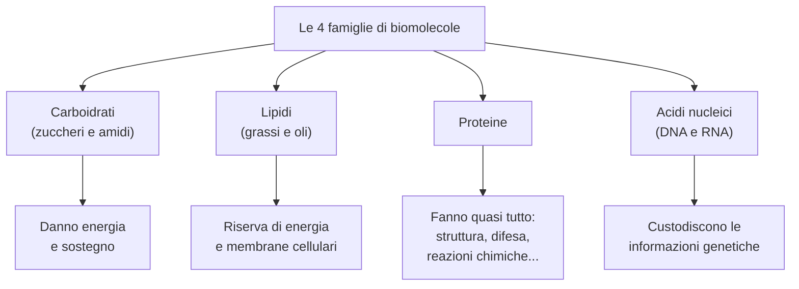
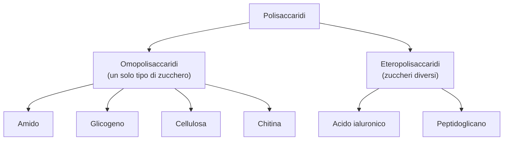
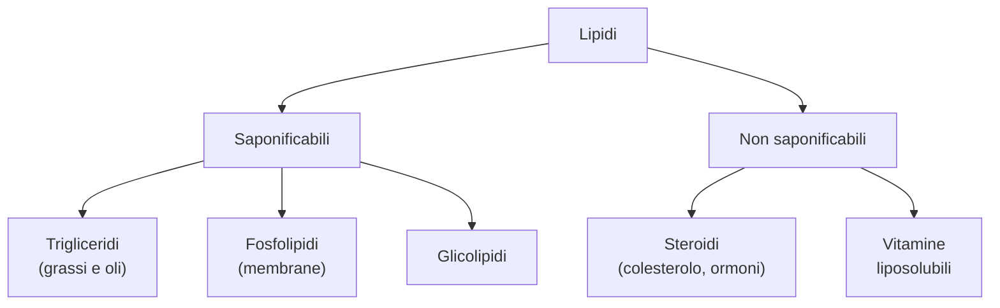
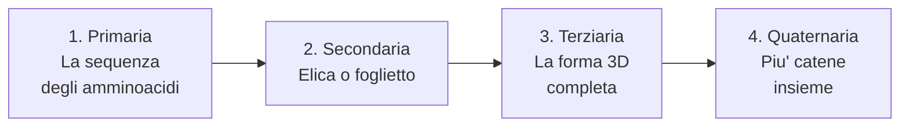

# Biomolecole

La **biochimica** e' la chimica della vita: studia le molecole che formano gli esseri viventi e le reazioni chimiche che avvengono dentro le cellule (cioe' il **metabolismo**).

Le molecole della vita si chiamano **biomolecole**. Sono fatte di carbonio, idrogeno, ossigeno (e a volte zolfo, azoto e fosforo) e si dividono in **quattro grandi famiglie**:

A queste quattro famiglie si aggiungono le **vitamine** e gli **ormoni**.

Molte biomolecole sono **biopolimeri**: molecole enormi costruite mettendo insieme tanti "mattoncini" piu' piccoli chiamati **monomeri** (come una collana fatta di tante perline). Per unire i monomeri si toglie una molecola d'acqua (**condensazione**); per separarli si aggiunge acqua (**idrolisi**).

---

## I carboidrati

I **carboidrati** (detti anche **glicidi** o, nel linguaggio comune, "zuccheri") sono le biomolecole piu' diffuse in natura. Sono fatti di carbonio, idrogeno e ossigeno.

A cosa servono? Tre funzioni principali:

- **Energia immediata**: il glucosio e' il "carburante" preferito dalle nostre cellule
- **Riserva di energia**: l'amido (nelle piante) e il glicogeno (negli animali) sono "scorte" di glucosio
- **Sostegno**: la cellulosa forma le pareti delle cellule vegetali (il legno e' fatto di cellulosa!)

I carboidrati si classificano in base alla dimensione:

| Tipo | Che cos'e' | Esempio |
|------|-----------|---------|
| **Monosaccaride** | Un singolo "mattoncino" | Glucosio, fruttosio |
| **Oligosaccaride** | 2-10 mattoncini uniti | Saccarosio (zucchero da cucina) |
| **Polisaccaride** | Tantissimi mattoncini uniti in catena | Amido, cellulosa |

---

### Monosaccaridi: i mattoncini base

I **monosaccaridi** (o zuccheri semplici) sono i carboidrati piu' piccoli: non si possono "rompere" in pezzi piu' semplici. Ogni monosaccaride ha nella sua molecola un gruppo che puo' essere:

- Un **gruppo aldeidico** (—CHO) → in questo caso lo zucchero si chiama **aldoso**
- Un **gruppo chetonico** (C=O) → in questo caso si chiama **chetoso**

I monosaccaridi si classificano anche per il **numero di atomi di carbonio**:

| Numero di carboni | Nome | Esempi importanti |
|-------------------|------|-------------------|
| 3 | Triosi | Gliceraldeide, diidrossiacetone |
| 5 | **Pentosi** | **Ribosio** (nell'RNA), **desossiribosio** (nel DNA) |
| 6 | **Esosi** | **Glucosio**, **fruttosio**, **galattosio** |

!!! note "Glucosio, galattosio e fruttosio: stessa formula, molecole diverse"
    Tutti e tre hanno la formula C₆H₁₂O₆, ma gli atomi sono disposti in modo diverso nello spazio. Glucosio e galattosio sono aldosi (hanno il gruppo —CHO), il fruttosio e' un chetoso (ha il gruppo C=O). Sono quindi **isomeri di struttura**.

### Come si disegnano: le proiezioni di Fischer

I monosaccaridi sono molecole tridimensionali, ma noi li disegniamo su un foglio (che e' piatto). Il chimico tedesco **Emil Fischer** invento' un modo semplice per farlo: le **proiezioni di Fischer**.

Come funzionano:

1. La catena di carboni si mette in **verticale**, con il gruppo aldeidico o chetonico **in alto**
2. Si numerano i carboni dall'alto verso il basso
3. I gruppi —OH e —H si disegnano ai lati, come le braccia di un pupazzetto

!!! abstract "Serie D e serie L: destra e sinistra"
    Si guarda il **penultimo carbonio** (quello piu' in basso prima dell'ultimo):

    - Se il suo gruppo —OH sta a **destra** → lo zucchero e' della **serie D**
    - Se il suo gruppo —OH sta a **sinistra** → lo zucchero e' della **serie L**

    In natura quasi tutti i monosaccaridi sono della **serie D**.

### Chiralita': molecole allo specchio

I monosaccaridi (tranne il diidrossiacetone) hanno almeno un **stereocentro**: un carbonio legato a quattro gruppi tutti diversi tra loro. Questo fa si' che esistano due versioni della stessa molecola, una l'immagine speculare dell'altra, come la mano destra e la sinistra. Queste due versioni si chiamano **enantiomeri** e la molecola si dice **chirale**.

!!! tip "Epimeri e diastereoisomeri"
    - **Diastereoisomeri**: stereoisomeri che NON sono immagini speculari l'uno dell'altro
    - **Epimeri**: diastereoisomeri che differiscono per la posizione di UN SOLO gruppo —OH. Per esempio, il glucosio e il galattosio sono epimeri (differiscono solo al carbonio 4)

### In acqua gli zuccheri diventano "ad anello"

Quando un monosaccaride e' sciolto in acqua, la sua catena aperta si "chiude" su se stessa formando un **anello** (una struttura ciclica). Succede perche' il gruppo aldeidico (o chetonico) reagisce con uno dei gruppi —OH della stessa molecola, formando un **emiacetale**:

- Il **glucosio** (un aldoesoso) forma un anello a **6 atomi** (un esagono)
- Il **fruttosio** (un chetoesoso) forma un anello a **5 atomi** (un pentagono)

Questa forma ad anello si disegna con le **proiezioni di Haworth**: l'anello e' rappresentato di prospettiva, con il lato piu' vicino a chi guarda disegnato con un tratto piu' spesso.

!!! note "La conformazione a sedia"
    In realta' l'anello non e' piatto come lo disegniamo: gli atomi di carbonio si dispongono nello spazio come una **sedia** (con seduta e schienale), che e' la forma piu' stabile.

### L'anomeria: α e β

Quando la catena si chiude ad anello, il carbonio che portava il gruppo aldeidico diventa un nuovo stereocentro, chiamato **carbonio anomerico**. Si formano cosi' due versioni dell'anello:

- **Anomero α**: il gruppo —OH sul carbonio anomerico punta verso il **basso**
- **Anomero β**: il gruppo —OH punta verso l'**alto**

In acqua le due forme si trasformano continuamente l'una nell'altra passando per la forma aperta: questo fenomeno si chiama **mutarotazione**.

### Le reazioni dei monosaccaridi

#### Riduzione (si aggiunge idrogeno)

Se si aggiunge idrogeno [H] al gruppo aldeidico o chetonico, questo si trasforma in un gruppo —OH e si ottiene un **poliolo** (un alcol con tanti gruppi —OH). Per esempio, dal glucosio si ottiene il **sorbitolo**, un dolcificante usato nelle caramelle "senza zucchero".

#### Ossidazione (si toglie idrogeno)

Se si ossida il gruppo aldeidico di un aldoso, si forma un **acido aldonico** (un acido carbossilico).

!!! example "Come riconoscere uno zucchero in laboratorio"
    Ci sono due saggi classici che sfruttano l'ossidazione degli zuccheri:

    - **Saggio di Tollens**: si usa una soluzione di ioni argento (Ag⁺). Se c'e' uno zucchero riducente, l'argento si deposita sulla provetta formando uno **specchio lucido** (bellissimo da vedere!)
    - **Saggio di Fehling**: si usa una soluzione blu di ioni rame (Cu²⁺). Se c'e' uno zucchero riducente, si forma un precipitato **rosso mattone**

    Uno zucchero che reagisce con questi reattivi si chiama **zucchero riducente** (perche' riduce gli ioni metallici).

---

### I disaccaridi: due mattoncini uniti

I **disaccaridi** sono formati da **due monosaccaridi** uniti tra loro da un **legame glicosidico**. Questo legame si forma quando il gruppo —OH del carbonio anomerico di uno zucchero reagisce con un gruppo —OH dell'altro zucchero, con perdita di una molecola d'acqua.

Il legame glicosidico puo' essere di tipo **α** o **β** (a seconda della posizione del gruppo —OH del carbonio anomerico che partecipa al legame) e si indica con i numeri dei carboni coinvolti, per esempio α(1→4) o β(1→2).

Ecco i disaccaridi piu' importanti:

| Disaccaride | Di cosa e' fatto | Tipo di legame | E' riducente? | Dove si trova |
|-------------|-----------------|----------------|---------------|---------------|
| **Lattosio** | Galattosio + glucosio | β(1→4) | Si' | Latte |
| **Maltosio** | Glucosio + glucosio | α(1→4) | Si' | Malto, birra |
| **Saccarosio** | Glucosio + fruttosio | α(1→2) | **No** | Zucchero da cucina |
| **Cellobiosio** | Glucosio + glucosio | β(1→4) | Si' | Cellulosa |

!!! warning "Perche' il saccarosio NON e' riducente?"
    Nel saccarosio il legame glicosidico coinvolge i carboni anomerici di **entrambi** gli zuccheri: non resta nessun gruppo emiacetale libero che possa ossidarsi. Gli altri disaccaridi, invece, hanno un carbonio anomerico libero e sono quindi riducenti.

!!! info "La galattosemia"
    Alcuni bambini nascono senza l'enzima che trasforma il galattosio in glucosio. Se bevono latte, il galattosio si accumula nei tessuti causando danni gravi. La malattia si chiama **galattosemia** e si risolve eliminando il latte dalla dieta.

Per "rompere" un disaccaride nei suoi due monosaccaridi si usa la reazione di **idrolisi** (si aggiunge acqua, il contrario della condensazione).

---

### I polisaccaridi: lunghe catene di zuccheri

I **polisaccaridi** sono formati da **tantissimi monosaccaridi** uniti in catena da legami glicosidici. Sono come collane lunghissime fatte di centinaia o migliaia di perline.

Si dividono in:

- **Omopolisaccaridi**: tutte le "perline" sono uguali (stesso monosaccaride)
- **Eteropolisaccaridi**: le "perline" sono di tipi diversi

Tutti i polisaccaridi sono zuccheri **non riducenti** (la catena e' cosi' lunga che il singolo gruppo emiacetale libero in fondo e' trascurabile).

#### L'amido: la riserva delle piante

L'**amido** e' il polisaccaride che le piante usano per **mettere da parte il glucosio** (come un conto in banca di energia). Lo troviamo nelle patate, nel riso, nella pasta, nel pane.

E' formato da due componenti:

| Componente | Struttura | Solubilita' |
|-----------|-----------|-------------|
| **Amilosio** | Catene **lineari** di glucosio unite da legami α(1→4) | Solubile in acqua |
| **Amilopectina** | Catene **ramificate**: la catena principale ha legami α(1→4), le ramificazioni partono con legami α(1→6) ogni 24-30 unita' | Insolubile in acqua |

#### Il glicogeno: la riserva degli animali

Il **glicogeno** e' il nostro "magazzino" di glucosio. Si accumula nel **fegato** e nei **muscoli**. Ha la stessa struttura dell'amilopectina, ma e' **molto piu' ramificato** (ramificazioni ogni 8-14 unita').

Quando mangiamo troppi carboidrati, il glucosio in eccesso viene trasformato in glicogeno e immagazzinato. Quando abbiamo bisogno di energia, il glicogeno viene "smontato" e ritorna glucosio.

#### La cellulosa: la struttura delle piante

La **cellulosa** e' il materiale che forma le **pareti delle cellule vegetali** (il legno, il cotone, la carta sono fatti di cellulosa). E' il polisaccaride piu' abbondante sulla Terra.

E' formata da catene lineari di glucosio, ma con una differenza fondamentale rispetto all'amido: i legami sono **β(1→4)** invece che α(1→4). Le catene si dispongono parallele e si tengono insieme con **legami a idrogeno**, formando fibre molto resistenti.

!!! warning "Perche' non possiamo digerire la cellulosa?"
    Il nostro corpo ha gli enzimi per rompere i legami **α**-glicosidici (quelli dell'amido e del glicogeno), ma **non** ha gli enzimi per rompere i legami **β**-glicosidici della cellulosa. Per questo mangiare insalata ci da' fibre ma non calorie! Solo alcuni batteri e funghi hanno l'enzima giusto (per questo le termiti riescono a mangiare il legno: hanno batteri nell'intestino che digeriscono la cellulosa per loro).

#### La chitina

La **chitina** ha la stessa funzione strutturale della cellulosa, ma nel mondo animale: forma l'**esoscheletro** (lo "scheletro esterno") di insetti, crostacei (granchi, gamberi) e la parete cellulare dei funghi. E' fatta di unita' di **N-acetilglucosammina** unite da legami β(1→4).

#### Gli eteropolisaccaridi

- **Acido ialuronico**: si trova nel liquido che lubrifica le articolazioni e nell'interno dell'occhio. E' usato anche in cosmetica!
- **Peptidoglicano**: forma la **parete dei batteri**. E' fatto di due zuccheri diversi che si alternano (N-acetilglucosammina e acido N-acetilmuramico), collegati da brevi catene di amminoacidi.

---

## I lipidi

I **lipidi** (dal greco *lipos* = grasso) sono un gruppo molto vario di molecole che hanno una cosa in comune: sono **insolubili in acqua** ma si sciolgono bene nei solventi organici apolari (come l'olio non si scioglie nell'acqua).

A cosa servono i lipidi nel nostro corpo?

- **Riserva di energia**: i grassi forniscono il **doppio** dell'energia rispetto ai carboidrati (per questo il corpo li accumula come scorta)
- **Struttura**: i fosfolipidi formano le **membrane cellulari**
- **Isolamento termico**: il grasso sottocutaneo ci protegge dal freddo
- **Regolazione**: gli ormoni steroidei e le vitamine liposolubili regolano molti processi
- **Protezione**: le cere rendono impermeabili piume e foglie

I lipidi si dividono in due grandi gruppi:

- **Saponificabili**: contengono acidi grassi e, trattati con una base forte (NaOH), formano saponi
- **Non saponificabili**: non contengono acidi grassi e non formano saponi

---

### I trigliceridi: grassi e oli

I **trigliceridi** sono i lipidi piu' comuni. Sono fatti da una molecola di **glicerolo** (un alcol con tre gruppi —OH) legata a **tre molecole di acidi grassi** tramite tre legami estere.

In pratica, il glicerolo fa da "gancio" a tre lunghe code di acidi grassi, che gli si attaccano tramite reazioni di **esterificazione** (la stessa reazione che abbiamo studiato nei derivati degli idrocarburi, con perdita di tre molecole d'acqua).

I trigliceridi hanno tre funzioni biologiche importanti:

1. Sono la principale **riserva energetica** del corpo (1 g di grasso = circa 9 kcal, il doppio di 1 g di zuccheri)
2. Formano il **tessuto adiposo** sotto la pelle, che ci protegge dal freddo
3. Aiutano l'**assorbimento delle vitamine** A, D, E e K nell'intestino

### Gli acidi grassi: saturi e insaturi

Gli **acidi grassi** sono acidi carbossilici con una catena di carboni molto lunga (di solito da 12 a 24 carboni, sempre in numero **pari**). Si dividono in due tipi:

| Tipo | Come e' la catena | Forma | Stato a temperatura ambiente | Dove si trovano |
|------|------------------|-------|------------------------------|-----------------|
| **Saturi** | Solo legami singoli C—C → catena **dritta** | Lineare, si impacchettano bene | **Solidi** (grassi) | Burro, strutto, carne |
| **Insaturi** | Uno o piu' doppi legami C=C → catena con delle **pieghe** | Piegata, non si impacchettano | **Liquidi** (oli) | Olio d'oliva, olio di semi |

!!! note "Perche' il burro e' solido e l'olio e' liquido?"
    Immagina tanti bastoncini dritti (acidi grassi saturi): li puoi impilare bene uno accanto all'altro, formano un blocco compatto → **solido**. Ora immagina bastoncini piegati (acidi grassi insaturi): non riesci a impilarli, restano disordinati → **liquido**. Ecco perche' il burro (grassi saturi) e' solido e l'olio (grassi insaturi) e' liquido!

!!! warning "Acidi grassi essenziali"
    L'**acido linoleico** e l'**acido linolenico** sono acidi grassi che il nostro corpo **non riesce a produrre da solo**: dobbiamo assumerli con il cibo (li troviamo nel pesce, nelle noci, nell'olio di semi). Per questo si chiamano **essenziali**. Servono per la coagulazione del sangue e per controllare le infiammazioni.

### Le reazioni dei trigliceridi

#### Idrogenazione: dagli oli ai grassi

L'**idrogenazione** e' una reazione che aggiunge idrogeno ai doppi legami degli acidi grassi insaturi, trasformandoli in saturi. In pratica, si prende un olio (liquido) e lo si trasforma in un grasso (solido). Cosi' si produce la **margarina**.

#### Saponificazione: dai grassi al sapone

La **saponificazione** e' l'idrolisi dei trigliceridi con una base forte (NaOH o KOH), cioe' si "rompe" il trigliceride in **glicerolo** + **sali di acidi grassi**. Questi sali sono i **saponi**!

!!! example "Come funziona il sapone?"
    Ogni molecola di sapone ha due parti:

    - Una lunga **coda apolare** (la catena di carboni dell'acido grasso): "ama" il grasso e "odia" l'acqua
    - Una **testa polare** (il gruppo COO⁻): "ama" l'acqua e "odia" il grasso

    In acqua le molecole di sapone si riuniscono formando delle palline chiamate **micelle**: le code si mettono all'interno (lontano dall'acqua) e le teste all'esterno (a contatto con l'acqua).

    Quando lavi i piatti, le code del sapone si "infilano" nelle goccioline di grasso, mentre le teste restano in acqua. Il grasso viene cosi' circondato e trascinato via dall'acqua. Questa miscela di grasso e acqua stabilizzata dal sapone si chiama **emulsione**.

---

### I fosfolipidi: i mattoni delle membrane

I **fosfolipidi** assomigliano ai trigliceridi, ma con una differenza importante: al posto di uno dei tre acidi grassi c'e' un **gruppo fosfato** legato a un **amminoalcol** (come l'etanolammina o la colina).

Questo li rende molecole **anfipatiche** (dal greco: "che amano entrambi"): hanno una testa **idrofila** (che ama l'acqua, formata dal fosfato e dall'amminoalcol) e due code **idrofobiche** (che fuggono dall'acqua, formate dai due acidi grassi).

I due tipi principali sono:

- **Glicerofosfolipidi**: basati sul glicerolo. Sono i piu' abbondanti nelle **membrane cellulari**
- **Sfingolipidi**: basati sulla sfingosina (un amminoalcol). Abbondanti nella **guaina mielinica** che riveste i nervi

!!! abstract "La membrana cellulare: un doppio strato di fosfolipidi"
    Nella membrana cellulare i fosfolipidi si dispongono in un **doppio strato**: le code idrofobiche si affacciano verso l'interno (una contro l'altra, lontano dall'acqua), le teste idrofile verso l'esterno (a contatto con l'acqua sia dentro sia fuori la cellula). Questo doppio strato e' la barriera che separa l'interno della cellula dall'ambiente esterno.

---

### I glicolipidi

I **glicolipidi** sono formati da sfingosina + un acido grasso + uno **zucchero** (glucosio, galattosio o un oligosaccaride). Si trovano sulla superficie esterna delle membrane cellulari.

Ce ne sono di due tipi:

- **Gangliosidi**: funzionano come "antenne" che riconoscono molecole specifiche, come gli ormoni
- **Cerebrosidi**: si trovano sulle membrane dei neuroni, dove funzionano da recettori per i neurotrasmettitori

!!! info "I gruppi sanguigni"
    I glicolipidi presenti sulla membrana dei **globuli rossi** determinano il nostro **gruppo sanguigno** (A, B, AB o 0)!

---

### Gli steroidi

Gli **steroidi** sono lipidi con una struttura molto diversa dagli altri: sono formati da **quattro anelli** di carbonio fusi insieme (tre esagoni e un pentagono), derivati da una molecola chiamata **sterano**.

#### Il colesterolo

Il **colesterolo** e' lo steroide piu' importante. Si trova nelle membrane delle nostre cellule e serve per:

- Regolare la **fluidita'** delle membrane cellulari
- Essere il "materiale di partenza" per produrre **acidi biliari**, **ormoni steroidei** e **vitamina D**

Il colesterolo viene sia prodotto dal nostro fegato sia assunto con gli alimenti (carne, uova, burro, latte).

!!! warning "Colesterolo buono e cattivo"
    Il colesterolo viaggia nel sangue trasportato da "navette" chiamate **lipoproteine**:

    - **LDL** (colesterolo "cattivo"): portano il colesterolo dal fegato ai tessuti. Se sono troppe, il colesterolo si deposita nelle pareti delle arterie → **aterosclerosi** (arterie rigide e strette) → rischio di infarto e ictus
    - **HDL** (colesterolo "buono"): raccolgono il colesterolo in eccesso dai tessuti e lo riportano al fegato per essere eliminato

    Per questo e' importante avere le LDL basse e le HDL alte!

#### Gli acidi biliari

Gli **acidi biliari** derivano dal colesterolo e si trovano nella **bile** (il liquido giallo-verde prodotto dal fegato). I loro sali funzionano come "detergenti naturali" nell'intestino: **emulsionano i grassi** (li spezzettano in goccioline piccole) per permettere agli enzimi digestivi di digerirli.

#### Gli ormoni steroidei

Sono molecole segnale prodotte da ghiandole specifiche:

**Ormoni sessuali** (prodotti dalle gonadi):

| Tipo | Ormone principale | Funzione |
|------|------------------|----------|
| Androgeni | **Testosterone** | Sviluppo dei caratteri sessuali maschili, produzione di spermatozoi |
| Estrogeni e progestinici | **Progesterone** | Sviluppo dei caratteri sessuali femminili, ciclo mestruale |

**Ormoni corticosurrenali** (prodotti dalle ghiandole surrenali, sopra i reni):

- **Cortisolo** e **cortisone** (glucocorticoidi): stimolano la produzione di glucosio dagli amminoacidi quando serve energia
- **Aldosterone** (mineralcorticoide): regola il riassorbimento del sodio nei reni, controllando la pressione sanguigna

---

### Le vitamine liposolubili

Le **vitamine liposolubili** (A, D, E, K) sono molecole che il nostro corpo **non sa produrre** (sono essenziali) e che si sciolgono nei grassi (per questo si chiamano "liposolubili"). Dobbiamo assumerle con il cibo.

| Vitamina | Dove si trova | A cosa serve | Se manca... |
|----------|--------------|-------------|-------------|
| **A** (retinolo) | Carote, fegato, uova | Vista (soprattutto notturna), protezione della pelle | **Cecita' notturna** |
| **D** (calciferolo) | Latte, uova; la pelle la produce con il sole | Fa depositare calcio nelle ossa | **Rachitismo** nei bambini, **osteoporosi** negli adulti |
| **E** (tocoferolo) | Olio d'oliva, noci, mandorle | **Antiossidante**: protegge le membrane cellulari | Danni alle membrane |
| **K** (naftochinone) | Spinaci, broccoli; prodotta dai batteri intestinali | Serve per la **coagulazione** del sangue | Rischio di **emorragie** |

---

## Gli amminoacidi e le proteine

### Gli amminoacidi: i mattoncini delle proteine

Gli **amminoacidi** sono i monomeri (i "mattoncini") che, uniti in lunghe catene, formano i **peptidi** e le **proteine**.

Ma non servono solo per costruire proteine. Alcuni amminoacidi hanno altre funzioni importanti:

- Il **GABA** e la **dopamina** (derivati di amminoacidi) sono **neurotrasmettitori** (i messaggeri chimici tra i neuroni)
- L'**istamina** e' il mediatore delle reazioni allergiche e dell'infiammazione
- La **tiroxina** e' un ormone della tiroide che regola il metabolismo

### Come e' fatto un amminoacido

Ogni amminoacido ha sempre la stessa struttura di base: un atomo di carbonio centrale (chiamato **carbonio α**) a cui sono legati:

- Un gruppo **amminico** (—NH₂)
- Un gruppo **carbossilico** (—COOH)
- Un atomo di **idrogeno** (H)
- Un **gruppo R** (la catena laterale), che e' **diverso** per ogni amminoacido

!!! abstract "20 amminoacidi, 20 gruppi R diversi"
    Gli amminoacidi che formano le proteine sono **20**. Si differenziano solo per il gruppo R. Di questi 20, **8 sono essenziali**: il nostro corpo non li sa fabbricare e dobbiamo assumerli mangiando (carne, pesce, uova, legumi...).

### Come si classificano gli amminoacidi

Si classificano in base alle proprieta' chimiche del **gruppo R**:

| Classe | Che tipo di gruppo R ha | Caratteristiche | Esempi |
|--------|------------------------|-----------------|--------|
| **Apolari** | Catena di soli C e H | Idrofobici (fuggono dall'acqua) | Glicina, Alanina, Valina, Leucina, Fenilalanina |
| **Polari non carichi** | Gruppi con O, N o S | Idrofili (amano l'acqua) | Serina, Cisteina, Asparagina, Treonina |
| **Polari basici** (carica +) | Gruppo amminico in piu' | Carica positiva | Lisina, Istidina, Arginina |
| **Polari acidi** (carica −) | Gruppo carbossilico in piu' | Carica negativa | Acido aspartico, Acido glutammico |

### Gli amminoacidi sono chirali

Tutti gli amminoacidi (tranne la **glicina**, il piu' semplice) sono molecole **chirali**: esistono in due versioni speculari (D e L). In natura, tutti gli amminoacidi delle proteine sono nella forma **L** (come tutti i monosaccaridi sono nella forma D).

### Lo zwitterione: una molecola con due cariche

A **pH fisiologico** (il pH del nostro corpo, circa 7,4), dentro l'amminoacido succede qualcosa di curioso: il gruppo —COOH cede il suo H⁺ al gruppo —NH₂ della stessa molecola. Si forma cosi' uno **zwitterione** ("ione ibrido" in tedesco): una molecola che ha **contemporaneamente una carica positiva e una negativa**:

- —COOH diventa **—COO⁻** (perde H⁺, carica negativa)
- —NH₂ diventa **—NH₃⁺** (accetta H⁺, carica positiva)

### Comportamento anfotero e punto isoelettrico

Gli amminoacidi sono **anfoteri**: si comportano da acidi o da basi a seconda del pH della soluzione in cui si trovano.

- In ambiente **acido** (tanto H⁺): accettano protoni → diventano **cationi** (carica +)
- In ambiente **basico** (poco H⁺): cedono protoni → diventano **anioni** (carica −)

!!! abstract "Il punto isoelettrico (pI)"
    Ogni amminoacido ha un suo valore di pH al quale la carica totale e' **zero** (tanti + quanti −): si chiama **punto isoelettrico (pI)**.

    - Se il pH della soluzione e' **piu' basso** del pI → l'amminoacido ha carica **positiva**
    - Se il pH e' **piu' alto** del pI → l'amminoacido ha carica **negativa**

    Gli amminoacidi acidi hanno pI basso (circa 3), quelli neutri medio (5-6,5), quelli basici alto (7,6-10,8).

---

### Il legame peptidico: come si uniscono gli amminoacidi

Il **legame peptidico** e' il legame che unisce due amminoacidi tra loro. Si forma tra il gruppo —COOH del primo amminoacido e il gruppo —NH₂ del secondo, con perdita di una molecola d'acqua (condensazione). In pratica, e' un **legame ammidico** (lo abbiamo gia' visto nei derivati degli idrocarburi!).

La catena si scrive sempre con l'amminoacido **N-terminale** (quello con il gruppo —NH₂ libero) a **sinistra** e l'amminoacido **C-terminale** (quello con il gruppo —COOH libero) a **destra**.

!!! note "Il legame peptidico e' rigido"
    Per effetto della risonanza, il legame C—N del legame peptidico e' **rigido**: non puo' ruotare. Il gruppo peptidico e' quindi **planare** (piatto). La catena puo' pero' ruotare attorno ai legami che collegano i vari gruppi peptidici tra loro, e questo permette alle proteine di assumere forme tridimensionali complesse.

In base alla lunghezza della catena si parla di:

- **Oligopeptidi**: da 2 a 10 amminoacidi
- **Polipeptidi**: da 11 a 80 amminoacidi
- **Proteine**: piu' di 80 amminoacidi

### Il legame disolfuro

Tra due amminoacidi di **cisteina** (che hanno il gruppo —SH nella catena laterale) si puo' formare un **legame disolfuro** (S—S): i due gruppi —SH si "ossidano" e si uniscono perdendo due atomi di idrogeno.

Questo legame e' importantissimo perche' crea dei "ponti" nella catena proteica, forzandola a **ripiegarsi** in una forma specifica. Senza i ponti disolfuro, molte proteine non funzionerebbero.

---

### La classificazione delle proteine

Le **proteine** sono lunghe catene di amminoacidi (piu' di 80) unite da legami peptidici. Sono le molecole piu' versatili del nostro corpo: fanno praticamente tutto!

#### Per composizione

- **Proteine semplici**: fatte solo di amminoacidi
- **Proteine coniugate**: amminoacidi + un **gruppo prostetico** (una parte non proteica), che puo' essere un lipide (*lipoproteine* come LDL e HDL), uno zucchero (*glicoproteine* come le immunoglobuline), un acido nucleico (*nucleoproteine*), un metallo (*metalloproteine* come i citocromi)

#### Per funzione

| Funzione | Cosa fanno | Esempio |
|----------|-----------|---------|
| **Strutturali** | Formano tessuti e organi | Cheratina (capelli, unghie), collagene (pelle, tendini) |
| **Catalitiche** | Accelerano le reazioni chimiche | **Enzimi** |
| **Di movimento** | Permettono la contrazione | Actina e miosina (muscoli) |
| **Di trasporto** | Trasportano sostanze | Emoglobina (porta l'O₂ nel sangue) |
| **Di riserva** | Accumulano sostanze | Ferritina (accumula il ferro) |
| **Di difesa** | Proteggono dalle infezioni | **Anticorpi** (immunoglobuline) |
| **Di regolazione** | Inviano messaggi chimici | Ormoni (insulina, ossitocina) |

#### Per forma

- **Proteine fibrose**: catene lunghe e distese, disposte in parallelo come i fili di una corda. Sono resistenti e insolubili. Esempio: cheratina, collagene, fibroina della seta.
- **Proteine globulari**: catene ripiegate su se stesse a formare una "pallina" compatta. Sono solubili e hanno funzioni attive. Esempio: enzimi, anticorpi, emoglobina.

---

### La struttura delle proteine: quattro livelli

Una proteina non e' una catena piatta: si ripiega nello spazio in modi precisi. Si possono distinguere **quattro livelli** di struttura, uno dentro l'altro (come le scatole cinesi):

#### 1. Struttura primaria: la sequenza

E' semplicemente l'**ordine** in cui gli amminoacidi sono disposti nella catena, come le lettere in una parola. Cambiare anche solo un amminoacido puo' cambiare completamente la funzione della proteina.

!!! warning "L'anemia falciforme"
    Nell'emoglobina (la proteina che trasporta l'ossigeno nel sangue), la sostituzione di **un solo amminoacido** su 574 (un acido glutammico con una valina) fa cambiare la forma dei globuli rossi, che diventano a falce. Questo causa una grave malattia chiamata **anemia falciforme**. Basta un errore su 574 per provocare una patologia!

#### 2. Struttura secondaria: elica e foglietto

La catena di amminoacidi si ripiega localmente in due configurazioni principali, tenute insieme da **legami a idrogeno** tra i gruppi C=O e N—H della catena principale:

| Configurazione | Come e' fatta | Esempio |
|---------------|--------------|---------|
| **α-elica** | La catena si avvolge a **spirale** (come una molla). I gruppi R puntano verso l'esterno. Molto flessibile. | Cheratina (capelli), elastina |
| **β-foglietto** | Tratti di catena si dispongono **paralleli**, come le pieghe di una fisarmonica, collegati da legami a idrogeno. | Fibroina (seta del ragno) |

Una stessa proteina puo' avere sia zone ad α-elica sia zone a β-foglietto.

#### 3. Struttura terziaria: la forma 3D

E' la **forma tridimensionale** complessiva della proteina: come la catena si ripiega nello spazio. Questa forma e' stabilizzata da interazioni tra i **gruppi R** degli amminoacidi:

- **Legami a idrogeno** tra gruppi R polari
- **Legami disolfuro** (S—S) tra due cisteine
- **Interazioni ioniche** tra gruppi R con cariche opposte
- **Interazioni di van der Waals** tra gruppi R apolari

!!! tip "Dentro e fuori"
    Nella struttura terziaria, i gruppi R **idrofobici** (apolari) si nascondono all'**interno** della proteina (lontano dall'acqua), mentre quelli **idrofili** (polari) si dispongono all'**esterno** (a contatto con l'acqua). Questo "impacchettamento" e' chiamato **folding** (ripiegamento).

#### 4. Struttura quaternaria: piu' catene insieme

Alcune proteine sono formate da **piu' catene polipeptidiche** (chiamate **subunita'**) unite tra loro.

!!! example "L'emoglobina"
    L'**emoglobina** e' formata da **4 catene** (due α e due β). Ognuna delle quattro catene contiene un gruppo **eme**, che ha al centro uno ione **ferro** (Fe²⁺): e' proprio questo ferro che lega l'ossigeno e lo trasporta dai polmoni a tutti i tessuti del corpo.

### La denaturazione: quando le proteine si "rompono"

La **denaturazione** e' la perdita della struttura tridimensionale (secondaria, terziaria e quaternaria) di una proteina, con conseguente perdita della sua funzione.

I legami che tengono insieme la forma 3D sono **deboli** (legami a idrogeno, interazioni di van der Waals, interazioni ioniche), quindi si rompono facilmente a causa di:

- **Temperature alte** (il calore fa vibrare troppo gli atomi)
- **pH estremi** (cambiano le cariche sui gruppi R)
- **Solventi organici** (disturbano le interazioni idrofobiche)

!!! warning "La denaturazione e' irreversibile"
    Quando una proteina si denatura, non torna piu' alla sua forma originale: il processo e' **irreversibile**. Un esempio che vediamo ogni giorno: quando cuoci un uovo, l'**albumina** (la proteina dell'albume) passa da trasparente e liquida a bianca e solida. Non puoi "scuocere" un uovo!

---

## Gli enzimi

### Cosa sono gli enzimi

Gli **enzimi** sono proteine specializzate che funzionano come **catalizzatori biologici**: accelerano enormemente le reazioni chimiche del metabolismo senza essere consumati nella reazione. Senza gli enzimi, le reazioni nelle nostre cellule sarebbero cosi' lente che la vita sarebbe impossibile.

!!! note "Anche l'RNA puo' essere un catalizzatore"
    Oltre alle proteine, anche alcune molecole di **RNA** possono funzionare da catalizzatori: si chiamano **ribozimi**.

Gli enzimi agiscono in due modi:

- Nelle reazioni **cataboliche** (quelle che "smontano" le molecole): indeboliscono i legami chimici dei reagenti
- Nelle reazioni **anaboliche** (quelle che "costruiscono" molecole piu' grandi): favoriscono il corretto orientamento dei reagenti

### Il nome degli enzimi

Il nome di un enzima si costruisce prendendo il nome del suo substrato (la molecola su cui agisce) e aggiungendo il suffisso **-asi**:

| Enzima | Substrato | Cosa fa |
|--------|-----------|---------|
| **Amilasi** | Amido | Spezza l'amido in maltosio |
| **Maltasi** | Maltosio | Spezza il maltosio in due molecole di glucosio |
| **Lipasi** | Lipidi | Digerisce i grassi |
| **Proteasi** | Proteine | Digerisce le proteine |

### I cofattori: gli "aiutanti" degli enzimi

Molti enzimi non lavorano da soli: hanno bisogno di **cofattori**, molecole che li aiutano a svolgere la catalisi.

| Tipo di cofattore | Cosa sono | Esempi |
|-------------------|-----------|--------|
| **Attivatori** | Ioni metallici | Fe²⁺, Cu²⁺, Mg²⁺, Zn²⁺ |
| **Coenzimi** | Molecole organiche che trasportano gruppi chimici, protoni o elettroni | NAD⁺, FAD, Coenzima A (CoA) |

!!! note "NAD⁺ e FAD: i trasportatori di idrogeno"
    **NAD⁺** e **FAD** sono due coenzimi fondamentali che lavorano come "taxi per l'idrogeno": raccolgono atomi di idrogeno da una reazione e li portano a un'altra.

    - NAD⁺ + 2H → **NADH** + H⁺ (forma ridotta)
    - FAD + 2H → **FADH₂** (forma ridotta)

    Li ritroveremo dappertutto nel metabolismo energetico (glicolisi, ciclo di Krebs, catena respiratoria).

    L'enzima **senza** il cofattore si chiama **apoenzima** (e' inattivo). L'enzima **con** il cofattore si chiama **oloenzima** (e' attivo e funzionante).

### L'energia di attivazione

Perche' una reazione chimica avvenga, i reagenti devono superare una "barriera" di energia, come una palla che deve superare una collina prima di rotolare dall'altra parte. Questa barriera si chiama **energia di attivazione** (E~a~).

I reagenti passano attraverso uno stato intermedio instabile chiamato **complesso attivato** (in cima alla "collina"), che poi si trasforma nei prodotti.

!!! abstract "Reazioni esoergoniche e endoergoniche"
    - **Esoergonica**: i prodotti hanno **meno** energia dei reagenti → si **libera** energia (come una palla che rotola in discesa)
    - **Endoergonica**: i prodotti hanno **piu'** energia dei reagenti → si **assorbe** energia (come spingere una palla in salita)

**Cosa fanno gli enzimi?** Abbassano l'energia di attivazione! Non cambiano la "destinazione" della reazione (i prodotti sono gli stessi), ma rendono la "collina" piu' bassa, cosi' i reagenti la superano piu' facilmente e la reazione avviene molto piu' velocemente.

### Come funziona un enzima: i tre stadi

Il meccanismo di catalisi enzimatica si svolge in tre passaggi:

1. **L'enzima incontra il substrato** → si forma il **complesso enzima-substrato (ES)**. Il substrato si lega al **sito attivo** dell'enzima (una "tasca" con la forma giusta). I legami sono deboli (a idrogeno, dipolari).

2. **La reazione avviene** → il substrato si trasforma nel prodotto, con un'energia di attivazione molto piu' bassa del normale.

3. **Il prodotto si stacca** → il prodotto non ha piu' affinita' per il sito attivo e se ne va. L'enzima e' di nuovo libero e pronto per un altro giro!

In formula: **E + S → ES → EP → E + P**

### La specificita' degli enzimi

#### Specificita' di substrato: la chiave e la serratura

Ogni enzima riconosce e lega **un solo substrato** (o pochissimi substrati molto simili). Questo succede perche' il **sito attivo** dell'enzima ha una forma tridimensionale precisa che "combacia" solo con il suo substrato.

Pero' non e' un incastro rigido come una chiave in una serratura: quando il substrato si avvicina, l'enzima **cambia leggermente forma** per adattarsi meglio a lui. Questo meccanismo si chiama **modello dell'adattamento indotto** (come un guanto che si adatta alla mano).

#### Specificita' di reazione: le sei classi

Ogni enzima catalizza **un solo tipo** di reazione chimica. In base al tipo di reazione, gli enzimi si dividono in sei classi:

| Classe | Che reazione catalizza | Esempio |
|--------|----------------------|---------|
| **Ossidoreduttasi** | Ossidazione e riduzione | Alcol deidrogenasi |
| **Trasferasi** | Trasferimento di un gruppo da una molecola all'altra | Chinasi |
| **Idrolasi** | Rottura di un legame con aggiunta di acqua | Amilasi, lipasi |
| **Liasi** | Rottura o formazione di un doppio legame | Decarbossilasi |
| **Isomerasi** | Spostamento di atomi nella stessa molecola | Isomerasi |
| **Ligasi** | Unione di due molecole | DNA ligasi |

### L'attivita' enzimatica: cosa la influenza

L'**attivita' enzimatica** e' la quantita' di substrato trasformato in prodotto nell'unita' di tempo. Dipende da diversi fattori:

#### La temperatura

La velocita' di reazione **aumenta** con la temperatura (piu' calore = piu' energia = piu' collisioni tra molecole), ma solo fino a un certo punto. Oltre quel valore, la proteina si **denatura** (perde la sua forma) e l'enzima smette di funzionare.

La temperatura alla quale l'enzima lavora al massimo si chiama **temperatura ottimale**:

- Per i nostri enzimi: **37 °C** (la temperatura del corpo)
- Per i batteri che vivono nelle sorgenti termali: fino a **80 °C**

#### Il pH

Ogni enzima ha un **pH ottimale**, cioe' il valore di pH al quale funziona meglio. Cambiare il pH altera la forma del sito attivo e riduce l'attivita'.

| Enzima | Dove lavora | pH ottimale |
|--------|-----------|-------------|
| **Pepsina** | Stomaco (molto acido) | 1,5 |
| **Amilasi salivare** | Bocca | 6,7 |
| **Chimotripsina** | Intestino | 7,8 |
| **Lipasi** | Intestino | 8,0 |

#### La concentrazione dell'enzima e del substrato

- Piu' enzima c'e', piu' veloce va la reazione (relazione **lineare**: il doppio di enzima = il doppio di velocita')
- Piu' substrato c'e', piu' veloce va la reazione... **ma fino a un certo punto**: quando tutti i siti attivi sono occupati, l'enzima e' **saturo** e la velocita' non aumenta piu'. Il grafico che descrive questo andamento si chiama **curva di saturazione**

### La regolazione dell'attivita' enzimatica

Le cellule hanno bisogno di "accendere" o "spegnere" gli enzimi a seconda delle necessita'. Ci sono due meccanismi principali:

#### Gli effettori allosterici: l'interruttore

Gli **effettori allosterici** sono molecole che si legano all'enzima in un punto diverso dal sito attivo, facendogli cambiare forma:

- **Effettore positivo**: fa funzionare **meglio** l'enzima (come accendere un interruttore)
- **Effettore negativo**: fa funzionare **peggio** l'enzima (come spegnerlo)

Il legame e' **reversibile** (l'effettore puo' staccarsi), quindi la regolazione e' flessibile. Gli enzimi che funzionano cosi' si chiamano **enzimi allosterici** e sono fondamentali per regolare le vie metaboliche.

#### Gli inibitori enzimatici: chi blocca gli enzimi

Gli **inibitori** sono molecole che **riducono** l'attivita' di un enzima. Ne esistono tre tipi:

| Tipo | Come agisce | Si puo' rimediare? |
|------|-------------|-------------------|
| **Irreversibile** | Si lega **in modo permanente** al sito attivo con un legame covalente, distruggendolo | **No**, l'enzima e' rovinato per sempre |
| **Competitivo** (reversibile) | Ha una forma simile al substrato e si "siede" al **sito attivo** al suo posto, ma senza reagire | **Si'**, basta aggiungere piu' substrato per "scacciarlo" |
| **Non competitivo** (reversibile) | Si lega in un **punto diverso** dal sito attivo, cambiando la forma dell'enzima cosi' che il substrato non riesce piu' a legarsi | **Si'**, quando l'inibitore si stacca l'enzima torna normale |

!!! danger "Il DFP e i gas nervini"
    Il **DFP** (diisopropil fluorofosfato) e' un inibitore **irreversibile** dell'enzima **acetilcolinesterasi**, che normalmente distrugge l'acetilcolina (un neurotrasmettitore) dopo che ha trasmesso il segnale nervoso. Se questo enzima viene bloccato, l'acetilcolina si accumula e i muscoli restano contratti → paralisi. Il DFP e' stato usato come componente dei **gas nervini**, armi chimiche terribili vietate dalle convenzioni internazionali.

---

## Checklist

- [x] Introduzione alla biochimica e classificazione delle biomolecole
- [x] Carboidrati: monosaccaridi, aldosi e chetosi
- [x] Proiezioni di Fischer, chiralita', serie D e L
- [x] Forma ciclica, proiezioni di Haworth, anomeria e mutarotazione
- [x] Reazioni dei monosaccaridi: riduzione e ossidazione
- [x] Disaccaridi: lattosio, maltosio, saccarosio, cellobiosio
- [x] Polisaccaridi: amido, glicogeno, cellulosa, chitina
- [x] Eteropolisaccaridi: acido ialuronico, peptidoglicano
- [x] Lipidi: classificazione in saponificabili e non saponificabili
- [x] Trigliceridi: struttura, acidi grassi saturi e insaturi
- [x] Reazioni dei trigliceridi: idrogenazione e saponificazione
- [x] Fosfolipidi e membrana cellulare
- [x] Glicolipidi, steroidi, colesterolo
- [x] Ormoni steroidei e vitamine liposolubili
- [x] Amminoacidi: struttura, classificazione, chiralita'
- [x] Zwitterione, comportamento anfotero, punto isoelettrico
- [x] Legame peptidico e legame disolfuro
- [x] Classificazione e funzioni delle proteine
- [x] Struttura delle proteine: primaria, secondaria, terziaria, quaternaria
- [x] Denaturazione delle proteine
- [x] Enzimi: catalizzatori biologici, cofattori e coenzimi
- [x] Energia di attivazione e azione catalitica
- [x] Specificita' degli enzimi, le sei classi
- [x] Attivita' enzimatica: temperatura, pH, concentrazione
- [x] Regolazione enzimatica: effettori allosterici e inibitori

## Collegamenti

- **Chimica organica**: i carboidrati contengono i gruppi funzionali che abbiamo studiato (aldeidi, chetoni, alcoli); il legame peptidico e' un legame ammidico; i trigliceridi sono esteri del glicerolo; la saponificazione e' l'idrolisi basica degli esteri — tutti argomenti trattati nei derivati degli idrocarburi
- **Fisica**: le proprieta' ottiche dei monosaccaridi (rotazione della luce polarizzata) si collegano all'ottica; le interazioni deboli che stabilizzano le proteine (legami a idrogeno, forze di van der Waals) si collegano all'elettrostatica
- **Biologia**: il DNA e l'RNA contengono ribosio e desossiribosio; l'emoglobina trasporta l'ossigeno; gli enzimi catalizzano tutte le reazioni del metabolismo (glicolisi, ciclo di Krebs, catena respiratoria)
- **Educazione civica e salute**: l'ipercolesterolemia e le malattie cardiovascolari; l'importanza di una dieta equilibrata (acidi grassi essenziali, vitamine); le intolleranze alimentari (galattosemia, intolleranza al lattosio); i gas nervini come armi chimiche vietate dalle convenzioni internazionali
- **Italiano/Filosofia**: il concetto di "struttura e funzione" nelle proteine richiama il rapporto forma-contenuto in letteratura; la scoperta degli enzimi rivoluziono' la visione meccanicistica della vita
- **Storia**: la scoperta della struttura delle proteine (Pauling, anni '50) e del DNA (Watson e Crick, 1953) sono tappe fondamentali della scienza del Novecento
