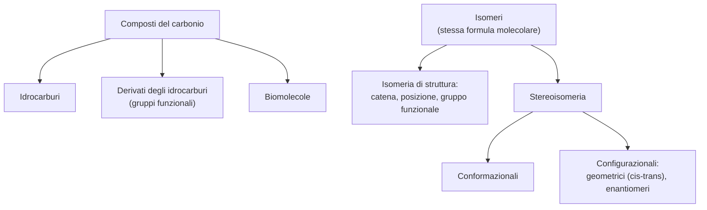

# C1 — La chimica organica

## La chimica organica e i composti del carbonio

La chimica organica è la chimica dei composti del carbonio. Il nome risale all'Ottocento, quando si riteneva che le sostanze prodotte dagli esseri viventi possedessero una "forza vitale" che le distingueva dalle altre; questa idea cadde nel 1828, quando Wöhler sintetizzò l'urea, una sostanza tipica del metabolismo animale, a partire da reagenti inorganici.

I composti organici si dividono in tre grandi famiglie:

- gli idrocarburi, formati solo da carbonio e idrogeno, distinti in saturi, insaturi e aromatici;
- i derivati degli idrocarburi, in cui uno o più atomi di idrogeno sono sostituiti da un gruppo funzionale (alcoli, eteri, aldeidi, chetoni, acidi carbossilici, ammine);
- le biomolecole, cioè carboidrati, lipidi, proteine e acidi nucleici.

## Le proprietà del carbonio

Il numero altissimo di composti organici dipende dalla versatilità dell'atomo di carbonio, che possiede cinque proprietà fondamentali:

- quattro legami covalenti: il carbonio ha quattro elettroni di valenza e, invece di cederli o acquistarli, li condivide formando sempre quattro legami covalenti. La geometria attorno al carbonio dipende dal tipo di legami: tetraedrica a 109,5° con quattro legami semplici, planare a 120° con un doppio legame, lineare a 180° con un triplo legame;
- numero di ossidazione variabile: a seconda degli atomi a cui si lega, il carbonio assume valori da $-4$ a $+4$, e può quindi comportarsi sia da donatore sia da accettore di elettroni;
- elettronegatività intermedia: vale $2{,}55$ sulla scala di Pauling, un valore né alto né basso; per questo i suoi legami sono covalenti e poco polari, e i composti organici sono in generale stabili e poco reattivi;
- raggio atomico piccolo: essendo un atomo piccolo, il carbonio permette agli altri atomi di avvicinarsi molto, formando legami corti e robusti, anche doppi o tripli;
- concatenazione: il carbonio si lega con grande facilità ad altri atomi di carbonio, formando anche catene molto lunghe.

## Le formule dei composti organici

Una molecola organica si può rappresentare con quattro tipi di formula, via via più sintetici:

- la formula di Lewis, che mostra tutti i legami tra gli atomi;
- la formula razionale, che evidenzia solo i legami carbonio-carbonio;
- la formula condensata, che indica solo gli atomi e i gruppi atomici che costituiscono la molecola;
- la formula topologica, che disegna solo la catena carboniosa.

## L'isomeria

Si chiamano isomeri due composti con la stessa formula molecolare ma diversa struttura e diverse proprietà. Esistono due tipi principali di isomeria: l'isomeria di struttura, in cui cambia la sequenza degli atomi di carbonio o la posizione di un legame multiplo, e la stereoisomeria, in cui cambia la disposizione nello spazio di atomi o gruppi.

### L'isomeria di struttura

L'isomeria di struttura si presenta in tre forme:

- isomeria di catena: i composti differiscono per il modo in cui gli atomi di carbonio sono legati nella catena;
- isomeria di posizione: i composti, a parità di catena, differiscono per la posizione di un legame multiplo, di un atomo o di un gruppo;
- isomeria di gruppo funzionale: i composti presentano gruppi funzionali diversi.

### La stereoisomeria

Si parla di stereoisomeria quando due composti hanno gli atomi legati nella stessa sequenza, ma disposti diversamente nello spazio. Gli stereoisomeri si distinguono in due tipi:

- isomeri conformazionali: differiscono per l'orientazione nello spazio di atomi o gruppi e si interconvertono per rotazione attorno a un legame semplice (conformazione sfalsata o eclissata);
- isomeri configurazionali: differiscono per l'orientazione nello spazio, ma non si interconvertono per rotazione attorno a un legame; si distinguono a loro volta in isomeri geometrici ed enantiomeri.

Gli isomeri geometrici differiscono per la disposizione di atomi o gruppi legati ai due atomi di carbonio di un doppio legame (o di un anello), che impedisce la rotazione: si chiama cis l'isomero con i gruppi dalla stessa parte, trans quello con i gruppi da parti opposte. Gli enantiomeri (o isomeri ottici) sono invece due molecole che sono l'una l'immagine speculare dell'altra ma non sono sovrapponibili: una molecola esiste in due enantiomeri quando contiene uno stereocentro (un atomo di carbonio legato a quattro gruppi diversi) e non possiede un piano di simmetria; in questo caso è detta chirale.

## Le proprietà fisiche dei composti organici

Le proprietà fisiche dei composti organici dipendono soprattutto dalla lunghezza della catena carboniosa e dalla presenza di gruppi funzionali, che ne aumentano la polarità. Le principali sono:

- lo stato fisico: i composti a catena corta sono gassosi, quelli a catena intermedia liquidi, quelli a catena lunga solidi;
- il punto di ebollizione: cresce con la massa molecolare e con la polarità, perché molecole più polari si attraggono di più e serve più energia per separarle;
- la solubilità in acqua: dipende dalla presenza di gruppi idrofili o idrofobi; una molecola che contiene sia una parte idrofila sia una parte idrofoba è detta anfipatica, come i fosfolipidi.

## La reattività dei composti organici

La reattività di un composto organico dipende dal suo gruppo funzionale, cioè da un legame multiplo, un atomo molto elettronegativo o uno specifico gruppo atomico. All'origine di una reazione c'è la rottura di un legame covalente, che può avvenire in due modi:

- rottura omolitica: il legame si spezza in modo simmetrico e ciascun atomo trattiene uno dei due elettroni, formando radicali liberi; è provocata da calore, radiazioni UV o reazione con un altro radicale;
- rottura eterolitica (o polare): il legame si spezza in modo asimmetrico e l'atomo più elettronegativo trattiene entrambi gli elettroni.

La rottura eterolitica può portare alla formazione di un carbanione, uno ione con la carica negativa su un atomo di carbonio (una base forte), oppure di un carbocatione, uno ione con la carica positiva su un atomo di carbonio (un acido forte). Le reazioni eterolitiche coinvolgono spesso elettrofili (specie povere di elettroni e con carica positiva) e nucleofili (specie ricche di elettroni e con carica negativa).

## Schema riassuntivo

## Collegamenti

- **Fisica**: la geometria dei legami del carbonio si spiega con l'ibridazione degli orbitali atomici, idea nata dalla meccanica quantistica.
- **Fisica** (ottica): l'attività ottica si misura grazie alla luce polarizzata, descritta dalla fisica come oscillazione del campo elettrico su un solo piano.
- **Storia delle scienze**: la sintesi dell'urea di Wöhler (1828) segna l'atto di nascita della chimica organica moderna.
- **Biologia**: la chiralità delle molecole è alla base della specificità degli enzimi, che riconoscono uno solo dei due enantiomeri di un substrato.
