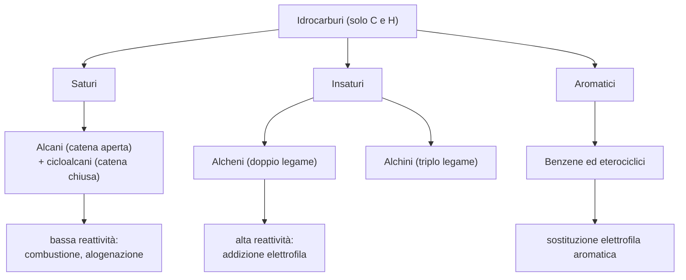

# C2 — Gli idrocarburi

## Introduzione e classificazione

Gli idrocarburi sono i composti organici formati esclusivamente da carbonio e idrogeno, e costituiscono lo scheletro da cui derivano tutti gli altri composti organici. Si dividono in tre grandi categorie:

- saturi: solo legami semplici carbonio-carbonio; comprendono gli alcani (a catena aperta) e i cicloalcani (a catena chiusa);
- insaturi: almeno un legame multiplo carbonio-carbonio; comprendono gli alcheni (un doppio legame) e gli alchini (un triplo legame);
- aromatici: contengono uno o più anelli aromatici, basati sul benzene.

## Gli alcani

Gli alcani sono idrocarburi saturi a catena aperta, lineare o ramificata, con formula generale $\text{C}_n\text{H}_{2n+2}$.

- geometria: ogni atomo di carbonio è ibridato $sp^3$, con geometria tetraedrica e angoli di 109,5°;
- nomenclatura IUPAC: si individua la catena più lunga (catena principale), si numerano i carboni assegnando ai sostituenti i numeri più bassi e si indicano i sostituenti (gruppi alchilici) con nome e posizione;
- proprietà fisiche: molecole apolari, insolubili in acqua e solubili nei solventi apolari; il punto di ebollizione cresce con la catena (i primi quattro gassosi, da cinque a sedici atomi di carbonio liquidi, i più lunghi solidi);
- reattività: bassa, per la scarsa polarità dei legami. Le due reazioni principali sono la combustione (con l'ossigeno produce anidride carbonica, acqua ed energia, alla base del loro uso come combustibili) e l'alogenazione (sostituzione di un idrogeno con un alogeno, con luce UV o calore, per meccanismo radicalico).

## I cicloalcani

I cicloalcani sono idrocarburi saturi a catena chiusa, con formula generale $\text{C}_n\text{H}_{2n}$.

- geometria e tensione di anello: il carbonio è ibridato $sp^3$, ma la chiusura ad anello costringe gli angoli a discostarsi da 109,5°, generando la tensione di anello; è massima negli anelli piccoli (ciclopropano, ciclobutano), mentre il cicloesano è il più stabile perché assume la conformazione "a sedia", più stabile della "a barca";
- proprietà fisiche e reattività: simili a quelle degli alcani aperti, tranne gli anelli piccoli, più reattivi a causa della tensione.

## Gli alcheni

Gli alcheni sono idrocarburi insaturi con almeno un doppio legame carbonio-carbonio e formula generale $\text{C}_n\text{H}_{2n}$.

- geometria: gli atomi del doppio legame sono ibridati $sp^2$, con geometria planare e angoli di 120°; il doppio legame impedisce la rotazione, da cui l'isomeria geometrica cis-trans;
- proprietà fisiche: simili agli alcani (apolari, insolubili in acqua);
- reattività: alta, perché il doppio legame è ricco di elettroni ed è il punto di attacco per gli elettrofili. La reazione caratteristica è l'addizione elettrofila, in cui il doppio legame si rompe e due atomi o gruppi si legano ai due carboni:
    - idrogenazione: addizione di idrogeno con catalizzatore metallico, dà l'alcano;
    - alogenazione: addizione di un alogeno, dà un dialogenuro vicinale;
    - idratazione: addizione di acqua in ambiente acido, dà un alcol;
    - addizione di acidi alogenidrici: HCl o HBr danno un alogenuro alchilico, secondo la regola di Markovnikov (l'idrogeno si lega al carbonio del doppio legame che ne ha già di più).

## Gli alchini

Gli alchini sono idrocarburi insaturi con almeno un triplo legame carbonio-carbonio e formula generale $\text{C}_n\text{H}_{2n-2}$.

- geometria: gli atomi del triplo legame sono ibridati $sp$, con geometria lineare e angoli di 180°;
- acidità degli alchini terminali: quando il triplo legame è all'estremità della catena, l'idrogeno legato al carbonio $sp$ ha un certo carattere acido (per l'elevato carattere s degli orbitali); l'alchino più noto è l'acetilene (o etino), usato nelle fiamme ossiacetileniche per la saldatura;
- reattività: simile a quella degli alcheni; il triplo legame subisce le stesse addizioni elettrofile (idrogenazione, alogenazione, idratazione, addizione di acidi alogenidrici), in due tappe successive, dando prima un alchene e poi un alcano.

## Gli idrocarburi aromatici

Gli idrocarburi aromatici contengono uno o più anelli aromatici, il cui prototipo è il benzene.

- struttura del benzene: anello esagonale planare di sei atomi di carbonio ibridati $sp^2$, ciascuno legato a un idrogeno; i sei elettroni $\pi$ sono delocalizzati su tutto l'anello, in una nube continua sopra e sotto il piano;
- stabilità: la delocalizzazione degli elettroni $\pi$ dà al benzene una stabilità eccezionale, detta energia di risonanza;
- reattività: il benzene non subisce addizioni (distruggerebbero l'aromaticità), ma reazioni di sostituzione elettrofila aromatica, in cui un idrogeno dell'anello è sostituito senza compromettere la nube $\pi$:
    - nitrazione: introduce un gruppo nitro, con acido nitrico in ambiente solforico;
    - alogenazione: introduce un alogeno, con cloro o bromo e un catalizzatore (cloruro o bromuro di ferro);
    - solfonazione: introduce un gruppo solfonico, con acido solforico concentrato;
    - alchilazione di Friedel-Crafts: introduce un gruppo alchilico, con un alogenuro alchilico e cloruro di alluminio.

## I composti eterociclici aromatici

I composti eterociclici aromatici sono molecole aromatiche in cui uno o più atomi di carbonio dell'anello sono sostituiti da eteroatomi (azoto, ossigeno o zolfo). Mantengono l'aromaticità e la stabilità del benzene, ma le proprietà chimiche cambiano con l'eteroatomo. Hanno grande importanza biologica:

- la piridina è il nucleo di molte vitamine;
- il pirrolo è alla base del gruppo eme dell'emoglobina e della clorofilla;
- l'imidazolo è presente nell'istidina e nell'istamina;
- le purine e le pirimidine costituiscono le basi azotate degli acidi nucleici.

## Schema riassuntivo

## Collegamenti

- **Biologia**: le purine e le pirimidine, eterociclici aromatici, sono le basi azotate del DNA e dell'RNA; il pirrolo è alla base del gruppo eme dell'emoglobina e della clorofilla.
- **Industria**: gli alcani sono i principali componenti del petrolio e del gas naturale, materia prima dell'industria dei combustibili e delle materie plastiche.
- **Fisica**: la stabilità del benzene si spiega con la delocalizzazione degli elettroni $\pi$, fenomeno descritto dalla meccanica quantistica.
