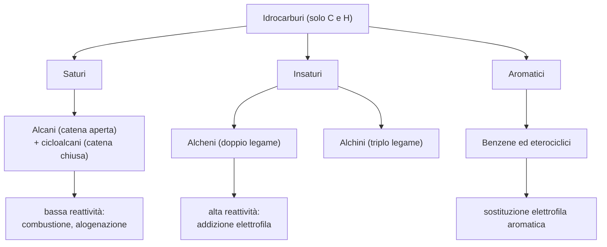

# C2 — Gli idrocarburi

## Introduzione e classificazione

Gli idrocarburi sono i composti organici formati esclusivamente da carbonio e idrogeno, e costituiscono lo scheletro da cui derivano tutti gli altri composti organici. Si dividono in tre grandi categorie:

- saturi: presentano solo legami semplici carbonio-carbonio e comprendono gli alcani (a catena aperta) e i cicloalcani (a catena chiusa);
- insaturi: presentano almeno un legame multiplo carbonio-carbonio e comprendono gli alcheni (con un doppio legame) e gli alchini (con un triplo legame);
- aromatici: contengono uno o più anelli aromatici, basati sul benzene.

## Gli alcani

Gli alcani sono idrocarburi saturi a catena aperta, lineare o ramificata, con formula generale $\text{C}_n\text{H}_{2n+2}$. Ogni atomo di carbonio è ibridato $sp^3$, con geometria tetraedrica e angoli di legame di 109,5°. Sono molecole apolari, insolubili in acqua e solubili nei solventi apolari, e il loro punto di ebollizione cresce con la lunghezza della catena: i primi quattro alcani sono gassosi, quelli da cinque a sedici atomi di carbonio liquidi, quelli più lunghi solidi.

Per assegnare il nome si usa la nomenclatura IUPAC, che consiste nell'individuare la catena più lunga (catena principale), numerare i carboni in modo da dare ai sostituenti i numeri più bassi e indicare i sostituenti (i gruppi alchilici) con il loro nome e la loro posizione.

La reattività degli alcani è bassa, a causa della scarsa polarità dei legami. Le due reazioni principali sono la combustione, che con l'ossigeno produce anidride carbonica, acqua ed energia (ed è alla base del loro impiego come combustibili), e l'alogenazione, cioè la sostituzione di un idrogeno con un alogeno, che avviene in presenza di luce UV o calore con un meccanismo radicalico.

## I cicloalcani

I cicloalcani sono idrocarburi saturi a catena chiusa, con formula generale $\text{C}_n\text{H}_{2n}$. Anche in essi il carbonio è ibridato $sp^3$, ma la chiusura della catena ad anello costringe gli angoli di legame a discostarsi dal valore ideale di 109,5°, generando la cosiddetta tensione di anello. Questa tensione è massima negli anelli più piccoli, come il ciclopropano e il ciclobutano, mentre il cicloesano è il più stabile, perché può assumere la conformazione "a sedia", con angoli vicini a 109,5°, più stabile della conformazione "a barca".

Le proprietà fisiche e la reattività sono simili a quelle degli alcani aperti, con l'eccezione degli anelli piccoli, che risultano più reattivi proprio a causa della tensione di anello.

## Gli alcheni

Gli alcheni sono idrocarburi insaturi che presentano almeno un doppio legame carbonio-carbonio, con formula generale $\text{C}_n\text{H}_{2n}$. Gli atomi del doppio legame sono ibridati $sp^2$, con geometria planare e angoli di 120°; il doppio legame impedisce la rotazione, e da questo nasce l'isomeria geometrica cis-trans. Le proprietà fisiche sono simili a quelle degli alcani (molecole apolari, insolubili in acqua).

La reattività, invece, è alta, e la ragione è il doppio legame: è una zona ricca di elettroni, e per questo attira gli  elettrofili. La reazione caratteristica è quindi l'addizione elettrofila, in cui il doppio legame si apre, trasformandosi in un legame semplice, mentre due nuovi atomi o gruppi si legano ai due atomi di carbonio; in pratica la molecola guadagna nuovi atomi. A seconda di che cosa si aggiunge si hanno quattro addizioni principali:

- idrogenazione: addizione di idrogeno con un catalizzatore metallico, che trasforma l'alchene nel corrispondente alcano;
- alogenazione: addizione di un alogeno, con formazione di un dialogenuro vicinale;
- idratazione: addizione di acqua in ambiente acido, con formazione di un alcol;
- addizione di acidi alogenidrici: addizione di HCl o HBr con formazione di un alogenuro alchilico, secondo la regola di Markovnikov (l'idrogeno si lega al carbonio del doppio legame che ne ha già di più).

## Gli alchini

Gli alchini sono idrocarburi insaturi che presentano almeno un triplo legame carbonio-carbonio, con formula generale $\text{C}_n\text{H}_{2n-2}$. Gli atomi del triplo legame sono ibridati $sp$, con geometria lineare e angoli di 180°. Negli alchini terminali, cioè con il triplo legame all'estremità della catena, l'idrogeno legato al carbonio $sp$ ha un certo carattere acido, dovuto all'elevato carattere s degli orbitali ibridi; l'alchino più noto è l'acetilene (o etino), usato nelle fiamme ossiacetileniche per la saldatura.

La reattività degli alchini è alta, perché il triplo legame è ricco di elettroni e costituisce il punto di attacco per gli elettrofili. La reazione caratteristica è l'addizione elettrofila, che comprende l'idrogenazione, l'alogenazione, l'idratazione e l'addizione di acidi alogenidrici. Poiché il triplo legame ha più legami da rompere, l'addizione avviene in due tappe successive: il triplo legame si trasforma prima in un doppio legame e infine in legami semplici.

## Gli idrocarburi aromatici

Gli idrocarburi aromatici contengono uno o più anelli aromatici, il cui prototipo è il benzene. Il benzene è un anello esagonale planare formato da sei atomi di carbonio ibridati $sp^2$, ciascuno legato a un atomo di idrogeno; i sei elettroni $\pi$ dei doppi legami sono delocalizzati su tutto l'anello, formando una nube elettronica continua sopra e sotto il piano della molecola. Questa delocalizzazione conferisce al benzene una stabilità eccezionale, detta energia di risonanza.

Proprio per questo il benzene non subisce reazioni di addizione, che ne distruggerebbero l'aromaticità, ma reazioni di sostituzione elettrofila aromatica, in cui un idrogeno dell'anello viene sostituito da un gruppo elettrofilo senza compromettere la nube $\pi$. Le principali sono:

- nitrazione: introduzione di un gruppo nitro, con acido nitrico in ambiente solforico;
- alogenazione: introduzione di un alogeno, con cloro o bromo e un catalizzatore (cloruro o bromuro di ferro);
- solfonazione: introduzione di un gruppo solfonico, con acido solforico concentrato;
- alchilazione di Friedel-Crafts: introduzione di un gruppo alchilico, con un alogenuro alchilico e cloruro di alluminio come catalizzatore.

## I composti eterociclici aromatici

I composti eterociclici aromatici sono molecole aromatiche in cui uno o più atomi di carbonio dell'anello sono sostituiti da eteroatomi (azoto, ossigeno o zolfo). Mantengono l'aromaticità e la stabilità del benzene, ma le loro proprietà chimiche cambiano in funzione dell'eteroatomo presente. Hanno grande importanza biologica: la piridina è il nucleo di molte vitamine, il pirrolo è alla base del gruppo eme dell'emoglobina e della clorofilla, l'imidazolo è presente nell'istidina e nell'istamina, e le purine e le pirimidine costituiscono le basi azotate degli acidi nucleici.

## Schema riassuntivo

## Collegamenti

- **Biologia**: le purine e le pirimidine, eterociclici aromatici, sono le basi azotate del DNA e dell'RNA; il pirrolo è alla base del gruppo eme dell'emoglobina e della clorofilla.
- **Industria**: gli alcani sono i principali componenti del petrolio e del gas naturale, materia prima dell'industria dei combustibili e delle materie plastiche.
- **Fisica**: la stabilità del benzene si spiega con la delocalizzazione degli elettroni $\pi$, fenomeno descritto dalla meccanica quantistica.
