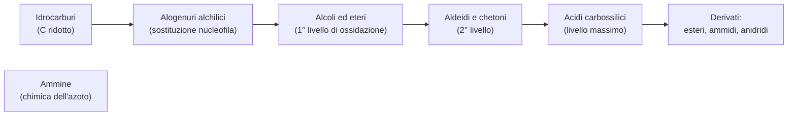

# C3 — I derivati degli idrocarburi

## Introduzione e classificazione

I derivati degli idrocarburi sono composti organici che si ottengono da un idrocarburo sostituendo uno o più atomi di idrogeno con un gruppo funzionale, cioè un gruppo di atomi che dà alla molecola la sua reattività e le sue proprietà. Si classificano in base al gruppo funzionale che contengono.

Il criterio che li unisce è il grado di ossidazione del carbonio, cioè quanto il carbonio è ossidato: negli idrocarburi è al minimo, e nei derivati cresce passo passo. Gli alcoli e gli eteri sono il primo livello, le aldeidi e i chetoni il secondo, gli acidi carbossilici il livello massimo. Ogni composto può essere trasformato nel successivo con reazioni di ossidoriduzione.

## Gli alogenuri alchilici

Negli alogenuri alchilici un atomo di idrogeno è sostituito da un alogeno (fluoro, cloro, bromo o iodio). Sono poco reattivi, ma utili in laboratorio perché reagiscono in un modo ben preciso, la sostituzione nucleofila:

- un nucleofilo (specie ricca di elettroni, come lo ione idrossido $\text{OH}^-$) attacca il carbonio legato all'alogeno;
- l'alogeno se ne va (gruppo uscente) e al suo posto si lega il nucleofilo (meccanismo SN2);
- se il nucleofilo è lo ione idrossido, il prodotto è un alcol.

## Gli alcoli

Gli alcoli contengono il gruppo ossidrile $-\text{OH}$ legato a un carbonio. Si dividono in primari, secondari e terziari a seconda che quel carbonio sia legato a uno, due o tre altri atomi di carbonio.

- sintesi: per idratazione di un alchene (in ambiente acido si aggiunge acqua al doppio legame, secondo Markovnikov l'ossidrile va sul carbonio più sostituito) oppure per riduzione di un'aldeide o di un chetone, con boroidruro di sodio ($\text{NaBH}_4$) o idruro di litio e alluminio ($\text{LiAlH}_4$);
- proprietà: il legame O–H è polare e l'ossigeno forma legami a idrogeno con l'acqua, perciò gli alcoli piccoli (come l'etanolo) si sciolgono bene in acqua e bollono a temperature alte; allungando la catena la solubilità cala;
- reazioni: per ossidazione gli alcoli primari danno aldeidi (poi acidi carbossilici) e i secondari danno chetoni (i terziari non si ossidano); per disidratazione, scaldando in ambiente acido, l'alcol perde acqua e dà un alchene; reagendo con il sodio l'alcol perde il protone dell'ossidrile e diventa uno ione alcossido ($\text{RO}^-$), usato per fare gli eteri.

## I fenoli

I fenoli sono alcoli particolari, con il gruppo ossidrile legato direttamente all'anello del benzene. Questa posizione li rende diversi dagli alcoli comuni:

- sono più acidi: reagiscono con basi forti come l'idrossido di sodio (un alcol comune no), e da questo si distinguono dagli alcoli;
- sono reattivi nella sostituzione elettrofila aromatica: l'ossidrile cede elettroni all'anello, così il nuovo gruppo entra nelle posizioni vicine, orto e para.

## Gli eteri

Gli eteri hanno un atomo di ossigeno legato a due gruppi di carbonio ($\text{R–O–R'}$). Sono molecole stabili e poco reattive, e si usano spesso come solventi.

- sintesi: per disidratazione (due alcoli, scaldati in ambiente acido, perdono una molecola d'acqua e si uniscono) oppure con la sintesi di Williamson (uno ione alcossido attacca un alogenuro alchilico con meccanismo SN2; è il metodo più preciso, perché si scelgono i due pezzi dell'etere);
- stabilità: non hanno un idrogeno "debole" sul legame con l'ossigeno, quindi sono molto stabili; solo in ambiente molto acido il legame si rompe.

## Le aldeidi e i chetoni

Salendo di un livello di ossidazione si trovano le aldeidi e i chetoni, che contengono il gruppo carbonile, un doppio legame tra carbonio e ossigeno ($\text{C=O}$). Nelle aldeidi il carbonile è all'estremità della molecola (il carbonio porta un idrogeno), nei chetoni è interno (legato a due gruppi di carbonio).

- sintesi: per ossidazione degli alcoli (i primari danno aldeidi, i secondari danno chetoni) o per ozonolisi degli alcheni (taglio del doppio legame con l'ozono);
- reattività: il carbonile è molto polare, il carbonio resta povero di elettroni ed è attaccato dai nucleofili (addizione nucleofila); con un alcol si formano acetali (dalle aldeidi) e chetali (dai chetoni), stabili ma che in ambiente acido tornano al carbonile, per questo si usano per "proteggere" il gruppo;
- riduzione: le aldeidi tornano alcoli primari e i chetoni alcoli secondari; solo le aldeidi possono essere ossidate fino ad acido carbossilico.

## Gli acidi carbossilici

Gli acidi carbossilici contengono il gruppo carbossile $-\text{COOH}$ (un carbonile più un ossidrile), che è il livello di ossidazione più alto raggiungibile dal carbonio senza spezzarsi.

- sintesi: ossidazione di un alcol primario o di un'aldeide con un ossidante forte come il permanganato di potassio ($\text{KMnO}_4$);
- acidità: in acqua sono acidi deboli (pKa da 3 a 5), perché lo ione carbossilato $\text{COO}^-$ è stabilizzato per risonanza; reagiscono comunque con basi deboli come il bicarbonato di sodio;
- proprietà fisiche: bollono a temperature alte per i legami a idrogeno tra le molecole;
- esempi: l'acido formico, l'acido acetico (quello dell'aceto) e gli acidi grassi come l'acido palmitico e l'acido stearico.

## I derivati degli acidi carbossilici

Da un acido carbossilico si ottengono tre famiglie di composti molto importanti:

- esteri: si formano unendo un acido carbossilico e un alcol, con perdita d'acqua; hanno spesso odori gradevoli (molti profumi sono esteri) e in ambiente basico subiscono la saponificazione (si rompono in un alcol e nel sale dell'acido, cioè il sapone);
- ammidi: si formano unendo un acido carbossilico e un'ammina; il legame peptidico che tiene insieme gli amminoacidi nelle proteine è un legame ammidico; sono più difficili da rompere degli esteri;
- anidridi: si formano unendo due acidi carbossilici con perdita d'acqua; sono i derivati più reattivi (l'anidride acetica serve a produrre l'aspirina).

## Le ammine

Le ammine contengono uno o più atomi di azoto legati a gruppi di carbonio. Si dividono in primarie ($\text{RNH}_2$), secondarie ($\text{R}_2\text{NH}$) e terziarie ($\text{R}_3\text{N}$) a seconda di quanti gruppi sono legati all'azoto.

- sintesi: per riduzione di un'ammide, oppure con la sintesi di Gabriel (che dà ammine primarie pure);
- reattività: il doppietto elettronico libero dell'azoto le rende sia nucleofili sia basi deboli (in acqua catturano un protone formando lo ione ammonio $\text{RNH}_3^+$); come nucleofili reagiscono con gli alogenuri alchilici e con i derivati degli acidi carbossilici, formando ammidi.

## Conclusione: i livelli di ossidazione

Il filo che lega tutta la pagina è il grado di ossidazione del carbonio. Si parte dagli idrocarburi, dove il carbonio è al minimo; gli alogenuri non lo cambiano, ma aprono la strada alle sostituzioni; poi salgono via via gli alcoli e gli eteri (primo livello), le aldeidi e i chetoni (secondo livello) e infine gli acidi carbossilici (il massimo). La chimica organica consiste in gran parte nel far salire e scendere il carbonio lungo questa scala con i reagenti adatti.

## Schema riassuntivo

## Collegamenti

- **Biologia**: i derivati degli idrocarburi sono i mattoni della vita. I carboidrati (derivati dei polialcoli), i lipidi (esteri di glicerolo e acidi grassi), le proteine (catene di amminoacidi legati da ammidi) e gli acidi nucleici contengono tutti i gruppi funzionali studiati qui.
- **Medicina**: molti farmaci contengono questi gruppi: l'aspirina è un estere, il paracetamolo un'ammide, la penicillina contiene un'ammide ciclica.
- **Sostenibilità**: le plastiche sono polimeri con legami estere e ammide; smaltirle vuol dire rompere questi legami con l'idrolisi, e le bioplastiche usano gli stessi gruppi funzionali ma da fonti rinnovabili.
