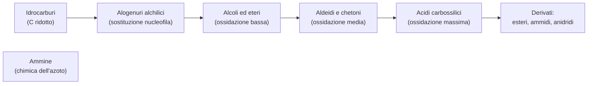

# C3 — I derivati degli idrocarburi

## Introduzione e classificazione

I derivati degli idrocarburi sono composti organici che si ottengono da un idrocarburo sostituendo uno o più atomi di idrogeno con un gruppo funzionale, cioè un gruppo di atomi che dà alla molecola la sua reattività e le sue proprietà. Si classificano in base al gruppo funzionale che contengono.

Le principali classi di derivati sono gli alogenuri alchilici, gli alcoli, i fenoli, gli eteri, le aldeidi, i chetoni, gli acidi carbossilici con i loro derivati (esteri, ammidi e anidridi) e le ammine.

Molte di queste classi sono legate tra loro dal grado di ossidazione del carbonio, che aumenta progressivamente passando dagli alcoli e dagli eteri alle aldeidi e ai chetoni, fino agli acidi carbossilici; ogni classe, infatti, può essere trasformata nella successiva mediante reazioni di ossidoriduzione.

## Gli alogenuri alchilici

Negli alogenuri alchilici un atomo di idrogeno è stato sostituito da un alogeno (fluoro, cloro, bromo o iodio). Sono composti poco reattivi verso quasi tutto, ma sono utili in laboratorio perché reagiscono in un modo ben preciso, la sostituzione nucleofila.

In questa reazione un nucleofilo, cioè una particella ricca di elettroni come lo ione idrossido $\text{OH}^-$, attacca il carbonio legato all'alogeno; l'alogeno se ne va (e per questo è detto gruppo uscente), mentre al suo posto si lega il nucleofilo, secondo un meccanismo chiamato SN2. Se il nucleofilo è lo ione idrossido, il prodotto finale è un alcol.

## Gli alcoli

Gli alcoli contengono il gruppo ossidrile $-\text{OH}$ legato a un atomo di carbonio. Si dividono in primari, secondari e terziari a seconda che quel carbonio sia legato a uno, due o tre altri atomi di carbonio: è una distinzione importante, perché cambia il modo in cui l'alcol reagisce.

Si possono sintetizzare in due modi:

- per idratazione di un alchene: in ambiente acido si aggiunge acqua al doppio legame, secondo la regola di Markovnikov (l'ossidrile va sul carbonio più sostituito);
- per riduzione di un'aldeide o di un chetone, usando agenti come il boroidruro di sodio ($\text{NaBH}_4$) o l'idruro di litio e alluminio ($\text{LiAlH}_4$), che aggiungono idrogeno alla molecola.

Il gruppo ossidrile cambia molto le proprietà dell'alcol: il legame O–H è polare e l'ossigeno forma legami a idrogeno con l'acqua, perciò gli alcoli piccoli, come l'etanolo, si sciolgono bene in acqua e bollono a temperature alte, mentre allungando la catena la solubilità diminuisce.

Gli alcoli, infine, reagiscono in tre modi principali:

- ossidazione: gli alcoli primari diventano aldeidi (e poi acidi carbossilici) e i secondari diventano chetoni, mentre i terziari non si ossidano;
- disidratazione: scaldando in ambiente acido, l'alcol perde una molecola d'acqua e diventa un alchene;
- reazione con il sodio: l'alcol perde il protone dell'ossidrile e si trasforma in uno ione alcossido ($\text{RO}^-$), che serve per fabbricare gli eteri.

## I fenoli

I fenoli sono alcoli particolari, in cui il gruppo ossidrile è legato direttamente all'anello del benzene. Questa posizione li rende più acidi di un alcol normale: a differenza degli alcoli comuni, i fenoli reagiscono con le basi forti come l'idrossido di sodio, e proprio da questo si capisce se si ha davanti un fenolo o un alcol.

Inoltre l'anello del benzene rende il fenolo adatto alla sostituzione elettrofila aromatica, cioè a scambiare un suo idrogeno con un altro gruppo: poiché l'ossidrile "spinge" elettroni nell'anello, il nuovo gruppo entra nelle posizioni vicine all'ossidrile, chiamate orto e para.

## Gli eteri

Gli eteri hanno un atomo di ossigeno legato a due gruppi di carbonio ($\text{R–O–R'}$). Sono molecole stabili e poco reattive, e per questo vengono usate spesso come solventi.

Si sintetizzano in due modi:

- per disidratazione: due molecole di alcol, scaldate in ambiente acido, perdono una molecola d'acqua e si uniscono;
- con la sintesi di Williamson: uno ione alcossido attacca un alogenuro alchilico (meccanismo SN2), un metodo più preciso perché permette di scegliere esattamente quali due pezzi formeranno l'etere.

La stabilità degli eteri dipende dal fatto che non hanno un idrogeno "debole" sul legame con l'ossigeno; solo in ambiente molto acido questo legame si può rompere.

## Le aldeidi e i chetoni

Salendo nella scala di ossidazione si trovano le aldeidi e i chetoni, che contengono il gruppo carbonile, cioè un doppio legame tra carbonio e ossigeno ($\text{C=O}$). Nelle aldeidi questo gruppo si trova a un'estremità della molecola, dove il carbonio porta anche un idrogeno, mentre nei chetoni si trova in mezzo, con il carbonio legato a due gruppi di carbonio.

Si ottengono soprattutto ossidando gli alcoli (i primari danno aldeidi, i secondari danno chetoni), oppure dagli alcheni con l'ozonolisi, cioè tagliando il doppio legame con l'ozono.

Il doppio legame $\text{C=O}$ è molto polare, perché l'ossigeno attira gli elettroni molto più del carbonio; così il carbonio resta povero di elettroni e viene facilmente attaccato dai nucleofili. La reazione tipica è infatti l'addizione nucleofila, in cui un nucleofilo si lega al carbonio del carbonile: se il nucleofilo è un alcol si formano gli acetali (dalle aldeidi) e i chetali (dai chetoni), composti stabili che in ambiente acido tornano al carbonile, ragione per cui vengono usati per "proteggere" il gruppo durante altre reazioni.

Con la riduzione, infine, le aldeidi tornano alcoli primari e i chetoni alcoli secondari; va ricordato che solo le aldeidi possono essere ossidate ulteriormente fino ad acido carbossilico.

## Gli acidi carbossilici

Gli acidi carbossilici contengono il gruppo carbossile $-\text{COOH}$ (formato da un carbonile più un ossidrile), che rappresenta il grado di ossidazione più alto raggiungibile dal carbonio senza che la molecola si spezzi. Si ottengono soprattutto ossidando un alcol primario o un'aldeide con un ossidante forte come il permanganato di potassio ($\text{KMnO}_4$).

Nonostante il nome, in acqua sono acidi deboli (il loro pKa va da 3 a 5): rilasciano poco il protone perché lo ione che si forma, il carbossilato $\text{COO}^-$, è stabilizzato per risonanza, cioè la carica negativa è distribuita su più atomi; reagiscono comunque con basi deboli come il bicarbonato di sodio.

Bollono a temperature alte, perché formano molti legami a idrogeno tra le molecole. Appartengono a questa classe l'acido formico, l'acido acetico (quello dell'aceto) e gli acidi grassi come l'acido palmitico e l'acido stearico.

## I derivati degli acidi carbossilici

Da un acido carbossilico si ottengono tre famiglie di composti molto importanti:

- gli esteri si formano unendo un acido carbossilico e un alcol, con perdita di una molecola d'acqua; hanno spesso odori gradevoli (molti profumi sono esteri) e in ambiente molto basico subiscono la saponificazione, cioè si rompono in un alcol e nel sale dell'acido: è così che dall'olio e dalla soda si ottiene il sapone;
- le ammidi si formano unendo un acido carbossilico e un'ammina; sono fondamentali in biologia, perché il legame peptidico che tiene insieme gli amminoacidi nelle proteine è proprio un legame ammidico, e sono più difficili da rompere rispetto agli esteri;
- le anidridi si formano unendo due acidi carbossilici con perdita di una molecola d'acqua; sono i derivati più reattivi e si usano nell'industria, come l'anidride acetica, impiegata per produrre l'aspirina.

## Le ammine

Le ammine contengono uno o più atomi di azoto legati a gruppi di carbonio. Si dividono in primarie ($\text{RNH}_2$), secondarie ($\text{R}_2\text{NH}$) e terziarie ($\text{R}_3\text{N}$) a seconda di quanti gruppi di carbonio sono legati all'azoto.

Si ottengono riducendo un'ammide, oppure con la sintesi di Gabriel, che ha il vantaggio di dare ammine primarie pure.

La loro reattività dipende dal doppietto elettronico libero dell'azoto, cioè una coppia di elettroni non impegnata, che le rende sia nucleofili sia basi deboli: in acqua, infatti, l'azoto cattura un protone e si forma lo ione ammonio $\text{RNH}_3^+$. Come nucleofili, le ammine reagiscono con gli alogenuri alchilici e con i derivati degli acidi carbossilici, formando ammidi.

## Conclusione: il grado di ossidazione del carbonio

Il filo che lega tutta la pagina è il grado di ossidazione del carbonio. Si parte dagli idrocarburi, in cui il carbonio è al minimo; gli alogenuri alchilici non ne cambiano il grado di ossidazione, ma aprono la strada alle reazioni di sostituzione; con gli alcoli e gli eteri il carbonio comincia a ossidarsi, con le aldeidi e i chetoni l'ossidazione aumenta ancora, e con gli acidi carbossilici raggiunge il massimo. In fondo la chimica organica consiste in gran parte nel far salire e scendere il carbonio lungo questa scala di ossidazione, usando i reagenti adatti per costruire le molecole che servono.

## Schema riassuntivo

## Collegamenti

- **Biologia**: i derivati degli idrocarburi sono i mattoni della vita. I carboidrati (derivati dei polialcoli), i lipidi (esteri di glicerolo e acidi grassi), le proteine (catene di amminoacidi legati da ammidi) e gli acidi nucleici contengono tutti i gruppi funzionali studiati qui.
- **Medicina**: molti farmaci contengono questi gruppi: l'aspirina è un estere, il paracetamolo un'ammide, la penicillina contiene un'ammide ciclica.
- **Sostenibilità**: le plastiche sono polimeri con legami estere e ammide; smaltirle vuol dire rompere questi legami con l'idrolisi, e le bioplastiche usano gli stessi gruppi funzionali ma da fonti rinnovabili.
