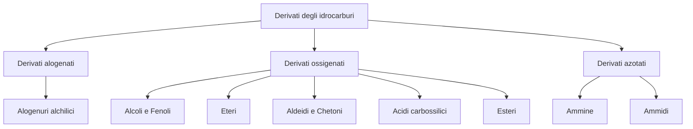
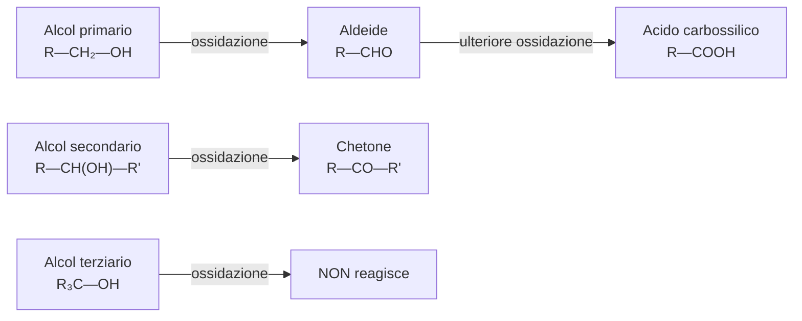

# Derivati degli idrocarburi

I **derivati degli idrocarburi** sono composti organici che si ottengono quando, in un idrocarburo, uno o piu' atomi di idrogeno vengono sostituiti da altri atomi o gruppi di atomi. Questi nuovi "pezzi" si chiamano **gruppi funzionali**, e sono loro a decidere come si comporta la molecola nelle reazioni chimiche.

I derivati si dividono in tre grandi famiglie, a seconda dell'atomo principale del gruppo funzionale:

1. **Derivati alogenati**: contengono un alogeno (F, Cl, Br, I)
2. **Derivati ossigenati**: contengono ossigeno (alcoli, fenoli, eteri, aldeidi, chetoni, acidi carbossilici, esteri)
3. **Derivati azotati**: contengono azoto (ammine, ammidi)

---

## Alogenuri alchilici

Gli **alogenuri alchilici** sono composti in cui un atomo di idrogeno di un alcano e' stato sostituito da un **alogeno** (fluoro, cloro, bromo o iodio). In pratica, si prende un alcano e si "scambia" un H con un atomo di alogeno.

La formula generale e' **R—X**, dove R e' il gruppo alchilico (la parte che deriva dall'alcano) e X e' l'alogeno.

### Nomenclatura

Il nome IUPAC si costruisce cosi': si mette un numero per indicare dove si trova l'alogeno, poi il nome dell'alogeno (con prefisso *fluoro-*, *cloro-*, *bromo-*, *iodo-*) e infine il nome dell'alcano:

| Formula | Nome IUPAC | Nome comune |
|---------|-----------|-------------|
| CH₃Cl | clorometano | cloruro di metile |
| CH₃CH₂I | iodoetano | ioduro di etile |
| CH₃CH₂CH₂CH₂Br | 1-bromobutano | — |

!!! tip "Consiglio per la nomenclatura"
    Se lo **stesso** alogeno e' presente piu' volte, i numeri di posizione si separano con la virgola e si usano i prefissi *di-*, *tri-*, *tetra-* (es. 1,2,2-tricloropropano). Se ci sono sostituenti **diversi**, si elencano in ordine **alfabetico**.

### Classificazione: primari, secondari, terziari

Gli alogenuri si classificano in base a quanti altri atomi di carbonio sono legati al carbonio che porta l'alogeno:

| Tipo | Significato | Struttura |
|------|-------------|-----------|
| **Primario** | il C con l'alogeno e' legato a **1 solo** altro C | R—CH₂—X |
| **Secondario** | il C con l'alogeno e' legato a **2** altri C | R—CHX—R' |
| **Terziario** | il C con l'alogeno e' legato a **3** altri C | R₃C—X |

!!! warning "Attenzione"
    Questa classificazione e' fondamentale: il tipo di alogenuro determina **quale meccanismo di reazione** avverra' (sostituzione nucleofila S~N~1 o S~N~2, eliminazione E1 o E2).

### Isomeria di posizione

L'alogeno puo' trovarsi in posizioni diverse sulla catena, dando origine a **isomeri di posizione**. Per esempio il cloropentano (C₅H₁₁Cl) esiste in tre forme: 1-cloropentano, 2-cloropentano e 3-cloropentano (l'atomo di cloro si trova rispettivamente sul primo, secondo o terzo carbonio).

### Sintesi degli alogenuri alchilici

Ci sono tre modi principali per ottenere un alogenuro alchilico:

**1. Alogenazione degli alcheni** — si fa reagire un alchene con un alogeno (Cl₂ o Br₂) in un solvente anidro. I due atomi di alogeno si aggiungono ai due carboni del doppio legame, e si ottiene un **dialogenuro** (due alogeni sulla stessa molecola):

> R—CH=CH₂ + Br₂ —(CCl₄)→ R—CHBr—CH₂Br

**2. Idroalogenazione degli alcheni** — si aggiunge un acido alogenidrico (HCl, HBr) al doppio legame di un alchene. Quando l'alchene e' asimmetrico, la reazione segue la **regola di Markovnikov**:

> CH₃—CH=CH—CH₃ + HBr → CH₃—CHBr—CH₂—CH₃

!!! abstract "Regola di Markovnikov"
    L'idrogeno dell'acido si aggiunge al carbonio del doppio legame che ha gia' **piu' idrogeni**, mentre l'alogeno va sull'altro carbonio (quello con meno idrogeni).

**3. Idroalogenazione degli alcoli** — un alcol reagisce con un acido alogenidrico. L'ossidrile (—OH) viene sostituito dall'alogeno:

> R—OH + HBr → R—Br + H₂O

### Proprieta' fisiche

- Hanno punti di ebollizione **piu' alti** rispetto agli idrocarburi con lo stesso numero di carboni, perche' l'alogeno aumenta la massa della molecola e le **interazioni dipolo-dipolo** (il legame C—X e' polare).
- La temperatura di ebollizione cresce con la dimensione dell'alogeno: CH₃F < CH₃Cl < CH₃Br < CH₃I
- Sono **insolubili** in acqua (non formano legami a idrogeno), ma si sciolgono bene nei solventi organici.

### Reazioni di sostituzione nucleofila

Il legame C—X e' **polare**: l'alogeno, essendo piu' elettronegativo, attira gli elettroni verso di se', lasciando sul carbonio una parziale carica positiva (δ+). Questo carbonio diventa un bersaglio per i **nucleofili**, cioe' specie chimiche ricche di elettroni che "attaccano" le cariche positive.

Esistono due meccanismi diversi con cui puo' avvenire la sostituzione:

#### Meccanismo S~N~2 (bimolecolare)

Tutto avviene in **un solo passaggio**: il nucleofilo attacca il carbonio dalla parte opposta all'alogeno, che se ne va. Si ha un'**inversione di configurazione** (come un ombrello che si ribalta nel vento).

!!! example "Esempio di reazione S~N~2"
    Lo ione idrossido (OH⁻) attacca il bromoetano e lo trasforma in etanolo:

    > OH⁻ + CH₃CH₂Br → CH₃CH₂OH + Br⁻

Caratteristiche principali:

- La **velocita'** dipende dalla concentrazione di **entrambi** i reagenti (nucleofilo e alogenuro)
- Funziona bene con **alogenuri primari**, perche' il carbonio e' "scoperto" e facile da attaccare
- E' favorito da **nucleofili forti** (OH⁻, RO⁻, CN⁻)
- Con gli alogenuri terziari e' difficile perche' i tre gruppi alchilici "fanno muro" (ingombro sterico)

Reazioni tipiche S~N~2:

- Alogenuro primario + OH⁻ → **alcol primario**
- Alogenuro primario + RO⁻ → **etere** (sintesi di Williamson)

#### Meccanismo S~N~1 (monomolecolare)

La reazione avviene in **due passaggi** separati:

1. **Passaggio lento** (quello che determina la velocita'): l'alogeno se ne va da solo, lasciando un **carbocatione** (uno ione positivo sul carbonio)
2. **Passaggio veloce**: il nucleofilo attacca il carbocatione

!!! example "Esempio di reazione S~N~1"
    Il 2-bromo-2-metilpropano reagisce con l'acqua:

    **Passaggio 1** (lento) — l'alogeno se ne va e si forma il carbocatione:

    > (CH₃)₃C—Br → (CH₃)₃C⁺ + Br⁻

    **Passaggio 2** (veloce) — l'acqua attacca il carbocatione, e si forma il 2-metil-2-propanolo.

Caratteristiche principali:

- La **velocita'** dipende solo dalla concentrazione dell'alogenuro (il nucleofilo non partecipa al passaggio lento)
- Funziona bene con **alogenuri terziari**, perche' i carbocationi terziari sono piu' stabili
- E' favorito da **nucleofili deboli** (acqua, alcoli)

Reazioni tipiche S~N~1:

- Alogenuro terziario + H₂O → **alcol terziario**
- Alogenuro terziario + R'OH → **etere**

### Reazioni di eliminazione

Nelle reazioni di **eliminazione** succede una cosa diversa: invece di sostituire l'alogeno, una base strappa un atomo di idrogeno (H⁺) dal carbonio vicino. L'alogeno se ne va, e tra i due carboni si forma un **doppio legame**: il prodotto e' un **alchene**.

- **Meccanismo E2**: tutto in un passaggio, favorito con alogenuri primari e basi forti
- **Meccanismo E1**: in due passaggi (come S~N~1), favorito con alogenuri terziari e basi deboli

!!! example "Esempio di eliminazione E2"
    > CH₃—CHBr—CH₃ + OH⁻ → CH₃—CH=CH₂ + H₂O + Br⁻

    Il bromopropano perde HBr e si trasforma in propene (un alchene).

### Quando avviene sostituzione e quando eliminazione?

| Condizione | Alogenuri primari | Alogenuri terziari |
|-----------|-------------------|-------------------|
| Nucleofilo forte | S~N~2 | E2 |
| Nucleofilo forte + base forte | S~N~2 e E2 in competizione | E2 |
| Nucleofilo debole | S~N~2 | S~N~1 e E1 |

---

## Alcoli e fenoli

### Gli alcoli: il gruppo ossidrile

Gli **alcoli** sono composti che hanno il gruppo funzionale **ossidrile** (—OH) legato a un carbonio saturo (ibridato sp³). In parole semplici, si prende un alcano e si sostituisce un H con un gruppo —OH.

La formula generale e' **R—OH**.

### Nomenclatura degli alcoli

Per dare il nome IUPAC a un alcol, si prende il nome dell'alcano corrispondente e si sostituisce la *-o* finale con **-olo**:

| Formula | Nome IUPAC | Nome comune |
|---------|-----------|-------------|
| CH₃OH | metanolo | alcol metilico |
| CH₃CH₂OH | etanolo | alcol etilico |
| CH₃CH₂CH₂OH | 1-propanolo | alcol propilico |
| CH₃CH₂CH₂CH₂OH | 1-butanolo | alcol butilico |

Dal terzo termine in poi si ha **isomeria di posizione**: il gruppo —OH puo' trovarsi su carboni diversi. Per esempio il propanolo esiste come 1-propanolo e 2-propanolo.

### Classificazione degli alcoli

Come per gli alogenuri, anche gli alcoli si classificano in base al carbonio che porta il gruppo —OH:

| Tipo | Quanti C sono legati al C con —OH | Esempio |
|------|-----------------------------------|---------|
| **Primario** | 1 solo | etanolo |
| **Secondario** | 2 | 2-propanolo |
| **Terziario** | 3 | 2-metil-2-propanolo |

!!! warning "Importante per le reazioni"
    Il tipo di alcol determina cosa succede quando si ossida: gli alcoli primari danno aldeidi, i secondari danno chetoni, e i terziari **non si ossidano**.

### Sintesi degli alcoli

**1. Idratazione degli alcheni** — si aggiunge acqua al doppio legame di un alchene, in ambiente acido. Con alcheni asimmetrici, segue la regola di Markovnikov e si ottiene un alcol secondario o terziario:

> R—CH=CH₂ + H₂O —(H⁺)→ R—CH(OH)—CH₃

**2. Riduzione di aldeidi e chetoni** — si "aggiunge idrogeno" (con riducenti come LiAlH₄ o NaBH₄) a un'aldeide o a un chetone:

- Da un'aldeide si ottiene un **alcol primario**:

> R—CHO —[H]→ R—CH₂—OH

- Da un chetone si ottiene un **alcol secondario**:

> R—CO—R' —[H]→ R—CH(OH)—R'

### Proprieta' fisiche degli alcoli

| Nome | Formula | T. ebollizione (°C) | Solubilita' in acqua |
|------|---------|---------------------|---------------------|
| metanolo | CH₃OH | 65 | molto solubile |
| etanolo | CH₃CH₂OH | 78,5 | molto solubile |
| 1-propanolo | CH₃CH₂CH₂OH | 97 | molto solubile |
| 1-butanolo | CH₃(CH₂)₃OH | 117,7 | solubile |
| 1-pentanolo | CH₃(CH₂)₄OH | 137,9 | poco solubile |
| 1-esanolo | CH₃(CH₂)₅OH | 155,8 | insolubile |

!!! note "Perche' gli alcoli bollono a temperature alte?"
    Il gruppo —OH puo' formare **legami a idrogeno** con altre molecole di alcol e con l'acqua. Questi legami sono molto piu' forti delle deboli forze di London che tengono insieme gli idrocarburi. Per questo gli alcoli bollono a temperature molto piu' alte rispetto agli idrocarburi con la stessa massa. I primi tre termini della serie sono molto solubili in acqua proprio grazie a questi legami a idrogeno. Pero', man mano che la catena di carbonio si allunga, prevale la parte **idrofobica** (che "non ama" l'acqua) e la solubilita' **diminuisce**.

### Gli alcoli sono composti anfoteri

"Anfotero" significa che si comportano **sia da acido sia da base**, a seconda della situazione.

**Come acidi** (di Bronsted-Lowry): l'alcol puo' cedere il suo H⁺ del gruppo —OH all'acqua, formando uno **ione alcossido** (RO⁻):

> ROH + H₂O ⇌ RO⁻ + H₃O⁺

Pero' gli alcoli sono acidi **molto deboli**. La loro forza acida si misura con la costante di dissociazione K~a~ oppure con il pK~a~ (piu' e' alto il pK~a~, piu' l'acido e' debole):

| Alcol | Tipo | pK~a~ |
|-------|------|-------|
| etanolo | primario | 16 |
| 2-propanolo | secondario | 17 |
| 2-metil-2-propanolo | terziario | 18 |

Gli alcoli primari sono leggermente piu' acidi dei secondari, che a loro volta sono piu' acidi dei terziari.

### Le reazioni degli alcoli

#### 1. Rottura del legame O—H (reazione con metalli alcalini)

Gli alcoli reagiscono con metalli come il sodio: l'idrogeno del gruppo —OH viene strappato e si forma un **alcossido** (un sale) piu' idrogeno gassoso:

> 2 CH₃CH₂OH + 2 Na → 2 CH₃CH₂O⁻Na⁺ + H₂↑

Il prodotto CH₃CH₂O⁻Na⁺ si chiama **etossido di sodio**.

#### 2. Rottura del legame C—O (disidratazione)

Scaldando un alcol con acido solforico a 180 °C, la molecola **perde acqua** e si forma un **alchene** (reazione di eliminazione):

> CH₃CH₂OH —(H₂SO₄, 180°C)→ CH₂=CH₂ + H₂O

Dall'etanolo si ottiene etene (etilene) e acqua.

#### 3. Ossidazione degli alcoli

Ossidare, in chimica organica, significa far formare nuovi legami tra carbonio e ossigeno. Il risultato dipende dal tipo di alcol:

- **Alcol primario → aldeide → acido carbossilico**:

> R—CH₂—OH —[O]→ R—CHO —[O]→ R—COOH

- **Alcol secondario → chetone**:

> R—CH(OH)—R' —[O]→ R—CO—R'

- **Alcol terziario**: non si ossida facilmente, perche' il carbonio con il gruppo —OH non ha atomi di idrogeno da "perdere".

!!! example "Esempio biologico: ossidazione dell'etanolo nel fegato"
    Nel nostro corpo, il fegato ossida l'etanolo (l'alcol delle bevande alcoliche) grazie all'enzima *alcol deidrogenasi* e al coenzima NAD⁺:

    > CH₃CH₂OH + NAD⁺ → CH₃CHO + NADH + H⁺

    Si forma **acetaldeide** (un'aldeide tossica), che poi viene ulteriormente ossidata ad **acido acetico** e infine a CO₂ e acqua.

### I polioli

I **polioli** (o polialcoli) sono molecole con **piu' di un gruppo —OH**. Il nome si costruisce aggiungendo i prefissi *-diolo*, *-triolo* ecc. a seconda di quanti gruppi —OH ci sono:

| Composto | Quanti —OH ha | Uso principale |
|----------|---------------|----------------|
| **Glicole etilenico** (1,2-etandiolo) | 2 | Antigelo per auto |
| **Glicerolo** (1,2,3-propantriolo) | 3 | Cosmetica, farmaci, alimentare |

I composti con due gruppi —OH su carboni adiacenti si chiamano **glicoli**.

!!! warning "Nitroglicerina"
    Il glicerolo, reagendo con acido nitrico, forma la **nitroglicerina**, un esplosivo potentissimo e molto sensibile agli urti. Assorbita su un materiale poroso, diventa la **dinamite**, inventata da Alfred Nobel.

### I fenoli

I **fenoli** sono composti in cui il gruppo —OH e' attaccato direttamente a un **anello benzenico** (cioe' a un carbonio aromatico). Questa differenza rispetto agli alcoli cambia molto le loro proprieta'.

La formula generale e' **Ar—OH** (dove Ar indica un anello aromatico).

Il fenolo piu' semplice e' il **fenolo** stesso (C₆H₅OH, chiamato anche idrossibenzene).

#### Proprieta' dei fenoli

!!! note "Fenoli vs alcoli: le differenze chiave"
    - I fenoli sono **piu' acidi** degli alcoli. Il motivo e' che lo ione fenossido (C₆H₅O⁻, che si forma quando il fenolo cede H⁺) e' stabilizzato dalla **risonanza**: la carica negativa si "spalma" sull'anello benzenico, rendendo lo ione piu' stabile e quindi la dissociazione piu' facile.
    - I fenoli **non** si comportano da basi: se il gruppo —OH venisse protonato e poi perdesse acqua, si formerebbe un catione fenile, ma la geometria rigida dell'anello benzenico lo impedisce.
    - I fenoli sono **poco solubili** in acqua, perche' l'anello aromatico (grande e idrofobico) prevale sul piccolo gruppo —OH.

#### Reazioni dei fenoli

**Rottura del legame O—H**: i fenoli, essendo acidi deboli, reagiscono con **basi forti** formando i **fenossidi** (sali):

> C₆H₅OH + NaOH → C₆H₅O⁻Na⁺ + H₂O

**Ossidazione**: ad esempio, l'idrochinone (un difenolo) si ossida a **benzochinone**.

### I tioli

I **tioli** (detti anche mercaptani) sono simili agli alcoli, ma al posto dell'ossigeno hanno un atomo di **zolfo**. Il gruppo funzionale e' **—SH** (solfidrile) e la formula generale e' **R—SH**.

Il nome si ottiene aggiungendo il suffisso *-tiolo* al nome dell'alcano (es. metantiolo, etantiolo).

Una proprieta' importante: i tioli si ossidano formando **legami disolfuro** (S—S), che sono fondamentali per la struttura tridimensionale delle **proteine**.

> R—SH + HS—R → R—S—S—R + H₂

---

## Eteri

### Il gruppo funzionale

Gli **eteri** sono composti in cui un atomo di **ossigeno** fa da "ponte" tra due gruppi organici. In pratica, se in una molecola d'acqua (H—O—H) sostituisci entrambi gli idrogeni con gruppi alchilici o arilici, ottieni un etere.

Le formule generali sono: **R—O—R'** (alifatico), **Ar—O—Ar** (aromatico), **R—O—Ar** (misto).

### Nomenclatura e classificazione

Il nome si costruisce mettendo i nomi dei due gruppi organici (in ordine alfabetico) seguiti dalla parola *etere*:

| Formula | Nome |
|---------|------|
| CH₃—O—CH₃ | dimetil etere |
| CH₃CH₂—O—CH₂CH₃ | dietil etere |
| CH₃—O—C₆H₅ | fenil metil etere |

Se i due gruppi sono uguali → etere **simmetrico**; se sono diversi → etere **asimmetrico**.

### Sintesi degli eteri

**1. Disidratazione intermolecolare** — due molecole di alcol primario vengono scaldate con acido solforico a 140 °C. Le due molecole "perdono" una molecola d'acqua e si uniscono tramite l'ossigeno:

> CH₃CH₂OH + HOCH₂CH₃ —(H₂SO₄, 140°C)→ CH₃CH₂—O—CH₂CH₃ + H₂O

!!! tip "Attenzione alla temperatura!"
    A **140 °C** si forma un etere (disidratazione intermolecolare, cioe' fra due molecole). A **180 °C** si forma un alchene (disidratazione intramolecolare, cioe' dentro la stessa molecola). La temperatura fa la differenza!

**2. Sintesi di Williamson** — un alcossido metallico (il sale di un alcol) reagisce con un alogenuro alchilico primario tramite meccanismo S~N~2. In parole semplici, lo ione alcossido "attacca" il carbonio dell'alogenuro e lo sostituisce:

> R—O⁻Na⁺ + R'—X → R—O—R' + NaX

### Proprieta' fisiche

| Nome | Massa molecolare | T. eb. (°C) | Solubilita' |
|------|-----------------|-------------|-------------|
| dimetil etere | 46 | -25 | solubile |
| dietil etere | 74 | 35 | solubile |
| dipentil etere | 158 | 187 | insolubile |

!!! note "Perche' gli eteri bollono cosi' basso?"
    A differenza degli alcoli, gli eteri **non** hanno un idrogeno legato all'ossigeno, quindi **non** possono formare legami a idrogeno fra di loro. Per questo i loro punti di ebollizione sono molto piu' bassi di quelli degli alcoli con massa simile. Possono pero' formare legami a idrogeno **con l'acqua** (l'ossigeno dell'etere si lega all'H dell'acqua), e per questo i primi termini sono solubili. Il dietil etere e' stato storicamente usato come **anestetico** ed e' ancora oggi un ottimo **solvente** in laboratorio.

---

## Aldeidi e chetoni

### Il gruppo funzionale carbonile

Aldeidi e chetoni hanno in comune lo stesso gruppo funzionale: il **gruppo carbonile** (C=O). Si tratta di un carbonio ibridato sp² legato a un ossigeno tramite un **doppio legame**.

Il legame C=O e' fortemente **polare**: l'ossigeno, piu' elettronegativo, attira gli elettroni verso di se'. Questo crea una parziale carica negativa (δ⁻) sull'ossigeno e una parziale carica positiva (δ⁺) sul carbonio. Questa polarita' e' il motivo per cui aldeidi e chetoni sono molecole reattive.

### Che differenza c'e' tra aldeidi e chetoni?

La differenza sta in **cosa c'e' attaccato** al carbonio del gruppo C=O:

- Nelle **aldeidi**: il carbonio e' legato a **un H e un gruppo R** (o due H nel caso della formaldeide). Il gruppo funzionale si scrive —CHO e si trova sempre in fondo alla catena.
- Nei **chetoni**: il carbonio e' legato a **due gruppi R** (niente H). Il gruppo C=O si trova all'interno della catena.

| | Aldeidi | Chetoni |
|--|---------|---------|
| Formula | R—CHO | R—CO—R' |
| Il C=O e' legato a... | almeno un H | due gruppi R |
| Posizione nella catena | **estremita'** | **interno** |

### Nomenclatura

**Aldeidi** — si sostituisce la *-o* dell'alcano con **-ale**:

| Formula | Nome IUPAC | Nome comune |
|---------|-----------|-------------|
| HCHO | metanale | formaldeide |
| CH₃CHO | etanale | acetaldeide |
| CH₃CH₂CHO | propanale | aldeide propionica |
| CH₃CH₂CH₂CHO | butanale | aldeide butirrica |

**Chetoni** — si sostituisce la *-o* dell'alcano con **-one**:

| Formula | Nome IUPAC | Nome comune |
|---------|-----------|-------------|
| CH₃—CO—CH₃ | propanone | acetone |
| CH₃—CO—CH₂CH₃ | butanone | metiletilchetone |
| CH₃—CO—(CH₂)₂CH₃ | 2-pentanone | — |

!!! tip "Consiglio"
    Il chetone piu' semplice e' il **propanone** (acetone), con 3 carboni. Servono almeno 3 carboni perche' il gruppo C=O dev'essere in mezzo, fra due gruppi alchilici. A partire dal pentanone c'e' isomeria di posizione.

### Sintesi di aldeidi e chetoni

Il modo piu' comune per ottenerli e' l'**ossidazione degli alcoli**:

- **Alcol primario → aldeide**:

> R—CH₂OH —[O]→ R—CHO

- **Alcol secondario → chetone**:

> R—CH(OH)—R' —[O]→ R—CO—R'

### Proprieta' fisiche

| Classe | Nome | Formula | T. eb. (°C) |
|--------|------|---------|-------------|
| aldeide | propanale | CH₃CH₂CHO | 49 |
| chetone | acetone | CH₃COCH₃ | 56 |
| aldeide | pentanale | CH₃(CH₂)₃CHO | 103 |
| chetone | 3-pentanone | CH₃CH₂COCH₂CH₃ | 102 |

!!! note "Caratteristiche fisiche"
    - Bollono a temperature **piu' alte** degli idrocarburi (per la polarita' del C=O) ma **piu' basse** degli alcoli (perche' non formano legami a idrogeno tra di loro).
    - I primi termini sono **solubili** in acqua (l'ossigeno del C=O puo' accettare legami a idrogeno dall'acqua), poi la solubilita' cala con la massa.
    - Molte aldeidi e chetoni hanno **odori caratteristici**: la formaldeide ha un odore pungente, mentre molti chetoni hanno aromi gradevoli e vengono usati in profumi, saponi e cosmetici.

### Reattivita' di aldeidi e chetoni

Il carbonio del C=O, con la sua carica positiva parziale, e' un bersaglio perfetto per i nucleofili.

!!! info "Perche' le aldeidi sono piu' reattive dei chetoni?"
    Nei chetoni il carbonio del C=O e' circondato da **due** gruppi alchilici, che "donano" elettroni e riducono la carica positiva. Nelle aldeidi c'e' solo **un** gruppo alchilico (e un H), quindi la carica positiva e' piu' forte e il nucleofilo attacca piu' facilmente.

#### Addizione nucleofila

La reazione piu' tipica: un nucleofilo attacca il carbonio del C=O, il doppio legame si rompe, e si forma un nuovo legame. Quando il nucleofilo e' un alcol (ROH), si ottiene un **emiacetale** (da un'aldeide) o un **emichetale** (da un chetone). L'emiacetale puo' poi reagire con un secondo alcol per formare un **acetale**, perdendo acqua.

#### Riduzione

"Ridurre" aldeidi e chetoni significa aggiungere idrogeno al gruppo C=O, ottenendo di nuovo un alcol:

- **Aldeide → alcol primario**:

> R—CHO —[H]→ R—CH₂OH

- **Chetone → alcol secondario**:

> R—CO—R' —[H]→ R—CH(OH)—R'

#### Ossidazione

Le **aldeidi** si ossidano facilmente ad **acidi carbossilici**:

> R—CHO —[O]→ R—COOH

I **chetoni** invece sono molto piu' difficili da ossidare, perche' richiederebbero la rottura di un legame C—C.

#### Come riconoscere un'aldeide: i reattivi di Fehling e Tollens

Sono due saggi di laboratorio che sfruttano la facile ossidazione delle aldeidi per riconoscerle:

!!! example "Reattivo di Fehling"
    Contiene ioni rame Cu²⁺ in soluzione (colore **azzurro**). Se si aggiunge un'aldeide, gli ioni Cu²⁺ si riducono formando un precipitato **rosso mattone** di ossido rameoso (Cu₂O):

    > R—CHO + 2 Cu²⁺ + 5 OH⁻ → R—COO⁻ + Cu₂O↓ + 3 H₂O

!!! example "Reattivo di Tollens"
    Contiene ioni argento Ag⁺ sciolti in ammoniaca. Se si aggiunge un'aldeide, l'argento si deposita come uno **specchio lucido** sulla parete della provetta (per questo e' chiamato anche "saggio dello specchio d'argento"):

    > R—CHO + 2 Ag(NH₃)₂⁺ + 3 OH⁻ → R—COO⁻ + 2 Ag↓ + 4 NH₃ + 2 H₂O

### Tautomeria cheto-enolica

Le aldeidi e i chetoni che hanno un atomo di H sul carbonio adiacente al C=O possono esistere in **due forme** in equilibrio fra loro:

- **Forma chetonica**: il doppio legame e' tra C e O (la forma "normale")
- **Forma enolica**: il doppio legame si sposta tra i due carboni, e sull'ossigeno compare un gruppo —OH

In condizioni normali la forma **chetonica prevale nettamente**, ma la forma enolica puo' diventare importante in certe reazioni.

---

## Acidi carbossilici

### Il gruppo funzionale carbossile

Gli **acidi carbossilici** hanno il gruppo funzionale **carbossile** (—COOH). Questo gruppo e' speciale perche' e' formato dalla combinazione di due gruppi che gia' conosciamo: il **gruppo carbonile** (C=O) e il **gruppo ossidrile** (—OH), entrambi sullo stesso carbonio.

Il carbonio del carbossile e' ibridato sp² (come nelle aldeidi), con una disposizione planare triangolare a 120°.

Le formule generali sono: **R—COOH** (acido alifatico) e **Ar—COOH** (acido aromatico).

### Nomenclatura

Il nome IUPAC si costruisce dal nome dell'alcano corrispondente, sostituendo la *-o* finale con **-oico** e mettendo davanti la parola *acido*:

| Formula | Nome IUPAC | Nome comune |
|---------|-----------|-------------|
| HCOOH | acido metanoico | acido formico |
| CH₃COOH | acido etanoico | acido acetico |
| CH₃CH₂COOH | acido propanoico | acido propionico |
| CH₃(CH₂)₂COOH | acido butanoico | acido butirrico |

!!! info "Da dove vengono i nomi comuni?"
    Molti nomi derivano dalla **fonte naturale** dell'acido: l'acido formico dalle formiche (*formica* in latino), l'acido acetico dall'aceto (*acetum*), l'acido butirrico dal burro (*butyrum*).

### Gli acidi grassi

Gli **acidi grassi** sono acidi carbossilici con una catena carboniosa lunga, con un numero **pari** di carboni (di solito da 12 a 22). Si dividono in:

- **Saturi**: nessun doppio legame nella catena → solidi a temperatura ambiente (**grassi**)
- **Insaturi**: uno o piu' doppi legami (in configurazione *cis*) → liquidi a temperatura ambiente (**oli**)

| Nome comune | Carboni | Tipo |
|-------------|---------|------|
| Acido laurico | 12 | saturo |
| Acido palmitico | 16 | saturo |
| Acido stearico | 18 | saturo |
| Acido oleico | 18 | insaturo (1 doppio legame) |
| Acido linoleico | 18 | insaturo (2 doppi legami) |
| Acido linolenico | 18 | insaturo (3 doppi legami) |

In natura gli acidi grassi si trovano combinati con il **glicerolo** sotto forma di **trigliceridi** (i grassi e gli oli che mangiamo).

### Proprieta' fisiche

| Nome | Formula | T. eb. (°C) | Solubilita' |
|------|---------|-------------|-------------|
| acido metanoico | HCOOH | 101 | molto solubile |
| acido etanoico | CH₃COOH | 118 | molto solubile |
| acido propanoico | C₂H₅COOH | 141 | molto solubile |
| acido butanoico | C₃H₇COOH | 164 | solubile |
| acido esanoico | C₅H₁₁COOH | 205 | poco solubile |

Il gruppo —COOH puo' formare **due legami a idrogeno** (sia come donatore sia come accettore), quindi i punti di ebollizione sono **molto alti**, superiori a quelli degli alcoli con massa simile. I primi termini della serie sono liquidi e molto solubili in acqua.

### Gli acidi carbossilici sono acidi deboli

In acqua, gli acidi carbossilici cedono **parzialmente** un protone (H⁺) formando lo **ione carbossilato** (R—COO⁻):

> R—COOH + H₂O ⇌ R—COO⁻ + H₃O⁺

La forza dell'acido si misura con K~a~ e pK~a~:

| Acido | pK~a~ |
|-------|-------|
| acido metanoico | 3,75 |
| acido etanoico | 4,74 |
| acido propanoico | 4,87 |
| acido cloroetanoico | 2,82 |

!!! abstract "L'effetto induttivo e la risonanza"
    L'acidita' degli acidi carbossilici e' **maggiore** di quella degli alcoli per due motivi:

    1. **Risonanza**: nello ione carbossilato (R—COO⁻) la carica negativa e' **distribuita** equamente sui due atomi di ossigeno. Questa delocalizzazione stabilizza lo ione e favorisce la dissociazione.
    2. **Effetto induttivo**: se nella molecola ci sono gruppi che "attraggono" elettroni (come gli alogeni), l'acidita' aumenta. Per esempio, l'acido **cloroetanoico** (pK~a~ = 2,82) e' molto piu' acido dell'acido etanoico (pK~a~ = 4,74) perche' il cloro attira elettroni e stabilizza la base coniugata.

### Le reazioni degli acidi carbossilici

#### 1. Neutralizzazione (rottura del legame O—H)

L'acido reagisce con una **base forte** (come NaOH) e si forma un **sale** e acqua:

> CH₃COOH + NaOH → CH₃COO⁻Na⁺ + H₂O

Il sale si chiama **etanoato di sodio** (o acetato di sodio). Il nome del sale si costruisce cambiando la desinenza dell'acido da *-oico* a **-ato** e aggiungendo il nome del metallo.

#### 2. Sostituzione nucleofila acilica

Il gruppo —OH dell'acido puo' essere sostituito da un altro nucleofilo. Questa reazione e' alla base della formazione degli **esteri**, delle **ammidi** e delle **anidridi** (i derivati degli acidi carbossilici).

### I FANS (Farmaci Antinfiammatori Non Steroidei)

!!! info "Curiosita': l'aspirina e i FANS"
    Farmaci come ibuprofene, naprossene e **aspirina** (acido acetilsalicilico) sono acidi carbossilici o derivati. L'aspirina fu sintetizzata dalla Bayer nel 1899 ed e' il farmaco piu' diffuso al mondo: riduce dolore, infiammazione e febbre. L'acido salicilico (il suo precursore) si ricava dalla corteccia del salice.

---

## Esteri

### Il gruppo funzionale estereo

Gli **esteri** sono derivati degli acidi carbossilici in cui il gruppo —OH del carbossile e' stato sostituito dal gruppo —OR' di un alcol. Il gruppo funzionale si chiama **gruppo estereo** (—COO—).

Le formule generali sono: **R—COO—R'** e **Ar—COO—R'**.

In natura gli esteri sono ovunque: sono responsabili dell'**odore della frutta** e dei fiori, e fanno parte delle cere, dei grassi e di molti aromi artificiali.

### Nomenclatura

Il nome IUPAC si costruisce cosi': prima il nome della parte acida (con desinenza **-ato**), poi il nome del gruppo alcolico (con desinenza **-ile**):

| Formula | Nome IUPAC | Nome comune |
|---------|-----------|-------------|
| HCOOCH₂CH₃ | metanoato di etile | formiato di etile |
| CH₃COOCH₃ | etanoato di metile | acetato di metile |

### La sintesi: esterificazione di Fischer

L'estere si forma dalla reazione tra un **acido carbossilico** e un **alcol**, in presenza di un catalizzatore acido (H⁺). Si chiama **esterificazione di Fischer**: il gruppo —OH dell'acido viene sostituito dal gruppo —OR' dell'alcol, e si libera acqua:

> R—COOH + R'—OH —(H⁺)→ R—COOR' + H₂O

!!! example "Esempio importante: i trigliceridi"
    Il **glicerolo** (un triolo con 3 gruppi —OH) reagisce con **tre molecole di acidi grassi** per formare un **trigliceride**:

    - Con acidi grassi **saturi** → **grassi** (solidi, come il burro)
    - Con acidi grassi **insaturi** → **oli** (liquidi, come l'olio d'oliva)

    I trigliceridi sono la principale **riserva energetica** del nostro corpo.

### L'idrolisi basica (saponificazione)

La reazione piu' importante degli esteri e' l'**idrolisi basica**: l'estere viene "rotto" dall'acqua in ambiente basico (con NaOH), e si ottengono il **sale dell'acido** e l'**alcol**:

> R—COOR' + NaOH —(H₂O, Δ)→ R—COO⁻Na⁺ + R'OH

!!! info "I saponi"
    Quando si fa l'idrolisi basica dei trigliceridi con NaOH, si ottengono **saponi** (che sono sali di sodio degli acidi grassi) e glicerolo. Questo processo si chiama **saponificazione** e veniva usato fin dall'antichita' per produrre sapone.

---

## Ammidi

### Il gruppo funzionale ammidico

Le **ammidi** sono derivati degli acidi carbossilici in cui il gruppo —OH e' stato sostituito dal gruppo **—NH₂** (o —NHR o —NR₂). Il gruppo funzionale ammidico e' formato da un carbonio ibridato sp² legato con un doppio legame all'ossigeno e con un legame semplice all'azoto.

Si classificano in:

| Tipo | Formula | Che cos'ha l'azoto |
|------|---------|-------------------|
| **Primaria** | R—CO—NH₂ | 2 atomi di H |
| **Secondaria** | R—CO—NH—R' | 1 H e 1 gruppo alchilico |
| **Terziaria** | R—CO—NR'R'' | 2 gruppi alchilici |

### Nomenclatura

Il nome IUPAC delle ammidi primarie si costruisce dalla radice dell'acido corrispondente con il suffisso **-ammide**:

| Formula | Nome IUPAC | Nome comune |
|---------|-----------|-------------|
| H—CO—NH₂ | metanammide | formammide |
| CH₃—CO—NH₂ | etanammide | acetammide |

Per le ammidi secondarie e terziarie si mette la lettera *N-* seguita dal nome dei gruppi legati all'azoto.

### Il legame peptidico

!!! abstract "Il legame peptidico"
    Quando il legame ammidico (C—N) si forma tra due **amminoacidi**, si chiama **legame peptidico**. E' il legame che tiene insieme i monomeri delle **proteine**, cioe' le molecole piu' importanti del nostro corpo. Quindi il legame ammidico e' alla base della vita stessa!

### L'urea

L'**urea** (H₂N—CO—NH₂) e' una diammide, cioe' ha **due gruppi —NH₂** legati allo stesso carbonio del C=O. E' il prodotto finale del metabolismo delle proteine nel nostro corpo: quando le proteine vengono "smontate", l'azoto in eccesso viene trasformato in urea, che poi viene eliminata con le urine. L'urea e' un solido cristallino molto solubile in acqua.

### Sintesi e reazioni delle ammidi

Le ammidi si possono ottenere facendo reagire un **estere** con **ammoniaca**:

> R—COOR' + NH₃ → R—CO—NH₂ + R'OH

L'**idrolisi** (reazione inversa) rompe l'ammide in acido carbossilico e ammoniaca:

> R—CO—NH₂ + H₂O —(H⁺)→ R—COOH + NH₃

### Le ammidi sono composti neutri

A differenza delle ammine, le ammidi **non sono basiche**. Il motivo e' che il doppietto elettronico dell'azoto (quello che nelle ammine accetta protoni) nelle ammidi e' "impegnato" nella delocalizzazione con il gruppo C=O: l'azoto "condivide" i suoi elettroni con il carbonile, e non gli restano elettroni liberi per comportarsi da base.

---

## Le anidridi

Le **anidridi** si ottengono "togliendo una molecola d'acqua" da due molecole di acido carbossilico che si uniscono:

La formula generale e': **R—CO—O—CO—R**

!!! example "Esempio importante: l'aspirina"
    L'**acido acetilsalicilico** (aspirina) si produce facendo reagire l'**anidride acetica** con l'**acido salicilico** (un idrossiacido aromatico). E' un esempio pratico di come le anidridi vengano usate per sintetizzare farmaci.

---

## Ammine

### Il gruppo funzionale amminico

Le **ammine** sono composti che derivano dall'ammoniaca (NH₃) quando uno o piu' dei suoi idrogeni vengono sostituiti da **gruppi alchilici o arilici**. L'atomo di **azoto** e' ibridato sp³, ha una forma piramidale (angoli di 107°) e possiede un **doppietto elettronico libero** — cioe' una coppia di elettroni non condivisa, che rende le ammine capaci di comportarsi da basi.

### Classificazione

| Tipo | Quanti H sono stati sostituiti | Formula alifatica | Formula aromatica |
|------|-------------------------------|-------------------|-------------------|
| **Primaria** | 1 | R—NH₂ | Ar—NH₂ |
| **Secondaria** | 2 | R—NH—R' | Ar—NH—R' |
| **Terziaria** | 3 | R₃N | Ar—N(R')(R'') |

### Nomenclatura

Per le **ammine alifatiche**, il nome si costruisce mettendo i nomi dei gruppi alchilici (in ordine alfabetico) seguiti dal suffisso *-ammina*:

| Formula | Nome |
|---------|------|
| CH₃NH₂ | metilammina |
| CH₃CH₂NH₂ | etilammina |
| CH₃—NH—CH₃ | dimetilammina (secondaria) |
| (CH₃)₃N | trimetilammina (terziaria) |

L'ammina aromatica piu' semplice e' l'**anilina** (C₆H₅NH₂), usata nella produzione di farmaci e coloranti.

### Sintesi delle ammine

**1. Alchilazione dell'ammoniaca** — un alogenuro alchilico reagisce con ammoniaca in eccesso (reazione S~N~2):

> R—X + NH₃ → R—NH₂ + HX

**2. Riduzione delle ammidi** — un'ammide viene ridotta (si aggiunge idrogeno) per ottenere un'ammina:

> R—CO—NH—R' —[H]→ R—CH₂—NH—R' + H₂O

### Proprieta' fisiche

| Composto | Massa molecolare | T. eb. (°C) |
|----------|-----------------|-------------|
| etano (per confronto) | 30 | -88 |
| metilammina | 31 | -6 |
| metanolo (per confronto) | 32 | 65 |

Le ammine primarie e secondarie possono formare **legami a idrogeno** (l'azoto ha un doppietto libero e degli H legati), ma questi legami sono piu' deboli di quelli degli alcoli perche' l'azoto e' meno elettronegativo dell'ossigeno. Per questo le ammine bollono a temperature **intermedie** tra gli idrocarburi e gli alcoli.

Le ammine con pochi carboni sono **solubili** in acqua. Le ammine terziarie lo sono meno, perche' non hanno H legato ad N e quindi non formano legami a idrogeno fra di loro.

### Le ammine sono basi deboli

Grazie al **doppietto elettronico libero** sull'azoto, le ammine si comportano da **basi**: possono "catturare" un protone H⁺.

**Come basi di Lewis**: donano il doppietto a un acido forte, formando un **sale di alchilammonio**:

> CH₃NH₂ + HCl → CH₃NH₃⁺Cl⁻

**Come basi di Bronsted-Lowry**: accettano un protone dall'acqua:

> CH₃CH₂NH₂ + H₂O ⇌ CH₃CH₂NH₃⁺ + OH⁻

!!! note "Quanto sono basiche le ammine?"
    Le ammine **alifatiche** (come metilammina, etilammina...) sono **piu' basiche** dell'ammoniaca, perche' i gruppi alchilici sono elettron-donatori e rendono il doppietto dell'azoto piu' disponibile. Le ammine **aromatiche** (come l'anilina) sono invece **meno basiche**, perche' il doppietto dell'azoto viene "risucchiato" dalla delocalizzazione nell'anello benzenico (risonanza) e diventa meno disponibile per catturare protoni.

---

## Acidi carbossilici polifunzionali

Sono molecole che, oltre al gruppo carbossile —COOH, contengono anche **altri gruppi funzionali**. Sono importantissimi nel metabolismo.

### Gli idrossiacidi

Contengono sia un gruppo —OH sia un gruppo —COOH. I piu' importanti sono:

**L'acido lattico** (acido 2-idrossipropanoico): si forma nei muscoli durante lo sforzo fisico intenso tramite la **fermentazione lattica** (quando le cellule muscolari non hanno abbastanza ossigeno). E' anche presente nel latte e nello yogurt. Esiste in due forme speculari (enantiomeri): l'acido D(-)-lattico e l'acido L(+)-lattico. L'accumulo di acido lattico nei muscoli causa la sensazione di **fatica**.

**L'acido malico** (acido 2-idrossibutandioico): presente nella frutta (soprattutto nelle mele), e' un intermedio importante del **ciclo di Krebs**, la via metabolica che produce energia nelle cellule.

### I chetoacidi

Contengono un gruppo carbonile (C=O) e un gruppo carbossile (—COOH):

- **Acido piruvico** (acido 2-ossopropanoico): e' il prodotto finale della **glicolisi** (la prima fase della demolizione del glucosio per ottenere energia). Rappresenta un crocevia metabolico fondamentale.
- **Acido ossalacetico** (acido 2-ossobutandioico): e' l'ultimo intermedio del **ciclo di Krebs**, quello che si combina con l'acetil-CoA per far ripartire il ciclo.

### Gli acidi bicarbossilici

Hanno **due gruppi carbossile** (—COOH) nella stessa molecola. Il piu' semplice e' l'**acido ossalico** (COOH—COOH). Tra i piu' importanti ci sono quelli aromatici:

- **Acido ftalico**, **isoftalico** e **tereftalico**: tre isomeri di posizione con l'anello benzenico e due gruppi —COOH

!!! info "Il PET: dalla chimica alla bottiglia"
    L'**acido tereftalico** e' uno dei due componenti per produrre il **PET** (polietilene tereftalato), il polimero con cui si fanno le bottiglie di plastica. E' un esempio di come la chimica organica sia alla base di oggetti che usiamo ogni giorno.

---

## Checklist

- [x] Alogenuri alchilici: nomenclatura, classificazione, sintesi, reazioni (S~N~1, S~N~2, E1, E2)
- [x] Alcoli: nomenclatura, classificazione, sintesi, proprieta', reazioni, ossidazione
- [x] Fenoli: struttura, proprieta', reazioni
- [x] Tioli: struttura e legame disolfuro
- [x] Eteri: nomenclatura, sintesi (disidratazione e Williamson), proprieta'
- [x] Aldeidi e chetoni: gruppo carbonile, nomenclatura, sintesi, proprieta', reattivita'
- [x] Acidi carbossilici: nomenclatura, acidi grassi, proprieta', acidita', reazioni
- [x] Esteri: esterificazione di Fischer, idrolisi basica, trigliceridi
- [x] Ammidi: struttura, legame peptidico, urea
- [x] Anidridi: struttura, aspirina
- [x] Ammine: classificazione, nomenclatura, proprieta', basicita'
- [x] Acidi polifunzionali: idrossiacidi, chetoacidi, acidi bicarbossilici
- [ ] Esercizi svolti

## Collegamenti

- **Biochimica**: gli acidi carbossilici polifunzionali (acido lattico, piruvico, ossalacetico) sono intermedi chiave del **ciclo di Krebs** e della **glicolisi** — collegamento diretto col programma di biochimica
- **Biologia**: i trigliceridi sono la riserva energetica dell'organismo; gli amminoacidi (con gruppo amminico e carbossile) formano le proteine tramite il **legame peptidico**; il legame **disolfuro** dei tioli mantiene la struttura delle proteine
- **Farmacologia e storia della scienza**: l'aspirina (acido acetilsalicilico) fu sintetizzata nel 1899 dalla Bayer; i FANS sono tra i farmaci piu' usati al mondo; l'anilina e' alla base di molti coloranti e farmaci sintetici
- **Chimica industriale e ambiente**: il PET si produce dall'acido tereftalico (problema dello smaltimento della plastica); la nitroglicerina dal glicerolo; il dietil etere fu il primo anestetico chirurgico
- **Fisica**: le proprieta' fisiche (punto di ebollizione, solubilita') si spiegano con la polarita' dei legami, le interazioni dipolo-dipolo e i legami a idrogeno — collegamento con l'elettrostatica
- **Educazione civica**: il problema ambientale della plastica PET; la regolamentazione dei farmaci; la gestione degli esplosivi (dinamite/nitroglicerina)
