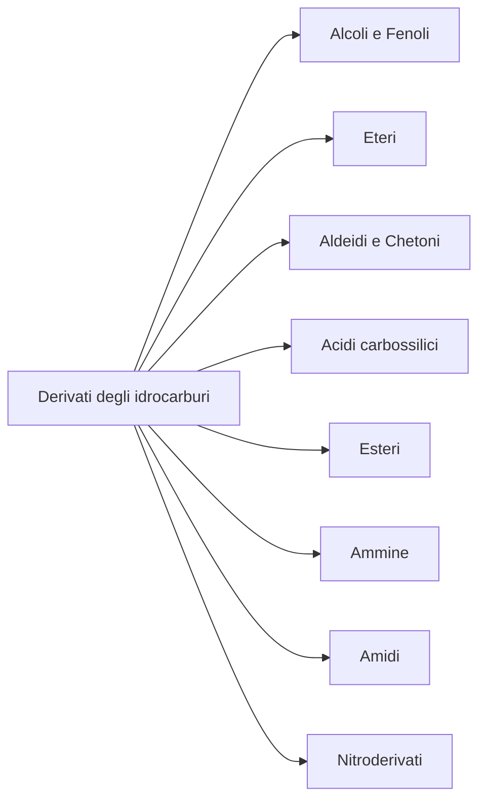

# Derivati degli idrocarburi

I **derivati degli idrocarburi** sono composti organici che derivano dagli idrocarburi sostituendo uno o più atomi di idrogeno con altri gruppi funzionali. Questi gruppi conferiscono proprietà chimiche specifiche e sono fondamentali in chimica organica.

## Alcoli e Fenoli

Gli **alcoli** hanno il gruppo funzionale -OH (ossidrile) legato a un atomo di carbonio saturo.

| Nome      | Formula generale | Esempio      |
|-----------|------------------|--------------|
| Alcoli    | R-OH             | Etanolo (CH₃CH₂OH) |
| Fenoli    | Ar-OH            | Fenolo (C₆H₅OH)   |

!!! abstract "Proprietà degli alcoli"
    - Solubili in acqua (soprattutto i primi)
    - Punto di ebollizione alto
    - Reazioni: ossidazione, disidratazione

!!! example "Esempio: ossidazione dell'etanolo"
    \[
      CH_3CH_2OH \xrightarrow{[O]} CH_3CHO + H_2O
    \]

## Eteri

Gli **eteri** hanno il gruppo funzionale -O- tra due catene carboniose.

| Nome      | Formula generale | Esempio      |
|-----------|------------------|--------------|
| Eteri     | R-O-R'           | Dietil etere (CH₃CH₂-O-CH₂CH₃) |

!!! tip "Consiglio"
    Gli eteri sono poco reattivi e usati come solventi.

## Aldeidi e Chetoni

Entrambi hanno il gruppo carbonilico (>C=O), ma:
- **Aldeidi**: il gruppo è all'estremità della catena (R-CHO)
- **Chetoni**: il gruppo è all'interno (R-CO-R')

| Nome      | Formula generale | Esempio      |
|-----------|------------------|--------------|
| Aldeidi   | R-CHO            | Formaldeide (HCHO) |
| Chetoni   | R-CO-R'          | Acetone (CH₃COCH₃) |

!!! abstract "Proprietà"
    - Volatili, odore intenso
    - Reazioni: ossidazione, riduzione

!!! example "Esempio: ossidazione di un'aldeide"
    \[
      R-CHO + [O] \rightarrow R-COOH
    \]

## Acidi carbossilici

Hanno il gruppo -COOH (carbossile) all'estremità della catena.

| Nome      | Formula generale | Esempio      |
|-----------|------------------|--------------|
| Acidi carbossilici | R-COOH   | Acido acetico (CH₃COOH) |

!!! abstract "Proprietà"
    - Acidi forti in soluzione
    - Reazioni: esterificazione, neutralizzazione

!!! example "Esempio: reazione di neutralizzazione"
    \[
      CH_3COOH + NaOH \rightarrow CH_3COONa + H_2O
    \]

## Esteri

Derivano dalla reazione tra un acido carbossilico e un alcol.

| Nome      | Formula generale | Esempio      |
|-----------|------------------|--------------|
| Esteri    | R-COO-R'         | Acetato di etile (CH₃COOCH₂CH₃) |

!!! example "Esempio: reazione di esterificazione"
    \[
      CH_3COOH + CH_3CH_2OH \rightarrow CH_3COOCH_2CH_3 + H_2O
    \]

## Altri derivati

- **Ammine**: gruppo -NH₂
- **Amidi**: gruppo -CONH₂
- **Nitroderivati**: gruppo -NO₂

## Schema dei derivati

## Checklist

- [x] Teoria
- [x] Esempi
- [ ] Esercizi svolti

## Collegamenti

- **Scienze**: metabolismo (alcoli, acidi, esteri)
- **Biologia**: acidi grassi, amminoacidi
- **Storia**: sintesi industriale di composti organici
- **Fisica**: proprietà fisiche (ebollizione, solubilità)
