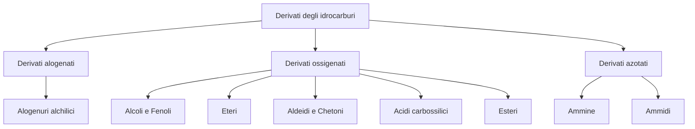

# Derivati degli idrocarburi

I **derivati degli idrocarburi** sono composti organici che si ottengono sostituendo uno o piu' atomi di idrogeno con atomi o gruppi atomici diversi, detti **gruppi funzionali**. Sono i gruppi funzionali a determinare la reattivita' e il tipo di reazioni del composto.

I derivati si suddividono in tre grandi famiglie:

1. **Derivati alogenati**: contengono un gruppo funzionale con un atomo di alogeno (F, Cl, Br, I)
2. **Derivati ossigenati**: contengono un gruppo funzionale con ossigeno (alcoli, fenoli, eteri, aldeidi, chetoni, acidi carbossilici, esteri)
3. **Derivati azotati**: contengono un gruppo funzionale con azoto (ammine, ammidi)

---

## Alogenuri alchilici

Gli **alogenuri alchilici** sono composti in cui uno o piu' atomi di idrogeno di un alcano sono stati sostituiti da un atomo di **alogeno** (fluoro, cloro, bromo o iodio). La formula molecolare generale e':

\[
  R - X
\]

dove R rappresenta un gruppo alchilico e X un atomo di alogeno.

### Nomenclatura

Secondo le regole IUPAC, il **nome** degli alogenuri alchilici e' formato da un numero che indica la posizione dell'alogeno nella catena, seguito dal nome dell'alogeno e dal nome dell'alcano corrispondente:

| Formula | Nome IUPAC | Nome comune |
|---------|-----------|-------------|
| \( CH_3 - Cl \) | clorometano | cloruro di metile |
| \( CH_3 - CH_2 - I \) | iodoetano | ioduro di etile |
| \( CH_3 - CH_2 - CH_2 - CH_2 - Br \) | 1-bromobutano | — |

!!! tip "Consiglio per la nomenclatura"
    Se lo **stesso** sostituente e' presente piu' volte, i numeri di posizione sono separati da virgola e si usano i prefissi *di-*, *tri-*, *tetra-*. Se i sostituenti sono **diversi**, si elencano in ordine alfabetico.

### Classificazione: primari, secondari, terziari

Gli alogenuri alchilici si classificano in base al tipo di carbonio a cui e' legato l'alogeno:

| Tipo | Struttura | Il carbonio e' legato a... |
|------|-----------|---------------------------|
| **Primario** | \( R - CH_2 - X \) | un solo atomo di carbonio |
| **Secondario** | \( R - CH(-X) - R' \) | due atomi di carbonio |
| **Terziario** | \( R_3C - X \) | tre atomi di carbonio |

!!! warning "Attenzione"
    Questa classificazione e' molto importante perche' determina il tipo di reazione che l'alogenuro subira' (sostituzione o eliminazione, e con quale meccanismo).

### Isomeria di posizione

Negli alogenuri alchilici (tranne i derivati del metano) si verifica l'**isomeria di posizione**, cioe' l'alogeno puo' trovarsi in posizioni diverse della catena. Per esempio, il cloropentano (\( C_5H_{11}Cl \)) ha tre isomeri: 1-cloropentano, 2-cloropentano e 3-cloropentano.

### Sintesi degli alogenuri alchilici

Le reazioni piu' comuni per ottenere alogenuri alchilici sono tre:

**1. Alogenazione degli alcheni** — reazione di addizione elettrofila tra un alchene e un alogeno (\( Cl_2, Br_2 \)) in un solvente anidro. Il prodotto e' un **dialogenuro alchilico** con configurazione *trans*:

\[
  R-CH=CH_2 + Br_2 \xrightarrow{CCl_4} R-CHBr-CH_2Br
\]

**2. Idroalogenazione degli alcheni** — addizione elettrofila di un acido alogenidrico (HCl, HBr) a un alchene. Con alcheni asimmetrici la reazione segue la **regola di Markovnikov**:

\[
  CH_3-CH=CH-CH_3 + HBr \rightarrow CH_3-CHBr-CH_2-CH_3
\]

!!! abstract "Regola di Markovnikov"
    L'idrogeno dell'acido si lega al carbonio del doppio legame che ha gia' **piu' atomi di idrogeno**, e l'alogeno si lega al carbonio con meno idrogeni.

**3. Idroalogenazione degli alcoli** — sostituzione nucleofila tra un alcol e un acido alogenidrico:

\[
  R-OH + HBr \rightarrow R-Br + H_2O
\]

### Proprieta' fisiche

- Gli alogenuri alchilici hanno punti di ebollizione **piu' alti** rispetto agli idrocarburi con lo stesso numero di atomi di carbonio, perche' l'alogeno nella catena aumenta la massa atomica e le **interazioni dipolo-dipolo**.
- La temperatura di ebollizione cresce con l'aumentare delle dimensioni dell'atomo di alogeno: \( CH_3F < CH_3Cl < CH_3Br < CH_3I \)
- Sono **insolubili** in acqua, ma solubili in solventi organici.

### Reazioni di sostituzione nucleofila

La reattivita' degli alogenuri alchilici e' legata alla maggiore **elettronegativita'** dell'alogeno rispetto al carbonio, che rende il legame C—X **polare**. Il carbonio assume una parziale carica positiva e puo' essere attaccato da un **nucleofilo**.

Esistono due meccanismi di sostituzione nucleofila:

#### Meccanismo S~N~2 (sostituzione nucleofila bimolecolare)

Il nucleofilo attacca il carbonio dalla parte **opposta** all'alogeno, causando un'**inversione di configurazione**. Avviene in **un solo stadio**.

!!! example "Esempio: reazione S~N~2"
    \[
      OH^- + CH_3CH_2-Br \rightarrow CH_3CH_2-OH + Br^-
    \]
    Lo ione idrossido (nucleofilo) attacca il 2-bromobutano e si forma il 2-butanolo.

Aspetti chiave del meccanismo S~N~2:

- La **velocita'** dipende dalla concentrazione sia del nucleofilo sia dell'alogenuro
- Avviene preferibilmente con **alogenuri primari** (meno ingombro sterico)
- E' favorito da **nucleofili forti** (come \( OH^-, RO^-, CN^- \))
- Il processo e' sfavorito con alogenuri terziari per l'ingombro dei tre gruppi alchilici

Le reazioni piu' comuni con meccanismo S~N~2 sono:

- Alogenuro primario + \( OH^- \) → **alcol primario**
- Alogenuro primario + \( RO^- \) → **etere**

#### Meccanismo S~N~1 (sostituzione nucleofila monomolecolare)

La reazione avviene in **due stadi**:

1. **Stadio lento**: l'alogenuro si dissocia spontaneamente formando un **carbocatione intermedio** (ione positivo sul carbonio)
2. **Stadio veloce**: il nucleofilo attacca il carbocatione

!!! example "Esempio: reazione S~N~1"
    Il 2-bromo-2-metilpropano reagisce con l'acqua:

    **Stadio 1** (lento): \( (CH_3)_3C-Br \rightleftharpoons (CH_3)_3C^+ + Br^- \)

    **Stadio 2** (veloce): il carbocatione viene attaccato dall'acqua, formando il 2-metil-2-propanolo.

Aspetti chiave del meccanismo S~N~1:

- La **velocita'** dipende solo dalla concentrazione dell'alogenuro (non del nucleofilo)
- Avviene preferibilmente con **alogenuri terziari** (carbocationi terziari piu' stabili)
- E' favorito da **nucleofili deboli** (acqua, alcoli)

Le reazioni piu' comuni con meccanismo S~N~1 sono:

- Alogenuro terziario + \( H_2O \) → **alcol terziario**
- Alogenuro terziario + \( R'OH \) → **etere**

### Reazioni di eliminazione

In una reazione di **eliminazione**, il nucleofilo (che agisce da **base**) strappa un protone \( H^+ \) dall'alogenuro, causando la perdita dell'alogeno e la formazione di un **doppio legame** (alchene).

- **Meccanismo E2**: avviene in un solo stadio, favorito con alogenuri primari e basi forti
- **Meccanismo E1**: avviene in due stadi (come S~N~1), favorito con alogenuri terziari e basi deboli

!!! example "Esempio: eliminazione E2"
    \[
      CH_3-CHBr-CH_3 + OH^- \rightarrow CH_3-CH=CH_2 + H_2O + Br^-
    \]
    Dal 1-bromopropano si ottiene propene.

### Competizione tra sostituzione e eliminazione

| Condizione | Alogenuri primari | Alogenuri terziari |
|-----------|-------------------|-------------------|
| Nucleofilo forte | S~N~2 | E2 |
| Nucleofilo forte e base forte | S~N~2 e E2 in competizione | E2 |
| Nucleofilo debole | S~N~2 | S~N~1 e E1 |

---

## Alcoli e fenoli

### Gli alcoli: il gruppo ossidrile

Gli **alcoli** sono composti caratterizzati dalla presenza del gruppo funzionale **ossidrile** \( -OH \), legato a un carbonio saturo (\( sp^3 \)). La formula molecolare generale e':

\[
  R - OH
\]

### Nomenclatura degli alcoli

Il nome IUPAC degli **alcoli saturi** si ottiene sostituendo la desinenza *-o* dell'alcano con il suffisso **-olo**. I primi quattro termini sono:

| Formula | Nome IUPAC | Nome comune |
|---------|-----------|-------------|
| \( CH_3-OH \) | metanolo | alcol metilico |
| \( CH_3-CH_2-OH \) | etanolo | alcol etilico |
| \( CH_3-CH_2-CH_2-OH \) | 1-propanolo | alcol propilico |
| \( CH_3-CH_2-CH_2-CH_2-OH \) | 1-butanolo | alcol butilico |

A partire dal terzo termine si puo' avere **isomeria di posizione** (il gruppo -OH puo' trovarsi su carboni diversi). Il propanolo, per esempio, esiste come 1-propanolo e 2-propanolo.

Gli **alcoli insaturi** hanno il gruppo ossidrile su una catena con un doppio o triplo legame. Il nome si costruisce indicando la posizione del gruppo -OH, seguita dal suffisso *-olo*.

### Classificazione degli alcoli

Gli alcoli si classificano in **primari**, **secondari** e **terziari** a seconda del tipo di carbonio a cui e' legato il gruppo -OH:

| Tipo | Struttura | Esempio |
|------|-----------|---------|
| Primario | \( R-CH_2-OH \) | etanolo |
| Secondario | \( R-CH(-OH)-R' \) | 2-propanolo |
| Terziario | \( R_3C-OH \) | 2-metil-2-propanolo |

### Sintesi degli alcoli

Le reazioni principali per sintetizzare gli alcoli sono:

**1. Idratazione degli alcheni** — addizione elettrofila di acqua in ambiente acido. Con alcheni asimmetrici segue la regola di Markovnikov:

\[
  R-CH=CH_2 + H_2O \xrightarrow{H^+} R-CH(OH)-CH_3
\]

Si ottiene un alcol secondario o terziario.

**2. Riduzione di aldeidi e chetoni** — usando un riducente come \( LiAlH_4 \) o \( NaBH_4 \):

\[
  R-CHO \xrightarrow{[H]} R-CH_2-OH \quad \text{(alcol primario)}
\]

\[
  R-CO-R' \xrightarrow{[H]} R-CH(OH)-R' \quad \text{(alcol secondario)}
\]

### Proprieta' fisiche degli alcoli

| Nome | Formula | T. ebollizione (°C) | Solubilita' in acqua |
|------|---------|---------------------|---------------------|
| metanolo | \( CH_3-OH \) | 65 | molto solubile |
| etanolo | \( CH_3-CH_2-OH \) | 78,5 | molto solubile |
| 1-propanolo | \( CH_3-CH_2-CH_2-OH \) | 97 | molto solubile |
| 1-butanolo | \( CH_3-(CH_2)_3-OH \) | 117,7 | solubile |
| 1-pentanolo | \( CH_3-(CH_2)_4-OH \) | 137,9 | poco solubile |
| 1-esanolo | \( CH_3-(CH_2)_5-OH \) | 155,8 | insolubile |

!!! note "Perche' gli alcoli bollono a temperature alte?"
    Il gruppo -OH puo' formare **legami a idrogeno** intermolecolari, molto piu' forti delle forze di London. Per questo gli alcoli hanno punti di ebollizione piu' alti degli idrocarburi con massa simile. I primi tre termini sono molto **solubili** in acqua grazie ai legami a idrogeno con le molecole d'acqua. All'aumentare della catena carboniosa (parte idrofobica), la solubilita' **diminuisce**.

### Gli alcoli sono composti anfoteri

Gli alcoli si comportano sia da **acidi** (cedono \( H^+ \)) sia da **basi** (accettano \( H^+ \)).

**Comportamento acido** (acidi di Bronsted-Lowry): cedono uno ione \( H^+ \) all'acqua:

\[
  ROH + H_2O \rightleftharpoons RO^- + H_3O^+
\]

La forza acida si misura con la costante di dissociazione acida \( K_a \):

\[
  K_a = \frac{[RO^-][H_3O^+]}{[ROH]}
\]

Gli alcoli sono acidi **molto deboli**. Si preferisce esprimere l'acidita' con il \( pK_a = -\log K_a \). Maggiore il \( pK_a \), minore l'acidita'.

| Alcol | Tipo | \( K_a \) | \( pK_a \) |
|-------|------|-----------|-----------|
| etanolo | primario | \( 1 \cdot 10^{-16} \) | 16 |
| 2-propanolo | secondario | \( 1 \cdot 10^{-17} \) | 17 |
| 2-metil-2-propanolo | terziario | \( 1 \cdot 10^{-18} \) | 18 |

!!! info "Regola"
    Gli alcoli **primari** sono piu' acidi dei secondari, che a loro volta sono piu' acidi dei terziari.

### Le reazioni degli alcoli

Gli alcoli possono dare tre tipi di reazione: rottura del legame O—H, rottura del legame C—O, e ossidazione.

#### Rottura del legame O—H

Gli alcoli sono acidi molto deboli, ma in presenza di **metalli alcalini** (come sodio) reagiscono:

\[
  2\, R-OH + 2\, Na \rightarrow 2\, R-O^-Na^+ + H_2 \uparrow
\]

Si forma un **alcossido** (sale) e si libera idrogeno gassoso.

!!! example "Esempio"
    \[
      2\, CH_3-CH_2-OH + 2\, Na \rightarrow 2\, CH_3-CH_2-O^-Na^+ + H_2
    \]
    Etanolo + sodio → etossido di sodio + idrogeno

#### Rottura del legame C—O

La **disidratazione** di un alcol e' una reazione di eliminazione: in presenza di acido solforico a 180 °C si perde una molecola d'acqua e si forma un **alchene**:

\[
  CH_3-CH_2-OH \xrightarrow{H_2SO_4, 180°C} CH_2=CH_2 + H_2O
\]

#### Ossidazione degli alcoli

!!! abstract "Che cos'e' un'ossidazione?"
    Una reazione e' di **ossidazione** quando gli atomi di carbonio di una molecola formano nuovi legami con atomi di ossigeno. Il numero di ossidazione del carbonio **aumenta** e il numero di atomi di idrogeno **diminuisce**.

L'ossidazione degli alcoli dipende dal loro tipo:

- **Alcol primario** → **aldeide** (e poi eventualmente → acido carbossilico):

\[
  R-CH_2-OH \xrightarrow{[O]} R-CHO \xrightarrow{[O]} R-COOH
\]

- **Alcol secondario** → **chetone**:

\[
  R-CH(OH)-R' \xrightarrow{[O]} R-CO-R'
\]

- **Alcol terziario**: **non si ossidano** facilmente (non hanno atomi di idrogeno sul carbonio che porta il gruppo -OH).

!!! example "Esempio biologico: ossidazione dell'etanolo"
    L'ossidazione dell'etanolo avviene nel nostro organismo, nelle cellule del fegato, catalizzata dall'enzima *alcol deidrogenasi* con il coenzima \( NAD^+ \):

    \[
      CH_3-CH_2-OH + NAD^+ \rightarrow CH_3-CHO + NADH + H^+
    \]

    L'acetaldeide prodotta viene poi ossidata ad **acido acetico** e infine a \( CO_2 \) e acqua.

### I polioli

I **polioli** (o polialcoli) sono composti con **due o piu' gruppi ossidrile** (-OH). Il nome si costruisce aggiungendo la posizione dei gruppi -OH e il suffisso *-diolo*, *-triolo*, ecc.

| Composto | Formula | Uso |
|----------|---------|-----|
| **Glicole etilenico** (1,2-etandiolo) | \( HOCH_2-CH_2OH \) | Antigelo per automobili |
| **Glicerolo** (1,2,3-propantriolo) | \( HOCH_2-CH(OH)-CH_2OH \) | Cosmetica, farmaci |

!!! warning "Nitroglicerina"
    Il glicerolo reagendo con acido nitrico forma la **nitroglicerina**, un potente esplosivo. Assorbita su materiale poroso, diventa la **dinamite**.

### I fenoli

I **fenoli** sono composti in cui il gruppo -OH e' legato direttamente a un **anello benzenico**. La formula generale e':

\[
  Ar - OH
\]

Il fenolo piu' semplice e' il **fenolo** (idrossibenene, \( C_6H_5OH \)).

#### Nomenclatura dei fenoli

Se sull'anello benzenico sono presenti anche altri sostituenti, il gruppo -OH ha la **priorita'** nell'assegnazione della desinenza (tranne con aldeidi e acidi carbossilici):

| Composto | Struttura |
|----------|-----------|
| Fenolo | anello benzenico con -OH |
| Idrochinone | 1,4-diidrossibenzene |
| o-Cresolo | 2-metildrossibenzene |

#### Proprieta' dei fenoli

!!! note "Differenze tra fenoli e alcoli"
    - I fenoli sono **piu' acidi** degli alcoli, perche' lo ione fenossido (\( C_6H_5O^- \)) e' stabilizzato dalla **delocalizzazione per risonanza** della carica negativa sull'anello benzenico.
    - I fenoli **non** hanno comportamento basico: la protonazione del gruppo -OH porterebbe alla formazione di un catione fenile, ma la geometria dell'anello benzenico impedisce questa reazione.
    - I fenoli formano legami a idrogeno, ma sono **poco solubili** in acqua per la presenza dell'anello aromatico idrofobico.

#### Reazioni dei fenoli

**Rottura del legame O—H**: i fenoli sono acidi deboli e reagiscono con **basi forti**, formando sali detti **fenossidi**:

\[
  C_6H_5-OH + NaOH \rightarrow C_6H_5-O^-Na^+ + H_2O
\]

**Ossidazione**: per esempio, l'idrochinone si ossida a **benzochinone**.

### I tioli

I **tioli** (o mercaptani) hanno il gruppo funzionale **-SH** (solfidrile) legato a un carbonio saturo. La formula generale e':

\[
  R - SH
\]

Il nome si ottiene aggiungendo il suffisso *-tiolo* al nome dell'alcano. I tioli si ossidano formando **disolfuri** (\( R-S-S-R \)), legame importante nelle proteine (legame disolfuro \( S-S \)).

---

## Eteri

### Il gruppo funzionale

Gli **eteri** sono composti in cui un atomo di **ossigeno** e' legato a due gruppi organici (alchilici o arilici). Le formule generali sono:

\[
  R-O-R \quad \quad Ar-O-Ar \quad \quad R-O-Ar
\]

### Nomenclatura e classificazione

Gli eteri sono denominati con un nome formato dai nomi dei **due gruppi organici** (in ordine alfabetico) seguiti dalla parola *etere*:

| Formula | Nome |
|---------|------|
| \( CH_3-O-CH_3 \) | dimetil etere |
| \( CH_3-CH_2-O-CH_2-CH_3 \) | dietil etere |
| \( CH_3-O-C_6H_5 \) | fenil metil etere |

Se i due gruppi sono uguali → etere **simmetrico**; se sono diversi → etere **asimmetrico**.

### Sintesi degli eteri

**1. Disidratazione intermolecolare degli alcoli** — due molecole di alcol primario perdono una molecola d'acqua in presenza di acido solforico a 140 °C:

\[
  CH_3-CH_2-OH + HO-CH_2-CH_3 \xrightarrow{H_2SO_4, 140°C} CH_3-CH_2-O-CH_2-CH_3 + H_2O
\]

**2. Sintesi di Williamson** — un alcossido metallico (\( R-O^-Na^+ \)) reagisce con un alogenuro alchilico primario tramite meccanismo S~N~2:

\[
  R-O^-Na^+ + R'-X \rightarrow R-O-R' + NaX
\]

### Proprieta' fisiche

| Nome | Formula | Massa molecolare | T. eb. (°C) | Solubilita' |
|------|---------|-----------------|-------------|-------------|
| dimetil etere | \( CH_3-O-CH_3 \) | 46 | -25 | solubile |
| dietil etere | \( C_2H_5-O-C_2H_5 \) | 74 | 35 | solubile |
| dipentil etere | \( C_5H_{11}-O-C_5H_{11} \) | 158 | 187 | insolubile |

!!! note "Proprieta' degli eteri"
    - Gli eteri **non** formano legami a idrogeno tra di loro (non hanno H legato a O), quindi hanno punti di ebollizione **molto piu' bassi** degli alcoli con massa simile.
    - Pero' possono formare legami a idrogeno **con l'acqua**, quindi i primi termini sono **solubili**.
    - Sono composti poco reattivi e sono usati come **solventi** in chimica organica (il dietil etere e' stato usato anche come anestetico).

---

## Aldeidi e chetoni

### Il gruppo funzionale carbonile

Aldeidi e chetoni sono caratterizzati dalla presenza del **gruppo funzionale carbonile** \( >C=O \), in cui un atomo di carbonio ibridato \( sp^2 \) e' legato a un atomo di ossigeno da un **doppio legame**.

Il legame C=O e' fortemente **polare**: l'ossigeno, piu' elettronegativo, attira verso di se' gli elettroni, creando una parziale carica negativa (\( \delta^- \)) sull'ossigeno e una parziale carica positiva (\( \delta^+ \)) sul carbonio. Questa polarita' e' la chiave della reattivita' di aldeidi e chetoni.

### Differenza tra aldeidi e chetoni

- Nelle **aldeidi** il carbonio del gruppo carbonile e' legato a un atomo di idrogeno e a un gruppo alchilico (o arilico):

\[
  R-CHO \quad \quad \quad Ar-CHO
\]

- Nei **chetoni** il carbonio del gruppo carbonile e' legato a **due** gruppi alchilici o arilici:

\[
  R-CO-R' \quad \quad Ar-CO-Ar \quad \quad Ar-CO-R
\]

### Nomenclatura

**Aldeidi**: il nome IUPAC si ottiene sostituendo la desinenza *-o* dell'alcano con il suffisso **-ale**:

| Formula | Nome IUPAC | Nome comune |
|---------|-----------|-------------|
| \( H-CHO \) | metanale | formaldeide |
| \( CH_3-CHO \) | etanale | acetaldeide |
| \( CH_3-CH_2-CHO \) | propanale | aldeide propionica |
| \( CH_3-CH_2-CH_2-CHO \) | butanale | aldeide butirrica |

**Chetoni**: il nome IUPAC si ottiene sostituendo la desinenza *-o* con il suffisso **-one**:

| Formula | Nome IUPAC | Nome comune |
|---------|-----------|-------------|
| \( CH_3-CO-CH_3 \) | propanone | acetone |
| \( CH_3-CO-CH_2-CH_3 \) | butanone | metiletilchetone |
| \( CH_3-CO-CH_2-CH_2-CH_3 \) | 2-pentanone | — |

!!! tip "Consiglio"
    Il primo termine della serie dei chetoni e' il **propanone** (acetone), che ha 3 atomi di carbonio. A partire dal pentanone si ha isomeria di posizione (il gruppo C=O puo' trovarsi in posizioni diverse).

### Sintesi di aldeidi e chetoni

La reazione di sintesi piu' comune e' l'**ossidazione degli alcoli primari e secondari** in presenza di un forte ossidante:

\[
  R-CH_2-OH \xrightarrow{[O]} R-CHO \quad \text{(alcol primario} \rightarrow \text{aldeide)}
\]

\[
  R-CH(OH)-R' \xrightarrow{[O]} R-CO-R' \quad \text{(alcol secondario} \rightarrow \text{chetone)}
\]

### Proprieta' fisiche

| Classe | Nome | Formula | T. eb. (°C) | Massa molecolare |
|--------|------|---------|-------------|-----------------|
| aldeide | propanale | \( CH_3CH_2CHO \) | 49 | 58 |
| chetone | acetone | \( CH_3COCH_3 \) | 56 | 58 |
| aldeide | pentanale | \( CH_3(CH_2)_3CHO \) | 103 | 86 |
| chetone | 3-pentanone | \( CH_3CH_2COCH_2CH_3 \) | 102 | 86 |

!!! note "Caratteristiche fisiche"
    - Hanno punti di ebollizione **piu' alti** degli idrocarburi (grazie alla polarizzazione del C=O) ma **piu' bassi** degli alcoli (perche' non formano legami a idrogeno tra di loro).
    - I primi termini sono **solubili** in acqua (possono accettare legami a idrogeno dall'acqua), ma la solubilita' diminuisce con la massa molecolare.
    - Molte aldeidi e chetoni hanno **odori caratteristici**: la formaldeide ha un odore pungente, mentre molti chetoni hanno aromi gradevoli (usati in profumi e cosmetici).

### Reattivita' di aldeidi e chetoni

La reattivita' dipende dal gruppo carbonile polare. Il carbonio con parziale carica positiva (\( \delta^+ \)) e' un punto di attacco per i **nucleofili**.

!!! info "Aldeidi vs chetoni"
    Le aldeidi sono **piu' reattive** dei chetoni perche' nel chetone il carbonio carbonilico e' legato a due gruppi alchilici che, essendo **elettron-donatori**, riducono la parziale carica positiva.

#### Addizione nucleofila

La reazione piu' comune e' l'**addizione nucleofila** al doppio legame C=O. Il nucleofilo attacca il carbonio, il doppio legame si rompe, e si forma un nuovo legame:

\[
  >C=O + R-OH \rightleftharpoons \text{emiacetale (o emichetale)}
\]

L'emiacetale puo' reagire con un'altra molecola di alcol per formare un **acetale** (o **chetale**), con eliminazione di acqua.

#### Riduzione

La riduzione di aldeidi e chetoni con agenti riducenti (\( LiAlH_4 \), \( NaBH_4 \)) forma alcoli:

\[
  R-CHO \xrightarrow{[H]} R-CH_2-OH \quad \text{(alcol primario)}
\]

\[
  R-CO-R' \xrightarrow{[H]} R-CH(OH)-R' \quad \text{(alcol secondario)}
\]

#### Ossidazione

L'ossidazione delle **aldeidi** in presenza di opportuni ossidanti genera **acidi carbossilici**:

\[
  R-CHO \xrightarrow{[O]} R-COOH
\]

!!! warning "Attenzione"
    I **chetoni** sono molto piu' difficili da ossidare perche' richiederebbero la rottura di un legame C—C.

#### Reattivi di Fehling e di Tollens

Sono saggi di laboratorio per riconoscere le **aldeidi**:

**Reattivo di Fehling**: contiene ioni \( Cu^{2+} \) (colore azzurro). In presenza di un'aldeide, gli ioni si riducono a \( Cu_2O \) (precipitato rosso mattone):

\[
  R-CHO + 2\, Cu^{2+} + 5\, OH^- \rightarrow R-COO^- + Cu_2O \downarrow + 3\, H_2O
\]

**Reattivo di Tollens**: contiene ioni \( Ag^+ \) in ammoniaca. In presenza di un'aldeide, l'argento si deposita come uno **specchio** sulla parete della provetta:

\[
  R-CHO + 2\, [Ag(NH_3)_2]^+ + 3\, OH^- \rightarrow R-COO^- + 2\, Ag \downarrow + 4\, NH_3 + 2\, H_2O
\]

### Tautomeria cheto-enolica

Le aldeidi e i chetoni che presentano un atomo di idrogeno sul carbonio adiacente al gruppo carbonile possono esistere in due forme in equilibrio:

- **Forma chetonica**: il doppio legame e' tra C e O
- **Forma enolica**: il doppio legame e' tra due atomi di C, e il gruppo -OH e' legato a uno di essi

In genere la forma **chetonica e' prevalente**, ma in certi casi l'equilibrio puo' essere spostato verso la forma enolica.

---

## Acidi carbossilici

### Il gruppo funzionale carbossile

Gli **acidi carbossilici** sono caratterizzati dal gruppo funzionale **carbossile** \( -COOH \), formato da due gruppi funzionali: il gruppo carbonile \( >C=O \) e il gruppo ossidrile \( -OH \).

Il carbonio del gruppo carbossile e' ibridato \( sp^2 \): i tre orbitali ibridi sono disposti a 120° (disposizione planare triangolare) e formano tre legami \( \sigma \). L'orbitale *p* non ibrido forma il legame \( \pi \) con l'ossigeno.

Le formule molecolari generali sono:

\[
  R-COOH \quad \text{(acido alifatico)} \quad \quad Ar-COOH \quad \text{(acido aromatico)}
\]

### Nomenclatura

Il nome IUPAC si ottiene dal nome dell'alcano corrispondente, sostituendo la desinenza *-o* con il suffisso **-oico**, preceduto dalla parola *acido*:

| Formula | Nome IUPAC | Nome comune |
|---------|-----------|-------------|
| \( H-COOH \) | acido metanoico | acido formico |
| \( CH_3-COOH \) | acido etanoico | acido acetico |
| \( CH_3-CH_2-COOH \) | acido propanoico | acido propionico |
| \( CH_3-(CH_2)_2-COOH \) | acido butanoico | acido butirrico |

!!! info "Nomi comuni"
    Molti acidi carbossilici hanno nomi comuni che derivano dalla loro **fonte naturale**: acido formico (dalle formiche), acido acetico (dall'aceto), acido butirrico (dal burro).

### Gli acidi grassi

Gli **acidi grassi** sono acidi carbossilici alifatici con un numero **pari** di atomi di carbonio (solitamente da 12 a 22). Possono essere:

- **Saturi**: senza doppi legami nella catena carboniosa
- **Insaturi**: con uno o piu' doppi legami (configurazione *cis*)

| Nome comune | Atomi di C | Tipo |
|-------------|-----------|------|
| Acido laurico | 12 | saturo |
| Acido palmitico | 16 | saturo |
| Acido stearico | 18 | saturo |
| Acido oleico | 18 | insaturo (1 doppio legame) |
| Acido linoleico | 18 | insaturo (2 doppi legami) |
| Acido linolenico | 18 | insaturo (3 doppi legami) |

Gli acidi grassi si trovano in natura sotto forma di **trigliceridi**: se contengono acidi grassi saturi sono **grassi** (solidi a temperatura ambiente), se contengono acidi grassi insaturi sono **oli** (liquidi).

### Proprieta' fisiche

- I primi quattro termini sono **liquidi** a temperatura ambiente; dal quinto in poi sono **solidi**.
- Il gruppo -COOH puo' formare **legami a idrogeno** (piu' forti degli alcoli), quindi i punti di ebollizione sono **molto alti**.
- I primi termini sono **molto solubili** in acqua; la solubilita' diminuisce con la catena carboniosa.

| Nome | Formula | T. eb. (°C) | Solubilita' |
|------|---------|-------------|-------------|
| acido metanoico | \( HCOOH \) | 101 | molto solubile |
| acido etanoico | \( CH_3COOH \) | 118 | molto solubile |
| acido propanoico | \( C_2H_5COOH \) | 141 | molto solubile |
| acido butanoico | \( C_3H_7COOH \) | 164 | solubile |
| acido esanoico | \( C_5H_{11}COOH \) | 205 | poco solubile |

### Gli acidi carbossilici sono acidi deboli

In acqua gli acidi carbossilici si dissociano **parzialmente** cedendo un protone:

\[
  R-COOH + H_2O \rightleftharpoons R-COO^- + H_3O^+
\]

La forza dell'acido si esprime con la costante di dissociazione \( K_a \). Poiche' i valori di \( K_a \) sono piccoli, si usa il \( pK_a \):

| Acido | \( K_a \) | \( pK_a \) |
|-------|-----------|-----------|
| acido metanoico | \( 2.1 \cdot 10^{-4} \) | 3,75 |
| acido etanoico | \( 1.8 \cdot 10^{-5} \) | 4,74 |
| acido propanoico | \( 1.3 \cdot 10^{-5} \) | 4,87 |
| acido cloroetanoico | \( 1.5 \cdot 10^{-3} \) | 2,82 |

!!! abstract "Effetto induttivo"
    La presenza di **gruppi elettron-attrattori** (come gli alogeni) aumenta l'acidita'. Per esempio, l'acido cloroetanoico e' piu' acido dell'acido etanoico perche' il cloro attira elettroni e stabilizza la base coniugata (\( R-COO^- \)). L'acidita' degli acidi carbossilici e' comunque **maggiore** di quella degli alcoli, perche' lo ione carbossilato e' stabilizzato dalla **delocalizzazione per risonanza** della carica negativa su entrambi gli atomi di ossigeno.

### Le reazioni degli acidi carbossilici

#### Rottura del legame O—H (neutralizzazione)

La reazione acido-base con una **base forte** (NaOH, KOH) produce un **sale** dell'acido e acqua:

\[
  R-COOH + NaOH \rightarrow R-COO^-Na^+ + H_2O
\]

Il nome del sale si ottiene dalla radice dell'acido con il suffisso *-ato*, seguito dal nome del metallo. Per esempio: acido etanoico → **etanoato di sodio** (acetato di sodio).

#### Sostituzione nucleofila acilica

Il gruppo -OH dell'acido viene sostituito da un nucleofilo. Il gruppo funzionale risultante si chiama **gruppo acilico**. I prodotti sono i **derivati degli acidi carbossilici**: esteri, ammidi, anidridi.

### I FANS (Farmaci Antinfiammatori Non Steroidei)

!!! info "Curiosita'"
    I FANS come ibuprofene, naprossene e **aspirina** sono acidi carbossilici o loro derivati. L'aspirina (acido acetilsalicilico) fu sintetizzata dalla casa farmaceutica Bayer nel 1899. E' il farmaco piu' diffuso al mondo: riduce dolore, infiammazione e febbre.

---

## Esteri

### Il gruppo funzionale estereo

Gli **esteri** sono derivati degli acidi carbossilici in cui il gruppo ossidrile -OH e' stato sostituito dal gruppo alcossido \( -OR' \) degli alcoli. Il gruppo funzionale e':

\[
  -COO- \quad \text{(gruppo estereo)}
\]

Le formule molecolari generali sono:

\[
  R-COO-R' \quad \quad Ar-COO-R'
\]

Gli esteri sono largamente **diffusi in natura**: sono responsabili dell'odore gradevole della frutta e dei fiori. Appartengono alla classe degli esteri anche le cere, i grassi e molti aromi usati in profumeria.

### Nomenclatura

Il nome IUPAC si costruisce dal nome del gruppo R della componente acida (con suffisso *-ato*) e dal nome del gruppo alcolico R' (con suffisso *-ile*):

| Formula | Nome IUPAC | Nome comune |
|---------|-----------|-------------|
| \( H-COO-CH_2CH_3 \) | metanoato di etile | formiato di etile |
| \( CH_3-COO-CH_3 \) | etanoato di metile | acetato di metile |

### La sintesi degli esteri: esterificazione di Fischer

La sintesi avviene mediante una reazione di **sostituzione nucleofila acilica** tra un acido carbossilico e un alcol, in presenza di un catalizzatore acido \( H^+ \). Si chiama **esterificazione di Fischer**:

\[
  R-COOH + R'-OH \xrightarrow{H^+} R-COOR' + H_2O
\]

!!! example "Esempio: formazione di un trigliceride"
    Il **glicerolo** (un triolo) reagisce con tre molecole di acidi grassi per formare un **trigliceride** (o triacilglicerolo):

    - I trigliceridi con acidi grassi **saturi** → **grassi** (solidi a temperatura ambiente)
    - I trigliceridi con acidi grassi **insaturi** → **oli** (liquidi a temperatura ambiente)

### L'idrolisi basica (saponificazione)

La reazione piu' importante degli esteri e' l'**idrolisi basica**: un estere reagisce con una base forte (NaOH) in soluzione acquosa, producendo il **sale dell'acido** e un **alcol**:

\[
  R-COOR' + NaOH \xrightarrow{H_2O, \Delta} R-COO^-Na^+ + R'-OH
\]

!!! info "I saponi"
    La saponificazione dei trigliceridi con NaOH produce **saponi** (sali di sodio degli acidi grassi). Il nome del sale si ottiene cambiando la desinenza dell'acido da *-ico* ad *-ato* e aggiungendo il nome del metallo.

---

## Ammidi

### Il gruppo funzionale ammidico

Le **ammidi** sono derivati degli acidi carbossilici in cui il gruppo -OH e' stato sostituito dal gruppo \( -NH_2 \), \( -NHR \) o \( -NR_2 \).

Il **gruppo funzionale ammidico** e' dato da un atomo di carbonio ibridato \( sp^2 \) legato a un atomo di ossigeno (doppio legame) e a un atomo di azoto (legame semplice):

\[
  -CON \quad \text{oppure} \quad -\overset{O}{C}-N
\]

Le ammidi si classificano in:

| Tipo | Formula | Descrizione |
|------|---------|-------------|
| Primaria | \( R-CO-NH_2 \) | azoto legato a 2 H |
| Secondaria | \( R-CO-NH-R' \) | azoto legato a 1 H e 1 gruppo alchilico |
| Terziaria | \( R-CO-NR'R'' \) | azoto legato a 2 gruppi alchilici |

### Nomenclatura

Il nome IUPAC delle ammidi primarie si costruisce dalla radice dell'acido corrispondente con il suffisso *-ammide*:

| Formula | Nome IUPAC | Nome comune |
|---------|-----------|-------------|
| \( H-CO-NH_2 \) | metanammide | formammide |
| \( CH_3-CO-NH_2 \) | etanammide | acetammide |

Per le ammidi secondarie e terziarie si usa la lettera *N-* seguita dal nome dei gruppi alchilici legati all'azoto.

### Il legame peptidico

!!! abstract "Legame peptidico"
    Il legame carbonio-azoto nelle ammidi, quando si stabilisce tra gli **amminoacidi** (i monomeri delle proteine), e' chiamato **legame peptidico**. E' il legame fondamentale delle proteine.

### L'urea

L'**urea** (\( H_2N-CO-NH_2 \)) e' una diammide dell'acido carbonico. E' il prodotto finale del metabolismo delle proteine e viene eliminata con le urine. E' un solido cristallino molto solubile in acqua.

### Sintesi e reazioni delle ammidi

Le ammidi primarie si ottengono facendo reagire un **estere** con **ammoniaca**:

\[
  R-COOR' + NH_3 \rightarrow R-CO-NH_2 + R'OH
\]

L'**idrolisi** delle ammidi (reazione inversa) avviene con un catalizzatore acido o base:

\[
  R-CO-NH_2 + H_2O \xrightarrow{H^+} R-COOH + NH_3
\]

### Le ammidi sono composti neutri

Le ammidi non sono ne' acide ne' basiche: il doppietto elettronico dell'azoto e' delocalizzato nel legame con il carbonile, per cui l'azoto e' **poco disponibile** ad accettare protoni (comportamento non basico).

---

## Le anidridi

Le **anidridi** sono derivati degli acidi carbossilici ottenuti per **eliminazione di acqua** tra due molecole di acido carbossilico:

\[
  R-CO-O-CO-R
\]

!!! example "Esempio: l'aspirina"
    L'**acido acetilsalicilico** (aspirina) si ottiene dalla reazione tra l'anidride acetica e l'acido salicilico (un idrossiacido).

---

## Ammine

### Il gruppo funzionale amminico

Le **ammine** sono composti organici derivati dall'ammoniaca (\( NH_3 \)), in cui uno o piu' atomi di idrogeno sono sostituiti da **gruppi alchilici o arilici**. Il gruppo funzionale amminico e' costituito da un atomo di **azoto** ibridato \( sp^3 \), con un **doppietto elettronico libero** e angoli di legame di circa 107°.

### Classificazione

| Tipo | Gruppo funzionale | Formula alifatica | Formula aromatica |
|------|-------------------|-------------------|-------------------|
| Primaria | \( -NH_2 \) | \( R-NH_2 \) | \( Ar-NH_2 \) |
| Secondaria | \( -NH- \) | \( R-NH-R' \) | \( Ar-NH-R' \) |
| Terziaria | \( -N< \) | \( R-N(R')(R'') \) | \( Ar-N(R')(R'') \) |

### Nomenclatura

**Ammine alifatiche primarie**: il nome IUPAC e' formato dal termine *ammino-* (con un numero che indica la posizione), seguito dal nome della catena carboniosa:

| Formula | Nome |
|---------|------|
| \( CH_3-NH_2 \) | metilammina |
| \( CH_3-CH_2-NH_2 \) | etilammina |
| \( CH_3-NH-CH_3 \) | dimetilammina (secondaria) |
| \( (CH_3)_3N \) | trimetilammina (terziaria) |

L'ammina aromatica piu' semplice e' l'**anilina** (\( C_6H_5-NH_2 \)), usata nella produzione di farmaci e coloranti.

### Sintesi delle ammine

**1. Alchilazione dell'ammoniaca** — sostituzione nucleofila (\( S_N2 \)) tra un alogenuro alchilico primario e ammoniaca in eccesso:

\[
  R-X + NH_3 \rightarrow R-NH_2 + HX
\]

**2. Riduzione delle ammidi** — un'ammide viene ridotta con un riducente per ottenere un'ammina:

\[
  R-CO-NH-R' \xrightarrow{[H]} R-CH_2-NH-R' + H_2O
\]

### Proprieta' fisiche

- Le ammine primarie e secondarie possono formare **legami a idrogeno** (ma piu' deboli di quelli degli alcoli, perche' N e' meno elettronegativo di O).
- I punti di ebollizione sono **piu' alti** degli idrocarburi ma **piu' bassi** degli alcoli con massa simile.
- Le ammine primarie e secondarie con massa molecolare non elevata sono **solubili** in acqua.
- Le ammine terziarie sono meno solubili perche' non hanno H legato ad N per fare legami a idrogeno tra loro.

| Composto | Massa molecolare | T. eb. (°C) |
|----------|-----------------|-------------|
| etano | 30 | -88 |
| metilammina | 31 | -6 |
| metanolo | 32 | 65 |

### Le ammine sono basi deboli

Per la presenza del **doppietto elettronico libero** sull'azoto, le ammine si comportano da **basi**:

**Come basi di Lewis**: donano il doppietto elettronico a un acido forte (HCl), formando un **sale di alchilammonio**:

\[
  CH_3-NH_2 + HCl \rightleftharpoons CH_3-NH_3^+Cl^-
\]

**Come basi di Bronsted-Lowry**: accettano un protone dall'acqua:

\[
  CH_3-CH_2-NH_2 + H_2O \rightleftharpoons CH_3-CH_2-NH_3^+ + OH^-
\]

!!! note "Basicita' delle ammine"
    Le ammine **alifatiche** sono basi piu' forti dell'ammoniaca (i gruppi alchilici sono elettron-donatori e rendono il doppietto piu' disponibile). Le ammine **aromatiche** (come l'anilina) sono basi piu' deboli perche' il doppietto dell'azoto e' delocalizzato per risonanza sull'anello benzenico.

---

## Acidi carbossilici polifunzionali

### Gli idrossiacidi

Gli **idrossiacidi** sono composti che contengono sia un gruppo ossidrile \( -OH \) sia un gruppo carbossile \( -COOH \). I piu' noti sono:

**L'acido lattico** (acido 2-idrossipropanoico): presente nel latte e nello yogurt. Esiste in due forme enantiomere (chiralita'):

- L'acido **D(-)-lattico**: prodotto dalla fermentazione lattica operata dai batteri nei muscoli durante l'attivita' fisica intensa. E' responsabile della sensazione di fatica.
- L'acido **L(+)-lattico**: presente nei prodotti lattiero-caseari.

**L'acido malico** (acido 2-idrossibutandioico): presente nella frutta, e' un importante intermedio del **ciclo di Krebs**.

### I chetoacidi

I **chetoacidi** contengono un gruppo carbonile \( >C=O \) e un gruppo carbossile \( -COOH \). I piu' importanti sono:

- **Acido piruvico** (acido 2-ossopropanoico): e' il prodotto finale della **glicolisi** e un composto chiave nel metabolismo energetico del glucosio.
- **Acido ossalacetico** (acido 2-ossobutandioico): e' l'intermedio finale del **ciclo di Krebs**, prodotto dall'ossidazione dell'acido malico.

### Gli acidi bicarbossilici

Gli **acidi bicarbossilici** contengono **due gruppi carbossile**. L'acido piu' semplice e' l'**acido ossalico** (\( COOH-COOH \)). I piu' diffusi sono gli acidi bicarbossilici aromatici, come l'**acido ftalico**, l'**acido isoftalico** e l'**acido tereftalico**.

!!! info "Applicazione industriale"
    L'**acido tereftalico** e' uno dei due componenti di partenza per la sintesi del **PET** (polietilene tereftalato), il polimero usato per le bottiglie di plastica.

---

## Checklist

- [x] Alogenuri alchilici: nomenclatura, classificazione, sintesi, reazioni (S~N~1, S~N~2, E1, E2)
- [x] Alcoli: nomenclatura, classificazione, sintesi, proprieta', reazioni, ossidazione
- [x] Fenoli: struttura, proprieta', reazioni
- [x] Tioli: struttura e legame disolfuro
- [x] Eteri: nomenclatura, sintesi, proprieta'
- [x] Aldeidi e chetoni: gruppo carbonile, nomenclatura, sintesi, proprieta', reattivita'
- [x] Acidi carbossilici: nomenclatura, acidi grassi, proprieta', acidita', reazioni
- [x] Esteri: esterificazione di Fischer, idrolisi basica, trigliceridi
- [x] Ammidi: struttura, legame peptidico, urea
- [x] Anidridi: struttura, aspirina
- [x] Ammine: classificazione, nomenclatura, proprieta', basicita'
- [x] Acidi polifunzionali: idrossiacidi, chetoacidi, acidi bicarbossilici
- [ ] Esercizi svolti

## Collegamenti

- **Biochimica**: gli acidi carbossilici polifunzionali (acido lattico, piruvico, ossalacetico) sono intermedi chiave del **ciclo di Krebs** e della **glicolisi**
- **Biologia**: i trigliceridi sono la riserva energetica dell'organismo; gli amminoacidi (che contengono sia il gruppo amminico che il carbossile) formano le proteine tramite il **legame peptidico**
- **Farmacologia**: i FANS (aspirina, ibuprofene) sono acidi carbossilici o derivati; l'anilina e' usata nella sintesi di farmaci e coloranti
- **Chimica industriale**: il PET si produce dall'acido tereftalico; la nitroglicerina dal glicerolo; il dietil etere fu usato come primo anestetico
- **Fisica**: le proprieta' fisiche (punto di ebollizione, solubilita') dipendono dalla polarita' dei legami e dai legami a idrogeno intermolecolari
- **Educazione civica**: la normativa sugli esplosivi (dinamite/nitroglicerina); il problema ambientale della plastica PET
