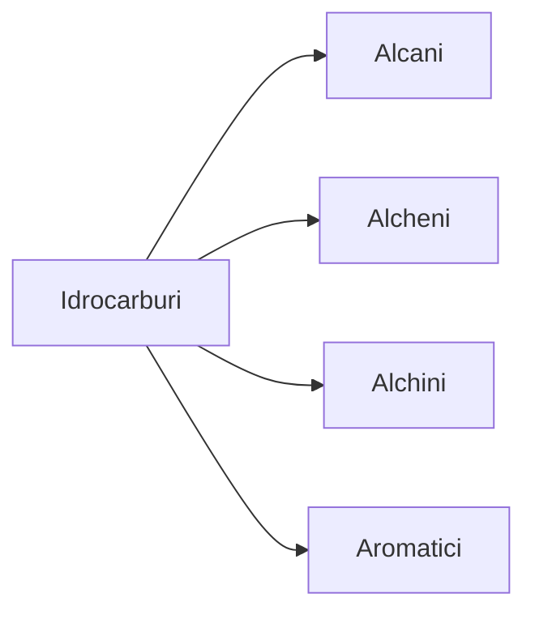

# Idrocarburi

Gli **idrocarburi** sono composti organici formati solo da atomi di carbonio (C) e idrogeno (H). Sono la base della chimica organica e si trovano in combustibili, materie plastiche e molti prodotti industriali.

## Classificazione

Gli idrocarburi si dividono in:

| Tipo         | Formula generale | Caratteristiche principali |
|--------------|------------------|---------------------------|
| Alcani       | CₙH₂ₙ₊₂         | Legami semplici (saturi)  |
| Alcheni      | CₙH₂ₙ            | Almeno un doppio legame    |
| Alchini      | CₙH₂ₙ₋₂          | Almeno un triplo legame    |
| Aromatici    | Variabile        | Anelli benzenici          |

!!! abstract "Regola generale"
    Gli idrocarburi si classificano in **saturi** (solo legami singoli) e **insaturi** (doppio o triplo legame).

## Proprietà

- Sono apolari (non si sciolgono in acqua)
- Sono infiammabili
- Hanno densità minore dell'acqua
- Usati come combustibili (es. metano, benzina)

## Esempi

| Nome      | Formula | Tipo     |
|-----------|---------|----------|
| Metano    | CH₄     | Alcano   |
| Etilene   | C₂H₄    | Alchene  |
| Acetilene | C₂H₂    | Alchino  |
| Benzene   | C₆H₆    | Aromatico|

!!! example "Esempio: combustione del metano"
    La combustione del metano produce anidride carbonica e acqua:
    
    \[
      CH_4 + 2 O_2 \rightarrow CO_2 + 2 H_2O
    \]

!!! tip "Consiglio"
    Ricorda: gli idrocarburi insaturi sono più reattivi dei saturi.

## Schema di classificazione

## Checklist

- [x] Teoria
- [x] Esempi
- [ ] Esercizi svolti

## Collegamenti

- **Scienze**: combustione e impatto ambientale (effetto serra)
- **Storia**: rivoluzione industriale e uso dei combustibili fossili
- **Fisica**: energia chimica e termodinamica
- **Biologia**: idrocarburi nei lipidi e membrane cellulari
