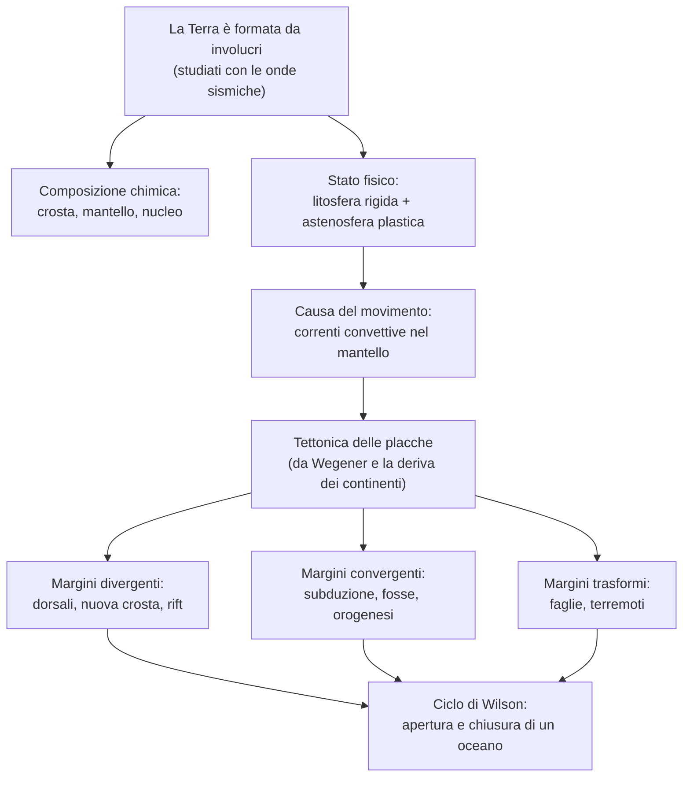

# Scienze della Terra — La tettonica delle placche

## La struttura interna della Terra

La struttura interna della Terra non è osservabile in modo diretto e viene ricostruita attraverso lo studio delle onde sismiche.

### Le onde sismiche

Le onde sismiche sono onde elastiche prodotte dai terremoti, che si propagano in tutte le direzioni all'interno della Terra. Nel passaggio da un materiale a un altro cambiano velocità e direzione, cioè si riflettono e si rifrangono; da questi cambiamenti si deduce che la Terra non è omogenea, ma è formata da involucri concentrici. Si distinguono inoltre due tipi di onde che si comportano in modo diverso: le onde P, più veloci, attraversano sia i solidi sia i liquidi, mentre le onde S attraversano solo i solidi. Proprio per questo, il fatto che le onde S si arrestino a una certa profondità è la prova che a quella profondità il materiale si trova allo stato liquido.

### Gli involucri e le discontinuità

Le superfici lungo le quali la velocità delle onde cambia bruscamente separano gli involucri della Terra e sono dette discontinuità. In base alla composizione chimica la Terra è formata da tre involucri: la crosta, la parte più esterna e sottile (oceanica o continentale); il mantello, lo strato intermedio costituito da silicati di ferro e magnesio; il nucleo, la parte centrale di ferro e nichel, distinto in nucleo esterno liquido e nucleo interno solido. Le discontinuità che li separano prendono il nome di chi le ha scoperte: la discontinuità di Mohorovičić (o Moho) tra crosta e mantello, la discontinuità di Gutenberg tra mantello e nucleo e la discontinuità di Lehmann tra nucleo esterno e interno.

### Litosfera e astenosfera

La Terra può essere divisa anche in base allo stato fisico degli strati, ed è questa la divisione più rilevante per la tettonica. La parte più esterna e rigida è la litosfera, che comprende la crosta e la porzione più alta del mantello. Subito al di sotto si trova l'astenosfera, uno strato plastico e parzialmente fuso sul quale la litosfera rigida può scorrere: è proprio questa possibilità di scorrimento a rendere possibile il movimento delle placche.

### L'isostasia

L'isostasia è la condizione di equilibrio per cui la litosfera galleggia sull'astenosfera, come un blocco galleggia su un liquido, secondo il principio di Archimede. Se sulla crosta si aggiunge un peso, per esempio una grande calotta di ghiaccio, essa sprofonda lentamente; se invece il peso viene tolto, per esempio quando una catena montuosa viene consumata dall'erosione, la crosta risale, fino a ritrovare ogni volta l'equilibrio.

## Il calore interno e il campo magnetico della Terra

Oltre alla sua struttura a involucri, la Terra è caratterizzata da un calore interno e da un campo magnetico, due aspetti strettamente legati al movimento delle placche.

### Il calore interno e le correnti convettive

La temperatura della Terra aumenta man mano che si scende in profondità, e questo aumento è detto gradiente geotermico (circa 25-30 °C per chilometro nei primi tratti). Il calore deriva soprattutto dal decadimento radioattivo degli elementi e dal calore originario del pianeta, e tende a risalire verso la superficie. Nel mantello, che ha comportamento plastico, questa risalita di calore mette in moto le correnti convettive: il materiale caldo e meno denso sale, mentre quello più freddo e denso scende, in un lento rimescolamento. Queste correnti sono la causa del movimento delle placche.

### Il campo magnetico e le inversioni di polarità

La Terra possiede un campo magnetico, detto campo geomagnetico, con due poli magnetici prossimi ma non coincidenti con i poli geografici; l'angolo tra le due direzioni è detto declinazione magnetica. Si ritiene che il campo sia generato dai movimenti del ferro liquido nel nucleo esterno, un meccanismo chiamato geodinamo. Nel corso delle ere geologiche il campo si è invertito più volte, scambiando il polo nord con il polo sud: queste inversioni di polarità sono rimaste registrate nelle rocce e costituiranno, come si vedrà, una delle prove della tettonica delle placche.

## La deriva dei continenti e la tettonica delle placche

### L'ipotesi di Wegener

La deriva dei continenti è l'ipotesi formulata nel 1912 dal meteorologo Alfred Wegener, secondo cui in passato i continenti erano riuniti in un unico supercontinente, la Pangea, circondato da un unico oceano, la Panthalassa; in seguito la Pangea si sarebbe frammentata e i continenti si sarebbero allontanati, fino a raggiungere le posizioni attuali. Wegener sostenne questa ipotesi con diverse prove: l'incastro delle coste dei continenti, che combaciano come i pezzi di un puzzle, in particolare Africa e Sudamerica; la presenza degli stessi fossili e delle stesse formazioni rocciose su continenti oggi lontanissimi; e le tracce di antiche glaciazioni in regioni attualmente calde. L'ipotesi fu però accolta con scetticismo, perché Wegener non riusciva a spiegare quale forza potesse spostare i continenti.

### La teoria della tettonica delle placche

La tettonica delle placche, formulata alcuni decenni dopo, è la teoria che ha confermato e ampliato l'intuizione di Wegener. Secondo questa teoria la litosfera non è un guscio continuo, ma è divisa in placche rigide che si muovono lentamente sull'astenosfera. Le zone in cui le placche si incontrano sono dette margini e sono di tre tipi: divergenti, quando le placche si allontanano; convergenti, quando si avvicinano e si scontrano; trasformi, quando scorrono una accanto all'altra. Non a caso è proprio lungo i margini che si concentrano i terremoti, i vulcani e le catene montuose, a conferma del fatto che è in queste zone che la litosfera si muove.

## I margini divergenti: la separazione delle placche

### L'espansione dei fondi oceanici

Ai margini divergenti due placche si allontanano, attraverso il processo dell'espansione dei fondi oceanici, spiegato da Harry Hess. Lungo le dorsali oceaniche, che sono enormi catene montuose sottomarine, risale di continuo magma dal mantello; questo magma, solidificando, forma nuova crosta oceanica, che viene poi spinta progressivamente ai due lati della dorsale. Di conseguenza la crosta oceanica è tanto più antica quanto maggiore è la sua distanza dalla dorsale.

### Le prove: anomalie magnetiche ed età dei sedimenti

L'espansione dei fondi oceanici è confermata soprattutto dalle anomalie magnetiche. La crosta che si forma lungo la dorsale registra il campo magnetico del momento e, poiché il campo si inverte periodicamente, ai due lati della dorsale si dispongono bande di rocce con polarità alternata, simmetriche rispetto alla dorsale come in uno specchio. Una conferma ulteriore viene dall'età dei sedimenti del fondo oceanico, che aumenta progressivamente con la distanza dalla dorsale, proprio come la teoria prevede.

### I rift continentali

Quando un margine divergente si forma all'interno di un continente, invece che in mezzo a un oceano, lo frattura aprendo una grande fossa tettonica detta rift, come la Rift Valley dell'Africa orientale. Se il processo prosegue, il rift può allargarsi fino a essere invaso dal mare e dare origine, nel corso di milioni di anni, a un nuovo oceano.

## I margini convergenti: la subduzione e l'orogenesi

### La subduzione e i tre tipi di convergenza

Ai margini convergenti due placche si scontrano. Nella maggior parte dei casi una delle due, più densa, scende sotto l'altra e sprofonda nel mantello, in un processo detto subduzione: lungo questa zona si formano le profonde fosse oceaniche e si concentrano i terremoti. A seconda del tipo di placche che si scontrano, la convergenza avviene in tre modi diversi:

- oceano-continente: la placca oceanica, più densa, subduce sotto quella continentale; lungo il margine si formano vulcani e catene montuose, come la cordigliera delle Ande;
- oceano-oceano: una placca oceanica subduce sotto un'altra placca oceanica, e in superficie si formano archi di isole vulcaniche, come il Giappone;
- continente-continente: nessuna delle due placche sprofonda, perché sono entrambe leggere; le placche si scontrano e si accavallano, sollevandosi in grandi catene montuose.

### L'orogenesi

Il sollevamento delle catene montuose prende il nome di orogenesi. Ne sono l'esempio più chiaro l'Himalaya, nato dalla collisione tra la placca indiana e quella eurasiatica, e le Alpi, nate dalla collisione tra la placca africana e quella europea. Durante l'orogenesi le rocce vengono compresse, piegate e accavallate, dando origine a pieghe e falde.

## I margini trasformi e il ciclo di Wilson

### I margini trasformi

Ai margini trasformi le due placche non si allontanano né si scontrano, ma scorrono una accanto all'altra lungo una grande frattura chiamata faglia trasforme. In questo caso non si crea né si distrugge litosfera, ma lo scorrimento tra le due placche produce forti terremoti; spesso questi margini collegano tra loro due tratti di dorsale oceanica.

### Il ciclo di Wilson

Considerando insieme i tre tipi di margine si comprende che la litosfera si ricicla di continuo, e questa lunga storia è descritta dal ciclo di Wilson. Un continente comincia a fratturarsi in un rift, dal quale si apre un oceano con la propria dorsale; con il passare del tempo l'oceano inizia a chiudersi, perché ai suoi bordi comincia la subduzione; infine i due continenti tornano a scontrarsi e si solleva una catena montuosa, e a quel punto il ciclo può ricominciare da capo.

## Schema riassuntivo

## Collegamenti

- **Geografia**: la distribuzione di terremoti, vulcani e catene montuose sulla Terra coincide con i margini delle placche.
- **Storia delle scienze**: l'ipotesi di Wegener fu accolta con scetticismo, e solo decenni dopo, con la scoperta dell'espansione dei fondi oceanici, divenne la teoria della tettonica delle placche.
- **Fisica**: lo studio dell'interno della Terra si basa sulla velocità delle onde sismiche e sul campo magnetico generato dal nucleo.
