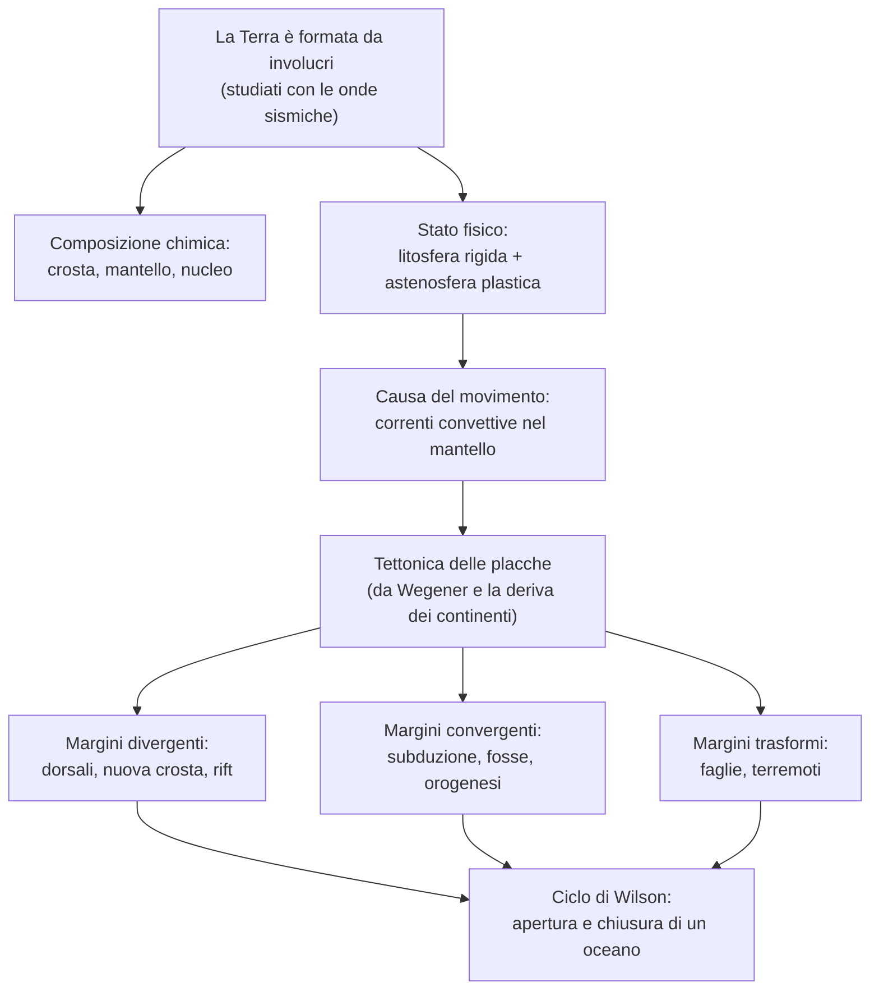

# Scienze della Terra — La tettonica delle placche

## La struttura interna della Terra

La struttura interna della Terra non è osservabile in modo diretto e viene ricostruita attraverso lo studio delle onde sismiche.

### Le onde sismiche

Le onde sismiche sono onde elastiche prodotte dai terremoti, che si propagano in tutte le direzioni all'interno della Terra. Nel passaggio da un materiale a un altro cambiano velocità e direzione (si riflettono e si rifrangono), e da questi cambiamenti si deduce che la Terra è formata da involucri concentrici. Si distinguono due tipi di onde:

- onde P: più veloci, attraversano sia i solidi sia i liquidi;
- onde S: attraversano solo i solidi.

Poiché le onde S si arrestano a una certa profondità, si deduce che a quella profondità il materiale è allo stato liquido.

### Gli involucri e le discontinuità

Le superfici lungo le quali la velocità delle onde cambia bruscamente separano gli involucri della Terra e sono dette discontinuità. In base alla composizione chimica la Terra è formata da tre involucri:

- la crosta: la parte più esterna e sottile (oceanica o continentale);
- il mantello: lo strato intermedio, costituito da silicati di ferro e magnesio;
- il nucleo: la parte centrale, di ferro e nichel, distinta in nucleo esterno liquido e nucleo interno solido.

Le discontinuità che li separano sono la discontinuità di Mohorovičić (o Moho) tra crosta e mantello, la discontinuità di Gutenberg tra mantello e nucleo e la discontinuità di Lehmann tra nucleo esterno e interno.

### Litosfera e astenosfera

In base allo stato fisico, criterio più rilevante per la tettonica, si distinguono due strati superficiali: la litosfera, lo strato esterno rigido (la crosta più la parte superiore del mantello), e l'astenosfera, lo strato plastico e parzialmente fuso sottostante, sul quale la litosfera può scorrere. Questo scorrimento è la condizione che rende possibile il movimento delle placche.

### L'isostasia

L'isostasia è la condizione di equilibrio per cui la litosfera galleggia sull'astenosfera secondo il principio di Archimede. L'aggiunta di un peso sulla crosta, come una calotta glaciale, ne provoca l'abbassamento; la rimozione di un peso, come l'erosione di una catena montuosa, ne provoca il lento sollevamento, fino al ristabilirsi dell'equilibrio.

## Il calore interno e il campo magnetico della Terra

Oltre alla struttura a involucri, la Terra è caratterizzata da un calore interno e da un campo magnetico.

### Il calore interno e le correnti convettive

La temperatura aumenta con la profondità, e questo aumento è detto gradiente geotermico (circa 25-30 °C per chilometro nei primi tratti). Il calore deriva soprattutto dal decadimento radioattivo degli elementi e dal calore originario del pianeta, e si propaga verso la superficie. Nel mantello, che ha comportamento plastico, questa risalita di calore genera le correnti convettive: il materiale caldo e meno denso sale, quello più freddo e denso scende. Queste correnti sono la causa del movimento delle placche.

### Il campo magnetico e le inversioni di polarità

La Terra possiede un campo magnetico (campo geomagnetico), con due poli magnetici prossimi ma non coincidenti con i poli geografici; l'angolo tra le due direzioni è detto declinazione magnetica. Il campo è generato dai movimenti del ferro liquido nel nucleo esterno, un meccanismo detto geodinamo. Nel corso delle ere geologiche il campo si è invertito più volte, scambiando il polo nord con il polo sud: queste inversioni di polarità sono registrate nelle rocce e costituiscono una delle prove della tettonica delle placche.

## La deriva dei continenti e la tettonica delle placche

### L'ipotesi di Wegener

La deriva dei continenti è l'ipotesi formulata nel 1912 dal meteorologo Alfred Wegener, secondo cui in passato i continenti erano riuniti in un unico supercontinente, la Pangea, circondato da un unico oceano, la Panthalassa; in seguito la Pangea si sarebbe frammentata e i continenti si sarebbero allontanati fino alle posizioni attuali. Wegener portò diverse prove:

- l'incastro delle coste dei continenti, in particolare Africa e Sudamerica;
- la presenza degli stessi fossili e delle stesse formazioni rocciose su continenti oggi separati;
- le tracce di antiche glaciazioni in regioni attualmente calde.

L'ipotesi fu però accolta con scetticismo, perché Wegener non riusciva a spiegare quale forza potesse spostare i continenti.

### La teoria della tettonica delle placche

La tettonica delle placche, formulata alcuni decenni dopo, è la teoria secondo cui la litosfera non è continua ma divisa in placche rigide che si muovono lentamente sull'astenosfera. Le zone in cui le placche si incontrano sono dette margini e sono di tre tipi:

- divergenti: le placche si allontanano;
- convergenti: le placche si avvicinano e si scontrano;
- trasformi: le placche scorrono una accanto all'altra.

Lungo i margini si concentrano i terremoti, i vulcani e le catene montuose, a conferma che è in queste zone che la litosfera si muove.

## I margini divergenti: la separazione delle placche

### L'espansione dei fondi oceanici

Ai margini divergenti due placche si allontanano, attraverso il processo dell'espansione dei fondi oceanici, spiegato da Harry Hess. Lungo le dorsali oceaniche, catene montuose sottomarine, risale magma dal mantello che, solidificando, forma nuova crosta oceanica; questa viene progressivamente spostata ai due lati della dorsale. Di conseguenza la crosta oceanica è tanto più antica quanto maggiore è la distanza dalla dorsale.

### Le prove: anomalie magnetiche ed età dei sedimenti

Due osservazioni confermano l'espansione dei fondi oceanici:

- le anomalie magnetiche: la crosta che si forma lungo la dorsale registra il campo magnetico del momento e, poiché il campo si inverte periodicamente, ai due lati della dorsale si dispongono bande di polarità alternata, simmetriche rispetto alla dorsale;
- l'età dei sedimenti del fondo oceanico, che aumenta con la distanza dalla dorsale.

### I rift continentali

Quando un margine divergente si forma all'interno di un continente, lo frattura aprendo una fossa tettonica detta rift, come la Rift Valley dell'Africa orientale. Se il processo prosegue, il rift può allargarsi fino a essere invaso dal mare e dare origine, nel tempo, a un nuovo oceano.

## I margini convergenti: la subduzione e l'orogenesi

### La subduzione e i tre tipi di convergenza

Ai margini convergenti due placche si scontrano. Nella maggior parte dei casi una delle due scende sotto l'altra e sprofonda nel mantello, in un processo detto subduzione, lungo il quale si formano le fosse oceaniche e si concentrano i terremoti. La convergenza avviene in tre modi:

- oceano-continente: la placca oceanica, più densa, subduce sotto quella continentale; lungo il margine si formano vulcani e catene montuose, come le Ande;
- oceano-oceano: una placca oceanica subduce sotto un'altra placca oceanica e si formano archi di isole vulcaniche, come il Giappone;
- continente-continente: nessuna delle due placche sprofonda, essendo entrambe leggere; le placche si scontrano e si accavallano, sollevandosi in catene montuose.

### L'orogenesi

Il sollevamento delle catene montuose è detto orogenesi. Ne sono esempi l'Himalaya, prodotto dalla collisione tra la placca indiana e quella eurasiatica, e le Alpi, prodotte dalla collisione tra l'Africa e l'Europa. Durante l'orogenesi le rocce sono compresse, piegate e accavallate, formando pieghe e falde.

## I margini trasformi e il ciclo di Wilson

### I margini trasformi

Ai margini trasformi le due placche non si allontanano né si scontrano, ma scorrono una accanto all'altra lungo una frattura detta faglia trasforme. In questo caso non si crea né si distrugge litosfera, ma lo scorrimento produce terremoti; spesso questi margini collegano due tratti di dorsale oceanica.

### Il ciclo di Wilson

La litosfera si ricicla di continuo, e questo processo è descritto dal ciclo di Wilson:

- un continente si frattura in un rift, da cui si apre un oceano con la propria dorsale;
- col tempo l'oceano si chiude, perché ai suoi bordi inizia la subduzione;
- infine i continenti tornano a collidere e si solleva una catena montuosa, e il ciclo ricomincia.

## Schema riassuntivo

## Collegamenti

- **Geografia**: la distribuzione di terremoti, vulcani e catene montuose sulla Terra coincide con i margini delle placche.
- **Storia delle scienze**: l'ipotesi di Wegener fu accolta con scetticismo, e solo decenni dopo, con la scoperta dell'espansione dei fondi oceanici, divenne la teoria della tettonica delle placche.
- **Fisica**: lo studio dell'interno della Terra si basa sulla velocità delle onde sismiche e sul campo magnetico generato dal nucleo.
