# Gli ordini architettonici e il tempio greco

L'ordine architettonico è un insieme organico di elementi che si sviluppa lungo l'intero alzato dell'edificio, dall'appoggio a terra fino alle strutture di copertura. Esso comprende la base, la colonna (articolata in fusto e capitello) e la trabeazione che corre al di sopra delle colonne. Gli ordini architettonici costituiscono il fondamento del linguaggio dell'architettura classica e, più in generale, la grammatica con cui l'architettura antica è stata concepita, descritta e tramandata, costituiscono un vero e proprio sistema di regole che governa il rapporto tra le parti di un edificio, le proporzioni e la funzione costruttiva.

Gli ordini nascono e si definiscono in rapporto a un tipo edilizio ben preciso, il tempio, che ne costituisce il campo di applicazione per eccellenza.

## Il tempio greco

### Funzione e caratteri generali

Il tempio è l'edificio più importante del mondo greco, poiché assolve la funzione più alta, quella di onorare la divinità e di custodirne l'immagine. Questa centralità simbolica si traduce in alcune scelte architettoniche costanti. Il tempio sorge sempre sopraelevato rispetto al piano della città, su una gradinata di base che lo isola idealmente dal contesto; presenta una pianta prevalentemente rettangolare e una copertura a doppia falda inclinata. Un piccolo modello fittile rinvenuto presso l'Heraion di Argo, databile intorno al 725-700 a.C., mostra come, alle origini, le caratteristiche formali del tempio non fossero poi così distanti da quelle di una comune abitazione: tanto che gli studiosi non sanno con certezza se quel modello raffiguri un tempio o una casa. Ciò suggerisce che il tempio si distinguesse per funzione e per cura, più che per una forma radicalmente diversa da quella dell'edilizia domestica.

### Le parti del tempio

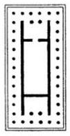 L'organismo del tempio si articola in un numero ridotto di ambienti, ciascuno con una funzione definita. Il nucleo è la cella, detta anche con il termine greco *naos*: è l'ambiente centrale e più importante, perché vi era collocata la statua di culto, il simulacro della divinità a cui l'edificio era dedicato. All'accesso alla cella si antepone il pronao, uno spazio introduttivo generalmente scandito da colonne, il cui nome indica appunto la posizione "davanti al *naos*". Sul lato opposto, a chiudere simmetricamente l'edificio, si trova l'opistodomo, un ambiente speculare al pronao privo di una funzione specifica, se non quella di equilibrare la composizione architettonica.

Attorno a questo nucleo si dispone, nei templi più sviluppati, un colonnato esterno. Lo spazio compreso tra le pareti della cella e la fila di colonne che circonda l'edificio prende il nome di peristasi. Le colonne possono poggiare su elementi terminali delle pareti chiamati ante, da cui derivano alcune delle denominazioni dei tipi templari.

### La classificazione dei templi

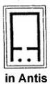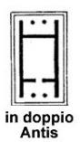 I templi si classificano in base alla presenza e alla disposizione delle colonne, e a ogni soluzione corrisponde un termine tecnico che è bene conoscere con precisione. Il tempio si dice in antis quando la cella non è circondata da colonne e presenta soltanto due colonne inquadrate tra le ante del pronao; è detto doppiamente in antis quando la stessa soluzione si ripete anche sul fronte posteriore. Si parla invece di tempio prostilo quando una fila di colonne occupa l'intero fronte anteriore, e di anfiprostilo quando il colonnato è presente anche sul retro.

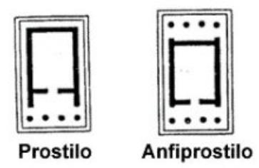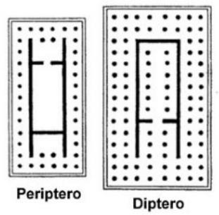 La tipologia più diffusa, al punto da costituire una sorta di modello generatore rispetto a tutte le altre, è il tempio periptero, nel quale la cella è interamente circondata da un'unica fila di colonne (il prefisso greco *peri-*, che significa "intorno"). A partire dal periptero, per progressivo arricchimento, si ottengono gli altri tipi: il diptero, caratterizzato da una doppia fila di colonne perimetrali, e le varianti pseudoperiptero e pseudodiptero, nelle quali le colonne libere sono sostituite da semicolonne addossate alla parete. A questi si aggiungono due casi particolari: il tempio monoptero, costituito da un giro di colonne privo di cella, e il tempio ipetro, un edificio di dimensioni tali da non poter essere coperto per intero e che resta quindi scoperto nella parte centrale.

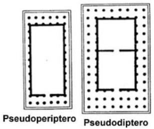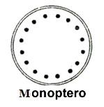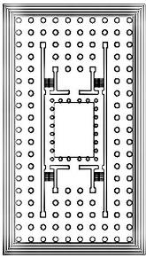

### L'intercolumnio

Un ulteriore criterio di classificazione riguarda la distanza tra le colonne, detta intercolumnio. La trattatistica distingue cinque casi, dal più fitto al più rado: picnostilo, sistilo, eustilo, diastilo e areostilo. Al di là della terminologia, ciò che conta è comprendere come la variazione della distanza tra i sostegni modifichi profondamente il ritmo del colonnato e la percezione complessiva dell'edificio.

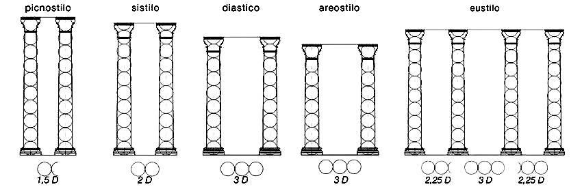

### La litizzazione — testimonianza di Vitruvio

La fonte principale per la conoscenza delle origini del tempio è il *De architectura* di Vitruvio, architetto attivo all'epoca di Augusto, tra la fine del I secolo a.C. e l'inizio del I secolo d.C. Si tratta dell'unico trattato di architettura dell'antichità giunto integralmente fino a noi, circostanza che gli conferisce un valore di fonte del tutto straordinario: è probabile che ne esistessero altri, ma di essi non resta traccia. Articolato in dieci libri, il trattato affronta anche i templi, spiegandone non soltanto la funzione ma anche l'evoluzione costruttiva.

Secondo Vitruvio, in origine i templi erano edificati in legno e argilla, materiali poveri e di scarsa durata. Da questa constatazione discendono due conseguenze importanti: la prima è che il tempio nasce come architettura in materiali deperibili, progressivamente sostituiti da materiali più nobili e resistenti; la seconda è che proprio la fragilità di quelle prime costruzioni spiega la perdita quasi totale delle testimonianze più arcaiche. Il passaggio dal legno alla pietra prende il nome di litizzazione, dal termine greco *litos*, "pietra".

### La capanna primitiva nella trattatistica

Il tema dell'origine lignea dell'architettura ha avuto una lunga fortuna nella teoria architettonica dei secoli successivi. L'idea di fondo è che la prima architettura sia stata una semplice capanna costruita con elementi naturali — tronchi conficcati nel terreno a fare da sostegni verticali e rami appoggiati sopra a comporre la copertura — e che dalle forme di questa struttura elementare derivino quelle del tempio: le colonne nascerebbero dai pali, la trabeazione dalle travi. La capanna primitiva viene così considerata l'archetipo, cioè il modello originario di ogni architettura, di cui il tempio in pietra rappresenta la traduzione in un materiale durevole. Questo immaginario conosce nel Settecento due espressioni celebri. Nell'*Essai sur l'architecture* di Marc-Antoine Laugier (1755) la capanna primitiva è posta al centro come modello ideale, esempio di un'architettura ridotta ai suoi elementi essenziali e priva di ogni superfluo; al medesimo tema è dedicato il *Treatise on Civil Architecture* di William Chambers (1759). Entrambi testimoniano quanto a lungo l'idea di un'origine naturale e lignea dell'architettura — già presente nel racconto di Vitruvio — abbia continuato ad alimentare la riflessione teorica.

### Il sistema trilitico

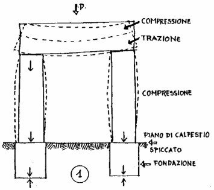 Dal punto di vista costruttivo, il tempio si fonda su un principio elementare ma decisivo, il sistema trilitico, il cui nome deriva dalle "tre pietre" che lo compongono: due elementi verticali che sorreggono un elemento orizzontale. Moltiplicando i sostegni verticali e disponendovi sopra la trabeazione si ottiene la struttura del tempio. È fondamentale comprendere che si tratta di un'architettura trabeata e non arcuata: la stabilità non è affidata ad archi o volte, ma all'accostamento tra elementi portanti verticali, le colonne, ed elementi portati orizzontali, la trabeazione e la copertura. Su questa struttura trilitica si innesta, come sua articolazione formale, il sistema degli ordini.

## I tre ordini greci

### Geografia e non cronologia

Nel mondo greco gli ordini architettonici sono tre: il dorico, lo ionico e il corinzio, (con il passaggio al mondo romano se ne aggiungono altri due: il tuscanico e il composito). I loro nomi non vanno intesi in senso cronologico, come se un ordine generasse il successivo in una sequenza evolutiva; essi rimandano piuttosto alla geografia, ai popoli e alle regioni in cui ciascuna forma prese autonomamente vita, per poi diffondersi altrove attraverso le migrazioni e gli scambi. Questo dato introduce un tema di fondo dell'intera storia dell'architettura, cioè lo stretto legame tra la forma architettonica e il luogo che la produce.

### L'ordine dorico

L'ordine dorico è il più antico e severo dei tre, e si distingue per la sua robustezza e per la sobrietà delle forme. L'elemento che ne consente il riconoscimento immediato si trova nel fregio, come si vedrà più avanti; conviene però procedere con ordine, partendo dal basso.

#### La colonna e il capitello

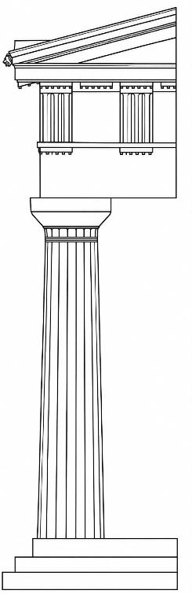 Nell'architettura greca la colonna dorica poggia direttamente sullo stilobate, priva di base: è una caratteristica esclusiva di questo ordine, che verrà meno soltanto in età romana. Il fusto è percorso da scanalature, solchi verticali ravvicinati la cui funzione è catturare e modulare la luce, accentuando la plasticità del sostegno. La colonna non è quasi mai monolitica, ma composta da più elementi cilindrici sovrapposti, i rocchi, uniti da perni; la realizzazione in un unico blocco, come nel caso del tempio di Apollo a Corinto, era considerata segno di particolare qualità e di notevole disponibilità economica, data la difficoltà di reperire e lavorare blocchi integri.

Al vertice del fusto, il collarino segna il passaggio al capitello. Il capitello dorico è formato da due parti essenziali: l'echino, la fascia dal profilo curvo che raccorda il fusto alla sommità, e l'abaco, l'elemento a forma di parallelepipedo su cui si imposta la trabeazione. La semplicità quasi astratta di queste forme è uno dei tratti distintivi dell'ordine.

#### La trabeazione: architrave, fregio e cornice

Al di sopra delle colonne corre la trabeazione, l'elemento orizzontale introdotto dal sistema trilitico. Nell'ordine dorico, come in generale, la trabeazione è sempre divisa in tre parti. In basso si trova l'architrave, che poggia direttamente sull'abaco dei capitelli; al centro il fregio; in alto la cornice.

È proprio il fregio a contenere l'elemento distintivo dell'ordine dorico, ossia l'alternanza di triglifi e metope. Il triglifo è un elemento a sezione rettangolare segnato da tre fasce verticali; la metopa è la lastra, spesso di forma quadrata, che occupa lo spazio tra due triglifi. Questa alternanza è esclusiva del dorico e ne costituisce il segno di riconoscimento.

#### L'origine lignea di triglifi e metope

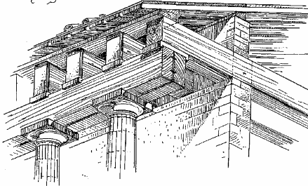 La presenza di triglifi e metope si spiega alla luce del processo di litizzazione. Nella struttura lignea originaria, le testate delle travi che reggevano il tetto sporgevano all'esterno ed erano esposte alla pioggia. Per proteggerle, Vitruvio racconta che venivano rivestite con elementi lapidei: da questa soluzione tecnica, destinata a impermeabilizzare le testate, deriva il triglifo, la cui scansione a tre fasce evoca ancora la memoria della struttura lignea. La metopa, invece, era in origine la lastra che tamponava lo spazio vuoto tra una trave e l'altra, che con il passaggio alla pietra (venuta meno di ogni funzione strutturale) si trasformò nello spazio privilegiato per la decorazione scolpita: vi si rappresentano bassorilievi e scene mitologiche che assumono una funzione narrativa, legata alla divinità e alla storia del tempio.

#### Il conflitto angolare

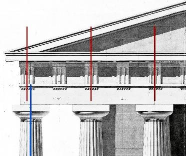 Dall'alternanza del fregio nasce uno dei problemi teorici più dibattuti dell'architettura dorica, il cosiddetto conflitto angolare. La regola prevedeva che il triglifo fosse collocato in asse con ciascuna colonna; all'angolo dell'edificio, tuttavia, questa esigenza entrava in contrasto con quella di far coincidere l'ultimo triglifo con lo spigolo stesso del tempio. Poiché il triglifo ha un ingombro minore di quello della colonna. Il problema, privo di una soluzione univoca, veniva affrontato caso per caso, ad esempio ampliando l'ultima metopa o contraendo l'interasse d'angolo per riportare il triglifo sullo spigolo.

#### La policromia

Un aspetto spesso trascurato riguarda il colore. Siamo abituati a immaginare i templi greci nel candore del marmo bianco, le ricerche archeologiche avviate nell'Ottocento hanno però dimostrato che i templi erano in realtà dipinti: il bianco che oggi li caratterizza è il risultato della perdita dei colori nel tempo. Nell'ordine dorico la soluzione cromatica più ricorrente era una bicromia con metope bianche e i triglifi azzurri. Rare testimonianze di questa policromia si sono conservate in alcuni monumenti, come la tomba di Filippo II di Macedonia a Verghina; fu soprattutto grazie agli studi di architetti e archeologi ottocenteschi, tra cui Jacques Ignace Hittorff, che si cominciò a ricostruire l'aspetto originario, colorato, dell'architettura antica.

#### Il frontone e l'ordine dorico a Roma

Al di sopra della trabeazione si apre il frontone, lo spazio di forma triangolare determinato dall'inclinazione delle falde del tetto. Come le metope, anche il frontone costituiva una superficie destinata alla decorazione scultorea, con funzione narrativa: ne è un esempio il frontone del tempio di Artemide a Corfù, del VII-VI secolo a.C., con la rappresentazione del mito di Perseo. Occorre infine ricordare che, se in Grecia la colonna dorica è priva di base, in età romana l'ordine dorico riceve una base, generalmente la base attica, costituita dalla sequenza toro, scozia, toro. L'impiego romano dell'ordine, del resto, non si limita ai templi: lo si ritrova anche in edifici per lo spettacolo, come nel primo registro del Teatro di Marcello.

### L'ordine ionico

L'ordine ionico, originario dell'Asia Minore e in particolare della Ionia, si distingue dal dorico per proporzioni più slanciate ed eleganti e per una maggiore ricchezza decorativa. L'elemento che ne consente il riconoscimento immediato è il capitello a volute, cioè i caratteristici ricci a spirale.

#### Caratteri generali e trabeazione

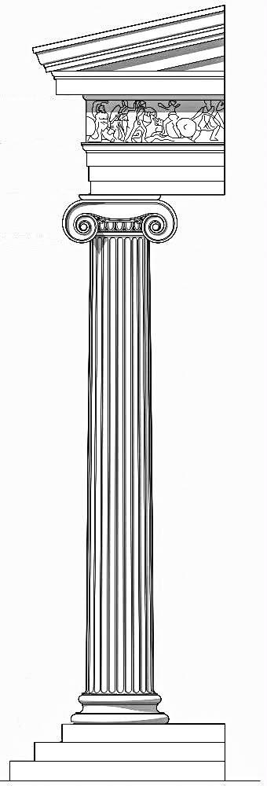 A differenza del dorico, l'ordine ionico possiede sempre una base. Il fusto, anch'esso scanalato, è più sottile e allungato. La differenza più evidente rispetto al dorico si coglie però nel fregio, che non presenta l'alternanza di triglifi e metope ma è continuo: una fascia unica e ininterrotta che corre lungo tutto l'edificio e può ospitare una decorazione scultorea senza soluzione di continuità. Restano invece analoghe l'articolazione generale e la successione delle parti, dalla base alla trabeazione fino al frontone.

#### Il capitello ionico e il problema dell'angolo

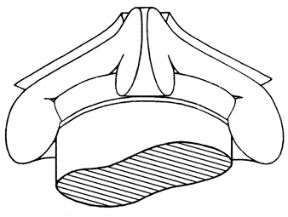 Il capitello ionico presenta una peculiarità che lo distingue radicalmente da quello dorico: non è concepito "a tutto tondo", uguale da ogni punto di vista, ma è orientato. Le volute si mostrano infatti sulla fronte, mentre i fianchi sono caratterizzati da una forma diversa, segnata dal balaustro e dal balteo, gli elementi che congiungono lateralmente le volute del fronte e del retro. Tra le volute corre inoltre una raffinata decorazione a ovoli e dardi.

Questa natura orientata del capitello genera, ancora una volta, un problema in corrispondenza degli angoli dell'edificio, dove sarebbe inevitabile una faccia priva di volute. La soluzione adottata dagli architetti antichi è il capitello angolare, nel quale le volute vengono mostrate su due lati adiacenti grazie a una rotazione a 45 gradi degli elementi d'angolo, con un progressivo sviluppo che porterà fino al capitello a quattro facce. Proprio la difficoltà di disegnare correttamente la voluta, garantendone la simmetria e la corretta spirale, farà sì che gli architetti del Cinquecento mettano a punto appositi sistemi geometrici di costruzione.

#### Le basi e l'associazione simbolica

L'ordine ionico si associa generalmente alla base attica, ma anche a un tipo particolare, la base vitruviana, detta pure efesina per la sua diffusione a Efeso, caratterizzata da un toro superiore che sembra schiacciare con il proprio peso le scozie sottostanti. L'interesse per questi dettagli attraverserà i secoli: un celebre disegno di Antonio da Sangallo il Giovane documenta, ad esempio, il rilievo accurato di una base ionica vitruviana. Sul piano simbolico, infine, le forme più snelle e ornate dell'ordine ionico ne favorirono l'associazione alle divinità femminili, in contrapposizione al carattere maschile attribuito al dorico. Una grande eccezione a questa consuetudine è il Partenone, dedicato ad Atena e tuttavia realizzato in ordine dorico.

### L'ordine corinzio

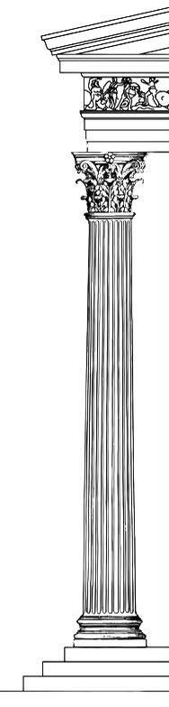 L'ordine corinzio è il più ricco e slanciato, e si riconosce dal capitello decorato con foglie d'acanto. Della sua origine Vitruvio tramanda una celebre leggenda, legata, come già per gli altri ordini, a un luogo preciso, la città di Corinto. Si racconta che la nutrice di una fanciulla corinzia, morta prematuramente, avesse deposto sulla sua tomba un canestro con gli oggetti a lei cari, poggiandolo per caso sopra una radice di acanto. Crescendo, le foglie della pianta avvolsero il canestro; lo scultore Callimaco, passando di lì, fu colpito dalla bellezza casuale di quella composizione e la riprodusse nei capitelli delle colonne. Al di là del valore aneddotico, la leggenda ribadisce il nesso tra forma, caso e luogo che percorre tutta la vicenda degli ordini. Dal punto di vista della diffusione, il capitello corinzio, documentato in esempi come la *tholos* di Epidauro, conoscerà una fortuna crescente, fino a diventare l'ordine prediletto dell'architettura romana.

### L'ordine tuscanico

L'ordine tuscanico può essere inteso come una semplificazione dell'ordine dorico. Ne mantiene sostanzialmente le proporzioni e l'impianto, ma rinuncia all'alternanza di triglifi e metope nel fregio: è proprio questa assenza a distinguerlo con sicurezza dal dorico, come mostrano con chiarezza i confronti grafici elaborati dai trattatisti, da Serlio in poi. Si tratta quindi dell'ordine più sobrio ed essenziale dell'intero repertorio.

### L'ordine composito

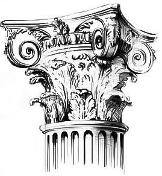 L'ordine composito, come indica il nome, nasce dalla fusione di due ordini: unisce le foglie d'acanto del corinzio alle volute dello ionico. Il risultato è un capitello particolarmente ricco e solenne, che per questa ragione trovò impiego privilegiato negli archi trionfali, come l'Arco di Tito e l'Arco di Settimio Severo a Roma. Non a caso l'ordine composito fu molto apprezzato dagli imperatori della dinastia flavia, Vespasiano, Tito e Domiziano, che lo adottarono in numerose opere.

### I correttivi ottici

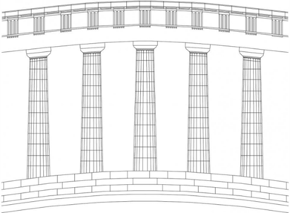 Per impedire che l'edificio apparisse deformato alla vista sono stati introdotti i correttivi ottici. L'occhio umano, nell'osservare una sequenza di elementi regolari e di grandi dimensioni, tende a percepirli in modo alterato, per cui un colonnato perfettamente rettilineo può apparire incurvato o cedevole. Per ovviare a questi inganni percettivi si ricorreva a una serie di correzioni. La più nota è l'entasi, il leggero rigonfiamento del fusto della colonna, il cui nome deriva dal greco *entasis*, "tensione"; a essa si affiancano la lieve curvatura convessa dello stilobate, l'impercettibile inclinazione delle colonne verso l'interno e l'ingrossamento delle colonne d'angolo.

## Varietas

Il sistema degli ordini, per quanto rigoroso, non esaurisce la ricchezza delle forme antiche. Esistono infatti numerosi capitelli che non rientrano in nessuna delle categorie codificate e che vengono ricondotti alla nozione di *varietas*, ossia di variazione. Si tratta spesso di capitelli figurati, dominati dalla presenza di figure umane, animali o di elementi fantastici, che testimoniano la libertà inventiva degli artefici antichi, al di là della norma.

La variazione, inoltre, non riguarda soltanto il capitello. Anche il fusto della colonna può essere sostituito da una figura umana che ne assume la funzione portante: si parla in questo caso di cariatidi, quando le figure sono femminili, e di telamoni, quando sono maschili. L'esempio più celebre è la loggia delle cariatidi dell'Eretteo, sull'Acropoli di Atene, dove le statue femminili sostituiscono a tutti gli effetti le colonne nel reggere la trabeazione.
