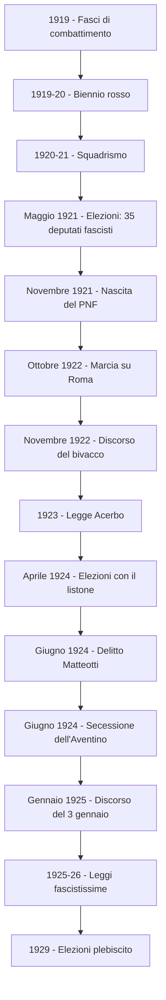

# Il Biennio Rosso e l'ascesa del fascismo

## L'Italia dopo la Grande Guerra e la questione fiumana

L'Italia uscì dalla Prima guerra mondiale tra i vincitori, ma la vittoria lasciò un sapore amaro. Il trattato di Versailles del 1919 non assegnò all'Italia tutti i territori promessi dal Patto di Londra del 1915: mancavano la Dalmazia e Fiume. Si diffuse così il mito della **"vittoria mutilata"**, espressione coniata da Gabriele D'Annunzio, che alimentò un forte risentimento nazionalista. Il 12 settembre 1919 D'Annunzio, alla testa di un gruppo di legionari, occupò la citta' di Fiume con un colpo di mano clamoroso. L'impresa durò quindici mesi: D'Annunzio proclamò la Reggenza italiana del Carnaro e scrisse una Carta costituzionale, la cosiddetta "Carta del Carnaro" (dal nome del golfo su cui la citta' si affaccia), redatta dal sindacalista rivoluzionario Alceste De Ambris, che mescolava elementi sindacalisti, anarchici e nazionalisti. L'impresa di Fiume fu un vero laboratorio politico che anticipò molti rituali del fascismo: il dialogo dal balcone con la folla, il saluto romano, le camicie nere, i canti e le marce. Di fronte al mutato sentimento dell'opinione pubblica, Giolitti decise di risolvere la questione per via diplomatica. Nel novembre 1920, con il **trattato di Rapallo**, l'Italia ottenne l'Istria e la citta' di Zara in Dalmazia, ma Fiume fu dichiarata citta' libera e la Dalmazia fu assegnata al Regno dei Serbi, Croati e Sloveni. L'esercito italiano fu inviato a sgomberare Fiume con la forza: nel cosiddetto "Natale di sangue" (dicembre 1920) D'Annunzio fu costretto ad abbandonare la citta'.

---

## Il biennio rosso (1919-1920)

Il **biennio 1919-1920** rappresentò per l'Europa il cosiddetto "biennio rosso": un periodo di grandi proteste sociali, fortemente attraversato da violenze e scontri con le forze dell'ordine. A provocare tale situazione fu la **drammatica crisi economica** che colse l'intera Europa alla fine della guerra. L'inflazione erodeva i salari, le prospettive dei reduci erano drammatiche: contadini e operai che avevano combattuto in trincea tornavano a casa senza lavoro, senza terra, senza prospettive. La riconversione dell'industria bellica a quella civile procedeva con enorme difficolta', lasciando centinaia di migliaia di persone disoccupate. I braccianti agricoli e gli operai delle fabbriche potevano contare sul supporto, rispettivamente, delle **leghe contadine** e dei **sindacati**.

Fin dai primi mesi del 1919 i mezzadri e i braccianti della bassa Pianura Padana, sostenuti dalle leghe contadine socialiste, cominciarono a occupare le terre incolte dei grandi proprietari. Le **leghe "bianche"** (cattoliche) organizzarono movimenti analoghi nel Veneto e in Lombardia. Nelle campagne del Mezzogiorno e del Lazio i contadini occuparono i terreni incolti, al fine di realizzare quella distribuzione della terra che era stata oggetto delle promesse — poi disattese — dei politici durante il conflitto. Contemporaneamente, in diverse citta' si diffusero le **proteste contro il carovita**: dopo la fine della guerra i prezzi avevano subito un rialzo pauroso e il potere d'acquisto dei salari era crollato. Gli operai non avanzavano soltanto richieste di carattere economico — la giornata lavorativa di otto ore, gli aumenti salariali — ma rivendicavano anche il diritto a un controllo sulla produzione e sull'organizzazione del lavoro.

La mobilitazione raggiunse il suo apice nel **settembre 1920**, quando i rappresentanti della **FIOM** (Federazione Italiana Operai Metallurgici), in risposta alla serrata padronale — cioe' la chiusura delle fabbriche da parte degli industriali — organizzarono l'**occupazione di circa 600 fabbriche del Nord Italia**, trasformandole in comuni autogestiti. Circa 600.000 lavoratori presero il controllo degli stabilimenti. Fra gli operai attivisti legati al periodico "L'Ordine Nuovo", guidato dal filosofo **Antonio Gramsci**, si propose la costituzione di **consigli di fabbrica**, organismi ispirati ai soviet della Rivoluzione russa: organi elettivi che rappresentavano tutti i lavoratori della fabbrica e avevano il compito di controllare la produzione e l'organizzazione del lavoro.

Per evitare una soluzione violenta, il governo Giolitti scelse una strategia di mediazione: riconobbe le richieste degli operai, trattando direttamente con la CGL (Confederazione Generale del Lavoro), e promise una legge sul controllo operaio della produzione (che pero' non fu mai approvata). Gli operai lasciarono le fabbriche, ma il risultato fu una sconfitta per il movimento operaio: le conquiste concrete furono minime. La mobilitazione fascista si inserì in questa **duplice direzione**: era da un lato la manifestazione della controrivoluzione — cioe' la reazione violenta contro i movimenti operai e contadini — dall'altro la manifestazione del nazionalismo frustrato dalla "vittoria mutilata". Il fascismo si nutriva di entrambi questi sentimenti: **odio per il socialismo e il comunismo** da una parte, **nazionalismo ferito** dall'altra.

Nel frattempo le divisioni interne al mondo socialista ne indebolivano la forza. Il **Partito Socialista**, che sapeva esprimere una grande capacita' di mobilitazione ma non sapeva utilizzare la forza politica, era dilaniato tra riformisti e massimalisti. La frattura esplose nel **gennaio 1921 al Congresso di Livorno**, quando l'ala piu' radicale, guidata da **Antonio Gramsci** e da **Amadeo Bordiga**, si stacco' per fondare il **Partito Comunista d'Italia** (PCd'I), una formazione affiliata all'Internazionale di Mosca. La scissione indeboli' ulteriormente il fronte operaio proprio nel momento in cui avrebbe avuto piu' bisogno di unita'.

---

## L'avanzata del fascismo e lo squadrismo

Dall'autunno 1920, con la fine dell'occupazione delle fabbriche e delle proteste agrarie, l'Italia si trovò in una situazione paradossale: il partito democratico e la sinistra avevano fallito il tentativo di incanalare le proteste verso una vera riforma, ma la borghesia industriale e agraria era terrorizzata dalla possibilita' di perdere i propri privilegi. Il **Partito Socialista** attraversava una crisi interna profondissima: la corrente massimalista predicava la rivoluzione senza prepararla concretamente, mentre la corrente riformista di **Filippo Turati** era convinta che la via parlamentare fosse l'unica praticabile. L'uso della forza, da entrambe le parti, faceva temere una guerra civile.

Fu in questo contesto che emerse con violenza il fenomeno dello **squadrismo fascista**. Le **squadre d'azione**, composte da ex arditi, giovani violenti e figli di proprietari terrieri, vestivano le **camicie nere** (cosi' chiamate per la divisa che indossavano) e si specializzarono in **spedizioni punitive**: rapidi rastrellamenti con cui si riferivano alle aggressioni nei confronti delle sedi dei partiti socialisti, delle cooperative, delle case del popolo, dei sindacati e delle amministrazioni di sinistra. Le spedizioni seguivano un copione collaudato: i fascisti arrivavano sui camion, piombavano sulle sedi nemiche, le devastavano, picchiavano i militanti e li costringevano a bere olio di ricino. La cosa piu' grave fu la **connivenza delle autorita'**: carabinieri, polizia e magistratura tollerarono o addirittura favorirono queste azioni. Gli industriali e i grandi proprietari terrieri, terrorizzati dal biennio rosso, **finanziarono le squadre**. Anche settori dell'esercito simpatizzavano apertamente per il fascismo.

---

## Dalle elezioni del 1921 alla marcia su Roma

Grazie alla sua **natura ambivalente** — movimento antiborghese/rivoluzionario e al tempo stesso anticomunista/controrivoluzionario — il fascismo ottenne il **consenso della classe politica liberale**, che si illuse di poterlo usare per soffocare i disordini e poi inquadrarlo nel sistema parlamentare. **Giolitti** decise di sciogliere il Parlamento e fisso' le elezioni per il maggio 1921. Per dare forza alla maggioranza liberale, **favori' l'ingresso di candidati fascisti in liste di coalizione dette "blocchi nazionali"**, ma il risultato non fu quello sperato: **solo il PPI aumento' i consensi**, il PSI ebbe un lieve calo (per la scissione del PCI), e il blocco nazionale ottenne solo la maggioranza relativa. Tuttavia, **35 deputati fascisti entrarono in Parlamento**, guadagnando legittimita' istituzionale.

Giolitti, compresa l'impossibilita' di dar vita a un governo stabile, **si dimise**, lasciando la carica all'ex socialista **Ivanoe Bonomi**. Mussolini, vista la debolezza del governo, l'**8 novembre 1921 fondo' il Partito Nazionale Fascista (PNF)**, presentandolo come l'unico soggetto politico in grado di risolvere la crisi e di arginare la violenza squadrista. Il PNF, radicato sul territorio grazie ai Fasci di combattimento, per consolidare i propri consensi **abbandono' gli ideali di matrice repubblicana, socialista e anticlericale**, virando su posizioni monarchiche e clericali. Il programma politico fu completamente riscritto per raccogliere le simpatie della monarchia e della Chiesa.

Facendo leva sul nazionalismo e l'antisocialismo, **Mussolini incontrò il consenso di reduci, agrari, media borghesia e alta borghesia industriale**. Anche le forze conservatrici europee inizialmente guardarono con favore la sua ascesa. Quando Mussolini andò al potere, **la classe politica liberale era convinta che sarebbe durato poco**. Lo stesso Giolitti, inserendo i fascisti nei Blocchi Nazionali, si era illuso di poterne sfruttare la forza contro la classe operaia, per poi farli rientrare nella legalita'. **Il fascismo invece si stava costituendo come una struttura alternativa al modello liberale.**

Bonomi, non riuscendo a sedare gli scontri tra fascisti e socialisti, si dimise e gli successe il giolittiano **Luigi Facta**. Quando, per reazione alle violenze fasciste, l'**Alleanza del lavoro** (che riuniva le principali organizzazioni di lavoratori) **indisse uno sciopero generale legalitario**, i fascisti riuscirono a **boicottarlo**, conquistandosi la fiducia della classe borghese e degli industriali. Contando sulla connivenza delle autorita', **scatenarono una violenta offensiva contro il movimento operaio**, che usci' definitivamente sconfitto. Forte del controllo delle piazze, **Mussolini** e i principali membri del PNF (tra i quali **Italo Balbo**) **organizzarono la conquista del potere**: tra il 27 e il 28 ottobre 1922 circa **26.000 fascisti in armi marciarono su Roma** per impadronirsi dei ministeri.

**Facta chiese a Vittorio Emanuele III di dichiarare lo stato d'assedio**, ma **il re rifiutò** e, dopo le dimissioni di Facta, **incaricò Mussolini di formare un nuovo esecutivo con i liberali**. Di fatto, le squadre fasciste giunsero nella capitale **24 ore dopo** che Mussolini aveva gia' ricevuto l'incarico di formare il nuovo governo. Arrivo' a Roma da Milano il 30 ottobre e la sera sali' al Quirinale per sottoporre al re la lista dei suoi ministri.

---

## Il discorso del bivacco e le due anime del PNF

Mussolini scelse il ***doppio binario***: **mantenere il consenso della base cercando al tempo stesso un compromesso con le istituzioni**. Appena giunto al potere, presento' al re una lista di ministri che comprendeva anche **esponenti liberali** e popolari, perche' aveva ancora bisogno di essere sostenuto da un ampio consenso. Nel suo primo discorso come presidente del Consiglio (**il *discorso del bivacco***, 16 novembre 1922) minaccio' il Parlamento, offrendogli pero' un'apertura:

!!! quote "Il discorso del bivacco — 16 novembre 1922"
    *"Ora e' accaduto [...] che il popolo italiano — nella sua parte migliore — ha scavalcato un Ministero e si e' dato un Governo al di fuori, al di sopra e contro ogni designazione del Parlamento. [...] Io affermo che la rivoluzione ha i suoi diritti. [...] Mi sono rifiutato di stravincere, e potevo stravincere. Mi sono imposto dei limiti. [...] Io potevo castigare tutti coloro che hanno diffamato e tentato di infangare il Fascismo. Potevo fare di questa Aula sorda e grigia un bivacco di manipoli... potevo sprangare il Parlamento e costituire un Governo esclusivamente di fascisti. Potevo: ma non ho, almeno in questo primo tempo, voluto. [...] Nessuno degli avversari di ieri, di oggi, di domani si illuda sulla brevita' del nostro passaggio al potere. Illusione puerile e stolta come quella di ieri."*

Il partito era pero' attraversato da tensioni interne. Mussolini aveva problemi a gestire l'**ala estremista del PNF**, capeggiata dal **Ras di Cremona Roberto Farinacci**. Questa, fortemente antipolitica e violenta, spingeva per una **rivoluzione armata degli squadristi** e rifiutava qualunque compromesso con il governo liberale. I capi locali dello squadrismo venivano chiamati "Ras" (dal titolo dei capi etiopici): ogni Ras controllava un territorio con metodi violenti e autoritari, e Farinacci era considerato il piu' intransigente e pericoloso. Farinacci creava forti preoccupazioni, in quanto i suoi metodi provocavano grande indignazione pubblica; ma Mussolini lo tollerava perche' aveva bisogno della violenza squadrista per consolidare il potere. Dall'altra parte, Mussolini temeva di alienarsi le simpatie della **borghesia** (che aveva visto nel fascismo una forza capace di mettere fine ai disordini) e appoggio' l'ala moderata, guidata da **Giovanni Bottai**.

---

## La fascistizzazione dello Stato e la legge Acerbo

Un elemento che caratterizzo' fin dal suo esordio il governo mussoliniano fu la progressiva eliminazione delle istituzioni democratiche e la creazione di organi paralleli di partito. Gia' nel dicembre 1922 fu istituito il **Gran Consiglio del Fascismo**, un organo che riuniva i ministri fascisti, il direttore della pubblica sicurezza e i gerarchi del partito: sotto il controllo di Mussolini, dava al Consiglio dei Ministri le linee guida sul governo del Paese, sostituendosi di fatto al Parlamento. Tra il dicembre 1922 e il gennaio 1923 fu creata la **Milizia Volontaria per la Sicurezza Nazionale (MVSN)**, nella quale le squadre fasciste vennero "inquadrate" in una forza al servizio del regime, per limitare il potere dei Ras locali. Nel 1923 fu istituita una **polizia segreta di partito**, la cosiddetta **"Ceka fascista"**, affidata al fascista **Amerigo Dumini**, con il compito di sorvegliare e intimidire con la violenza gli avversari.

Mussolini reintrodusse poi il **sistema maggioritario** con la **Legge Acerbo** (dal nome del parlamentare fascista Giacomo Acerbo che la elaboro'), la quale prevedeva un **premio di maggioranza** tale che chi avesse conquistato almeno il **25% dei voti avrebbe avuto i 2/3 dei seggi in Parlamento**. All'inizio del 1924, quando furono sciolte le Camere, il PNF per assicurarsi la vittoria promosse il **"listone"**, un blocco che comprendeva fascisti, liberali e cattolici moderati. **Giolitti**, fautore dei blocchi nazionali del 1921, preferi' presentare una propria lista indipendente, mentre le **sinistre arrivarono al voto fortemente divise**. Le elezioni del 1924 si svolsero in un **clima di violenza**: la campagna elettorale fu caratterizzata da una propaganda martellante, intimidazioni, corruzione e brogli. Diversi esponenti delle opposizioni furono costretti a subire minacce e pestaggi; le forze dell'ordine spesso erano complici, facendo in modo che i fascisti potessero entrare nelle cabine elettorali e obbligando i cittadini a votare in un certo modo. La nuova maggioranza fascista alla Camera ottenne **356 deputati su 535**, un risultato conquistato anche grazie alla violenza.

---

## Il delitto Matteotti e la secessione dell'Aventino

**Il 30 maggio 1924**, all'apertura dei lavori della Camera dei deputati appena insediata, **Giacomo Matteotti, segretario del PSU** (il Partito Socialista Unitario, nato dall'ala riformista espulsa dal PSI) prese la parola e **denuncio' apertamente i brogli elettorali e le violenze messe in atto dai fascisti, chiedendo l'invalidazione delle elezioni**. Inoltre Matteotti aveva raccolto informazioni su **casi di corruzione** che coinvolgevano vari membri dell'esecutivo, inclusi i vertici del PNF e il presidente del Consiglio. Avrebbe dovuto notificarle alla Camera l'11 giugno, **ma il 10 giugno fu sequestrato e assassinato dai fascisti**, che lo abbandonarono a pochi km da Roma, alla macchia della Quartarella, dove fu ritrovato sei giorni dopo.

L'uccisione di Matteotti suscito' **proteste e indignazione** e il fascismo affronto' una crisi gravissima. **Le forze d'opposizione** — liberali, socialisti e comunisti — il 27 giugno **abbandonarono il Parlamento** (Filippo Turati lo defini' **"l'Aventino delle coscienze"**, in riferimento al colle sul quale i plebei si ritiravano durante le lotte con i patrizi nell'antica Roma). Ma il gesto di protesta contro le violenze fasciste **falli'** perche' **Vittorio Emanuele III non prese posizione e rifiuto' di chiedere le dimissioni di Mussolini**. Fu cosi' che, nonostante l'enorme indignazione popolare, alla fine del 1924 l'ondata antifascista si esauri': Mussolini riusci' a mantenere la sua posizione, sia per abilita' sua, sia per la mancanza di una reale alternativa.

Il **3 gennaio 1925** Mussolini pronuncio' alla Camera il discorso che segno' l'inizio ufficiale della dittatura: *"Dichiaro qui, al cospetto di questa assemblea ed al cospetto di tutto il popolo italiano, che io assumo — io solo — la responsabilita' politica, morale, storica di tutto quanto e' avvenuto."* Con queste parole Mussolini sfido' apertamente il Parlamento e il Paese, annunciando che non avrebbe fatto alcun passo indietro.

---

## L'eliminazione degli oppositori politici

Nei giorni seguenti la repressione fu immediata e brutale: vennero **imbavagliati i giornali di opposizione**, chiusi **35 circoli politici**, sciolte **25 organizzazioni** definite sovversive, serrati **150 esercizi pubblici**, **arrestati 111 oppositori** ed eseguite **655 perquisizioni domiciliari**. La violenza contro gli oppositori si scateno' in modo selvaggio: **Amendola**, capo dell'opposizione dopo la morte di Matteotti, fu nuovamente aggredito il 20 luglio 1925 da una squadra guidata da Carlo Scorza (futuro segretario del partito fascista), e mori' nell'aprile successivo in Francia. La **famiglia Rosselli** subi' tre "azioni punitive". **Filippo Turati** e **Gaetano Salvemini** furono forzati a seguire in esilio **Sturzo** e **Nitti**.

Un caso emblematico fu quello di **Don Giovanni Minzoni**, parroco di Argenta nel ferrarese, che si schiero' apertamente contro il fascismo. Sottraeva giovani all'Opera Balilla con lo scoutismo e denuncio' la responsabilita' delle squadre fasciste nell'uccisione del sindacalista socialista Gaiba (1921). Di fronte all'attacco sistematico contro il PPI, il PSI e i circoli cattolici, scelse di battersi *"contro la vita stupida e servile che ci si vuole imporre"*, conscio di mettere a repentaglio la vita, e che era necessario *"prendere posizione"* per l'affermazione dei principi di liberta'. I fascisti gli offrirono di fare il cappellano della Milizia volontaria: rifiuto'. Era in gioco l'organizzazione dei giovani a cui il fascismo ambiva: *"abbiamo bisogno di dare a questi giovani il senso della virilita', della potenza, della conquista"* (Mussolini). **Il 23 agosto 1923**, mentre rientrava in canonica, fu colpito alle spalle e **ucciso a bastonate** in un agguato teso dagli squadristi del futuro Console della milizia **Italo Balbo**. Il cordoglio popolare per la sua morte fu profondo e diffuso.

---

## Le leggi fascistissime e la fine dello Stato liberale (1925-26)

Col pretesto di un attentato a Mussolini (avvenuto in circostanze poco chiare), tra il **1925 e il 1926 fu emanata una serie di leggi**, ideate dal ministro della Giustizia **Alfredo Rocco**, le **"Leggi eccezionali del fascismo"** o **"Leggi fascistissime"**, che limitarono la liberta' civile e politica degli italiani e cancellarono cio' che rimaneva dello Stato liberale. **Il potere fu accentrato nelle mani del Capo del governo** (cioe' il Presidente del Consiglio), che divenne **responsabile del proprio operato solo davanti al Re e non davanti al Parlamento** (che necessitava del suo permesso per discutere qualsiasi argomento). **Mussolini sciolse tutti i partiti** e assunse il titolo di **"Duce"** a sottolineare il legame con l'antica Roma. Mussolini aveva **facolta' di emanare le leggi**: cessava cosi' la separazione tra il potere esecutivo del governo e il potere legislativo del Parlamento. Vennero **cancellate le autonomie locali**: nei comuni un **podesta'** fascista sostitui' i sindaci, mentre le province erano controllate da **prefetti scelti dal governo**, che rispondevano del loro operato direttamente a Mussolini. Vennero soppressi i **giornali antifascisti**, si istituirono la **pena del confino** e la **pena di morte** per gli oppositori politici. Fu istituito il **Tribunale speciale per la difesa dello Stato** e l'**OVRA** (forse acronimo di Opera per la Vigilanza e la Repressione dell'Antifascismo), la polizia segreta del regime. Il sistema parlamentare fu sostituito da un **regime autoritario incentrato sull'autorita' del capo e sul terrore poliziesco**. Durante la dittatura fascista il Tribunale speciale commino' **27.000 anni di carcere**.

La repressione fu affidata agli uffici speciali di polizia (l'OVRA) e al Tribunale Speciale per la Difesa dello Stato, col compito di reprimere i reati politici. **I 120 deputati d'opposizione che avevano partecipato alla secessione dell'Aventino furono dichiarati decaduti** con l'accusa di aver disertato i lavori parlamentari (anche i comunisti che erano rientrati). Tali decisioni passarono alla Camera e al Senato senza che fosse consentita la minima discussione. **Nel 1929 si svolsero nuove elezioni** che, grazie a una nuova legge elettorale, permettevano solo di approvare o meno **una lista unica stilata dal Gran Consiglio**. Il risultato fu praticamente un **plebiscito**.

---

## Antonio Gramsci e "Odio gli indifferenti"

Nel 1917 Antonio Gramsci pubblico' la rivista "La citta' futura" che conteneva, fra gli altri, lo scritto **"Contro gli indifferenti"**:

!!! quote "Odio gli indifferenti — Antonio Gramsci, 1917"
    *"Odio gli indifferenti. Credo [...] che vivere vuol dire essere partigiani. [...] Chi vive veramente non puo' non essere cittadino, e parteggiare. Indifferenza e' abulia, e' parassitismo, e' vigliaccheria, non e' vita. Percio' odio gli indifferenti.*

    *L'indifferenza e' il peso morto della storia. [...] L'indifferenza opera potentemente nella storia. Opera passivamente, ma opera. [...] Cio' che succede, il male che si abbatte su tutti [...] non e' tanto dovuto all'iniziativa dei pochi che operano, quanto all'indifferenza, all'assenteismo dei molti. [...] La massa degli uomini abdica alla sua volonta' [...] lascia promulgare le leggi che poi solo la rivolta fara' abrogare, lascia salire al potere gli uomini che poi solo un ammutinamento potra' rovesciare.*

    *Ma la tela tessuta nell'ombra arriva a compimento: e allora sembra sia la fatalita' a travolgere tutto e tutti, sembra che la storia non sia che un enorme fenomeno naturale, un'eruzione, un terremoto, del quale rimangono vittima tutti, chi ha voluto e chi non ha voluto, chi sapeva e chi non sapeva, chi era stato attivo e chi indifferente. [...]"*

    *"Vivo, sono partigiano. Percio' odio chi non parteggia, odio gli Indifferenti."*

Gramsci (1891-1937) fu condannato a 20 anni di carcere dal Tribunale speciale fascista. Il pubblico ministero disse: *"Dobbiamo impedire a questo cervello di funzionare per vent'anni."* Mori' nel 1937, pochi giorni dopo essere stato scarcerato per le gravi condizioni di salute.

---

## Schema riassuntivo

---

## Checklist

- [x] La questione fiumana e il trattato di Rapallo
- [x] Il biennio rosso: crisi, lotte contadine, carovita, occupazione fabbriche, consigli di fabbrica
- [x] Lo squadrismo e la connivenza delle autorita'
- [x] Le elezioni del 1921, la nascita del PNF, l'illusione dei liberali
- [x] La marcia su Roma e la resa delle istituzioni
- [x] Il discorso del bivacco, il doppio binario, le due anime del PNF
- [x] La fascistizzazione dello Stato e la legge Acerbo
- [x] Il delitto Matteotti e la secessione dell'Aventino
- [x] L'eliminazione degli oppositori: Amendola, Don Minzoni, Rosselli
- [x] Le leggi fascistissime e le elezioni plebiscito del 1929
- [x] Gramsci e "Odio gli indifferenti"

## Collegamenti

- **Filosofia**: Hannah Arendt e il concetto di totalitarismo; Gramsci e il pensiero marxista in Italia; il rapporto tra masse e potere
- **Italiano**: Pirandello e il rapporto ambiguo con il fascismo; Gramsci e *Odio gli indifferenti*; la letteratura dell'impegno civile
- **Inglese**: George Orwell, *Animal Farm* come allegoria della rivoluzione tradita; il concetto di propaganda e manipolazione del linguaggio in *1984*
- **Arte**: il Futurismo e il suo legame con il fascismo (Marinetti era tra i fondatori dei Fasci); il Razionalismo in architettura come espressione del regime
- **Ed. civica**: la Costituzione italiana come risposta diretta al fascismo; l'articolo 3 sull'uguaglianza; l'articolo 21 sulla liberta' di stampa; il divieto di ricostituzione del partito fascista (XII disposizione transitoria)
