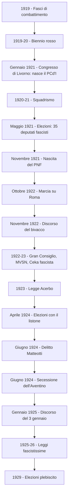

# Il Biennio Rosso e l'ascesa del fascismo

## La questione fiumana e il trattato di Rapallo

L'Italia uscì dalla Prima guerra mondiale tra i vincitori, ma la vittoria lasciò un sapore amaro. Il Paese aveva pagato un prezzo altissimo: 680.000 morti, oltre un milione di feriti e mutilati, un'economia stremata e un debito pubblico quintuplicato. Eppure, sul piano internazionale, il trattato di Versailles del 1919 non assegnò all'Italia tutti i territori promessi dal Patto di Londra del 1915: mancavano la Dalmazia e Fiume. Si diffuse così il mito della "vittoria mutilata", espressione coniata da Gabriele D'Annunzio, che alimentò un forte risentimento nazionalista. La questione di Fiume divenne il simbolo di questa frustrazione: il 12 settembre 1919 D'Annunzio, alla testa di un gruppo di legionari, occupò la città con un colpo di mano clamoroso. L'impresa durò quindici mesi: D'Annunzio proclamò la Reggenza italiana del Carnaro e scrisse una Carta costituzionale, la cosiddetta "Carta del Carnaro" (dal nome del golfo su cui la città si affaccia), redatta dal sindacalista rivoluzionario Alceste De Ambris, che mescolava elementi sindacalisti, anarchici e nazionalisti. L'impresa di Fiume fu un vero laboratorio politico che anticipò molti rituali del fascismo: il dialogo dal balcone con la folla, il saluto romano, le camicie nere, i canti e le marce.

Di fronte al mutato sentimento dell'opinione pubblica, Giolitti decise di risolvere la questione per via diplomatica. Nel novembre 1920, con il trattato di Rapallo, l'Italia ottenne l'Istria e la città di Zara in Dalmazia, ma Fiume fu dichiarata città libera e la Dalmazia fu assegnata al Regno dei Serbi, Croati e Sloveni. L'esercito italiano fu inviato a sgomberare Fiume con la forza: nel cosiddetto "Natale di sangue" (dicembre 1920) D'Annunzio fu costretto ad abbandonare la città.

---

## La crisi del dopoguerra

Ma la delusione per la pace era solo una parte del problema. L'economia era in ginocchio: l'inflazione erodeva i salari — i prezzi erano quadruplicati rispetto al 1913 — e la riconversione dell'industria bellica a quella civile procedeva con enorme difficoltà, lasciando centinaia di migliaia di persone disoccupate. Le fabbriche che durante la guerra avevano prodotto armi e munizioni dovevano ora riconvertirsi alla produzione civile, ma il processo era lento e doloroso. I reduci — oltre cinque milioni di uomini smobilitati — faticavano a reinserirsi nella società civile: molti erano contadini partiti per il fronte con la promessa che, a guerra finita, avrebbero ottenuto la terra, una promessa mai mantenuta. Chi tornava trovava un Paese che non era in grado di riaccoglierlo: disoccupazione, povertà, prezzi alle stelle. A questo malessere economico si aggiungeva una profonda crisi di identità dello Stato liberale: le vecchie classi dirigenti — i notabili giolittiani — apparivano inadeguate a gestire una società di massa trasformata dalla guerra. I contadini e gli operai che avevano combattuto nelle trincee non erano più disposti ad accettare passivamente il dominio delle élite liberali: chi aveva rischiato la vita per la patria ora pretendeva diritti, terra, lavoro.

---

## La nascita di nuove forze politiche

In questo clima nacquero nuove forze politiche. Nel gennaio 1919 Don Luigi Sturzo fondò il Partito Popolare Italiano (PPI), di ispirazione cattolica, che raccolse il consenso di ampie fasce della popolazione — contadini, piccola borghesia, mondo cattolico — proponendo un programma di riforme sociali moderate. Il Partito Socialista Italiano (PSI), già forte prima della guerra, era però diviso tra l'ala riformista di Filippo Turati, che credeva nella via parlamentare, e l'ala massimalista di Giacinto Serrati, che proclamava la necessità della rivoluzione sul modello della Russia bolscevica.

Il 23 marzo 1919 Benito Mussolini fondò a Milano, nella sala di piazza San Sepolcro, i Fasci italiani di combattimento. All'adunata parteciparono circa 120 persone: un gruppo eterogeneo di ex combattenti, nazionalisti delusi, sindacalisti rivoluzionari, futuristi come Filippo Tommaso Marinetti e arditi come Ferruccio Vecchi. I partecipanti furono poi chiamati "sansepolcristi". Il programma iniziale dei Fasci era confuso e mescolava istanze di sinistra — suffragio universale, giornata lavorativa di otto ore, imposta progressiva sul capitale, confisca dei profitti di guerra — con un acceso nazionalismo e il disprezzo per il parlamentarismo. Ma alle elezioni del novembre 1919 i Fasci ottennero un risultato disastroso: nessun eletto, nemmeno Mussolini nel suo collegio di Milano. Il PSI e il PPI trionfarono. Sembrava che il fascismo fosse un fenomeno marginale, destinato a scomparire.

---

## Il biennio rosso (1919-1920)

Il biennio 1919-1920 rappresentò per l'Europa il cosiddetto "biennio rosso": un periodo di grandi proteste sociali, fortemente attraversato da violenze e scontri con le forze dell'ordine. La Rivoluzione d'Ottobre del 1917 in Russia aveva avuto un impatto enorme sull'immaginario delle classi popolari europee: per la prima volta nella storia i lavoratori avevano preso il potere in un grande Paese, e Lenin aveva dimostrato che la rivoluzione non era un sogno utopico ma una possibilità concreta. In Italia il PSI aderì nel 1919 all'Internazionale comunista di Mosca e inserì nel proprio programma l'obiettivo della "dittatura del proletariato". Ma tra le parole e i fatti c'era un abisso: il PSI proclamava la rivoluzione nei comizi ma non la preparava concretamente.

I braccianti agricoli e gli operai delle fabbriche potevano contare sul supporto, rispettivamente, delle leghe contadine e dei sindacati. Fin dai primi mesi del 1919 i mezzadri e i braccianti della bassa Pianura Padana, sostenuti dalle leghe contadine socialiste, cominciarono a occupare le terre incolte dei grandi proprietari. Le leghe "bianche" (cattoliche) organizzarono movimenti analoghi nel Veneto e in Lombardia. Nelle campagne del Mezzogiorno e del Lazio i contadini occuparono i terreni incolti, al fine di realizzare quella distribuzione della terra promessa — e poi disattesa — dai politici durante il conflitto. Contemporaneamente, in diverse città si diffusero le proteste contro il carovita: i prezzi avevano subito un rialzo pauroso e il potere d'acquisto dei salari era crollato. Gli operai non avanzavano soltanto richieste di carattere economico — la giornata lavorativa di otto ore, gli aumenti salariali — ma rivendicavano anche il diritto a un controllo sulla produzione e sull'organizzazione del lavoro.

La mobilitazione raggiunse il suo apice nel settembre 1920, quando i rappresentanti della FIOM (Federazione Italiana Operai Metallurgici), in risposta alla serrata padronale — cioè la chiusura delle fabbriche da parte degli industriali — organizzarono l'occupazione di circa 600 fabbriche del Nord Italia, trasformandole in comuni autogestiti. Circa 600.000 lavoratori presero il controllo degli stabilimenti a Torino, Milano, Genova, Brescia, Firenze. Le fabbriche occupate continuarono a produrre sotto il controllo operaio: gli operai organizzarono turni di guardia, allestirono mense interne e fecero funzionare le linee di montaggio senza i dirigenti. Fra gli operai attivisti legati al periodico "L'Ordine Nuovo", guidato da Antonio Gramsci, si propose la costituzione di consigli di fabbrica, organismi ispirati ai soviet della Rivoluzione russa: organi elettivi che rappresentavano tutti i lavoratori della fabbrica e avevano il compito di controllare la produzione e l'organizzazione del lavoro. Per un momento sembrò che l'Italia fosse davvero sull'orlo di una rivoluzione socialista.

---

## La mediazione giolittiana e la nascita del Partito comunista

Ma la rivoluzione non avvenne. Giovanni Giolitti, tornato alla guida del governo nel giugno 1920, cercò di evitare uno scontro frontale e trattò direttamente con la CGL (Confederazione Generale del Lavoro), promettendo una legge sul controllo operaio della produzione che però non fu mai approvata. Dopo tre settimane di occupazione gli operai lasciarono le fabbriche in cambio di aumenti salariali, ma le conquiste concrete furono minime.

Nel frattempo le divisioni interne al mondo socialista ne indebolivano la forza. Il Partito Socialista era dilaniato tra riformisti e massimalisti: i massimalisti proclamavano la rivoluzione nei comizi ma non la preparavano concretamente; i riformisti preferivano negoziare per ottenere conquiste concrete. La frattura esplose nel gennaio 1921 al Congresso di Livorno, quando l'ala più radicale, guidata da Antonio Gramsci e da Amadeo Bordiga, si staccò per fondare il Partito Comunista d'Italia (PCd'I), affiliato all'Internazionale di Mosca. La scissione indebolì ulteriormente il fronte operaio proprio nel momento in cui avrebbe avuto più bisogno di unità.

---

## L'Italia sull'orlo di una guerra civile: lo squadrismo

Con la fine dell'occupazione delle fabbriche e delle proteste agrarie, la sinistra aveva fallito il tentativo di incanalare le proteste verso una vera riforma, ma la borghesia industriale e i grandi proprietari terrieri erano terrorizzati dalla possibilità di perdere i propri privilegi. Per i ceti medi il modello da seguire era quello autoritario: volevano ristabilire l'ordine, e l'uso della forza da entrambe le parti faceva temere una guerra civile.

Fu in questo contesto che emerse con violenza lo squadrismo fascista. Dall'autunno 1920 i fasci di combattimento si radicarono nelle campagne e nelle città, soprattutto nell'area padana. Le squadre d'azione, composte da ex arditi, giovani violenti e figli di proprietari terrieri, vestivano le camicie nere e si specializzarono in spedizioni punitive: i fascisti arrivavano sui camion — spesso messi a disposizione dagli stessi proprietari terrieri — piombavano sulle sedi dei partiti socialisti, delle cooperative e dei sindacati, le devastavano, picchiavano i militanti e li costringevano a bere olio di ricino. A volte le violenze avevano esiti mortali.

La cosa più grave fu la connivenza delle autorità: carabinieri, polizia e magistratura tollerarono o addirittura favorirono queste azioni. Gli industriali e i grandi proprietari terrieri finanziarono generosamente le squadre. Anche settori dell'esercito simpatizzavano apertamente per il fascismo. Così il fascismo costruì la propria forza nelle piazze prima ancora che nelle urne, presentandosi come l'unico argine contro la rivoluzione bolscevica. La mobilitazione fascista si inseriva in una duplice direzione: era da un lato la manifestazione della controrivoluzione — la reazione violenta contro i movimenti operai e contadini — dall'altro la manifestazione del nazionalismo frustrato dalla "vittoria mutilata". In pochi mesi, tra la fine del 1920 e l'estate del 1921, lo squadrismo distrusse sistematicamente le organizzazioni socialiste nella Pianura Padana: centinaia di camere del lavoro, cooperative e sedi di partito furono devastati, decine di persone uccise, migliaia di amministratori socialisti costretti a dimettersi sotto la minaccia delle armi.

---

## Dalle elezioni del 1921 alla marcia su Roma

Grazie alla sua natura ambivalente — movimento antiborghese e al tempo stesso anticomunista — il fascismo ottenne il consenso della classe politica liberale, che si illuse di poterlo usare per soffocare i disordini e poi inquadrarlo nel sistema parlamentare. Giolitti decise di sciogliere il Parlamento e fissò le elezioni per il maggio 1921, favorendo l'ingresso di candidati fascisti in liste di coalizione dette "blocchi nazionali", convinto che i fascisti, una volta in Parlamento, si sarebbero "normalizzati". Ma il risultato non fu quello sperato: solo il PPI aumentò i consensi, il PSI ebbe un lieve calo (per la scissione del PCI), e il blocco nazionale ottenne solo la maggioranza relativa. Tuttavia 35 deputati fascisti entrarono in Parlamento, guadagnando legittimità istituzionale.

Giolitti, compresa l'impossibilità di dar vita a un governo stabile, si dimise, lasciando la carica all'ex socialista Ivanoe Bonomi. Mussolini, vista la debolezza del governo, colse l'occasione: l'8 novembre 1921 fondò il Partito Nazionale Fascista (PNF), presentandolo come l'unico soggetto politico in grado di risolvere la crisi. Il PNF abbandonò gli ideali di matrice repubblicana, socialista e anticlericale delle origini, virando su posizioni monarchiche e clericali — una svolta radicale rispetto al programma di San Sepolcro, che dimostrava la spregiudicatezza di Mussolini nel cambiare posizione a seconda delle convenienze.

Facendo leva sul nazionalismo e l'antisocialismo, Mussolini incontrò il consenso di reduci, agrari, media borghesia e alta borghesia industriale. La classe politica liberale era convinta che sarebbe durato poco, illudendosi di poterne sfruttare la forza per poi riassorbirlo nel sistema parlamentare. Il fascismo invece si stava costituendo come una struttura alternativa al modello liberale.

Bonomi, non riuscendo a sedare gli scontri, si dimise e gli successe il giolittiano Luigi Facta. Nell'estate 1922, quando l'Alleanza del lavoro (che riuniva le principali organizzazioni di lavoratori) indisse uno sciopero generale legalitario, i fascisti riuscirono a boicottarlo, sostituendosi ai lavoratori nei servizi pubblici e conquistandosi la fiducia della classe imprenditoriale. Contando sulla connivenza delle autorità, scatenarono una violenta offensiva contro il movimento operaio, condannandolo alla definitiva sconfitta.

Forte del controllo delle piazze, Mussolini e i principali membri del PNF, nel corso di una riunione a Napoli, annunciarono la "marcia su Roma". Il comando fu affidato ai quattro quadrumviri: Michele Bianchi, Emilio De Bono, Italo Balbo e Cesare Maria De Vecchi. Tra il 27 e il 28 ottobre 1922 circa 26.000 fascisti in armi marciarono sulla capitale.

Facta chiese a Vittorio Emanuele III di dichiarare lo stato d'assedio, ma il re rifiutò e, dopo le dimissioni di Facta, incaricò Mussolini di formare un nuovo esecutivo con i liberali. Le squadre fasciste giunsero nella capitale 24 ore dopo che Mussolini aveva già ricevuto l'incarico. Arrivò a Roma da Milano il 30 ottobre e la sera salì al Quirinale per sottoporre al re la lista dei suoi ministri. La marcia su Roma non fu un vero colpo di Stato militare: le camicie nere erano male armate e l'esercito avrebbe potuto fermarle senza difficoltà. Fu piuttosto la resa delle istituzioni a consegnare il potere a Mussolini, nella convinzione — illusoria — di poter addomesticare il fascismo.

---

## Il discorso del bivacco e le due anime del PNF

Non appena giunto al potere, Mussolini cambiò radicalmente il suo aspetto: abbandonò i panni del rivoluzionario socialista e si presentò nelle vesti rassicuranti del borghese. Formò un primo governo che comprendeva anche esponenti liberali e popolari — fra cui il filosofo Giovanni Gentile — perché aveva ancora bisogno di un ampio consenso. Scelse il cosiddetto "doppio binario": da un lato mantenere il consenso della base squadrista, dall'altro cercare un compromesso con le istituzioni.

Nel "discorso del bivacco" (16 novembre 1922, alla Camera) minacciò il Parlamento offrendogli però un'apertura:

!!! quote "Il discorso del bivacco — 16 novembre 1922"
    *"Ora è accaduto [...] che il popolo italiano — nella sua parte migliore — ha scavalcato un Ministero e si è dato un Governo al di fuori, al di sopra e contro ogni designazione del Parlamento. [...] Io affermo che la rivoluzione ha i suoi diritti. [...] Mi sono rifiutato di stravincere, e potevo stravincere. Mi sono imposto dei limiti. [...] Io potevo castigare tutti coloro che hanno diffamato e tentato di infangare il Fascismo. Potevo fare di questa Aula sorda e grigia un bivacco di manipoli... potevo sprangare il Parlamento e costituire un Governo esclusivamente di fascisti. Potevo: ma non ho, almeno in questo primo tempo, voluto. [...] Nessuno degli avversari di ieri, di oggi, di domani si illuda sulla brevità del nostro passaggio al potere. Illusione puerile e stolta come quella di ieri."*

Il PNF non era però un partito unitario e coeso. Mussolini aveva problemi a gestire l'ala estremista, capeggiata dal Ras di Cremona Roberto Farinacci: questa spingeva per una rivoluzione armata degli squadristi e rifiutava qualunque compromesso con il governo liberale. I capi locali dello squadrismo venivano chiamati "Ras" (dal titolo dei capi etiopici): ogni Ras controllava un territorio con metodi violenti e autoritari. Farinacci creava forti preoccupazioni per i suoi metodi brutali, ma Mussolini lo tollerava perché gli faceva il "lavoro sporco". Dall'altra parte, temeva di alienarsi le simpatie della borghesia e appoggiò l'ala moderata, guidata da Giovanni Bottai. Questa abilità nel tenere insieme le due anime del partito — l'anima violenta e quella istituzionale — fu una delle chiavi del suo successo politico.

---

## I primi passi verso la fascistizzazione dello Stato

Fin dal suo esordio il governo mussoliniano procedette alla progressiva eliminazione delle istituzioni democratiche. Già nel dicembre 1922 fu istituito il Gran Consiglio del Fascismo, un organo che riuniva i ministri fascisti, il direttore della pubblica sicurezza e i gerarchi del partito: sotto il controllo di Mussolini, dava al Consiglio dei Ministri le linee guida sul governo del Paese, sostituendosi di fatto al Parlamento. Tra il dicembre 1922 e il gennaio 1923 fu creata la Milizia Volontaria per la Sicurezza Nazionale (MVSN), nella quale le squadre fasciste vennero "inquadrate" in una forza al servizio del regime, per dare una veste legale alla violenza fascista e limitare il potere dei Ras locali. Nel 1923 fu istituita una polizia segreta di partito, la cosiddetta "Ceka fascista" (dal nome della polizia segreta sovietica), affidata al fascista Amerigo Dumini, con il compito di sorvegliare e intimidire gli avversari.

Mussolini reintrodusse poi il sistema maggioritario con la Legge Acerbo, che prevedeva un premio di maggioranza tale che chi avesse conquistato almeno il 25% dei voti avrebbe avuto i 2/3 dei seggi in Parlamento — una legge profondamente antidemocratica.

All'inizio del 1924 il PNF promosse il "listone", un blocco che comprendeva fascisti, liberali e cattolici moderati. Giolitti preferì presentare una propria lista indipendente, mentre le sinistre arrivarono al voto fortemente divise. Le elezioni si svolsero in un clima di violenza: propaganda martellante, intimidazioni, corruzione e brogli. Le forze dell'ordine spesso erano complici: i fascisti entravano nelle cabine elettorali, strappavano le schede e le compilavano al posto degli elettori, impedivano ai candidati dell'opposizione di circolare nelle loro circoscrizioni. La nuova maggioranza fascista ottenne 356 deputati su 535. Mussolini coltivava il proprio "mito" attraverso una costruzione propagandistica accurata: si faceva fotografare come un uomo forte e infaticabile, capace di dialogare direttamente con le folle; i suoi discorsi dai balconi e le adunate erano coreografie studiate per creare un legame emotivo tra il capo e le masse.

---

## Il delitto Matteotti e la secessione dell'Aventino

Il 30 maggio 1924, all'apertura dei lavori della Camera appena insediata, Giacomo Matteotti, segretario del PSU (il Partito Socialista Unitario, nato dall'ala riformista espulsa dal PSI), denunciò apertamente i brogli elettorali e le violenze fasciste, chiedendo l'invalidazione delle elezioni. Descrisse fatti precisi: candidati dell'opposizione impossibilitati a circolare, milizie fasciste nelle cabine elettorali, schede manipolate. Inoltre aveva raccolto prove di corruzione che coinvolgevano i vertici del PNF e il presidente del Consiglio. Farinacci lo interruppe gridando *"Vi faremo cambiare sistema!"*, e Matteotti replicò: *"Fareste il vostro mestiere!"* Alla fine disse ai colleghi: *"Io il mio discorso l'ho fatto. Ora voi preparate il discorso funebre per me."* Avrebbe dovuto presentare le prove di corruzione l'11 giugno, ma il 10 giugno fu sequestrato e assassinato: Amerigo Dumini e altri fascisti lo rapirono sul Lungotevere e lo uccisero. Il corpo fu ritrovato alla Quartarella, a pochi km da Roma. Le indagini della magistratura e dei giornalisti del "Corriere della Sera" e de "La Stampa" portarono rapidamente a individuare i responsabili.

L'uccisione di Matteotti suscitò proteste e indignazione enormi. I giornali di opposizione — "Avanti!", "La Giustizia", "Corriere della Sera", "Il Popolo", "L'Unità" — denunciarono l'assassinio politico. Il 27 giugno le forze d'opposizione — liberali, socialisti e comunisti — abbandonarono il Parlamento (Filippo Turati la definì "l'Aventino delle coscienze", in riferimento al colle sul quale i plebei si ritiravano durante le lotte con i patrizi nell'antica Roma). Ma il gesto fallì perché Vittorio Emanuele III non prese posizione e rifiutò di chiedere le dimissioni di Mussolini. Le opposizioni, divise e incapaci di coordinarsi, non riuscirono a trasformare l'indignazione in un'azione politica efficace.

Alla fine del 1924 l'ondata antifascista si esaurì. Il 3 gennaio 1925 Mussolini pronunciò alla Camera il discorso che segnò l'inizio ufficiale della dittatura: *"Dichiaro qui, al cospetto di questa assemblea ed al cospetto di tutto il popolo italiano, che io assumo — io solo — la responsabilità politica, morale, storica di tutto quanto è avvenuto."* Era un ultimatum: nessuno raccolse la sfida. Il discorso del 3 gennaio segnò il passaggio definitivo dal "doppio binario" alla dittatura aperta.

---

## L'eliminazione degli oppositori politici

Nei giorni seguenti la repressione fu immediata: vennero imbavagliati i giornali di opposizione, chiusi 35 circoli politici, sciolte 25 organizzazioni, serrati 150 esercizi pubblici, arrestati 111 oppositori ed eseguite 655 perquisizioni domiciliari. Amendola, capo dell'opposizione dopo Matteotti, fu aggredito il 20 luglio 1925 da una squadra guidata da Carlo Scorza e morì nell'aprile successivo in Francia. La famiglia Rosselli subì tre "azioni punitive". Filippo Turati e Gaetano Salvemini furono forzati a seguire in esilio Sturzo e Nitti.

Un caso emblematico fu quello di Don Giovanni Minzoni, parroco di Argenta nel ferrarese, che si schierò apertamente contro il fascismo. Sottraeva giovani all'Opera Balilla con lo scoutismo cattolico e denunciò la responsabilità delle squadre fasciste nell'uccisione del sindacalista socialista Gaiba (1921). Scelse di battersi *"contro la vita stupida e servile che ci si vuole imporre"*, convinto che fosse necessario *"prendere posizione"* per l'affermazione dei principi di libertà. I fascisti gli offrirono di fare il cappellano della Milizia volontaria: rifiutò. Era in gioco l'organizzazione dei giovani a cui il fascismo ambiva: *"abbiamo bisogno di dare a questi giovani il senso della virilità, della potenza, della conquista"* (Mussolini). Il 23 agosto 1923, mentre rientrava in canonica, fu colpito alle spalle e ucciso a bastonate dagli squadristi del futuro Console della milizia Italo Balbo.

---

## Le leggi fascistissime e la fine dello Stato liberale (1925-26)

Col pretesto di un attentato a Mussolini (avvenuto in circostanze poco chiare), tra il 1925 e il 1926 fu emanata una serie di leggi, ideate dal ministro della Giustizia Alfredo Rocco, le "Leggi fascistissime", che cancellarono ciò che rimaneva dello Stato liberale. Il potere fu accentrato nelle mani del Capo del governo, che divenne responsabile solo davanti al Re e non davanti al Parlamento. Mussolini sciolse tutti i partiti e assunse il titolo di "Duce" a sottolineare il legame con l'antica Roma. Aveva facoltà di emanare le leggi: cessava così la separazione tra potere esecutivo e potere legislativo. Vennero cancellate le autonomie locali: nei comuni un podestà fascista sostituì i sindaci, mentre le province erano controllate da prefetti scelti dal governo. Vennero soppressi i giornali antifascisti, istituiti la pena del confino e la pena di morte per gli oppositori politici. Fu creato il Tribunale speciale per la difesa dello Stato e l'OVRA (forse acronimo di Opera per la Vigilanza e la Repressione dell'Antifascismo), la polizia segreta del regime. Il sistema parlamentare fu sostituito da un regime autoritario incentrato sull'autorità del capo e sul terrore poliziesco. Durante la dittatura il Tribunale speciale comminò 27.000 anni di carcere.

I 120 deputati d'opposizione che avevano partecipato alla secessione dell'Aventino furono dichiarati decaduti con l'accusa di aver disertato i lavori parlamentari. Nel 1929 si svolsero nuove elezioni che permettevano solo di approvare o meno una lista unica stilata dal Gran Consiglio. Il risultato fu un plebiscito: l'Italia era ormai uno Stato a partito unico. La democrazia liberale italiana, nata con il Risorgimento e mai pienamente maturata, era stata distrutta dall'interno, con la complicità della monarchia, della borghesia, degli industriali e di una classe politica che aveva creduto di poter addomesticare il fascismo.

---

## Antonio Gramsci e "Odio gli indifferenti"

Nel 1917 Antonio Gramsci pubblicò la rivista "La città futura" che conteneva, fra gli altri, lo scritto "Contro gli indifferenti", un testo di straordinaria attualità. Gramsci scrisse queste parole profetiche a soli ventisei anni, anticipando il dramma che avrebbe travolto l'Italia:

> *"Odio gli indifferenti. Credo [...] che vivere vuol dire essere partigiani. [...] Chi vive veramente non può non essere cittadino, e parteggiare. Indifferenza è abulia, è parassitismo, è vigliaccheria, non è vita. Perciò odio gli indifferenti. L'indifferenza è il peso morto della storia."*

> *"L'indifferenza opera potentemente nella storia. Opera passivamente, ma opera. [...] Ciò che succede, il male che si abbatte su tutti [...] non è tanto dovuto all'iniziativa dei pochi che operano, quanto all'indifferenza, all'assenteismo dei molti. Ciò che avviene, non avviene tanto perché alcuni vogliono che avvenga, quanto perché la massa degli uomini abdica alla sua volontà [...] lascia promulgare le leggi che poi solo la rivolta farà abrogare, lascia salire al potere gli uomini che poi solo un ammutinamento potrà rovesciare."*

> *"Ma la tela tessuta nell'ombra arriva a compimento: e allora sembra sia la fatalità a travolgere tutto e tutti, sembra che la storia non sia che un enorme fenomeno naturale, un'eruzione, un terremoto, del quale rimangono vittima tutti, chi ha voluto e chi non ha voluto, chi sapeva e chi non sapeva, chi era stato attivo e chi indifferente. [...] Alcuni piagnucolano pietosamente, altri bestemmiano oscenamente, ma nessuno o pochi si domandano: se avessi anch'io fatto il mio dovere, se avessi cercato di far valere la mia volontà, il mio consiglio, sarebbe successo ciò che è successo?"*

> *"Vivo, sono partigiano. Perciò odio chi non parteggia, odio gli Indifferenti."*

Le parole di Gramsci assumono un significato profetico: fu proprio l'indifferenza di gran parte della società italiana a permettere al fascismo di consolidare il proprio potere. La classe politica liberale, la monarchia, la borghesia non si opposero con sufficiente decisione, e quando si resero conto della gravità della situazione era ormai troppo tardi. Gramsci stesso pagò con la vita la propria scelta di non essere indifferente: fu arrestato nel 1926 e condannato a 20 anni di carcere. Al processo il pubblico ministero disse: *"Dobbiamo impedire a questo cervello di funzionare per vent'anni."* Morì il 27 aprile 1937, pochi giorni dopo essere stato scarcerato per le gravi condizioni di salute, a soli 46 anni. In carcere aveva scritto i celebri "Quaderni del carcere", una delle opere più importanti del pensiero politico del Novecento.

---

## Schema riassuntivo

---

## Checklist

- [x] La questione fiumana e il trattato di Rapallo
- [x] La crisi del dopoguerra: economia, reduci, crisi dello Stato liberale
- [x] La nascita di nuove forze politiche: PPI, PSI, Fasci di combattimento (1919)
- [x] Il biennio rosso: lotte contadine, carovita, occupazione fabbriche, consigli di fabbrica
- [x] La mediazione giolittiana e la nascita del PCd'I (Congresso di Livorno)
- [x] Lo squadrismo, la connivenza delle autorità, la duplice direzione del fascismo
- [x] Le elezioni del 1921, la nascita del PNF, l'illusione dei liberali
- [x] La marcia su Roma, i quadrumviri, la resa delle istituzioni
- [x] Il discorso del bivacco, il doppio binario, le due anime del PNF
- [x] La fascistizzazione dello Stato: Gran Consiglio, MVSN, Ceka, legge Acerbo
- [x] Le elezioni del 1924 e il delitto Matteotti
- [x] La secessione dell'Aventino e il discorso del 3 gennaio 1925
- [x] L'eliminazione degli oppositori: Amendola, Don Minzoni, Rosselli, Turati
- [x] Le leggi fascistissime e le elezioni plebiscito del 1929
- [x] Gramsci e "Odio gli indifferenti"

## Collegamenti

- Filosofia: Hannah Arendt e il concetto di totalitarismo; Gramsci e il pensiero marxista in Italia; il rapporto tra masse e potere
- Italiano: Pirandello e il rapporto ambiguo con il fascismo; Gramsci e *Odio gli indifferenti*; la letteratura dell'impegno civile
- Inglese: George Orwell, *Animal Farm* come allegoria della rivoluzione tradita; il concetto di propaganda e manipolazione del linguaggio in *1984*
- Arte: il Futurismo e il suo legame con il fascismo (Marinetti era tra i fondatori dei Fasci); il Razionalismo in architettura come espressione del regime
- Ed. civica: la Costituzione italiana come risposta diretta al fascismo; l'articolo 3 sull'uguaglianza; l'articolo 21 sulla libertà di stampa; il divieto di ricostituzione del partito fascista (XII disposizione transitoria)
