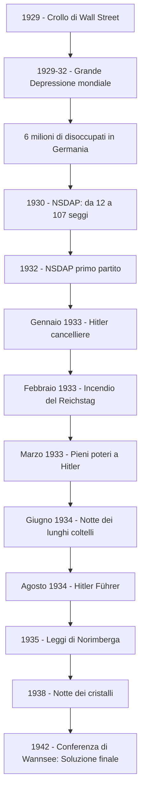

# La crisi del '29 e l'ascesa del nazismo

## La crisi del 1929

Dopo la Prima guerra mondiale gli Stati Uniti erano diventati la prima potenza economica del mondo. La produzione industriale era aumentata del 64%, e grazie alle nuove tecniche pubblicitarie e alla possibilità di acquistare a rate era cresciuto il consumo di massa. Il settore trainante era quello automobilistico, che trascinava con sé il petrolio, la metallurgia e i trasporti. I presidenti repubblicani Harding, Coolidge e Hoover seguivano il dogma liberista: lo Stato non doveva intromettersi nell'economia, ma limitarsi a rimuovere gli ostacoli al libero mercato. Hoover arrivò a dire: *"Siamo vicini in America, oggi al trionfo finale sulla povertà, come mai era accaduto prima nella storia di qualsiasi Paese."*

Sembrava un circolo virtuoso: l'alta produttività permetteva di mantenere bassi i prezzi, il che favoriva gli acquisti e incrementava i profitti. In realtà, però, questa crescita era illusoria. L'aumento del reddito riguardava solo una parte della popolazione: il 5% degli statunitensi possedeva un terzo del reddito nazionale, mentre il 71% della popolazione aveva appena lo stretto necessario per vivere e non era in grado di assorbire tutta la produzione industriale. Un altro fattore di instabilità era la frammentazione del sistema bancario americano in tante piccole banche, molto vulnerabili in caso di crisi.

Negli anni Venti investire in borsa era diventato un fenomeno di massa: sempre più persone compravano azioni per rivenderle poco dopo, incassando la differenza. Non furono posti limiti alle attività speculative delle banche e della borsa. Tra il 1927 e il 1929 il valore delle azioni raddoppiò, ma questo aumento non corrispondeva a un effettivo aumento delle vendite: era una bolla speculativa, un valore gonfiato artificialmente.

Il 24 ottobre 1929 — il "giovedì nero" — la bolla scoppiò. La borsa di Wall Street crollò: milioni di azioni furono vendute in preda al panico, le quotazioni precipitarono e i guadagni di anni scomparvero in poche ore. Piccoli e grandi risparmiatori finirono sul lastrico. La caduta della borsa colpì soprattutto la media borghesia, facendo crollare la domanda di beni di consumo. Le industrie dovettero ridurre il personale e i salari, provocando una contrazione a valanga. Quando la borsa crollò, i risparmiatori si precipitarono nelle banche per ritirare il denaro: il ritiro massiccio provocò una crisi di liquidità e il fallimento di molte banche, che trascinarono nella crisi le industrie in cui avevano investito. La produzione scese del 50% tra il 1929 e il 1932.

La crisi si propagò rapidamente fuori dagli Stati Uniti, colpendo per primi i Paesi che dipendevano dagli aiuti economici americani: Inghilterra, Austria e soprattutto la Germania. L'ondata di disoccupazione fu terribile: 12 milioni di disoccupati negli USA, 6 milioni in Germania, 3 milioni in Gran Bretagna. L'unico Paese immune fu l'URSS, che aveva appena inaugurato il suo primo piano quinquennale.

I provvedimenti del presidente Hoover non furono all'altezza della situazione: seguendo la tradizione liberista, non prevedevano l'intervento dello Stato nell'economia e confidavano nella capacità del mercato di riprendersi da solo. Solo nel 1931-32, dopo due anni di crisi, Hoover autorizzò misure più incisive, ma non furono sufficienti. La disoccupazione arrivò al 20%, migliaia di banche fallirono, molta gente si ridusse a vivere nelle baraccopoli, che i cittadini chiamavano per disprezzo "hooverville".

---

## Roosevelt e il New Deal

Alle elezioni del 1932 il democratico Franklin Delano Roosevelt promise di dare un "new deal" — un nuovo corso — all'economia. La situazione era drammatica: il 4 marzo 1933, giorno del suo insediamento, la maggior parte degli Stati aveva chiuso le banche a tempo indeterminato per evitare il collasso del sistema bancario.

Roosevelt seguì le teorie dell'economista britannico John Maynard Keynes, che in opposizione al liberismo classico teorizzava la necessità di un intervento massiccio dello Stato per risollevare l'economia. Lo Stato non poteva più restare a guardare: doveva diventare il motore dell'economia, creando occupazione attraverso grandi opere pubbliche e attivando misure di protezione sociale.

Il presidente convocò il Congresso e in poche ore fu approvato l'Emergency Banking Act: le banche furono poste sotto il controllo federale. Per incoraggiare la popolazione, Roosevelt rivolse una serie di messaggi radiofonici — le celebri "chiacchiere al caminetto" — in cui comunicava che il peggio era passato e che le banche erano sicure. La gente gli credette e il collasso del sistema bancario fu evitato.

In cento giorni Roosevelt spinse il Congresso ad approvare i provvedimenti suggeriti dal suo "brain trust", una task force di ricercatori. Furono stanziati 500 milioni di dollari per impiegare i disoccupati in lavori pubblici. Si vietò alle banche commerciali di operare nel settore finanziario e i risparmi degli statunitensi furono assicurati fino a 5.000 dollari. Il Securities and Exchange Act istituì una commissione di controllo sulle operazioni di borsa, vietando le azioni speculative. Vennero tutelati i sindacati e la concorrenza leale fra imprese. Nel 1935 fu riformato il sistema fiscale, aumentando le imposte sui redditi più alti, e il Social Security Act istituì un sistema di protezione sociale con contributi per disoccupazione, vecchiaia e disabilità.

Il New Deal gettò le basi del "welfare state": lo Stato assicurava ai cittadini diritti fondamentali come l'assistenza in caso di disoccupazione o vecchiaia. Mutò il ruolo dello Stato, che non era più un semplice spettatore ma il regolatore del sistema economico. Il New Deal non portò a una piena ripresa — la produzione industriale risalì del 50% solo entro il 1942, e la disoccupazione non fu mai completamente eliminata fino alla Seconda guerra mondiale — ma gli americani percepirono l'era Roosevelt come un periodo di fiducia e ottimismo, in cui la politica aveva saputo dare risposte concrete alla crisi. Roosevelt fu l'unico presidente statunitense rieletto per quattro mandati consecutivi.

---

## La Germania dopo la guerra: la Repubblica di Weimar

Per capire come il nazismo sia potuto nascere e arrivare al potere, bisogna tornare alla Germania del primo dopoguerra. La sconfitta nella Prima guerra mondiale aveva lasciato il Paese in ginocchio. Con il trattato di Versailles, la Germania aveva ceduto territori alla Francia, alla Polonia, al Belgio e alla Danimarca, perso le colonie, dovuto dismettere la Marina, pagare enormi riparazioni di guerra e — cosa più umiliante di tutte — assumersi la piena responsabilità dello scoppio del conflitto. Per i tedeschi, molti dei quali erano convinti che l'esercito non fosse mai stato veramente sconfitto sul campo, Versailles fu una pugnalata alla schiena inflitta dai "traditori di novembre", cioè dai politici della nuova Repubblica di Weimar che avevano firmato l'armistizio. Il mito della "pugnalata alla schiena" (Dolchstoßlegende) ebbe un effetto simile a quello della "vittoria mutilata" in Italia: alimentò un fortissimo risentimento nazionalista.

La Repubblica di Weimar, nata nel 1919, era fragile fin dalle fondamenta. Il Paese era nel caos: la Francia nel 1923 occupò la Ruhr, il Partito comunista (KPD) tentò la rivoluzione proclamando la Repubblica bavarese dei Consigli, e la Repubblica sopravviveva solo grazie ai Freikorps, corpi paramilitari di ex soldati. L'inflazione raggiunse livelli catastrofici: nel 1923 una pagnotta costava miliardi di marchi, i risparmi di una vita non valevano più nulla. Solo a partire dal 1924, grazie al piano Dawes — aiuti economici americani — e al Patto di Locarno del 1925, il cancelliere Stresemann riuscì a stabilizzare la situazione e a reinserire la Germania nel contesto internazionale.

Ma questa ripresa dipendeva interamente dai prestiti americani. Quando nel 1929 la borsa di Wall Street crollò, gli Stati Uniti sospesero gli aiuti e la Germania precipitò di nuovo in una crisi profondissima: la produzione industriale crollò e il numero dei disoccupati salì a 6 milioni. Fu in questo clima di disperazione e insicurezza che il partito nazista, fino ad allora irrilevante, conobbe un'ascesa fulminante.

---

## Adolf Hitler: le origini e la formazione

Adolf Hitler nacque nel 1889 a Braunau am Inn, una cittadina austriaca al confine con la Germania. Suo padre Alois era un funzionario doganale violento e alcolizzato; la madre Klara, una donna dolce e devota. Adolf visse la morte del padre come una liberazione, mentre rimase annichilito dalla morte della madre. Bocciato due volte alla Realschule di Linz, non riuscì a diplomarsi. Chiese due volte l'ammissione all'Accademia di Belle Arti di Vienna, ma fu respinto per "scarsa attitudine". Restò senza un lavoro e senza una formazione: tra il 1911 e il 1913 dormiva al Männerheim, il dormitorio pubblico di Vienna, e si manteneva dipingendo cartoline.

La scuola però fu decisiva per la sua formazione ideologica: molti dei suoi insegnanti erano pangermanisti e xenofobi, seguaci delle teorie di Georg von Schönerer sulla purezza della razza e sull'unificazione di tutti i popoli di lingua tedesca. A Vienna, città con una forte comunità ebraica, Hitler entrò in contatto con gli ambienti antisemiti attraverso la rivista "Ostara" di Jörg Lanz von Liebenfels, che teorizzava la superiorità della razza ariana, la selezione eugenetica e l'eliminazione delle "razze inferiori". Hitler si convinse che gli ebrei fossero i nemici naturali degli "ariani" e i responsabili di tutti i mali della società. Nel Mein Kampf scrisse: *"La documentazione durante gli anni viennesi su quegli opuscoli ha gettato fondamenta di granito per la mia personale visione del mondo."*

Nel 1913 si trasferì a Monaco di Baviera per sfuggire alla leva austriaca. Quando scoppiò la guerra, ottenne dal re di Baviera il permesso di arruolarsi nell'esercito tedesco pur essendo austriaco e apolide. In guerra fu ferito due volte e decorato con la Croce di Ferro. In infermeria, nel 1918, seppe della sconfitta tedesca e ne fu sconvolto: si convinse che la Germania avrebbe potuto vincere se non fosse stata tradita dai politici e dagli ebrei, e maturò l'idea di dedicarsi alla politica.

---

## La nascita del Partito nazista e il Putsch di Monaco

Nel dopoguerra Hitler lavorava come informatore per la polizia, fornendo i nomi dei rivoluzionari comunisti. Fu inviato a un corso nazionalista all'Università di Monaco, dove scoprì di avere le idee chiare e di saper influenzare un uditorio. Nel 1919-20 fu incaricato di sorvegliare il Partito Tedesco dei Lavoratori (DAP), un piccolo movimento nazionalista fondato da Anton Drexler. Durante una riunione in birreria ebbe una discussione così accesa che Drexler, colpito, lo iscrisse a sua insaputa come membro n. 555 e lo inserì nel comitato direttivo.

Il partito era talmente piccolo che i primi 500 numeri corrispondevano a tessere inesistenti. Ma Hitler vi trovò la sua vocazione: cominciò a prendere parte a tempo pieno alle attività del partito e in pochi mesi il numero degli iscritti raggiunse i 20.000. Nel 1920 Hitler cambiò il nome del partito in Partito Nazionalsocialista Tedesco dei Lavoratori (NSDAP) — abbreviato in "partito nazista". Adottò come simbolo la svastica, un antico simbolo solare, su un vessillo rosso con un disco bianco al centro, e attirò nuovi aderenti tra cui Rudolf Hess, Hermann Göring ed Ernst Röhm. Röhm organizzò le SA (Sturmabteilung, "reparti d'assalto"), squadre paramilitari in camicia bruna che attaccavano con violenza chiunque si opponesse al partito.

L'8 novembre 1923 Hitler tentò un colpo di Stato — il Putsch di Monaco — cercando di imitare la marcia su Roma di Mussolini. I nazisti marciarono da una birreria fino al Ministero della Guerra, ma il tentativo fallì e Hitler fu arrestato e processato per alto tradimento. Fu condannato a 5 anni di carcere, ma il processo gli diede enorme visibilità. In carcere scrisse il Mein Kampf ("La mia battaglia"), pubblicato in due volumi nel 1925 e nel 1926. I punti chiave del libro erano: la creazione di un socialismo nazionale, la lotta al bolscevismo, l'antisemitismo, la difesa della presunta "razza ariana pura e superiore" e la conquista del Lebensraum (lo "spazio vitale" a est). Considerato innocuo, Hitler fu rilasciato dopo soli 9 mesi. Nessuno lo prese sul serio.

---

## Dalla crisi del '29 alla presa del potere

Il crollo di Wall Street nel 1929 cambiò tutto. La Germania, che si era ripresa proprio grazie ai prestiti americani, fu travolta dalla crisi: gli aiuti cessarono, la produzione crollò e 6 milioni di persone persero il lavoro. Questo clima di disperazione e insicurezza fu il terreno fertile per il partito nazista: alle elezioni del 1930 la NSDAP conquistò 107 seggi su 577 (contro i 12 delle elezioni del 1928), diventando il secondo partito del Paese. Alle elezioni del 1932 divenne il primo partito.

Come in Italia con il fascismo, le élite finanziarie, industriali e militari si illusero di poter usare Hitler per neutralizzare la minaccia comunista e poi rimetterlo in riga. Nel gennaio 1933 il presidente Hindenburg, persuaso dalla borghesia industriale e dalla casta militare, nominò Hitler cancelliere. Il maresciallo Ludendorff — che pure aveva partecipato al Putsch di Monaco nel 1923 — scrisse profeticamente a Hindenburg:

!!! quote "La lettera di Ludendorff a Hindenburg — 1933"
    *"Avete consegnato la nostra sacra madre terra Germania ad uno dei più grandi demagoghi di tutti i tempi. Profetizzo solennemente che quest'uomo dannato scaglierà il nostro Reich negli abissi e porterà un'inconcepibile miseria nella nostra nazione. Le generazioni future vi malediranno nella tomba per la vostra azione."*

---

## La costruzione della dittatura

Ottenuto il ruolo di cancelliere, Hitler smantellò rapidamente le istituzioni della Repubblica di Weimar. Dopo solo un mese sciolse il Parlamento e indisse nuove elezioni. A pochi giorni dal voto, il 27 febbraio 1933, un incendio — in circostanze poco chiare — distrusse il Reichstag, la sede del Parlamento. La responsabilità fu addossata ai comunisti, che furono arrestati in massa. Il presidente Hindenburg accettò di limitare le libertà civili e politiche: furono posti limiti alla libertà di stampa, di opinione e di associazione, e venne ripristinata la pena di morte per crimini contro lo Stato. Le SA e le SS scatenarono un clima di violenza e terrore contro gli avversari politici. Alle elezioni la NSDAP ottenne il 43,9% dei voti. Hitler fece dichiarare decaduti i deputati dell'opposizione e si fece approvare una legge che gli dava pieni poteri in politica interna ed estera.

I sindacati furono sciolti e sostituiti dal Fronte tedesco del lavoro, controllato dal partito nazista. Le autonomie locali furono soppresse e i funzionari della pubblica amministrazione epurati. Eliminati gli avversari esterni, fu la volta delle epurazioni interne: nella "notte dei lunghi coltelli" (29-30 giugno 1934) le SS, per ordine di Hitler, massacrarono i vertici delle SA, incluso il loro capo Ernst Röhm, compagno di Hitler della prima ora. Le SA erano l'ala più violenta e incontrollabile del partito, sgradita alla borghesia industriale e alle gerarchie militari di cui Hitler aveva bisogno.

Un mese dopo, alla morte di Hindenburg nell'agosto 1934, Hitler poté assumere il controllo assoluto dello Stato: si attribuì il titolo di Führer (equivalente al "duce" italiano), concentrando su di sé tutti i poteri secondo il Führerprinzip, il principio della supremazia assoluta del capo. Un plebiscito confermò la decisione: il 90% degli elettori votò a favore. Al congresso annuale del partito, a Norimberga, Hitler annunciò la nascita del Terzo Reich, un regime destinato — nelle sue intenzioni — a durare mille anni. Il sistema giudiziario fu piegato al regime con la creazione della Corte del popolo (le cui sentenze erano inappellabili) e del Tribunale speciale. L'apparato repressivo fu affidato alla Gestapo, la polizia segreta di Stato.

---

## La propaganda e il controllo della società

Il controllo delle coscienze era fondamentale per il regime. Joseph Goebbels, ministro della Propaganda dal 1933, assunse il controllo totale dell'informazione e della vita culturale: stampa, cinema, teatro, radio, sport — tutto doveva essere al servizio dell'ideologia nazista. Goebbels applicava il metodo della ripetizione ossessiva: *"Ripetete una bugia mille volte e diventerà vera."* Organizzò i roghi dei libri, in cui studenti istigati dal regime saccheggiavano le biblioteche alla ricerca di opere proibite — libri di autori ebrei, comunisti o semplicemente sgraditi — e li bruciavano pubblicamente nelle piazze.

La regista Leni Riefenstahl, amica personale di Hitler, creò film e documentari che esaltavano il regime, tra cui *Il trionfo della volontà* — un classico della propaganda cinematografica che glorificava la figura del Führer come messia del popolo tedesco — e *Olympia*, il primo documentario girato su un'Olimpiade (Berlino 1936).

La Gioventù hitleriana (Hitler-Jugend) fu fondata nel 1926 per accogliere i giovani a partire dai 10 anni e prepararli attraverso un addestramento militare e paramilitare finalizzato a sviluppare fedeltà assoluta all'ideologia nazista. Il suo motto era "Blut und Ehre" (Sangue e onore). Dal 1936 tutti gli altri gruppi giovanili furono banditi e l'appartenenza alla Gioventù hitleriana divenne obbligatoria per i ragazzi sopra i 14 anni. Hitler disse apertamente: *"Io voglio una gioventù brutale, tiranna, intrepida e crudele. La debolezza dovrà essere spazzata via."*

---

## Le leggi di Norimberga e la persecuzione degli ebrei

L'antisemitismo, che era sempre stato al centro dell'ideologia nazista, divenne legge dello Stato. Fin dal marzo 1933, pochi mesi dopo la presa del potere, cominciarono le esclusioni: gli avvocati ebrei non poterono più esercitare, i giudici ebrei furono sospesi, gli impiegati ebrei espulsi dagli uffici pubblici, gli ebrei esclusi dallo sport, dalla scuola, dai cori. Le restrizioni si moltiplicarono mese dopo mese in modo sistematico.

Il 15 settembre 1935 furono promulgate le leggi di Norimberga, che formalizzarono la persecuzione razziale. La legge per la protezione del sangue proibiva matrimoni e rapporti tra ebrei e tedeschi "ariani". La legge sulla cittadinanza del Reich divise la società in "cittadini del Reich" (di sangue tedesco o ariano, con pieni diritti) e "membri di razze estranee" (con diritti limitati). Si era "ebrei" con almeno tre nonni ebrei, e "meticci ebrei" con uno o due nonni ebrei. Gli ebrei persero il diritto di voto e furono esclusi dal pubblico impiego.

Le restrizioni continuarono ad aumentare: nel 1938 agli ebrei fu vietato il commercio, l'artigianato, il cinema, il teatro, l'acquisto di giornali; i passaporti degli ebrei furono contrassegnati con la lettera "J"; gli uomini ebrei furono obbligati ad aggiungere "Israel" al loro nome e le donne "Sara". Il 10 novembre 1938 si scatenò la Kristallnacht, la "notte dei cristalli" — un pogrom organizzato in cui almeno 100 ebrei furono uccisi, 30.000 deportati nei campi di concentramento, oltre 250 sinagoghe incendiate e 7.500 negozi devastati. Il nome deriva dalle vetrine infrante dei negozi di proprietà ebraica.

Dopo la notte dei cristalli le restrizioni divennero ancora più soffocanti: ai bambini ebrei fu vietata la scuola pubblica, agli ebrei fu proibito guidare, possedere animali domestici, acquistare latte fresco, uova, libri. Dal 1941 tutti gli ebrei sopra i 6 anni furono obbligati a portare la stella di David gialla con la scritta "Jude". Nel luglio 1942 iniziò la deportazione degli ebrei di Berlino ad Auschwitz: era l'inizio della "soluzione finale della questione ebraica", il genocidio sistematico pianificato nella conferenza di Wannsee presieduta da Reinhard Heydrich, che portò allo sterminio di 6 milioni di ebrei nei campi di sterminio.

---

## Gli uomini del regime e l'apparato del terrore

Accanto a Hitler operavano i principali gerarchi del Reich. Joseph Goebbels era il ministro della Propaganda, artefice del controllo totale dell'informazione. Rudolf Hess era il vice Führer. Hermann Göring, maresciallo del Reich, fu condannato a morte al processo di Norimberga e morì suicida nel 1946. Heinrich Himmler, ministro degli Interni e capo delle SS, era il responsabile dell'intero apparato repressivo; morì suicida nel 1945.

Le SS (Schutzstaffeln, "unità di protezione") erano nate come guardia personale di Hitler all'interno delle SA, ma dopo la notte dei lunghi coltelli divennero il corpo d'élite del regime. Raggiunsero le 50.000 unità quando Himmler ne divenne il capo (Reichsführer). Himmler, gracile e miope, fissò requisiti rigorosi per l'ingresso: le reclute dovevano provare la discendenza ariana dal 1700 e superare un lungo addestramento. Le SS si dividevano in Waffen SS (unità combattenti), Allgemeine SS (sezione amministrativa) e Totenkopfstandarten (a capo dei campi di concentramento). Furono responsabili della morte di 14 milioni di civili innocenti in tutta Europa: 6 milioni di ebrei, 6 milioni di russi, 2 milioni di polacchi, 500.000 rom e sinti, 400.000 tedeschi (omosessuali, disabili, oppositori politici).

Reinhard Heydrich, soprannominato "il macellaio", era il collaboratore più stretto di Himmler e il numero due delle SS. Guidava l'Ufficio sicurezza del Reich e fu lui a presiedere la conferenza di Wannsee dove si pianificò la Soluzione finale. Hitler stesso lo definiva "l'uomo con cuore di acciaio". Fu ucciso dai partigiani cecoslovacchi nel 1942 durante l'operazione Anthropoid. Per vendetta, i nazisti sterminarono tutti i maschi sopra i 16 anni del villaggio di Lidice, vicino a Praga, e lo rasero al suolo.

---

## La ripresa economica e la preparazione alla guerra

Il consenso di cui Hitler godeva presso la popolazione tedesca si spiega in gran parte con la ripresa economica. Già nel 1933 l'economia tedesca riprese slancio grazie a un vasto programma di lavori pubblici e soprattutto alla preparazione alla guerra: in breve tempo 6 milioni di disoccupati furono assorbiti dalle opere pubbliche e dall'industria bellica. Il regime attuò una politica economica simile al New Deal di Roosevelt, ma con un obiettivo ben diverso: non il benessere dei cittadini, bensì la preparazione del Paese ad affrontare una guerra nel giro di pochi anni. Il regime agì in accordo con la grande industria, senza intaccare i latifondi e i privilegi delle élite economiche.

La ripresa economica, unita alla propaganda martellante e alla repressione di ogni voce critica, creò un clima di consenso diffuso. Molti tedeschi — fiaccati da anni di crisi, disoccupazione e umiliazione nazionale — videro in Hitler l'uomo che aveva restituito alla Germania lavoro, orgoglio e un posto nel mondo. Non tutti erano nazisti convinti, ma la maggioranza accettò il regime in cambio della stabilità e della ripresa. Fu proprio questa accettazione silenziosa — questa indifferenza, per usare le parole che Gramsci aveva scritto nel 1917 sull'Italia — a rendere possibile gli orrori che sarebbero seguiti.

---

## Schema riassuntivo

---

## Checklist

- [x] La crisi del 1929: cause, bolla speculativa, crollo di Wall Street
- [x] Le conseguenze della crisi: disoccupazione, crisi bancaria, contagio mondiale
- [x] Roosevelt e il New Deal: teorie keynesiane, intervento dello Stato, welfare state
- [x] La Germania del dopoguerra: Versailles, pugnalata alla schiena, Repubblica di Weimar
- [x] Adolf Hitler: origini, formazione, antisemitismo, anni della guerra
- [x] La nascita del partito nazista: DAP, NSDAP, SA, Putsch di Monaco, Mein Kampf
- [x] Dalla crisi del '29 alla presa del potere: elezioni, nomina a cancelliere
- [x] La costruzione della dittatura: incendio del Reichstag, pieni poteri, notte dei lunghi coltelli, Führer
- [x] La propaganda: Goebbels, Riefenstahl, Gioventù hitleriana
- [x] Le leggi di Norimberga e la persecuzione degli ebrei fino alla Soluzione finale
- [x] Gli uomini del regime: Goebbels, Hess, Göring, Himmler, Heydrich, le SS
- [x] La ripresa economica e il consenso

## Collegamenti

- **Filosofia**: Hannah Arendt e il concetto di "banalità del male"; Nietzsche e la distorsione del Superuomo da parte del nazismo (Nietzsche non era antisemita e il nazismo stravolse il suo pensiero)
- **Italiano**: Primo Levi, *Se questo è un uomo* — la testimonianza dei campi di sterminio; Pirandello e il rapporto con i regimi totalitari
- **Inglese**: George Orwell, *1984* — il controllo totalitario della società e della verità; W.H. Auden, *September 1, 1939* — la poesia scritta allo scoppio della guerra
- **Scienze**: l'eugenetica nazista e la distorsione della genetica a fini ideologici; le pseudoscienze razziali
- **Arte**: l'"arte degenerata" (Entartete Kunst) — la mostra del 1937 con cui il regime condannò le avanguardie artistiche; l'architettura monumentale di Albert Speer
- **Ed. civica**: la Dichiarazione universale dei diritti umani (1948) come risposta agli orrori del nazismo; il processo di Norimberga e la nascita del diritto penale internazionale; l'articolo 3 della Costituzione italiana sull'uguaglianza
- **Storia**: confronto con l'ascesa del fascismo in Italia — analogie (crisi economica, violenza squadrista, illusione delle élite liberali, connivenza delle istituzioni) e differenze (centralità del razzismo biologico nel nazismo)
