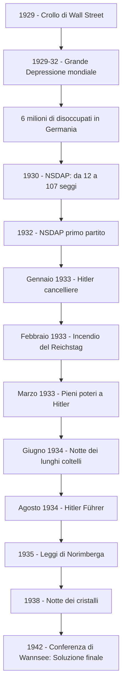

# La crisi del '29 e l'ascesa del nazismo

## La crisi del 1929

La crisi del 1929 non fu la prima grande crisi economica della storia contemporanea. Già tra il 1873 e il 1895 si era verificata una lunga depressione, che aveva trovato sbocco nel colonialismo: l'apertura di nuovi mercati nelle colonie aveva permesso di assorbire la sovrapproduzione. Ma ormai quei mercati erano saturi, e la competizione per le risorse coloniali era stata uno dei fattori scatenanti della Prima guerra mondiale. La guerra aveva stimolato l'economia, scongiurando temporaneamente una nuova crisi, ma si trattava di una crescita artificiale che non corrispondeva al reale potere d'acquisto né alla capacità di assorbimento dei mercati.

Negli anni Venti, i cosiddetti "anni ruggenti", l'economia americana aveva raggiunto livelli di produttività mai visti. Gli Stati Uniti erano la prima potenza economica del mondo: la produzione industriale era aumentata del 64%, la disoccupazione era sotto l'1% e il dollaro dominava sulle altre valute. Grazie alle nuove tecniche pubblicitarie e alla possibilità di acquistare a rate, il consumo di massa era esploso. Il settore trainante era quello automobilistico, che trascinava con sé petrolio, metallurgia e trasporti. Per favorire gli investimenti si rinunciò al controllo su cartelli e trust, si ridussero al minimo le imposte sul reddito e si mantennero bassi i tassi di interesse. I presidenti repubblicani Harding, Coolidge e Hoover seguivano il dogma liberista: lo Stato non doveva intromettersi nell'economia, ma limitarsi a rimuovere gli ostacoli al libero mercato. Hoover arrivò a dire: *"Siamo vicini in America, oggi al trionfo finale sulla povertà, come mai era accaduto prima nella storia di qualsiasi Paese."*

Sembrava un circolo virtuoso: l'alta produttività manteneva bassi i prezzi, favorendo gli acquisti e aumentando i profitti. In realtà la crescita era illusoria. L'aumento del reddito riguardava solo una parte della popolazione: il 5% degli statunitensi possedeva un terzo del reddito nazionale, mentre il 71% aveva appena lo stretto necessario per vivere e non poteva assorbire tutta la produzione industriale. Già dal 1925 iniziò una crisi di sovrapproduzione: i beni non venivano acquistati alla velocità con cui erano prodotti. I consumi non erano sostenuti dalla ricchezza reale ma dalla facilità di accesso al credito. Un altro fattore di instabilità era la frammentazione del sistema bancario americano in tante piccole banche private, vulnerabili in caso di crisi, che concedevano prestiti senza adeguate garanzie.

## La bolla speculativa e il crollo di Wall Street

Investire in borsa era diventato un fenomeno di massa: sempre più persone compravano azioni per rivenderle poco dopo, incassando la differenza. Tra il 1927 e il 1929 il valore delle azioni raddoppiò, ma questo aumento non corrispondeva a un effettivo aumento delle vendite: si era creata una bolla speculativa, un valore gonfiato artificiosamente che tra il 1924 e il 1929 aveva quintuplicato il valore medio dei titoli.

Il 24 ottobre 1929 — il "giovedì nero" — la bolla scoppiò. La borsa di Wall Street crollò: milioni di azioni furono vendute in preda al panico e i guadagni di anni scomparvero in poche ore. I titoli continuarono a scendere fino al 1932: le azioni della United States Steel passarono da 250 dollari a 22, quelle della Chrysler da 135 a 5. A finire in rovina non furono solo i grandi capitalisti, ma anche i piccoli risparmiatori. La caduta colpì soprattutto la media borghesia, facendo crollare la domanda di beni di consumo.

La chiusura delle banche causò la contrazione del credito: tra il 1929 e il 1933 fallirono 5.000 banche, trascinando nella crisi le imprese in cui avevano investito. Fallirono anche 100.000 imprese senza più finanziamenti bancari. La crisi colpì anche l'agricoltura: i contadini, guadagnando sempre meno, si indebitarono con le banche e molti furono espropriati delle terre. Alcuni produttori, per frenare il crollo dei prezzi, arrivarono a distruggere i raccolti. La produzione industriale scese del 50% tra il 1929 e il 1932, e la disoccupazione raggiunse livelli altissimi: il 25% della popolazione rimase senza lavoro (13-15 milioni di persone). L'economia era avvitata in un meccanismo perverso in cui la crisi generava sempre nuova crisi.

---

## La crisi travolge il mondo

La crisi si propagò rapidamente fuori dagli Stati Uniti, assumendo la forma di crisi del commercio internazionale. Gli Stati Uniti ritirarono i prestiti concessi ai Paesi europei per rimettere denaro in circolazione in patria. Il risultato fu che anche l'industria europea entrò in crisi, rimasta priva dei finanziamenti d'oltreoceano.

Per difendersi, i governi alzarono barriere doganali altissime e adottarono misure di rigido protezionismo. Quasi tutti i Paesi sospesero la convertibilità in oro (il gold standard) e svalutarono la propria moneta, sperando che una valuta più debole favorisse le esportazioni. In realtà la paralisi commerciale durò fino alla fine della Seconda guerra mondiale.

L'ondata di disoccupazione fu terribile: 12 milioni di disoccupati negli USA, 6 milioni in Germania, 3 milioni in Gran Bretagna. La Gran Bretagna fu tra i Paesi più colpiti: il governo laburista di Ramsay MacDonald dovette tagliare i sussidi ai disoccupati e sospendere la convertibilità della sterlina, che cadde di un terzo — un evento che scosse il mondo, dato che la Gran Bretagna era il "banchiere del mondo". L'unico Paese immune fu l'URSS, che aveva appena inaugurato il primo piano quinquennale.

Le conseguenze in America Latina furono drammatiche: le economie basate sulla vendita di materie prime agli Stati Uniti sprofondarono. In Brasile quintali di caffè furono gettati in mare, in Argentina si dovette abbattere il bestiame. Nei Paesi più arretrati si affermarono dittature militari; nei più grandi (Brasile, Argentina, Cile, Messico) la crisi spinse verso una diversificazione produttiva che avrebbe dato impulso all'industria manifatturiera.

---

## Dal fallimento di Hoover al primo New Deal

I provvedimenti del presidente Hoover non furono all'altezza: seguendo la tradizione liberista, non prevedevano l'intervento diretto dello Stato e confidavano nella capacità del mercato di rialzarsi da solo, affidandosi al "volontarismo" degli imprenditori. Solo nel 1931-32, dopo due anni di crisi, Hoover autorizzò misure più incisive — come un ente per erogare prestiti alle banche — ma erano rivolte solo alle grandi istituzioni finanziarie, non ai cittadini senza lavoro. La disoccupazione arrivò al 20%, migliaia di banche fallirono, molta gente si ridusse a vivere nelle baraccopoli, chiamate per disprezzo "hooverville".

Alle elezioni del 1932 il democratico Franklin Delano Roosevelt promise di dare un "new deal" — un nuovo patto — all'economia. I due candidati si scontrarono sulla diagnosi della crisi: Hoover sosteneva che proveniva dall'Europa e che il sistema americano era sano; Roosevelt ribaltava l'analisi, attribuendo la responsabilità all'assenza di controlli pubblici che aveva incoraggiato la speculazione. La situazione era drammatica: il 4 marzo 1933, giorno del suo insediamento, la maggior parte degli Stati aveva chiuso le banche a tempo indeterminato per evitare il collasso del sistema bancario.

Roosevelt seguì le teorie dell'economista britannico John Maynard Keynes, che in opposizione al liberismo classico teorizzava la necessità di un intervento massiccio dello Stato. Keynes sosteneva che il mercato non era in grado di autoregolarsi — la crisi del 1929 ne era la prova — e che lo Stato doveva dare equilibrio al sistema economico, aumentando la spesa pubblica per creare occupazione e promuovere il potere d'acquisto delle famiglie.

Il presidente convocò il Congresso e in poche ore fu approvato l'Emergency Banking Act: le banche furono poste sotto il controllo federale. Per incoraggiare la popolazione, Roosevelt rivolse una serie di messaggi radiofonici — le celebri "chiacchiere al caminetto" — in cui rassicurava che il peggio era passato e che le banche erano sicure. La gente gli credette e il collasso bancario fu evitato.

In cento giorni Roosevelt spinse il Congresso ad approvare i provvedimenti suggeriti dal suo "brain trust", una task force di ricercatori. Furono stanziati 500 milioni di dollari per impiegare i disoccupati in lavori pubblici. Si vietò alle banche commerciali di operare nel settore finanziario e i risparmi degli statunitensi furono assicurati fino a 5.000 dollari. Il Securities and Exchange Act istituì una commissione di controllo sulle operazioni di borsa, vietando le azioni speculative. L'Agricultural Adjustment Act predispose indennizzi statali per gli agricoltori in difficoltà. La Public Works Administration (PWA) permise di impiegare milioni di disoccupati nei lavori pubblici. La National Recovery Administration (NRA) promosse accordi tra Stato, imprenditori e sindacati per il mantenimento di un certo livello di occupazione e di salari. Fu anche creata la Tennessee Valley Authority (TVA), un'agenzia federale per la realizzazione di opere idrogeologiche e la produzione di energia elettrica nel bacino del fiume Tennessee. La fine del proibizionismo, con la vendita di alcolici regolarmente tassati, incrementò le entrate dello Stato.

## Il secondo New Deal e il welfare state

Nel 1935 il Congresso approvò un "secondo New Deal" con riforme ancora più incisive. La Work Progress Administration (WPA) creò nuovi posti di lavoro — nel giro di otto anni occupò otto milioni di persone. Il Social Security Act istituì un sistema di protezione sociale con contributi per disoccupazione, vecchiaia e disabilità. Il sistema fiscale fu riformato aumentando le imposte sui redditi più alti (Wealth Tax Act), cosa che scatenò le proteste dei conservatori.

La riforma monetaria svalutò il dollaro e aumentò la quantità di moneta in circolazione per far diminuire i prezzi e favorire le esportazioni. La Corte Suprema, in gran parte composta da conservatori nominati dai precedenti presidenti repubblicani, dichiarò incostituzionali vari provvedimenti del New Deal nel 1935-36, limitandone l'effetto: fu il più grave conflitto tra poteri costituzionali della storia americana.

Il New Deal gettò le basi del "welfare state": lo Stato assicurava ai cittadini diritti fondamentali come l'assistenza in caso di disoccupazione o vecchiaia. Mutò il ruolo dello Stato, che non era più un semplice spettatore ma il regolatore del sistema economico. I risultati, però, furono per molti aspetti al di sotto delle attese: nel 1936 i disoccupati erano ancora 9 milioni, e a partire dal 1937 il Paese fu colpito da una nuova fase economica negativa, che sarebbe stata definitivamente arginata solo dall'economia di guerra. Le politiche del New Deal giovarono soprattutto agli strati intermedi della società, ma non eliminarono le discriminazioni razziali nei luoghi di lavoro. Roosevelt fu comunque l'unico presidente statunitense rieletto per quattro mandati consecutivi, e gli americani percepirono la sua era come un periodo di fiducia e ottimismo.

---

## La Germania dopo la guerra: Versailles e la "pugnalata alla schiena"

Per capire come il nazismo sia potuto nascere, bisogna tornare alla Germania del primo dopoguerra. Dopo la sconfitta nella Prima guerra mondiale, il Paese attraversò una profonda crisi economica, sociale e politica, a cui i deboli governi della Repubblica di Weimar, proclamata nel 1919, tentarono faticosamente di porre rimedio. Con il trattato di Versailles la Germania aveva ceduto territori a Francia, Polonia, Belgio e Danimarca, perso le colonie, dovuto dismettere la Marina, pagare enormi riparazioni di guerra e — cosa più umiliante — assumersi la piena responsabilità dello scoppio del conflitto. Per i tedeschi, molti dei quali erano convinti che l'esercito non fosse mai stato veramente sconfitto sul campo, Versailles fu una pugnalata alla schiena inflitta dai "traditori di novembre", cioè dai politici che avevano firmato l'armistizio. Il mito della "pugnalata alla schiena" (Dolchstoßlegende) ebbe un effetto simile a quello della "vittoria mutilata" in Italia: alimentò un fortissimo risentimento nazionalista.

## La Repubblica di Weimar tra caos e ripresa

La Repubblica di Weimar era fragile fin dalle fondamenta. Il Paese era nel caos: nel 1923 la Francia occupò la Ruhr, il Partito comunista (KPD) tentò la rivoluzione proclamando la Repubblica bavarese dei Consigli, e la Repubblica sopravviveva solo grazie ai Freikorps, corpi paramilitari di ex soldati. L'inflazione raggiunse livelli catastrofici: nel 1923 una pagnotta costava miliardi di marchi, i risparmi di una vita non valevano più nulla. I primi risultati positivi si registrarono solo a partire dal 1924, grazie al Piano Dawes — aiuti economici americani — e al Patto di Locarno del 1925, con cui il cancelliere Stresemann riuscì a stabilizzare la situazione e a reinserire la Germania nel contesto internazionale. Nel 1929 fu varato anche il Piano Young, che riduceva l'entità delle riparazioni e le dilazionava in 60 rate (contro le 42 originarie), ma il piano non divenne mai operativo a causa del crollo di Wall Street.

Tutta la ripresa tedesca dipendeva dai prestiti americani. Quando nel 1929 la borsa crollò, gli Stati Uniti sospesero gli aiuti e la Germania precipitò in una crisi profondissima: la produzione industriale si dimezzò e i disoccupati salirono a 6 milioni. Nel 1932, con la produzione in calo del 40%, le nazioni vincitrici convocarono la conferenza di Losanna e abolirono le riparazioni, ma era ormai troppo tardi. Larga parte dell'opinione pubblica, impoverita ed esasperata, attribuì la responsabilità della crisi ai partiti tradizionali — il socialdemocratico (SPD) e il Zentrum cattolico — accusati di non aver saputo porre rimedio né alla crisi interna né all'umiliazione di Versailles. Fu in questo clima di disperazione che il partito nazista conobbe un'ascesa fulminante.

---

## Adolf Hitler: le origini e la formazione

Adolf Hitler nacque nel 1889 a Braunau am Inn, una cittadina austriaca al confine con la Germania. Il padre Alois era un funzionario doganale violento e alcolizzato; la madre Klara una donna dolce e devota. Adolf visse la morte del padre come una liberazione, mentre rimase annichilito dalla morte della madre. Bocciato due volte alla Realschule di Linz, non riuscì a diplomarsi. Chiese due volte l'ammissione all'Accademia di Belle Arti di Vienna, ma fu respinto per "scarsa attitudine". La scuola fu però decisiva per la sua formazione ideologica: molti insegnanti erano pangermanisti e xenofobi, seguaci delle teorie di Georg von Schönerer sulla purezza della razza e sull'unificazione dei popoli di lingua tedesca.

A Vienna, città con una forte comunità ebraica, Hitler entrò in contatto con gli ambienti antisemiti attraverso la rivista "Ostara" di Jörg Lanz von Liebenfels, che teorizzava la superiorità della razza ariana, la selezione eugenetica e l'eliminazione delle "razze inferiori". Si convinse che gli ebrei fossero i nemici naturali degli "ariani" e i responsabili di tutti i mali della società. Senza lavoro né formazione, tra il 1911 e il 1913 dormiva al Männerheim, il dormitorio pubblico di Vienna, mantenendosi dipingendo cartoline e cartelloni pubblicitari.

Nel 1913 si trasferì a Monaco di Baviera per sfuggire alla leva austriaca. Quando scoppiò la guerra, ottenne dal re di Baviera il permesso di arruolarsi nell'esercito tedesco pur essendo austriaco e apolide. In guerra fu ferito due volte e decorato con la Croce di Ferro. In infermeria, nel 1918, seppe della sconfitta tedesca e ne fu sconvolto: si convinse che la Germania avrebbe potuto vincere se non fosse stata tradita dai politici e dagli ebrei, e maturò l'idea di dedicarsi alla politica.

---

## La nascita del Partito nazista

Quando Hitler si stabilì a Monaco nel dopoguerra, trovò in Germania — e in Baviera in particolare — una miriade di associazioni più o meno segrete che inneggiavano alla purezza della razza, al pangermanesimo e all'antisemitismo. Molte di queste, nate tra il 1890 e il 1930, avevano un carattere elitario ed esoterico. La più nota era la Thule Gesellschaft (Società Thule), che aveva per simbolo un gladio romano e una svastica: alcuni futuri alti gerarchi nazisti provenivano proprio da questo ambiente. Si trattava di un humus culturale già pronto ad accogliere le idee di Hitler.

Nel dopoguerra Hitler lavorava come informatore per la polizia, fornendo i nomi dei rivoluzionari comunisti. Fu inviato a un corso nazionalista all'Università di Monaco, dove scoprì di saper influenzare un uditorio. Nel 1919-20 fu incaricato di sorvegliare il Partito Tedesco dei Lavoratori (DAP), un piccolo movimento nazionalista fondato da Anton Drexler. Durante una riunione in birreria ebbe una discussione così accesa che Drexler, colpito, lo iscrisse a sua insaputa come membro n. 555 e lo inserì nel comitato direttivo. Il partito era talmente piccolo che i primi 500 numeri corrispondevano a tessere inesistenti.

Ma Hitler vi trovò la sua vocazione: cominciò a prendere parte a tempo pieno alle attività del partito e in pochi mesi il numero degli iscritti raggiunse i 20.000. Nel 1920 cambiò il nome del partito in Partito Nazionalsocialista Tedesco dei Lavoratori (NSDAP) — abbreviato in "partito nazista". Adottò come simbolo la svastica, un antico simbolo solare, su un vessillo rosso con un disco bianco al centro. Attirò nuovi aderenti tra cui Rudolf Hess, Hermann Göring ed Ernst Röhm. Nel 1921 Röhm organizzò le SA (Sturmabteilung, "reparti d'assalto"), squadre paramilitari in camicia bruna che attaccavano con violenza chiunque si opponesse al partito.

A caratterizzare ideologicamente il nazionalsocialismo era una dottrina che univa motivi nazionalistici — innanzitutto la riscossa della Germania dopo l'umiliazione di Versailles — a elementi anticapitalistici e socialisti (come il controllo dello Stato sulla società e la statalizzazione delle industrie) e a motivi fortemente razzisti e antisemiti, con richiami al darwinismo sociale. I nemici politici interni erano due: da un lato le forze della sinistra (socialdemocratici e comunisti), dall'altro il liberalismo, colpevole di indebolire la compattezza della nazione.

L'8 novembre 1923 Hitler tentò un colpo di Stato — il Putsch di Monaco — cercando di imitare la marcia su Roma di Mussolini. I nazisti marciarono da una birreria fino al Ministero della Guerra, ma il tentativo fallì e Hitler fu arrestato e processato per alto tradimento. Fu condannato a 5 anni di carcere, ma il processo gli diede enorme visibilità. In carcere lesse l'opera di Henry Ford, *L'ebreo internazionale*, e scrisse il Mein Kampf ("La mia battaglia"), pubblicato in due volumi nel 1925 e nel 1926. Considerato innocuo, fu rilasciato dopo soli 9 mesi.

---

## Il Mein Kampf e l'ideologia nazista

Il Mein Kampf sarebbe diventato il manifesto ideologico del nazionalsocialismo. I tratti nazionalistici della destra tedesca tradizionale si combinavano con motivi fortemente razzisti e antisemiti e con richiami al darwinismo sociale, che applicava la teoria evoluzionistica darwiniana allo studio delle società umane.

Hitler esprimeva la volontà di costruire uno Stato fondato sul concetto di "purezza della razza". Egli era convinto che le qualità fisiche, morali e intellettuali dei singoli fossero un insieme di caratteristiche innate trasmesse geneticamente, di generazione in generazione. Il valore dell'essere umano risiedeva non nell'individualità, ma nella collettività razzialmente definita; questa, per risultare vincitrice nell'incessante lotta per la sopravvivenza — concetto preso a prestito dal darwinismo — doveva garantirsi uno "spazio vitale" (Lebensraum), cioè un territorio adeguato a sostentare il popolo e preservarne l'integrità. Di conseguenza le vicende umane venivano interpretate come un eterno e ineliminabile conflitto tra razze.

Hitler stabiliva una vera e propria gerarchia razziale: al vertice vi era la razza tedesca, discendente diretta degli ariani. Le "razze inferiori" comprendevano soprattutto gli ebrei — un popolo privo di un proprio spazio vitale che, in tale distorta prospettiva, viveva in quello di altri popoli come un "parassita" — ma anche gli slavi e gli asiatici. Di qui discendeva l'idea della necessità di espandere il controllo della Germania ai territori dell'Est europeo.

I punti chiave del libro erano: la creazione di un socialismo nazionale, la lotta al bolscevismo, l'antisemitismo, la difesa della presunta "razza ariana pura e superiore", la conquista del Lebensraum a est e l'alleanza con l'Inghilterra per evitare una guerra su due fronti.

---

## Il nuovo corso del partito e la presa del potere

Con l'uscita di Hitler dal carcere alla fine del 1924, il Partito nazista si riorganizzò. Riflettendo sul fallimento del Putsch e seguendo l'esempio del fascismo in Italia, Hitler comprese che accanto alla violenza era necessario dare al partito una parvenza di legalità, per conquistare il consenso di fasce più ampie della popolazione: dai militari alla borghesia industriale, dai ceti medi colpiti dalla crisi ai ceti popolari delusi da socialisti e comunisti.

Nel 1926, a fianco delle SA, comparvero le Schutzstaffeln ("milizie di protezione"), meglio note come SS, concepite inizialmente come guardia personale di Hitler. A partire dal 1929 furono poste sotto la guida di Heinrich Himmler e si specializzarono in compiti di polizia e di spionaggio, diventando una forza parallela e concorrente rispetto alle SA di Röhm. Nelle elezioni presidenziali del 1925 i nazionalsocialisti appoggiarono il generale Hindenburg, esponente delle idee conservatrici, che risultò vincitore.

## Dalla crisi del '29 alla nomina a cancelliere

Il crollo di Wall Street nel 1929 cambiò tutto. La Germania, che si era ripresa proprio grazie ai prestiti americani, fu travolta dalla crisi. L'aggravarsi della situazione, con la produzione industriale in calo del 40% e 6 milioni di disoccupati, fece guadagnare al partito di Hitler consensi sempre maggiori, sia tra le classi popolari prostrate dalla miseria, sia tra le classi dirigenti dell'aristocrazia agraria e militare, della finanza e dell'industria. Queste ultime iniziarono a ritenere preferibile l'instaurazione di un regime autoritario che tutelasse i loro interessi economici.

Alle elezioni del settembre 1930 la NSDAP conquistò 107 seggi su 577 (contro i 12 del 1928), diventando il secondo partito del Paese. I partiti tradizionali — socialdemocratici e cattolici — uscirono indeboliti e furono costretti a formare governi di coalizione incapaci di risolvere la crisi. Nelle presidenziali dell'aprile 1932 Hitler si candidò personalmente e ottenne il 37% dei voti, obbligando Hindenburg al ballottaggio. Dopo che nelle elezioni del novembre 1932 i nazisti divennero primo partito con 196 seggi, nel gennaio 1933 una delegazione di industriali e latifondisti convinse Hindenburg ad affidare a Hitler l'incarico di cancelliere. Il leader nazista giunse così al potere senza alcuna "rivoluzione", ma legalmente chiamato a guidare il governo.

Il maresciallo Ludendorff — che pure aveva partecipato al Putsch di Monaco — scrisse profeticamente a Hindenburg:

!!! quote "La lettera di Ludendorff a Hindenburg — 1933"
    *"Avete consegnato la nostra sacra madre terra Germania ad uno dei più grandi demagoghi di tutti i tempi. Profetizzo solennemente che quest'uomo dannato scaglierà il nostro Reich negli abissi e porterà un'inconcepibile miseria nella nostra nazione. Le generazioni future vi malediranno nella tomba per la vostra azione."*

---

## La costruzione della dittatura

Ottenuto il ruolo di cancelliere, Hitler smantellò rapidamente il sistema politico-istituzionale della Repubblica di Weimar. Per garantire al suo partito la netta maggioranza, il 1° febbraio 1933 sciolse il Parlamento e indisse nuove elezioni. Il 27 febbraio, a pochi giorni dal voto, un terribile incendio — in circostanze mai chiarite — distrusse il palazzo del Reichstag. La responsabilità fu addossata ai comunisti, arrestati in massa. Come presunto responsabile fu arrestato l'olandese Marinus van der Lubbe, un giovane agitatore di simpatie anarco-comuniste; tutti gli accusati furono assolti, mentre van der Lubbe, sotto tortura, si dichiarò colpevole e fu giustiziato. La pena di morte, non prevista nella Repubblica di Weimar, fu reintrodotta a seguito dell'incendio del Reichstag.

Il presidente Hindenburg fu indotto a emanare un decreto che limitava le libertà civili e politiche: furono posti limiti alla libertà di stampa, di opinione e di associazione. Le SA e le SS scatenarono un clima di violenza e terrore contro gli avversari politici. Alle elezioni del 5 marzo la NSDAP ottenne il 43,9% dei voti. Hitler fece dichiarare decaduti i deputati dell'opposizione (comunisti, socialdemocratici e cattolici) e il 24 marzo si fece approvare una legge che gli dava pieni poteri in politica interna ed estera, esautorando di fatto il Reichstag e inaugurando un *modus operandi* che avrebbe caratterizzato la prassi di governo nazista.

I sindacati furono sciolti e sostituiti dal Fronte tedesco del lavoro, un ente sotto lo stretto controllo del Partito, concepito per penetrare in tutti i settori dell'economia nazionale e condizionare psicologicamente le masse dei lavoratori. La pubblica amministrazione fu epurata di tutti i funzionari non graditi, mentre le autonomie locali dei Länder furono soppresse, sostituendo i Parlamenti regionali con governatori nominati da Hitler.

## La notte dei lunghi coltelli e la nascita del Terzo Reich

Eliminate le opposizioni esterne, fu la volta delle epurazioni interne. Ernst Röhm, capo delle SA, era stato compagno di Hitler fin dalla prima ora — era l'unico a potergli dare del tu. Le SA erano costituite in larga parte da disoccupati, delinquenti comuni e sottoproletariato che davano sfogo ai peggiori istinti sotto la bandiera dell'ideologia: vessazioni e torture erano la norma. Röhm diceva di sé: *"Siccome avevo un temperamento immaturo e bollente, la guerra e l'agitazione esercitavano su di me maggiore attrattiva che non il buon ordine borghese."* Le SA erano nemiche dell'ordine borghese e volevano sostituirsi all'Esercito regolare. Röhm mirava a una "rivoluzione" anticapitalistica attraverso il braccio armato delle SA, entrando in contrasto con la borghesia industriale e la casta militare, di cui Hitler aveva bisogno. Nella "notte dei lunghi coltelli" (29-30 giugno 1934) le SS, coordinate da Hermann Göring, massacrarono i vertici delle SA incluso Röhm; sorte analoga toccò a uomini politici conservatori e ad alcuni alti ufficiali dell'esercito considerati possibili concorrenti di Hitler.

Un mese dopo, alla morte di Hindenburg il 2 agosto 1934, Hitler poté assumere il totale controllo dello Stato tedesco. Fece emanare un decreto che sanciva la concentrazione di tutte le cariche nella persona del Führer (letteralmente "conduttore", equivalente al "duce" italiano), concentrando su di sé tutti i poteri secondo il Führerprinzip, il principio della supremazia assoluta del capo. Un plebiscito confermò la decisione: il 90% dell'elettorato, circa 38 milioni di cittadini, votò a favore. Al congresso annuale del partito, a Norimberga, Hitler annunciò la nascita del Terzo Reich — un nuovo "Impero" che si poneva come successore del medievale Sacro Romano Impero (962-1806) e dell'Impero tedesco di Guglielmo I (1871-1918) — destinato nelle sue intenzioni a durare mille anni.

Nel nuovo regime il Parlamento non aveva più alcun potere: prima dello scoppio della Seconda guerra mondiale si riunì soltanto 12 volte. Era il partito a tenere le redini dell'iniziativa legislativa, promulgando decreti che con l'approvazione del Führer diventavano automaticamente leggi. Il sistema giudiziario fu piegato al regime: fu abolito il principio dell'indipendenza della magistratura, fu creata la Corte del Popolo (le cui sentenze erano inappellabili) e il Tribunale speciale per i crimini politici. L'apparato repressivo fu affidato alla Gestapo (Geheime Staatspolizei, "polizia segreta di Stato"): fondata da Göring nel 1933, passò sotto il controllo delle SS nel 1934 e fu dotata di compiti di investigazione politica, rastrellamento e repressione degli oppositori. Era autorizzata a ogni tipo di trattamento nei confronti dei prigionieri, inclusa la tortura, e con un provvedimento del 1936 fu posta di fatto al di sopra della legge.

---

## La propaganda e il controllo della società

Il regime nazista basò la propria forza non solo sulla violenza, ma anche sull'indottrinamento ideologico. Nel 1933 Joseph Goebbels fu nominato ministro della Propaganda: assunse il controllo totale dell'informazione e della vita culturale — stampa, cinema, teatro, radio, sport — tutto al servizio dell'ideologia nazista. Applicava il metodo della ripetizione ossessiva: la continua ripetizione di notizie parziali o palesemente false, rigidamente controllate dal vertice. Fu l'artefice delle campagne di "arianizzazione" e contro l'"arte degenerata" e la "scienza ebraica", che costrinsero all'esilio centinaia di artisti e scienziati ebrei — tra cui Albert Einstein, Sigmund Freud, Bertolt Brecht, Thomas Mann, l'architetto Walter Gropius e il regista Fritz Lang — ponendo fine alla stagione culturale di Weimar.

Goebbels organizzò i roghi dei libri, in cui studenti istigati dal regime saccheggiavano le biblioteche alla ricerca di opere proibite — libri di autori ebrei, comunisti o semplicemente sgraditi, da Proust a Zola, da Marx a Freud — e li bruciavano pubblicamente nelle piazze. Una sorte analoga toccò a tutte le opere dell'arte contemporanea (espressionismo, cubismo, dadaismo, astrattismo), considerate "degenerate". Coloro che rimasero dovettero dimostrarsi entusiasti sostenitori del regime, e le stesse prestigiose università tedesche dovettero piegarsi ai dettami dell'ideologia nazista.

La regista Leni Riefenstahl, amica personale di Hitler, creò film e documentari che esaltavano il regime, tra cui *Il trionfo della volontà* — un classico della propaganda cinematografica che glorificava la figura del Führer come messia del popolo tedesco — e *Olympia*, il primo documentario girato su un'Olimpiade (Berlino 1936).

## Le organizzazioni di massa e le adunate

Strumento privilegiato per inculcare i valori nazisti furono le organizzazioni di massa. Tutti i ragazzi dai 10 anni in su erano inquadrati nella Gioventù hitleriana (Hitler-Jugend), fondata nel 1926 per formarli ideologicamente e militarmente, sviluppando la fedeltà e l'obbedienza al regime. Il suo motto era "Blut und Ehre" (Sangue e onore). Dal 1936 tutti gli altri gruppi giovanili furono banditi e l'appartenenza alla Gioventù hitleriana divenne obbligatoria per i giovani sopra i 14 anni. Hitler disse apertamente: *"Io voglio una gioventù brutale, tiranna, intrepida e crudele. La debolezza dovrà essere spazzata via."*

Per disciplinare il tempo libero dei lavoratori, dal 1933 il Fronte tedesco del lavoro venne affiancato dalla "Forza attraverso la gioia" (Kraft durch Freude), un'associazione che doveva instillare nei tedeschi l'orgoglio di essere un gruppo sociale privilegiato attraverso l'organizzazione di concerti, mostre, gite e vacanze.

Grande importanza ebbero le adunate di massa, manifestazioni studiate nei minimi dettagli scenografici — fiaccole, foreste di bandiere con la croce uncinata, aquile imperiali — e regolate da precisi cerimoniali. In tali occasioni Hitler agiva come un vero e proprio attore, rivolgendo alle masse discorsi meticolosamente costruiti, con immagini estremamente semplici, concrete e ripetute più volte, tali da creare una forte tensione emotiva e una totale identificazione con il capo carismatico.

Per quanto riguarda i rapporti con le Chiese, nel luglio 1933 fu stipulato un Concordato tra la Santa Sede e il governo hitleriano, che garantiva il rispetto della libertà di culto e la non interferenza del regime negli affari della Chiesa. All'interno del protestantesimo si sviluppò fin dal 1932 il movimento dei "Cristiani tedeschi", che intendeva saldare motivi religiosi e nazionalsocialisti. Le confessioni e le personalità religiose che non si allinearono furono perseguitate e, non di rado, eliminate fisicamente. Fin dal 1933 furono istituiti campi di concentramento (Lager), dal 1936 affidati alla supervisione delle SS, per rinchiudere dissidenti politici e religiosi, ebrei, rom e sinti, e i cosiddetti "asociali" (omosessuali, malati di mente, delinquenti comuni).

---

## Le leggi di Norimberga e la persecuzione degli ebrei

L'antisemitismo, sempre al centro dell'ideologia nazista, divenne legge dello Stato. Nella prospettiva di Hitler la Germania doveva diventare una comunità di sangue fondata sulla purezza ariana. Facendo leva sui tradizionali sentimenti antigiudaici della popolazione cristiana europea e sull'immagine dell'ebreo "avido commerciante borghese, occulto corruttore della società", il nazismo sostenne che gli ebrei fossero i principali responsabili della crisi sociale ed economica: divennero il capro espiatorio di tutti i "mali" della modernità.

Fin dalla primavera del 1933, pochi mesi dopo la presa del potere, il regime procedette all'epurazione degli ebrei dalla pubblica amministrazione, dal giornalismo e dall'insegnamento. Le restrizioni si moltiplicarono mese dopo mese in modo sistematico.

Il 15 settembre 1935 furono promulgate le leggi di Norimberga, che formalizzarono la persecuzione razziale. La Legge per la protezione del sangue e dell'onore tedesco proibiva matrimoni e rapporti tra ebrei e tedeschi "ariani". La Legge sulla cittadinanza del Reich stabilì che cittadini del Reich potevano essere soltanto quelli "di sangue tedesco o affine", privando gli ebrei della cittadinanza e del diritto di voto.

## Dalla notte dei cristalli alla Soluzione finale

A partire dal 1938 la persecuzione conobbe una radicalizzazione. Agli ebrei fu vietato il commercio, l'artigianato, il cinema, il teatro; i passaporti furono contrassegnati con la lettera "J"; gli uomini furono obbligati ad aggiungere "Israel" al loro nome e le donne "Sara". Fu l'attentato contro il diplomatico tedesco Ernst vom Rath, avvenuto a Parigi il 7 novembre 1938 per mano di un giovane ebreo polacco, a fornire ai nazisti il pretesto per scatenare un vero e proprio pogrom: nella notte tra l'8 e il 9 novembre — la Kristallnacht, la "notte dei cristalli" — uomini del partito distrussero i negozi degli ebrei, appiccarono il fuoco a 177 sinagoghe, assalirono gli israeliti nelle loro abitazioni e trafugarono beni per svariati miliardi di marchi. Dopo la notte dei cristalli, gli ebrei iniziarono a essere deportati nei campi di concentramento.

Le restrizioni continuarono ad aumentare: ai bambini ebrei fu vietata la scuola pubblica, agli ebrei fu proibito guidare, possedere animali domestici, acquistare libri. Dal 1941 tutti gli ebrei sopra i 6 anni furono obbligati a portare la stella di David gialla con la scritta "Jude". Nel luglio 1942 iniziò la deportazione degli ebrei di Berlino ad Auschwitz: era l'inizio della "soluzione finale della questione ebraica", il genocidio sistematico pianificato nella conferenza di Wannsee presieduta da Reinhard Heydrich, che portò allo sterminio di 6 milioni di ebrei nei campi di sterminio.

---

## Gli uomini del regime e l'apparato del terrore

Accanto a Hitler operavano i principali gerarchi del Reich. Joseph Goebbels era il ministro della Propaganda, artefice del controllo totale dell'informazione; si suicidò nel 1945. Rudolf Hess era il vice Führer. Hermann Göring, maresciallo del Reich, fu condannato a morte al processo di Norimberga e morì suicida nel 1946. Heinrich Himmler, ministro degli Interni e capo delle SS, era il responsabile dell'intero apparato repressivo; morì suicida nel 1945.

Le SS (Schutzstaffeln, "unità di protezione") erano nate come guardia personale di Hitler all'interno delle SA, ma dopo la notte dei lunghi coltelli divennero il corpo d'élite del regime. Himmler fissò requisiti rigorosi per l'ingresso: le reclute dovevano provare la discendenza ariana dal 1700 e superare un lungo addestramento. Le SS si dividevano in Waffen SS (unità combattenti), Allgemeine SS (sezione amministrativa) e Totenkopfstandarten (a capo dei campi di concentramento). Furono responsabili della morte di 14 milioni di civili innocenti in tutta Europa: 6 milioni di ebrei, 6 milioni di russi, 2 milioni di polacchi, 500.000 rom e sinti, 400.000 tedeschi (omosessuali, disabili, oppositori politici).

Reinhard Heydrich, soprannominato "il macellaio", era il collaboratore più stretto di Himmler e il numero due delle SS. Guidava l'Ufficio sicurezza del Reich e fu lui a presiedere la conferenza di Wannsee dove si pianificò la Soluzione finale. Hitler stesso lo definiva "l'uomo con cuore di acciaio". Fu ucciso dai partigiani cecoslovacchi nel 1942 durante l'operazione Anthropoid. Per vendetta, i nazisti sterminarono tutti i maschi sopra i 16 anni del villaggio di Lidice, vicino a Praga, e lo rasero al suolo.

---

## La politica economica e la preparazione alla guerra

Il consenso di cui Hitler godeva si spiega in gran parte con la ripresa economica. Per garantirsi il sostegno della grande borghesia, dell'esercito e dei ceti medi, il governo dovette trovare con urgenza soluzioni alla crisi. Lo Stato intraprese una politica di dirigismo economico che si proponeva di coordinare tutti gli sforzi industriali della nazione.

Le direzioni principali della politica economica furono due. In primo luogo, per ridurre l'altissimo tasso di disoccupazione, fu messo in atto un vasto programma di lavori pubblici, il cui risultato più importante fu la realizzazione di una moderna rete autostradale e il lancio delle Volkswagen ("macchine del popolo"), accessibili anche ai tedeschi meno abbienti. In secondo luogo, la politica economica nazista si pose l'obiettivo del riarmo, ritenuto fondamentale per restituire al Paese il ruolo di grande potenza e per conquistare lo "spazio vitale" indicato come priorità nel Mein Kampf. L'industria pesante ottenne consistenti commesse statali: nel 1939 l'industria di guerra assorbiva più della metà del bilancio pubblico, e già nel 1938 fu raggiunta la piena occupazione.

Questa politica bellicista ebbe immediate ripercussioni internazionali. Già nel 1933 fu annunciata l'uscita della Germania dalla Società delle Nazioni. Due anni dopo fu reintrodotta la leva obbligatoria, abolita dalla pace di Versailles. Hitler si preparava a dare avvio alla politica aggressiva che avrebbe fatto precipitare l'Europa nel più catastrofico conflitto della storia.

La ripresa economica, unita alla propaganda martellante e alla repressione di ogni voce critica, creò un clima di consenso diffuso. Molti tedeschi — fiaccati da anni di crisi, disoccupazione e umiliazione nazionale — videro in Hitler l'uomo che aveva restituito alla Germania lavoro, orgoglio e un posto nel mondo. Non tutti erano nazisti convinti, ma la maggioranza accettò il regime in cambio della stabilità e della ripresa.

---

## Schema riassuntivo

---

## Checklist

- [x] La crisi del 1929: cause, sovrapproduzione, bolla speculativa, crollo di Wall Street
- [x] Le conseguenze della crisi: disoccupazione, crisi bancaria, crisi agricola, contagio mondiale
- [x] La crisi internazionale: protezionismo, gold standard, America Latina, Gran Bretagna
- [x] Hoover e il fallimento del liberismo
- [x] Roosevelt e il New Deal: teorie keynesiane, intervento dello Stato, welfare state
- [x] Il secondo New Deal, la Corte Suprema, i limiti del New Deal
- [x] La Germania del dopoguerra: Versailles, pugnalata alla schiena, Repubblica di Weimar
- [x] I Piani Dawes e Young, la conferenza di Losanna
- [x] Adolf Hitler: origini, formazione, antisemitismo, anni della guerra
- [x] La nascita del partito nazista: DAP, NSDAP, SA, Putsch di Monaco, Mein Kampf
- [x] L'ideologia nazista: purezza della razza, darwinismo sociale, spazio vitale, gerarchia razziale
- [x] La doppia strategia: legalità e violenza, il nuovo corso del partito
- [x] Dalla crisi del '29 alla presa del potere: elezioni, ballottaggio, nomina a cancelliere
- [x] La costruzione della dittatura: incendio del Reichstag, pieni poteri, notte dei lunghi coltelli, Führer
- [x] La struttura del Terzo Reich: Parlamento svuotato, Corte del Popolo, Gestapo
- [x] La propaganda: Goebbels, censura, roghi dei libri, Riefenstahl, adunate di massa
- [x] La Gioventù hitleriana, Kraft durch Freude, Concordato con la Chiesa
- [x] Le leggi di Norimberga e la persecuzione degli ebrei fino alla Soluzione finale
- [x] Gli uomini del regime: Goebbels, Hess, Göring, Himmler, Heydrich, le SS
- [x] La politica economica: lavori pubblici, autostrade, Volkswagen, riarmo, piena occupazione
- [x] La politica estera: uscita dalla Società delle Nazioni, leva obbligatoria, preparazione alla guerra

## Collegamenti

- **Filosofia**: Hannah Arendt e il concetto di "banalità del male"; Nietzsche e la distorsione del Superuomo da parte del nazismo (Nietzsche non era antisemita e il nazismo stravolse il suo pensiero); il darwinismo sociale come distorsione della teoria di Darwin
- **Italiano**: Primo Levi, *Se questo è un uomo* — la testimonianza dei campi di sterminio; Pirandello e il rapporto con i regimi totalitari
- **Inglese**: George Orwell, *1984* — il controllo totalitario della società e della verità; W.H. Auden, *September 1, 1939* — la poesia scritta allo scoppio della guerra
- **Scienze**: l'eugenetica nazista e la distorsione della genetica a fini ideologici; le pseudoscienze razziali
- **Arte**: l'"arte degenerata" (Entartete Kunst) — la mostra del 1937 con cui il regime condannò le avanguardie artistiche; l'architettura monumentale di Albert Speer
- **Ed. civica**: la Dichiarazione universale dei diritti umani (1948) come risposta agli orrori del nazismo; il processo di Norimberga e la nascita del diritto penale internazionale; l'articolo 3 della Costituzione italiana sull'uguaglianza
- **Storia**: confronto con l'ascesa del fascismo in Italia — analogie (crisi economica, violenza squadrista, illusione delle élite liberali, connivenza delle istituzioni) e differenze (centralità del razzismo biologico nel nazismo)
- **Economia**: Keynes e la rivoluzione della macroeconomia; il confronto tra la risposta liberista di Hoover e l'interventismo di Roosevelt; il dirigismo economico del Terzo Reich
