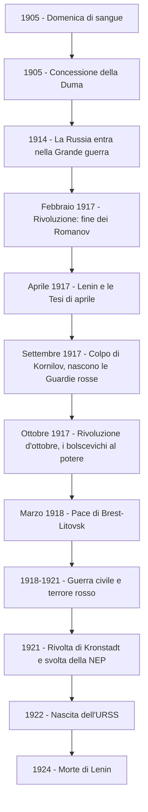

# La Rivoluzione russa

## Un Paese arretrato

All'inizio del Novecento la Russia era un immenso impero ancora essenzialmente agricolo e profondamente arretrato rispetto all'Europa occidentale. La sconfitta nella guerra contro il Giappone del 1905 aveva messo a nudo tutta la debolezza economica e strutturale del Paese. L'industria, concentrata soltanto in pochi grandi centri come Mosca e San Pietroburgo, era del tutto inadeguata, e gli operai vivevano in condizioni durissime: malgrado nel 1897 l'orario di lavoro fosse stato ridotto a undici ore per le mansioni più pesanti, i datori di lavoro aggiravano facilmente i vincoli, imponendo straordinari di fatto obbligatori. Gli scioperi erano illegali e venivano puniti con arresti e deportazioni; ogni forma di associazionismo operaio era vietata, per il timore che i sindacati svolgessero propaganda contro il governo o dessero vita a partiti politici.

Al vertice di questo sistema c'era lo zar Nicola II, sovrano autocratico convinto di regnare per diritto divino e ostile a qualunque apertura democratica. La Russia, insomma, era una società di antico regime governata con metodi assolutistici, in cui le tensioni sociali si accumulavano senza poter trovare uno sbocco legale.

---

## La domenica di sangue del 1905

Nei primi anni del secolo la stessa polizia zarista, l'Ochrana, cercò di controllare il malcontento favorendo la nascita di associazioni operaie "innocue", guidate da uomini fedeli allo zar. Una di queste, l'Assemblea, era una sorta di dopolavoro operaio fondato da Georgij Gapon, un pope ortodosso. Nel gennaio 1905, di fronte a una serie di licenziamenti, gli operai di Pietroburgo chiesero salari minimi, la giornata lavorativa di otto ore, il diritto di sciopero e migliori condizioni in fabbrica. Davanti al rifiuto degli industriali, l'Assemblea proclamò lo sciopero a oltranza, a cui si unì la popolazione esasperata dal carovita.

Gapon, insieme a un gruppo di intellettuali liberali, redasse allora una petizione da presentare direttamente allo zar, nella convinzione ingenua che "lo zar non conosce i nostri bisogni: andiamo a dirglieli". Il documento denunciava le miserabili condizioni di vita del popolo e l'assenza di diritti civili e politici, e chiedeva riforme profonde: libertà di parola, di stampa e di associazione, separazione tra Stato e Chiesa, istruzione gratuita, uguaglianza di fronte alla legge, un'imposta progressiva sul reddito, la giornata di otto ore e soprattutto la convocazione di un'Assemblea costituente eletta a suffragio universale.

Il 22 gennaio 1905 oltre centomila persone, in processione pacifica, portando icone sacre e ritratti dei sovrani e cantando inni religiosi, si diressero verso il Palazzo d'Inverno per consegnare la petizione. Nicola II, che temeva ogni concessione, aveva però decretato in segreto lo stato d'assedio. I cosacchi, ricevuto l'ordine di disperdere la folla, aprirono il fuoco sui manifestanti inermi, trasformando la marcia in un massacro. Il numero esatto delle vittime resta incerto — le fonti oscillano da poche centinaia a diverse migliaia — ma l'episodio, passato alla storia come la "domenica di sangue", ebbe un effetto enorme: spezzò per sempre il legame di fiducia tra il popolo e il "piccolo padre" zar. Lo stesso Gapon, sgomento, esclamò: "Non c'è più zar per noi!".

---

## La Duma e lo scoppio della Grande guerra

Sull'onda delle proteste del 1905, lo zar fu costretto a una concessione: riconvocò la Duma, un'antica assemblea consultiva, dotandola anche di potere legislativo e concedendo alcune libertà civili di base. Si trattò però di un'apertura più apparente che reale. Nella nuova Costituzione Nicola II riaffermò il proprio potere autocratico: si riservava la nomina dei ministri, che rispondevano solo a lui e non alla Duma, e soprattutto poteva sciogliere l'assemblea e indire nuove elezioni ogni volta che lo riteneva opportuno. Tra il 1906 e il 1912 la Duma fu infatti sciolta quattro volte e ogni volta ricostituita con uomini più graditi al sovrano.

Come molti altri sovrani europei, anche lo zar vide nello scoppio della Prima guerra mondiale un'occasione per rafforzare il proprio potere e ricompattare la nazione. Ma per la Russia il conflitto si rivelò una catastrofe: le perdite umane furono altissime, l'esercito era male equipaggiato e la carestia cominciò a travolgere il Paese.

---

## La rivoluzione di febbraio e la fine della monarchia

Nel 1917 la situazione precipitò. I soldati disertavano in massa il fronte e la fame dilagava nelle città. Nel febbraio di quell'anno scoppiarono grandi manifestazioni a Pietrogrado, e i soldati inviati a reprimerle si rifiutarono di sparare sulla folla, schierandosi al fianco dei dimostranti. Nacquero così di nuovo i Soviet, i consigli dei delegati degli operai (e poi anche dei soldati e dei contadini): erano già comparsi nel 1905 con il compito di coordinare gli scioperi, ma erano stati soppressi; ora rinascevano come veri organi di rappresentanza popolare.

L'intransigenza dello zar finì per spaccare la stessa élite aristocratica: una parte di essa, guidata dal principe Georgij L'vov, auspicava una svolta liberale. Già nel 1916 i circoli di corte avevano fatto assassinare Rasputin, il "santone" consigliere della famiglia imperiale, ormai odiato da tutto il Paese. Il 27 febbraio la Duma formò un governo provvisorio presieduto da L'vov e sostenuto dalle principali forze politiche moderate: i cadetti (l'ala liberale e costituzionale), i socialisti rivoluzionari e i menscevichi, cioè la corrente moderata del partito socialdemocratico nata dalla scissione del 1903 (l'altra ala, quella estremista e maggioritaria, era quella dei bolscevichi di Lenin).

Il nuovo governo costrinse Nicola II ad abdicare. La corona fu offerta al fratello Michele, che però rifiutò: si chiudeva così, dopo oltre tre secoli, il dominio della dinastia Romanov. Fin da subito, però, il governo provvisorio si trovò di fronte a un problema insolubile: il cosiddetto dualismo di poteri. Da un lato la Duma, che puntava a creare una monarchia o una repubblica costituzionale; dall'altro i Soviet, a guida socialista, che chiedevano la repubblica e una radicale riforma agraria.

---

## Lenin e le Tesi di aprile

Nell'aprile del 1917 rientrò in Russia Vladimir Il'ič Ul'janov, noto con lo pseudonimo di Lenin, leader dei bolscevichi, esiliato dal 1907. Il suo arrivo cambiò tutto. Lenin era convinto che la rivoluzione non dovesse nascere spontaneamente dal basso, ma dovesse essere guidata da un'élite ristretta e organizzata di rivoluzionari di professione. Nell'opuscolo noto come *Tesi di aprile* sostenne due idee dirompenti: la necessità di una pace immediata "senza annessioni né indennità", per uscire subito dalla guerra a qualunque costo, e la parola d'ordine "tutto il potere ai Soviet".

Soprattutto, Lenin ruppe con l'ortodossia marxista difesa dagli altri socialisti. Secondo Marx, prima della rivoluzione proletaria doveva compiersi una "fase borghese"; Lenin invece sostenne che quella fase, in Russia, si era già consumata — in forma molto "compressa" — con il passaggio del potere alla Duma. I tempi erano dunque maturi per passare direttamente alla rivoluzione socialista, che avrebbe portato alla nazionalizzazione delle terre, delle banche e delle industrie, cioè all'abolizione della proprietà privata.

Nel luglio 1917 la popolazione di Pietrogrado scese in piazza invocando la pace e la riforma agraria. I bolscevichi appoggiarono queste "giornate di luglio", ma nei Soviet erano ancora in minoranza rispetto ai menscevichi e ai socialisti rivoluzionari, più cauti. La rivolta fu repressa, i bolscevichi messi fuori legge e Lenin costretto a fuggire di nuovo in esilio, questa volta in Finlandia.

---

## Il colpo di Kornilov e la Rivoluzione d'ottobre

Nel frattempo L'vov si era dimesso, lasciando la guida del governo ad Aleksandr Kerenskij, leader dei socialisti rivoluzionari, l'unico che sembrava in grado di mediare tra i moderati e i Soviet. Kerenskij commise però un errore decisivo: non ritirò la Russia dalla guerra e non riuscì a realizzare le riforme che il Paese attendeva. Nel settembre 1917 le forze conservatrici tentarono un colpo di Stato guidato dal generale Kornilov. Per fermarlo Kerenskij dovette appellarsi a tutte le forze rivoluzionarie, compresi i bolscevichi, che rientrarono così nella legalità e ne uscirono enormemente rafforzati: avevano contribuito a salvare la rivoluzione e avevano conquistato la maggioranza nel Soviet di Pietrogrado, il più importante del Paese. A capo di quel Soviet fu messo Lev Trockij, che dotò i bolscevichi di una milizia armata pronta all'azione, le Guardie rosse.

Kerenskij proclamò la Repubblica il 15 settembre 1917, con l'intenzione di convocare un'Assemblea costituente che decidesse il futuro assetto dello Stato. Ma Lenin, rientrato clandestinamente, decise che era giunto il momento di prendere il potere con la forza, prima che l'Assemblea potesse riunirsi. Tra il 25 e il 26 ottobre 1917 (corrispondenti al 7-8 novembre del nostro calendario) le Guardie rosse occuparono il Palazzo d'Inverno, sede del governo provvisorio, costringendo Kerenskij alla fuga. Il Congresso panrusso dei Soviet proclamò la nascita della Repubblica sovietica. La sera stessa il nuovo governo bolscevico deliberò l'uscita della Russia dalla guerra e la distribuzione delle terre ai contadini. Pochi mesi dopo, il 3 marzo 1918, fu firmata con gli Imperi centrali la durissima pace di Brest-Litovsk: pur di uscire dal conflitto, la Russia rinunciò a vasti territori, mentre Estonia, Lettonia e Lituania divennero indipendenti.

!!! quote "Lenin sulla presa del potere"
    *"Soltanto dei mascalzoni o dei semplicioni possono credere che il proletariato debba prima conquistare la maggioranza alle elezioni effettuate sotto il giogo della borghesia, sotto il giogo della schiavitù salariata, e poi conquistare il potere. È il colmo della stupidità o dell'ipocrisia."*

---

## Un regime autocratico e il terrore rosso

Il regime instaurato dopo la presa del potere ruppe presto con il modello democratico delle rivoluzioni occidentali, assumendo i tratti di una vera e propria dittatura. Il governo rivoluzionario, chiamato Consiglio dei commissari del popolo (Sovnarkom) per evitare la parola "borghese" ministri, era formato solo da bolscevichi, presieduto da Lenin con Trockij agli esteri. In teoria rispondeva ai Soviet, ma di fatto emanava decreti che i Soviet si limitavano a ratificare. Venne istituita la Ceka, una polizia segreta incaricata di reprimere ogni forma di dissenso, fu introdotta la censura e proclamata la legge marziale.

Quando, nel novembre 1917, si tennero finalmente le elezioni per l'Assemblea costituente, la maggioranza andò ai socialisti rivoluzionari (circa il 40% dei voti, contro il 20% dei bolscevichi). Di fronte alla sconfitta, Lenin dichiarò che l'Assemblea rappresentava ormai il vecchio parlamentarismo borghese, superato dalla rivoluzione, e ne dichiarò invalido il risultato. La Costituente si riunì comunque il 18 gennaio 1918, ma il governo bolscevico la sciolse il giorno successivo. Quella che si presentava come la "Repubblica dei Soviet dei deputati degli operai e dei contadini" era in realtà la dittatura di un solo partito, che dal marzo 1918 assunse il nome di partito comunista.

Dal 1918 si scatenò una repressione spietata, passata alla storia come il "terrore rosso". Furono liquidate tutte le altre forze politiche che avevano partecipato alla rivoluzione — menscevichi, socialisti rivoluzionari, anarchici — soppressi i giornali d'opposizione, repressi nel sangue gli scioperi e le proteste contadine. Un attentato contro Lenin fece inasprire ulteriormente la repressione, con migliaia di fucilazioni e la cattura di ostaggi tra i familiari dei rivoltosi. La maggior parte delle vittime non furono nemmeno oppositori politici, ma contadini che protestavano contro le requisizioni forzate di grano.

!!! quote "Le istruzioni di Lenin alla Ceka"
    *"Noi non facciamo la guerra contro singole persone. Noi sterminiamo la borghesia come classe. Nelle indagini non cercate documenti e prove su ciò che l'accusato ha fatto contro l'autorità sovietica. Chiedetegli subito a che classe appartiene, quali sono le sue origini, la sua educazione, la sua istruzione e la sua professione."*

---

## La guerra civile e la fine dei Romanov

La pace separata di Brest-Litovsk allarmò le potenze dell'Intesa, sia perché le privava di un alleato sul fronte orientale, sia per il timore del "contagio" comunista. Esse decisero di intervenire, dando il via a una sanguinosa guerra civile combattuta tra l'Armata rossa, organizzata da Trockij, e le Armate bianche, le forze controrivoluzionarie fedeli al vecchio regime e sostenute dall'Intesa. Per impedire che i bianchi liberassero la famiglia imperiale, confinata a Ekaterinburg, Lenin ordinò lo sterminio dei Romanov: nella notte lo zar, la moglie, i cinque figli e i pochi membri rimasti della corte furono fucilati e i loro corpi occultati.

Malgrado l'iniziale superiorità dei bianchi, l'Armata rossa riuscì ad avere la meglio, anche grazie all'appoggio della popolazione, che si strinse attorno ai bolscevichi di fronte all'invasione straniera. Nel 1921 la guerra civile era conclusa, al prezzo di circa sette milioni di morti. Per affrontare quegli anni terribili il regime aveva adottato il cosiddetto "comunismo di guerra": requisizione forzata dei beni alimentari nelle campagne, sostituzione della moneta con il baratto e controllo armato della produzione. Questo sistema permise di sfamare l'esercito, ma sul piano economico fu un fallimento, aggravando la carestia e il malcontento.

---

## La Costituzione del 1918 e l'organizzazione del potere

La vittoria nella guerra civile fu resa possibile dalla ferrea organizzazione del partito comunista, all'interno del quale si realizzò un rapido accentramento autoritario del potere. La Costituzione varata nel 1918 ne è la prova: riconosceva formalmente la sovranità della classe operaia in nome della "dittatura del proletariato", ma in realtà delineava un rigido assetto gerarchico. Sulla carta il potere apparteneva al Congresso dei Soviet e al suo Comitato esecutivo, mentre il Consiglio dei commissari del popolo aveva funzioni amministrative; di fatto, però, tutte le strutture dello Stato erano subordinate al partito e ai suoi organi direttivi, il Comitato centrale e il suo ufficio politico, il Politburo.

---

## L'emancipazione della donna sovietica

Come era accaduto nella Rivoluzione francese, anche in Russia le donne presero parte attiva alla rivoluzione, scendendo in piazza per chiedere pane e pace. Il governo di Kerenskij aveva riconosciuto loro il diritto di voto attivo e passivo e aveva autorizzato la creazione di reparti militari femminili, i "Battaglioni della morte". Il governo bolscevico varò poi una serie di riforme che miravano a scardinare la famiglia, considerata un'istituzione "borghese" ed egoistica, per esaltare i doveri verso la collettività: nel 1917 fu legalizzato il divorzio, nel 1918 sancita la parità tra i sessi, nel 1920 abolito il matrimonio religioso e liberalizzato l'aborto; furono inoltre depenalizzate l'omosessualità e la convivenza.

Nel 1919 nacque lo Zenotdel, la sezione femminile del Comitato centrale, incaricata di combattere l'analfabetismo e la prostituzione e di favorire l'inserimento delle donne nel lavoro. Ben presto, però, questa rivoluzione dei costumi generò un forte disagio sociale: aumentarono gli abbandoni, i divorzi e il calo delle nascite, visto come una minaccia per la potenza militare del Paese. Per questo nel 1929 lo Zenotdel fu sciolto e Stalin avviò una politica opposta, di incremento delle nascite. La donna sovietica restava in fondo "mascolinizzata", chiamata a condividere la durezza del lavoro in fabbrica, ma anche a educare la famiglia ai valori del marxismo.

---

## L'ateismo di Stato e la Terza Internazionale

Per controllare più a fondo la società, il regime sostituì i tribunali con "tribunali del popolo", i cui giudici erano nominati dal partito, e impose un rigido controllo sulle scuole. Avviò inoltre un'opera radicale di scristianizzazione, confiscando i beni della Chiesa ortodossa, chiudendo chiese e monasteri, arrestando e fucilando i religiosi. Data la profondità della fede in Russia non fu però possibile imporre davvero l'ateismo di Stato: le persecuzioni costrinsero piuttosto i credenti — ortodossi, ma anche cattolici, musulmani ed ebrei — a vivere la propria fede in clandestinità, dando vita alla cosiddetta "Chiesa del silenzio".

Sul piano internazionale, nel 1919 Lenin fondò a Mosca la Terza Internazionale, l'organizzazione che doveva coordinare l'azione di tutti i partiti comunisti del mondo, favorirne il distacco dai socialisti e prepararli alla conquista rivoluzionaria del potere. Poiché ogni partito vi partecipava con un numero di rappresentanti proporzionale agli iscritti, il partito sovietico finì per assicurarsi la maggioranza e il potere decisionale, subordinando a sé tutti gli altri.

---

## La NEP e la nascita dell'URSS

Nel 1921 il Paese fu colpito da una terribile carestia che provocò milioni di morti. Nello stesso anno i marinai della base navale di Kronstadt, che erano stati tra i protagonisti della Rivoluzione d'ottobre, insorsero reclamando la restituzione del potere ai Soviet, ormai svuotati, il ripristino di un sistema elettorale democratico, la libertà di stampa e la fine del comunismo di guerra. La rivolta fu repressa con durezza, ma fece capire a Lenin che occorreva cambiare strada. Il X Congresso del partito dichiarò così conclusa la fase del comunismo di guerra e varò la NEP, la Nuova politica economica: un sistema misto che reintroduceva alcuni margini di libero scambio e di proprietà privata, soprattutto in agricoltura. Sul piano economico fu un'apertura; sul piano politico, invece, ogni forma di dissenso continuò a essere soffocata.

L'ex impero zarista era un mosaico di popoli, in cui i russi rappresentavano appena il 44% della popolazione. Per evitare spinte separatiste, nel 1922 il governo comunista decretò la nascita dell'URSS, l'Unione delle Repubbliche socialiste sovietiche, formalmente su base federale, ma in realtà con il potere fortemente accentrato a Mosca.

---

## Il ruolo del partito e l'eredità di Lenin

Al cuore del pensiero di Lenin c'era una concezione del partito molto diversa da quella di Marx. Marx aveva scritto che "l'emancipazione della classe lavoratrice deve essere opera dei lavoratori stessi"; Lenin, invece, riteneva che i proletari, lasciati a se stessi, non fossero capaci di una vera coscienza rivoluzionaria, ma soltanto di rivolte spontanee. Già nel 1902, nell'opuscolo *Che fare?*, aveva scritto che "la moderna coscienza socialista può essere portata all'operaio solo dall'esterno". Serviva dunque un partito organizzato e fortemente gerarchizzato, un'élite di rivoluzionari di professione cui spettava il compito di guidare ed educare le masse.

Questa visione conteneva in sé il germe di un sistema autoritario, in cui la "dittatura del proletariato" finiva per coincidere con la dittatura del partito e del suo capo. Quando Lenin fu colpito da un primo ictus, nel maggio 1922, il regime aveva già assunto i tratti totalitari che il suo successore Stalin avrebbe poi accentuato. Lo stesso Lenin, in un suo scritto degli ultimi anni, aveva messo in guardia i compagni proprio nei confronti di Stalin.

!!! quote "Il testamento di Lenin"
    *"Il compagno Stalin, divenuto segretario generale, ha concentrato nelle sue mani un immenso potere, e io non sono sicuro che egli sappia servirsene sempre con sufficiente prudenza. Stalin è troppo arrogante [...]. Perciò propongo che i compagni esaminino la possibilità di allontanare Stalin da tale carica."*

Lenin morì nel 1924. La sua salma fu imbalsamata ed esposta in un mausoleo nella Piazza Rossa, dove si trova ancora oggi: il segno più evidente di come la rivoluzione avesse trasformato il comunismo in una sorta di "religione secolare", con i suoi riti, i suoi simboli e il suo capo venerato come una figura sacra.

---

## Schema riassuntivo

---

## Checklist

- [x] Un Paese arretrato: la Russia di Nicola II all'inizio del Novecento
- [x] La domenica di sangue del 1905 e la petizione di Gapon
- [x] La concessione della Duma e lo scoppio della Grande guerra
- [x] La rivoluzione di febbraio 1917 e la fine dei Romanov
- [x] Lenin e le Tesi di aprile; le giornate di luglio
- [x] Il colpo di Kornilov e la Rivoluzione d'ottobre
- [x] La pace di Brest-Litovsk
- [x] Il regime autocratico, lo scioglimento della Costituente e il terrore rosso
- [x] La guerra civile, il comunismo di guerra e la fine dei Romanov
- [x] La Costituzione del 1918 e l'organizzazione del potere
- [x] L'emancipazione della donna sovietica
- [x] L'ateismo di Stato e la Terza Internazionale
- [x] La NEP e la nascita dell'URSS
- [x] Il ruolo del partito e il testamento di Lenin

## Collegamenti

- Filosofia: Marx e il materialismo storico, la lotta di classe e la dittatura del proletariato; Lenin come interprete (e revisione) del marxismo; Hannah Arendt e il concetto di totalitarismo applicato sia al comunismo sia al nazismo
- Storia: il confronto con l'ascesa del fascismo in Italia, dove la paura del "contagio bolscevico" spinse la borghesia a sostenere Mussolini; la nascita del Partito comunista d'Italia al Congresso di Livorno (1921); lo stalinismo come sviluppo del sistema costruito da Lenin
- Italiano: Gramsci e il pensiero marxista in Italia; la letteratura dell'impegno e il mito della rivoluzione tra gli intellettuali del Novecento
- Inglese: George Orwell, *Animal Farm* come allegoria della rivoluzione tradita, e *1984* come immagine del regime totalitario e della manipolazione della verità
- Arte: il legame tra avanguardie russe e rivoluzione, con il Costruttivismo e la grafica della propaganda sovietica
- Ed. civica: il contrasto tra lo Stato totalitario a partito unico e i principi dello Stato di diritto e della Costituzione democratica; la definizione di genocidio e crimine contro l'umanità elaborata dalle Nazioni Unite nel 1948
