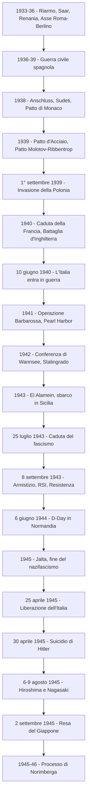

# La Seconda guerra mondiale

## **Verso la guerra: la politica aggressiva di Hitler**

Una volta consolidato il regime in Germania, Hitler avviò una politica estera che aveva un unico obiettivo: cancellare il trattato di Versailles e restituire alla Germania il ruolo di grande potenza. Nel 1933 la Germania nazista uscì dalla Società delle Nazioni; nel 1935 Hitler ripudiò Versailles e reintrodusse la leva obbligatoria, dotandosi di un forte esercito — la Wehrmacht ("forza di difesa") — di una nuova marina e di un'aviazione, la Luftwaffe ("arma dell'aria"), posta sotto il comando di Hermann Göring. Le democrazie occidentali, Francia e Gran Bretagna, scelsero la via della trattativa per evitare un nuovo conflitto: questa politica, nota come *appeasement* ("pacificazione"), si rivelò un disastro, perché ogni concessione fu interpretata da Hitler come segno di debolezza.

Il primo tentativo di unione tra Germania e Austria (l'Anschluss, vietato dall'articolo 80 di Versailles) si era già consumato nel 1934. Per difendersi dai nazisti, il cancelliere austriaco Engelbert Dollfuss aveva instaurato un governo autoritario di matrice fascista avvicinandosi all'Italia, e firmando con Mussolini e l'Ungheria i Protocolli di Roma: l'Italia si impegnava a intervenire militarmente in difesa dell'Austria. Quando, il 25 luglio 1934, i nazisti austriaci tentarono un colpo di Stato in cui Dollfuss fu ucciso, Mussolini schierò le truppe al confine italo-austriaco frenando Hitler e guadagnandosi il soprannome di "guardia del Brennero": per il momento l'unione non si fece.

Nel 1935, grazie a uno schiacciante plebiscito, Hitler si annetté la regione mineraria della Saar dopo quindici anni di sfruttamento francese; l'anno dopo, mentre il mondo era concentrato sull'attacco fascista all'Etiopia, le truppe tedesche occuparono la zona smilitarizzata della Renania, senza che Regno Unito e Francia si mobilitassero. Il cosiddetto "fronte di Stresa" — l'asse antifascista tra Italia, Inghilterra e Francia nato nel 1935 — si dimostrò debolissimo perché i tre Paesi avevano interessi diversi: l'Inghilterra era disposta a tollerare il riarmo tedesco per arginare la minaccia sovietica, la Francia sperava di trovare nell'URSS un alleato contro il nazismo, mentre l'Italia, colpita dalle sanzioni per l'Etiopia, si trovò isolata e cadde fra le braccia del nazismo. Nel 1936 Hitler ospitò a Berlino l'XI Olimpiade per esibire la potenza tedesca, e il 25 ottobre Italia e Germania siglarono l'Asse Roma-Berlino, un patto d'amicizia formale ma di grande valore politico.

## **La guerra civile spagnola**

La guerra civile spagnola fu in molti modi la "prova generale" della Seconda guerra mondiale. Nel 1931 il re Alfonso XIII era andato in esilio e la giovane Repubblica spagnola aveva tentato profonde riforme contro i grandi latifondisti, scatenando uno scontro durissimo con le forze conservatrici. Dopo anni di instabilità, nel 1936 le elezioni portarono al potere una coalizione di sinistra, il *Frente Popular*: si scatenò un'ondata di violenza che prese di mira soprattutto la Chiesa, identificata con i conservatori — comunisti e anarchici incendiarono il 70% delle chiese e uccisero migliaia di religiosi. Il 17 luglio 1936 il generale Francisco Franco, stanziato in Nord Africa, lanciò l'*Alzamiento*, un colpo di Stato contro il governo repubblicano cui seguirono tre anni di guerra sanguinosissima.

La Falange di Franco era ispirata al fascismo; i repubblicani erano una coalizione di partiti di sinistra. Sia il nazifascismo sia l'URSS di Stalin intervennero nel conflitto: Hitler "sperimentò" la Luftwaffe sulle città spagnole, mentre Stalin ordinò una resa dei conti interna eliminando i trockisti. Molti italiani si trovarono a combattere fratricidamente, alcuni arruolati con l'esercito fascista, altri come volontari nelle "brigate internazionali" dei repubblicani. La guerra si concluse con la vittoria di Franco, la cui dittatura sarebbe durata trentacinque anni.

La cittadina basca di Guernica fu scelta da Hitler per essere bombardata, benché abitata quasi solo da civili, perché distava da Berlino come Londra: era un test per i futuri bombardamenti delle città inglesi. Picasso, in due mesi, compose il celeberrimo quadro *Guernica* per il padiglione spagnolo all'Esposizione internazionale di Parigi: quando gli fu chiesto se fosse stato lui a fare quell'orrore, rispose *"No, lo avete fatto voi!"*. A sostegno degli antifascisti si schierarono moltissimi intellettuali — Hemingway, Orwell, Camus, Brecht, Matisse, Neruda, Thomas Mann, Sciascia, Elio Vittorini — al punto che lo stesso Vittorini affermò che *"la lotta in Spagna fu scuola di massa per noi"*, preludio della Resistenza. Hemingway ne ricavò il romanzo *Per chi suona la campana*; Orwell militò nel POUM (Partito Operaio di Unificazione Marxista) e in *Omaggio alla Catalogna* denunciò come i comunisti, su ordine di Stalin, avessero distrutto la sinistra anarchica e trockista; il poeta Federico García Lorca, sostenitore dei repubblicani, fu catturato e fucilato dai franchisti nel 1936.

## **Dall'Anschluss al Patto Molotov-Ribbentrop**

Stipulata l'alleanza con l'Italia, era venuto meno il principale ostacolo all'annessione austriaca. Il 10 aprile 1938, con un finto plebiscito, l'Austria fu annessa alla Germania e Hitler fece un ingresso trionfale a Vienna. Pochi mesi dopo, col pretesto di annettere le zone di lingua tedesca, invase la regione dei Sudeti in Cecoslovacchia. Né Francia né Inghilterra desideravano un nuovo conflitto: con il Patto di Monaco del settembre 1938, mediato da Mussolini, le democrazie cedettero alle richieste naziste sacrificando la Cecoslovacchia, che non fu nemmeno invitata. Chamberlain non si oppose, pensando che la Germania si sarebbe fermata; ma l'accordo prevedeva che Hitler non occupasse Praga e fu subito violato — i tedeschi entrarono nella capitale ceca il 10 marzo 1939. L'*appeasement* aveva illuso Hitler di poter continuare le annessioni senza causare l'intervento europeo, e fu Churchill a sentenziare contro Chamberlain con celebre durezza: *"Vi è stato dato a scegliere tra il disonore e la guerra. Avete scelto il disonore e avrete la guerra."*

Dopo l'Anschluss e l'occupazione italiana dell'Albania, Mussolini si decise a firmare un'alleanza militare con Hitler. Il 22 maggio 1939 i ministri degli Esteri Galeazzo Ciano e Joachim von Ribbentrop firmarono a Berlino il Patto d'Acciaio (che Mussolini avrebbe voluto chiamare "Patto di Sangue"), un'alleanza difensiva e offensiva che obbligava al reciproco aiuto militare e vietava armistizi separati — clausola per la quale nel 1943 la Germania considererà un "tradimento" l'armistizio di Cassibile. Mussolini, consapevole dell'impreparazione italiana, aveva ottenuto da Ribbentrop la rassicurazione che la Germania non avrebbe iniziato la guerra prima di quattro o cinque anni: era una promessa falsa, perché il giorno dopo Hitler tenne un consiglio di guerra segreto in cui all'ordine del giorno c'era l'attacco alla Polonia. Vittorio Emanuele III commentò amaramente: *"I tedeschi finché avranno bisogno di noi saranno cortesi e magari servili. Ma alla prima occasione, si riveleranno quei mascalzoni che sono."*

Francia e Inghilterra resistettero alla successiva richiesta di Hitler, la restituzione di Danzica, ceduta alla Polonia con Versailles. Hitler cercò allora un alleato proprio nell'URSS, suo naturale nemico ideologico ma isolato dalle democrazie: il 23 agosto 1939 Ribbentrop e Vjačeslav Molotov firmarono un patto di non aggressione con una clausola segreta di spartizione del territorio polacco. Stalin si illuse che si trattasse di una vera spartizione delle zone d'influenza; Hitler invece voleva soltanto prendere tempo per evitare di combattere su due fronti, come era avvenuto nella Prima guerra mondiale.

## **Lo scoppio della guerra e la *Blitzkrieg***

Il 1° settembre 1939 la Germania invase la Polonia. Hitler era certo che Francia e Regno Unito non avrebbero onorato l'impegno coi polacchi: *"Ho giudicato i loro capi a Monaco — Daladier, Chamberlain — dei vermiciattoli!"*. Quando il 3 settembre ricevette la dichiarazione di guerra inglese restò pietrificato e disse a Ribbentrop: *"Was nun?"* (E adesso?), mentre Göring ruppe il silenzio: *"Se perdiamo questa guerra, Dio abbia pietà di noi!"*. La Wehrmacht applicò per la prima volta la *Blitzkrieg*, la "guerra lampo": la Luftwaffe bombardava aeroporti e linee di comunicazione, i Panzer sfondavano le linee nemiche, la fanteria occupava il territorio. Il 17 settembre anche l'URSS invase la Polonia da est; in un mese il Paese fu spartito. I nazisti rinchiusero gli ebrei nei ghetti e sterminarono cinquantamila civili scelti tra le élite politiche, culturali e religiose; Stalin occupò Lettonia, Estonia, Lituania, e nel 1940 conquistò la Finlandia.

I due blocchi che si fronteggiarono furono l'Asse — Germania, Italia (dal giugno 1940), Giappone (dal settembre 1940) — e gli Alleati, definiti "Nazioni Unite" da Roosevelt nel 1941: Inghilterra e Francia dal 3 settembre 1939, poi USA, URSS e Cina dal 1941. L'Asse contava su Stati cobelligeranti come Ungheria, Bulgaria, Romania, Finlandia, e su governi-fantoccio come la Slovacchia, la Repubblica Sociale Italiana, la Croazia di Pavelić e il Manchoukuò giapponese.

Per molti mesi sul fronte occidentale non accadde quasi nulla: si parlò di "strana guerra" (*drôle de guerre*, *phoney war*, *Sitzkrieg* "guerra seduta"), Chamberlain la chiamò *twilight war* (guerra del crepuscolo), Mussolini "guerra fittizia", in Italia si disse "guerra dei coriandoli". Nell'aprile 1940 la situazione cambiò: la Germania invase a sorpresa Danimarca e Norvegia per assicurarsi il ferro svedese e le basi nel Baltico (la Danimarca cadde in poche ore, in Norvegia i nazisti instaurarono un governo collaborazionista guidato da Vidkun Quisling), e nel maggio 1940 fu la volta di Paesi Bassi, Belgio e Lussemburgo, attaccati per aggirare la linea Maginot — il sistema di fortificazioni che i francesi avevano costruito al confine con la Germania. Il 10 maggio in Inghilterra Winston Churchill sostituì Chamberlain e ripudiò l'*appeasement*, dichiarando che *"il nazismo è la più mostruosa tirannia mai apparsa nella storia, contro la quale non si può che combattere fino alla vittoria"*.

I tedeschi sferrarono il colpo decisivo attraverso le Ardenne, una foresta che i francesi consideravano impraticabile ai carri armati; caduto il Belgio, gli inglesi accorsi in difesa della Francia furono chiusi verso il mare e dovettero evacuare le truppe a Dunkerque grazie a una flotta improvvisata di pescherecci e imbarcazioni private. Dal 5 all'11 giugno l'esercito francese fu annientato, il 14 giugno i nazisti entrarono a Parigi e il 22 giugno la Francia firmò l'armistizio nello stesso vagone ferroviario in cui era stato firmato quello del 1918 — un'umiliazione voluta da Hitler. La Francia fu spaccata in due, il Nord occupato dai tedeschi e il Sud affidato a un governo collaborazionista guidato dal maresciallo Philippe Pétain con sede a Vichy; dalla radio di Londra il generale Charles de Gaulle lanciò l'appello alla Resistenza fondando la Francia Libera. Il Patto d'Acciaio obbligava all'intervento, ma allo scoppio della guerra l'Italia aveva dichiarato la "non belligeranza" per l'impreparazione militare e l'opposizione del re. Le fulminee conquiste tedesche convinsero però Mussolini che la guerra fosse quasi finita e che l'Italia potesse spartire il bottino: *"Ho bisogno di qualche migliaio di morti da far valere al tavolo della conferenza di pace"*. Il 10 giugno 1940 l'Italia dichiarò guerra a Francia e Gran Bretagna, e l'attacco alla Francia ormai disfatta fu considerato dai francesi un atto di viltà.

## **La battaglia d'Inghilterra e la "guerra parallela"**

Dopo la sconfitta della Francia, Hitler scatenò un grande attacco aereo contro l'Inghilterra in preparazione di uno sbarco — l'operazione "Leone Marino". Ma gli inglesi avevano un'eccellente aviazione dotata di radar e una indiscussa superiorità navale: tra l'agosto e l'ottobre 1940 la battaglia d'Inghilterra, combattuta nei cieli tra la Royal Air Force (RAF) e la Luftwaffe, si trasformò in una decisiva vittoria britannica e lo sbarco tedesco dovette essere rinviato a data indefinita. I tedeschi sottoposero al bombardamento a tappeto numerose città inglesi tra cui Coventry e Birmingham — al punto che *"coventrizzare"* divenne sinonimo di "radere al suolo" — ma l'Inghilterra non si piegò, mentre Churchill arringava la nazione promettendo che gli inglesi avrebbero combattuto *"per terra e per mare, nei campi, sulle strade e sulle colline: non ci arrenderemo mai!"*.

In questo periodo Radio Londra — i programmi trasmessi dal 1938 dalla BBC alle popolazioni europee — divenne cruciale per spedire messaggi in codice alla Resistenza. Le trasmissioni si aprivano con le prime note della Quinta Sinfonia di Beethoven, che scandite nell'alfabeto Morse davano la lettera "V" di "Victory"; decine di migliaia di italiani ascoltavano clandestinamente *L'Ora di Londra* rischiando arresti e multe, e il celebre "Colonnello Buonasera" (Harold Stevens) parlava direttamente al pubblico italiano. I nazisti, dal canto loro, diffusero moltissime *fake news*: la stessa guerra era iniziata con una falsa atrocità polacca — l'attacco simulato alla stazione radio tedesca di Gleiwitz, fatto in realtà da SS travestite con divise polacche — e William Joyce, soprannominato Lord Haw-Haw, condusse dalla Germania trasmissioni in inglese per fiaccare il morale britannico.

Nel 1940 Mussolini iniziò una "guerra parallela" in Africa, nel Mediterraneo e nei Balcani per bilanciare l'iniziativa tedesca. L'Italia puntò alle colonie inglesi attaccando l'Egitto, ma l'esito fu disastroso perché Mussolini aveva aperto contemporaneamente un fronte nei Balcani: il 28 ottobre 1940 inviò un ultimatum alla Grecia, che si difese strenuamente, e nonostante i bombardamenti sui civili in un mese gli italiani furono costretti a ritirarsi in Albania. Malgrado i proclami trionfalistici di *"spezzare le reni alla Grecia"*, il 1940 si chiuse con il fallimento delle ambizioni italiane. L'insuccesso costrinse Hitler a intervenire nel 1941, quando Grecia e Jugoslavia subirono l'invasione nazista: la dominazione fu durissima e causò una terribile carestia in Grecia, dove — riferì la Croce Rossa — *"uomini, donne e soprattutto bambini ridotti a scheletri vagavano per le strade"*; in Jugoslavia l'occupazione italiana causò un milione e settecentomila vittime civili. In Africa orientale e in Libia gli italiani, inizialmente in netta superiorità numerica, vennero presto messi in difficoltà dall'abilità del generale britannico Bernard Montgomery — gli inglesi ironizzarono che *"mai era stato rubato da così pochi a così tanti"* — e l'esercito italiano di Rodolfo Graziani fu soccorso dall'Afrika Korps di Erwin Rommel, la "volpe del deserto", che invertì i rapporti di forze.

## **L'operazione Barbarossa e la guerra a est**

Fallito il tentativo di piegare l'Inghilterra, il 22 giugno 1941 Hitler scatenò l'operazione Barbarossa: oltre tre milioni di soldati tedeschi e alleati invasero l'URSS, violando il patto Ribbentrop-Molotov. Era la più grande operazione militare della storia, con cui Hitler sperava in un facile *blitzkrieg* per impadronirsi delle risorse e usufruire del lavoro forzato degli slavi, considerati "razza inferiore". Le armate tedesche conquistarono con facilità i Paesi baltici, posero sotto assedio Leningrado, giunsero alla periferia di Mosca e si impadronirono di Kiev e della regione industriale del Donetz. L'Armata Rossa adottò la strategia napoleonica della "terra bruciata", che diede ai tedeschi l'illusione di una facile avanzata ma li costrinse ad allungare le linee di rifornimento, rendendo difficili gli scambi di cibo e carburante. Hitler commise inoltre l'errore strategico di dividere l'armata diretta a Stalingrado per lanciarsi verso il petrolio del Caucaso: la Wehrmacht si trovò a perseguire due obiettivi enormemente distanti tra loro, e i suoi mezzi pesanti venivano messi fuori uso da attacchi individuali con bombe molotov.

Il 10 novembre 1941 l'URSS iniziò la controffensiva d'inverno: Stalin aveva spostato i complessi industriali nell'entroterra, fuori dalla portata dei nazisti, e l'attacco sovietico intrappolò i tedeschi. Alla fine del 1942 l'offensiva nazista era stata arrestata su entrambi i fronti, in URSS e in Africa. A novembre i sovietici lanciarono la controffensiva di Stalingrado, che si concluse il 2 febbraio 1943 con la resa della Sesta Armata tedesca del generale Friedrich Paulus; nel luglio 1943 i tedeschi tentarono una nuova offensiva a Kursk — la più grande battaglia di carri armati della storia — ma i russi contennero l'attacco conquistando la supremazia militare definitiva. Alla campagna di Russia prese parte anche l'ARMIR, l'Armata Italiana di Russia inviata da Mussolini, che combatté in drammatiche condizioni di inadeguatezza la battaglia difensiva del Don: la ritirata costò quasi 85.000 morti e 30.000 feriti o congelati, ed è una delle pagine più tragiche della nostra storia militare.

## **Pearl Harbor e l'ingresso degli Stati Uniti**

Alla fine del 1941 i nazisti potevano vantare vittorie trionfali, ma la guerra lampo si era trasformata in guerra di logoramento: né l'Inghilterra né l'URSS avevano ceduto. La svolta decisiva si ebbe con l'intervento degli Stati Uniti. Roosevelt aveva inizialmente assicurato che non c'era *"la più remota possibilità di mandare i figli delle madri americane a combattere nei campi di battaglia d'Europa"*: gli americani seguivano il principio *"America first"* e l'isolazionismo. Tuttavia gli USA sostennero l'Inghilterra con la legge "affitti e prestiti", e il 14 agosto 1941 Roosevelt e Churchill firmarono la Carta Atlantica, che riprendeva i 14 punti di Wilson, manifestava l'intenzione di difendere fino alla vittoria il mondo libero e gettava le premesse per la nascita della futura ONU.

Il Giappone, alleato dell'Asse dal 1940 col Patto Tripartito, mirava al controllo dell'Asia orientale e voleva sottomettere l'Indocina francese, fonte preziosa di materie prime. I successi tedeschi in Russia avevano convinto i militari nipponici che la resistenza sovietica stesse per crollare e che fosse giunto il momento di inserirsi nel conflitto. Mentre erano in corso trattative con gli USA, il 7 dicembre 1941 — un'ora prima dell'udienza richiesta alla Casa Bianca — il Giappone attaccò senza dichiarazione di guerra la base navale di Pearl Harbor, nelle Hawaii, distruggendo gran parte della flotta del Pacifico; Roosevelt parlò di un "giorno che vivrà nell'infamia". Gli Stati Uniti dichiararono guerra al Giappone, e l'11 dicembre Germania e Italia dichiararono guerra agli USA. In quattro mesi il Giappone conquistò Thailandia, Malesia, Singapore, Hong Kong, Birmania, Indonesia, Filippine, Nuova Guinea, fino a minacciare Australia e India: incarnando inizialmente il nazionalismo asiatico contro le potenze coloniali occidentali, ottenne il sostegno dei Paesi occupati, ma ben presto, come Italia e Germania, impose un dominio e uno sfruttamento brutali.

## **Il "nuovo ordine" e l'inizio della Shoah**

Germania e Giappone volevano dare vita a un "nuovo ordine" in Europa e in Asia. Il "nuovo ordine" europeo era fondato sul dominio della razza ariana, sulla schiavizzazione degli slavi, sullo sterminio degli ebrei e sullo sfruttamento delle risorse a favore dei tedeschi. La Germania, annettendo al Reich quasi tutte le regioni di lingua tedesca, aveva raggiunto circa cento milioni di abitanti: Boemia, Moravia, Polonia e Ucraina divennero colonie, mentre la Germania controllava gli stati-satelliti — la Francia di Vichy, l'Ungheria, la Slovacchia, la Romania, la Bulgaria, la Repubblica Sociale Italiana. Grandi masse di prigionieri e di lavoratori furono avviate al lavoro forzato in Germania, e fu instaurato in tutta Europa un regime di terrore per soffocare la Resistenza. Gli ebrei, i nemici politici e i prigionieri di guerra furono rinchiusi nei lager — Buchenwald, Mauthausen, Auschwitz, Dachau — molti dei quali divennero campi di sterminio; la ribellione disperata del ghetto di Varsavia nell'aprile 1943 fu repressa con 28.000 morti.

Il 20 gennaio 1942, in una villa sulla riva del lago Wannsee a Potsdam, Reinhard Heydrich riunì quattordici alti gerarchi nazisti per pianificare la "Soluzione finale della questione ebraica". Essendo impossibile deportare gli ebrei in Madagascar a causa della guerra, fu deciso lo sterminio sistematico di tutti gli ebrei d'Europa, oltre undici milioni di persone, inclusi quelli dei Paesi alleati come l'Italia. Lo strumento sarebbe stato il lavoro forzato combinato con la gassazione nei campi di sterminio, per evitare l'"imbarbarimento" e lo "stress psicologico" che le fucilazioni di massa causavano agli esecutori. Complessivamente, tra il 1933 e il 1945, la politica di sterminio nazista eliminò 15-17 milioni di persone: sei milioni di ebrei (la *Shoah*, "catastrofe"), 200-300.000 rom e sinti (il *Porrajmos*, "divoramento"), 250.000 disabili nei programmi di "eutanasia" ed "eugenetica", 7-8 milioni tra slavi, prigionieri di guerra sovietici e oppositori politici. La Shoah, per la sua centralità nel conflitto e nella memoria europea, è trattata più approfonditamente nella sezione finale.

## **L'anno della svolta: 1942-43**

Nella prima Conferenza di Washington del 1942 Churchill e Roosevelt decisero di concentrare lo sforzo bellico contro la Germania. Mille bombardieri della Royal Air Force compirono il primo grande raid su Colonia portando la guerra sul suolo tedesco, e per tre anni gli Alleati bombardarono impianti industriali e città in tutto il Reich: nel 1945 gran parte delle città tedesche, da Colonia a Dresda, erano macerie. In Nord Africa, tra la fine del 1942 e il 1943, Montgomery travolse l'Asse a El Alamein, e l'8 novembre gli angloamericani guidati dal generale Dwight D. Eisenhower sbarcarono in Algeria e Marocco (operazione Torch); si costituì allora il Comitato francese di liberazione capeggiato da de Gaulle. La Wehrmacht non poté arrestare l'Armata Rossa che nel 1944 spezzò l'assedio di Leningrado, durato 900 giorni, e occupò Romania, Bulgaria, Estonia e Lettonia: Romania e Bulgaria capovolsero le alleanze dichiarando guerra alla Germania, mentre nei Balcani i sovietici si congiunsero alle truppe di Tito iniziando a liberare la Jugoslavia. Nel Pacifico gli USA sconfissero i giapponesi nel Mar dei Coralli e a Midway (1942), sventando la minaccia all'Australia, e iniziarono la lunga riconquista isola per isola.

## **La crisi del fascismo e l'8 settembre**

Nella Conferenza di Casablanca Roosevelt e Churchill decisero di aprire un nuovo fronte in Italia, dove il regime dava segni di cedimento: non sarebbe stata accettata nessuna forma di armistizio, ma solo una resa incondizionata. Partendo dal Nord Africa, il 10 luglio 1943 gli Alleati sbarcarono in Sicilia, dove furono accolti come liberatori. Il regime aveva ormai perso consenso per la drammatica situazione della popolazione — mercato nero, scioperi, bombardamenti, disfatte militari — e industriali, alti gradi dell'esercito, gerarchi e re compresero che l'unico modo per ripristinare l'ordine era esautorare il duce. Nella notte del 24 luglio 1943 si riunì a Roma il Gran Consiglio del Fascismo: su mozione dell'ex ministro Dino Grandi fu approvata a grande maggioranza la sfiducia a Mussolini, votata anche dal genero Galeazzo Ciano. Il 25 luglio il re Vittorio Emanuele III sollevò Mussolini dall'incarico affidandolo al maresciallo Pietro Badoglio, e Mussolini, arrestato, fu condotto sul Gran Sasso formalmente per proteggerlo, di fatto in stato di prigionia.

La popolazione accolse con esultanza la destituzione di Mussolini sperando nella fine della guerra. Il nuovo governo promise pubblicamente ai tedeschi di continuare il conflitto, ma in segreto preparò l'armistizio con gli Alleati, firmato a Cassibile il 3 settembre e reso pubblico l'8 settembre; il 13 ottobre l'Italia dichiarò guerra alla Germania. Il re e Badoglio fuggirono a Brindisi sotto la protezione alleata dando vita al "Regno del Sud", mentre l'esercito italiano, lasciato senza ordini, fu travolto dalla vendetta tedesca: gli americani sbarcarono a Salerno e gli inglesi a Taranto il 9 settembre, e i tedeschi occuparono rapidamente il centro-nord. Il 12 settembre Mussolini, liberato dai tedeschi con una spettacolare operazione paracadutista sul Gran Sasso, costituì la Repubblica Sociale Italiana (RSI) con sede a Salò, stato fantoccio satellite dei nazisti; nel 1944 nel processo di Verona fece giustiziare tutti i membri del Gran Consiglio che avevano votato la sfiducia, incluso il genero Ciano. La Guardia nazionale repubblicana rivolse la propria violenza contro partigiani ed ebrei: oltre seimila ebrei italiani su trentacinquemila furono rastrellati e deportati.

Il 16 ottobre 1943 la Gestapo, guidata dal tenente colonnello delle SS Herbert Kappler, rastrellò il ghetto di Roma e tutta la città, malgrado fosse stato pagato un ingente compenso in oro (cinquanta chili, raccolti anche con l'aiuto del Vaticano) per evitare il rastrellamento. Delle 1.259 persone catturate — 689 donne, 363 uomini, 207 bambini — 1.023 furono deportate ad Auschwitz, e ne sopravvissero solo sedici. All'ospedale Fatebenefratelli i medici Giovanni Borromeo e Adriano Ossicini salvarono molti ebrei inventando un finto reparto malati del "Morbo K", malattia "contagiosissima" presentata in false cartelle cliniche per scoraggiare i controlli nazisti — il nome era ricavato dalle iniziali di Kesselring e Kappler.

## **La Resistenza italiana ed europea**

Dopo l'8 settembre l'Italia era spaccata in due: il Centro-Nord sotto la RSI e l'occupazione nazista, il Sud sotto il controllo alleato. Per oltre un anno e mezzo il Paese fu teatro di una durissima guerra civile. Mentre gli Alleati risalivano la penisola forzando le linee Gustav e Gotica, gruppi di volontari partigiani di correnti politiche diverse — comunisti, socialisti, cattolici, liberali, monarchici, repubblicani — si organizzarono spontaneamente per combattere nazisti e fascisti. La Resistenza fu poi coordinata dai partiti antifascisti rinati nel 1943: il PCI (Partito comunista italiano), il PSIUP (socialista), la DC (Democrazia cristiana, erede del Partito popolare di don Sturzo), il PLI (liberale), il PRI (repubblicano) e il Partito d'Azione, ispirato al liberalsocialismo dei fratelli Rosselli e di Pietro Gobetti. Il giorno dopo l'armistizio fu fondato a Roma il Comitato di Liberazione Nazionale (CLN); il leader del PCI Palmiro Togliatti, reduce dall'esilio sovietico, propose la "svolta di Salerno": la collaborazione di tutte le forze antifasciste rimandando il problema dell'assetto monarchico o repubblicano dell'Italia liberata. Nacque così un governo di unità nazionale a guida Badoglio. Nel maggio 1944 gli Alleati superarono la linea Gustav e il 4 giugno 1944 liberarono Roma, mentre i partigiani del Nord si organizzarono nel CLNAI (Comitato di Liberazione Nazionale per l'Alta Italia).

La Seconda guerra mondiale non fu soltanto un conflitto tra eserciti: vide anche la nascita del collaborazionismo, con Quisling in Norvegia, Pétain in Francia e Salò in Italia, e di Resistenze in tutta Europa. La lotta partigiana si sviluppò soprattutto in Jugoslavia, ad opera dei comunisti di Tito, e nella Russia occupata, ma anche in Grecia, Polonia, Italia centro-nord e Francia; spiccavano per organizzazione i partiti di sinistra e soprattutto i comunisti.

I nazisti vendicarono il "tradimento" italiano con brutali atti di barbarie. Dal 13 al 22 settembre 1943, sull'isola greca di Cefalonia, 8.400 soldati italiani furono uccisi dopo la resa; Napoli insorse spontaneamente nelle "Quattro giornate", lasciando trecento morti. Nel 1944, a Roma, in seguito all'attentato partigiano di Via Rasella in cui morirono trentatré tedeschi, i nazisti fucilarono per rappresaglia 335 persone — ebrei, antifascisti e cittadini rastrellati a caso — nelle Fosse Ardeatine, sotto il comando di Kappler e Erich Priebke: la strage non rispettò alcun criterio di proporzionalità previsto dal diritto internazionale. A Sant'Anna di Stazzema (Lucca) e a Marzabotto (Bologna) i nazisti massacrarono rispettivamente cinquecento e 1.836 uomini, donne e bambini, chiudendoli nelle case e nelle chiese e dandoli alle fiamme; in totale quindicimila italiani furono vittime delle rappresaglie naziste. Hitler avrebbe voluto far saltare tutti i ponti di Roma, ma Pio XII riuscì a mediare ottenendo che la città non venisse minata. Tra le vittime simbolo c'è Teresa Gullace, una donna incinta del sesto figlio uccisa da un sottufficiale tedesco mentre cercava di parlare al marito prigioniero: la sua vicenda fu ripresa da Roberto Rossellini, che la fece interpretare da Anna Magnani nel film *Roma città aperta*, manifesto del Neorealismo.

A questa stagione tragica si aggiunsero due capitoli a lungo rimasti nell'ombra. Dopo l'8 settembre i comunisti jugoslavi (i "titini") occuparono l'Istria massacrando centinaia di italiani, inclusi civili che non avevano nulla a che fare col fascismo: donne, bambini e anziani furono costretti a fuggire come esuli o caddero vittime di una "resa dei conti" dopo vent'anni di odio ideologico. Le vittime venivano "infoibate", gettate vive o fucilate ai bordi di profonde gole carsiche, le *foibe* — una vera e propria "pulizia etnica" che, nell'ottica di Tito, doveva preparare il territorio a una rivoluzione comunista. Solo nel 2005 il Parlamento italiano ha dedicato il 10 febbraio (Giorno del Ricordo) alla memoria delle vittime. Dopo il superamento della linea Gustav, anche le truppe marocchine francesi si resero responsabili di stupri di massa nel Lazio meridionale — le cosiddette "marocchinate", raccontate nel film *La ciociara* di Vittorio De Sica tratto dal romanzo di Alberto Moravia. Solo nel paese di Esperia (Frosinone) settecento donne subirono violenze, molte rimasero incinte, contrassero malattie veneree o si suicidarono, e il parroco don Alberto Terrilli morì cercando di difenderle.

## **La vittoria alleata: dal D-Day alla caduta di Berlino**

Mentre gli Alleati occupavano Roma si decise l'apertura di un "secondo fronte" chiesto con insistenza da Stalin: Churchill proponeva i Balcani, ma Roosevelt optò per la Francia. Il 6 giugno 1944 prese l'avvio il D-Day, l'operazione Overlord — lo sbarco in Normandia al comando del generale Eisenhower. Gli Alleati sfondarono la difesa tedesca e il 26 agosto de Gaulle entrò trionfalmente a Parigi; in un mese Francia e Belgio furono liberati. La sconfitta ormai certa portò un gruppo di ufficiali tedeschi a tentare di eliminare Hitler per giungere a una pace separata: il 20 luglio 1944 il colonnello Claus von Stauffenberg piazzò una bomba nel bunker di Hitler nell'operazione Walkiria, ma Hitler riuscì a salvarsi e ne seguì una spietata repressione e l'ordine della "guerra totale a oltranza". A questo periodo risale anche il decisivo lavoro di intelligence britannico sulla macchina Enigma, il sofisticato sistema crittografico tedesco: a Bletchley Park, con l'aiuto del matematico Alan Turing, gli inglesi svilupparono un metodo per forzare le chiavi di codifica naziste, e il prodotto era noto col nome in codice *Ultra* — è la vicenda raccontata nel film *The Imitation Game*.

Fin dall'inizio del conflitto gli Alleati si riunirono in una serie di conferenze per stabilire la strategia militare e, quando si profilò la vittoria, il futuro assetto del mondo. Le quattro più importanti furono: Terranova (agosto 1941), in cui Roosevelt e Churchill firmarono la Carta Atlantica, che riprendeva i 14 punti di Wilson e gettava le premesse per ONU e NATO; Teheran (novembre 1943), in cui Roosevelt, Churchill e Stalin pianificarono insieme l'intervento finale in Europa e contro il Giappone; Jalta (febbraio 1945), in cui decisero la "spartizione del mondo" in due blocchi (Italia, Grecia e Austria nella sfera atlantica; Romania e Bulgaria in quella sovietica; Ungheria, Polonia e Jugoslavia a controllo congiunto; Germania divisa in 4 aree); Potsdam (17 luglio – 2 agosto 1945), l'ultimo vertice tra Stalin, Truman (subentrato alla morte di Roosevelt) e Attlee (che sostituì Churchill dopo la vittoria dei laburisti), in cui furono raggiunti gli accordi sulla gestione dell'immediato dopoguerra. A Jalta in particolare si gettarono le premesse per la nascita dell'ONU, retta da cinque membri permanenti — USA, URSS, Gran Bretagna, Francia e Cina di Chiang Kai-shek — con diritto di veto; Stalin si impegnò a entrare in guerra contro il Giappone, dato che il fronte del Pacifico era l'unico ancora aperto.

L'11 settembre 1944 le prime truppe statunitensi erano entrate in Germania da ovest, mentre i sovietici avanzavano da est. Il 27 gennaio 1945 i cancelli di Auschwitz furono aperti dall'Armata Rossa, e a febbraio gli Alleati bombardarono Dresda uccidendo trentacinquemila civili. Mussolini, mentre tentava la fuga in Svizzera travestito da soldato tedesco, fu catturato dai partigiani e giustiziato il 28 aprile 1945 a Dongo, insieme all'amante Claretta Petacci; i corpi furono esposti a Milano in Piazzale Loreto, appesi a testa in giù. Due giorni dopo, il 30 aprile, Hitler si suicidò nel bunker della Cancelleria di Berlino assediata dall'Armata Rossa, insieme alla moglie Eva Braun sposata poche ore prima; anche Joseph e Magda Goebbels si suicidarono dopo aver ucciso con capsule di cianuro i loro sei bambini. Il 7 maggio 1945 a Reims l'ammiraglio Karl Dönitz accettò la resa incondizionata della Germania: la guerra in Europa era finita.

## **La sconfitta del Giappone e la bomba atomica**

Restava aperto solo il fronte del Pacifico, dove il Giappone non si arrendeva. Gli americani nel 1945 occuparono Manila e compirono il primo sbarco in territorio giapponese a Iwo Jima e Okinawa, ma l'Imperatore rifiutò l'ultimatum. Il nuovo presidente Harry Truman, succeduto a Roosevelt morto nell'aprile 1945, decise di impiegare la nuova bomba atomica, sperimentata nel deserto del Nevada, anche come monito a Stalin in vista del sistema bipolare che si andava delineando, e per impedire che fosse l'URSS ad arrivare per prima in Giappone. Il 6 agosto 1945 il bombardiere *Enola Gay* sganciò la prima bomba atomica ("Little Boy") su Hiroshima, provocando oltre novantamila morti immediati; tre giorni dopo, il 9 agosto, una seconda bomba ("Fat Man") fu sganciata su Nagasaki uccidendo altre quarantamila persone in pochi secondi. Le temperature al *ground zero* raggiunsero i 3.000-4.000 gradi, e i corpi delle vittime si vaporizzarono lasciando sui muri delle "ombre" — la più famosa è "The Human Shadow Etched in Stone", l'ombra di una persona anziana sulle scale della Sumitomo Bank. Il 2 settembre 1945 il Giappone firmò la resa a bordo della corazzata *Missouri*, nella baia di Tokyo: la Seconda guerra mondiale era finita.

Le bombe erano il frutto del Progetto Manhattan, il più grande programma di ricerca militare della storia, condotto dagli USA con il sostegno di Regno Unito e Canada. Diretto dal fisico Robert Oppenheimer (che una crisi di coscienza indurrà poi a rifiutare di lavorare alla bomba all'idrogeno), il progetto coinvolse oltre 130.000 persone e costò due miliardi di dollari dell'epoca. Il fisico italiano Enrico Fermi, premio Nobel 1938 e leader del gruppo di via Panisperna a Roma, progettò e guidò la costruzione del primo reattore nucleare a fissione, che produsse la prima reazione a catena controllata, e fu uno dei direttori tecnici del progetto.

## **La Shoah**

La Germania nazista perpetrò lo sterminio sistematico delle razze e categorie "indesiderabili", eliminando circa quindici milioni di persone, tra cui sei milioni di ebrei. Il termine *Olocausto* (dal greco *ὁλόκαυστος*, "bruciato interamente") fu poi ritenuto inappropriato per il suo significato religioso di offerta gradita a Dio, e sostituito dall'ebraico *Shoah* ("catastrofe"). La politica di sterminio nazista non è comprensibile se non si inquadra nella prospettiva dei suoi ideatori: quella del nazismo come culto "mistico", religione neopagana fondata sull'idolatria del sangue puro, destinata a scalzare il cristianesimo e a fondare un "ordine nuovo" e un Reich millenario in cui le razze inferiori sarebbero state eliminate o ridotte in schiavitù. Hitler ammirava l'organizzazione della Chiesa ma ripudiava il cristianesimo come "morale degli schiavi", in contrasto con la legge naturale della selezione del più forte; Himmler nel 1941 dichiarò: *"Non avremo pace finché non avremo distrutto il cristianesimo"*.

Inizialmente il nazismo puntò a una Germania *Judenfrei* (libera da ebrei) tramite un programma di emigrazione in Palestina avviato nel 1933, in cambio dell'"arianizzazione" dei beni ebraici: dopo l'Anschluss cinquantamila ebrei austriaci furono evacuati. Il programma fu poi sospeso per il rifiuto inglese, francese e americano di accogliere altri ebrei, e per il timore della nascita di una nazione ebraica. Nel 1939, con l'occupazione della Polonia, le *Einsatzgruppen* — squadre operative speciali delle SS — si incaricarono di sopprimere l'élite polacca e gli ebrei: le vittime erano condotte presso fosse o costrette a scavarsi la fossa, poi uccise con mitragliatrici o armi leggere; si arrivò al "sistema delle sardine", in cui il primo gruppo veniva fatto distendere sul fondo della fossa, sterminato dall'alto, e così via per cinque o sei gruppi. Le tecniche combinavano l'efficacia con la necessità di mantenere "impersonali" le esecuzioni per salvare la psiche degli esecutori. Nel 1940 Adolf Eichmann coniò per primo l'espressione "soluzione finale della questione ebraica", inizialmente intesa come trasferimento di sei milioni di ebrei fuori dallo spazio economico europeo; il piano del Madagascar fallì per la resistenza inglese, e Hitler ordinò allora "lo sterminio fisico degli ebrei". Il 20 gennaio 1942, nella conferenza di Wannsee presieduta da Heydrich, quattordici alti funzionari pianificarono lo sterminio sistematico nei campi di concentramento, trasformati in lager di sterminio: il 60% sarebbe stato "liquidato", il 40% utilizzato come forza-lavoro schiavistica nello *Vernichtung durch Arbeit*, lo "sterminio attraverso il lavoro".

I "campi di distruzione" — Auschwitz-Birkenau, Bełżec, Sobibór, Treblinka, Chełmno, Majdanek — funzionavano con un'accurata pianificazione, con il concorso di quattro centri di potere: la burocrazia ministeriale, la Wehrmacht, l'amministrazione economica e le SS. Ad Auschwitz fu impiegato per la prima volta su larga scala lo Zyklon B (acido cianidrico) e le vittime morivano per asfissia in dieci-quindici minuti; sulla banchina ferroviaria di Birkenau le SS effettuavano la "selezione" — circa il 25% degli arrivati, quelli atti al lavoro, era trasferito ai lager, mentre il resto era subito ucciso nelle camere a gas. Squadre speciali costituite da ebrei, i *Sonderkommando*, si occupavano dei cadaveri, recuperavano denti d'oro e capelli e li cremavano: su 1.613.455 internati ad Auschwitz, ne morirono 1.417.595, e nelle ultime settimane di guerra le SS imposero ai prigionieri "marce della morte" verso altri campi. Ad Auschwitz il dottor Josef Mengele — l'"angelo della morte" — selezionò oltre settecento coppie di gemelli omozigoti, perlopiù bambini, su cui condusse esperimenti atroci di vivisezione senza anestesia con l'intento di produrre in laboratorio il codice genetico della razza ariana: formatosi sotto Otmar von Verschuer, il più famoso genetista del tempo, riuscì a sfuggire a qualsiasi processo e morì in Brasile nel 1979.

Accanto ad Auschwitz operavano altri grandi lager: Dachau, aperto nel 1933, fu il primo e più longevo, modello di tutti gli altri, ideato dall'SS Theodor Eike per accogliere oppositori politici, sacerdoti, testimoni di Geova, rom, omosessuali ed ebrei; Mauthausen, costruito nel 1938 dopo l'Anschluss, era una cava di granito di centottantasei gradini dove almeno novantamila prigionieri morirono di sfinimento; Buchenwald, aperto nel 1937, fu uno dei più grandi campi con ottantotto sotto-campi, sede di esperimenti su malattie infettive e fornitore di lavoro forzato alla ditta Gustloff; Ravensbrück, aperto nel 1939, era il lager per sole donne, dove furono rinchiuse "asociali", attiviste, ebree, rom — vi fu liberata l'italiana Liliana Segre nel 1945. A Terezín, nel 1944, i nazisti misero in scena un inganno per la Croce Rossa: 7.500 ebrei "impresentabili" furono inviati ad Auschwitz, gli altri furono istruiti a recitare, e il delegato Maurice Rossel scrisse di aver trovato un luogo "accogliente"; la commedia divenne anche un film di propaganda, *"Il Führer regala una città agli ebrei"*, ma dopo le riprese regista e cast furono deportati ad Auschwitz. Oltre agli ebrei furono perseguitate altre categorie: i Testimoni di Geova (triangolo viola, insieme ai sacerdoti) potevano essere liberati con un'abiura ma pochissimi la firmarono; gli omosessuali (triangolo rosa); i Rom e Sinti nel *Porrajmos* (200.000 vittime); i disabili nell'*Aktion T4*, il programma di "eutanasia" che con iniezioni letali e camere a gas a monossido di carbonio causò circa 200.000 morti.

Le grandi aziende tedesche e internazionali collaborarono allo sterminio: la Siemens, la Bayer (che produceva lo Zyklon B nel gruppo IG-Farben), l'IBM (che fornì macchinari per organizzare la "soluzione finale") trassero profitto dal lavoro forzato. Lo storico Daniel Goldhagen, in *I volenterosi carnefici di Hitler*, sostiene che gran parte del popolo tedesco sapeva e partecipò all'antisemitismo "eliminazionista" radicato in Germania già dal tardo Ottocento. Nel dopoguerra si svilupparono correnti negazioniste — nell'ultradestra americana (Willis Carto, Gerald L.K. Smith), nella sinistra radicale francese (Paul Rassinier, *La Mensogne d'Ulysse*), tra accademici come Faurisson col "metodo Ajax" e David Irving, autore del controverso "Rapporto Leuchter": nel 1996 Irving fu condannato per aver "continuamente manipolato l'evidenza storica per ragioni ideologiche", come racconta il film *La verità negata*. La Francia, con la legge Gayssot del 1990, ha reso illegale negare la Shoah, e nel 2007 l'Unione Europea l'ha resa un crimine punibile con il carcere. Tra i superstiti, Simon Wiesenthal — ebreo polacco liberato a Mauthausen — dedicò la vita a smantellare la rete *Odessa*, che aveva permesso a molti criminali nazisti di fuggire in Sud America, battendosi per la "giustizia, non vendetta".

## **I processi di Norimberga e gli accordi di pace**

Tra il 15 novembre 1945 e il 1° ottobre 1946 fu celebrato a Norimberga il processo ai capi nazisti. Mai prima di allora nei rapporti tra Stati era stato istituito un vero e proprio diritto penale: le quattro potenze vincitrici (USA, URSS, Gran Bretagna e Francia) stabilirono di creare un Tribunale militare internazionale per giudicare tre tipi di crimine — i crimini contro la pace (aggressioni ad altri Stati e violazione di accordi internazionali), i crimini di guerra (violazioni dei trattati internazionali sul diritto in guerra) e una nuova categoria di reato, i crimini contro l'umanità, creata appositamente per punire la responsabilità del genocidio, un'offesa non a un solo popolo ma all'intera umanità. Furono processati ventiquattro gerarchi nazisti: dodici condannati a morte (Göring si suicidò prima), altri ebbero lunghe pene detentive, tre furono assolti, e quasi tutti non mostrarono segno di pentimento difendendosi sostenendo di "aver obbedito agli ordini".

Nella ridefinizione dell'ordine internazionale le superpotenze USA e URSS divergevano: l'URSS voleva tutelarsi da una possibile rinascita tedesca e creare una cintura di Paesi-satellite a est, gli USA volevano estendere l'area democratica per arginare l'espansione del comunismo e avere un'economia aperta — perciò aiutarono la ricostruzione dei Paesi sconfitti (Italia, Germania, Giappone). Questi contrasti caratterizzarono la Conferenza di Parigi del 1945, in cui furono stipulati gli accordi di pace con gli alleati della Germania (Italia, Ungheria, Romania, Bulgaria, Finlandia), firmati nel 1947. Solo Stalin ottenne vantaggi territoriali: l'URSS recuperò i confini dell'Impero zarista precedenti alla Prima guerra mondiale, mentre la Polonia fu risarcita a spese della Germania, che perse Prussia orientale, Slesia e Pomerania. L'Italia perse le acquisizioni coloniali — restituì Rodi e il Dodecaneso alla Grecia, mentre Albania ed Etiopia riacquistarono l'indipendenza (restò solo un mandato fiduciario sulla Somalia) — e parte della Venezia Giulia passò alla Jugoslavia; Trieste fu provvisoriamente dichiarata "territorio libero" e divisa in due zone affidate alla Jugoslavia e agli angloamericani.

La Germania, non avendo un governo, non partecipò alla Conferenza di Parigi: andava prima "denazificata", democratizzata e demilitarizzata, e di fatto divenne il campo dello scontro tra USA e URSS nella Conferenza di Mosca del 1947. Inizialmente divisa in quattro zone d'occupazione, nel 1949-50 fu divisa in due Stati: a ovest nacque la Repubblica Federale con capitale Bonn, che accorpava le tre zone sotto controllo anglo-franco-americano; a est sorse la Repubblica Democratica con capitale Pankow, un sobborgo di Berlino, sotto l'influenza sovietica. Berlino fu inizialmente divisa in quattro settori, poi in due; come disse Churchill, *"una cortina di ferro stava calando a dividere l'Europa"*, e nel 1958-61 la Repubblica Democratica, preoccupata che l'adesione della Repubblica Federale alla CEE portasse all'ingresso della Germania nella NATO e all'esodo verso Ovest, edificò il muro di Berlino, abbattuto il 9 novembre 1989 e seguito dalla riunificazione tedesca (3 ottobre 1990).

Il bilancio della guerra fu spaventoso: oltre sessanta milioni di morti, di cui venti milioni in URSS, sei in Polonia, cinque in Germania, un milione e mezzo in Jugoslavia, un milione e ottocentomila in Giappone, quindici milioni in Cina, trecentomila in Italia. Lo scenario geopolitico cambiò drasticamente: erano sorte due superpotenze ideologicamente contrapposte, gli USA, che alla potenza militare univano un incontrastato primato economico, e l'URSS, grande potenza militare ma colpita dalla morte di oltre venti milioni di persone e dalla distruzione economica messa in atto dai tedeschi. La Gran Bretagna perse il ruolo di potenza mondiale nonostante la vittoria, e anche la Francia uscì dalla guerra ridimensionata; Gran Bretagna, Francia e Olanda recuperarono le colonie in Asia e in Africa, ma stavano ormai prendendo forza i movimenti di liberazione anticoloniale. Cominciava la guerra fredda, che avrebbe diviso il mondo per quasi mezzo secolo.

## **Schema riassuntivo**

## **Checklist**

- [x] "Cancellare Versailles": riarmo tedesco, Wehrmacht e Luftwaffe
- [x] 1934 tentativo di Anschluss, Dollfuss ucciso, Mussolini "guardia del Brennero"
- [x] 1935 annessione Saar, 1936 Renania, fronte di Stresa
- [x] 1936 Asse Roma-Berlino
- [x] 1936-39 Guerra civile spagnola, Franco, Guernica, intellettuali antifascisti
- [x] 1938 Anschluss riuscito, Sudeti, Patto di Monaco, appeasement
- [x] 1939 Patto d'Acciaio, Patto Molotov-Ribbentrop
- [x] 1° settembre 1939 invasione della Polonia, Blitzkrieg, "Morire per Danzica"
- [x] Sistema delle alleanze: Asse e Nazioni Unite
- [x] 1940 strana guerra, invasione di Danimarca, Norvegia, Paesi Bassi, Belgio
- [x] Capitolazione della Francia, Vichy, de Gaulle, Dunkerque
- [x] Italia entra in guerra, "non belligeranza", 10 giugno 1940
- [x] Battaglia d'Inghilterra, Churchill, RAF, Coventry, Radio Londra, fake news
- [x] Guerra parallela: Grecia, Albania, fame in Grecia, Balcani
- [x] Guerra in Africa: Montgomery, Rommel, Afrika Korps, Tobruk
- [x] 1941 Operazione Barbarossa, Leningrado, terra bruciata
- [x] 1942-43 Stalingrado, Kursk, ritirata dell'ARMIR
- [x] 1941 ingresso USA, Carta Atlantica, Pearl Harbor
- [x] "Nuovo ordine", ghetti, ribellione di Varsavia
- [x] 1942 Conferenza di Wannsee, soluzione finale
- [x] 1942-43 svolta: El Alamein, bombardamenti, Pacifico
- [x] 1943 sbarco in Sicilia, 25 luglio, caduta di Mussolini
- [x] 8 settembre, armistizio di Cassibile, Regno del Sud
- [x] Repubblica Sociale Italiana, processo di Verona
- [x] 16 ottobre 1943 rastrellamento del ghetto di Roma, Kappler, Morbo K
- [x] Resistenza italiana, CLN, partiti antifascisti, svolta di Salerno
- [x] Resistenza in Europa: Tito, Quisling, Pétain
- [x] Stragi naziste: Cefalonia, Fosse Ardeatine, Marzabotto, Sant'Anna di Stazzema
- [x] Teresa Gullace e *Roma città aperta*
- [x] Le foibe, le "marocchinate"
- [x] 6 giugno 1944 D-Day in Normandia, operazione Walkiria, Enigma e Turing
- [x] Le quattro conferenze alleate: Terranova, Teheran, Jalta, Potsdam
- [x] Fine del nazifascismo: morte di Mussolini, suicidio di Hitler, 7 maggio resa
- [x] Sconfitta del Giappone: Hiroshima, Nagasaki, Progetto Manhattan, Fermi
- [x] La Shoah: mistica neopagana, Einsatzgruppen, Wannsee, Auschwitz, Mengele
- [x] Altri lager: Dachau, Mauthausen, Buchenwald, Ravensbrück, Terezín
- [x] Altre vittime: Porrajmos, Aktion T4, Testimoni di Geova, omosessuali
- [x] I "volenterosi carnefici": Siemens, IBM, Bayer, Goldhagen, negazionismo
- [x] Simon Wiesenthal, "giustizia non vendetta", rete Odessa
- [x] I processi di Norimberga: crimini contro l'umanità
- [x] Trattati di pace 1947, divisione della Germania, muro di Berlino
- [x] Inizio della guerra fredda

## **Collegamenti**

- **Storia**: l'ascesa del fascismo e del nazismo come premesse della guerra; il primo dopoguerra, Versailles e la "vittoria mutilata"; la guerra fredda come continuazione del conflitto
- **Italiano**: Primo Levi, *Se questo è un uomo* — testimonianza dell'esperienza di Auschwitz; Italo Calvino, *Il sentiero dei nidi di ragno* — la Resistenza vista da un giovane; Beppe Fenoglio, *Una questione privata* — la guerra partigiana; Cesare Pavese, *La casa in collina* — il dilemma dell'intellettuale durante la guerra; Eugenio Montale e l'esperienza della guerra in *La bufera*; Elio Vittorini e la Spagna come "scuola di massa" per la Resistenza
- **Filosofia**: Hannah Arendt, *Le origini del totalitarismo* e *La banalità del male* (sul processo a Eichmann); Theodor Adorno: *"scrivere poesie dopo Auschwitz è barbaro"*; il rovesciamento nazista della "morale degli schiavi" di Nietzsche
- **Inglese**: George Orwell, *Omaggio alla Catalogna* sulla guerra civile spagnola e *1984* contro il totalitarismo; W.H. Auden, *September 1, 1939*; Hemingway, *Per chi suona la campana*
- **Scienze**: il progetto Manhattan e la fisica nucleare (Fermi, Oppenheimer, Einstein); i rischi etici della scienza al servizio della guerra; l'eugenetica nazista e la distorsione della genetica; sviluppo di radar, penicillina, computer (Turing a Bletchley Park)
- **Fisica**: la scoperta della fissione nucleare e la reazione a catena; l'equivalenza massa-energia $E = mc^2$ di Einstein e la bomba atomica; Enrico Fermi e la prima pila atomica a Chicago
- **Arte**: Picasso, *Guernica* (1937) — la denuncia del bombardamento; l'arte degenerata e la persecuzione delle avanguardie; il cinema del Neorealismo nato dalla Resistenza (Rossellini, *Roma città aperta*; De Sica, *La ciociara*)
- **Ed. civica**: la nascita della Repubblica italiana (referendum del 2 giugno 1946); la Costituzione italiana come frutto della Resistenza; la Dichiarazione universale dei diritti umani (1948); il processo di Norimberga e i crimini contro l'umanità; l'articolo 11 della Costituzione che ripudia la guerra; la Giornata della Memoria (27 gennaio) e il Giorno del Ricordo (10 febbraio)
- **Latino**: l'idea di memoria storica come *magistra vitae*; il confronto con altre tragedie storiche raccontate dagli storici antichi
